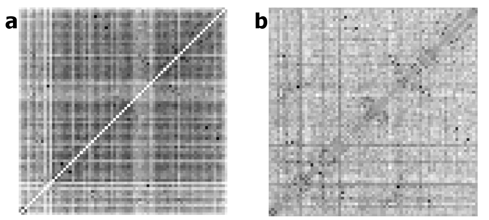

# Introduction {#general-intro}

dsfgdsfg $\AA$ ds dfg 


In his Nobel Prize speech in 1973 [@Anfinsen1973] Anfinsen postulated one of the basic principles in molecular biology, which is known as *Anfinsen's dogma*: a protein's native structure is uniquely determined by its amino acid sequence. 
With certain exceptions (e.g. [IDP](#abbrev) [@Wright1999]), this dogma has proven to hold true for the majority of proteins.

Ever since, it is regarded as the biggest challenge in structural bioinformatics [@Samish2015], to realiably predict a protein's structure given only its amino acid sequence. 
*De-novo* protein structure prediction methods use physical or knowledge based energy potentials to find a protein conformation that minimizes the protein's energy landscape. 
However, these methods are limited by the complexity of the conformational space and the accuracy of the energy potentials. 
Considering a protein with 150 amino acids, that has approximately 450 degrees of freedom, 
Regarding the rotational and translational degrees of freedom of the protein chain, the complexity scales with XXX [@Anfinsen1973].

Far more successfull are template-based modelling approaches. 
Given the observation that structure is more conserved than sequence in a protein family [@Lesk1980], the structure of a target protein can be inferred from a homologue protein [@Sander1991]. 
The degree of structural conservation is linked to the level of pairwise sequence identity [@Chothia1986]. 
Therefore, the accuracy of a model crucially depends on the sequence identity between target and template and determines the applicability of the model [@Marti-Renom2000]. 
By definition, homology derived models are unable to capture new folds [@Dorn2014] and their main limitation lies in the availability of suitable templates.  


```{r seq-str-gap, echo = FALSE, screenshot.alt="img/amino_acid_physico_chemical_properties_venn_diagramm.png",out.width = '100%', screenshot.alt="img/amino_acid_physico_chemical_properties_venn_diagramm.png", fig.cap = 'Yearly growth of number of solved structures in the PDB[@Berman2000] and protein sequences in the Uniprot[@TheUniProtConsortium2013].'}
knitr::include_url("img/pdb_growth.html", height = "750px")
```

Unfortunately, the number of solved protein structures increases only slowly, as experimental methods are both time consuming and expensive [@Dorn2014].
The [PDB](#abbrev)[@Berman2000] is the main repository for marcomolecular structures and currently (Jul 2017) holds about 120 000 atomic models of proteins. 
The primary technique for determining protein structures is X-ray crystallography, accounting for roughly 90% of entries in the [PDB](#abbrev). 
About 9% of protein structures have been solved using [NMR](#abbrev) and less than 1% using [EM](#abbrev) (see FIG 1).

All three experimental techniques have advantages and limitations with respect to certain modelling aspects.
X-ray crystallography requires the protein to form crystals, which is an arduous and sometimes impossible task. 
Furthermore, crystal packing forces the protein into a unnatural and rigid environment preventing the observation of conformational flexibility. 
NMR studies the protein in an physiological environment in solution and enables the study of protein dynamics as ensembles of protein structures can be observed. However, NMR is limited to look at small proteins. 
Recently, EM has undergone a "resolution revolution" [@Egelman2016] and macromolecular structures have been solved with resolutions up to 2A[citation]. 
The limit of cryo-EM lies in the size of proteins.

Compared to the tedious task of revealing atomic resolution of a protein tertiary structure, it has become very easy to decipher the primary sequence of proteins. 
With the latest sequencing technologies [examples], it takes only hours to sequence millions of basepaires at low costs [example numbers] and the number of sequenced genomes has risen tremendously.
The UniProtKB [@TheUniProtConsortium2013], the leading resource for protein sequences, contains more than 80 million sequence entries (24 July 2017). 
 
Consequently, the gap between the number of protein structures and sequences is still growing and even new developments as single protein structure determination [@CITE] are not expected to close this gap near in time.
[Figure sequence structure gap]

Protein structure determines protein function. Therefore, structural insights are of uttermost importance. They are essential for a detailed understanding of chemical reactions, regulatory processes and transport mechanisms.
They are fundamental for the design of drugs and antibiotics. Moreover structural abnormalities can lead to misfolding and aggregation potentially causing diseases so studying them is pathologically relevant.

The aformentioned trends illustrate the need of computational methods and motivate research to solve *Ansinsens Dogma* to reliably predict protein structures from sequence alone. 

## Protein Structure

- Primary: Amino Acid Sewuence
- Secondary: Helices, sheets, coils, repeats,..
- tertiary: interaction of secondary structure elementws
- quartary: interaction of domains


### Amino Acid Interactions {#amino-acid-interactions}

The Venn diagram in figure \@ref(fig:amino-acid-physico-chemical-properties) displays a typical classification of amino acids with respect to their physico-chemical properties. 


The aromatic amino acids tryptophan (W), tyrosine (Y), phenylalanine (F), and histidine (H) contain an aromatic ring system. 
Generally, aromatic ring systems are planar, and electons are shared over the whole ring structure.
Interactions between aromatic residues have very constrained geometries regarding the angle between the centroid of their rings. 
The $\pi$-electron systems favour T-shaped or offset stacked conformations [@Waters2002].
Preferred distances between aromatic residues have been observed between 4.5$\AA \; \;$ and 7$\AA \; \;$ of their ring centroids [@Burley1985].

Cysteine (C) residues can form disulphide bonds, which are the only covalent bonds between two amino acid side chains.
They comprise the strongest side chain interactions in protein structures and their length varies between 3.5$\AA \; \;$ to 4$\AA \; \;$.
Disulphide bonds also have a well defined geometry: there are five dihedral angles in a disulphide bond resulting in 20 different possible configurations. 
Only one configuration is favoured so that the dihedral angle between the carbon and sulfur atoms is close to 90 degrees [@Thornton1981].
They play a very important role in stabilizing protein structures. 
The number of disulfide bonds is negatively correlated with protein length: smaller proteins have more disulfide bonds helping to stabilize the structure in absence of strong hydrophobic packing in the core.
It has also been found that disulfide bonds are more frequently observed in proteins of hyperthermophilic bacteria, being positively selected for increased stability [@Bastolla2005].

Salt bridges are based on electrostatic interactions between positively charged residues (arginine (R) and lysine (K)) and negatively charged residues (aspartic acid (D) and glutamic acid (E)). 
The strength of electrostatic interactions, as described by Coulomb's law, decreases with distance between the point charges at the functional groups. 
It has been found to be maximal at 4$\AA \; \;$ with respect to the functional groups of the both residues [@Donald2011].

Hydrogen bonds can be formed between a donor residue which possesses an hydrogen atom attached to a strongly electronegative atom and an acceptor residue which possesses an electronegative atom with a lone electron pair. 
They are electrostatic interactions as well and thus their strength depends on distance as well. 
Hydrogen bonds are formed at distances of 2.4$\AA \; \;$ to 3.5$\AA \; \;$ between the non-hydrogen atoms (Berg JM, Tymoczko JL, 2002).

Salt bridges as well as hydrogen bonds have strong geometric preferences (Kumar and Nussinov, 1999). 
The geometry of a hydrogen bond depends on the angle between the HB donor, the hydrogen atom and the HB acceptor (Torshin et al., 2002).

Cation–$\pi$ interactions are formed between positively charged or partially charged amino acids with amino groups (K,R,Q,E) and aromatic residues (W,Y,F,H). 
The preferential distance of the amino group to the $\pi$-electron system has been determined between 3.4$\AA \; \;$ and 6$\AA \; \;$ [@Burley1986] [@Crowley2005]
Their role in stabilizing protein structures is still under debate [@Slutsky2004].

Proline residues are conformationally restricted, with the alpha-amino group of the backbone directly attached to the side chain. 
The sterical rigidity of the proline side chain restricts the backbone angle and thus affects secondary structure formation.
Proline is known as a helix-breaker. 
Whereas other aromatic side chains are defined by their negatively charged $\pi$ faces, the face of proline side chains is partially positively charged.
Thus, aromatic and proline residues can interact favorably with each other.
Once due to the hydrophobic nature of the residues and also due to the interaction between the negatively charged aroamtic $\pi$ face and the polarized C-H bonds in proline, called a CH/$\pi$  interaction.

Petersen et al. (2012) found clear secondary structure elements preferences for each amino acid pair. 
For example, residue pairs containing Alanine and Leucine are predominantly found in buried $\alpha$-helices, whereas pairs containing Isoleucine and Valine preferentially are located in $\beta$-sheet environments. 
Of course, solvent accessibility represents an important criterion for residue interactions. 
Hydrophobic residues are rather buried in the structure, whereas polar and charged residues are found more frequently on the protein surface and interact with water molecules.

```{r amino-acid-physico-chemical-properties, echo = FALSE, out.width = '50%',  fig.cap = 'Physico-chemical properties of amino acids. The 20 naturally occuring amino acids are grouped with respect to ten physico-chemical properties. Adapted from Figure 1a in [@Livingstone1993].'}

```


## Structure Prediction

Despite the knowledge of Anfinsen's postulate, we are not able to reliably predict the structure of a protein from its sequence alone. Generally it is assumed that a protein folds into a unique, well-defined native structure that is near the global free energy minimum (fig:folding_funnel). Levinthal's paradox [@Levinthal1969] describes the complexity of the folding process towards this minimum. It stresses the problem that it is not possible for a protein to exhaustively search the conformational space to get to its native fold. Due to the "combinatorial explosion" of possible conformations, an exhaustive search would take unreasonably long. Hence, it is not a feasible approach for structure prediction to scan all possible conformations. Different approaches have been developed over time to overcome or elude this problem.


### Template-based methods

Homology modeling is by far the most successful approach to structure prediction. 
The basic concept of this strategy relates to the fact that structure is more conserved than sequence [@Lesk1980]. 
After detecting a homologous protein of known structure, that has sufficient sequence similarity, it can be used as a template to model the structure of the target protein.

The degree of structural conservation is linked to the level of pariwise sequence identity [@Chothia1986]. 
Homology Modelling is assumed to yield reliably accurate models when query and target protein share more than 30$\%$ sequence similarity, depending on the sequence length (*safe homology zone*) [@Sander1991]. 
Below a threshold of ~20-35% pairwise sequence identity (*twighlight-zone*) the number of false positives regarding structural similarity explodes and structural inference becomes less reliable and more than 95% of structures are dissmilar [@Rost1999]. 
Advances in remote homology detection and alignment generation have improved the quality of models, even beyond the once postulated limit of the *twighlight-zone* [@Yan2013].
Integration of multiple templates has also proved to increase model quality [@Meier2015]

After the identification of a suitable template, there are different strategies that can be followed to obtain a model for the target protein. 
The the backbone of the model is generated by simply copying the coordinates of the target backbone atoms onto the model. 
Non-aligned residues due to gaps in the alignment have to be modelled $\textit{de-novo}$, meaning from scratch.
This can be done by a knowledge-based search for suitable fragments in the PDB or by true energy-based $\textit{de-novo}$ modelling. 
When the backbone is generated, the side chains are modelled, usually by searching rotamer libraries for energetically favoured residue conformations. 
Finally, the model is energetically optimized in an iterative procedure. 
Force fields are applied to correct the backbone and side chain conformations [@Gu2009]. 
Several automated pipelines for homology modelling are well-established (Modeller [@Eswar2007], 3D-Jigsaw [@Bates2001], SwissModel [@Arnold2006]) which allow more or less manual intervention in the modelling process. 

        
Fold Recognition describes the inverse folding problem [Bowie1993]: instead of finding the compatible structure for a given sequence, one tries to find sequences that fit onto a given structure. Whether the query sequence fits a structure from the database is not determined by sequence similarities but rather energetic or environment specific measures. Thus, fold recognition methods are able to recognize structural similarity even in the absence of sequence similarity. The rationale basis for this strategy is the assumption that the fold space is limited. It has been found that seemingly unrelated proteins often adopt similar folds. This might be due to divergent evolution (proteins are related, but homology cannot be detected at the corresponding sequence level) or convergent evolution (functional requirements lead to similar folds for unrelated proteins) [Gu2009]. Early approaches include profile based methods. Here, the structural information of the protein is encoded into profiles, which subsequently are aligned to the sequences [Bowie1991,Fischer1996,Ouzounis1993]. Advanced techniques are known as  "threading" techniques, describing the process of threading a sequence through a structure and determining the optimal fit via energy functions. [Jones1992,Jones1998,Lemer1995]


### Template-free structure prediction

Ab initio or de-novo modeling techniques implement Anfinsen’s Dogma most closely in mimicking the folding process based only on physico-chemical principles.
Energy functions (physical or knowledge-based) are used to describe the folding landscape and are minimized to arrive at the global energy minimum corresponding to the native conformation. 
Since the native conformation can be found near the global energy minimum of the folding landscape, energy functions (physical or knowledge-based) have been developed to describe this landscape.
With respect to the idea of a folding funnel, the energy function is minimized to mimic the folding process that automatically leads to the global minimum.
 Again, there exist numerous webservers that combine energy minimization,  threading techniques and fragment-based approaches, e.g. Rosetta [\citep{]Simons1999], Tasser [Zhang2004, Touchstone II Zhang2003].

Drawbacks of these methods are the time requirements due to the computational complexity of energy functions as well as their inaccuracy. 
    
    

Minimize a physical or knowledge-based energy function for the protein. This has huge complexity due to large conformational space that needs to be sampled. 

### contact assisted de-novo predictions {#contact-assisted-str-pred}

Structure Reconstruction from true contacts maps works well. Even a small number of contacts is sufficient to reconstruct the fold of the protein. Distance maps work even better. 

What is the optimal distance cutoff to define a contact? 
Duarte et al 2010: between 8 and 12A
Dyrka et al 2016
Konopka et al 2014
Sathyapriya et al 2009

Many studies that successfuly predict structures denovo with the help of predicted contact.

Vice versa, because contacts at large primary distances are rare, they are most informative for protein structure prediction: Izarzugaza J, Gran ˜a O, Tress M, Valencia A, Clarke N (2007) Assessment of intramolecular contact predictions for CASP7


## Contact Prediction

Contact prediction refers to the prediction of physical contacts between amino acid side chains in the 3D protein structure, given the protein sequence as input. 

Historically, contact prediction was motivated by the idea that compensatory mutations between spatially neighboring residues can be traced down from evolutionary records [@Gobel1994].
As proteins evolve, they are under selective pressure to maintain their function and correspondingly their structure.
Consequently, residues and interactions between residues constraining the fold, protein complex formation, or other aspects of function are under selective pressure.
Highly constrained residues and interactions will be strongly conserved [@Godzik1989]. 
Another possibility to maintain structural integrity is the mutual compensation of unbeneficial mutations.
For example, the unfavourable mutation of a small amino acid residue into a bulky residue in the densely packed protein core might have been compensated in the course of evolution by a particularly small side chain in a neighboring position. 
Other physico-chemical quantities such as amino acid charge or hydrogen bonding capacity can also induce compensatory effects[@Neher1994].
In a [MSA](#abbrev) of a protein family, evolutionary related amino acid sequences that have descended from a common ancestor are aligned in a way that the homologous residues line up with each other in columns. 
According to the hypothesis, compensatory mutations show up as correlations between the amino acid types of pairs of [MSA](#abbrev) columns and can be used to infer spatial proximity of residue pairs (see Figure \@ref(fig:correlated-mutations)).

(ref:caption-correlated-mutations)  The evolutionary record of a protein family reveals evidence of compensatory mutations between spatially neighboring residues that are under selective pressure with respect to some physico-chemical constraints. Mining protein family sequence alignments for residue pairs with strong coevolutionary signals using statistical methods allows inference of spatial proximity for these residue pairs.

```{r correlated-mutations, echo = FALSE, out.width = '80%', fig.align = 'center', fig.cap = '(ref:caption-correlated-mutations)'}
knitr::include_graphics("img/intro/correlated-mutations-transparent.png")
```

The following sections will give an overview over important methods and developments in the field of contact prediction.

### Local Statistical Models {#local-methods}

Early contact prediction methods used local pairwise statistics to infer contacts that regard pairs of amino acids in a sequence as statistically independent from another.
A significant drawback of these methods is their inability to account for transitive effects arising from chains of correlations between multiple residue pairs as described in the section on [Transitive Effects].

Several of these methods use correlation coefficient based measures, such as Pearson correlation between amino acid counts, properties associated with amino acids or mutational propensities at the sites of a [MSA](#abbrev) [@Neher1994; @Taylor1994; @Gobel1994; @Oliveira2002; @Shindyalov1994]. 

Many methods have been developed that are rooted in information theory and use [MI](#abbrev) measures to describe the dependencies between sites in the alignment [@Clarke1995; @Korber1993; @Martin2005].
Phylogenetic and entropic biases have been identified as the major sources of noise that confound the true coevolution signal [@Atchley2000; @Fodor2004; @Martin2005].
Different variants of [MI](#abbrev) based approaches address these effects and improve on the signal-to-noise ratio [@Atchley2000; @Tillier2003; @Gouveia_Oliveira2007].
The most prominent correction for background noises is [APC](#abbrev) that drastically removes background noise attributed to entropic effects and is discussed in section  \@ref(post-processing-heuristics) [@Dunn2008].

Another popular method is *OMES* that essentially computes a chi-squared statistic to detect the differences between observed and expected pairwise amino acid frequencies for a pair of columns [@Kass2002; @Noivirt2005].

Eventhough these methods cannot compete with modern predictors, *OMES* and [MI](#abbrev) based scores often serve as a baseline in performance benchmarks for contact prediction [@DeJuan2013; @Jones2012].

### Global Statistical Models {#global-methods}

A huge leap forward was the development of sophisticated statistical models that make predictions for a single residue pair while considering all other pairs in the protein.
These global models allow for the distinction between transitive and causal interactions which has been referred to in the literature as [DCA](#abbrev) [@Lapedes1999; @Weigt2009].

In 1999 Lapedes et al. were the first to propose a global statistical approach for the prediction of residue-residue contacts in order to disentangle  transitive effects [@Lapedes1999].
They consider a Pott's model that can be derived under a maximum entropy assumption and use the model specific coupling parameters to infer interactions.
At that time the wider implications of this advancement went unnoted, but meanwhile the Pott's Model has become the most prominent statistical model for contact prediction.
Section \@ref(maxent) deals extensively with the derivation and properties of the Pott's model, its application to contact prediction and its numerous realizations.

A global statistical model not motivated by the maximum entropy approach was proposed by Burger and Nijmwegen in 2010 [@Burger2008; @Burger2010]. 
Their fast Bayesian network model incorporates additional prior information and phylogenetic correction via [APC](#abbrev) but cannot compete with the pseudo-likelihood approaches presented in section \@ref(pseudo-likelihood). 


### Machine Learning Methods and Meta-Predictors {#meta-predictors}


With the steady increase in protein sequence data, purely machine learning based methods emerged that are trained on features extracted from [MSAs](#abbrev).
Currently, the most accurate methods to predict residue-residue contacts are meta-predictors, combining one or several coevolution methods with sequence derived features and other sources of information. 
An overview of machine learning predictors is given in section \@ref(meta-predictors.)

These methods combine abundant information on sequence and
amino acid properties in order to learn associations between input features and residue-residue
contacts. Methods differ mainly in the type of the applied Machine Learning (ML) algorithm,
e.g Neural Networks (NNs), Support Vector Machines (SVMs) or Random Forests (RFs) and the
chosen input features, e.g. contact predictions, solvent accessibility, physico-chemical properties
of amino acids, secondary structure predictions or evolutionary information. (Kukic et al.,
2014; Alfonso Marquez-Chamorro, 2013; Li et al., 2011) The problem with these methods is
interpretability, as it is diffcult to elucidate which feature patterns contribute in which amount
to the model.


- combining different approaches
 - jones et al: overlap between methods but also many unique predictions
- machine learning methods incorporate sequence-derived features:
  - secondary structure predictions
  - solvent accessibilty
  - contact potentials
  - msa properties
  - pssms 
  - physico-chemcial properties of amino acids

However, Meta-predictors will improve if basic methods improve. Ultra-deep learning paper identifies coevolution features as crucial feature. 


## Modelling Protein Families with Potts Model {#maxent}

It has been shown that global statistical models, that models the joint probability distribution over all residues in the protein sequence is able to disentangle direct from indirect effects.
A well motivated and well established model in statistical physics is the Potts model that has used by all successfull methods.
 
The Potts model is well motivated as the solution having maximal entropy and is derived in the following.

The principle of maximum entropy, proposed by Jaynes in 1957 [@Jaynes1957a; @Jaynes1957b], states that the probability distribution which makes minimal assumptions and best represents observed data is the one that is in agreement with measured constraints (prior information) and has the largest entropy. 
In other words, from all distributions that are consistent with measured data, the distribution with maximal entropy should be chosen.

A protein family is represented by a [MSA](#abbrev) $\X = \{ \seq_1, \ldots, \seq_N \}$ comprising $N$ aligned sequences.
Every sequence $\seq = (x_1, \ldots, x_L)$ is of length $L$ and the categorical variables $x_{i}$ can take one of $q=21$ values representing the 20 naturally occuring amino acids and a gap ('-').
The empirically observed single and pairwise amino acid frequencies can be calculated as

<!--
Applied to the problem of modelling protein families, one seeks a probability distribution $p(\seq)$ for protein sequences $\seq = (x_1, \ldots, x_L)$ of length $L$ from the protein family under study. 
The categorical variables $x_{i}$ can take one of $q=21$ values representing the 20 naturally occuring amino acids and a gap ('-').
Given $N$ sequences of the protein family in a [MSA](#abbrev) with $\X = \{ \seq_1, \ldots, \seq_N \}$, the empirically observed single and pairwise amino acid frequencies can be calculated as
-->

\begin{equation}
    \mathcal{f}_i(a) = \mathcal{f}(x_i\eq a) = \frac{1}{N}\sum_{n=1}^N I(x_{ni} \eq a) \\
    \mathcal{f}_{ij}(a,b) = \mathcal{f}(x_i\eq a, x_j\eq b) = \frac{1}{N} \sum_{n=1}^N I(x_{ni} \eq a, x_{nj} \eq b) \; .
 (\#eq:emp-freq)
\end{equation}


According to the maximum entropy principle, the distribution $p(\seq)$ should have maximal entropy and reproduce the empirically observed amino acid frequencies, so that

\begin{align}
   \mathcal{f}(x_i\eq a)            &\equiv p(x_i\eq a)  \\
                                    &= \sum_{\seq\prime_1, \ldots, \seq\prime_L = 1}^{q} p(x\prime) I(x\prime_i \eq a) \\
  \mathcal{f}(x_i\eq a, x_j\eq b)   &\equiv p(x_i\eq a, x_j \eq b) \\
                                    &= \sum_{\seq\prime_1, \ldots, \seq\prime_L = 1}^{q}  p(x\prime) I(x\prime_i\eq a, x\prime_j \eq b)  \; .
 (\#eq:maxent-reproducing-emp-freq)
\end{align}


Solving for the distribution $p(\seq)$ that maximizes the Shannon entropy $S= -\sum_{\seq\prime} p(\seq\prime) \log p(\seq\prime)$ while satisfying the constraints given in eq. \@ref(eq:maxent-reproducing-emp-freq) by introducing the Lagrange multipliers $\wij$ and $\vi$, 

<!--
\begin{align}
F \left[ p(\seq) \right] =& -\sum_{\seq\prime} p(\seq\prime) \log p(\seq\prime) \\
        & + \sum_{i=1}^L \sum_{a=1}^{q} \vi(a) \left( p(x_i\eq a) - \mathcal{f}(x_i\eq a) \right) \\
        & + \sum_{1 \leq i < j \leq L}^L \; \sum_{a,b=1}^{q} \wij(a,b) \left( p(x_i\eq a, x_j \eq b) - \mathcal{f}(x_i\eq a, x_j\eq b) \right) \\
        & + \Omega \left( 1-\sum_{\seq\prime} p(\seq\prime)  \right)
(\#eq:derivation-max-ent-model)
\end{align}
-->

results in the formulation of an exponential model known as *Potts model* in statistical physics or [MRF](#abbrev) in statistics,

\begin{equation}
    p(\seq | \v, \w ) = \frac{1}{Z} \exp \left( \sum_{i=1}^L v_i(x_i) \sum_{1 \leq i < j \leq L}^L w_{ij}(x_i, x_j) \right) \; .
(\#eq:max-ent-model)
\end{equation}

The Lagrange multipliers $\wij$ and $\vi$ remain as model parameters to be fitted to data.
$Z$ is a normalization constant also known as *partition function* that ensures the total probabilty adds up to one by summing over all possible assignments to $\seq$, 

\begin{equation}
  Z = \sum_{\seq\prime_1, \ldots, \seq\prime_L = 1}^{q} \exp  \left( \sum_{i=1}^L v_i(x_i) \sum_{1 \leq i < j \leq L}^L w_{ij}(x_i, x_j) \right) \; .
  (\#eq:partition-fct-likelihood)
\end{equation}


#### Model Properties 

The Potts model is specified by singlet terms $\via$ which describe the tendency for each amino acid a to appear at position $i$, and pair terms $\wijab$, also called couplings, which describe the tendency of amino acid a at position $i$ to co-occur with amino acid b at position $j$.
In contrast to mere correlations, the couplings explain the causative dependence structure between positions by jointly modelling the distribution of all positions in a protein sequence and thus account for transitive effects (see \@ref(local-methods)). 

Maximum entropy models naturally give rise to exponential family distributions that express useful properties for statistical modelling, such as the convexity of the likelihood function which consequently has a unique, global minimum [@Wainwright2007; @Murphy2012]. 

The Potts model is a discrete instance of what is referred to as a pairwise [Markov random field](#abbrev) in the statistics community.
[MRFs](#abbrev) belong to the class of undirected graphical models, that represent the probability distribution in terms of a graph with nodes and edges characterizing the variables and the dependence structure between variables, respectively.


##### Gauge Invariance {-}

As $x_{ni}$ can take $q=21$ values, the model has $L \! \times \! q + L(L-1)/2 \! \times \! q^2$ parameters but the parameters are not uniquely determined as multiple parametrizations yield identical probability distributions. 

For example, adding a constant $c_i$ to all elements in $v_i$ for any fixed position $i$ or similarly adding a constant $c_{ia}$ to $\via$ for any fixed position $i$ and amino acid $a$ and subtracting the same constant from the $qL$ coefficients $\wijab$ with $b \in \{1, \ldots, q\}$ and $j \in \{1, \ldots, L \}$ leaves the probabilities for all sequences under the model unchanged, since such a change will be compensated by a change of $Z$ in eq. \@ref(eq:partition-fct-likelihood).


The overparametrization, referred to as *gauge invariance* in statistical physics literature, can be eliminated by removing parameters.
An appropriate choice of which parameters to remove, referred to as *gauge choice*, reduces the number of parameters to $L \! \times \! (q-1) + L(L-1)/2 \! \times \! (q-1)^2$.
Popular gauge choices are the *zero-sum gauge* or *Ising-gauge* used by [@Weigt2009] imposed by the restraints,

\begin{equation}
    \sum_{a=1}^{q} v_{ia} = \sum_{a=1}^{q} \wijab = \sum_{a=1}^{q} w_{ijba} = 0
(\#eq:zero-sum-gauge)
\end{equation}

for all $i,j,b$  or the *lattice-gas gauge* used by [@Morcos2011; @Marks2011] imposed by restraints

\begin{equation}
    \wij(q,a) = \wij(a,q) = \vi(q) = 0
(\#eq:ising-gauge)
\end{equation}

for all $i,j,a$ [@Cocco2017].

Alternatively, the indeterminacy can be fixed by including a regularization prior (see next section).
The regularizer selects for a unique solution among all parametrizations of the optimal distribution and therefore eliminates the need to choose a gauge [@Koller2009; @Ekeberg2013;  @Stein2015a].


##### Regularization {-}

The number of parameters in a Potts model is typically larger than the number of observations, i.e. the number of sequences in the [MSA](#abbrev).
Considering a protein of length $L=100$, there are approximately $2 \times 10^6$ parameters in the model whereas the largest protein families comprise only around $10^5$ sequences (see Figure \@ref(fig:pfam)).
An underdetermined problem like this renders the use of regularizer neccessary in order to prevent overfitting.

Typically, an L2-regularization is used that pushes the single and pairwise terms smoothly towards zero and is equivalent to the logarithm of a zero-centered Gaussian prior,

\begin{align}
  R(\v, \w)  &= \log \left[ \mathcal{N}(\v | \mathbf{0}, \lambda_v^{-1} I) \mathcal{N}(\w | \mathbf{0}, \lambda_w^{-1} I) \right] \\
             &= -\frac{\lambda_v}{2} ||\v||_2^2 - \frac{\lambda_w}{2} ||\w||_2^2 + \text{const.} \; ,
(\#eq:l2-reg)
\end{align}

where the strength of regularization is tuned via the regularization coefficients $\lambda_v$ and $\lambda_w$ [@Seemayer2014; @Ekeberg2014; @Kamisetty2013].

#### Intractability of the Partition Function {#partition-function}

Typically, one obtains parameter estimates by maximizing the log-likelihood function of the parameters over observed data.
For the Potts model, the log-likelihood function is computed over sequences in the alignment $\mathbf{X}$: 

\begin{align}
    \text{LL}(\v, \w | \mathbf{X}) =& \sum_{n=1}^N \log p(\seq_n) \\
    =& \sum_{n=1}^N \left[ \sum_{i=1}^L v_i(x_{ni}) + \sum_{1 \leq i < j \leq L}^L w_{ij}(x_{xn}, x_{nj}) - \log Z \right] \\
(\#eq:full-log-likelihood)
\end{align}

However, optimizing the log-likelihood requires computing the partition function $Z$ given in eq. \@ref(eq:partition-fct-likelihood) that sums $q^L$ terms, with $L$ being in the hundreds for naturally occurig protein domains.
Because of this exponential complexity in protein length $L$, it is computationally intractable to evaluate the log-likelihood function at every iteration of an optimization procedure. 

Several approximate solutions have been developed to sidestep the infeasible computation of the partition function for the specific problem of predicting contacts between residues that are briefly explained in the next section. 

#### Solving the Inverse Potts Problem

In 1999 Lapedes et al. were the first to propose maximum entropy models for the prediction of residue-residue contacts in order to disentangle  transitive effects [@Lapedes1999].
They used an iterative Monte Carlo procedure to obtain estimates of the partition function. 
As the calculations involved were very time-consuming and at that time required supercomputing resources, the wider implications were not noted yet.

In 2009 Weight et al proposed an iterative message-passing algorithm, here referred to as *mpDCA*, to approximate the partition function [@Weigt2009].
Eventhough their approach is computationally very expensive and in practive only applicable to small proteins, they obtained remarkable results for the two-component signaling system in bacteria.

Balakrishnan et al [@Balakrishnan2011] were the first to apply pseudo-likelihood approximations to the full likelihood in 2011. 
The pseudo-likelihood optimizes a different objective and replaces the global partition function $Z$ with local estimates.
Balakrishnan and colleagues applied their method *GREMLIN* to learn sparse graphical models for 71 protein families.
In a follow-up study in 2013 [@Kamisetty2013], an improved version of *GREMLIN* incorporating prior information was evaluated in a comprehensive benchmark tailored towards the contact prediction problem.

Also in 2011, Morcos et al. introduced a naive mean-field inversion approximation to the partition function, named *mfDCA* [@Morcos2011].
This method allows for drastically shorter running times as the mean-field approach boils down to inverting the empirical covariance matrix calculated from observed amino acid frequencies for each residue pair $i$ and $j$ of the alignment.
This study performed the first high-throughput analysis of intradomain contacts for 131 protein families and facilitated the prediction of protein structures from accurately predicted contacts in [@Marks2011].

The initial work by Balakrishnan and collegueas went almost unnoted as it was not primarily targeted to the problem of contact prediction.
Ekeberg and collegueas independently developed the pseudo-likelihood method *plmDCA*  and showed its superior precision towards *mfDCA* [@Ekeberg2013].

A related approach to mean-field approximation is sparse inverse covariance estimation, named *PSICOV*, by Jones et al [@Jones2012]. 
They use L1-regularization, known as graphical Lasso, to invert the correlation matrix and learn a sparse graphical model [@Friedman2008].
Both procedures, *mfDCA* and *PSICOV*, assume the model distribution to be a multivariate Gaussian. 
It has been shown by Banerjee et al. (2008) that this dual optimization solution also applies to binary data (as is the case in this application). 
In order to represent the [MSA](#abbrev) as continuous distributed, each position is encoded as a 20-dimensional binary vector. 

Another related approach to *mfDCA* and *PSICOV* is *gaussianDCA*, proposed in 2014 by Baldassi et al. [@Baldassi2014].
Similar to the other both approaches, they model the data as multivariate Gaussian but within a simple Bayesian formalism by using a suitable prior and estimating parameters over the posterior distribution.

So far, pseudo-likelihood maximization has proven to be the most accurate approach with respect to the standard evaluation procedures for contact prediction presented in the following section. 
Currently, there exist several implementations of pseudo-likelihood maximization that vary in slight details, perform similarly and thus are equally popular in the community, such as CCMpred [@Seemayer2014], plmDCA[@Ekeberg2014] and GREMLIN [@Kamisetty2013].

#### Pseudo-Likelihood {#pseudo-likelihood}

Instead of the full likelihood, Besag suggested to optimize a different objective function that he called *pseudo-likelihood* [@Besag1975].
The pseudo-likelihood approximates the joint probability with the product over conditionals for each variable, i.e. the conditional probability of observing one variable given all the others:

\begin{equation}
  p(\seq | \v,\w) \approx   \prod_{i=1}^L p(x_i | \seq_{\backslash xi}, \v,\w) =  \prod_{i=1}^L \frac{1}{Z_i} \exp \left(  v_i(x_i) \sum_{1 \leq i < j \leq L}^L w_{ij}(x_i, x_j) \right)
\end{equation}

Here, the normalization term $Z_i$ sums only over all assignments to one position $i$ in sequence:

\begin{equation}
  Z_i = \sum_{a=1}^{q} \exp \left( v_i(a) \sum_{1 \leq i < j \leq L}^L w_{ij}(a, x_j) \right)
(\#eq:partition-fct-pll)
\end{equation}


Replacing the global partition function in the full likelihood with local estimates of lower complexity in the pseudo-likelihood objective resolves the computational intractability of the parameter optimization procedure.
Hence, it is feasible to maximize the pseudo-log-likelihood function,

\begin{align}
    \text{pLL}(\v, \w | \mathbf{X}) =& \sum_{n=1}^N \sum_{i=1}^L \log p(x_i | \seq_{\backslash xi}, \v,\w) \\
    =& \sum_{n=1}^N \sum_{i=1}^L  \left[ v_i(x_{ni}) + \sum_{j=i+1}^L  w_{ij}(x_{ni}, x_{nj}) - \log Z_{ni} \right] \;,
\end{align}

plus an additional regularization term in order to prevent overfitting and to fix the gauge (see section on [Gauge Invariance] and eq. \@ref(eq:l2-reg)) to arrive at a [MAP](#abbrev) estimate of the parameters, 

\begin{equation}
    \hat{\v}, \hat{\w} = \underset{\v, \w}{\operatorname{argmax}} \; \text{pLL}(\v, \w | \mathbf{X}) + R(\v, \w) \; .
\end{equation}


Eventhough the pseudo-likelihood optimizes a different objective than the full-likelihood, it has been found to work well in practice for many problems, including contact prediction [@Koller2009; @Murphy2012; @Stein2015a; @Ekeberg2013].
The pseudo-likelihood function retains the concavity of the likelihood and it has been shown to be a consistent estimator in the limit of infinite data for models of the exponential family [@Besag1975; @Gidas1988; @Koller2009]. 
That is, as the number of sequences in the alignment increases, pseudo-likelihood estimates converge towards the true full likelihood parameters.


#### Computing Contact Maps {#post-processing-heuristics}

Model inference as described in the last section yields [MAP](#abbrev) estimates of the couplings $\hat{\w}_{ij}$. 
In order to obtain a scalar measure for the coupling strength between two residues $i$ and $j$, current methods heuristically map the $q \! \times \! q$ dimensional coupling matrix $\wij$ to a single scalar quantity.

*mpDCA* [@Weigt2009] and *mfDCA* [@Morcos2011; @Marks2011] employ a score called [DI](#abbrev), that essentially computes the [MI](#abbrev) for two positions $i$ and $j$ using the couplings $\wij$ instead of pairwise amino acid frequencies.
However, [DI](#abbrev) scores have quickly been replaced by the Frobenius norm as it was found to improve prediction performance over [DI](#abbrev) [@Ekeberg2013; @Baldassi2014].

Currently, all pseudo-likelihood methods (*plmDCA* [@Ekeberg2013; @Ekeberg2014], *CCMpred* [@Seemayer2014], *GREMLIN* [@Kamisetty2013]) compute the *Frobenius norm* of the coupling matrix $\wij$ to obtain a scalar contact score $C_{ij}$,

\begin{equation}
    C_{ij}  = ||\wij||_2 = \sqrt{\sum_{a,b=1}^q \wijab^2} \; .
(\#eq:frobenius-norm)
\end{equation}

It was found that prediction precision improves further when the Frobenius norm is computed only on the $20 \times 20$ submatrix, thus ignoring contributions from gaps [@Feinauer2014].
*PSICOV* [@Jones2012] uses an L1-norm on the $20 \times 20$ submatrix instead of the Frobenius norm.

The Frobenius norm is gauge dependent and is minimized by the *zero-sum gauge* [@Weigt2009].
Therefore, in [@Ekeberg2013; @Ekeberg2014; @Seemayer2014; @Baldassi2014] the coupling matrices are transformed to *zero-sum gauge* before computing the Frobenius norm:

\begin{equation}
    \w\prime_{ij}  = \wij - \wij(\cdot, b) - \wij(a, \cdot) + \wij(\cdot, \cdot) \; ,
(\#eq:zero-sum-gauge-transform)
\end{equation}

where $\cdot$ denotes average over the respective indices.


Another commonly applied heuristic known as [APC](#abbrev) has been found to substantially boost contact prediction performance [@Dunn2008; @Kamisetty2013].
Dunn et al. introduced [APC](#abbrev) in order to remove the influence of background noise arising from correlations between positions with high entropy or phylogenetic couplings [@Dunn2008].
[APC](#abbrev) was first adopted by *PSICOV* [@Jones2012] but is now used by most methods to adjust scores.
It substracts a term that is computed as the product over average row and column contact scores $\overline{C_i}$ divided by the average contact score over all pairs $\overline{C_{ij}}$,

\begin{equation}
    C_{ij}^{APC}  = C_{ij} - \frac{\overline{C_i} \; \overline{C_j}}{\overline{C_{ij}}}\; .
(\#eq:apc)
\end{equation}


It was long under debate why [APC](#abbrev) works so well and how it can be interpreted. 
Zhang et al. showed that [APC](#abbrev) essentially approximates the removal of the first principal component of the contact matrix and therefore removes the highest variability in the matrix that is assumed to arise from background biases [@Zhang2016].
Furthermore, they studied an advanced decomposition technique, called low-rank and sparse matrix decomposition (LRS), that decomposes the contact matrix into a low-rank and a sparse component, representing background noise and true correlations, respectively.  
Inferring contacts from the sparse component works astonishing well, improving precision further over [APC](#abbrev) independent of the underlying statistical model.

Dr Stefan Seemayer could show that the main component of background noise can be attributed to entropic effects and that a substantial part of [APC](#abbrev) amounts to correcting for these entropic biases (unpublished).
In his doctoral thesis, he developed a proper entropy correction, computed as the geometric mean of per-column entropies, that correlates well with the [APC](#abbrev) correction term and yields similar precision for predicted contacts.
The entropy correction has the advantage that it is computed from input statistics and therefore is independent of the statistical model used to infer the couplings.
In contrast, [APC](#abbrev) and other denoising techniques such as LRS [@Zhang2016] discussed above, estimate a background model from the final contact matrix, thus depending on the statistical model used to infer the contact matrix. 

The general "smoothing" effect observed when applying [APC](#abbrev) that can mainly be attributed to removing entropy bias is illustrated in Figure \@ref(fig:apc-correction).

(ref:caption-apc-correction) Contact Matrices computed from  pseudo-likelihood couplings. **a**: Contact map computed with Frobenius norm as in eq. \@ref(eq:frobenius-norm). Overall coupling values are dominated by entropic effects, i.e. the amount of variation for a [MSA](#abbrev) position, leading to striped patterns. **b**: Contact map from (a) corrected for background noise with the [APC](#abbrev) as in eq. \@ref(eq:apc).

```{r apc-correction, echo = FALSE, out.width = '100%', fig.show = 'hold', fig.cap = '(ref:caption-apc-correction)'}

```


## Evaluating Contact Prediction Methods {#intro-cp-evaluation}

Choosing an appropriate benchmark for contact prediction methods is determined by the further utilization of the predictions.
Most prominently, predicted contacts are used to assist structure prediction as outlined in section \@ref(contact-assisted-str-pred).
Therefore, one could assess the quality of structural models computed with the help of predicted contacts.
However, predicting structural models adds not only another layer of computational complexity but also raises questions about implementation details of the folding protocol. 
It has been found that in general a small number of accurate contacts is sufficient to constrain the overal protein fold as discussed in section \@ref(contact-assisted-str-pred).


From these considerations emerged various standard benchmarks that have been established by the [CASP](#abbrev) community over many years [@Monastyrskyy2011; @Monastyrskyy2014a; @Monastyrskyy2015].
[CASP](#abbrev), the well-respected and independent competition for the structural bioinformatic's community introduced the contact prediction category in 1996.
Taking place every two years, the progress in the field is assessed in a blind competition and the community discusses the outcome in a subsequent meeting. 

According to the [CASP](#abbrev) regulations, a pair of residues is defined to be in physical contact when the distance between their $\Cb$ atoms ($C\alpha$ in case of glycine) is less than 8 $\AA \; \;$ in the reference protein structure.
The overall performance of a contact predictor is evaluated by the mean precision over a testset of proteins with known high quality 3D structures against the top scoring predictions from every protein.
The number of top scoring predictions per protein is typically normalized with respect to protein length $L$ and precision is defined as the number of true contacts among the top scoring predicted contacts.

A popular variant of this benchmark plot shows the mean precision of a certain fraction of top ranked predictions (e.g. L/5 top ranked predictions) against specific properties of the test proteins such as protein length or alignment depth.

During CASP11 further evaluation metrics have been introduced, such as Matthews correlation coefficient, area under the precision-recall curve or F1 measure but they are rarely used in studies [@Monastyrskyy2015].

Currently best methods perform in the range XXX
TODOOOPLOT

### Sequence Separation {#seq-sep}


Local residue pairs separated by only some positions in sequence (e.g $|i-j| < 6$) are usually filtered out for evaluation of contact prediction methods.
They are trivial to predict as they typically correspond to contacts within secondary structure elements and reflect the local geometrical constraints.
Figure \@ref(fig:Cb-distribution) shows the distribution of $\Cb$ distances for various minimal sequence separation thresholds. 

(ref:caption-Cb-distribution) Distribution of residue pair $\Cb$ distances over 6741 proteins in the dataset (see Methods \@ref(dataset)) at different minimal sequence separation thresholds.

```{r Cb-distribution, echo = FALSE, screenshot.alt="img/dataset_statistics/Cb_distribution_all_data43579541_log.png", out.width = '100%', fig.cap = '(ref:caption-Cb-distribution)'}
knitr::include_url("img/dataset_statistics/Cb_distribution_all_data43579541_log.html", height="500px")
```

Without filtering local residue pairs (sequence separation 1), there are several additional peaks in the distribution around $5.5\AA  \; \;$, $7.4\AA \; \;$ and $10.6\AA \; \;$ that can be attributed to local interactions in e.g. helices (see Figure \@ref(fig:peaks-Cb-distribution)).
 
(ref:caption-peaks-Cb-distribution) $\Cb$ distances between neighboring residues in $\alpha$-helices. Left: Direct neighbors in $\alpha$-helices have $\Cb$ distances around $5.4\AA \; \;$ due to the geometrical constraints from $\alpha$-helical architecture. Right: Residues separated by two positions ($|i-j| = 2$) are less geometrically restricted to $\Cb$ distances between $7\AA \; \;$ and $7.5\AA \; \;$.

```{r peaks-Cb-distribution, echo = FALSE, out.width = '400px', fig.show = 'hold', fig.align='center', fig.cap = '(ref:caption-peaks-Cb-distribution)'}
knitr::include_graphics(c("img/dataset_statistics/cb_distribution_peak_5-6.png","img/dataset_statistics/cb_distribution_peak_7.png"))
```

Commonly, sequence separation bins are applied to distuinguish short ($6 < |i-j| \le 12$), medium ($12 < |i-j| \le 24$) and long range ($|i-j| > 24$) contacts [@Monastyrskyy2015; @Monastyrskyy2014a].
Especially long range contacts are of importance for structure prediction as they are the most informative and able to constrain the overal fold of a protein [@CITE].


## Challenges in Coevolutionary Inference {#challenges}

Coevolution methods face several challenges when interpreting the covariation signals obtained from a [MSA](#abbrev). 
Some of these challenges have been successfully met (e.g. disentangling transitive effects with global statistical models), others are still open or open up new perspectives, such as dissecting different sources of coevolution signals. 


### Phylogenetic Bias {-}

Sequences in [MSAs](#abbrev) do not represent independent samples of a protein family. 
In fact, there is selection bias from sequencing species of special interest (e.g human pathogens) or sequencing closely related species, e.g multiple strains. 
This uneven sampling of a protein family's sequence space leaves certain regions unexplored whereas others are statistically overrepresented [@Morcos2011; @Marks2012]. 

Furthermore, due to their evolutionary relationship, sequences of a protein family have a complicated dependence structure.
Closely related sequences can cause spurious correlations between positions, as there was not sufficient time for the sequences to diverge from their common ancestor [@Gouveia_Oliveira2007; @Lapedes1999; @Burger2010]. 
Figure \@ref(fig:phylogenetic-effect) illustrates a simplified example, where dependence of sequences due to phylogeny leads to a covariation signal.

(ref:caption-phylogenetic-effect) The phylogenetic dependence of closely related sequences can produce covariation signals. Here, two independent mutation events in two branches of the tree result in a perfect covariation signal for two positions.

```{r phylogenetic-effect, echo = FALSE, out.width='50%', fig.align='center', fig.cap = '(ref:caption-phylogenetic-effect)'}
knitr::include_graphics("img/intro/phylogenetic_effect.png")
```

To reduce the effects of redundant sequences, a popular sequence reweighting strategy has been found to improve contact prediction performance, where every sequence receives a weight that is the inverse of the number of similar sequences according to an identity threshold (see section \@ref(seq-reweighting)) [@Buslje2009; @Morcos2011; @Jones2012]. 


#### Entropic bias {-}

Another source for noise is entropy bias that is closely linked to phylogenetic effects.
By nature, methods detecting signals from correlated mutations rely on a certain degree of covariation between sequence positions [@Burger2010].
Highly conserved interactions pose a conceptual challenge, as changes from one amino acid to another cannot be detected if sequences do not vary.
This results in generally higher co-evolution signals from positions with high entropy and underestimated signals for highly conserved interactions [@Fodor2004, @Martin2005].

Several heuristics have been proposed to reduce entropy effects, such as Row-Column-Weighting (RCW) [@Gouveia_Oliveira2007] or Average Product Correction (APC) [@Dunn2008] (see section \@ref(post-processing-heuristics)).

(ref:caption-contact-map-entropy-bias) Contact Map computed from pseudo-likelihood couplings for protein 1mkc (domain A00). Subplot on top of the contact map illustrates the normalized Shannon entropy and percentage of gaps for every position in the alignment. Positions with high column entropy (e.g. positions 7, 12 or 31) have higher overall coupling values than positions with low column entropy (e.g. positions 11, 24 or 33), leading to striped brightness patterns in predicted contact maps.

```{r contact-map-entropy-bias, echo = FALSE, screenshot.alt="img/intro/1mkcA00_seqsep4_contacthr8.png", out.width='75%', fig.asp=1, fig.cap = '(ref:caption-contact-map-entropy-bias)', fig.align='center'}
knitr::include_url("img/intro/1mkcA00_seqsep4_contacthr8.html", height = "600px")
```


### Finite Sampling Effects {-}

Spurious correlations can arise from random statistical noise and blur true co-evolution signals especially in low data scenarios.
Consequently, false positive predictions attributable to random noise accumulate for protein families comprising low numbers of homologous sequences.
This relationship was confirmed in many studies and as a rule of thumb it has been argued that proteins with $L$ residues need at least *5L* sequences in order to obtain confident predictions that can bet used for protein structure prediction [@Kamisetty2013; @Marks2012].
Recently it was shown that precision of predicted contacts saturates for protein families with more than $10^3$ diverse sequences and that precision is only dependent on protein length for families with small number of sequences [@Anishchenko2017].

Interesting targets for contact prediction are protein families without any associated structural information. 
As can be seen in Figure \@ref(fig:pfam), those protein families generally comprise low numbers of homologous sequences with a median of 185 sequences per family and are thus susceptible to finite sampling effects. 

With the rapidly increasing size of protein sequence databases  (see section \@ref(general-intro)) the number of protein families with enough sequences for accuarate contact predictions will increase steadily  [@TheUniProtConsortium2013; @Kamisetty2013].
Nevertheless, because of the already mentioned sequencing biases, better and more sensitive statistical models are indespensible to extend the applicability domain of coevolutionary methods.

  (ref:caption-pfam) Distribution of PFAM family sizes. Less than half of the families in PFAM (7990 compared to 8489 families) do not have an annotated structure. The median family size in number of sequences for families with and without annotated structures is 185 and 827 respectively. Data taken from PFAM 31.0 (March 2017, 16712 entries) [@Finn2016].

```{r pfam, echo = FALSE, screenshot.alt="img/pfam_pdb_notitle.png", out.width='90%', fig.cap = '(ref:caption-pfam)', fig.align='center'}
knitr::include_url("img/pfam_pdb_notitle.html", height = "500px")
```


### Transitive Effects {-}

One important shortcoming of traditional covariance approaches arises from the fact that chains of amino acid interactions are very common in protein structures and lead to direct as well as indirect correlation signals [@Lapedes1999; @Burger2010; @Weigt2009].  

The concept of transitve effects is illustrated in Figure \@ref(fig:transitive-effect).
Considering three residues A, B and C, where A physically interacts with B and B with C.
Strong statistical dependencies between pairs (A,B) and (B,C) can induce strong indirect signals for residues A and C, eventhough they are not physically interacting.
These indirect correlations can be even larger than signals of other directly interacting pairs (D,E) and thus lead to false predictions [@Burger2010].

Local statistical methods, being introduced in section \@ref(local-methods), are unable to disentangle these transitive effects as they consider residue pairs independent of one another.
In contrast, global statistical models presented in section \@ref(global-methods) learn a joint probability distribution over all residues allowing to dissect direct and indirect correlations [@Weigt2009; @Burger2010].

(ref:caption-transitive-effect) Effects of chained covariation obscure signals from true physical interactions. Consider residues A through E with physical interactions between the residue pairs A-B, B-C and D-E. The thickness of the lines between residues reflects the strength of statistical dependencies between the corresponding alignment columns. Strong statistical dependencies between residue pairs (A,B) and (B,C) can induce a strong dependencies between the spatially distant residues A and C. Covariation signals arising from transitive effects can become even stronger than other direct covariation signals and lead to false positive predictions.  


```{r transitive-effect, echo = FALSE, out.width='200px',  fig.align='center', fig.cap = '(ref:caption-transitive-effect)'}
knitr::include_graphics("img/intro/transitive_effects.png")
```

### Multiple Sequence Alignments {-}

A correct [MSA](#abbrev) is the essential starting point for coevolution analysis as incorrectly aligned residues will confound the true signal. 
Highly sensitive and accurate alignment tools such as HHblits generate high quality alignments suitable for contact prediction [@Remmert2012]. 
However, there are certain subtleties to be kept in mind when generating alignments.

For example, proteins with repeated stretches of amino acids or with regions of low complexity are notoriously hard to align.
Especially, repeat proteins have been found to produce many false positive contact predictions [@Anishchenko2017]. 
Therefore, [MSAs](#abbrev) need to be generated with great care and covariation methods need to be tailored to these specific types of proteins [@Espada2014; @Toth-Petroczy2016].

Sensitivity of sequence search is critically dependent on the research question at hand and on the protein family under study. 
Many diverse sequences in general increase precision of predictions.
However, deep alignments can capture coevolutionary signals from different subfamilies. 
If only a specific subfamily is of interest, many false predictions might arise from strong coevolutionary signals specific to another subfamily that constitutes a prominent subset in the alignment.
Therefore, a trade-off between specificity and diversity of the alignment is required to reach optimal results [@Hopf2012]. 

Another intrinsic characteristic of [MSAs](#abbrev) are repeated stretches of gaps that result from commonly utilized gap-penalty schemes assigning large penalties to insert a gap and lower penalties to gap extensions. 
Most statistical models treat gaps as the 21st amino acid, thus introducing an imbalance as gaps and amino acids express different behaviours which often results in gap-induced artefacts [@Feinauer2014]. 


### Evaluation Strategy {-}

Contact prediction methods are typically evaluated based on a rigid definition of a residue contact.
The standard definition of a true contact constitutes an $8\AA \; \; \Cb$ distance cutoff as discussed in section \@ref(intro-cp-evaluation).

However, whether two residues truly interact in a protein structure depends only marginally on the distance between their $\Cb$ atoms.
More importantly, interactions between side-chains depend on their physico-chemical properties, on their orientation and different environments within proteins [@Bettsa] (see section \@ref(amino-acid-interactions)). 
A simple $\Cb$ distance threshold not only misses to reflect biological interaction preferences of amino acids but also provides a questionable gold-standard for benchmarking.

Other distance thresholds and definitions for physical contacts (e.g minimal atomic distances or distance between functional groups) have been studied as well.
In fact, Duarte and colleagues found that using a $\Cb$ distance threshold between 9$\AA \; \;$ and 11$\AA \; \;$ yields optimal results when predicting the 3D structure from the respective contacts [@Duarte2010].
Anishchenko and colleagues [@Anishchenko2017] analysed false positive predictions with respect to a minimal atom distance threshold $< 5 \AA \; \;$, as they found that this cutoff optimally defines direct physical interactions of residue pairs.

Definitely, choosing different distance cutoffs and reference atoms for defining a true contact changes the evaluation outcome.
These crucial specifications need to be considered when evaluating methods and when comparing independent benchmarks that utilize different definitions.


Related to the problem of choosing the right trade-off between sensitivity and specificity when generating alignments is the issue of structural variation within a protein family.
Evolutionary couplings are inferred from all family memebers in the [MSA](#abbrev) and thus might be physical contacts in one family member but not in another. 
Anishchenko et al. could show that more than $80\%$ of false positives at intermediate distances (minimal heavy atom distance $5-15 \AA \;\;$) are true contacts in at least one homolog structure [@Anishchenko2017].


### Alternative Sources of Coevolution {-}

Coevolutionary signals can not only arise from intra-domain contacts, but also from other sources, like homo-oligomeric contacts, alternative conformations, ligand-mediated interactions or even contacts over hetero-oligomeric interfaces (see Figure \@ref(fig:sources-coevolution))  [@Marks2012].
With the objective to predict physical contacts it is therefore necessary to identify and filter these alternative sources of coevolutionary couplings.

(ref:caption-sources-coevolution) Possible sources of coevolutionary signals. **a)** Physical interactions between intra-domain residues. **b)** Interactions across the interface of predominantly homo-oligomeric complexes. **c)** Interactions mediated by ligands or metal atoms. **d)** Transient interactions due to conformational flexibility.

```{r sources-coevolution, echo = FALSE, out.width='80%', fig.align='center', fig.cap = '(ref:caption-sources-coevolution)'}
knitr::include_graphics("img/intro/sources_of_coevolution.png")
```


Many proteins form homo-oligomers with evolutionary conserved interaction surfaces.
Currently it is hard to reliably distinguish intra- and inter-molecular contacts.
Anishchenko et al. found that approximately one third of strong co-evolutionary signals between residue pairs at long distances (minimal heavy atom distance $>15 \AA \;\;$) can be attributed to interactions across homo-oligomeric interfaces [@Anishchenko2017].
Several studies specifically analysed co-evolution across homo-oligomeric interfaces for proteins of known structure by filtering for residue pairs with strong couplings at long distances [@Hopf2012; @Lee2009; @Wang2015; @Sutto2015; @Jana2014] or used co-evolutionary signals to predict homo-dimeric complexes [@DosSantos2015a].   

It has been proposed that co-evolutionary signals can also arise from ligand or atom mediated interactions between residues or from critical interactions in intermediate folding states [@Buslje2009; @Ovchinnikov2015b].
Confirming this hypothesis, a study showed that the cumulative strength of couplings for a particular residue can be used to predict functional sites [@Marks2012; @Hopf2012].

Another important aspect is conformational flexibility. 
PDB structures used to evaluate coevolution methods represent only rigid snapshots taken in an unnatural crystalline environment. 
Yet proteins possess huge conformational plasticity and can adopt distinct alternative conformations or adapt shape when interacting with other proteins in an induced fit manner [@Noel2016].
Several studies demonstrated successfully that coevolutionary signals can capture interactions specific to different distinct conformations [@Hopf2012; @Jana2014; @Sfriso2016; @Morcos2011]. 


## Developing a Bayesian Model for Contact Prediction


The most popular and successfull methods for contact prediction optimize the pseudo-log-likelihood of the [MSA](#abbrev) and use several heuristics to calculate a contact score (see section \@ref(post-processing-heuristics)). 

By doing so valuable information in contact matrices is lost. 
Analyses in section 1 shows what information is contained in coupling matrices and that the signal in coupling matrices varies with $\Cb$ distance. 

This thesis introcudes a principled Bayesian statistical approach that eradicates these heuristics to fully exploit the information in coupling matrices.
Instead of transforming the model parameters $\w$ into heuristic contact scores, one can compute the posterior probability distributions of the distances $r_{ij}$ between $\Cb$ atoms of all residues pairs $i$ and $j$, given the [MSA](#abbrev) $\X$. 
The coupling parameters $\w$ are treated as hidden variables that will be integrated out analytically. 
This approach also allows for extraction of information contained in the particular types of amino acids, since each pair of amino acids will have a different preference to be coupled at certain distances.

TODO Figure ! ! 

In section 2 introduces max ent model for protein families that will produce the model parameters for the Bayesian model.

In section 3 describes in detail how the posterior distribution of distances can be computed.

Section 4 presents the optimizaton of the coupling prior. 

And the Bayesian model will be evalutated in  section 5.

The outlook describes an extension of the model to predict inter-residue distances. 
Development is ongoing.


