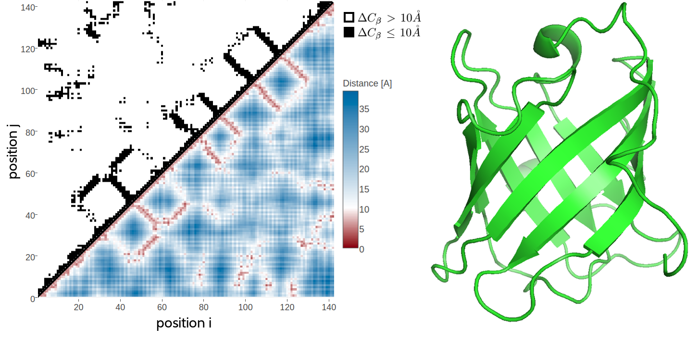

# Biological Background {#general-intro}

In 1972, Anfinsen and his collegues received the Nobel Prize for their research on protein folding which lead to the postulation of one of the basic principles in molecular biology, which is known as *Anfinsen's dogma*: a protein's native structure is uniquely determined by its amino acid sequence [@Anfinsen1973]. 
With certain exceptions (e.g. intrinsically disordered proteins [@Wright1999], prions[@Fraser2014]), this dogma has proven to hold true at least for globular proteins.

Ever since, it is regarded as the biggest challenge in structural bioinformatics to realiably predict a protein's structure given only its amino acid sequence [@Samish2015; @Schwede2013]. 
*De novo* protein structure prediction methods minimize physical or knowledge based energy functions to identify the lowest-energy conformation that generally corresponds to the native protein conformation.
However, due to the high degree of conformational flexibility, the search space of possible conformations cannot be explored exhaustively for proteins of typical length.
Given a protein with 101 residues that has 100 peptide bonds with two torsion angles each and assuming three stable conformations for each of the bond angles, there will be $3^200 \approx  10^{95}$ configurations.
This number of conformations cannot be sampled sequentially in a lifetime, even when sampling at high rates.
Yet, proteins fold almost instantaneously within milliseconds. 
This discrepancy is known as Levinthal's paradox [@Levinthal1969] and limits purely *de novo* based protein structure prediction to small proteins.

Far more successfull are template-based modelling approaches. 
Given the observation that structure is more conserved than sequence in a protein family [@Lesk1980], the structure of a target protein can be inferred from a homologue protein [@Sander1991]. 
The degree of structural conservation is linked to the level of pairwise sequence identity [@Chothia1986]. 
Therefore, the accuracy of a model crucially depends on the sequence identity between target and template and determines the applicability of the model [@Marti-Renom2000]. 
By definition, homology derived models are unable to capture new folds and their main limitation lies in the availability and identification of suitable templates [@Dorn2014].  

The number of solved protein structures increases steadily but only slowly, as experimental methods are both time consuming and expensive [@Dorn2014].
The [PDB](#abbrev)[@Berman2000] is the main repository for marcomolecular structures and currently (October 2017) holds about 135,000 atomic models of proteins. 
The primary technique for determining protein structures is X-ray crystallography, accounting for roughly 90% of entries in the [PDB](#abbrev). 
About 9% of protein structures have been solved using [NMR](#abbrev) and less than 1% using [EM](#abbrev) (see left plot in Figure \@ref(fig:seq-str-gap)).

(ref:caption-seq-str-gap) Yearly growth of number of solved structures in the [PDB](#abbrev) [@Berman2000] and protein sequences in the Uniprot [@TheUniProtConsortium2017]. **Left** Yearly growth of structures in PDB by structure determination method. **Right** Yearly growth of protein sequences in the UniprotKB/TrEMBL, containing automatically annotated sequences, and in the UniprotKB/SwissProt, which is curated by experts who critically review experimental and predicted, and protein structures in the [PDB](#abbrev).

```{r seq-str-gap, echo = FALSE, screenshot.alt="img/intro/pdb_uniprot_stats.png",out.width = '100%', fig.cap = '(ref:caption-seq-str-gap)'}
knitr::include_url("img/intro/pdb_uniprot_stats.html", height = "500px")
```

All three experimental techniques have advantages and limitations with respect to certain modelling aspects.
X-ray crystallography involves protein overexpression, purification and crystallization and finding the the correct experimental conditions to arrive at a pure and regular crystal is a challenging and sometimes impossible task. 
Especially membrane proteins are difficult to study owing to their overall flexibility and hydrophobic surfaces which requires suitable detergents to extract the proteins from their membrane environment which in turn makes crystallization even more challenging [@Carpenter2008; @Moraes2014].
Furthermore, the unnatural crystal environment can result in crystal-induced artifacts, like altererd sidechain conformations due to crystal packing interactions [@Jacobson2002]. 
In contrast, Nuclear magnetic resonance (NMR) spectroscopy studies the protein in solution under physiological conditions and enables the observation of intramolecular dynamics, reaction kinetics or protein folding as ensembles of protein structures can be observed [@Bieri2011]. 
On the downside, validation of NMR-derived structure ensembles is complicated and there is an upper size limit of about 25 kDa for efficient use of the technique [@Billeter2008]. 
Recently, cryo-EM has undergone a "resolution revolution" and macromolecules have been solved to near-atomic resolutions [@Egelman2016; @Fernandez-Leiro2016].
Technological developments, such as better electron detectors as well as advanced image processing software has enabled high resolution structure determination and led to an exponential growth in number of structures deposited in the PDB.
Cryo-EM is particularly suited to study large macromolecular complexes without the need to make crystals and therefore complements the other two structure determination techniques. 

In contrast to the tedious task of determining the tertiary structure of a protein to atomic resolution, it has become very easy to decipher the primary sequence of proteins. 
Since the completion of the human genome in 2003, high-throughput sequencing technologies have been developed at an extraordinary pace, thereby not only decreasing the amount of time needed to sequence whole genomes but also drastically reducing costs [@Reuter2015]. 
The price for sequencing a single genome has dropped from the US\$3 billion spent by the Human Genome Project to as little as US\$1,000[@Goodwin2016].
At the beginning of 2017, Illumina announced the launch of their latest high-throughput sequencing technology, NovaSeq, which is capable of sequencing $\sim \! 48$ human genomes in parallel at 30x coverage within ~45hours [@NovaSeqSystemSpecifications].
Advances in sequencing technologies have led to the emergence of new fields of studies, like metagenomics and single-cell genomics, that enable sequencing of microorganisms that cannot be cultured in a lab [@Tringe2005; @Hugenholtz2008; @Wooley2010]. 
With these approaches the genomic coverage of the microbial world is expanding which is directly reflected in a substantial increase in novel protein families [@Rinke2013; @Mukherjee2017; @Forster2017]. 
About 90 million sequences (October 2017) have been translated into protein amino acid sequences and are stored in the UniprotKB/TrEMBL database, the leading resource for protein sequences [@TheUniProtConsortium2017].


The resultant gap between the number of protein structures and protein sequences is constantly widening (see right plot in Figure \@ref(fig:seq-str-gap)) despite tremendous efforts in automating experimental structure determination and new developments such as electron crystallography[@Schwede2013; @Clabbers2017].
This trend illustrates the essential importance of computational approaches that can complement experimental structural biology efforts in order to bridge this gap.
Over the last decades, template-based methods have matured to a point where they are able to generate high-resolution structural models that are routinley and conveniently used in life-science research and by the biological community [@Schwede2013; @BKC2016].
*De novo* methods aiming at predicting protein structures from sequence alone are required in case no homologue template structure can be identified or the protein sequence represents a novel fold.
Albeit purely *de novo* approaches are hampered by the combinatorial explosion of possible conformations for larger proteins, combining them with structural information from heterogenous sources can help to reduce the degrees of freedom in the conformational search space [@Schwede2013].
For example, sparse low-resolution experimental data from chemical cross-linking/mass spectroscopy or nuclear Overhauser enhancement (NOE) distance data generated from [NMR](#abbrev) experiments, provide distance restraints to guide folding to a correct structure [@Li2004; @Walzthoeni2013; @Rappsilber2011].
Sophisticated integrative approaches, exploiting structural information from different types of experiments have proven to be a powerful approach [@Ornes2016; @Ward2013; @Tang2015]. 


(ref:caption-contact-map) 2D and 3D representations of triabin, a thombin inhibitor from triatoma pallidipennis (PDB identifier 1avg chain I). **Left** The upper left matrix illustrates a contact map using an $10 \angstrom \Cb$ cutoff. A black square is drawn at position $(i, j)$ if the $\Cb$ atoms of residues $i$ and $j$ are closer than $8 \angstrom$ in the structure. The lower right matrix illustrates a distance map. Color reflects $\Cb$ distances between residue pairs with red colors representing $\Delta \Cb \le 10 \angstrom$ and blue colors representing  $\Delta \Cb > 10 \angstrom$. **Right** 3D Structure showing an eight-stranded beta-barrel. 

```{r contact-map, echo = FALSE, out.width='100%', fig.align = 'center', fig.cap = '(ref:caption-contact-map)'}

```


Recently, computational methods have been developed using co-evolution information from deep multiple sequence alignments to predict contacts between pairs of amino acid residues.
More surprisingly, the modern contact prediction approaches produce predictions that are sufficiently accurate to successfully deduce the native fold of the protein [@Marks2011].
It has long been known that native contacts can be used to reliably reconstruct native protein 3D structure [@Vendruscolo1997].
Residue-residue contacts can be visualized in a contact map which is a binary $L \times L$ matrix, with $L$ being protein length.
For two residues, $i$ and $j$, the binary element in the matrix $C(i,j)$ is 

\begin{equation}
    C(i,j) =    
    \begin{cases}
        1, & \text{if } \Delta \Cb < T \\
        0, & \text{otherwise}
    \end{cases}
\end{equation}
where $\Delta \Cb$ is the euclidean distance between $\Cb$ atoms ($C_\alpha$ for glycine) of residues $i$ and $j$ and $T$ is a distance threshhold (typically 8 $\angstrom$).
Figure \@ref(fig:contact-map) shows an example of a residue-residue contact map generated from a small protein domain.


Eventhough a contact map provides only a 2D represenation of the protein structure, it retains the full 3D structural information of a protein.
While it has been shown that only a small subset of native contacts is sufficient to allow accurate modelling of the protein structure, the quality of predicted residue-residue contacts crucially controls the quality of the final structural model [@Kim2014; @Duarte2010].
The last years have seen an enourmous wealth of studies applying predicted residue-residue contacts not only as distance constraints for *de novo* modelling of protein structures, but also in many different fields in structural biology, such as domain prediction [@Sadowski2013], studying alternative conformations [@Parisi2015a] or mutational landscapes [@Hopf2017]. 
The next chapter gives an introduction to state-of-the-art contact prediction approaches, how the predicted residue-residue contacts are applied and which challenges the current methods have to face. 
The aim of this thesis is therefore to improve the models for residue-residue contact prediction by developing a Bayesian framework that addresses some of these challenges.

<!--

### Amino Acid Interactions {#amino-acid-interactions}

The Venn diagram in figure \@ref(fig:amino-acid-physico-chemical-properties) displays a typical classification of amino acids with respect to their physico-chemical properties. 


The aromatic amino acids tryptophan (W), tyrosine (Y), phenylalanine (F), and histidine (H) contain an aromatic ring system. 
Generally, aromatic ring systems are planar, and electons are shared over the whole ring structure.
Interactions between aromatic residues have very constrained geometries regarding the angle between the centroid of their rings. 
The $\pi$-electron systems favour T-shaped or offset stacked conformations [@Waters2002].
Preferred distances between aromatic residues have been observed between 4.5$\angstrom$ and 7$\angstrom$ of their ring centroids [@Burley1985].

Cysteine (C) residues can form disulphide bonds, which are the only covalent bonds between two amino acid side chains.
They comprise the strongest side chain interactions in protein structures and their length varies between 3.5$\angstrom$ to 4$\angstrom$.
Disulphide bonds also have a well defined geometry: there are five dihedral angles in a disulphide bond resulting in 20 different possible configurations. 
Only one configuration is favoured so that the dihedral angle between the carbon and sulfur atoms is close to 90 degrees [@Thornton1981].
They play a very important role in stabilizing protein structures. 
The number of disulfide bonds is negatively correlated with protein length: smaller proteins have more disulfide bonds helping to stabilize the structure in absence of strong hydrophobic packing in the core.
It has also been found that disulfide bonds are more frequently observed in proteins of hyperthermophilic bacteria, being positively selected for increased stability [@Bastolla2005].

Salt bridges are based on electrostatic interactions between positively charged residues (arginine (R) and lysine (K)) and negatively charged residues (aspartic acid (D) and glutamic acid (E)). 
The strength of electrostatic interactions, as described by Coulomb's law, decreases with distance between the point charges at the functional groups. 
It has been found to be maximal at 4$\angstrom$ with respect to the functional groups of the both residues [@Donald2011].

Hydrogen bonds can be formed between a donor residue which possesses an hydrogen atom attached to a strongly electronegative atom and an acceptor residue which possesses an electronegative atom with a lone electron pair. 
They are electrostatic interactions as well and thus their strength depends on distance as well. 
Hydrogen bonds are formed at distances of 2.4$\angstrom$ to 3.5$\angstrom$ between the non-hydrogen atoms (Berg JM, Tymoczko JL, 2002).

Salt bridges as well as hydrogen bonds have strong geometric preferences (Kumar and Nussinov, 1999). 
The geometry of a hydrogen bond depends on the angle between the HB donor, the hydrogen atom and the HB acceptor (Torshin et al., 2002).

Cation–$\pi$ interactions are formed between positively charged or partially charged amino acids with amino groups (K,R,Q,E) and aromatic residues (W,Y,F,H). 
The preferential distance of the amino group to the $\pi$-electron system has been determined between 3.4$\angstrom$ and 6$\angstrom$ [@Burley1986] [@Crowley2005]
Their role in stabilizing protein structures is still under debate [@Slutsky2004].

Proline residues are conformationally restricted, with the alpha-amino group of the backbone directly attached to the side chain. 
The sterical rigidity of the proline side chain restricts the backbone angle and thus affects secondary structure formation.
Proline is known as a helix-breaker. 
Whereas other aromatic side chains are defined by their negatively charged $\pi$ faces, the face of proline side chains is partially positively charged.
Thus, aromatic and proline residues can interact favorably with each other.
Once due to the hydrophobic nature of the residues and also due to the interaction between the negatively charged aroamtic $\pi$ face and the polarized C-H bonds in proline, called a CH/$\pi$  interaction.

Petersen et al. (2012) found clear secondary structure elements preferences for each amino acid pair. 
For example, residue pairs containing Alanine and Leucine are predominantly found in buried $\alpha$-helices, whereas pairs containing Isoleucine and Valine preferentially are located in $\beta$-sheet environments. 
Of course, solvent accessibility represents an important criterion for residue interactions. 
Hydrophobic residues are rather buried in the structure, whereas polar and charged residues are found more frequently on the protein surface and interact with water molecules.

```{r amino-acid-physico-chemical-properties, echo = FALSE, out.width = '50%',  fig.cap = 'Physico-chemical properties of amino acids. The 20 naturally occuring amino acids are grouped with respect to ten physico-chemical properties. Adapted from Figure 1a in [@Livingstone1993].'}
knitr::include_graphics("img/amino_acid_physico_chemical_properties_venn_diagramm.png")
```

-->
