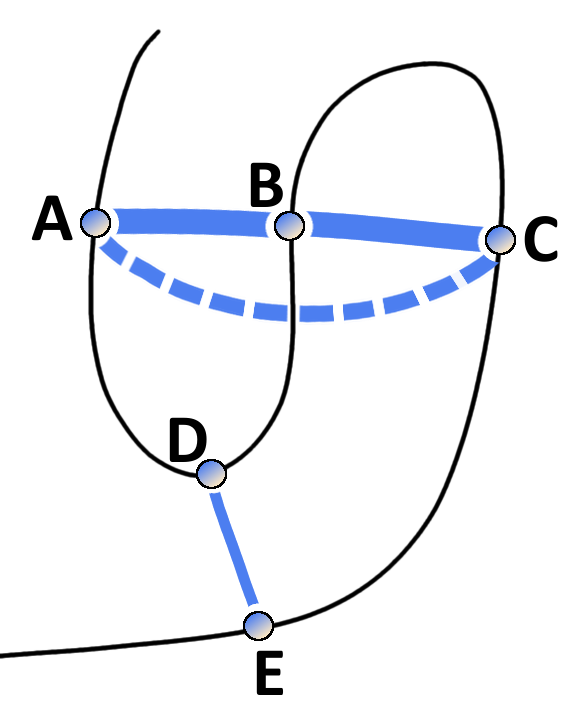

# Introduction to Contact Prediction

Contact prediction refers to the prediction of physical contacts between amino acid side chains in the 3D protein structure, given the protein sequence as input. 

Historically, contact prediction was motivated by the idea that compensatory mutations between spatially neighboring residues can be traced down from evolutionary records [@Gobel1994].
As proteins evolve, they are under selective pressure to maintain their function and correspondingly their structure.
Consequently, residues and interactions between residues constraining the fold, protein complex formation, or other aspects of function are under selective pressure.
Highly constrained residues and interactions will be strongly conserved [@Godzik1989]. 
Another possibility to maintain structural integrity is the mutual compensation of unbeneficial mutations.
For example, the unfavourable mutation of a small amino acid residue into a bulky residue in the densely packed protein core might have been compensated in the course of evolution by a particularly small side chain in a neighboring position. 
Other physico-chemical quantities such as amino acid charge or hydrogen bonding capacity can also induce compensatory effects[@Neher1994].
The [MSA](#abbrev) of a protein family comprises homolog sequences that have descended from a common ancestor and are aligned relative to each other.
According to the hypothesis, compensatory mutations show up as correlations between the amino acid types of pairs of [MSA](#abbrev) columns and can be used to infer spatial proximity of residue pairs (see Figure \@ref(fig:correlated-mutations)).

(ref:caption-correlated-mutations)  The evolutionary record of a protein family reveals evidence of compensatory mutations between spatially neighboring residues that are under selective pressure with respect to some physico-chemical constraints. Mining protein family sequence alignments for residue pairs with strong coevolutionary signals using statistical methods allows inference of spatial proximity for these residue pairs.

```{r correlated-mutations, echo = FALSE, fig.align = 'center', fig.cap = '(ref:caption-correlated-mutations)'}
knitr::include_graphics("img/intro/correlated-mutations-transparent.png")
```

The following sections will give an overview over important methods and developments in the field of contact prediction.


## Local Statistical Models {#local-methods}

Early contact prediction methods used local pairwise statistics to infer contacts that regard pairs of amino acids in a sequence as statistically independent from another.

Several of these methods use correlation coefficient based measures, such as Pearson correlation between amino acid counts, properties associated with amino acids or mutational propensities at the sites of a [MSA](#abbrev) [@Neher1994; @Taylor1994; @Gobel1994; @Oliveira2002; @Shindyalov1994]. 

Many methods have been developed that are rooted in information theory and use [MI](#abbrev) measures to describe the dependencies between sites in the alignment [@Clarke1995; @Korber1993; @Martin2005].
Phylogenetic and entropic biases have been identified as strong sources of noise that confound the true coevolution signal [@Atchley2000; @Fodor2004; @Martin2005].
Different variants of [MI](#abbrev) based approaches address these effects and improve on the signal-to-noise ratio [@Atchley2000; @Tillier2003; @Gouveia_Oliveira2007].
The most prominent correction for background noises is [APC](#abbrev) that is still used by many modern methods and is discussed in section  \@ref(post-processing-heuristics) [@Dunn2008].
Another popular method is *OMES* that essentially computes a chi-squared statistic to detect the differences between observed and expected pairwise amino acid frequencies for a pair of columns [@Kass2002; @Noivirt2005].

The traditional covariance approaches suffered from high false positive rates because of their inability to cope with transitive effects that arise from chains of correlations between multiple residue pairs [@Lapedes1999; @Burger2010; @Weigt2009].
The concept of transitve effects is illustrated in Figure \@ref(fig:transitive-effect).
Considering three residues A, B and C, where A physically interacts with B and B with C.
Strong statistical dependencies between pairs (A,B) and (B,C) can induce strong indirect signals for residues A and C, eventhough they are not physically interacting.
These indirect correlations can become even larger than signals of other directly interacting pairs (D,E) and thus lead to false predictions [@Burger2010].

Local statistical methods consider residue pairs independent of one another which is why they cannot distinguish between direct and indirect correlation signals.
In contrast, global statistical models presented in the next section learn a joint probability distribution over all residues allowing to disentangle transitive effects [@Weigt2009; @Burger2010].
Eventhough local statistical methods cannot compete with modern predictors, *OMES* and [MI](#abbrev) based scores often serve as a baseline in performance benchmarks for contact prediction [@DeJuan2013; @Jones2012].
 

(ref:caption-transitive-effect) Effects of chained covariation obscure signals from true physical interactions. Consider residues A through E with physical interactions between the residue pairs A-B, B-C and D-E. The thickness of blue lines between residues reflects the strength of statistical dependencies between the corresponding alignment columns. Strong statistical dependencies between residue pairs (A,B) and (B,C) can induce a strong dependency between the spatially distant residues A and C. Covariation signals arising from transitive effects can become even stronger than other direct covariation signals and lead to false positive predictions.  

```{r transitive-effect, echo = FALSE, out.width='25%',  fig.align='center', fig.cap = '(ref:caption-transitive-effect)'}

```


## Global Statistical Models {#global-methods}

A huge leap forward was the development of sophisticated statistical models that make predictions for a single residue pair while considering all other pairs in the protein.
These global models allow for the distinction between transitive and causal interactions which has been referred to in the literature as [DCA](#abbrev) [@Lapedes1999; @Weigt2009].

In 1999 Lapedes et al. were the first to propose a global statistical approach for the prediction of residue-residue contacts in order to disentangle transitive effects [@Lapedes1999].
They consider a Pott's model that can be derived under a maximum entropy assumption and use the model specific coupling parameters to infer interactions.
At that time the wider implications of this advancement went unnoted, but meanwhile the Pott's Model has become the most prominent statistical model for contact prediction.
Section \@ref(maxent) deals extensively with the derivation and properties of the Pott's model, its application to contact prediction and its numerous realizations.

A global statistical model not motivated by the maximum entropy approach was proposed by Burger and Nijmwegen in 2010 [@Burger2008; @Burger2010]. 
Their fast Bayesian network model incorporates additional prior information and phylogenetic correction via [APC](#abbrev) but cannot compete with the pseudo-likelihood approaches presented in section \@ref(pseudo-likelihood). 


## Machine Learning Methods and Meta-Predictors {#meta-predictors}

With the steady increase in protein sequence data, machine learning based methods have emerged that extract features from [MSAs](#abbrev) in order to learn associations between input features and residue-residue contacts.
Sequence features typically include predicted solvent accessibility, predicted secondary structure, contact potentials, conservation scores, global protein features, pairwise coevolution statistics and averages of certain features over sequence windows. 
Numerous sequence-based methods have been developed using machine learning algorithms, such as support support vector machines (*SVMCon* [@Cheng2007], *SVM-SEQ* [@Wu2008]), random forests (*ProC_S3* [@Li2011], *TMhhcp* [@Wang2011], *PhyCMap* [@Wang2013]), neural networks (*NETCSS* [@Fariselli2001a], *SAM* [@Shackelford2007], [@Hamilton2004a], *SPINE-2D* [@Xue2009a], *NNCon* [@Tegge2009a]) deep neural networks (*DNCon* [@Eickholt2012], *CMAPpro* [@DiLena2012a]) and ensembles of genetic algorithm classfiers (*GaC* [@Chen2010]).

Different contact predictors, especially when rooted in distinct principles like sequence-based and coevolution methods, provide orthogonal information on the likelihood that a pair of residues makes a contact [@Cheng2007; @Jones2015].
The next logical step in method development therefore constitutes the combination of several base predictors and classical sequence-derived features in the form of meta-predictors.

The first published meta-predictor was *PconsC* in 2013, combining sequence features and predictions from the coevolution methods *PSICOV* and *plmDCA* [@Skwark2013].
In a follow-up version *PSICOV* has been replaced with *gaussianDCA* and the sequence-based method *PhyCMap* [@Skwark2016].
*EPC-MAP* was published in 2014 integrating *GREMLIN* as a coevolution feature with physicochemical information from predicted ab initio protein structures [@Schneider2014].
In 2015, *MetaPSICOV* was released combining predictions from *PSICOV*, *mfDCA* and *CCMpred* with other sequence derived feautures [@Jones2015a].
*RaptorX* uses *CCMpred* as coevolution feature and other standard contact prediction features within an ultra-deep neural network [@Wang2016a].
The newest developments *EPSILON-CP* and *NeBcon* both comprise the most comprehensive usage of contact prediction methods so far, combining five and eight state-of-the-art contact predictors, respectively [@Stahl2017; @He2017]. 

Another conceptual advancement besides the combination of sources of information is based on the fact that contacts are not randomly or independently distributed.
DiLena and colleagues found that over 98% of long-range contacts (sequence separation > 24 positions) are in close proximity of other contacts, compared to 30% for non-contacting pairs [@DiLena2012a].
The distribution of contacts is governed by local structural elements, like interactions between helices or $\beta$-sheets, leading to characteristic patterns in the contact map that can be recognised [@Andreani2015a].
Deep learning provides the means to model higher level abstractions of data and several methods apply multi-layered algorithms to refine predictions by learning patterns that reflect the local neighborhood of a contact [@Skwark2014a; @Jones2015a; @DiLena2012a; @Wang2016a]. 


Eventhough a benchmark comparing the recently developed meta-predictors is yet to be made, it becomes clear from the recent [CASP](#abbrev) experiments, that meta-predictors outperform pure coevolution methods [@Monastyrskyy2015].
As coevolution scores comprise the most informative feautures among the set of input features, it is clear that meta-predictors will benefit from further improvements of pure coevolution methods [@Wang2016a; @Stahl2017]. 


## Modelling Protein Families with Potts Model {#maxent}

Infering contacts from a joint probability distribution over all residues in a protein sequence instead of using simple pairwise statistics has been proven to enable the distinction of direct statistical dependencies between residues from indirect dependencies mediated through other residues.
The global statistical model that is commonly used to describe this joint probability distribution is the *Potts model*. 
It is a well-established model in statistical mechanics and can be derived from a maximum entropy assumption which is explained in the following.

The principle of maximum entropy, proposed by Jaynes in 1957 [@Jaynes1957a; @Jaynes1957b], states that the probability distribution which makes minimal assumptions and best represents observed data is the one that is in agreement with measured constraints (prior information) and has the largest entropy. 
In other words, from all distributions that are consistent with measured data, the distribution with maximal entropy should be chosen.


A protein family is represented by a [MSA](#abbrev) $\X = \{ \seq_1, \ldots, \seq_N \}$ of $N$ protein sequences.
Every protein sequence of the protein family represents a sample drawn from a target distribution $p(\seq)$, so that each protein sequence is associated with a probability. 
Each sequence $\seq_n = (\seq_{n1}, ..., \seq_{nL})$ is of length $L$ and every position constitutes a categorical variable $x_{i}$ that can take values from an alphabet indexed by $\{0, ..., 20\}$, where 0 stands for a gap and $\{1, ... , 20\}$ stand for the 20 types of amino acids. 
The measured constraints are given by the empirically observed single and pairwise amino acid frequencies that can be calculated as

<!--
Applied to the problem of modelling protein families, one seeks a probability distribution $p(\seq)$ for protein sequences $\seq = (x_1, \ldots, x_L)$ of length $L$ from the protein family under study. 
The categorical variables $x_{i}$ can take one of $q=21$ values representing the 20 naturally occuring amino acids and a gap ('-').
Given $N$ sequences of the protein family in a [MSA](#abbrev) with $\X = \{ \seq_1, \ldots, \seq_N \}$, the empirically observed single and pairwise amino acid frequencies can be calculated as
-->


\begin{equation}
    f_i(a) = f(x_i\eq a) = \frac{1}{N}\sum_{n=1}^N I(x_{ni} \eq a) \; ,
\end{equation}

\begin{equation}
    f_{ij}(a,b) = f(x_i\eq a, x_j\eq b) = \frac{1}{N} \sum_{n=1}^N I(x_{ni} \eq a, x_{nj} \eq b) \; .
 (\#eq:emp-freq)
\end{equation}


According to the maximum entropy principle, the distribution $p(\seq)$ should have maximal entropy and reproduce the empirically observed amino acid frequencies, so that

\begin{align}
   f(x_i\eq a)            &\equiv p(x_i\eq a)  \nonumber\\
                                    &= \sum_{\seq\prime_1, \ldots, \seq\prime_L = 1}^{q} p(x\prime) I(x\prime_i \eq a) \\
  f(x_i\eq a, x_j\eq b)   &\equiv p(x_i\eq a, x_j \eq b) \nonumber \\
                                    &= \sum_{\seq\prime_1, \ldots, \seq\prime_L = 1}^{q}  p(x\prime) I(x\prime_i\eq a, x\prime_j \eq b)  \; .
 (\#eq:maxent-reproducing-emp-freq)
\end{align}


Solving for the distribution $p(\seq)$ that maximizes the Shannon entropy $S= -\sum_{\seq\prime} p(\seq\prime) \log p(\seq\prime)$ while satisfying the constraints given by the empircial amino acid frequencies in eq. \@ref(eq:maxent-reproducing-emp-freq) by introducing Lagrange multipliers $\wij$ and $\vi$, results in the formulation of the *Potts model*,

<!--
\begin{align}
F \left[ p(\seq) \right] =& -\sum_{\seq\prime} p(\seq\prime) \log p(\seq\prime) \\
        & + \sum_{i=1}^L \sum_{a=1}^{q} \vi(a) \left( p(x_i\eq a) - \mathcal{f}(x_i\eq a) \right) \\
        & + \sum_{1 \leq i < j \leq L}^L \; \sum_{a,b=1}^{q} \wij(a,b) \left( p(x_i\eq a, x_j \eq b) - \mathcal{f}(x_i\eq a, x_j\eq b) \right) \\
        & + \Omega \left( 1-\sum_{\seq\prime} p(\seq\prime)  \right)
(\#eq:derivation-max-ent-model)
\end{align}
-->

\begin{equation}
    p(\seq | \v, \w ) = \frac{1}{Z(\v, \w)} \exp \left( \sum_{i=1}^L v_i(x_i) \sum_{1 \leq i < j \leq L}^L w_{ij}(x_i, x_j) \right) \; .
(\#eq:max-ent-model)
\end{equation}

The Lagrange multipliers $\wij$ and $\vi$ remain as model parameters to be fitted to data.
$Z$ is a normalization constant also known as *partition function* that ensures the total probabilty adds up to one by summing over all possible assignments to $\seq$, 

\begin{equation}
  Z(\v, \w) = \sum_{\seq\prime_1, \ldots, \seq\prime_L = 1}^{q} \exp  \left( \sum_{i=1}^L v_i(x_i) \sum_{1 \leq i < j \leq L}^L w_{ij}(x_i, x_j) \right) \; .
  (\#eq:partition-fct-likelihood)
\end{equation}


### Model Properties {#potts-model-properties}

The Potts model is specified by singlet terms $\via$ which describe the tendency for each amino acid a to appear at position $i$, and pair terms $\wijab$, also called couplings, which describe the tendency of amino acid a at position $i$ to co-occur with amino acid b at position $j$.
In contrast to mere correlations, the couplings explain the causative dependence structure between positions by jointly modelling the distribution of all positions in a protein sequence and thus account for transitive effects. 
By doing so, a major source of noise in contact prediction methods is eliminated.

To get some intuition for the coupling coefficients, note that $\wijab = 1$ corresponds to a 2.7-fold higher probability for a and b to occur together than what is expected from the singlet frequencies if
a and b were independent. 
Pairs of residues that are not in contact tend to have negligable couplings, $\wij \approx 0$, whereas pairs in contact tend to have vectors significantly different from 0.
For contacting residues $i$ and $j$ in real world [MSAs](#abbrev) typical coupling strengths are on the order of $||\wij || \approx 0.1$ (regularization dependent).


Maximum entropy models naturally give rise to exponential family distributions that express useful properties for statistical modelling, such as the convexity of the likelihood function which consequently has a unique, global minimum [@Wainwright2007; @Murphy2012]. 

The Potts model is a discrete instance of what is referred to as a pairwise [Markov random field](#abbrev) in the statistics community.
[MRFs](#abbrev) belong to the class of undirected graphical models, that represent the probability distribution in terms of a graph with nodes and edges characterizing the variables and the dependence structure between variables, respectively.

#### Gauge Invariance {#gauge-invariance}

As every variable $x_{ni}$ can take $q=21$ values, the model has $L \! \times \! q + L(L-1)/2 \! \times \! q^2$ parameters.
But the parameters are not uniquely determined and multiple parametrizations yield identical probability distributions. 

For example, adding a constant to all elements in $v_i$ for any fixed position $i$ or similarly adding a constant to $\via$ for any fixed position $i$ and amino acid $a$ and subtracting the same constant from the $qL$ coefficients $\wijab$ with $b \in \{1, \ldots, q\}$ and $j \in \{1, \ldots, L \}$ leaves the probabilities for all sequences under the model unchanged, since such a change will be compensated by a change of $Z(\v, \w)$ in eq. \@ref(eq:partition-fct-likelihood).


The overparametrization is referred to as *gauge invariance* in statistical physics literature and can be eliminated by removing parameters [@Weigt2009; @Morcos2011].
An appropriate choice of which parameters to remove, referred to as *gauge choice*, reduces the number of parameters to $L \! \times \! (q-1) + L(L-1)/2 \! \times \! (q-1)^2$.
Popular gauge choices are the *zero-sum gauge* or *Ising-gauge* used by Weigt et al. [@Weigt2009] imposed by the restraints,

\begin{equation}
    \sum_{a=1}^{q} v_{ia} = \sum_{a=1}^{q} \wijab = \sum_{a=1}^{q} w_{ijba} = 0
(\#eq:zero-sum-gauge)
\end{equation}

for all $i,j,b$  or the *lattice-gas gauge* used by Morcos et al [@Morcos2011] and Marks et al [@Marks2011] imposed by restraints

\begin{equation}
    \wij(q,a) = \wij(a,q) = \vi(q) = 0
(\#eq:ising-gauge)
\end{equation}

for all $i,j,a$ [@Cocco2017].

Alternatively, the indeterminacy can be fixed by including a regularization prior (see next section).
The regularizer selects for a unique solution among all parametrizations of the optimal distribution and therefore eliminates the need to choose a gauge [@Koller2009; @Ekeberg2013;  @Stein2015a].


### Inferring Parameters for the Potts Model  {#potts-mle}

Typically, parameter estimates are obtained by maximizing the log-likelihood function of the parameters over observed data.
For the Potts model, the log-likelihood function is computed over sequences in the alignment $\mathbf{X}$: 

\begin{align}
    \text{LL}(\v, \w | \mathbf{X}) =& \sum_{n=1}^N \log p(\seq_n)  \nonumber\\
    =& \sum_{n=1}^N \left[ \sum_{i=1}^L v_i(x_{ni}) + \sum_{1 \leq i < j \leq L}^L w_{ij}(x_{xn}, x_{nj}) - \log Z \right]
(\#eq:full-log-likelihood)
\end{align}


The number of parameters in a Potts model is typically larger than the number of observations, i.e. the number of sequences in the [MSA](#abbrev).
Considering a protein of length $L=100$, there are approximately $2 \times 10^6$ parameters in the model whereas the largest protein families comprise only around $10^5$ sequences (see Figure \@ref(fig:pfam)).
An underdetermined problem like this renders the use of regularizers neccessary in order to prevent overfitting.

Typically, an L2-regularization is used that pushes the single and pairwise terms smoothly towards zero and is equivalent to the logarithm of a zero-centered Gaussian prior,

\begin{align}
  R(\v, \w)  &= \log \left[ \mathcal{N}(\v | \mathbf{0}, \lambda_v^{-1} I) \mathcal{N}(\w | \mathbf{0}, \lambda_w^{-1} I) \right] \nonumber \\
             &= -\frac{\lambda_v}{2} ||\v||_2^2 - \frac{\lambda_w}{2} ||\w||_2^2 + \text{const.} \; ,
(\#eq:l2-reg)
\end{align}

where the strength of regularization is tuned via the regularization coefficients $\lambda_v$ and $\lambda_w$ [@Seemayer2014; @Ekeberg2014; @Kamisetty2013].

However, optimizing the log-likelihood requires computing the partition function $Z$ given in eq. \@ref(eq:partition-fct-likelihood) that sums $q^L$ terms.
Computing this sum is intractable for realistic protein domains with more than 100 residues.
Consequently, evaluating the likelihood function at each iteration of an optimization procedure is infeasible due to the exponential complexity of the partition function in protein length $L$.

Many approximate inference techniques have been developed to sidestep the infeasible computation of the partition function for the specific problem of predicting contacts that are briefly explained in the next section. 

### Solving the Inverse Potts Problem {#potts-model-solutions}

In 1999 Lapedes et al. were the first to propose maximum entropy models for the prediction of residue-residue contacts in order to disentangle transitive effects [@Lapedes1999].
In 2002 they applied their idea to 11 small proteins using an iterative Monte Carlo procedure to obtain estimates of the model parameters and achieved an increase in accuracy of 10-20% compared to the local statistical models [@Lapedes2012a]. 
As the calculations involved were very time-consuming and at that time required supercomputing resources, the wider implications were not noted yet.

Ten years later Weight et al proposed an iterative message-passing algorithm, here referred to as *mpDCA*, to approximate the partition function [@Weigt2009].
Eventhough their approach is computationally very expensive and in practice only applicable to small proteins, they obtained remarkable results for the two-component signaling system in bacteria.

Balakrishnan et al were the first to apply pseudo-likelihood approximations to the full likelihood in 2011  [@Balakrishnan2011]. 
The pseudo-likelihood optimizes a different objective and replaces the global partition function $Z$ with local estimates.
Balakrishnan and colleagues applied their method *GREMLIN* to learn sparse graphical models for 71 protein families.
In a follow-up study in 2013, the authors proposed an improved version of *GREMLIN* that uses additional prior information [@Kamisetty2013].

Also in 2011, Morcos et al. introduced a naive mean-field inversion approximation to the partition function, named *mfDCA* [@Morcos2011].
This method allows for drastically shorter running times as the mean-field approach boils down to inverting the empirical covariance matrix calculated from observed amino acid frequencies for each residue pair $i$ and $j$ of the alignment.
This study performed the first high-throughput analysis of intradomain contacts for 131 protein families and facilitated the prediction of protein structures from accurately predicted contacts in [@Marks2011].

The initial work by Balakrishnan and collegueas went almost unnoted as it was not primarily targeted to the problem of contact prediction.
Ekeberg and collegueas independently developed the pseudo-likelihood method *plmDCA*  in 2013 and showed its superior precision over *mfDCA* [@Ekeberg2013].

A related approach to mean-field approximation is sparse inverse covariance estimation, named *PSICOV*, developed by Jones et al. (2012) [@Jones2012]. 
PSICOV uses an L1-regularization, known as graphical Lasso, to invert the correlation matrix and learn a sparse graphical model [@Friedman2008].
Both procedures, *mfDCA* and *PSICOV*, assume the model distribution to be a multivariate Gaussian. 
It has been shown by Banerjee et al. (2008)that this dual optimization solution also applies to binary data, as is the case in this application, where each position is encoded as a 20-dimensional binary vector [@Banerjee2008]. 

Another related approach to *mfDCA* and *PSICOV* is *gaussianDCA*, proposed in 2014 by Baldassi et al. [@Baldassi2014].
Similar to the other both approaches, they model the data as multivariate Gaussian but within a simple Bayesian formalism by using a suitable prior and estimating parameters over the posterior distribution.

So far, pseudo-likelihood has proven to be the most successful approximation of the likelihood with respect to contact prediction performance. 
Currently, there exist several implementations of pseudo-likelihood maximization that vary in slight details, perform similarly and thus are equally popular in the community, such as CCMpred [@Seemayer2014], plmDCA[@Ekeberg2014] and GREMLIN [@Kamisetty2013].

#### Maximum Likelihood Inference for Pseudo-Likelihood {#pseudo-likelihood}

The pseudo-likelihood is a rather old estimation principle that was suggested by Besag already in 1975 [@Besag1975].
It represents a different objective function than the full likelihood and approximates the joint probability with the product over conditionals for each variable, i.e. the conditional probability of observing one variable given all the others:

\begin{align}
  p(\seq | \v,\w) \approx&   \prod_{i=1}^L p(x_i | \seq_{\backslash xi}, \v,\w) \nonumber \\
                        =&  \prod_{i=1}^L \frac{1}{Z_i} \exp \left(  v_i(x_i) \sum_{1 \leq i < j \leq L}^L w_{ij}(x_i, x_j) \right)
\end{align}

Here, the normalization term $Z_i$ sums only over all assignments to one position $i$ in sequence:

\begin{equation}
  Z_i = \sum_{a=1}^{q} \exp \left( v_i(a) \sum_{1 \leq i < j \leq L}^L w_{ij}(a, x_j) \right)
(\#eq:partition-fct-pll)
\end{equation}


Replacing the global partition function in the full likelihood with local estimates of lower complexity in the pseudo-likelihood objective resolves the computational intractability of the parameter optimization procedure.
Hence, it is feasible to maximize the pseudo-log-likelihood function,

\begin{align}
    \text{pLL}(\v, \w | \mathbf{X}) =& \sum_{n=1}^N \sum_{i=1}^L \log p(x_i | \seq_{\backslash xi}, \v,\w) \nonumber \\
    =& \sum_{n=1}^N \sum_{i=1}^L  \left[ v_i(x_{ni}) + \sum_{j=i+1}^L  w_{ij}(x_{ni}, x_{nj}) - \log Z_{ni} \right] \;,
\end{align}

plus an additional regularization term in order to prevent overfitting and to fix the gauge to arrive at a [MAP](#abbrev) estimate of the parameters, 

\begin{equation}
    \hat{\v}, \hat{\w} = \underset{\v, \w}{\operatorname{argmax}} \; \text{pLL}(\v, \w | \mathbf{X}) + R(\v, \w) \; .
\end{equation}


Eventhough the pseudo-likelihood optimizes a different objective than the full-likelihood, it has been found to work well in practice for many problems, including contact prediction [@Koller2009; @Murphy2012; @Stein2015a; @Ekeberg2013].
The pseudo-likelihood function retains the concavity of the likelihood and it has been proven to be a consistent estimator in the limit of infinite data for models of the exponential family [@Besag1975; @Gidas1988; @Koller2009]. 
That is, as the number of sequences in the alignment increases, pseudo-likelihood estimates converge towards the true full likelihood parameters.


### Computing Contact Maps {#post-processing-heuristics}

Model inference as described in the last section yields [MAP](#abbrev) estimates of the couplings $\hat{\w}_{ij}$. 
In order to obtain a scalar measure for the coupling strength between two residues $i$ and $j$, all available methods presented in section \@ref(potts-model-solutions) heuristically map the $21 \! \times \! 21$ dimensional coupling matrix $\wij$ to a single scalar quantity.

*mpDCA* [@Weigt2009] and *mfDCA* [@Morcos2011; @Marks2011] employ a score called [DI](#abbrev), that essentially computes the [MI](#abbrev) for two positions $i$ and $j$ using the couplings $\wij$ instead of pairwise amino acid frequencies.
Most pseudo-likelihood methods (*plmDCA* [@Ekeberg2013; @Ekeberg2014], *CCMpred* [@Seemayer2014], *GREMLIN* [@Kamisetty2013]) compute the *Frobenius norm* of the coupling matrix $\wij$ to obtain a scalar contact score $C_{ij}$,

\begin{equation}
    C_{ij}  = ||\wij||_2 = \sqrt{\sum_{a,b=1}^q \wijab^2} \; .
(\#eq:frobenius-norm)
\end{equation}

The Frobenius norm improves prediction performance over [DI](#abbrev) and further improvements can be obtained by computing the Frobenius norm only on the $20 \times 20$ submatrix thus ignoring contributions from gaps [@Ekeberg2013; @Baldassi2014; @Feinauer2014].
*PSICOV* [@Jones2012] uses an L1-norm on the $20 \times 20$ submatrix instead of the Frobenius norm.

Furthermore it should be noted that the Frobenius norm is gauge dependent and is minimized by the *zero-sum gauge* [@Weigt2009].
Therefore, the coupling matrices should be transformed to *zero-sum gauge* before computing the Frobenius norm

\begin{equation}
    \w^{\prime}_{ij}  = \wij - \wij(\cdot, b) - \wij(a, \cdot) + \wij(\cdot, \cdot) \; ,
(\#eq:zero-sum-gauge-transform)
\end{equation}

where $\cdot$ denotes average over the respective indices [@Ekeberg2013; @Ekeberg2014; @Seemayer2014; @Baldassi2014].


Another commonly applied heuristic known as [APC](#abbrev) has been introduced by Dunn et al. in order to reduce background noise arising from correlations between positions with high entropy or phylogenetic couplings [@Dunn2008].
[APC](#abbrev) is a correction term that is computed from the raw contact map as the product over average row and column contact scores $\overline{C_i}$ divided by the average contact score over all pairs $\overline{C_{ij}}$. 
The corrected contact score $C_{ij}^{APC}$ is obtained by subtracting the [APC](#abbrev) term from the raw contact score $C_{ij}$, 

\begin{equation}
    C_{ij}^{APC}  = C_{ij} - \frac{\overline{C_i} \; \overline{C_j}}{\overline{C_{ij}}}\; .
(\#eq:apc)
\end{equation}

Visually, [APC](#abbrev) creates a *smoothing* effect on the contact maps that is illustrated in Figure \@ref(fig:apc-correction) and it has been found to substantially boost contact prediction performance [@Dunn2008; @Kamisetty2013].
It was first adopted by *PSICOV* [@Jones2012] but is now used by most methods to adjust raw contact scores.

It was long under debate why [APC](#abbrev) works so well and how it can be interpreted. 
Zhang et al. showed that [APC](#abbrev) essentially approximates the first principal component of the contact matrix and therefore removes the highest variability in the matrix that is assumed to arise from background biases [@Zhang2016].
Furthermore, they studied an advanced decomposition technique, called LRS matrix decomposition, that decomposes the contact matrix into a low-rank and a sparse component, representing background noise and true correlations, respectively.  
Inferring contacts from the sparse component works astonishing well, improving precision further over [APC](#abbrev) independent of the underlying statistical model.

Dr Stefan Seemayer could show that the main component of background noise can be attributed to entropic effects and that a substantial part of [APC](#abbrev) amounts to correcting for these entropic biases (unpublished).
In his doctoral thesis, he developed an entropy correction, computed as the geometric mean of per-column entropies, that correlates well with the [APC](#abbrev) correction term and yields similar precision for predicted contacts.
The entropy correction has the advantage that it is computed from input statistics and therefore is independent of the statistical model used to infer the couplings.
In contrast, [APC](#abbrev) and other denoising techniques such as LRS [@Zhang2016] discussed above, estimate a background model from the final contact matrix, thus depending on the statistical model used to infer the contact matrix. 


(ref:caption-apc-correction) Contact maps computed from  pseudo-likelihood couplings. Subplot on top of the contact maps illustrates the normalized Shannon entropy (<span style="color:#e7539d;">pink </span> line) and percentage of gaps for every position in the alignment (<span style="color:brown;">brown </span> line). **Left**: Contact map computed with Frobenius norm as in eq. \@ref(eq:frobenius-norm). Overall coupling values are dominated by entropic effects, i.e. the amount of variation for a [MSA](#abbrev) position, leading to striped brightness patterns. For example, positions with high column entropy (e.g. positions 7, 12 or 31) have higher overall coupling values than positions with low column entropy (e.g. positions 11, 24 or 33). **b**: previous contact map but corrected for background noise with the [APC](#abbrev) as in eq. \@ref(eq:apc).

```{r apc-correction, echo = FALSE, out.width = '80%', fig.align='center', fig.show = 'hold', fig.cap = '(ref:caption-apc-correction)'}
knitr::include_graphics("img/intro/apc_correction_with_entropy.png")
```


## Applications

The most popular and historically motivated application for contact prediction is contact-guided *denovo* structure prediction. 

It has long been known that the native protein 3D structure can be reconstructed from an error-free contact map [@Vendruscolo1997].
Also, protein fold reconstruction from inter-residue proximity constraints obtained from experiments such as cross-linking/mass spectrometry, fluorescence resonance energy transfer (FRET) or sparse nuclear Overhauser enhancement (NOE) distance data generated from NMR experiments has been demonstrated [@Li2004; @Li2003a; @Bowers2000; @Kolinski1998; @Aszodi1995a].
Predicted contacts, however, have long been regarded as being of little use for structure prediction because of their high false-positive rates [@Wu2011].
Only with the emergence of global statistical models for contact prediction which drastically reduced false-positive rates there has been renewed interest in *denovo* structure prediction aided by predicted contacts.
In 2011, Marks et al. showed that the top scoring contacts predicted with their mean-field approach *mfDCA* are sufficiently accurate to successfully deduce the native fold of the protein [@Marks2011].
In the following years, methods to predict contacts have been improved and applied to model many more protein structures culminating in the high-throughput prediction of 614 protein structures out of which more than 100 represent novel folds by Ovchinnikov and colleagues in 2017 [@Hopf2012; @Ovchinnikov2014a; @Hopf2014; @Hayat2015a; @Hopf2015a; @Raval2015a; @Wang2015; @Ovchinnikov2015a; @Ovchinnikov2017].

Many contact-guided protocols have been established since, that mostly integrate predicted contacts in form of distance constraints into an energy function to guide the folding process and restrict the overal fold: Unicon3D [@Bhattacharya2016], RASREC [@Braun2015], RBOAleph [@Mabrouk2015a],  GDFuzz3D [@Pietal2015a], PconsFold [@Michel2014], C2S_Pipeline [@Konopka2014], FRAGFOLD + PSICOV [@Kosciolek2014], FILM3 [@Nugent2012], EVFold [@Marks2011].
FT-COMAR [@Vasura2008],  I-TASSER [@Wu2011]. 

The necessary quality of contact predictions and how to effectively utilize the inferred contact information is still subject to discussion and further research.
It has been demonstrated that only a small subset of native contacts is sufficient to produce accurate structural models [@Konopka2014; @Vendruscolo1997; @Sathyapriya2009; @Chen2007; @Vassura2007]. 
Sathyapriya and colleagues developed a rational strategy to select important native contacts and successfully reconstructed the structure to near native resolution with only 8% of contacts [@Sathyapriya2009].
Kim and colleagues formulated that only one correct contact for every 12 residues in the protein is sufficient to allow accurate topology level modeling given that the contacts are nonlocal and broadly distributed [@Kim2014].
These studies emphasize that certain contacts are more important than others. 
Long-range contacts are rare and most informative for protein structure prediction because they define the overal fold and packing of tertiary structure whereas short-range contacts define local secondary structure [@Adhikari2017].
It is a consistent finding that eventhough long-range contacts are of higher relevance than short-range contacts for structure reconstruction, their information alone is not sufficient [@Sathyapriya2009; @Kosciolek2014; @DiLena2009a].
Many reconstruction protocols can tolerate missing contact information much better than erroneous contact information and it has been stressed that only highly confident contacts are helpful [@Duarte2010].
Zhang et al. found that their tool Touchstone II required the ratio of correctly predicted contacts to protein length to be at least 20% to generate a positive effect to structure prediction [@Zhang2003].
Marks and colelagues observed that isolated false positives have a much stronger detrimental effect on structure prediction than false positives close to true contacts [@Marks2011].
Frequently, protocols employ a filtering step to eliminate unsatisfied or conflicting constraints possibly originating from false-positive contacts [@Wang2016; @Adhikari2015a].
Generally it is assumed that higher precision of predicted contacts (of well distributed contacts) results in improved structural models, albeit there is no strong correlation as model quality depends on many other factors such as the secondary structure composition of the protein, the domain size, the usage of additional sources of structural information, the type of distance constraint function and the particular structure reconstruction protocol [@Adhikari2017; @DeOliveira2016; @Kosciolek2014; @Marks2011].

### other applications

The success story of residue-residue contact prediction has spread to new areas of application. 
An obvious extension of denovo structure prediction using predicted contacts is the prediction and modelling of protein-protein interactions (Dos Santos et al., 2015; Ovchinnikov et al., 2014; Hopf et al., 2014, Skerker et al., 2008). 
A new challenge arises in the correct pairing of sequences from two proteins, as paralogs and orthologs need to be dissected.
There are two promising approaches that will build concatenated alignments for the purpose of contact prediction between proteins.
- generation of the multiple sequence alignment for EC methods is challenging because orthologous interacting pairs of sequences must reliably be identified from a large number of species
- Typically, sequences from individual alignments are paired using bacterial genome coordinates, i.e. the closer their location in the genome the more likely their co-expression and physical interaction 
- A second, simpler method: matches orthologous sequence pairs using genome BLAST scores (Iserte et al., 2015; Yu et al., 2016; Ochoa & Pazos, 2010)
- and new methods may well improve the accuracy for these organisms (Gueudre´ et al., 2016; Bitbol et al., 2016)
- case study: Feinauer2016a 

Contacts are also used to analyse potential alternative cofnormations of proteins. 
It is not possible to distinguish contacts from alternative conformations without a protein structure though (Parisi et al., 2015; Morcos et al.,2013, Sfriso2016)

Contact prediction methods developed for protein sequences have also been applied to RNA structure prediction
    - "Structural biology: RNA structure from sequence" tal nawy, 2016 nature

The Potts can be interpreted as a boltzmann model giving energies and therefore mutated sequences can be evalutated.
    - EVmutation [@Hopf2017]: unsupervised statistical method for predicting the effects of mutations that explicitly captures residue dependencies between positions
    - assess the quantitative effects of mutations in genes of any organism
    - "Maximum-Entropy Models of Sequenced Immune Repertoires Predict Antigen-Antibody Affinity."
    
Related is the idea to use the Potts model for protein design. 
    Franceus2016
    
Skwark and colleagues applied the popular coevolution models to genomes and developed a statistical method called *genomeDCA* [@Skwark2017].
They are able to identify coevolving polymorphic locus pairs based on the idea that the corresponding proteins form protein-protein interactions that are under strong evolutionary pressure.
In a case study on two large human pathogen populations they found that three quarters of coevolving loci are located in genes that determine beta-lactam (antibiotic) resistence.

    
- network deconvolution

Sadowski used predicted contacts to parse domain boundaries based on the simple idea that contacts are more abundant within domains than between domains  [@Sadowski2013].
    
Predicted contacts can be of great benefit for other problems in structural biology, like model quality assessment, distinguishing properly folded from misfolded proteins.
- distinguish properly folded proteins from crap 
    - ("Correlated mutations distinguish misfolded and properly folded proteins"): DCA correctly predicts significantly more contacts for properly folded structures than for misfolded ones
    - properly oriented model from mirror models: Kurczynska2016
    - model wuality assessment: "QAcon: single model quality assessment using protein structural and contact information with machine learning techniques"
Simkovic2017 review!!! Tang2015 NMR

Fox and colleagues turn the idea of DCA upside down.
They developed a benchmark for testing the accuracy of large [MSAs](#abbrev), by evaluating the agreeement between the predicted and the native contacts [@Fox2016].


## Evaluating Contact Prediction Methods {#intro-cp-evaluation}

Choosing an appropriate benchmark for contact prediction is determined by the further utilization of the predictions.
Most prominently, predicted contacts are used to assist structure prediction as outlined in the last section \@ref(contact-assisted-str-pred).
Therefore, one could assess the quality of structural models computed with the help of predicted contacts.
However, predicting structural models adds not only another layer of computational complexity but also raises questions about implementation details of the folding protocol. 

It has been found that in general a small number of accurate contacts is sufficient to constrain the overal protein fold as already discussed.
From these considerations emerged various standard benchmarks that have been established by the [CASP](#abbrev) community over many years [@Monastyrskyy2011; @Monastyrskyy2014a; @Monastyrskyy2015].
[CASP](#abbrev), the well-respected and independent competition for the structural bioinformatic's community introduced the contact prediction category in 1996.
Taking place every two years, the progress in the field is assessed in a blind competition and the community discusses the outcome in a subsequent meeting. 
According to the [CASP](#abbrev) regulations, a pair of residues is defined to be in physical contact when the distance between their $\Cb$ atoms ($C_{\alpha}$ in case of glycine) is less than $8 \angstrom$ in the reference protein structure.

The overall performance of a contact predictor is evaluated by the mean precision over a testset of proteins with known high quality 3D structures against the top scoring predictions from every protein.
The number of top scoring predictions per protein is typically normalized with respect to protein length $L$ and precision is defined as the number of true contacts among the top scoring predicted contacts.
A popular variant of this benchmark plot shows the mean precision of a certain fraction of top ranked predictions (e.g. L/5 top ranked predictions) against specific properties of the test proteins such as protein length or alignment depth [@Ashkenazy2009].
During CASP11 further evaluation metrics have been introduced, such as Matthews correlation coefficient, area under the precision-recall curve or F1 measure but they are rarely used in studies [@Monastyrskyy2015].

Currently best methods perform in the range XXX.
Sequence feature based methods:
Their performance is less dependent on the number of available sequence homologs compared to coevolution methods and therefore they can outperform pure coevolution methods in low data ranges [@Wang2013; @Kosciolek2015a].
TODOOOPLOT

### Sequence Separation {#seq-sep}

Local residue pairs separated by only some positions in sequence (e.g $|i-j| < 6$) are usually filtered out for evaluating contact prediction methods.
They are trivial to predict as they typically correspond to contacts within secondary structure elements and reflect the local geometrical constraints.
Figure \@ref(fig:Cb-distribution) shows the distribution of $\Cb$ distances for various minimal sequence separation thresholds. 
Without filtering local residue pairs (sequence separation 1), there are several additional peaks in the distribution around $5.5\angstrom$, $7.4\angstrom$ and $10.6\angstrom$ that can be attributed to local interactions in e.g. helices (see Figure \@ref(fig:peaks-Cb-distribution)).

(ref:caption-Cb-distribution) Distribution of residue pair $\Cb$ distances over 6741 proteins in the dataset (see Methods \@ref(dataset)) at different minimal sequence separation thresholds.

```{r Cb-distribution, echo = FALSE, screenshot.alt="img/dataset_statistics/Cb_distribution_all_data43579541_log.png", out.width = '90%', fig.align='center', fig.cap = '(ref:caption-Cb-distribution)'}
knitr::include_url("img/dataset_statistics/Cb_distribution_all_data43579541_log.html", height="500px")
```

(ref:caption-peaks-Cb-distribution) $\Cb$ distances between neighboring residues in $\alpha$-helices. Left: Direct neighbors in $\alpha$-helices have $\Cb$ distances around $5.4\angstrom$ due to the geometrical constraints from $\alpha$-helical architecture. Right: Residues separated by two positions ($|i-j| = 2$) are less geometrically restricted to $\Cb$ distances between $7\angstrom$ and $7.5\angstrom$.

```{r peaks-Cb-distribution, echo = FALSE, out.width = '40%', fig.show = 'hold', fig.align='center', fig.cap = '(ref:caption-peaks-Cb-distribution)'}
knitr::include_graphics(c("img/dataset_statistics/cb_distribution_peak_5-6.png","img/dataset_statistics/cb_distribution_peak_7.png"))
```

Commonly, sequence separation bins are applied to distuinguish short ($6 < |i-j| \le 12$), medium ($12 < |i-j| \le 24$) and long range ($|i-j| > 24$) contacts [@Monastyrskyy2015; @Monastyrskyy2014a].
Especially long range contacts are of importance for structure prediction as they are the most informative and able to constrain the overal fold of a protein [@Monastyrskyy2011].

### Interpretation of Evaluation Results

There are certain subtleties to be considered when interpreting contact prediction evaluation results.

First of all, the rigid $\Cb$ distance definition of a contact is a very rough measure of true physical interactions between amino acid sidechains.
<!--Whether two residues truly interact in a protein structure depends only marginally on the distance between their $\Cb$ atoms.-->
More importantly, interactions between sidechains depend on their physico-chemical properties, on their orientation and different environments within proteins (see section \@ref(amino-acid-interactions)) [@Bettsa]. 
A simple $\Cb$ distance threshold not only misses to reflect biological interaction preferences of amino acids but also provides a questionable gold-standard for benchmarking.
Other distance thresholds and definitions for physical contacts (e.g minimal atomic distances or distance between functional groups) have been studied as well.
In fact, Duarte and colleagues found that using a $\Cb$ distance threshold between 9$\angstrom$ and 11$\angstrom$ yields optimal results when predicting the 3D structure from the respective contacts [@Duarte2010].
Anishchenko and colleagues analysed false positive predictions with respect to a minimal atom distance threshold $< 5 \angstrom$, as they found that this cutoff optimally defines direct physical interactions of residue pairs [@Anishchenko2017].
Definitely, choosing different distance cutoffs and reference atoms for defining a true contact changes the evaluation outcome.

Another issue concerns structural variation within a protein family. 
Evolutionary couplings are inferred from all family members in the [MSA](#abbrev) and therefore predicted contacts might be physical contacts in one family member but not in another. 
Anishchenko et al. could show that more than $80\%$ of false positives at intermediate distances (minimal heavy atom distance 5-15$\angstrom$) are true contacts in at least one homolog structure [@Anishchenko2017].
Therefore, choosing the right trade-off between sensitivity and specificity when generating alignments is a crucial step as well as choosing the target protein structure for evaluation.

Finally, an important aspect not considered in the standard benchmarks is the spread of predicted contacts.
It is perfectly possible to improve precison of predicted contacts without translating this improvement to better structural models.
The reason being that structurally redundant contacts, that is contacts in the immediate sequence neighborhood of other contacts, do not give additional information to constrain the fold [@Kim2014; @Jones2015; @Marks2011].
For example, given a contact between residues $i$ and $j$, there is hardly an added value knowing that there is a contact between residues $i\!+\!1$ and $j\!+\!1$ when it comes to predicting the overal topology.
This observation is highly relevant for deep learning methods due to their unique ability to abstract higher order interactions and recognize contact patterns.
Several measures of the contact spread have been developed, like the mean euclidian distance between true and predicted contacts, but are not commonly evaluated yet [@DeOliveira2016; @Marks2011].


## Challenges for Coevolutionary Inference {#challenges}

Coevolution methods face several challenges when interpreting the covariation signals obtained from a [MSA](#abbrev). 
Some of these challenges have been successfully met (e.g. disentangling transitive effects with global statistical models), others are still open or open up new perspectives, such as dissecting different sources of coevolution signals. 


### Phylogenetic Effects as a Source of Noise

Sequences in [MSAs](#abbrev) do not represent independent samples of a protein family. 
In fact, there is selection bias from sequencing species of special interest (e.g human pathogens) or sequencing closely related species, e.g multiple strains. 
This uneven sampling of a protein family's sequence space leaves certain regions unexplored whereas others are statistically overrepresented [@Morcos2011; @Marks2012; @Cocco2017]. 
Furthermore, due to their evolutionary relationship, sequences of a protein family have a complicated dependence structure.
Closely related sequences can cause spurious correlations between positions, as there was not sufficient time for the sequences to diverge from their common ancestor [@Gouveia_Oliveira2007; @Lapedes1999; @Burger2010]. 
Figure \@ref(fig:phylogenetic-effect) illustrates a simplified example, where dependence of sequences due to phylogeny leads to a covariation signal.
To reduce the effects of redundant sequences, a popular sequence reweighting strategy has been found to improve contact prediction performance, where every sequence receives a weight that is the inverse of the number of similar sequences according to an identity threshold (see section \@ref(seq-reweighting)) [@Buslje2009; @Morcos2011; @Jones2012; @Cocco2017]. 

(ref:caption-phylogenetic-effect) The phylogenetic dependence of closely related sequences can produce covariation signals. Here, two independent mutation events (highlighted in red) in two branches of the tree result in a perfect covariation signal for two positions.

```{r phylogenetic-effect, echo = FALSE, out.width='50%', fig.align='center', fig.cap = '(ref:caption-phylogenetic-effect)'}
knitr::include_graphics("img/intro/phylogenetic_effect.png")
```


### Entropic Effects as a Source of Noise

Another source for noise is entropy bias that is closely linked to phylogenetic effects.
By nature, methods detecting signals from correlated mutations rely on a certain degree of covariation between sequence positions [@Burger2010].
Highly conserved interactions pose a conceptual challenge, as changes from one amino acid to another cannot be detected if sequences do not vary.
This results in generally higher co-evolution signals from positions with high entropy and underestimated signals for highly conserved interactions [@Fodor2004, @Martin2005].
Several heuristics have been proposed to reduce entropy effects, such as Row-Column-Weighting (RCW) [@Gouveia_Oliveira2007] or Average Product Correction (APC) [@Dunn2008] (see section \@ref(post-processing-heuristics)).


### Finite Sampling Effects

Spurious correlations can arise from random statistical noise and blur true co-evolution signals especially in low data scenarios.
Consequently, false positive predictions attributable to random noise accumulate for protein families comprising low numbers of homologous sequences.
This relationship was confirmed in many studies and as a rule of thumb it has been argued that proteins with $L$ residues need at least *5L* sequences in order to obtain confident predictions that can bet used for protein structure prediction [@Kamisetty2013; @Marks2012].
Recently it was shown that precision of predicted contacts saturates for protein families with more than $10^3$ diverse sequences and that precision is only dependent on protein length for families with small number of sequences [@Anishchenko2017].

Interesting targets for contact prediction are protein families without any associated structural information. 
As can be seen in Figure \@ref(fig:pfam), those protein families generally comprise low numbers of homologous sequences with a median of 185 sequences per family and are thus susceptible to finite sampling effects. 

With the rapidly increasing size of protein sequence databases  (see section \@ref(general-intro)) the number of protein families with enough sequences for accuarate contact predictions will increase steadily  [@TheUniProtConsortium2013; @Kamisetty2013].
Nevertheless, because of the already mentioned sequencing biases, better and more sensitive statistical models are indespensible to extend the applicability domain of coevolutionary methods.

  (ref:caption-pfam) Distribution of PFAM family sizes. Less than half of the families in PFAM (7990 compared to 8489 families) do not have an annotated structure. The median family size in number of sequences for families with and without annotated structures is 185 and 827 respectively. Data taken from PFAM 31.0 (March 2017, 16712 entries) [@Finn2016].

```{r pfam, echo = FALSE, screenshot.alt="img/pfam_pdb_notitle.png", out.width='90%', fig.cap = '(ref:caption-pfam)', fig.align='center'}
knitr::include_url("img/pfam_pdb_notitle.html", height = "500px")
```


### Multiple Sequence Alignments

A correct [MSA](#abbrev) is the essential starting point for coevolution analysis as incorrectly aligned residues will confound the true signal. 
Highly sensitive and accurate alignment tools such as HHblits generate high quality alignments suitable for contact prediction [@Remmert2012]. 
However, there are certain subtleties to be kept in mind when generating alignments.

For example, proteins with repeated stretches of amino acids or with regions of low complexity are notoriously hard to align.
Especially, repeat proteins have been found to produce many false positive contact predictions [@Anishchenko2017]. 
Therefore, [MSAs](#abbrev) need to be generated with great care and covariation methods need to be tailored to these specific types of proteins [@Espada2014; @Toth-Petroczy2016].

Furthermore, sensitivity of sequence search is critically dependent on the research question at hand and on the protein family under study. 
Many diverse sequences in general increase precision of predictions [@Ashkenazy2009; @Avila-Herrera2015a].
However, deep alignments can capture coevolutionary signals from different subfamilies [@Uguzzoni2017]. 
If only a specific subfamily is of interest, many false predictions might arise from strong coevolutionary signals specific to another subfamily that constitutes a prominent subset in the alignment.
Therefore, a trade-off between specificity and diversity of the alignment is required to reach optimal results [@Hopf2012]. 


Another intrinsic characteristic of [MSAs](#abbrev) are repeated stretches of gaps that result from commonly utilized gap-penalty schemes assigning large penalties to insert a gap and lower penalties to gap extensions. 
Most statistical coevolution models for contact prediction treat gaps as the 21st amino acid.
This introduces an imbalance as gaps and amino acids express different behaviours which can result in gap-induced artefacts [@Feinauer2014]. 


### Alternative Sources of Coevolution

Coevolutionary signals can not only arise from intra-domain contacts, but also from other sources, like homo-oligomeric contacts, alternative conformations, ligand-mediated interactions or even contacts over hetero-oligomeric interfaces (see Figure \@ref(fig:sources-coevolution))  [@Marks2012].
With the objective to predict physical contacts it is therefore necessary to identify and filter these alternative sources of coevolutionary couplings.

(ref:caption-sources-coevolution) Possible sources of coevolutionary signals. **a)** Physical interactions between intra-domain residues. **b)** Interactions across the interface of predominantly homo-oligomeric complexes. **c)** Interactions mediated by ligands or metal atoms. **d)** Transient interactions due to conformational flexibility.

```{r sources-coevolution, echo = FALSE, out.width='90%', fig.align='center', fig.cap = '(ref:caption-sources-coevolution)'}
knitr::include_graphics("img/intro/sources_of_coevolution.png")
```


Many proteins form homo-oligomers with evolutionary conserved interaction surfaces (Figure \@ref(fig:sources-coevolution) b).
Currently it is hard to reliably distinguish intra- and inter-molecular contacts [@Uguzzoni2017].
Anishchenko et al. found that approximately one third of strong co-evolutionary signals between residue pairs at long distances (minimal heavy atom distance >15$\angstrom$) can be attributed to interactions across homo-oligomeric interfaces [@Anishchenko2017].
Several studies specifically analysed co-evolution across homo-oligomeric interfaces for proteins of known structure by filtering for residue pairs with strong couplings at long distances [@Hopf2012; @Lee2009; @Wang2015; @Sutto2015; @Jana2014; @@Uguzzoni2017] or used co-evolutionary signals to predict homo-dimeric complexes [@DosSantos2015a].   

It has been proposed that co-evolutionary signals can also arise from ligand or atom mediated interactions between residues or from critical interactions in intermediate folding states (Figure \@ref(fig:sources-coevolution) c) [@Buslje2009; @Ovchinnikov2015b].
Confirming this hypothesis, a study showed that the cumulative strength of couplings for a particular residue can be used to predict functional sites [@Marks2012; @Hopf2012].

Another important aspect is conformational flexibility (Figure \@ref(fig:sources-coevolution) c). 
PDB structures used to evaluate coevolution methods represent only rigid snapshots taken in an unnatural crystalline environment. 
Yet proteins possess huge conformational plasticity and can adopt distinct alternative conformations or adapt shape when interacting with other proteins in an induced fit manner [@Noel2016].
Several studies demonstrated successfully that coevolutionary signals can capture interactions specific to different distinct conformations [@Hopf2012; @Jana2014; @Sfriso2016; @Morcos2011]. 


# Developing a Bayesian Model for Contact Prediction

Coevolution methods ad

The most popular and successfull methods for contact prediction optimize the pseudo-log-likelihood of the [MSA](#abbrev) and use several heuristics to calculate a contact score (see section \@ref(post-processing-heuristics)). 

By doing so valuable information in contact matrices is lost. 
Analyses in section 1 shows what information is contained in coupling matrices and that the signal in coupling matrices varies with $\Cb$ distance. 

This thesis introcudes a principled Bayesian statistical approach that eradicates these heuristics to fully exploit the information in coupling matrices.
Instead of transforming the model parameters $\w$ into heuristic contact scores, one can compute the posterior probability distributions of the distances $r_{ij}$ between $\Cb$ atoms of all residues pairs $i$ and $j$, given the [MSA](#abbrev) $\X$. 
The coupling parameters $\w$ are treated as hidden variables that will be integrated out analytically. 
This approach also allows for extraction of information contained in the particular types of amino acids, since each pair of amino acids will have a different preference to be coupled at certain distances.

TODO Figure ! ! 

In section 2 introduces max ent model for protein families that will produce the model parameters for the Bayesian model.

In section 3 describes in detail how the posterior distribution of distances can be computed.

Section 4 presents the optimizaton of the coupling prior. 

And the Bayesian model will be evalutated in  section 5.

The outlook describes an extension of the model to predict inter-residue distances. 
Development is ongoing.


