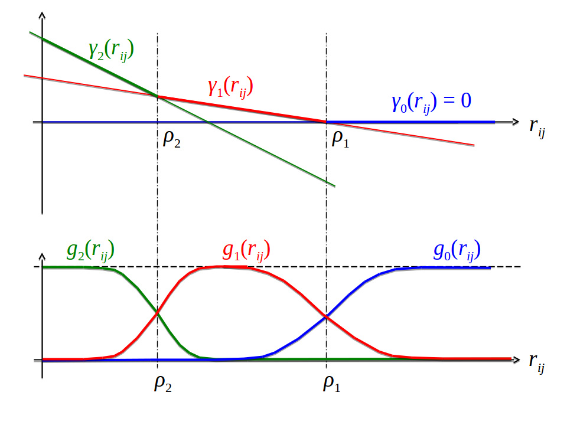

# Methods

all you need to know

## Dataset {#dataset}

A protein dataset has been constructed from the CATH (v4.1) [@Sillitoe2015] database for classification of protein domains.
All CATH domains from classes 1(mainly $\alpha$), 2(mainly $\beta$), 3($\alpha+\beta$) have been selected and filtered for internal redundancy at the sequence level using the `pdbfilter` script from the HH-suite[@Remmert2012] with an E-value cutoff=0.1. 
The dataset has been split into ten subsets aiming at the best possible balance between CATH classes 1,2,3 in the subsets. 
All domains from a given CATH topology (=fold) go into the same subsets, so that any two subsets are non-redundant at the fold level. 
Some overrepresented folds (e.g. Rossman Fold) have been subsampled ensuring that in every subset each class contains at max 50% domains of the same fold. 
Consequently, a fold is not allowed to dominate a subset or even a class in a subset.
In total there are 6741 domains in the dataset.


Multiple sequence alignments were built from the CATH domain sequences ([COMBS](http://www.cathdb.info/version/current/domain/3cdjA03/sequence)) using HHblits [@Remmert2012] with parameters to maximize the detection of homologous sequences:

`hhblits -maxfilt 100000 -realign_max 100000 -B 100000 -Z 100000 -n 5 -e 0.1 -all`
`hhfilter -id 90 -neff 15 -qsc -30` 

The COMBS sequences are derived from the SEQRES records of the PDB file and sometimes contain extra residues that are not resolved in the structure. 
Therefore, residues in PDB files have been renumbered to match the COMBS sequences. The process of renumbering residues in PDB files yielded ambigious solutions for 293 proteins, that were removed from the dataset. 
Another filtering step was applied to remove 80 proteins that do not hold the following properties:

*  more than 10 sequences in the multiple sequence alignment ($N>10$)
*  protein length between 30 and 600 residues ($30 \leq L \leq 600$)
*  less than 80% gaps in the multiple sequence alignment (percent gaps < 0.8)
*  at least one residue-pair in contact at $C_\beta < 8\angstrom$ and minimum sequence separation of 6 positions

The final dataset is comprised of **6368** proteins with almost evenly distributed CATH classes over the ten subsets  (Figure \@ref(fig:dataset-cath-topologies)).


(ref:caption-dataset-cath-topologies) Distribution of CATH classes (1=mainly $\alpha$, 2=mainly $\beta$, 3=$\alpha-\beta$) in the dataset and the ten subsets.

```{r dataset-cath-topologies, echo = FALSE, screenshot.alt="img/amino_acid_physico_chemical_properties_venn_diagramm.png",  out.width = '100%', fig.cap = '(ref:caption-dataset-cath-topologies) '}
knitr::include_url("img/dataset_statistics/cath_topologies_stacked_reative_notitle.html")
```


## Optimizing Pseudo-Likelihood

Dr Stefan Seemayer has reimplementated the open-source software CCMpred [@Seemayer2014] in Python. 
Based on a fork of his private github repository I continued development and extended the software, which is now called CCMpredPy. 
It will soon be available at https://github.com/soedinglab/CCMpredPy.
All computations in this thesis are performed with CCMpredPy unless stated otherwise.

### Pseudo-Likelihood Objective Function and its Gradients

CCMpred optimizes the regularized negative pseudo-log-likelihood using conjugate gradients optimizer. 

The negative pseudo-log-likelihood, abbreviated $\mathcal{npll}$, is defined as:

\begin{equation}
  \mathcal{npll}(\mathbf{X} | \v,\w) =   - \sum_{n=1}^N \sum_{i=1}^L  \left(  v_i(x_i^{(n)}) + \sum_{\substack{j=1 \\ j \neq i}}^L w_{ij}(x_i^{(n)}, x_j^{(n)})  - \log Z_i^{(n)} \right)
\end{equation}

The normalization term $Z_i$ sums over all assignments to one position $i$ in sequence:

\begin{equation}
  Z_i^{(n)} = \sum_{a=1}^{20} \exp \left( v_i(a) + \sum_{\substack{j=1 \\ j \neq i}}^L w_{ij}(a, x_j^{(n)}) \right)
\end{equation}


### Differences between CCMpred and CCMpredpy {#diff-ccmpred-ccmpredpy}

CCMpredPy differs from CCMpred [@Seemayer2014] which is available at https://github.com/soedinglab/CCMpred in several details:

- Initialization of potentials $\v$ and $\w$
    - CCMpred initializes single potentials $\v_i(a) = \log f_i(a) - \log f_i(a= "-")$ with $f_i(a)$ being the frequency of amino acid a at position i and $a="-"$ representing a gap. A single pseudo-count has been added before computing the frequencies. Pair potentials $\w$ are intialized at 0.
    - CCMpredPy initializes single potentials $\v$ with the [ML](#abbrev) estimate of single potentials (see section \@ref(regularization)) using amino acid frequencies computed as described in section \@ref(amino-acid-frequencies). Pair potentials $\w$ are initialized at 0.
- Regularization
    - CCMpred uses a Gaussian regularization prior centered at zero for both single and pair potentials. The regularization coefficient for single potentials $\lambda_v = 0.01$ and for pair potentials $\lambda_w = 0.2 * (L-1)$ with $L$ being protein length.
    - CCMpredPy uses a Gaussian regularization prior centered at zero for the pair potentials. For the single potentials the Gaussian regularization prior is centered at the [ML](#abbrev) estimate of single potentials (see section \@ref(regularization)) using amino acid frequencies computed as described in section \@ref(amino-acid-frequencies). The regularization coefficient for single potentials $\lambda_v = 10$ and for pair potentials $\lambda_w = 0.2 * (L-1)$ with $L$ being protein length.

Default settings for CCMpredPy have been chosen to best reproduce CCMpred results.
A benchmark over a subset of approximately 3000 proteins confirms that performance measured as [PPV](#abbrev) for both methods is almost identical (see Figure \@ref(fig:cmmpredvanilla-vs-ccmpredpy)). 


(ref:caption-cmmpredvanilla-vs-ccmpredpy) Benchmark for CCMpred and CCMpredPy on a dataset of 3124 proteins. ccmpred-vanilla+apc: CCMpred [@Seemayer2014] with [APC](#abbrev). ccmpred-pll-centerv+apc: CCMpredPy with [APC](#abbrev). Specific flags that have been used to run both methods are described in detail in the text (see section \@ref(diff-ccmpred-ccmpredpy)).

```{r cmmpredvanilla-vs-ccmpredpy, echo = FALSE, screenshot.alt="img/amino_acid_physico_chemical_properties_venn_diagramm.png",  out.width = '100%', fig.cap = '(ref:caption-cmmpredvanilla-vs-ccmpredpy)'}
knitr::include_url("img/ccmpredvanilla_vs_ccmpredpy_precision_vs_rank.html")
```

The benchmark in Figure \@ref(fig:cmmpredvanilla-vs-ccmpredpy) as well as all contacts predicted with CCMpred and CCMPredPy (using pseudo-likelihood) in my thesis have been computed using the following flags:

Flags used with CCMpredPy (using pseudo-likelihood objective function):
```
--maxit 250                       # Compute a maximum of MAXIT operations
--center-v                        # Use a Gaussian prior for single potentials centered at ML estimate v*
--reg-l2-lambda-single 10         # regularization coefficient for single potentials
--reg-l2-lambda-pair-factor 0.2   # regularization coefficient for pairwise potentials computed as reg-l2-lambda-pair-factor * (L-1)
--pc-uniform                      # use uniform pseudocounts (1/21 for 20 amino acids + 1 gap state) 
--pc-count 1                      # defining pseudo count admixture coefficient rho = pc-count/( pc-count+ Neff)
--epsilon 1e-5                    # convergence criterion for minimum decrease in the last K iterations
--ofn-pll                         # using pseudo-likelihood as objective function
--alg-cg                          # using conjugate gradient to optimize objective function
```

Flags used with CCMpred:
```
-n 250    # NUMITER:  Compute a maximum of NUMITER operations
-l 0.2    # LFACTOR:  Set pairwise regularization coefficients to LFACTOR * (L-1) 
-w 0.8    # IDTHRES:  Set sequence reweighting identity threshold to IDTHRES
-e 1e-5   # EPSILON:  Set convergence criterion for minimum decrease in the last K iterations to EPSILON
```

### Sequence Reweighting {#seq-reweighting}

As discussed in section \@ref(challenges), sequences in a [MSA](#abbrev) do not represent independent draws from a probabilistic model. 
To reduce the effects of overrepresented sequences, typically a simple weighting strategy is applied that assigns a weight to each sequence that is the inverse of the number of similar sequences according to an identity threshold [@Stein2015a]. 
It has been found that reweighting improves contact prediction performance [@Buslje2009; @Morcos2011; @Jones2012] significantly but results are robust against the choice of the identity threshold in a range between 0.7 and 0.9 [@Morcos2011]. 
We chose an identity threshold of 0.8.   

Every sequence $x_n$ of length $L$ in an alignment with $N$ sequences has an associated weight $w_n = 1/m_n$, where $m_n$ represents the number of similar sequences:

\begin{equation} 
  w_n = \frac{1}{m_n}, m_n = \sum_{m=1}^N I \left( ID(x_n, x_m) \geq 0.8 \right) \\
  ID(x_n, x_m)=\frac{1}{L} \sum_{i=1}^L I(x_n^i = x_m^i)
  (\#eq:seqweight)
\end{equation} 

The number of effective sequences $\mathbf{\neff}$ of an alignment is then the number of sequence clusters computed as:

\begin{equation} 
  \neff = \sum_{n=1}^N w_n
  (\#eq:neff)
\end{equation}


TODO: Plot Performance for Seq weighting


### Computing Amino Acid Frequencies {#amino-acid-frequencies}

Single and pairwise amino acid frequencies are computed from the alignment by weighting amino acid counts (see section \@ref(seq-reweighting)) and adding pseudocounts for numerical stability. 

Let $a,b \in \{1,\ldots,20\}$ be amino acids, $q(x_i=a), q(x_i=a, x_j=b)$ and $q_0(x_i=a), q_0(x_i=a,x_j=b)$ be the empirical single and pair frequencies with and without pseudocounts, respectively. 
We define


\begin{align}
    q(x_i \eq a) :=& (1-\tau) \;  q_0(x_i \eq a) + \tau \tilde{q}(x_i\eq a) \\
    q(x_i \eq a, x_j \eq b) :=& (1-\tau)^2  \; [ q_0(x_i \eq a, x_j \eq b) - q_0(x_i \eq a)  q_0(x_j \eq b) ] + \\
                            & q(x_i \eq a) \; q(x_j \eq b) 
(\#eq:pseudocounts)
\end{align}

with $\tilde{q}(x_i \eq a) := f(a)$ being background amino acid frequencies and $\tau \in [0,1]$ is a pseudocount admixture coefficient, which is a function of the diversity of the multiple sequence alignment:

\begin{equation}
    \tau = \frac{N_\mathrm{pc}}{(N_\mathrm{eff} + N_\mathrm{pc})}
(\#eq:tau)
\end{equation} 

where $N_{pc} > 0$.

The formula for $q(x_i \eq a, x_j \eq b)$ in the second line in eq \@ref(eq:pseudocounts) was chosen such that for $\tau \eq0$ we obtain $q(x_i \eq a, x_j \eq b) = q_0(x_i \eq a, x_j  \eq b)$, and furthermore
 $q(x_i \eq a, x_j  \eq b) = q(x_i \eq a)  q(x_j \eq b)$ exactly if $q_0(x_i \eq a, x_j  \eq b) = q_0(x_i \eq a)  q_0(x_j \eq b)$.


## Analysis of Coupling Matrices

### Correlation of Couplings with Contact Class {#method-coupling-correlation}

Approximately 100000 residue pairs have been filtered for contacts and non-contacts respectively according to the following criteria:

- consider only residue pairs separated by at least 10 positions in sequence
- minimal diversity ($=\frac{\sqrt{N}}{L}$) of alignment = 0.3
- minimal number of non-gapped sequences = 1000
- $\Cb$ distance threshold for contact: $<8\angstrom$
- $\Cb$ distance threshold for noncontact: $>25\angstrom$

### Coupling Distribution Plots {#method-coupling-profile}

For one-dimensional coupling distribution plots the residue pairs and respective pseudo-log-likelihood coupling values $\wijab$ have been selected as follows:

- consider only residue pairs separated by at least 10 positions in sequence
- discard residues that have more than 30% gaps in the alignment
- discard residue pairs that have insufficient evidence in the alignment: $N_{ij} \cdot q_i(a)  \cdot q_j(b) < 100$ with:
    - $N_{ij}$ is the number of sequences with neither a gap at position i nor at position j
    - $q_i(a)$ and $q_j(b)$ are the frequencies of amino acids a and b at positions i and j (computed as described in section \@ref(amino-acid-frequencies)) 
    
These criteria ensure that uninformative couplings are neglected, e.g. sequence neighbors albeit being contacts according to the $\Cb$ contact definition cannot be assumed to express biological meaningful coupling patterns, or couplings for amino acid pairings that do not have statistical relevant counts in the alignment.

The same criteria have been applied for selecting couplings for the two-dimensional distribution plots with the difference that evidence for a single coupling term has to be $N_{ij} \cdot q_i(a) \cdot q_j(b) < 80.$


## Optimizing the Full-Likelihood {#methods-optimizing-full-likelihood}

The following sections will describe the hyperparameter tuning for the stochastic gradient descent optimization as well as tuning different aspects of the Gibbs sampling scheme used to approximate the gradient with  [CD](#abbrev). 

In theory the algorithm has converged and the optimum of the objective function has been reached when the gradient becomes zero. 
In practice the gradients will never be exactly zero, especially due to the stochasticity of the gradient estimates when using stochastic gradient descent. 

For this reason, usually some kind of convergence criterion is designed and convergence is assumed whenever the criterion is met. 
A common criterion is the when the relative change of objective function value between iterations is close to zero. 
However, because the evaluation of the full likelihood function is too expensive, the function value cannot be used to define a criterion. 

Another possibility is to stop learning when the norm of the gradient is close to zero [@Carreira-Perpinan2005].
For [CD](#abbrev) however, the gradients will be far off zero depending on how many sequences are used for sampling.
Only when sampling large number of sequences, the gradients will eventually be close to zero (see section \@ref(sampling more seq)).
This is however achieved at the expense of runtine which increases linearly in the number of sequences for sampling.

An alternative is to check the relative change over the norm of gradients between iterations and stop the algorithm whenever it falls below a small threshold $\epsilon$, 

\begin{equation}
  \frac{|\nabla_\theta f(\theta_{t-1}) - \nabla_\theta f(\theta_{t})|}{|\nabla_\theta f(\theta_{t-1})|}  < \; \epsilon \; .
  (\#eq:gradient-convergence-criterion)
\end{equation}

However, as gradient estimates are very noisy for stochastic gradient descent, gradient fluctuations complicate the proper assessment of this criterion.
It is also possible to monitor the relative change over the norm of parameter estimates between iterations, 

\begin{equation}
  \frac{|\theta_{t-1} - \theta_t|}{|\theta_t|}  < \; \epsilon  \; .
  (\#eq:parameter-convergence-criterion)
\end{equation}

This criterion is more stable as parameter updates are dampened by the step size are not quite as noisy compared to subsequent gradient estimates. 

Another idea is to monitor the direction of gradients. 
Once getting close to the optimum, gradients will start to fluctuate as the optimizer will oscillate around the true optimum. 
From my experience, it is hard to find a general threshold that applies to all proteins, as every protein reflects a problem of varying complexity (number of parameters scales with $L^2$, L being protein length).
Furthermore this analysis is complicated when using momentum, as the computed gradient is not actually used to change the parameters but it is combined with previous gradient estimates. 

A necessary but not sufficient criterion for convergence is given by $\sum_{a,b=1}^{20} \wijab = 0$ as derived in section \@ref(prior-v).
When using plain stochastic gradient descent without momentum and without adaptive learning rates, this criterion is never violated when parameters are initialized uniformly.
This is due to the fact that the 400 gradients $\wijab$ for $a,b \in \{1, \ldots, 20\}$ are not independent.
The sum over the 400 pairwise amino acid counts for two positions i and j is identical for the observed and sampled alignment,

\begin{equation}
  \sum_{a,b=1}^{20} N_{ij} q(x_i \eq a, q_j \eq b) = N_{ij} \; ,
\end{equation}

and therefore the gradients, computed as the difference of pairwise counts between observed and sampled alignment, are symmetrical. 
Considering residue pair (i,j) and assuming amino acid pair (a,b) has higher counts in the sampled alignment compared to the true alignment, then this differnce in counts must be compensated by other amino acid pairs (c,d) having less counts in the sampled alignment compared to the true alignment.
This symmetry is translated into parameter updates when the same learning rate is used to update all parameters. 
However, when using adaptive learning rates, this symmetry is broken and the condition $\sum_{a,b=1}^{20} \wijab = 0$ can be violated during the optimization processs.
It is therefore interesting to monitor $\sum_{1 \le 1 < j \le L} \sum_{a,b=1}^{20} \wijab$.


Finally, the simplest strategy is to specify a maximum number of iterations for the optimization procedure. 
This also ensures that the algorithm will stop eventually if none of the other convergence criteria is met.

In the following, I will set the maximum number of iterations to 5000 and I will stop the optimization when the relative change over the norm of parameter estimates falls below the threshold of $\epsilon = 1e-8$.
Furthermore, I will follow the pragmatic standard strategy and run the optimization algorithm with many hyperparameter settings and pick the model that gives the best performance on a validation set [@Le2011].

The performance will be evaluated as the mean precision of the top ranked contact predictions over a benchmark set of 300 proteins, that is a subset of the data set described in methods section \@ref(dataset).
Pseudo-likelihood couplings are computed with the tool CCMpredPy that is introduced in methods section \@ref(diff-ccmpred-ccmpredpy).
Contact scores for couplings obtained with pseudo-likelihood and [CD](#abbrev) are computed as the [APC](#abbrev) corrected Frobenius norm as explained in section \@ref(post-processing-heuristics).

  
Coupling parameters are initialized at 0.
  
### Full Likelihood Optimization with *ADAM* {#methods-full-likelihood-adam}

*ADAM* [@Kingma2014] stores an exponentially decaying average of past gradients and squared gradients,

\begin{align}
  m_t &= \beta_1 m_{t−1} + (1 − \beta_1) g \\
  v_t &= \beta_2 v_{t−1} + (1 − \beta_2) g^2 \; ,
\end{align}

with $g = \nabla_w \LLreg(\v,\w)$  and the rate of decay being determined by hyperparameters $\beta_1$ and $\beta_2$.
Both terms $m_t$ and $v_t$ represent estimates of the first and second moments of the gradient, respectively. 

The full Adam update also includes a bias correction mechanism, which compensates for the fact that in the first few time steps the vectors m,v are both initialized and therefore biased at zero, before they fully “warm up”. 
Because $m_t$ and $v_t$ are initialized as vectors of zeros, the following bias correction terms are supposed to counteract the initialization bias towards zero, 

\begin{align}
  \hat{m_t} &= \frac{m_t}{1-\beta_1^t} \\
  \hat{v_t} &= \frac{v_t}{1-\beta_2^t} \; .
\end{align}

Parameters are then updated using step size $\alpha$, a small noise term $\epsilon$ and the corrected moment estimates $\hat{m_t}$, $\hat{v_t}$, according to 
\begin{equation}
  x_{t+1} = x_t - \alpha \cdot \frac{\hat{m_t}}{\sqrt{\hat{v_t}} + \epsilon}
\end{equation}

Kingma et al. proposed the default values $\beta_1=0.9$, $\beta_2=0.999$ and $\epsilon=1e−8$ and a constant learning rate $\alpha_0=1e-3$, because *ADAM* performs a kind of step size annealing by nature.
However, popular implementations of *ADAM* in the [Keras](https://github.com/fchollet/keras/blob/master/keras/optimizers.py#L385) [@Chollet2015] and [Lasagne](https://github.com/Lasagne/Lasagne/blob/master/lasagne/updates.py#L565-L629) [@Dieleman2015] packages allow the use of a linear annealing schedule for the learning rate $\alpha$ of the form $\alpha =  \frac{\alpha_0}{1 + \gamma t}$, for an initial learning rate $\alpha_0$, decay rate $\gamma$ and timestep $t$.


I first tested three different constant learning rates $\alpha \in \{1e-4, 1e-3, 5e-3\}$ and default parameters $\beta_1=0.9$, $\beta_2=0.999$ and $\epsilon=1e−8$.

PLOT

As can be seen in the performance: not goot.
Looking at individual proteins: 


### Full Likelihood Optimization with Stochastic Gradient Descent


The coupling parameters $\w$ will be updated in each iteration $t$ by taking a step of size $\alpha$ along the direction of the negative gradient of the regularized full log likelihood $- \nabla_w \LLreg(\v,\w)$ that has been approximated with [CD](#abbrev),

\begin{equation}
  \w_{t+1} = \w_t - \alpha \cdot \nabla_w \LLreg(\v,\w) \; .
\end{equation}

In order to get a first intuition of the optimization problem, I tested initial learning rates $\alpha_0 \in  \{1\mathrm{e}{-4}, 5\mathrm{e}{-4}, 1\mathrm{e}{-3}, 5\mathrm{e}{-3}\}$ with a standard learning rate annealing schedule, $\alpha  = \frac{\alpha_0}{1 + \gamma \cdot t}$ with decay rate $\gamma=0.01$ and timestep $t$ [@Bottou2012].

Figure \@ref(fig:performance-cd-alphaopt) shows the mean precision for top ranked contacts computed from pseudo-likelihood couplings and the [CD](#abbrev) couplings optimized with stochastic gradient descent using the four different learning rates. 
Overall, mean precision for [CD](#abbrev) contacts is smaller than for pseudo-likelihood contacts.
Especially the smallest ($1\mathrm{e}{-4}$) and biggest learning ($5\mathrm{e}{-3}$) rate perform bad.


(ref:caption-performance-cd-alphaopt) Mean precision for top ranked contact predictions over 286 proteins. Contact scores are computed as the [APC](#abbrev) corrected Frobenius norm of the couplings $\wij$. pseudo-likelihood:  Contact scores computed from pseudo-likelihood. The other methods derive contact scores from couplings computed from [CD](#abbrev) using stochastic gradient descent with different initial learning rates $\alpha_0$ as specified in the legend.

```{r performance-cd-alphaopt, echo = FALSE, screenshot.alt="img/full_likelihood/sgd/precision_vs_rank_learning_rates.png", out.width = '90%', fig.align='center', fig.cap = '(ref:caption-performance-cd-alphaopt)'}
knitr::include_url("img/full_likelihood/sgd/precision_vs_rank_learning_rates.html", height = "500px")
```

Looking at individual proteins it turns out that the optimal learning rate depends on alignment size.
Figure \@ref(fig:sgd-single-proteins-initial-learning-rate) shows convergence plots for two different proteins, where convergence is measured as the L2-norm of coupling parameters $||\w||_2$.
For an exemplary protein with a small alignment (left plot in Figure \@ref(fig:sgd-single-proteins-initial-learning-rate)), a small learning rate $1\mathrm{e}{-4}$ lets the optimization run very slowly and not reach convergence within 5000 iterations.
A large learning rate of $5\mathrm{e}{-3}$ overshoots the optimum at the beginning of the optimization but as the learning rate decays over time the parameter estimates converge. 
In contrast, for a protein with a big alignment (right plot in Figure \@ref(fig:sgd-single-proteins-initial-learning-rate)) the learning rate choice has a more pronounced effect.
With a small initial learning rate of $1\mathrm{e}{-4}$ the optimization runs slowly but almost converges within 5000 iterations.
A large initial learning rate of $5\mathrm{e}{-3}$ lets the parameters diverge quickly and the optimum cannot be revovered.
With learning rates $5\mathrm{e}{-4}$ and $1\mathrm{e}{-3}$, the optimum is well overshot at the beginning of the optimization but the parameter estimates eventually converge as the learning rates decreases over time.

These observations are explained by the fact that the magnitude of the gradient scales with the number of sequences in the alignment.
Because the gradient is computed from amino acid counts (see section \@ref(full-likelihood-gradient)), alignments with many sequences will generally produce larger gradients compared to alignments with few sequences, especially at the beginning of the optimization procedure when the difference in amino acid counts between sampled and observed sequences is largest.
Following these observation,s I defined the initial learning rate $\alpha_0$ as a function of [Neff](#abbrev).  
Aiming to obtain values for $\alpha_0$ around 5e-3 for small [Neff](#abbrev) and values for $\alpha_0$ around 1e-4 for large [Neff](#abbrev), the initial learning rate is defined as 

\begin{equation}
  \alpha_0 = \frac{5\mathrm{e}{-2}}{\sqrt{N_{\text{eff}}}} \; .
  (\#eq:learning-rate-wrt-neff)
\end{equation}

For small [Neff](#abbrev) $\approx 50$ this yields $\alpha_0 \approx 7\mathrm{e}{-3}$ and for big [Neff](#abbrev) $\approx 20000$ this yields $\alpha_0 \approx 3.5\mathrm{e}{-4}$. 
Using this learning rate defined as a function of [Neff](#bbrev), precision improves over the previous fixed learning rates (see Figure \@ref(fig:performance-cd-alphaopt)).
All following analyses are conducted using the [Neff](#abbrev) dependent learning rate.

(ref:caption-sgd-single-proteins-initial-learning-rate) L2-norm of the coupling parameters $||\w||_2$ during stochastic gradient descent optimization with different learning rates. Linear learning rate annealing schedule has been used with decay rate $\gamma=0.01$ and initial learning rates $\alpha_0$ as stated in the legend. **Left** Convergence plot for protein 1mkc_A_00 having protein length L=43 and 142 sequences in the alignment ([Neff](#abbrev)=96). **Right** Convergence plot for protein 1c75_A_00 having protein length L=71 and 28078 sequences in the alignment ([Neff](#abbrev)=16808). Figure is cut at the yaxis at $||\w||_2=1500$, but learning rate of $5\mathrm{e}{-3}$ reaches $||\w||_2 \approx 13000$.

```{r sgd-single-proteins-initial-learning-rate, echo = FALSE, out.width = '50%', fig.align='center', fig.show='hold', fig.cap = '(ref:caption-sgd-single-proteins-initial-learning-rate)'}
knitr::include_graphics(c("img/full_likelihood/sgd/parameter_norm_1mkca00_alphas_lindecay001.png", "img/full_likelihood/sgd/parameter_norm_1c75a00_alphas_lindecay001.png"))
```

In a next step, I tried to find an optimal learning rate annealing schedule and an optimal decay rate.
I evaluated the following learning rate schedules and decay rates using the [Neff](#abbrev) dependent definition of the initial learning given in eq. \@ref(eq:learning-rate-wrt-neff):

- default linear learning rate schedule $\alpha  = \frac{\alpha_0}{1 + \gamma t}$ with $\gamma \in \{1\mathrm{e}{-3}, 1\mathrm{e}{-2}, 1\mathrm{e}{-1}, 1 \}$
- square root learning rate schedule $\alpha  = \frac{\alpha_0}{\sqrt{1 + \gamma t}}$ with $\gamma \in \{1\mathrm{e}{-2}, 1\mathrm{e}{-1}, 1 \}$
- sigmoidal learning rate schedule $\alpha_{t+1}  = \frac{\alpha_{t}}{1 + \gamma t}$ with $\gamma \in \{1\mathrm{e}{-6}, 1\mathrm{e}{-5}, 1\mathrm{e}{-4}, 1\mathrm{e}{-3}\}$
- exponential learning rate schedule $\alpha_{t+1}  = \alpha_0 \cdot\exp(- \gamma t)$ with $\gamma \in \{5\mathrm{e}{-4}, 1\mathrm{e}{-4}, 5\mathrm{e}{-3}\}$

The different learning rate annealing schedules and decay rates are visualized in Appendix Figure \@ref(fig:learning-rate-schedules) and the respective benchmark plots can be found in Appendix \@ref(benchmark-learning-rate-annealing-schedules).
None of the learning rate schedules achieves an average precision for the top ranked contacts that is comparable to the pseudo-likelihood score.
The highest precision, being one to two percentage points below the pseudo-likelihood score, is obtained with a linear learning rate schedule and decay rate $\gamma \eq 1\mathrm{e}{-2}$ and with a sigmoidal learning rate schedule and decay rates $\gamma \eq 1\mathrm{e}{-5}$ and $\gamma \eq 1\mathrm{e}{-6}$.
The square root learning rate schedule gives ovarally bad results and does not lead to convergence because the learning rate decays slowly at later time steps.
The exp decay rate TODOOOO.

In contrast to the findings regarding the initial learning rate earlier, an optimal decay rate is independent of the alignment size.
Figure \@ref(fig:sgd-single-proteins-learning-rate-schedule) shows convergence plots for the same two exemplary proteins with small and big alignments as in Figure \@ref(fig:sgd-single-proteins-initial-learning-rate).
For proteins with small [Neff](#abbrev), a quickly decaying learning rate such as $\gamma \eq 1\mathrm{e}{-1}$ with a linear schedule or $\gamma \eq 1\mathrm{e}{-4}$ with a sigmoidal schedule guide the optimization  closely to the presumed optimum at $||w||_2 \approx 12.5$, as can be seen in the left plot in Figure \@ref(fig:sgd-single-proteins-learning-rate-schedule).
Proteins with big [Neff](#abbrev) are generally stronger adversely affected by quickly decaying learning rates and the optimum at $||w||_2 \approx 125$ is not reached before the learning rate diminishes, effectively preventing further optimization progress.
Learning rates decaying less quickly, such as  $\gamma \eq 1\mathrm{e}{-2}$ with a linear schedule or $\gamma \eq 1\mathrm{e}{-6}$ with a sigmoidal schedule, guide the parameter estimates close to the expected optimum, both for proteins with small and big [Neff](#abbrev). 

(ref:caption-sgd-single-proteins-learning-rate-schedule) L2-norm of the coupling parameters $||\w||_2$ during stochastic gradient descent optimization with different learning rates schedules. The initial learning rate $\alpha_0$ is defined with respect to [Neff](#abbrev) as given in eq. \@ref(eq:learning-rate-wrt-neff). Learning rate schedules and decay rates are used according to the legend. **Left** Convergence plot for protein 1mkc_A_00 having protein length L=43 and 142 sequences in the alignment ([Neff](#abbrev)=96). **Right** Convergence plot for protein 1c75_A_00 having protein length L=71 and 28078 sequences in the alignment ([Neff](#abbrev)=16808).

```{r sgd-single-proteins-learning-rate-schedule, echo = FALSE, out.width = '50%', fig.align='center', fig.show='hold', fig.cap = '(ref:caption-sgd-single-proteins-learning-rate-schedule)'}
knitr::include_graphics(c("img/full_likelihood/sgd/parameter_norm_1mkca00_alpha0_different_schedules.png", "img/full_likelihood/sgd/parameter_norm_1c75a00_alpha0_different_schedules.png"))
```

While the three learning rate choices, linear learning rate schedule with decay rate $\gamma \eq 1\mathrm{e}{-2}$ and sigmoidal learning rate schedule with decay rates $\gamma \eq 1\mathrm{e}{-5}$ and $\gamma \eq 1\mathrm{e}{-6}$, give almost identical precision in the benchmarks shown in Appendix \@ref(benchmark-learning-rate-annealing-schedules), they differ in their average rate until convergence.
Figure \@ref(fig:distribution-num-iterations) shows the distribution over the number of iterations until convergence for all three choices of learning rate schedules. 
Optimization converges on average within 3584 iterations with a sigmoidal schedule and $\gamma \eq 1\mathrm{e}{-6}$ and within 1356 iterations when setting the decay rate $\gamma \eq 1\mathrm{e}{-5}$.
On the contrary, when using a linear learning rate schedule with $\gamma \eq 1\mathrm{e}{-2}$, optimization converges on average within 4276 iterations but the distribution has a median of 5000.
Under these considerations, I chose a sigmoidal learning rate schedule with $\gamma \eq 5\mathrm{e}{-6}$ for all further analysis.

(ref:caption-distribution-num-iterations) Distribution of the number of iterations until convergence for [SGD](#abbrev) optimizations of the full likelihood for different learning rate schedules. Convergence is reached when the relative difference of parameter norms $||\w||_2$ falls below $\epsilon \eq 1e-8$. Initial learning rate $\alpha_0$ is defined with respect to [Neff](#abbrev) as given in eq. \@ref(eq:learning-rate-wrt-neff) and maximum number of iterations is set to 5000. Learning rate schedules and decay rates are used according to the legend.

```{r distribution-num-iterations, echo = FALSE, screenshot.alt="img/full_likelihood/sgd/distribution_numiterations_against_selected_learningrate_schedules.png", out.width = '100%', fig.align='center', fig.cap = '(ref:caption-distribution-num-iterations)'}
knitr::include_url("img/full_likelihood/sgd/distribution_numiterations_against_selected_learningrate_schedules.html", height = "500px")
```


### Optimizing Regularization Coefficients for Contrastive Divergence

Gaussian priors are put on the single potentials $\v$ and the couplings $\w$ when optimizing the full likelihood with [CD](#abbrev) just as it is done for pseudo-likelihood optimization (compare section \@ref(pseudo-likelihood)).
A difference compared to pseudo-likelihood optimization that uses zero centered priors, is the centering of the Gaussian prior for the single potentials $\v$ at $v^*$ as described in section \@ref(prior-v).
The hyperparameter tuning for stochastic gradient descent described in the last section applied the default pseudo-likelihood regularization coefficients $\lambda_v \eq 10$ and $\lambda_w \eq 0.2\cdot(L-1)$. 
The regularization coefficient $\lambda_w$ for couplings $\w$ is defined with respect to protein length $L$ owing to the fact that the number of possible contacts in a protein increases quadratically with $L$ whereas the number of observed contacts only increases linearly as can be seen in Figure \@ref(fig:number-contacts-against-L).

(ref:caption-number-contacts-against-L) Number of contacts ($\Cb < 8 \angstrom$) with respect to protein length and sequence separation has a linear relationship.

```{r number-contacts-against-L, echo = FALSE, screenshot.alt="img/full_likelihood/no_contacts_vs_protein_length_thr8.png", out.width = '90%', fig.align='center', fig.cap = '(ref:caption-number-contacts-against-L)'}
knitr::include_url("img/full_likelihood/no_contacts_vs_protein_length_thr8.html", height = "500px")
```

It is possible that [CD](#abbrev) achieves optimal performance using stronger or weaker regularization coefficients compared to pseudo-likelihood.
Therefore, I evaluated performance of contrastive divergence using different regularization coefficients $\lambda_w \in \{ 1\mathrm{e}{-2}, 1\mathrm{e}{-1}, 0.2, 1\} \cdot(L-1)$ while leaving the regularization for single potentials at the default value $\lambda_v \eq 10$.
Furthermore, I analysed whether precision is impacted by only optimizing the couplings $\w$ (with default regularization) while fixing the single potentials $\vi$ to their best estimates $\vi^*$ as described in section \@ref(prior-v).

As can be seen in Figure \@ref(fig:precison-cd-regularization), using strong regularization for the couplings $\lambda_w \eq (L-1)$ results in a drop of mean precision.
Using weaker regularization or fixing the single potentials hardly has an impact on precision with using $\lambda_w \eq 1\mathrm{e}{-2}(L-1)$ yielding slightly improved precision for the top ranked contacts.

(ref:caption-precison-cd-regularization) Performance of contrastive divergence optimization of the full likelihood with different regularization settings compared to pseudo-likelihood (blue) for 280 proteins. Contact scores are computed as the [APC](#abbrev) corrected Frobenius norm of the couplings $\wij$. Default regularization coefficients as used with pseudo-likelihood are $\lambda_v \eq 10$ and $\lambda_w \eq 0.2(L-1)$. "fixed vi" (orange) uses [CD](#abbrev) to optimize only couplings with default regularization while keeping the single potentials $\vi$ fixed at their [MLE](#abbrev) optimum $\vi^*$. The other optimization runs with [CD](#abbrev) (green, red, purple, brown) use default regularization for the single potentials and a regularization coefficient for the couplings according to legend description.

```{r precison-cd-regularization, echo = FALSE, screenshot.alt="img/full_likelihood/precision_vs_rank_notitle_cd_comparing_regularizers.png", out.width = '90%', fig.align='center', fig.cap = '(ref:caption-precison-cd-regularization)'}
knitr::include_url("img/full_likelihood/precision_vs_rank_notitle_cd_comparing_regularizers.html", height = "500px")
```


### Optimizing the Sampling Scheme for Contrastive Divergence

I analysed whether choosing a different number of sequences for the approximation of the gradient via Gibbs sampling can improve performance.
Randomly selecting only a subset $N^{\prime}$ of the $N$ observed sequences corresponds to the stochastic gradient descent idea of a minibatch and introduces additional stochasticity over the random Gibbs sampling process. 
Using $N^{\prime} < N$ sequences for Gibbs sampling has the further advantage of decreasing the runtime at each iteration. 
Note, that the reference counts from the observed sequences $N_{ij} q(x_i \eq a, x_j \eq b)$ that are part of the gradient calculation will be kept constant.
Therefore it is necessary, however to rescale the amino acid counts from the sampled sequences in a way such that the total sample counts match the total observed counts. 

I evaluated two different schemes for randomly selecting $N^{\prime} \eq xL$ sequences from the $N$ given sequences of the alignment at every iteration:

- **without** replacement (enforcing $N^{\prime} \eq \min(N, xL)$)
- **with** replacement

with $x \in \{ 1, 5, 10, 50 \}$.

As can be seen in the Figure \@ref(fig:cd-sampling-size), the choice of minibatch size which corresponds to the number sequences that are selected to approximate the gradient, has no influence on precision.

PLOT PEFORMANCE SMAPLING SIZE

This results is somewhat unexpected, because using more samples to approximate the gradient should result in a better gradient approximation and thus in a better performance. 
Indeed, the magnitude of the gradient norms decreases when more sequences are used for sampling as can be seen in Figure \@ref(fig:cd-gradient-norm).
However, this does apparantly not translate into better parameter values. 

PLOT GRADIENT NORMS


The default [CD](#abbrev) algorithm as described by Hinton in 2002 applies only one full step of Gibbs sampling on each data sample to generate a sampled data set that will be used to approximate the gradient [@Hinton2002].
One full step of Gibbs sampling corresponds to sampling each position in a protein sequence according to the conditional probabilities computed from the current model probabilties as described in \@ref(gibbs-sampling).
The sampled sequences obtained after only one step of Gibbs sampling will be very similar to the input sequences.
It has been shown that sampling with $n>1$ steps gives more precise results but increases computational cost per gradient evaluation [@Bengio2009; @Tieleman2008].

In the following I analysed the impact on performance when Gibbs sampling each sequence with 1, 5 and 10 full steps.
As can be seen, there is hardly an impact on precision while having much longer runtimes (by a factor or 5 and 10). 

(ref:caption-precision-cd-gibbs-steps) Performance of contrastive divergence optimization of the full likelihood with different number of Gibbs steps compared to pseudo-likelihood (blue) for 287 proteins. Contact scores are computed as the [APC](#abbrev) corrected Frobenius norm of the couplings $\wij$. pseudo-likelihood: contact scores computed from pseudo-likelihood. The other methods derive contact scores from couplings computed from [CD](#abbrev) with different number of Gibbs sampling steps. 

```{r precision-cd-gibbs-steps, echo = FALSE, screenshot.alt="img/full_likelihood/precision_vs_rank_notitle_cd_comparing_nr_of_gibbs_sampling_steps.png", out.width = '90%', fig.align='center', fig.cap = '(ref:caption-precision-cd-gibbs-steps)'}
knitr::include_url("img/full_likelihood/precision_vs_rank_notitle_cd_comparing_nr_of_gibbs_sampling_steps.html", height = "500px")
```


Another variant of [CD](#abbrev) that has been suggested by Tieleman in 2008 is [*PCD*](#abbrev)[@Tieleman2008] that does not reset the Markov Chains at every iteration.
The reason being that when using small learning rates, the model changes only slightly between iterations and the true data distribution can be better approximated 
However, subsequent samples of [*PCD*](#abbrev) will be highly correlated creating a kind of momentum effect. 
Furthermore is has been found that [*PCD*](#abbrev) should be used with smaller learning rates and higher minibatch sizes.

As PCD might require samller update steps and larger minibatches, I analysed the performance of PCD for the default settings of CD and additionally for smaller learning and decay rates and larger minibatches.
Note that one Markov chain is kept for every sequence of the input alignment. At each iteration a subset $N^{\prime} < N$ of the Markov chains is randomly selected (without replacement) and used to for another round of Gibss sampling at the current iteration.

PLOT PCD for different LEARNIGN  RATEWS and SAMPLE SIZES


## Bayesian Model for Residue-Resdiue Contact Prediction

### Efficiently Computing the negative Hessian of the regularized log-likelihood {#neg-Hessian-computation}

Surprisingly, the elements of the Hessian at the mode $\w^*$ are easy to compute. 
Let $i,j,k,l \in \{1,\ldots,L\}$ be columns in the [MSA](#abbrev) and let $a, b, c, d \in \{1,\ldots,20\}$ represent amino acids. 

The partial derivative $\partial / \partial \w_{klcd}$ of the second term in the gradient of the couplings in eq. \@ref(eq:gradient-LLreg-pair) is

\begin{eqnarray}
    \frac{\partial^2 \LLreg(\v^*,\w)}{\partial \wklcd \, \partial \wijab } 
    &=&  - \sum_{n=1}^{N} \, \sum_{\mathbf{y} \in \Sn} \frac{\partial \left( \frac{\exp \left( \sum_{i=1}^L v_i(y_i) + \sum_{1 \le i < j \le L}^L w_{ij}(y_i,y_j) \right) }{Z_n(\v,\w)} \right)}{\partial \wklcd}   I(y_i \eq a, y_j \eq b) \\
    &&- \lambda_w \delta_{ijab,klcd} \,,
\end{eqnarray}


where $\delta_{ijab,klcd} = I(ijab=klcd)$ is the Kronecker delta. Applying the product rule, we find

\begin{eqnarray}
    \frac{\partial^2 \LLreg(\v^*,\w)}{\partial \wklcd \, \partial \wijab  } 
    &=&  - \sum_{n=1}^{N} \, \sum_{\mathbf{y} \in \Sn} \frac{\exp \left(\sum_{i=1}^L v_i(y_i) + \sum_{1 \le i < j \le L}^L w_{ij}(y_i,y_j)  \right)}{Z_n(\v,\w)}  I(y_i \eq a, y_j \eq b) \\
    & \times & \left[ \frac{\partial}{\partial \wklcd} \left( \sum_{i=1}^L v_i(y_i) + \sum_{1 \le i < j \le L}  w_{ij}(y_i,y_j)  \right) 
                  - \frac{1}{Z_n(\v,\w)} \frac{\partial  Z_n(\v,\w) }{\partial\wklcd} \right] \\
    &-& \lambda_w \delta_{ijab,klcd} \\
    \frac{\partial^2 \LLreg(\v^*,\w)}{\partial \wklcd \, \partial \wijab  } 
    &=&  - \sum_{n=1}^{N} \, \sum_{\mathbf{y} \in \Sn} \frac{\exp \left(\sum_{i=1}^L v_i(y_i) + \sum_{1 \le i < j \le L}^L w_{ij}(y_i,y_j)  \right)}{Z_n(\v,\w)}  I(y_i \eq a, y_j \eq b) \\
    & \times & \left[ I(y_k \eq c, y_l \eq d) - \frac{\partial}{\partial \wklcd} \log Z_n(\v,\w) \right] \\
    &-& \lambda_w \delta_{ijab,klcd} \,.
\end{eqnarray}


We simplify this expression using

\begin{equation}
    p(\mathbf{y} | \v,\w) = \frac{\exp \left( \sum_{i=1}^L v_i(y_i) + \sum_{1 \le i < j \le L} w_{ij}(y_i,y_j) \right)}{Z_n(\v,\w)}  ,
\end{equation} 

yielding

\begin{eqnarray}
    \frac{\partial^2 \LLreg(\v^*,\w)}{\partial \wklcd \, \partial \wijab} 
    &=&  -  \sum_{n=1}^{N} \, \sum_{\mathbf{y} \in \Sn} p(\mathbf{y} | \v,\w) \, I(y_i \eq a, y_j \eq b, y_k \eq c, y_l \eq d)  \\
    &+& \sum_{n=1}^{N} \, \sum_{\mathbf{y} \in \mathcal{S}_n} p(\mathbf{y} | \v,\w) \, I(y_i \eq a, y_j \eq b ) \sum_{\mathbf{y} \in \Sn} p(\mathbf{y} | \v,\w)  I(y_k \eq c, y_l \eq d ) \\
    &-& \lambda_w \delta_{ijab,klcd} \,.
\end{eqnarray}

If $\X$ does not contain too many gaps, this expression can be approximated by 

\begin{eqnarray}
    \frac{\partial^2 \LLreg(\v^*,\w)}{\partial \wklcd \, \partial \wijab  } 
    &=& - N_{ijkl} \: p(x_i \eq a, x_j \eq b, x_k \eq c, x_l \eq d | \v,\w)  \nonumber \\
    && +  N_{ijkl} \: p(x_i \eq a, x_j \eq b | \v,\w) \, p(x_k \eq c, x_l \eq d | \v,\w) - \lambda_w \delta_{ijab,klcd} \,,
\end{eqnarray}

where $N_{ijkl}$ is the number of sequences that have a residue in $i$, $j$, $k$ and $l$.

Looking at three cases separately: 
  
  - case 1: $(k,l) = (i,j)$ and $(c,d) = (a,b)$
  - case 2: $(k,l) = (i,j)$ and $(c,d) \ne (a,b)$
  - case 3: $(k,l) \ne (i,j)$ and $(c,d) \ne (a,b)$,
  
the elements of $\H$, which are the negative second partial derivatives of $\LLreg(\v^*,\w)$ with respect to the components of $\w$, are

\begin{eqnarray}
    \mathrm{case~1:} (\H)_{ijab, ijab}  
    &=&  N_{ij} \, p(x_i \eq a, x_j \eq b| \v^*,\w^*) \, ( 1 - p(x_i \eq a, x_j \eq b| \v^*,\w^*) \,) \\
    &&   + \lambda_w \\
    \mathrm{case~2:} (\H)_{ijcd, ijab}  
    &=&  - N_{ij} \, p(x_i \eq a, x_j \eq b |\v^*,\w^*) \, p(x_i \eq c, x_j \eq d |\v^*,\w^*) \\
    \mathrm{case~3:} (\H)_{klcd, ijab}  
    &=&   N_{ijkl} \, p(x_i \eq a, x_j \eq b, x_k \eq c, x_l \eq d  | \v^*,\w^*) \nonumber \\
    &&    - N_{ijkl} \, p(x_i \eq a, x_j \eq b | \v^*,\w^*)\, p(x_k \eq c, x_l \eq d | \v^*,\w^*) \,.
(\#eq:Hw-offdiag)
\end{eqnarray}

We know from eq. \@ref(eq:gradient-LLreg-approx) that at the mode $\w^*$ the model probabilities match the empirical frequencies up to a small regularization term,

\begin{equation}
    p(x_i \eq a, x_j \eq b | \v^*,\w^*) = q(x_i \eq a, x_j \eq b) - \frac{\lambda_w}{N_{ij}}  \wijab^* \,,
\end{equation}

and therefore the negative Hessian elements in cases 1 and 2 can be expressed as


<!-- The first term ($N_{ij} \left(\,q(x_i\!=\!a, x_j\!=\!b)  - \frac{\lambda_w}{N_{ij}} \wijab^* \right)$) actually is accurate and only the second $(\dots)$ iss approximated according to the gap approximation in eq. \@ref(eq:gradient-LLreg-approx) -->

\begin{align}
   (\H)_{ijab, ijab} =& N_{ij} \left( q(x_i \eq a, x_j \eq b)  - \frac{\lambda_w}{N_{ij}} \wijab^* \right) \left( 1 - q(x_i \eq a, x_j \eq b) +\frac{\lambda_w}{N_{ij}} \wijab^* \right) \\
   & + \lambda_w \\
   (\H)_{ijcd, ijab} =& -N_{ij} \left(\,q(x_i \eq a, x_j \eq b)  - \frac{\lambda_w}{N_{ij}} \wijab^* \right) \left( q(x_i \eq c, x_j \eq d) -\frac{\lambda_w}{N_{ij}} \wijcd^* \right) .
(\#eq:Hw-diag)
\end{align}


In order to write the previous eq. \@ref(eq:Hw-diag) in matrix form, the *regularised* empirical frequencies $\qij$ will be defined as

\begin{equation}
    (\qij)_{ab} = q'_{ijab} := q(x_i \eq a, x_j \eq b) - \lambda_w  \wijab^* / N_{ij} \,,
\end{equation}

and the $400 \times 400$ diagonal matrix $\Qij$ will be defined as

\begin{equation}
    \Qij := \text{diag}(\qij) \; .
\end{equation}

Now eq. \@ref(eq:Hw-diag) can be written in matrix form

\begin{equation}
	 \H_{ij} = N_{ij} \left( \Qij -  \qij \qij^{\mathrm{T}} \right)  + \lambda_w \I \; .
(\#eq:mat-Hij)
\end{equation}


### Efficiently Computing the Inverse of Matrix $\Lijk$ {#inv-lambda-ij-k}

It is possible to efficiently invert the matrix $\Lijk = \H_{ij} - \lambda_w \I + \Lambda_k$, that is introduced in \@ref(coupling-prior) where $\H_{ij}$ is the $400 \times 400$ diagonal block submatrix $(\H_{ij})_{ab,cd} := (\H)_{ijab,ijcd}$ and $\Lambda_k$ is an invertible diagonal precision matrix that is introduced in section \@ref(modeling-dep-of-wij). 

Equation \@ref(eq:mat-Hij) can be used to write $\Lijk$ in matrix form as

\begin{equation}
	 \Lijk = \H_{ij} - \lambda_w \I + \Lk = N_{ij} \Qij- N_{ij} \qij \qij^{\mathrm{T}} + \Lk \,.
(\#eq:mat-Lijk)
\end{equation}

Owing to eqs. \@ref(eq:normalized-emp-freq) and \@ref(eq:zero-sum-wij), $\sum_{a,b=1}^{20} q'_{ijab} = 1$.
The previous equation \@ref(eq:mat-Lijk) facilitates the calculation of the inverse of this matrix using the *Woodbury identity* for matrices

\begin{equation}
    (\mathbf{A} + \mathbf{B} \mathbf{D}^{-1} \mathbf{C})^{-1} = \mathbf{A}^{-1} - \mathbf{A}^{-1} \mathbf{B} (\mathbf{D} + \mathbf{C} \mathbf{A}^{-1} \mathbf{B}) ^{-1} \mathbf{C} \mathbf{A}^{-1} \;. 
\end{equation}

by setting 

\begin{align}
  \mathbf{A} &= N_{ij} \Qij + \Lk \\
  \mathbf{B} &= \qij \\
  \mathbf{C} &= \qij^\mathrm{T} \\
  \mathbf{D} &=- N_{ij}^{-1} \\
\end{align}

\begin{align}
	  \left( \H_{ij} - \lambda_w \I + \Lk \right)^{-1} & = \mathbf{A}^{-1} - \mathbf{A}^{-1} \qij  \left( -N_{ij}^{-1}  + \qij^\mathrm{T} \mathbf{A}^{-1} \qij \right)^{-1}  \qij^\mathrm{T} \mathbf{A}^{-1} \\
     & = \mathbf{A}^{-1} + \frac{ (\mathbf{A}^{-1} \qij) (\mathbf{A}^{-1} \qij)^{\mathrm{T}} }{ N_{ij}^{-1} - \qij^\mathrm{T} \mathbf{A}^{-1} \qij} \,.
(\#eq:fast-inverse-mat-Lijk)
\end{align}

Note that $\mathbf{A}$ is diagonal as $\Qij$ and $\Lk$ are diagonal matrices: $\mathbf{A} = \text{diag}(N_{ij} q'_{ijab} + (\Lk)_{ab,ab})$.
Moreover, $\mathbf{A}$ has only positive diagonal elements, because $\Lk$ is invertible and has only positive diagonal elements and because $q'_{ijab} = p(x_i \eq a, x_j \eq b | \v^*,\w^*) \ge 0$. 

Therefore $\mathbf{A}$ is invertible: $\mathbf{A}^{-1} = \text{diag}(N_{ij} q'_{ijab} + (\Lk)_{ab,ab} )^{-1}$.

Because $\sum_{a,b=1}^{20} q'_{ijab} = 1$, the denominator of the second term is 

\begin{equation}
    N_{ij}^{-1} - \sum_{a,b=1}^{20}  \frac{{q'}_{ijab}^2}{N_{ij} q'_{ijab} + {(\Lk)}_{ab,ab} } > N_{ij}^{-1} - \sum_{a,b=1}^{20} \frac{{q'}^2_{ijab}}{N_{ij} q'_{ijab}} = 0
\end{equation}


and therefore the inverse of $\Lijk$ in eq. \@ref(eq:fast-inverse-mat-Lijk) is well defined.

The log determinant of $\Lijk$ is necessary to compute the ratio of Gaussians (see equation \@ref(eq:p-X-r-final)) and can be computed using the matrix determinant lemma:

\begin{equation}
  \det(\mathbf{A} + \mathbf{uv}^\mathrm{T}) = (1+\mathbf{v}^\mathrm{T} \mathbf{A}^{-1} \mathbf{u}) \det(\mathbf{A})
\end{equation}

Setting $\mathbf{A} = N_{ij} \Qij + \Lk$ and $\v = \qij$ and $\mathbf{u} = - N_{ij} \qij$ yields

\begin{equation}
  \det(\Lijk ) = \det(\H_{ij} - \lambda_w \I + \Lk) = (1 - N_{ij}\qij^\mathrm{T} \mathbf{A}^{-1}\qij) \det(\mathbf{A}) \,.
\end{equation}

$\mathbf{A}$ is diagonal and has only positive diagonal elements so that $\log(\det(\mathbf{A})) = \sum \log \left( \text{diag}(\mathbf{A}) \right)$.


### Training the Hyperparameters $\muk$, $\Lk$ and $\gamma_k$ {#training-hyperparameters}

The model parameters $\mathbf{\mu} = (\mathbf{\mu}_{1},\ldots,\mathbf{\mu}_K)$,  $\mathbf{\Lambda} = (\mathbf{\Lambda}_1,\ldots,\mathbf{\Lambda}_K)$ and $\mathbf{\gamma} = (\mathbf{\gamma}_1,\ldots,\mathbf{\gamma}_K)$ will be trained by maximizing the logarithm of the full likelihood over a set of training [MSAs](#abbrev) $\X^1,\ldots,\X^N$ and associated structures with distance vectors $\r^1,\ldots,\r^N$ plus a regularizer $R(\mathbf{\mu}, \mathbf{\Lambda})$:

\begin{equation}
	L\!L(\mathbf{\mu}, \mathbf{\Lambda}, \mathbf{\gamma}) + R(\mathbf{\mu}, \mathbf{\Lambda}) = \sum_{n=1}^N  \log p(\X^n | \r^n, \mathbf{\mu}, \mathbf{\Lambda}, \mathbf{\gamma} ) + R(\mathbf{\mu}, \mathbf{\Lambda})  \rightarrow \max \, .
\end{equation}

The regulariser penalizes values of  $\muk$ and $\Lk$ that deviate too far from zero: 

\begin{align}
 	R(\mathbf{\mu}, \mathbf{\Lambda}) = -\frac{1}{2 \sigma_{\mu}^2} \sum_{k=1}^K \sum_{ab=1}^{400} \mu_{k,ab}^2 
					    -\frac{1}{2 \sigma_\text{diag}^2} \sum_{k=1}^K \sum_{ab=1}^{400} \Lambda_{k,ab,ab}^2
(\#eq:reg)
\end{align}

Reasonable values are $\sigma_{\mu}=0.1$, $\sigma_\text{diag} = 100$.  

The log likelihood can be optimized using LBFG-S-B[@CITE], which requires the computation of the gradient of the log likelihood. 
For simplicity of notation, the following calculations consider the contribution of the log likelihood for just one protein, which allows to drop the index $n$ in $\rij^n$, $(\wij^n)^*$ and $\Hij^n$.

From eq. \@ref(eq:pXr-final) the log likelihood for a single protein is

\begin{equation}
 	L\!L(\mathbf{\mu}, \mathbf{\Lambda}, \gamma_k) =  \sum_{1 \le i < j \le L}  \log \sum_{k=0}^K g_{k}(\rij) \frac{\Gauss( \mathbf{0} | \muk, \Lk^{-1})}{\Gauss(\mathbf{0} | \muijk, \Lijk^{-1})}  + R(\mathbf{\mu}, \mathbf{\Lambda}) + \text{const.}\,.
(\#eq:ll-coupling-prior)
\end{equation}


### The gradient of the log likelihood with respect to $\mathbf{\mu}$
 
 
By applying the formula $d f(x) / dx = f(x) \, d \log f(x) / dx$ to compute the gradient of eq. \@ref(eq:ll-coupling-prior) (neglecting the regularization term) with respect to $\mu_{k,ab}$, one obtains

\begin{equation}
 \frac{\partial}{\partial \mu_{k,ab}} L\!L(\mathbf{\mu}, \mathbf{\Lambda}, \gamma_k)
	= \sum_{1\le i<j\le L}  
	\frac{ 
		g_{k}(\rij) \frac{  \Gauss ( \mathbf{0} | \muk, \Lk^{-1})}{\Gauss( \mathbf{0} | \muijk, \Lijk^{-1})} 
			 \frac{\partial}{\partial \mu_{k,ab}}  \log \left( \frac{ \Gauss(\mathbf{0} | \muk, \Lk^{-1})}{\Gauss( \mathbf{0} | \muijk, \Lijk^{-1})} \right)  
	 } { \sum_{k'=0}^K g_{k'}(\rij) \, \frac{ \Gauss(\mathbf{0} | \muk', \Lk'^{-1})}{\Gauss( \mathbf{0} | \muijk, \Lijk^{-1})}  } .
(\#eq:gradient-mukab)
\end{equation}

To simplify this expression, we define the responsibility of component $k$ for the posterior distribution of $\wij$, the probability that $\wij$ has been generated by component $k$:

\begin{align}
      p(k|ij)  = 
      \frac{ g_{k}(\rij) \frac{ \Gauss( \mathbf{0} | \muk, \Lk^{-1})}{\Gauss(\mathbf{0} | \muijk, \Lijk^{-1})} } 
    {\sum_{k'=0}^K g_{k'}(\rij) \frac{ \Gauss(\mathbf{0} | \muk', \Lk'^{-1})}{\Gauss( \mathbf{0} | \muijk', \Lijk'^{-1})} }  \,.
(\#eq:responsibilities)
\end{align}


By substituting the definition for responsibility, \@ref(eq:gradient-mukab) simplifies

\begin{equation}
  \frac{\partial}{\partial \mu_{k,ab}}  L\!L(\mathbf{\mu}, \mathbf{\Lambda}, \gamma_k)
	= \sum_{1\le i<j\le L}  p(k | ij)  \frac{\partial}{\partial \mu_{k,ab}} \log \left( \frac{ \Gauss(\mathbf{0} | \muk, \Lk^{-1})}{\Gauss( \mathbf{0} | \muijk, \Lijk^{-1})} \right) ,
(\#eq:gradient-LL-mukab)
\end{equation}
and analogously for partial derivatives with respect to $\Lambda_{k,ab,cd}$.

The partial derivative inside the sum can be written
\begin{equation}
	 \frac{\partial}{\partial \mu_{k,ab}} \log \left( \frac{ \Gauss(\mathbf{0} | \muk, \Lk^{-1})}{\Gauss( \mathbf{0} | \muijk, \Lijk^{-1})} \right)
	= \frac{1}{2}  \frac{\partial}{\partial \mu_{k,ab}}   \left( \log | \Lk | - \muk^\mathrm{T} \Lk \muk - \log | \Lijk | + \muijk^\mathrm{T} \Lijk \muijk \right)\,.
\end{equation}

Using the following formula for a matrix $\mathbf{A}$, a real variable $x$ and a vector $\mathbf{y}$ that depends on $x$,
\begin{equation}
	\frac{\partial}{\partial x} \left( \mathbf{y}^\mathrm{T} \mathbf{A} \mathbf{y} \right) = \frac{\partial \mathbf{y}^\mathrm{T}}{\partial x}  \mathbf{A} \mathbf{y} + \mathbf{y}^\mathrm{T} \mathbf{A} \frac{\partial \mathbf{y}}{\partial x}  =  \mathbf{y}^\mathrm{T} (\mathbf{A} + \mathbf{A}^\mathrm{T}) \frac{\partial \mathbf{y}}{\partial x} 
(\#eq:matrix-gradient)
\end{equation}

the partial derivative therefore becomes

\begin{align}
	 \frac{\partial}{\partial \mu_{k,ab}} \log \left( \frac{ \Gauss(\mathbf{0} | \muk, \Lk^{-1})}{\Gauss( \mathbf{0} | \muijk, \Lijk^{-1})} \right)
	=& \left( -\muk^\mathrm{T} \Lk \mathbf{e}_{ab} \, +  \muijk^\mathrm{T} \Lijk \Lijk^{-1} \Lk \mathbf{e}_{ab} \right) \\
	=& \mathbf{e}^\mathrm{T}_{ab} \Lk ( \muijk - \muk ) \; . 
\end{align}

Finally, the gradient of the log likelihood with respect to $\mathbf{\mu}$ becomes

\begin{align}
    \nabla_{\muk} L\!L(\mathbf{\mu}, \mathbf{\Lambda}, \gamma_k)
	=  \sum_{1\le i<j\le L}  p(k|ij)  \,  \Lk \left(  \muijk  - \muk \right) \; .
(\#eq:gradient-muk-final)
\end{align}


### The gradient of the log likelihood with respect to $\Lk$

Analogously to eq. \@ref(eq:gradient-LL-mukab) one first needs to solve

\begin{align}
	 & \frac{\partial}{\partial \Lambda_{k,ab,cd}} \log \frac{\Gauss( \mathbf{0} | \muk, \Lk^{-1})}{\Gauss( \mathbf{0} | \muijk, \Lijk^{-1})} 
	= \\
	&\frac{1}{2}  \frac{\partial}{\partial \Lambda_{k,ab,cd}}  \left( \log |\Lk| - \muk^\mathrm{T} \Lk \muk - \log |\Lijk| + \muijk^\mathrm{T} \Lijk \muijk \right) \,,
(\#eq:grad-log-N-N-lambdakabcd)
\end{align}


by applying eq. \@ref(eq:matrix-gradient) as before as well as the formulas

\begin{align}
	\frac{\partial}{\partial x} \log |\mathbf{A} | &= \text{Tr}\left( \mathbf{A}^{-1} \frac{\partial \mathbf{A}}{\partial x}  \right) , \\
	\frac{\partial \mathbf{A}^{-1}}{\partial x} &= - \mathbf{A}^{-1} \frac{\partial \mathbf{A}}{\partial x} \mathbf{A}^{-1} \,.
\end{align}


This yields


\begin{align}
\frac{\partial}{\partial \Lambda_{k,ab,cd}}  \log |\Lk|
	 &= \text{Tr} \left( \Lk^{-1} \frac{\partial \Lk}{\partial \Lambda_{k,ab,cd}} \right) 
	 = \text{Tr} \left( \Lk^{-1} \mathbf{e}_{ab} \mathbf{e}_{cd}^\mathrm{T} \right) 
	 = \Lambda^{-1}_{k,cd,ab} \\
\frac{\partial}{\partial \Lambda_{k,ab,cd}}  \log |\Lijk|
	 &= \text{Tr} \left( \Lijk^{-1} \frac{\partial (\H_{ij} - \lambda_w \I + \Lk)}{\partial \Lambda_{k,ab,cd}}   \right) 
	 = \Lambda^{-1}_{ij,k,cd,ab} \\
\frac{\partial (\muk^\mathrm{T} \Lk \muk)}{\partial \Lambda_{k,ab,cd}} 
	&= \muk^\mathrm{T} \mathbf{e}_{ab} \mathbf{e}_{cd}^\mathrm{T} \muk 
	= \mathbf{e}_{ab}^\mathrm{T} \muk \muk^\mathrm{T} \mathbf{e}_{cd} = (\muk \muk^\mathrm{T})_{ab,cd} \\
\frac{\partial ( \muijk^\mathrm{T} \Lijk \muijk) }{\partial \Lambda_{k,ab,cd}} 
	&= \muijk^\mathrm{T} \frac{\partial \Lijk}{\partial \Lambda_{k,ab,cd}} \muijk 
	+ 2 \muijk^\mathrm{T} \Lijk \frac{\partial \Lijk^{-1}}{\partial \Lambda_{k,ab,cd}}  (\Hij \wij^* + \Lk \muk) 
	+ 2 \muijk^\mathrm{T} \frac{\partial \Lk}{\partial \Lambda_{k,ab,cd}} \muk \nonumber \\
	&= (\muijk \muijk^\mathrm{T} + 2 \muijk \muk^\mathrm{T})_{ab,cd} 
	- 2 \muijk^\mathrm{T} \Lijk  \Lijk^{-1} \frac{\partial \Lijk}{\partial \Lambda_{k,ab,cd}} \Lijk^{-1} (\Hij\wij^* + \Lk \muk) \\
	&= (\muijk \muijk^\mathrm{T} + 2 \muijk \muk^\mathrm{T})_{ab,cd} 
	- 2 \muijk^\mathrm{T}  \frac{\partial \Lijk}{\partial \Lambda_{k,ab,cd}} \muijk\\
	&= (- \muijk \muijk^\mathrm{T} + 2 \muijk \muk^\mathrm{T})_{ab,cd} \,.
\end{align}


Inserting these results into eq. \@ref(eq:grad-log-N-N-lambdakabcd) yields

\begin{align}
	 \frac{\partial}{\partial \Lambda_{k,ab,cd}} \log \frac{  \Gauss(\mathbf{0} | \muk, \Lk^{-1})}{\Gauss( \mathbf{0} | \muijk, \Lijk^{-1})} 
	= \frac{1}{2} \left( \Lk^{-1} - \Lijk^{-1} - (\muijk - \muk) (\muijk - \muk)^\mathrm{T} \right)_{ab,cd}\,.
\end{align}

Substituting this expression into the equation \@ref(eq:gradient-LL-mukab) analogous to the derivation of gradient for $\mu_{k,ab}$ yields the equation

\begin{align}
    \nabla_{\Lk}  L\!L(\mathbf{\mu}, \mathbf{\Lambda}, \gamma_k)
	=  \frac{1}{2} \sum_{1\le i<j\le L}  p(k|ij)  \, 
		\left( \Lk^{-1} - \Lijk^{-1} - (\muijk - \muk) (\muijk - \muk)^\mathrm{T} \right). 
(\#eq:gradient-lambdak-final)
\end{align}


### The gradient of the log likelihood with respect to $\gamma_k$

With $\rij \in \{0,1\}$ defining a residue pair in physical contact or not in contact, the mixing weights can be modelled as a softmax function according to eq. \@ref(eq:def-g-k-binary). 
The derivative of the mixing weights $g_k(\rij)$ is: 

\begin{eqnarray}
\frac{\partial g_{k'}(\rij)} {\partial \gamma_k} = \left\{
  \begin{array}{lr}
    g_k(\rij) (1 - g_k(\rij)) & : k' = k\\
    g_{k'}(\rij) - g_k(\rij)  & : k' \neq k
  \end{array}
  \right.
\end{eqnarray}

The partial derivative of the likelihood function with respect to $\gamma_k$ is:

\begin{align}
\frac{\partial} {\partial \gamma_k}  	L\!L(\mathbf{\mu}, \mathbf{\Lambda}, \gamma_k) 
  =&  \sum_{1\le i<j\le L} \frac{\sum_{k'=0}^K  \frac{\partial}{\partial \gamma_k} g_{k'}(\rij)  
  \frac{\Gauss(\mathbf{0} | \muk, \Lk^{-1})}{\Gauss( 0 | \muijk, \Lijk^{-1})}}
  {\sum_{k'=0}^K g_{k'}(\rij)  \frac{  \Gauss(\mathbf{0} | \muk, \Lk^{-1})}{\Gauss( \mathbf{0} | \muijk, \Lijk^{-1})}} \\
  =&  \sum_{1\le i<j\le L} \frac{\sum_{k'=0}^K  g_{k'}(\rij)  
  \frac{  \Gauss(\mathbf{0} | \muk, \Lk^{-1})}{\Gauss( \mathbf{0} | \muijk, \Lijk^{-1})} \cdot 
  \begin{cases} 
   1-g_k(\rij) & \text{if } k' = k \\
   -g_k(\rij)  & \text{if } k' \neq k
  \end{cases}}
  {\sum_{k'=0}^K g_{k'}(\rij)  \frac{  \Gauss(\mathbf{0} | \muk, \Lk^{-1})}{\Gauss( \mathbf{0} | \muijk, \Lijk^{-1})}} \\
  =& \sum_{1\le i<j\le L} \sum_{k'=0}^K p(k'|ij) 
  \begin{cases} 
  	1-g_k(\rij) & \text{if } k' = k \\
   	-g_k(\rij)  & \text{if } k' \neq k 
  \end{cases} \\
  =& \sum_{1 \leq i<j\leq L} p(k|ij) - g_k(\rij) \sum_{k'=0}^K p(k'|ij) \nonumber\\
  =& \sum_{1 \leq i<j\leq L} p(k|ij) - g_k(\rij)
\end{align}


## Bayesian Statistical Model for Prediction of Protein Residue-Residue Distances

### Modelling the dependence of $\wij$ on distance

It is straightforward to extend the model presented in \@ref(coupling-prior) for distances. 

The mixture weights $g_k(\rij)$ in eq. \@ref(eq:definition-mixture-coupling-prior) are modelled as softmax over linear functions $\gamma_k(\rij)$ (Figure \ref(fig:softmax-linear-fct):

\begin{align}
	  g_k(\rij)        &= \frac{\exp \gamma_k(\rij)}{\sum_{k'=0}^K \exp \gamma_{k'}(\rij)} \, , \\
	  \gamma_k(\rij)   &= - \sum_{k'=0}^{k} \alpha_{k'} ( \rij - \rho_{k'}) .
(\#eq:definition-mixture-weights)
\end{align}

(ref:caption-softmax-linear-fct) The Gaussian mixture coefficients $g_k(\rij)$ of $p(\wij|\rij)$ are modelled as softmax over linear functions $\gamma_k(\rij)$. $\rho_k$ sets the transition point between neighbouring components $g_{k-1}(\rij)$ and $g_k(\rij)$, while $\alpha_k$ quantifies the abruptness of the transition between $g_{k-1}(\rij)$ and $g_k(\rij)$.

```{r softmax-linear-fct, echo = FALSE, out.width = '50%', fig.show = 'hold', fig.cap = '(ref:caption-softmax-linear-fct)'}

```


The functions $g_k(\rij)$ remain invariant when adding an offset to all $\gamma_k(\rij)$. 
This degeneracy can be removed by setting $\gamma_0(\rij) = 0$ (i.e., $\alpha_0 = 0$ and $\rho_0=0$). 
Further, the components are ordered, $\rho_1> \ldots > \rho_K$ and it is demanded that $\alpha_k > 0$ for all $k$. 
This ensures that for $\rij \rightarrow \infty$ we will obtain $g_0(\rij) \rightarrow 1$ and hence $p(\w | \X) \rightarrow \Gauss(0, \sigma_0^2 \I )$.

The parameters $\rho_k$ mark the transition points between the two Gaussian mixture components $k-1$ and $k$, i.e., the points at which the two components obtain equal weights. 
This follows from $\gamma_k(\rij) - \gamma_{k-1}(r) = \alpha_{t} ( \rij - \rho_{t})$ and hence $\gamma_{k-1}(\rho_k) = \gamma_k(\rho_k)$. 
A change in $\rho_k$ or $\alpha_k$ only changes the behaviour of $g_{k-1}(\rij)$ and $g_k(\rij)$ in the transition region around $\rho_k$. 
Therefore, this particular definition of $\gamma_k(\rij)$ makes the parameters $\alpha_k$ and $\rho_k$ as independent of each other as possible, rendering the optimisation of these parameters more efficient.


### Training the Hyperparameters $\rho_k$ and $\alpha_k$ for distance-dependent prior


## Training Random Forest Contat Prior


### Sequence Derived Features {#seq-features}

Given a multiple sequence alignment of a protein family, various sequence features can be derived that have been found to be informative of a residue-residue contact.

In total there are **250** features that can be divided into global, single position and pairwise features and are described in the following sections. 
If not stated otherwise, *weighted* features have been computed using amino acid counts or amino acid frequencies based on weighted sequences as described in section \@ref(seq-reweighting).

#### Global Features {#seq-features-global}

These features describe alignment characteristics.
Every pair of residues $(i,j)$ from the same protein will be attributed the same feature.


| Feature | Description | No. Features per residue pair $(i, j)$ | 
|-----------------------------:|:------------------------------------------------------------------|:---------------------:|
| L                                 | log of protein length | 1 |
| N                                 | number of sequences | 1 |
| Neff                              | number of effective sequences Neff computed as the sum over sequence weights (see section \@ref(seq-reweighting)) | 1 |
| gaps                              | average percentage of gaps over all positions | 1 |
| diversity                         | $\frac{\sqrt{N}}{L}$, N=number of sequences, L=protein length| 1 |
| amino acid composition            | weighted amino acid frequencies in alignment | 20 |
| secondary structure prediction    | average three state propensities PSIPRED (v4.0)[@Jones1999] | 3 |
| secondary structure prediction    | average three state propensities Netsurfp (v1.0)[@Petersen2009a] | 3 |
| contact prior protein length      | simple contact predictor based on expected number of contacts per protein with respect to protein length (see next subsection \@ref(contact-prior-protein-length)) | 1 |
:Features characterizing the total alignment

There are in total **32** global alignment features. 

#### Single Position Features {#seq-features-single}

These features describe characteristics of a single alignment column.
Every residue pair $(i,j)$ will be described by two features, once for each position.

| Feature | Description | No. Features per residue pair $(i, j)$ | 
|-----------------------------:|:------------------------------------------------------------------|:---------------------:|
|shannon entropy (20 states)        | $- \sum_{a=1}^{20} p_a \log p_a$ | 2 |
|shannon entropy (21 states)        | $- \sum_{a=1}^{21} p_a \log p_a$ | 2 |
|kullback leibler divergence        | between weighted observed and background amino acid frequencies [@Robinson1991] | 2 |
|jennson shannon divergence         | between weighted observed and background amino acid frequencies [@Robinson1991] | 2 |
|PSSM                               | log odds ratio of weighted observed and background amino acid frequencies [@Robinson1991] | 40 | 
|secondary structure prediction     | three state propensities PSIPRED (v4.0) [@Jones1999] | 6 |
|secondary structure prediction     | three state propensities Netsurfp (v1.0) [@Petersen2009a] | 6 |
|solvent accessibility prediction   | RSA and RSA Z-score Netsurfp (v1.0) [@Petersen2009a] | 4 |
|relative position in sequence      | $\frac{i}{L}$ for a protien of length $L$ | 2 |
|number of ungapped sequences       | $\sum_n w_n I(x_{ni} \neq 20)$ for sequences $x_n$ and sequence weights $w_n$ | 2 |
|percentage of gaps                 | $\frac{\sum_n w_n I(x_{ni} = 20)}{N_{\text{eff}}}$ for sequences $x_n$ and sequence weights $w_n$ | 2 |
|Average physico-chemical properties| Atchley Factors 1-5 [@Atchley2005] | 10 |
|Average physico-chemical properties| Polarity according to Grantham, 1974. Data taken from [AAindex Database](http://www.genome.jp/dbget-bin/www_bget?aaindex:GRAR740102) [@Kawashima2008]. | 2 |
|Average physico-chemical properties| Polarity according to Zimmermann et al., 1986. Data taken from [AAindex Database](http://www.genome.jp/dbget-bin/www_bget?aaindex:ZIMJ680103) [@Kawashima2008]. | 2 |
|Average physico-chemical properties| Isoelectric point according to Zimmermann et al., 1968. Data taken from [AAindex Database](http://www.genome.jp/dbget-bin/www_bget?aaindex:ZIMJ680104) [@Kawashima2008]. | 2 |
|Average physico-chemical properties| Hydrophobicity scale according to Wimley & White, 1996. Data taken from [UCSF Chimera](https://www.cgl.ucsf.edu/chimera/docs/ContributedSoftware/defineattrib/wwHydrophobicity.txt) [@Wimley1996]. | 2 |
|Average physico-chemical properties| Hydrophobicity index according to Kyte & Doolittle, 1982. Data taken from [AAindex Database](http://www.genome.jp/dbget-bin/www_bget?aaindex:KYTJ820101) [@Kawashima2008]. | 2 |
|Average physico-chemical properties| Hydrophobicity according to Cornette [@Cornette1987]. | 2 |
|Average physico-chemical properties| Bulkiness according to Zimmerman et al., 1968. Data taken from [AAindex Database](http://www.genome.jp/dbget-bin/www_bget?aaindex:ZIMJ680102) [@Kawashima2008]. | 2 |
|Average physico-chemical properties| Average volumes of residues according to Pontius et al., 1996. Data taken from [AAindex Database](http://www.genome.jp/dbget-bin/www_bget?aaindex:PONJ960101) [@Kawashima2008]. | 2 |
: Single Position Sequence Features

There are in total **96** single sequence features. 

Additionally, all single features will be computed within a window of size 5.
The window feature for center residue $i$ will be computed as the mean feature over residues $[i-2, \ldots, i, \ldots, i+2]$.
Whenever the window extends the range of the sequence (for $i\!<\!2$ and $i\!>\!(L-2)$), the window feature will be computed only for valid sequence positions. 
This results in additional **96**  window features.


#### Pairwise Features {#seq-features-pairwise}

These features are computed for every pair of columns $(i, j)$ in the alignment with $i<j$.

| Feature | Description | No. Features per residue pair $(i, j)$ | 
|-----------------------------:|:------------------------------------------------------------------|:---------------------:|
| sequence separation                   | $j-i$ | 1 |
| gaps                                  | pairwise percentage of gaps using weighted sequences  | 1 |
| number of ungapped sequences          | $\sum_n w_n I(x_{ni} \! \neq \!  20, x_{nj} \! \neq \! 20)$ for sequences $x_n$ and sequence weights $w_n$ | 1 |
| correlation physico-chemical features | pairwise correlation of all physico-chemical properties listed in \@ref(seq-features-single) | 13 |
| pairwise potential                    | Average quasi-chemical energy of interactions in an average buried environment. Data taken from [AAindex Database](http://www.genome.jp/dbget-bin/www_bget?aaindex:MIYS990107) [@Kawashima2008]. | 1 |
| pairwise potential                    | Average quasi-chemical energy of transfer of amino acids from water to the protein environment. Data taken from [AAindex Database](http://www.genome.jp/dbget-bin/www_bget?aaindex:MIYS990106) [@Kawashima2008]. | 1 |
| pairwise potential                    | Average general contact potential by Li&Fang [@Li2011]| 1 |
| pairwise potential                    | Average statistical potential from residue pairs in beta-sheets by Zhu&Braun [@Zhu1999] | 1 |
| joint_shannon_entropy (20 state)      | $- \sum_{a=1}^{20}\sum_{b=1}^{20} p(a,b) \log p(a,b)$ | 1 |
| joint_shannon_entropy (21 state)      | $- \sum_{a=1}^{21}\sum_{b=1}^{21} p(a,b) \log p(a,b)$ | 1 |
| mutual information (MI)               | mutual information of amino acid counts at two positions; several variants: MI with pseudo-counts, MI with pseudo-counts + [APC](#abbrev), normalized MI| 3 |
| OMES                                  | according to Fodor&Aldrich [@Fodor2004a] with and without [APC](#abbrev) | 2 |
: Pairwise Sequence Features

There are in total **26** pairwise sequence features. 

#### Protein length dependent Contact Prior {#contact-prior-protein-length}

The average number of contats per residue, computed as the observed number of contacts divided by protein length L, has a non-linear relationship with protein length L as can be seen in Figure \@ref(fig:avg-nr-contacts-per-residue-vs-protein-length).

(ref:caption-avg-nr-contacts-per-residue-vs-protein-length) Observed number of contacts per residue has a non-linear relationship with protein length. Distribution is shown for several thresholds of sequence separation.

```{r avg-nr-contacts-per-residue-vs-protein-length, echo = FALSE, screenshot.alt="img/random_forest_contact_prior/no_contacts_per_residue_vs_protein_length_thr8.png", out.width = '80%', fig.align='center', fig.cap = '(ref:caption-avg-nr-contacts-per-residue-vs-protein-length)'}
knitr::include_url("img/random_forest_contact_prior/no_contacts_per_residue_vs_protein_length_thr8.html", height = "500px")
```


In log space, the average number of contats per residue can be fitted with a linear regression (see Figure \@ref(fig:avg-nr-contacts-per-residue-vs-log-protein-length-linfit)) and yields the following functions:

- $f(L) = 1.556 + 0.596 \log (L)$ for sequence separation of 0 positions
- $f(L) = -1.273 + 0.59 \log (L)$ for sequence separation of 8 positions
- $f(L) = -1.567 + 0.615 \log (L)$ for sequence separation of 12 positions
- $f(L) = -2.0 + 0.624 \log (L)$ for sequence separation of 24 positions

A simple contact predictor can be formulated as the ratio of the expected number of contacts per residue, given by $f(L)$, and the possible number of contacts per residue which is $L-1$,

$$
p(r_{ij} = 1 | L) = \frac{f(L)}{L-1} \; ,
$$

with $r_{ij}=1$ representing a contact between residue $i$ and $j$. 

(ref:caption-avg-nr-contacts-per-residue-vs-log-protein-length-linfit) Linear regression fits for average number of contats per residue on logarithm of protein length. Distribution and linear regression fits are shown for different sequence separation thresholds. 

```{r avg-nr-contacts-per-residue-vs-log-protein-length-linfit, echo = FALSE, screenshot.alt="img/random_forest_contact_prior/model_linreg_transformlogL_no_contacts_per_residue_vs_protein_length_thr8.png", out.width = '90%', fig.align='center', fig.cap = '(ref:caption-avg-nr-contacts-per-residue-vs-log-protein-length-linfit)'}
knitr::include_url("img/random_forest_contact_prior/model_linreg_transformlogL_no_contacts_per_residue_vs_protein_length_thr8.html", height = "650px")
```


### Hyperparameter Optimization for Random Forest Prior {#rf-hyperparameter-optimization}

There are several hyperparameters in a random forest model that need to be tuned to achieve best balance between predictive power and runtime.
While more trees in the random forest generally improve performance of the model, they will slow down training and prediction. 
A crucial hyperparamter is the number of features that is randomly selected for a split at each node in a tree [@Bernard2009].
Stochasticity introduced by the random selection of features is a key characteristic of random forests as it reduces correlation between the trees and thus the variance of the predictor. 
Selecting many features typically increases performance as more options can be considered for each split, but at the same time increases risk of overfitting and decreases speed of the algorithm. 
In general, random forests are robust to overfitting, as long as there are enough trees in the ensemble and the selection of features for splitting a node introduces sufficient stochasticity. 
Overfitting can furthermore be prevented by restricting the depth of the trees, which is known as pruning or by enforcing a minimal node size with respect to the number of features per node. 
A positive side-effect of taking these measures is a speedup of the algorithm. [@Louppe2014]

In the following, I use 5-fold cross-validation to identify the optimal architecture of the random forest. 
I used the module [RandomForestClassifier](http://scikit-learn.org/stable/modules/generated/sklearn.ensemble.RandomForestClassifier.html#sklearn.ensemble.RandomForestClassifier) in the Python package `sklearn (v. 0.19)`  [@Pedregosa2011] and trained the models on sequence features extracted from [MSAs](#abbrev) as described in section \@ref(seq-features). 
Single position features are computed with a window of size five as described in section \@ref(seq-features-single). 

Proteins constitute highly imbalanced datasets with respect to the number of residue pairs that form and form not physical contacts. 
As can be seen in Figure \@ref(fig:fraction-contacts-vs-protein-length), depending on the enforced sequence separation threshold the percentage of contacts varies between approximately 1% and 5%.

(ref:caption-fraction-contacts-vs-protein-length) Fraction of contacts among all possible contacts ($\frac{L(L-1)}{2}$) in a protein against protein length L. The distribution has a non-linear relationship. At a sequence separation threshold >8 positions the fraction of contacts for intermediate size proteins with length >100 is approximately 2%. 

```{r fraction-contacts-vs-protein-length, echo = FALSE, screenshot.alt="img/random_forest_contact_prior/fraction_contacts_vs_protein_length_thr8.png", out.width = '80%', fig.align='center', fig.cap = '(ref:caption-fraction-contacts-vs-protein-length)'}
knitr::include_url("img/random_forest_contact_prior/fraction_contacts_vs_protein_length_thr8.html", height = "500px")
```


(ref:caption-rf-gridsearch-nestimators-maxfeatures) Mean precision over 200 proteins against highest scoring contact predictions from random forest models for different settings of *n_estimators* and *max_depth*.  Dashed lines show the performance of models that have been learned on the five different subsets of training data. Solid lines give the mean precision over the five models. Only those models are shown that yielded the five highest mean precision values (given in parantheses in the legend). Random forest models with 1000 trees and maximum depth of trees of either 100, 1000 or unrestricted tree depth perform nearly identical (lines overlap). Random forest models with 500 trees and *max_depth*=10 or *max_depth*=100 perform slightly worse.

```{r rf-gridsearch-nestimators-maxfeatures, echo = FALSE, screenshot.alt="img/random_forest_contact_prior/new_gridsearch/precision_vs_rank_cv_on_test_random_forest_nestimators_maxdepth_top5_notitle.png", out.width = '100%', fig.align='center', fig.cap = '(ref:caption-rf-gridsearch-nestimators-maxfeatures)'}
knitr::include_url("img/random_forest_contact_prior/new_gridsearch/precision_vs_rank_cv_on_test_random_forest_nestimators_maxdepth_top5_notitle.html", height = "600px")
```

Most studies applying machine learning algorithms to the problem of predicting residue-residue contacts, chose the standard approach of rebalancing the data set by undersampling of the majority class.

| Study | Proportion of Contacts| Proportion of Non-contacts | 
|-------------------------------------:|:--------:|:--------:|
| Wu et al. (2008) [@Wu2008] | 1 | 4 |
| Li et al. (2011) [@Li2011] | 1 | 1, 2 |
| Wang et al. (2011) [@Wang2011] | 1 | 4 |
| DiLena et al. (2012) [@DiLena2012a] | 1 | ~4 |
| Wang et al. (2013) [@Wang2013] | 1 | ~4 |

I followed the same strategy and undersampled residue pairs that are not physical contacts with a proportion of contacts to non-contacts of 1:5.
The training set is comprised of 50.000 residue pairs $< 8 \angstrom$ ("contacts"") and 250.000 residue pairs $> 8 \angstrom$ ("non-contacts") so that each of the five cross-validation models will be trained on 40.000 contacts and 200.000 non-contacts. 
As the training set has been undersampled for non-contacts, it is not representative of real world proteins and the models should be validated on a more realistic validation set. 
Each of the five models is therefore cross-validated on an own independent dataset of residue pairs extracted from 40 proteins by means of the standard contact prediction benchmark (mean precision against top ranked contacts).

\pagebreak

First I assessed performance of models for combinations of the parameter *n_estimators*, defining the number of trees in the forest and the parameter *max_depth* defining the maximum depth of the trees:

- *n_estimators* $\in \{100,500,1000\}$
- *max_depth* $\in \{10, 100, 1000, None\}$

Figure \@ref(fig:rf-gridsearch-nestimators-maxfeatures) shows that the top five parameter combinations perform nearly identical. 
Random forests with 1000 trees perform slightly better than models constituting 500 trees, irrespective of the depth of the trees.
In order to keep model complexity small, `n_estimators=1000` and `max_depth=100` for further analysis.

Next, I optimized the parameters *min_samples_leaf*, defining the minimum number of samples required to be at a leaf node and *max_features*, defining the number of randomly selected features considered for each split using the following settings:

- *min_samples_leaf* $\in \{1, 10, 100\}$
- *max_features* $\in \{\text{sqrt}, \text{log2}, 0.15, 0.3\}$

Randomly selecting 39% of features (=75 features) and requiring at least 10 samples per leaf gives highest mean precision as can be seen in Figure \@ref(fig:rf-gridsearch-maxdepth-minsampleleaf).
I chose `max_features = 0.30` and `min_samples_leaf = 10` for further analysis.
Tuning the hyperparameters in a different order or on a larger dataset gives similar results.


(ref:rf-gridsearch-maxdepth-minsampleleaf) Mean precision over 200 proteins against highest scoring contact predictions from random forest models with different settings of *min_samples_leaf* and *max_features*.  Dashed lines show the performance of models that have been learned on the five different subsets of training data. Solid lines give the mean precision over the five models. Only those models are shown that yielded the five best mean precision values (given in parantheses in the legend).

```{r rf-gridsearch-maxdepth-minsampleleaf, echo = FALSE, screenshot.alt="img/random_forest_contact_prior/new_gridsearch/precision_vs_rank_cv_on_test_random_forest_maxfeatures_minsampleleaf_top5_notitle.png", out.width = '100%', fig.align='center', fig.cap = '(ref:rf-gridsearch-maxdepth-minsampleleaf)'}
knitr::include_url("img/random_forest_contact_prior/new_gridsearch/precision_vs_rank_cv_on_test_random_forest_maxfeatures_minsampleleaf_top5_notitle.html", height = "600px")
```

In a next step I assessed dataset specific settings, such as the window size over which single positions features will be computed, the distance threshold to define non-contacts and the optimal proportions of contacts and non-contacts in the training set.
I used the previously identified settings of random forest hyperparameters (`n_estimators=1000, min_samples_leaf=10, max_depth=100, max_features=0.30`).

- ratio of non-contacts/contacts $\in \{2, 5, 10, 20 \}$ within a fixed total dataset size of 300 000 residue pairs
- window size:  $\in \{5, 7, 9, 11\}$
- non-contact threshold $\in \{8, 15, 20\}$

As can be seen in appendix \@ref(rf-window-size) and \@ref(rf-noncontact-threshold), the default choice of using a window size of five positions and the non-contact threshold of $8 \angstrom$ proves to be the optimal setting.
Furthermore, using five-times as many non-contacts as contacts in the training set results in highest mean precision as can be seen in appendix \@ref(rf-ratio-noncontacts). 
These estimates might be biased in a way since the random forest hyperparameters have been optimized on a dataset using exactly these optimal settings. 


### Feature Selection {#rf-feature-selection}

Many features obtain low *Gini importance* scores and can most likely be removed from the data set which will also reduce model complexity. 
It has been found, that prediction performance might even increase after removing the most irrelevant features [@Menze2009].
For example, during the development of *EPSILON-CP*, a deep neural network method for contact prediction, the authors performed feature selection using boosted trees.
By removing 75% of the most non-informative features (mostly features related to amino acid composition), the performance of their predictor increased slightly [@Stahl2017]. 
Other studies have also emphasized the importance of feature selection to improve performance and reduce model complexity [@Cheng2007; @Li2011].

I therefore developed a feature selection pipeline that retrains the random forest model on subsets of features.
The subsets are composed of those features having *Gini importance* larger than the $\{10, 30, 50, 70, 90\}$-percentile of the distribution of *Gini importance* values obtained by training a model on all features.
Performance of the models trained on these subsets of features is evaluated on a validation set. 


### Using Pseudo-likelihood Coevolution Score as Additional Feature {#rf-with-pll-score}

Besides the 250 sequence derived features, the pseudo-likelihood contact score ([APC](#abbrev) corrected Frobenius norm of couplings) is used as an additional feature. 
The random forest was trained on 100.000 residue pairs in physical contact ($\Delta \Cb < 8 \angstrom \; \;$) and 500.000 residue pairs not in physical contact ($\Delta \Cb > 8 \angstrom \; \;$) using the cross-validated hyperparameters as described earlier.

The pseudo-likelihood contact score comprises by far the most important feature as can be seen in the Figure \@ref(fig:feature-importance-rf-with-pll-score).
Other important features include the local statistical contact scores OMES and mutual information, the mean pairwise potentials according to Miyasawa & Jernigan [@Miyazawa1999a] and Li & Fang [@Li2011], relative solvent accessibilty predictions (with NetsurfP [@Petersen2009a]). 
The most important features apart from the pseudo-likelihood contact score, are the same features that are highly relevant for the basic random forest model (see Figure \@ref(fig:rf-feature-importance)).

(ref:caption-feature-importance-rf-with-pll-score) Top ten features ranked according to *Gini importance*. **pseudo-likelihood**: [APC](#abbrev) corrected Frobenius norm of couplings computed with pseudo-likelihood.  **mean pair potential (Miyasawa & Jernigan)**: average quasi-chemical energy of transfer of amino acids from water to the protein environment [@Miyazawa1999a]. **OMES+APC**:  [APC](#abbrev) corrected OMES score according to Fodor&Aldrich [@Fodor2004a].  **mean pair potential (Li&Fang)**: average general contact potential by Li & Fang [@Li2011]. **rel. solvent accessibilty i(j)**: RSA score computed with Netsurfp (v1.0) [@Petersen2009a] for position i(j). **MI+APC**: [APC](#abbrev) corrected mutual information between amino acid counts (using pseudo-counts).  **contact prior wrt L**: simple contact prior based on expected number of contacts wrt protein length (see methods section \@ref(contact-prior-protein-length)). **log protein length**: logarithm of protein length. **beta sheet propensity window(i)**: beta-sheet propensity according to Psipred [@Jones1999] computed within a window of five positions around i.  Features are described in detail in methods section \@ref(seq-features).

```{r feature-importance-rf-with-pll-score, echo = FALSE, screenshot.alt="img/random_forest_contact_prior/pll_feature/feature_random_forest_top_pLLfeature.png",out.width = '100%', fig.align='center', fig.cap = '(ref:caption-feature-importance-rf-with-pll-score)'}
knitr::include_url("img/random_forest_contact_prior/pll_feature/feature_random_forest_top_pLLfeature.html", height = "600px")
```

Models that have been trained on subsets of features, comprising 226, 176, 126 or 76 of the most important features with respect to *Gini importance*, perform equally well as the model trained on the complete set of features (see Figure \@ref(fig:feature-selection-rf-with-pll-score)).
Only the model trained on the 26 most important features has slighlty decreased precision for the top L/10 ranked contacts. 

(ref:caption-feature-selection-rf-with-pll-score) Mean precision for top ranked contacts over 200 proteins for variaous random forest models trained on subsets of features. Subsets of features have been selected as described in section \@ref(rf-feature-selection). 

```{r feature-selection-rf-with-pll-score, echo = FALSE, screenshot.alt="img/random_forest_contact_prior/pll_feature/precision_vs_rank_featureselection_random_forest_nestimators1000_maxfeatures03_maxdepth100_minsamplesleaf10_pLLfeature.png",out.width = '100%',fig.align='center', fig.cap = '(ref:caption-feature-selection-rf-with-pll-score)'}
knitr::include_url("img/random_forest_contact_prior/pll_feature/precision_vs_rank_featureselection_random_forest_nestimators1000_maxfeatures03_maxdepth100_minsamplesleaf10_pLLfeature.html", height = "500px")
```


