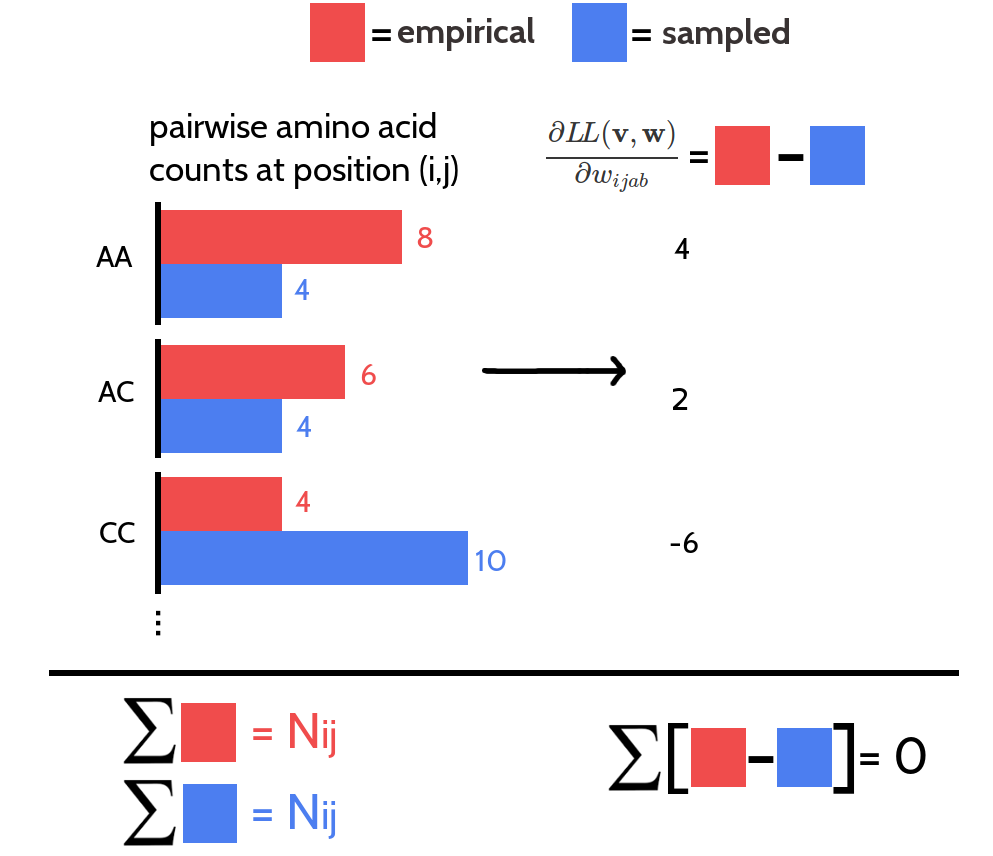

# Methods

all you need to know

## Dataset {#dataset}

A protein dataset has been constructed from the CATH (v4.1) [@Sillitoe2015] database for classification of protein domains.
All CATH domains from classes 1(mainly $\alpha$), 2(mainly $\beta$), 3($\alpha+\beta$) have been selected and filtered for internal redundancy at the sequence level using the `pdbfilter` script from the HH-suite[@Remmert2012] with an E-value cutoff=0.1. 
The dataset has been split into ten subsets aiming at the best possible balance between CATH classes 1,2,3 in the subsets. 
All domains from a given CATH topology (=fold) go into the same subsets, so that any two subsets are non-redundant at the fold level. 
Some overrepresented folds (e.g. Rossman Fold) have been subsampled ensuring that in every subset each class contains at max 50% domains of the same fold. 
Consequently, a fold is not allowed to dominate a subset or even a class in a subset.
In total there are 6741 domains in the dataset.


Multiple sequence alignments were built from the CATH domain sequences ([COMBS](http://www.cathdb.info/version/current/domain/3cdjA03/sequence)) using HHblits [@Remmert2012] with parameters to maximize the detection of homologous sequences:

`
hhblits -maxfilt 100000 -realign_max 100000 -B 100000 -Z 100000 -n 5 -e 0.1 -all
hhfilter -id 90 -neff 15 -qsc -30
`

The COMBS sequences are derived from the SEQRES records of the PDB file and sometimes contain extra residues that are not resolved in the structure. 
Therefore, residues in PDB files have been renumbered to match the COMBS sequences. The process of renumbering residues in PDB files yielded ambigious solutions for 293 proteins, that were removed from the dataset. 
Another filtering step was applied to remove 80 proteins that do not hold the following properties:

*  more than 10 sequences in the multiple sequence alignment ($N>10$)
*  protein length between 30 and 600 residues ($30 \leq L \leq 600$)
*  less than 80% gaps in the multiple sequence alignment (percent gaps < 0.8)
*  at least one residue-pair in contact at $C_\beta < 8\angstrom$ and minimum sequence separation of 6 positions

The final dataset is comprised of **6368** proteins with almost evenly distributed CATH classes over the ten subsets  (Figure \@ref(fig:dataset-cath-topologies)).


(ref:caption-dataset-cath-topologies) Distribution of CATH classes (1=mainly $\alpha$, 2=mainly $\beta$, 3=$\alpha-\beta$) in the dataset and the ten subsets.

```{r dataset-cath-topologies, echo = FALSE, screenshot.alt="img/amino_acid_physico_chemical_properties_venn_diagramm.png",  out.width = '100%', fig.cap = '(ref:caption-dataset-cath-topologies) '}
knitr::include_url("img/dataset_statistics/cath_topologies_stacked_reative_notitle.html")
```


## Computing Pseudo-Likelihood Couplings

Dr Stefan Seemayer has reimplementated the open-source software CCMpred [@Seemayer2014] in Python. 
CCMpred optimizes the regularized negative pseudo-log-likelihood using a conjugate gradients optimizer. 
Based on a fork of his private github repository I continued development and extended the software, which is now called CCMpredPy. 
It will soon be available at https://github.com/soedinglab/CCMpredPy.
All computations in this thesis are performed with CCMpredPy unless stated otherwise.

### Differences between CCMpred and CCMpredpy {#diff-ccmpred-ccmpredpy}

CCMpredPy differs from CCMpred [@Seemayer2014] which is available at https://github.com/soedinglab/CCMpred in several details:

- Initialization of potentials $\v$ and $\w$
    - CCMpred initializes single potentials $\v_i(a) = \log f_i(a) - \log f_i(a= "-")$ with $f_i(a)$ being the frequency of amino acid a at position i and $a="-"$ representing a gap. A single pseudo-count has been added before computing the frequencies. Pair potentials $\w$ are intialized at 0.
    - CCMpredPy initializes single potentials $\v$ with the [ML](#abbrev) estimate of single potentials (see section \@ref(regularization)) using amino acid frequencies computed as described in section \@ref(amino-acid-frequencies). Pair potentials $\w$ are initialized at 0.
- Regularization
    - CCMpred uses a Gaussian regularization prior centered at zero for both single and pair potentials. The regularization coefficient for single potentials $\lambda_v = 0.01$ and for pair potentials $\lambda_w = 0.2 * (L-1)$ with $L$ being protein length.
    - CCMpredPy uses a Gaussian regularization prior centered at zero for the pair potentials. For the single potentials the Gaussian regularization prior is centered at the [ML](#abbrev) estimate of single potentials (see section \@ref(regularization)) using amino acid frequencies computed as described in section \@ref(amino-acid-frequencies). The regularization coefficient for single potentials $\lambda_v = 10$ and for pair potentials $\lambda_w = 0.2 * (L-1)$ with $L$ being protein length.

Default settings for CCMpredPy have been chosen to best reproduce CCMpred results.
A benchmark over a subset of approximately 3000 proteins confirms that performance measured as [PPV](#abbrev) for both methods is almost identical (see Figure \@ref(fig:cmmpredvanilla-vs-ccmpredpy)). 


(ref:caption-cmmpredvanilla-vs-ccmpredpy) Mean precision over 3124 proteins of top ranked contacts computed as [APC](#abbrev) corrected Frobenius norm of couplings. Couplings have been computed with CCMpred [@Seemayer2014] and CCMpredPy as specified in the legend. Specific flags that have been used to run both methods are described in detail in the text (see section \@ref(diff-ccmpred-ccmpredpy)).

```{r cmmpredvanilla-vs-ccmpredpy, echo = FALSE, screenshot.alt="img/methods/ccmpredvanilla_vs_ccmpredpy_precision_vs_rank.png",  out.width = '100%', fig.cap = '(ref:caption-cmmpredvanilla-vs-ccmpredpy)'}
knitr::include_url("img/methods/ccmpredvanilla_vs_ccmpredpy_precision_vs_rank.html", height="500px")
```

The benchmark in Figure \@ref(fig:cmmpredvanilla-vs-ccmpredpy) as well as all contacts predicted with CCMpred and CCMPredPy (using pseudo-likelihood) in my thesis have been computed using the following flags:

CCMpredPy
```
--maxit 250                       # Compute a maximum of MAXIT operations
--center-v                        # Use a Gaussian prior for single potentials centered at ML estimate v*
--reg-l2-lambda-single 10         # regularization coefficient for single potentials
--reg-l2-lambda-pair-factor 0.2   # regularization coefficient for pairwise potentials computed as reg-l2-lambda-pair-factor * (L-1)
--pc-uniform                      # use uniform pseudocounts (1/21 for 20 amino acids + 1 gap state) 
--pc-count 1                      # defining pseudo count admixture coefficient rho = pc-count/( pc-count+ Neff)
--epsilon 1e-5                    # convergence criterion for minimum decrease in the last K iterations
--ofn-pll                         # using pseudo-likelihood as objective function
--alg-cg                          # using conjugate gradient to optimize objective function
```

CCMpred
```
-n 250    # NUMITER:  Compute a maximum of NUMITER operations
-l 0.2    # LFACTOR:  Set pairwise regularization coefficients to LFACTOR * (L-1) 
-w 0.8    # IDTHRES:  Set sequence reweighting identity threshold to IDTHRES
-e 1e-5   # EPSILON:  Set convergence criterion for minimum decrease in the last K iterations to EPSILON
```

## Sequence Reweighting {#seq-reweighting}

As discussed in section \@ref(challenges), sequences in a [MSA](#abbrev) do not represent independent draws from a probabilistic model. 
To reduce the effects of overrepresented sequences, typically a simple weighting strategy is applied that assigns a weight to each sequence that is the inverse of the number of similar sequences according to an identity threshold [@Stein2015a]. 
It has been found that reweighting improves contact prediction performance [@Buslje2009; @Morcos2011; @Jones2012] significantly but results are robust against the choice of the identity threshold in a range between 0.7 and 0.9 [@Morcos2011]. 
An identity threshold of 0.8 has been used for all analyses in this thesis.   

Every sequence $x_n$ of length $L$ in an alignment with $N$ sequences has an associated weight $w_n = 1/m_n$, where $m_n$ represents the number of similar sequences:

\begin{equation} 
  w_n = \frac{1}{m_n}, m_n = \sum_{m=1}^N I \left( ID(x_n, x_m) \geq 0.8 \right) \\
  ID(x_n, x_m)=\frac{1}{L} \sum_{i=1}^L I(x_n^i = x_m^i)
  (\#eq:seqweight)
\end{equation} 

The number of effective sequences $\mathbf{\neff}$ of an alignment is then the number of sequence clusters computed as:

\begin{equation} 
  \neff = \sum_{n=1}^N w_n
  (\#eq:neff)
\end{equation}


TODO: Plot Performance for Seq weighting


## Computing Amino Acid Frequencies {#amino-acid-frequencies}

Single and pairwise amino acid frequencies are computed from amino acid counts of weighted sequences as described in the last section \@ref(seq-reweighting) and additional pseudocounts that are added to improve numerical stability. 

Let $a,b \in \{1,\ldots,20\}$ be amino acids and $q_0(x_i=a), q_0(x_i=a,x_j=b)$ be the empirical single and pair frequencies without pseudocounts. 
The empirical single and pair frequencies with pseudocounts, $q(x_i=a), q(x_i=a, x_j=b)$, are defined

\begin{align}
    q(x_i \eq a) :=& (1-\tau) \;  q_0(x_i \eq a) + \tau \tilde{q}(x_i\eq a) \\
    q(x_i \eq a, x_j \eq b) :=& (1-\tau)^2  \; [ q_0(x_i \eq a, x_j \eq b) - q_0(x_i \eq a)  q_0(x_j \eq b) ] + \\
                            & q(x_i \eq a) \; q(x_j \eq b) 
(\#eq:pseudocounts)
\end{align}

with $\tilde{q}(x_i \eq a) := f(a)$ being background amino acid frequencies and $\tau \in [0,1]$ is a pseudocount admixture coefficient, which is a function of the diversity of the multiple sequence alignment:

\begin{equation}
    \tau = \frac{N_\mathrm{pc}}{(N_\mathrm{eff} + N_\mathrm{pc})}
(\#eq:tau)
\end{equation} 

where $N_{pc} > 0$.

The formula for $q(x_i \eq a, x_j \eq b)$ in the second line in eq \@ref(eq:pseudocounts) was chosen such that for $\tau \eq0$ we obtain $q(x_i \eq a, x_j \eq b) = q_0(x_i \eq a, x_j  \eq b)$, and furthermore
 $q(x_i \eq a, x_j  \eq b) = q(x_i \eq a)  q(x_j \eq b)$ exactly if $q_0(x_i \eq a, x_j  \eq b) = q_0(x_i \eq a)  q_0(x_j \eq b)$.


## Regularization {#methods-regularization}

*CCMpredPy* offers an L2-regularization that pushes the single and pairwise terms smoothly towards zero and is equivalent to the logarithm of a zero-centered Gaussian prior,

\begin{align}
  R(\v, \w)  &= \log \left[ \mathcal{N}(\v | \v^*, \lambda_v^{-1} I) \mathcal{N}(\w | \w^*, \lambda_w^{-1} I) \right] \nonumber \\
             &= -\frac{\lambda_v}{2} ||\v-\v^*||_2^2 - \frac{\lambda_w}{2} ||\w-w^*||_2^2 + \text{const.} \; ,
(\#eq:l2-reg)
\end{align}

where the regularization coefficients $\lambda_v$ and $\lambda_w$ determine the strength of regularization.
Most previous pseudo-likelihood approaches using L2-regularization for pseudo-likelihood optimization set $\v^* \eq \w^* \eq \mathbf{0}$ [@Seemayer2014; @Ekeberg2014; @Kamisetty2013].
A different choice for $v^*$ is discussed in section \@ref(prior-v) that is is used with *CCMpredPy* for pseudo-likelihood optimization.
The single potentials will not be optimized with [CD](#abbrev) but will be fixed at the $v^*$ given in eq. \@ref(eq:prior-v).
Furthermore, *CCMpredPy* uses regularization coefficients $\lambda_v \eq 10$ and $\lambda_w \eq 0.2\cdot(L-1)$ for pseudo-likelihood optimization and the choice for $\lambda_w$ used with [CD](#abbrev) is discussed in section \@ref(regularization-for-cd-with-sgd).

The regularization coefficient $\lambda_w$ for couplings $\w$ is defined with respect to protein length $L$ owing to the fact that the number of possible contacts in a protein increases quadratically with $L$ whereas the number of observed contacts only increases linearly as can be seen in Figure \@ref(fig:number-contacts-against-L).

(ref:caption-number-contacts-against-L) Number of contacts ($\Cb < 8 \angstrom$) with respect to protein length and sequence separation has a linear relationship.

```{r number-contacts-against-L, echo = FALSE, screenshot.alt="img/full_likelihood/no_contacts_vs_protein_length_thr8.png", out.width = '90%', fig.align='center', fig.cap = '(ref:caption-number-contacts-against-L)'}
knitr::include_url("img/full_likelihood/no_contacts_vs_protein_length_thr8.html", height = "500px")
```


## The Potts Model {#potts-full-likelihood}

The $N$ sequences of the [MSA](#abbrev) $\X$  of a protein family are denoted as ${\seq_1, ..., \seq_N}$. 
Each sequence $\seq_n = (\seq_{n1}, ..., \seq_{nL})$ is a string of $L$ letters from an alphabet indexed by $\{0, ..., 20\}$, where 0 stands for a gap and $\{1, ... , 20\}$ stand for the 20 types of amino acids. 
The likelihood of the sequences in the [MSA](#abbrev) of the protein family is modelled with a *Potts Model*, as described in detail in section \@ref(maxent): 

\begin{align}
    p(\X | \v, \w) &= \prod_{n=1}^N p(\seq_n | \v, \w) \nonumber \\
                   &= \prod_{n=1}^N \frac{1}{Z(\v, \w)} \exp \left( \sum_{i=1}^L v_i(x_{ni}) \sum_{1 \leq i < j \leq L} w_{ij}(x_{ni}, x_{nj}) \right)
\end{align}

The coefficients $\via$ and $\wijab$ are referred to as single potentials and couplings, respectively that describe the tendency of an amino acid a (and b) to (co-)occur at the respective positions in the [MSA](#abbrev).
$Z(\v, \w)$ is the partition function that normalizes the probability distribution $p(\seq_n |\v, \w)$:

\begin{equation}
  Z(\v, \w) = \sum_{y_1, ..., y_L = 1}^{20} \exp \left( \sum_{i=1}^L v_i(y_i) \sum_{1 \leq i < j \leq L} w_{ij}(y_i, y_j)  \right)
\end{equation}


The log likelihood is
\begin{align}
    \LL &= \log p(\X | \v, \w) \\
        &= \sum_{n=1}^N \left [  \sum_{i=1}^L v_i(x_{ni}) \sum_{1 \leq i < j \leq L} w_{ij}(x_{ni}, x_{nj})   \right ] - N \log Z(\v, \w) .
\end{align}


The gradient of the log likelihood has single components
\begin{align}
    \frac{\partial \LL}{\partial \via} &= \sum_{n=1}^N I(x_{ni}=a)  - N \frac{\partial}{\partial \via} \log Z(\v,\w) \\
                                        &= \sum_{n=1}^N I(x_{ni} \eq a) - N \sum_{y_1,\ldots,y_L=1}^{20} \!\! \frac{ \exp \left( \sum_{i=1}^L v_i(y_i) + \sum_{1 \le i < j \le L} w_{ij}(y_i,y_j) \right)}{Z(\v,\w)}  I(y_i \eq a) \\
                                        &=  N q(x_{i} \eq a) - N p(x_i \eq a | \v,\w) 
(\#eq:gradient-LL-single)
\end{align}

and pair components

\begin{align}
    \frac{\partial \LL}{\partial \wijab} &= \sum_{n=1}^N I(x_{ni}=a, x_{nj}=b)  - N \frac{\partial}{\partial \wijab} \log Z(\v,\w) \\
                                        &= \sum_{n=1}^N I(x_{ni} \eq a, x_{nj} \eq b) \\
                                        & - N \sum_{y_1,\ldots,y_L=1}^{20} \!\! \frac{ \exp \left( \sum_{i=1}^L v_i(y_i) + \sum_{1 \le i < j \le L} w_{ij}(y_i,y_j) \right)}{Z(\v,\w)}  I(y_i \eq a, y_j \eq b) \\
                                        &=  N q(x_{i} \eq a, x_{j} \eq b) - N \sum_{y_1,\ldots,y_L=1}^{20} p(y_1, \ldots, y_L | \v,\w) \, I(y_i \eq a, y_j \eq b) \\
                                        &=  N q(x_{i} \eq a, x_{j} \eq b) - N p(x_i \eq a, x_j \eq b | \v,\w) 
(\#eq:gradient-LL-pair)
\end{align}


### Treating Gaps as Missing Information {#gap-treatment}

Treating gaps explicitly as 0’th letter of the alphabet will lead to couplings between columns that are not in physical contact. 
To see why, imagine a hypothetical alignment consisting of two sets of sequences as it is illustrated in Figure \@ref(fig:gap-treatment). 
The first set has sequences covering only the left half of columns in the MSA, while the second set has sequences covering only the right half of columns. 
The two blocks could correspond to protein domains that were aligned to a single query sequence. 
Now consider couplings between a pair of columns $i, j$ with $i$ from the left half and $j$ from the right half. 
Since no sequence (except the single query sequence) overlaps both domains, the empirical amino acid pair frequencies $q(x_i = a, x_j = b)$ will vanish for all $a, b \in \{1,... , L\}$. 

(ref:caption-gap-treatment) Hypothetical [MSA](#abbrev) consisting of two sets of sequences: the first set has sequences covering only the left half of columns, while the second set has sequences covering only the right half of columns. The two blocks could correspond to protein domains that were aligned to a single query sequence. Empirical amino acid pair frequencies $q(x_i \eq a, x_j \eq b)$ will vanish for positions $i$ from the left half and $j$ from the right half of the alignment.

```{r gap-treatment, echo = FALSE, fig.align='center', fig.cap = '(ref:caption-gap-treatment)'}
knitr::include_graphics("img/gap_treatment.png")
```


According to the gradient of the log likelihood for couplings $\wijab$ given in eq \@ref(eq:gradient-LL-pair), the empirical frequencies $q(x_{i} \eq a, x_{j} \eq b)$ are equal to the model probabilities $p(x_i \eq a, x_j \eq b | \v,\w)$ at the maximum of the likelihood when the gradient vanishes.
Therefore, $p(x_i \eq a, x_j \eq b | \v, \w)$ would have to be zero at the optimum when the empirical amino acid frequencies $q(x_i \eq a, x_j \eq b)$ vanish for pairs of columns as described above.
However, $p(x_i \eq a, x_j \eq b | \v, \w)$ can only become zero, when the exponential term is zero, which would only be possible if $\wijab$ goes to $−\infty$. 
This is clearly undesirable, as physical contacts will be deduced from the size of the couplings.

The solution is to treat gaps as missing information. 
This means that the normalisation of $p(\seq_n | \v, \w)$ should not run over all positions $i \in \{1,... , L\}$ but only over those $i$ that are not gaps in $\seq_n$.
Therefore, the set of sequences $\Sn$ used for normalization of $p(\seq_n | \v, \w)$ in the partition function will be defined as:

\begin{equation}
\Sn := \{(y_1,... , y_L): 0 \leq y_i \leq 20 \land (y_i \eq 0 \textrm{ iff } x_{ni} \eq 0) \}
\end{equation}

and the partition function becomes:

\begin{equation}
  Z_n(\v, \w) = \sum_{\mathbf{y} \in \Sn} \exp \left( \sum_{i=1}^L v_i(y_i) \sum_{1 \leq i < j \leq L} w_{ij}(y_i, y_j)  \right)
\end{equation}

To ensure that the gaps in $y \in \Sn$ do not contribute anything to the sums, the parameters associated with a gap will be fixed to 0
$$
\vi(0) = \wij(0, b) = \wij(a, 0) = 0 \; ,
$$
for all $i, j \in \{1, ..., L\}$ and $a, b \in \{0, ..., 20\}$.


Furthermore, the empirical amino acid frequencies $q_{ia}$ and $q_{ijab}$ need to be redefined such that they are normalised over $\{1, ..., 20\}$,

\begin{align}
   N_i :=& \sum_{n=1}^N  w_n I(x_{ni} \!\ne\! 0) &  q_{ia} = q(x_i \eq a) :=& \frac{1}{N_i} \sum_{n=1}^N w_n I(x_{ni} \eq a)   \\
   N_{ij} :=& \sum_{n=1}^N  w_n I(x_{ni} \!\ne\! 0, x_{nj} \!\ne\! 0)  &  q_{ijab} = q(x_i \eq a, x_j \eq b) :=& \frac{1}{N_{ij}} \sum_{n=1}^N w_n I(x_{ni} \eq a, x_{nj} \eq b)
\end{align}

with $w_n$ being sequence weights calculated as described in methods section \@ref(seq-reweighting).
With this definition, empirical amino acid frequencies are normalized without gaps, so that

\begin{equation}
    \sum_{a=1}^{20} q_{ia} = 1      \; , \;     \sum_{a,b=1}^{20} q_{ijab} = 1.
(\#eq:normalized-emp-freq)
\end{equation}


### The Regularized Full Log Likelihood and its Gradient With Gap Treatment

In pseudo-likelihood based methods, a regularisation is commonly used that can be interpreted to arise from a prior probability.
The same treatment will be applied to the full likelihood.
Gaussian priors $\mathcal{N}( \v | \v^*, \lambda_v^{-1} \I)$ and $\mathcal{N}( \w |\boldsymbol 0, \lambda_w^{-1} \I)$ will be used to constrain the parameters $\v$ and $\w$ and to fix the gauge.
The choice of $v^*$ is discussed in section \@ref(prior-v). 
By including the logarithm of this prior into the log likelihood the regularised log likelihood is obtained,

\begin{equation}
    \LLreg(\v,\w)  = \log \left[ p(\X | \v,\w) \;  \Gauss (\v | \v^*, \lambda_v^{-1} \I)  \; \Gauss( \w | \boldsymbol 0, \lambda_w^{-1} \I) \right] 
\end{equation}

or explicitely,

\begin{align}
    \LLreg(\v,\w) =& \sum_{n=1}^N  \left[ \sum_{i=1}^L v_i(x_{ni}) + \sum_{1\le i<j\le L} w_{ij}(x_{ni},x_{nj}) - \log Z_n(\v,\w) \right] \\
                    & - \frac{\lambda_v}{2} \!\! \sum_{i=1}^L \sum_{a=1}^{20} (\via - \via^*)^2  - \frac{\lambda_w}{2}  \sum_{1 \le i < j \le L} \sum_{a,b=1}^{20} \wijab^2 .
\end{align}


The gradient of the regularized log likelihood has single components

\begin{align}
    \frac{\partial \LLreg}{\partial \via} =& \sum_{n=1}^N I(x_{ni}=a) - \sum_{n=1}^N \frac{\partial}{\partial \via} \, \log Z_n(\v,\w) - \lambda_v (\via - \via^*)\\
                                          =& \; N_i q(x_i \eq a) \\
                                          & - \sum_{n=1}^N \sum_{\mathbf{y} \in \Sn} \frac{  \exp \left( \sum_{i=1}^L v_i(y_i) + \sum_{1 \le i<j \le L}^L w_{ij}(y_i,y_j) \right) }{Z_n(\v,\w)}  I(y_i=a) \\
                                          & - \lambda_v (\via - \via^*) 
(\#eq:gradient-LLreg-single)
\end{align}

and pair components

\begin{align}
    \frac{\partial \LLreg}{\partial \wijab} =& \sum_{n=1}^N I(x_{ni} \eq a, x_{nj} \eq b) - \sum_{n=1}^N \frac{\partial}{\partial \wijab} \log Z_n(\v,\w)  - \lambda_w \wijab \\
                                            =& \; N_{ij} q(x_i \eq a, x_j=b) \\
                                            & - \sum_{n=1}^N \sum_{\mathbf{y} \in \Sn} \frac{ \exp \left( \sum_{i=1}^L v_i(y_i) + \sum_{1 \le i<j \le L}^L w_{ij}(y_i,y_j) \right) }{Z_n(\v,\w)} I(y_i \eq a, y_j \eq b) \\
                                            & - \lambda_w \wijab  
(\#eq:gradient-LLreg-pair)
\end{align}


Note that (without regulariation $\lambda_v = \lambda_w = 0$) the empirical frequencies $q(x_i \eq a)$ and $q(x_i \eq a, x_j=b)$ are equal to the model probabilities at the maximum of the likelihood when the gradient becomes zero.


If the proportion of gap positions in $\X$ is small (e.g. $<5\%$, also compare percentage of gaps in dataset in Appendix Figure \@ref(fig:dataset-gaps)), the sums over $\mathbf{y} \in \Sn$ in eqs. \@ref(eq:gradient-LLreg-single) and \@ref(eq:gradient-LLreg-pair) can be approximated by $p(x_i=a | \v,\w) I(x_{ni} \ne 0)$ and $p(x_i=a, x_j=b | \v,\w) I(x_{ni} \ne 0, x_{nj} \ne 0)$, respectively, and the partial derivatives become

\begin{equation}
  \frac{\partial \LLreg}{\partial \via}   = \; N_i q(x_i \eq a) -  N_i \; p(x_i \eq a  | \v,\w)  - \lambda_v (\via - \via^*)
(\#eq:gradient-LLreg-single-approx)
\end{equation}

\begin{equation}
  \frac{\partial \LLreg}{\partial \wijab} = \; N_{ij} q(x_i \eq a, x_j=b) - N_{ij} \; p(x_i \eq a, x_j \eq b | \v,\w) - \lambda_w \wijab
(\#eq:gradient-LLreg-pair-approx)
\end{equation}

Note that the couplings between columns $i$ and $j$ in the hypothetical MSA presented in the last section \@ref(gap-treatment) will now vanish since $N_{ij} \eq 0$ and the gradient with respect to $\wijab$ is equal to $-\lambda_w \wijab$.


### The prior on $\v$ {#prior-v}

Most previous approaches chose a prior around the origin, $p(\v) = \Gauss ( \v| \mathbf{0}, \lambda_v^{-1} \I)$, i.e., $\via^* \eq 0$. 
It can be shown that the choice $\via^* \eq 0$ leads to undesirable results.
Taking the sum over $b=1,\ldots, 20$ at the optimum of the gradient of couplings in eq. \@ref(eq:gradient-LLreg-pair-approx), yields

\begin{equation}
    0 =   N_{ij}\, q(x_i \eq a, x_j \ne 0)   - N_{ij}\, p(x_i \eq a | \v, \w)  - \lambda_w \sum_{b=1}^{20} \wijab \; ,
    (\#eq:sum-over-b-at-optimum)
\end{equation}
for all $i,j \in \{1,\ldots,L\}$ and all $a \in \{1,\ldots,20\}$. 

Note, that by taking the sum over $a=1,\ldots, 20$ it follows that, 
\begin{equation}
    \sum_{a,b=1}^{20} \wijab  = 0.
(\#eq:zero-sum-wij)
\end{equation}

At the optimum the gradient with respect to $\via$ vanishes and according to eq. \@ref(eq:gradient-LLreg-single-approx), $p(x_i=a|\v,\w) = q(x_i=a) - \lambda_v (\via - \via^*) / N_i$.
This term can be substituted into equation \@ref(eq:sum-over-b-at-optimum), yielding 

\begin{equation}
    0 =  N_{ij} \, q(x_i \eq a, x_j \ne 0)  - N_{ij} \, q(x_i=a) + \frac{N_{ij}}{N_i}\lambda_v (\via - \via^*)  - \lambda_w \sum_{b=1}^{20} \wijab \; .
(\#eq:gauge-opt-1)
\end{equation}

Considering a [MSA](#abbrev) without gaps, the terms $N_{ij} \, q(x_i \eq a, x_j \ne 0)  - N_{ij} \, q(x_i=a)$ cancel out, leaving

\begin{equation}
    0 =  \lambda_v (\via - \via^*)  - \lambda_w \sum_{b=1}^{20} \wijab .
(\#eq:gauge-opt-2)
\end{equation}

Now, consider a column $i$ that is not coupled to any other and assume that amino acid $a$ was frequent in column $i$ and therefore $\via$ would be large and positive. 
Then according to eq. \@ref(eq:gauge-opt-2),  for any other column $j$ the 20 coefficients $\wijab$ for $b \in \{1,\ldots,20\}$ would have to take up the bill and deviate from zero! 
This unwanted behaviour can be corrected by instead choosing a Gaussian prior centered around $\v^*$ obeying 
\begin{equation}
  \frac{\exp(\via^*)}{\sum_{a^{\prime}=1}^{20} \exp(v_{ia^{\prime}}^*)} = q(x_i=a) .
\end{equation}

This choice ensures that if no columns are coupled, i.e. $p(\seq | \v,\w) = \prod_{i=1}^L p(x_i)$, $\v=\v^*$ and $\w= \mathbf{0}$ gives the correct probability model for the sequences in the [MSA](#abbrev). 
Furthermore imposing the restraint $\sum_{a=1}^{20} \via \eq 0$ to fix the gauge of the $\via$ (i.e. to remove the indeterminacy), yields

\begin{align}
\via^* = \log q(x_i \eq a) - \frac{1}{20} \sum_{a^{\prime}=1}^{20} \log q(x_i \eq a^{\prime}) .
(\#eq:prior-v)
\end{align}

For this choice, $\via - \via^*$ will be approximately zero and will certainly be much smaller than $\via$, hence the sum over coupling coefficients in eq. \@ref(eq:gauge-opt-2) will be close to zero, as it should be. 


## Analysis of Coupling Matrices

### Correlation of Couplings with Contact Class {#method-coupling-correlation}

Approximately 100000 residue pairs have been filtered for contacts and non-contacts respectively according to the following criteria:

- consider only residue pairs separated by at least 10 positions in sequence
- minimal diversity ($=\frac{\sqrt{N}}{L}$) of alignment = 0.3
- minimal number of non-gapped sequences = 1000
- $\Cb$ distance threshold for contact: $<8\angstrom$
- $\Cb$ distance threshold for noncontact: $>25\angstrom$

### Coupling Distribution Plots {#method-coupling-profile}

For one-dimensional coupling distribution plots the residue pairs and respective pseudo-log-likelihood coupling values $\wijab$ have been selected as follows:

- consider only residue pairs separated by at least 10 positions in sequence
- discard residues that have more than 30% gaps in the alignment
- discard residue pairs that have insufficient evidence in the alignment: $N_{ij} \cdot q_i(a)  \cdot q_j(b) < 100$ with:
    - $N_{ij}$ is the number of sequences with neither a gap at position i nor at position j
    - $q_i(a)$ and $q_j(b)$ are the frequencies of amino acids a and b at positions i and j (computed as described in section \@ref(amino-acid-frequencies)) 
    
These criteria ensure that uninformative couplings are neglected, e.g. sequence neighbors albeit being contacts according to the $\Cb$ contact definition cannot be assumed to express biological meaningful coupling patterns, or couplings for amino acid pairings that do not have statistical relevant counts in the alignment.

The same criteria have been applied for selecting couplings for the two-dimensional distribution plots with the difference that evidence for a single coupling term has to be $N_{ij} \cdot q_i(a) \cdot q_j(b) < 80.$


## Optimizing Contrastive Divergence with Stochastic Gradient Descent {#methods-sgd}

This section describes hyperparameter tuning for the stochastic gradient descent optimization of [CD](#abbrev). 

The couplings $\wijab$ are initialized at 0 and single potentials $\vi$ will not be optimized but rather kept fixed at their maximum-likleihood estimate $\vi^*$ as described in methods section \@ref(prior-v).
The gradient of the full likelihood is approximated with [CD](#abbrev) which involves Gibbs sampling of protein sequences according to the current model parametrization and is described in detail in methods section \@ref(cd-sampling-optimization).
Zero centered L2-regularization is used to constrain the coupling parameters $\w$ using the regularization coefficient $\lambda_w = 0.2L$ which is the default setting for optimizing the pseudo-likelihood with *CCMpredPy*. 
Performance will be evaluated by the mean precision of top ranked contact predictions over a benchmark set of 300 proteins, that is a subset of the data set described in methods section \@ref(dataset).
Contact scores for couplings are computed as the [APC](#abbrev) corrected Frobenius norm as explained in section \@ref(post-processing-heuristics).
Pseudo-likelihood couplings are computed with the tool *CCMpredPy* that is introduced in methods section \@ref(diff-ccmpred-ccmpredpy) and the pseudo-likelihood contact score will serve as general reference method for tuning the hyperparameters.


### Convergence Criterion for Stochastic Gradient Descent

In theory the gradient descent algorithm has converged and the optimum of the objective function has been reached when the gradient becomes zero. 
In practice the gradients will never be exactly zero, especially due to the stochasticity of the gradient estimates when using stochastic gradient descent with [CD](#abbrev).
For this reason, it is crucial to define a suitable convergence criterion that can be tested during optimization and once the criterion is met, convergence is assumed and the algorithm is stopped. 
Typically, the objective function (or a related loss function) is periodically evaluated on a validation set and the optimizer is halted whenever the function value saturates or starts to increase.
This technique is called early stopping and additionally prevents overfitting [@Bengio2012; @Mahsereci2017].
Unfortunately, we cannot compute the full likelihood function due to its complexity and need to define a different convergence criterion.

One possibility is to stop learning when the norm of the gradients is close to zero [@Carreira-Perpinan2005].
As described earlier, only a subset of alignment sequences is used to estimate the gradient with [CD](#abbrev) which increases stochasticity of the gradient estimate and speeds up the algorithm.
As a result of stochasticity, the norm of gradients does not converge to zero but saturates at a certain offset as it is described in section \@ref(cd-sampling-optimization).
Only by using large number of sequences to estimate the gradients with [CD](#abbrev), the norm over gradients will converge towards a value close to zero.
However, runtine increases linearly in the number of sequences used for estimating the gradient with [CD](#abbrev) by Gibbs sampling.
Convergence can also be monitored as the relative change of the norm of gradients between a particular number of iterations and optimization can be stopped when the norm of gradients has reached a certain plateau.
As gradient estimates are generally very noisy with stochastic gradient descent, gradient fluctuations complicate the proper assessment of this criterion.

Instead of the gradients, it is also possible to observe the relative change over the norm of parameter estimates $||\w||_2$ and stop learning when it falls below a small threshold $\epsilon$,
\begin{equation}
  \frac{||\w_{t-1}||_2 - ||\w_t||_2}{||\w_{t-1}||_2} < \epsilon \; .
  (\#eq:parameter-convergence-criterion)
\end{equation}
This measure is less noisy than subsequent gradient estimates because the magnitude of parameter updates is bounded by the learning rate.

Another idea is to monitor the direction of gradients, since the assumption goes that gradients will start oscillating when approaching the optimum. 
However, this theoretical assumption is complicated by the fact that gradient oscillations are also typically observed when the parameter surface contains narrow valleys or when the learning rate is too big, as it is visualized in the right plot in Figure \@ref(fig:gd-learning-rate-intro).
Another interfering factor is momentum, as it is used in the *ADAM* optimizer.
Parameters will be updated into the direction of a smoothed historical gradient and oscillations, regardless of which origin, will be dampened.
It is therefore hard to define a general convergence criteria that uses gradient directions and can distinguish these different scenarios. 

Of course, the simplest strategy to assume convergence is to specify a maximum number of iterations for the optimization procedure, which also ensures that the algorithm will stop eventually if none of the other convergence criteria is met.

A necessary but not sufficient criterion for convergence for the full likelihood is given by $\sum_{a,b=1}^{20} \wijab = 0$.
This requirement is derived in section \@ref(prior-v).
When using plain stochastic gradient descent without momentum and without adaptive learning rates, this criterion is never violated when parameters are initialized uniformly.
This is due to the fact that the 400 gradients $\wijab$ for $a,b \in \{1, \ldots, 20\}$ are not independent because the sum over the 400 pairwise amino acid counts at positions $i$ and $j$ is identical for the observed and the sampled alignment and amounts to,

\begin{equation}
  \sum_{a,b=1}^{20} N_{ij} q(x_i \eq a, q_j \eq b) = N_{ij} \; .
\end{equation}

Considering a residue pair (i,j) and assuming amino acid pair (a,b) has higher counts in the sampled alignment than in the observed input alignment, then this difference in counts must be compensated by other amino acid pairs (c,d) having less counts in the sampled alignment compared to the true alignment (see Figure \@ref(fig:visualisation-wijab-constraint)).
Therefore it holds, $\sum_{a,b=1}^{20} \nabla_{\wijab}\LLreg(\v,\w) = 0$.
This symmetry is translated into parameter updates as long as the same learning rate is used to update all parameters. 
However, when using adaptive learning rates, this symmetry is broken and the condition $\sum_{a,b=1}^{20} \wijab = 0$ can be violated during the optimization processs.
It is therefore interesting to monitor $\sum_{1 \le 1 < j \le L} \sum_{a,b=1}^{20} \wijab$.

(ref:caption-visualisation-wijab-constraint) The 400 gradients $\nabla_{\wijab}\LLreg(\v,\w)$ at position $(i,j)$ for $a,b \in \{1, \ldots, 20 \}$ are not independent. Red bars represent pairwise amino acid counts at position $(i,j)$ for the sampled alignment. Blue bars represent pairwise amino acid counts at position $(i,j)$ for the input alignment. The sum over pairwise amino acid counts at position $(i,j)$ for both alignments is $N_{ij}$, which is the number of ungapped sequences. The gradient $\nabla_{\wijab}\LLreg(\v,\w)$ is computed as the difference of pairwise amino acid counts for amino acids a and b at position $(i,j)$. The sum over gradients $\nabla_{\wijab}\LLreg(\v,\w)$ at position $(i,j)$ for all $a,b \in \{1, \ldots, 20 \}$ is zero.

```{r visualisation-wijab-constraint, echo = FALSE, out.width = '60%', fig.align='center', fig.cap = '(ref:caption-visualisation-wijab-constraint)'}

```

I set the maximum number of iterations to 5000 and stop the optimization algorithm when the relative change over the L2-norm of parameter estimates $||\w||_2$ falls below the threshold of $\epsilon = 1e-8$.


### Tuning Hyperparameters of Stochastic Gradient Descent Optimizer {#sgd-hyperparameter-tuning}

The coupling parameters $\w$ will be updated at each time step $t$ by taking a step of size $\alpha$ along the direction of the negative gradient of the regularized full log likelihood, $- \nabla_w \LLreg(\v,\w)$, that has been approximated with [CD](#abbrev),

\begin{equation}
  \w_{t+1} = \w_t - \alpha \cdot \nabla_w \LLreg(\v,\w) \; .
\end{equation}

In order to get a first intuition of the optimization problem, I tested initial learning rates $\alpha_0 \in  \{1\mathrm{e}{-4}, 5\mathrm{e}{-4}, 1\mathrm{e}{-3}, 5\mathrm{e}{-3}\}$ with a standard learning rate annealing schedule, $\alpha  = \frac{\alpha_0}{1 + \gamma \cdot t}$ where $t$ is the time step and $\gamma$ is the decay rate that is set to 0.01[@Bottou2012].

Figure \@ref(fig:performance-cd-alphaopt) shows the mean precision for top ranked contacts computed from pseudo-likelihood couplings and from [CD](#abbrev) couplings optimized with stochastic gradient descent using the four different learning rates. 
Overall, mean precision for [CD](#abbrev) contacts is lower than for pseudo-likelihood contacts, especially when using the smallest ($\alpha_0 \eq 1\mathrm{e}{-4}$) and biggest ($\alpha_0 \eq 5\mathrm{e-}{3}$) learning rate.


(ref:caption-performance-cd-alphaopt)  Mean precision for top ranked contact predictions over 286 proteins. Contact scores are computed as the [APC](#abbrev) corrected Frobenius norm of the couplings $\wij$.  **pseudo-likelihood**:  couplings computed with pseudo-likelihood. **CD**: couplings computed with [CD](#abbrev) using stochastic gradient descent with different initial learning rates $\alpha_0$ as specified in the legend.

```{r performance-cd-alphaopt, echo = FALSE, screenshot.alt="img/full_likelihood/sgd/precision_vs_rank_learning_rates.png", out.width = '90%', fig.align='center', fig.cap = '(ref:caption-performance-cd-alphaopt)'}
knitr::include_url("img/full_likelihood/sgd/precision_vs_rank_learning_rates.html", height = "500px")
```

Looking at individual proteins it turns out that the optimal learning rate depends on alignment size.
The left plot in Figure \@ref(fig:sgd-single-proteins-initial-learning-rate) shows a convergence plot of [SGD](#abbrev) optimization using different learning rates for a protein with a small alignment.
With a small initial learning rate $\alpha_0 \eq \mathrm{1e-4}$ the optimization runs very slowly and does not reach convergence within 5000 iterations.
Using a large initial learning rate $\alpha_0 \eq \mathrm{5e-3}$ will result in slighly overshooting the optimum at the beginning of the optimization but with the learning rate decaying over time the parameter estimates converge. 
In contrast, for a protein with a big alignment (right plot in Figure \@ref(fig:sgd-single-proteins-initial-learning-rate)) the choice of learning rate has a more pronounced effect.
With a small initial learning rate  $\alpha_0 \eq \mathrm{1e-4}$ the optimization runs slowly but almost converges within 5000 iterations.
A large initial learning rate $\alpha_0 \eq \mathrm{5e-3}$ lets the parameters diverge quickly and the optimum cannot be revovered.
With learning rates $\alpha_0 \eq \mathrm{5e-4}$ and $\alpha_0 \eq \mathrm{1e-3}$, the optimum is well overshot at the beginning of the optimization but the parameter estimates eventually converge as the learning rate decreases over time.

These observations can be explained by the fact that the magnitude of the gradient scales with the number of sequences in the alignment.
The gradient is computed from amino acid counts as explained in section \@ref(full-likelihood-gradient).
Therefore, alignments with many sequences will generally produce larger gradients than alignments with few sequences, especially at the beginning of the optimization procedure when the difference in amino acid counts between sampled and observed sequences is largest.
Following these observations, I defined the initial learning rate $\alpha_0$ as a function of [Neff](#abbrev), aiming at values for $\alpha_0$ around 5e-3 for small [Neff](#abbrev) and values for $\alpha_0$ around 1e-4 for large [Neff](#abbrev),

\begin{equation}
  \alpha_0 = \frac{5\mathrm{e}{-2}}{\sqrt{N_{\text{eff}}}} \; .
  (\#eq:learning-rate-wrt-neff)
\end{equation}

For small [Neff](#abbrev) $\approx 50$ this definition of the learning rate yields $\alpha_0 \approx 7\mathrm{e}{-3}$ and for big [Neff](#abbrev) $\approx 20000$ this yields $\alpha_0 \approx 3.5\mathrm{e}{-4}$. 
Using this learning rate defined as a function of [Neff](#bbrev), precision improves over the previous fixed learning rates (see Figure \@ref(fig:performance-cd-alphaopt)).
All following analyses are conducted using the [Neff](#abbrev)-dependent learning rate.

(ref:caption-sgd-single-proteins-initial-learning-rate) Convergence plots for two proteins during [SGD](#abbrev) optimization with different learning rates and convergence measured as L2-norm of the coupling parameters $||\w||_2$ . Linear learning rate annealing schedule has been used with decay rate $\gamma=0.01$ and initial learning rates $\alpha_0$ have been set as specified in the legend. **Left** Convergence plot for protein 1mkc_A_00 having protein length L=43 and 142 sequences in the alignment ([Neff](#abbrev)=96). **Right** Convergence plot for protein 1c75_A_00 having protein length L=71 and 28078 sequences in the alignment ([Neff](#abbrev)=16808). Figure is cut at the yaxis at $||\w||_2=1500$, but learning rate of $5\mathrm{e}{-3}$ reaches $||\w||_2 \approx 13000$.

```{r sgd-single-proteins-initial-learning-rate, echo = FALSE, out.width = '50%', fig.align='center', fig.show='hold', fig.cap = '(ref:caption-sgd-single-proteins-initial-learning-rate)'}
knitr::include_graphics(c("img/full_likelihood/sgd/parameter_norm_1mkca00_alphas_lindecay001.png", "img/full_likelihood/sgd/parameter_norm_1c75a00_alphas_lindecay001.png"))
```

In a next step, I evaluated the following learning rate annealing schedules and decay rates using the [Neff](#abbrev)-dependent initial learning rate given in eq. \@ref(eq:learning-rate-wrt-neff):

- default linear learning rate schedule $\alpha  = \frac{\alpha_0}{1 + \gamma t}$ with $\gamma \in \{1\mathrm{e}{-3}, 1\mathrm{e}{-2}, 1\mathrm{e}{-1}, 1 \}$
- square root learning rate schedule $\alpha  = \frac{\alpha_0}{\sqrt{1 + \gamma t}}$ with $\gamma \in \{1\mathrm{e}{-2}, 1\mathrm{e}{-1}, 1 \}$
- sigmoidal learning rate schedule $\alpha_{t+1}  = \frac{\alpha_{t}}{1 + \gamma t}$ with $\gamma \in \{1\mathrm{e}{-6}, 1\mathrm{e}{-5}, 1\mathrm{e}{-4}, 1\mathrm{e}{-3}\}$
- exponential learning rate schedule $\alpha_{t+1}  = \alpha_0 \cdot\exp(- \gamma t)$ with $\gamma \in \{5\mathrm{e}{-4}, 1\mathrm{e}{-4}, 5\mathrm{e}{-3}\}$

The learning rate annealing schedules are visualized for different decay rates in Appendix Figure \@ref(fig:learning-rate-schedules) and the respective benchmark plots can be found in Appendix \@ref(benchmark-learning-rate-annealing-schedules).
Optimizing [CD](#abbrev) with [SGD](#abbrev) using any of the learning rate schedules listed above yields on average lower precision for the top ranked contacts than the pseudo-likelihood contact score.
Several learning rate schedules perform almost equally well as can be seen in Figure \@ref(fig:performance-cd-learnignrate-schedules). 
The highest precision, being one to two percentage points below the mean precision for the pseudo-likelihood contact score, is obtained with a linear learning rate schedule and decay rate $\gamma \eq 1\mathrm{e}{-2}$, with a sigmoidal learning rate schedule and decay rates $\gamma \eq 1\mathrm{e}{-5}$ and $\gamma \eq 1\mathrm{e}{-6}$ and with an exponential learning rate schedule and decay rate $\gamma \eq 1\mathrm{e}{-3}$ and $\gamma \eq 1\mathrm{e}{-5}$. 
The square root learning rate schedule gives ovarally bad results and does not lead to convergence because the learning rate decays slowly at later time steps.

(ref:caption-performance-cd-learnignrate-schedules) Mean precision for top ranked contact predictions over 288 proteins. Contact scores are computed as the [APC](#abbrev) corrected Frobenius norm of the couplings $\wij$. **pseudo-likelihood**:  couplings computed with pseudo-likelihood. **CD**: couplings computed with [CD](#abbrev) using stochastic gradient descent with an initial learning rate defined with respect to [Neff](#abbrev). Learning rate annealing schedules and decay rates as specified in the legend.

```{r performance-cd-learnignrate-schedules, echo = FALSE, screenshot.alt="img/full_likelihood/sgd/precision_vs_rank_schedules.png", out.width = '100%', fig.align='center', fig.cap = '(ref:caption-performance-cd-learnignrate-schedules)'}
knitr::include_url("img/full_likelihood/sgd/precision_vs_rank_schedules.html", height = "500px")
```


In contrast to the findings regarding the initial learning rate earlier, an optimal decay rate can be defined independent of the alignment size.
Figure \@ref(fig:sgd-single-proteins-learning-rate-schedule) shows convergence plots for the same two exemplary proteins as before.
Proteins with low [Neff](#abbrev) are robust against the particular choice of learning rate schedule and decay rate (see left plot in Figure \@ref(fig:sgd-single-proteins-learning-rate-schedule)).
The presumed optimum at $||w||_2 \approx 12.5$ is almost always reached.
Proteins with high [Neff](#abbrev) are stronger adversely affected by quickly decaying learning rates and the optimum at $||w||_2 \approx 125$ cannot be reached before the learning rate diminishes which effectively prevents further optimization progress.
Less quickly decaying learning rates, such as  $\gamma \eq 1\mathrm{e}{-2}$ with a linear schedule or $\gamma \eq 1\mathrm{e}{-6}$ with a sigmoidal schedule, guide the parameter estimates close to the expected optimum and can be used with proteins having low [Neffs](#abbrev) as well as having high [Neffs](#abbrev).

(ref:caption-sgd-single-proteins-learning-rate-schedule) L2-norm of the coupling parameters $||\w||_2$ during stochastic gradient descent optimization with different learning rates schedules. The initial learning rate $\alpha_0$ is defined with respect to [Neff](#abbrev) as given in eq. \@ref(eq:learning-rate-wrt-neff). Learning rate schedules and decay rates are used according to the legend. **Left** Convergence plot for protein 1mkc_A_00 having protein length L=43 and 142 sequences in the alignment ([Neff](#abbrev)=96). **Right** Convergence plot for protein 1c75_A_00 having protein length L=71 and 28078 sequences in the alignment ([Neff](#abbrev)=16808).

```{r sgd-single-proteins-learning-rate-schedule, echo = FALSE, out.width = '50%', fig.align='center', fig.show='hold', fig.cap = '(ref:caption-sgd-single-proteins-learning-rate-schedule)'}
knitr::include_graphics(c("img/full_likelihood/sgd/parameter_norm_1mkca00_alpha0_different_schedules.png", "img/full_likelihood/sgd/parameter_norm_1c75a00_alpha0_different_schedules.png"))
```

Several different learning rate annealing schedules yield almost identical mean precision for top ranked contacts, as was shown earlier (see Figure \@ref(fig:performance-cd-learnignrate-schedules)).
But it can be found that they differ in convergence speed.
Figure \@ref(fig:distribution-num-iterations) shows the distribution over the number of iterations until convergence for [SGD](#abbrev) optimizations with five different learning rate schedules that yield similar performance. 
The optimization converges on average within less than 2000 iterations only when using either a sigmoidal learning rate annealing schedule with decay rate $\gamma \eq 1\mathrm{e}{-5}$ or an exponential learning rate annealing schedule with decay rate $\gamma \eq 5\mathrm{e}{-3}$, 
On the contrary, the distribution  of iterations until convergence has a median of 5000 when using a linear learning rate annealing schedule with $\gamma \eq 1\mathrm{e}{-2}$ or an exponential schedule with decay rate $\gamma \eq 1\mathrm{e}{-3}$.
Under these considerations, I chose a sigmoidal learning rate schedule with $\gamma \eq 5\mathrm{e}{-6}$ for all further analysis.

(ref:caption-distribution-num-iterations) Distribution of the number of iterations until convergence for [SGD](#abbrev) optimizations of the full likelihood for different learning rate schedules. Convergence is reached when the relative difference of parameter norms $||\w||_2$ falls below $\epsilon \eq 1e-8$. Initial learning rate $\alpha_0$ is defined with respect to [Neff](#abbrev) as given in eq. \@ref(eq:learning-rate-wrt-neff) and maximum number of iterations is set to 5000. Learning rate schedules and decay rates are used as specified in the legend.

```{r distribution-num-iterations, echo = FALSE, screenshot.alt="img/full_likelihood/sgd/distribution_numiterations_against_selected_learningrate_schedules.png", out.width = '100%', fig.align='center', fig.cap = '(ref:caption-distribution-num-iterations)'}
knitr::include_url("img/full_likelihood/sgd/distribution_numiterations_against_selected_learningrate_schedules.html", height = "500px")
```


### Tuning Hyperparameters of *ADAM* Optimizer {#methods-full-likelihood-adam}

*ADAM* [@Kingma2014] stores an exponentially decaying average of past gradients and squared gradients,

\begin{align}
  m_t &= \beta_1 m_{t−1} + (1 − \beta_1) g \\
  v_t &= \beta_2 v_{t−1} + (1 − \beta_2) g^2 \; ,
\end{align}

with $g = \nabla_w \LLreg(\v,\w)$  and the rate of decay being determined by hyperparameters $\beta_1$ and $\beta_2$.
Both terms $m_t$ and $v_t$ represent estimates of the first and second moments of the gradient, respectively. 
The following bias correction terms compensates for the fact that the vectors $m_t$ and $v_t$ are both initialized at zero and therefore are biased towards zero especially at the beginning of optimization, 

\begin{align}
  \hat{m_t} &= \frac{m_t}{1-\beta_1^t} \\
  \hat{v_t} &= \frac{v_t}{1-\beta_2^t} \; .
\end{align}

Parameters are then updated using step size $\alpha$, a small noise term $\epsilon$ and the corrected moment estimates $\hat{m_t}$, $\hat{v_t}$, according to 
\begin{equation}
  x_{t+1} = x_t - \alpha \cdot \frac{\hat{m_t}}{\sqrt{\hat{v_t}} + \epsilon}
\end{equation}

Kingma et al. proposed the default values $\beta_1=0.9$, $\beta_2=0.999$ and $\epsilon=1e−8$ and a constant learning rate $\alpha=1e-3$.

For the two protein chains 1mkc_A_00 and 1c75_A_00, having 142 ([Neff](#abbrev)=96) and 28078 ([Neff](#abbrev)=16808) aligned sequences respectively, I analysed the convergence for [SGD](#abbrev) with different learning rates $\alpha$ (see Figure \@ref(fig:adam-learning-rate)).
In contrast to plain stochastic gradient descent, with *ADAM* it is possible to use larger learning rates for proteins having big alignments, because the learning rate will be adapted to the magnitude of the gradient for every parameter individually. 
For protein 1mkc_A_00 having a small alignment, a learning rate of 5e-3 quickly leads to convergence whereas for protein 1c75_A_00 a larger learning rate can be chosen to obtain quick convergence. 
As a consequence, I defined the learning rate $\alpha$ as a function of [Neff](#abbrev), 

\begin{equation}
  \alpha = 2\mathrm{e}{-3}\log(N_{\text{eff}}) \; ,
  (\#eq:learning-rate-wrt-neff-adam)
\end{equation}

such that it will take values ~5e-3 for proteins with small alignments and values ~1e-2 for proteins with large alignments.

(ref:caption-adam-learning-rate) L2-norm of the coupling parameters $||\w||_2$ during optimization with *ADAM* and different learning rates without annealing. The learning rate $\alpha$ is specified in the legend. **Left** Convergence plot for protein 1mkc_A_00 having protein length L=43 and 142 sequences in the alignment ([Neff](#abbrev)=96). **Right** Convergence plot for protein 1c75_A_00 having protein length L=71 and 28078 sequences in the alignment ([Neff](#abbrev)=16808).

```{r adam-learning-rate, echo = FALSE, out.width = '50%', fig.align='center', fig.show='hold', fig.cap = '(ref:caption-adam-learning-rate)'}
knitr::include_graphics(c("img/full_likelihood/adam/1mkcA00_learningrates_parameternorm.png", "img/full_likelihood/adam/1c75A00_learningrates_parameternorm.png"))
```

It is interesting to note in Figure \@ref(fig:adam-learning-rate), that the norm of the coupling parameters $||\w||_2$ converges towards different values depending on the choice of the learning rate $\alpha$.
This inidicates that it is necessary to decrease the learning rate over time.
By default, *ADAM* uses a constant learning rate, because the algorithm performs a kind of step size annealing by nature.
However, popular implementations of *ADAM* in the [Keras](https://github.com/fchollet/keras/blob/master/keras/optimizers.py#L385) [@Chollet2015] and [Lasagne](https://github.com/Lasagne/Lasagne/blob/master/lasagne/updates.py#L565-L629) [@Dieleman2015] packages allow the use of an annealing schedule.
I therefore tested different learning rate annealing schedules for *ADAM* assuming that with decreasing learning rates the L2-norm of the coupling parameters $||\w||_2$ will converge towards a consistent value.
Indeed, as can be seen in Figure \@ref(fig:adam-learning-rate-annealing), when using a linear or sigmoidal learning rate annealing schedule with *ADAM*, the L2-norm of the coupling parameters $||\w||_2$  converges roughly towards the same value that has been obtained with plain [SGD](#abbrev) shown in Figure \@ref(fig:sgd-single-proteins-learning-rate-schedule).


(ref:caption-adam-learning-rate-annealing) L2-norm of the coupling parameters $||\w||_2$ during optimization with *ADAM* and different learning rate annealing schedules. The learning rate $\alpha$ is specified with respect to [Neff](#abrbev) as $\alpha = 2\mathrm{e}{-3}\log(N_{\text{eff}})$. The learning rate annealing schedule is specified in the legend. **Left** Convergence plot for protein 1mkc_A_00 having protein length L=43 and 142 sequences in the alignment ([Neff](#abbrev)=96). **Right** Convergence plot for protein 1c75_A_00 having protein length L=71 and 28078 sequences in the alignment ([Neff](#abbrev)=16808).

```{r adam-learning-rate-annealing, echo = FALSE, out.width = '50%', fig.align='center', fig.show='hold', fig.cap = '(ref:caption-adam-learning-rate-annealing)'}
knitr::include_graphics(c("img/full_likelihood/adam/1mkcA00_decaying_learningrates_parameternorm.png", "img/full_likelihood/adam/1c75A00_decaying_learningrates_parameternorm.png"))
```


## Tuning Regularization Coefficients for Contrastive Divergence {#regularization-for-cd-with-sgd}

For tuning the hyperparameters of the stochastic gradient descent optimizer in the last section \@ref(sgd-hyperparameter-tuning), the coupling parameters $\w$ were constrained by a Gaussian prior $\mathcal{N}(\w | 0, \lambda_w^{-1} I)$ using the default pseudo-likelihood regularization coefficient $\lambda_w \eq 1\mathrm{e}{-2}L$ as decscribed in methods section \@ref(methods-regularization).
It is conceivable that [CD](#abbrev) achieves optimal performance using stronger or weaker regularization than used for pseudo-likelihood optimization.
Therefore, I evaluated performance of [CD](#abbrev) using the previously identified hyperparamters for [SGD](#abbrev) and different regularization coefficients $\lambda_w \in \{ 1\mathrm{e}{-2}L, 5\mathrm{e}{-2}L, 1\mathrm{e}{-1}L, 1\mathrm{e}{-2}L, L\}$.
The single potentials $\v$ are not subject to optimization and are kept fixed at their maximum-likelihood estimate $v^*$ given in eq. \@ref(eq:prior-v). 

As can be seen in Figure \@ref(fig:precison-cd-regularization), using strong regularization for the couplings, $\lambda_w \eq L$, results in a drastic drop of mean precision.
Using weaker regularization such as $\lambda_w \eq 1\mathrm{e}{-2}L$ or $\lambda_w \eq \mathrm{5e}{-2}L$ improves precision for the top $L/10$ and $L/5$ predicted contacts but decreases precision when including lower ranked predictions.
As a matter of fact, a slightly weaker regularization $\lambda_w \eq \mathrm{1e}{-1}L$ than the default $\lambda_w \eq \mathrm{1e}{-2}L$ improves mean precision especially for the top $L/2$ contacts in such a way, that it is comparable to the pseudo-likelihood performance. 

(ref:caption-precison-cd-regularization) Mean precision for top ranked contact predictions over 288 proteins. Contact scores are computed as the [APC](#abbrev) corrected Frobenius norm of the couplings $\wij$. **pseudo-likelihood**:  couplings computed with pseudo-likelihood. **CD lambda_w = X**: couplings computed with [CD](#abbrev) using L2-regularization on the couplings $\w$ with regularization coefficient $\lambda_w$ chosen as specified in the legend and keeping the single potentials $\vi$ fixed at their [MLE](#abbrev) optimum $\vi^*$ given in eq. \@ref(eq:prior-v).

```{r precison-cd-regularization, echo = FALSE, screenshot.alt="img/full_likelihood/sgd/precision_vs_rank_regularizer.png", out.width = '90%', fig.align='center', fig.cap = '(ref:caption-precison-cd-regularization)'}
knitr::include_url("img/full_likelihood/sgd/precision_vs_rank_regularizer.html", height = "500px")
```

As mentioned before, a difference compared to pseudo-likelihood optimization is that the single potentials $\v$ are not optimized with [CD](#abbrev) but rather set to their maximum-likelihood estimate as it is obtained in a single position model that is discussed in methods section \@ref(eq:prior-v).
When the single potentials $\v$ are optimized with [CD](abbrev) using the same regularization coefficient $\lambda_v \eq 10$ as it is used when optimizing the pseudo-likelihood, performance is almost indistinguishable compared to keeping the single potentials $\v$ fixed as can be seen in appendix Figure \@ref(fig:full-likelihood-opt-fixv).


## Tuning the Gibbs Sampling Scheme for Contrastive Divergence {#cd-sampling-optimization}

This section describes the default Gibbs sampling scheme that is used to approximate the gradients with [CD](#abbrev). 

The gradient of the full log likelihood with respect to the couplings $\w$ is computed as the difference of paiwise amino acid counts between the input alignment and a sampled alignment plus an additional regularization term as given in eq. \@ref(eq:gradient-wijab-full-likelihood-approx).
Pairwise amino acid counts for the input alignment are computed accounting for sequence weights (described in methods section \@ref(seq-reweighting)) and including pseudo counts (described in methods section \@ref(amino-acid-frequencies)).
Pairwise amino acid counts for the sampled alignment are computed in the same way using the same sequence weights that have been computed for the input alignment.
A subset of sequences of size $S \eq \min(10L, N)$, with $L$ being the length of sequences and $N$ the number of sequences in the input alignment, is selected from the input alignment and used to initialize the Markov chains for the Gibbs sampling procedure.
Because the input [MSA](#abbrev) is typically bigger than the sampled [MSA](#abbrev) (sampled alignment has $\min(10L, N)$ sequences), the weighted pairwise amino acid counts of the sampled alignment need to be rescaled such that the total sample counts match the total counts from the input alignment.

The default implementation of the Gibbs sampler will sample new sequences by performing one full step of Gibbs sampling on each sequence as follows:

```
# Input: multiple sequence alignment X  with N sequences of length L
# Input: model parameters v and w

N = dim(X)[0]     # number of sequences in alignment
L = dim(X)[1]     # length of sequences in alignment
S = min(10L, N)   # number of sequences that will be sampled
K = 1             # number of Gibbs steps

# randomly select S sequences from the input alignment X without replacement
sequences = random.select.rows(X, size=S, replace=False)
for seq in sequences:
    # perform K steps of Gibbs sampling
    for step in range(K):
        # iterate over permuted sequence positions i in {1, ..., L}
        for i in shuffle(range(L)):
            # ignore gap positions
            if seq[i] == gap:
              continue
            # compute conditional probabilities for every amino acid a in {1, ..., 20}
            for a in range(20):
              p_cond[a] = p(seq[i]=a | (seq[1], ..., seq[i-1], seq[i+1], ..., seq[L]), v, w)
            # randomly select a new amino acid a in {1, ..., 20} for position i 
            # according to conditional probabilities
            seq[i] = random.integer({1, ...,20}, p_cond)

# sequences will now contain S newly sampled sequences
return sequences
```


### Varying the number of Gibbs Steps  {#cd-gibbs-steps}

The default [CD](#abbrev) algorithm as described by Hinton in 2002 applies only one full step of Gibbs sampling on each data sample to generate a sampled data set that will be used to approximate the gradient [@Hinton2002].
One full step of Gibbs sampling corresponds to sampling each position in a protein sequence according to the conditional probabilities computed from the current model probabilties as described in \@ref(gibbs-sampling).
The sampled sequences obtained after only one step of Gibbs sampling will be very similar to the input sequences.
It has been shown that sampling with $n>1$ steps gives more precise results but increases computational cost per gradient evaluation [@Bengio2009; @Tieleman2008].

In the following I analysed the impact on performance when Gibbs sampling each sequence with 1, 5 and 10 full steps.
As can be seen, there is hardly an impact on precision while having much longer runtimes (by a factor or 5 and 10). 

(ref:caption-precision-cd-gibbs-steps) Performance of contrastive divergence optimization of the full likelihood with different number of Gibbs steps compared to pseudo-likelihood (blue) for 287 proteins. Contact scores are computed as the [APC](#abbrev) corrected Frobenius norm of the couplings $\wij$. pseudo-likelihood: contact scores computed from pseudo-likelihood. The other methods derive contact scores from couplings computed from [CD](#abbrev) with different number of Gibbs sampling steps. 

```{r precision-cd-gibbs-steps, echo = FALSE, screenshot.alt="img/full_likelihood/precision_vs_rank_notitle_cd_comparing_nr_of_gibbs_sampling_steps.png", out.width = '90%', fig.align='center', fig.cap = '(ref:caption-precision-cd-gibbs-steps)'}
knitr::include_url("img/full_likelihood/precision_vs_rank_notitle_cd_comparing_nr_of_gibbs_sampling_steps.html", height = "500px")
```


It is sometimes convenient to block some of the variables to improve mixing (Jensen, Kong, & Kjærulff, 1995;Wilkinson & Yeung, 2002).
Mixing is slow if consecutive samples are highly dependent.
Improve mixing by sampling sets of variables [@Jensen1995]
Sample a percentage of all positions:
- 100%
- 90%
- 65%
- 50%
- 1 = pLL


Another variant of [CD](#abbrev) that has been suggested by Tieleman in 2008 is [*PCD*](#abbrev)[@Tieleman2008] that does not reset the Markov Chains at every iteration.
The reason being that when using small learning rates, the model changes only slightly between iterations and the true data distribution can be better approximated 
However, subsequent samples of [*PCD*](#abbrev) will be highly correlated creating a kind of momentum effect. 
Furthermore is has been found that [*PCD*](#abbrev) should be used with smaller learning rates and higher minibatch sizes.

As PCD might require samller update steps and larger minibatches, I analysed the performance of PCD for the default settings of CD and additionally for smaller learning and decay rates and larger minibatches.
Note that one Markov chain is kept for every sequence of the input alignment. At each iteration a subset $N^{\prime} < N$ of the Markov chains is randomly selected (without replacement) and used to for another round of Gibss sampling at the current iteration.

PLOT PCD for different LEARNIGN  RATEWS and SAMPLE SIZES


Discussion:
- as could be seen: improved gradients and different solutions do not translate into improved precision of top ranked contacts
- APC corrected l2norm might not be an appropriate measure for CD couplings:
  look at correlation plot of couplings (pll vs cd) and l2norm (pll vs cd) and apc l2norm  (pll vs cd) --> differences vanish
- ranking of residues might not be influenced by subtle changes in parameters when crude l2norm is computed --> rank plot: merged list of top ranked contacts from both methods
  what can we see: 
    - generally pll has stronger scores (see also boxplot over all proteins? statistic?)
    - ranking is very similar, especially for top ranked contacts (thats why benchmark plots so similar)
    
- 

## Bayesian Model for Residue-Resdiue Contact Prediction

### Efficiently Computing the negative Hessian of the regularized log-likelihood {#neg-Hessian-computation}

Surprisingly, the elements of the Hessian at the mode $\w^*$ are easy to compute. 
Let $i,j,k,l \in \{1,\ldots,L\}$ be columns in the [MSA](#abbrev) and let $a, b, c, d \in \{1,\ldots,20\}$ represent amino acids. 

The partial derivative $\partial / \partial \w_{klcd}$ of the second term in the gradient of the couplings in eq. \@ref(eq:gradient-LLreg-pair) is

\begin{eqnarray}
    \frac{\partial^2 \LLreg(\v^*,\w)}{\partial \wklcd \, \partial \wijab } 
    &=&  - \sum_{n=1}^{N} \, \sum_{\mathbf{y} \in \Sn} \frac{\partial \left( \frac{\exp \left( \sum_{i=1}^L v_i(y_i) + \sum_{1 \le i < j \le L}^L w_{ij}(y_i,y_j) \right) }{Z_n(\v,\w)} \right)}{\partial \wklcd}   I(y_i \eq a, y_j \eq b) \\
    &&- \lambda_w \delta_{ijab,klcd} \,,
\end{eqnarray}


where $\delta_{ijab,klcd} = I(ijab=klcd)$ is the Kronecker delta. Applying the product rule, we find

\begin{eqnarray}
    \frac{\partial^2 \LLreg(\v^*,\w)}{\partial \wklcd \, \partial \wijab  } 
    &=&  - \sum_{n=1}^{N} \, \sum_{\mathbf{y} \in \Sn} \frac{\exp \left(\sum_{i=1}^L v_i(y_i) + \sum_{1 \le i < j \le L}^L w_{ij}(y_i,y_j)  \right)}{Z_n(\v,\w)}  I(y_i \eq a, y_j \eq b) \\
    & \times & \left[ \frac{\partial}{\partial \wklcd} \left( \sum_{i=1}^L v_i(y_i) + \sum_{1 \le i < j \le L}  w_{ij}(y_i,y_j)  \right) 
                  - \frac{1}{Z_n(\v,\w)} \frac{\partial  Z_n(\v,\w) }{\partial\wklcd} \right] \\
    &-& \lambda_w \delta_{ijab,klcd} \\
    \frac{\partial^2 \LLreg(\v^*,\w)}{\partial \wklcd \, \partial \wijab  } 
    &=&  - \sum_{n=1}^{N} \, \sum_{\mathbf{y} \in \Sn} \frac{\exp \left(\sum_{i=1}^L v_i(y_i) + \sum_{1 \le i < j \le L}^L w_{ij}(y_i,y_j)  \right)}{Z_n(\v,\w)}  I(y_i \eq a, y_j \eq b) \\
    & \times & \left[ I(y_k \eq c, y_l \eq d) - \frac{\partial}{\partial \wklcd} \log Z_n(\v,\w) \right] \\
    &-& \lambda_w \delta_{ijab,klcd} \,.
\end{eqnarray}


We simplify this expression using

\begin{equation}
    p(\mathbf{y} | \v,\w) = \frac{\exp \left( \sum_{i=1}^L v_i(y_i) + \sum_{1 \le i < j \le L} w_{ij}(y_i,y_j) \right)}{Z_n(\v,\w)}  ,
\end{equation} 

yielding

\begin{eqnarray}
    \frac{\partial^2 \LLreg(\v^*,\w)}{\partial \wklcd \, \partial \wijab} 
    &=&  -  \sum_{n=1}^{N} \, \sum_{\mathbf{y} \in \Sn} p(\mathbf{y} | \v,\w) \, I(y_i \eq a, y_j \eq b, y_k \eq c, y_l \eq d)  \\
    &+& \sum_{n=1}^{N} \, \sum_{\mathbf{y} \in \mathcal{S}_n} p(\mathbf{y} | \v,\w) \, I(y_i \eq a, y_j \eq b ) \sum_{\mathbf{y} \in \Sn} p(\mathbf{y} | \v,\w)  I(y_k \eq c, y_l \eq d ) \\
    &-& \lambda_w \delta_{ijab,klcd} \,.
\end{eqnarray}

If $\X$ does not contain too many gaps, this expression can be approximated by 

\begin{eqnarray}
    \frac{\partial^2 \LLreg(\v^*,\w)}{\partial \wklcd \, \partial \wijab  } 
    &=& - N_{ijkl} \: p(x_i \eq a, x_j \eq b, x_k \eq c, x_l \eq d | \v,\w)  \nonumber \\
    && +  N_{ijkl} \: p(x_i \eq a, x_j \eq b | \v,\w) \, p(x_k \eq c, x_l \eq d | \v,\w) - \lambda_w \delta_{ijab,klcd} \,,
\end{eqnarray}

where $N_{ijkl}$ is the number of sequences that have a residue in $i$, $j$, $k$ and $l$.

Looking at three cases separately: 
  
  - case 1: $(k,l) = (i,j)$ and $(c,d) = (a,b)$
  - case 2: $(k,l) = (i,j)$ and $(c,d) \ne (a,b)$
  - case 3: $(k,l) \ne (i,j)$ and $(c,d) \ne (a,b)$,
  
the elements of $\H$, which are the negative second partial derivatives of $\LLreg(\v^*,\w)$ with respect to the components of $\w$, are

\begin{eqnarray}
    \mathrm{case~1:} (\H)_{ijab, ijab}  
    &=&  N_{ij} \, p(x_i \eq a, x_j \eq b| \v^*,\w^*) \, ( 1 - p(x_i \eq a, x_j \eq b| \v^*,\w^*) \,) \\
    &&   + \lambda_w \\
    \mathrm{case~2:} (\H)_{ijcd, ijab}  
    &=&  - N_{ij} \, p(x_i \eq a, x_j \eq b |\v^*,\w^*) \, p(x_i \eq c, x_j \eq d |\v^*,\w^*) \\
    \mathrm{case~3:} (\H)_{klcd, ijab}  
    &=&   N_{ijkl} \, p(x_i \eq a, x_j \eq b, x_k \eq c, x_l \eq d  | \v^*,\w^*) \nonumber \\
    &&    - N_{ijkl} \, p(x_i \eq a, x_j \eq b | \v^*,\w^*)\, p(x_k \eq c, x_l \eq d | \v^*,\w^*) \,.
(\#eq:Hw-offdiag)
\end{eqnarray}

We know from eq. \@ref(eq:gradient-LLreg-approx) that at the mode $\w^*$ the model probabilities match the empirical frequencies up to a small regularization term,

\begin{equation}
    p(x_i \eq a, x_j \eq b | \v^*,\w^*) = q(x_i \eq a, x_j \eq b) - \frac{\lambda_w}{N_{ij}}  \wijab^* \,,
\end{equation}

and therefore the negative Hessian elements in cases 1 and 2 can be expressed as


<!-- The first term ($N_{ij} \left(\,q(x_i\!=\!a, x_j\!=\!b)  - \frac{\lambda_w}{N_{ij}} \wijab^* \right)$) actually is accurate and only the second $(\dots)$ iss approximated according to the gap approximation in eq. \@ref(eq:gradient-LLreg-approx) -->

\begin{align}
   (\H)_{ijab, ijab} =& N_{ij} \left( q(x_i \eq a, x_j \eq b)  - \frac{\lambda_w}{N_{ij}} \wijab^* \right) \left( 1 - q(x_i \eq a, x_j \eq b) +\frac{\lambda_w}{N_{ij}} \wijab^* \right) \\
   & + \lambda_w \\
   (\H)_{ijcd, ijab} =& -N_{ij} \left(\,q(x_i \eq a, x_j \eq b)  - \frac{\lambda_w}{N_{ij}} \wijab^* \right) \left( q(x_i \eq c, x_j \eq d) -\frac{\lambda_w}{N_{ij}} \wijcd^* \right) .
(\#eq:Hw-diag)
\end{align}


In order to write the previous eq. \@ref(eq:Hw-diag) in matrix form, the *regularised* empirical frequencies $\qij$ will be defined as

\begin{equation}
    (\qij)_{ab} = q'_{ijab} := q(x_i \eq a, x_j \eq b) - \lambda_w  \wijab^* / N_{ij} \,,
\end{equation}

and the $400 \times 400$ diagonal matrix $\Qij$ will be defined as

\begin{equation}
    \Qij := \text{diag}(\qij) \; .
\end{equation}

Now eq. \@ref(eq:Hw-diag) can be written in matrix form

\begin{equation}
	 \H_{ij} = N_{ij} \left( \Qij -  \qij \qij^{\mathrm{T}} \right)  + \lambda_w \I \; .
(\#eq:mat-Hij)
\end{equation}


### Efficiently Computing the Inverse of Matrix $\Lijk$ {#inv-lambda-ij-k}

It is possible to efficiently invert the matrix $\Lijk = \H_{ij} - \lambda_w \I + \Lambda_k$, that is introduced in \@ref(coupling-prior) where $\H_{ij}$ is the $400 \times 400$ diagonal block submatrix $(\H_{ij})_{ab,cd} := (\H)_{ijab,ijcd}$ and $\Lambda_k$ is an invertible diagonal precision matrix that is introduced in section \@ref(modeling-dep-of-wij). 

Equation \@ref(eq:mat-Hij) can be used to write $\Lijk$ in matrix form as

\begin{equation}
	 \Lijk = \H_{ij} - \lambda_w \I + \Lk = N_{ij} \Qij- N_{ij} \qij \qij^{\mathrm{T}} + \Lk \,.
(\#eq:mat-Lijk)
\end{equation}

Owing to eqs. \@ref(eq:normalized-emp-freq) and \@ref(eq:zero-sum-wij), $\sum_{a,b=1}^{20} q'_{ijab} = 1$.
The previous equation \@ref(eq:mat-Lijk) facilitates the calculation of the inverse of this matrix using the *Woodbury identity* for matrices

\begin{equation}
    (\mathbf{A} + \mathbf{B} \mathbf{D}^{-1} \mathbf{C})^{-1} = \mathbf{A}^{-1} - \mathbf{A}^{-1} \mathbf{B} (\mathbf{D} + \mathbf{C} \mathbf{A}^{-1} \mathbf{B}) ^{-1} \mathbf{C} \mathbf{A}^{-1} \;. 
\end{equation}

by setting 

\begin{align}
  \mathbf{A} &= N_{ij} \Qij + \Lk \\
  \mathbf{B} &= \qij \\
  \mathbf{C} &= \qij^\mathrm{T} \\
  \mathbf{D} &=- N_{ij}^{-1} \\
\end{align}

\begin{align}
	  \left( \H_{ij} - \lambda_w \I + \Lk \right)^{-1} & = \mathbf{A}^{-1} - \mathbf{A}^{-1} \qij  \left( -N_{ij}^{-1}  + \qij^\mathrm{T} \mathbf{A}^{-1} \qij \right)^{-1}  \qij^\mathrm{T} \mathbf{A}^{-1} \\
     & = \mathbf{A}^{-1} + \frac{ (\mathbf{A}^{-1} \qij) (\mathbf{A}^{-1} \qij)^{\mathrm{T}} }{ N_{ij}^{-1} - \qij^\mathrm{T} \mathbf{A}^{-1} \qij} \,.
(\#eq:fast-inverse-mat-Lijk)
\end{align}

Note that $\mathbf{A}$ is diagonal as $\Qij$ and $\Lk$ are diagonal matrices: $\mathbf{A} = \text{diag}(N_{ij} q'_{ijab} + (\Lk)_{ab,ab})$.
Moreover, $\mathbf{A}$ has only positive diagonal elements, because $\Lk$ is invertible and has only positive diagonal elements and because $q'_{ijab} = p(x_i \eq a, x_j \eq b | \v^*,\w^*) \ge 0$. 

Therefore $\mathbf{A}$ is invertible: $\mathbf{A}^{-1} = \text{diag}(N_{ij} q'_{ijab} + (\Lk)_{ab,ab} )^{-1}$.

Because $\sum_{a,b=1}^{20} q'_{ijab} = 1$, the denominator of the second term is 

\begin{equation}
    N_{ij}^{-1} - \sum_{a,b=1}^{20}  \frac{{q'}_{ijab}^2}{N_{ij} q'_{ijab} + {(\Lk)}_{ab,ab} } > N_{ij}^{-1} - \sum_{a,b=1}^{20} \frac{{q'}^2_{ijab}}{N_{ij} q'_{ijab}} = 0
\end{equation}


and therefore the inverse of $\Lijk$ in eq. \@ref(eq:fast-inverse-mat-Lijk) is well defined.

The log determinant of $\Lijk$ is necessary to compute the ratio of Gaussians (see equation \@ref(eq:p-X-r-final)) and can be computed using the matrix determinant lemma:

\begin{equation}
  \det(\mathbf{A} + \mathbf{uv}^\mathrm{T}) = (1+\mathbf{v}^\mathrm{T} \mathbf{A}^{-1} \mathbf{u}) \det(\mathbf{A})
\end{equation}

Setting $\mathbf{A} = N_{ij} \Qij + \Lk$ and $\v = \qij$ and $\mathbf{u} = - N_{ij} \qij$ yields

\begin{equation}
  \det(\Lijk ) = \det(\H_{ij} - \lambda_w \I + \Lk) = (1 - N_{ij}\qij^\mathrm{T} \mathbf{A}^{-1}\qij) \det(\mathbf{A}) \,.
\end{equation}

$\mathbf{A}$ is diagonal and has only positive diagonal elements so that $\log(\det(\mathbf{A})) = \sum \log \left( \text{diag}(\mathbf{A}) \right)$.


### Training the Hyperparameters $\muk$, $\Lk$ and $\gamma_k$ {#training-hyperparameters}

The model parameters $\mathbf{\mu} = (\mathbf{\mu}_{1},\ldots,\mathbf{\mu}_K)$,  $\mathbf{\Lambda} = (\mathbf{\Lambda}_1,\ldots,\mathbf{\Lambda}_K)$ and $\mathbf{\gamma} = (\mathbf{\gamma}_1,\ldots,\mathbf{\gamma}_K)$ will be trained by maximizing the logarithm of the full likelihood over a set of training [MSAs](#abbrev) $\X^1,\ldots,\X^N$ and associated structures with distance vectors $\r^1,\ldots,\r^N$ plus a regularizer $R(\mathbf{\mu}, \mathbf{\Lambda})$:

\begin{equation}
	L\!L(\mathbf{\mu}, \mathbf{\Lambda}, \mathbf{\gamma}) + R(\mathbf{\mu}, \mathbf{\Lambda}) = \sum_{n=1}^N  \log p(\X^n | \r^n, \mathbf{\mu}, \mathbf{\Lambda}, \mathbf{\gamma} ) + R(\mathbf{\mu}, \mathbf{\Lambda})  \rightarrow \max \, .
\end{equation}

The regulariser penalizes values of  $\muk$ and $\Lk$ that deviate too far from zero: 

\begin{align}
 	R(\mathbf{\mu}, \mathbf{\Lambda}) = -\frac{1}{2 \sigma_{\mu}^2} \sum_{k=1}^K \sum_{ab=1}^{400} \mu_{k,ab}^2 
					    -\frac{1}{2 \sigma_\text{diag}^2} \sum_{k=1}^K \sum_{ab=1}^{400} \Lambda_{k,ab,ab}^2
(\#eq:reg)
\end{align}

Reasonable values are $\sigma_{\mu}=0.1$, $\sigma_\text{diag} = 100$.  

The log likelihood can be optimized using LBFG-S-B[@CITE], which requires the computation of the gradient of the log likelihood. 
For simplicity of notation, the following calculations consider the contribution of the log likelihood for just one protein, which allows to drop the index $n$ in $\rij^n$, $(\wij^n)^*$ and $\Hij^n$.

From eq. \@ref(eq:pXr-final) the log likelihood for a single protein is

\begin{equation}
 	L\!L(\mathbf{\mu}, \mathbf{\Lambda}, \gamma_k) =  \sum_{1 \le i < j \le L}  \log \sum_{k=0}^K g_{k}(\rij) \frac{\Gauss( \mathbf{0} | \muk, \Lk^{-1})}{\Gauss(\mathbf{0} | \muijk, \Lijk^{-1})}  + R(\mathbf{\mu}, \mathbf{\Lambda}) + \text{const.}\,.
(\#eq:ll-coupling-prior)
\end{equation}


### The gradient of the log likelihood with respect to $\mathbf{\mu}$
 
 
By applying the formula $d f(x) / dx = f(x) \, d \log f(x) / dx$ to compute the gradient of eq. \@ref(eq:ll-coupling-prior) (neglecting the regularization term) with respect to $\mu_{k,ab}$, one obtains

\begin{equation}
 \frac{\partial}{\partial \mu_{k,ab}} L\!L(\mathbf{\mu}, \mathbf{\Lambda}, \gamma_k)
	= \sum_{1\le i<j\le L}  
	\frac{ 
		g_{k}(\rij) \frac{  \Gauss ( \mathbf{0} | \muk, \Lk^{-1})}{\Gauss( \mathbf{0} | \muijk, \Lijk^{-1})} 
			 \frac{\partial}{\partial \mu_{k,ab}}  \log \left( \frac{ \Gauss(\mathbf{0} | \muk, \Lk^{-1})}{\Gauss( \mathbf{0} | \muijk, \Lijk^{-1})} \right)  
	 } { \sum_{k'=0}^K g_{k'}(\rij) \, \frac{ \Gauss(\mathbf{0} | \muk', \Lk'^{-1})}{\Gauss( \mathbf{0} | \muijk, \Lijk^{-1})}  } .
(\#eq:gradient-mukab)
\end{equation}

To simplify this expression, we define the responsibility of component $k$ for the posterior distribution of $\wij$, the probability that $\wij$ has been generated by component $k$:

\begin{align}
      p(k|ij)  = 
      \frac{ g_{k}(\rij) \frac{ \Gauss( \mathbf{0} | \muk, \Lk^{-1})}{\Gauss(\mathbf{0} | \muijk, \Lijk^{-1})} } 
    {\sum_{k'=0}^K g_{k'}(\rij) \frac{ \Gauss(\mathbf{0} | \muk', \Lk'^{-1})}{\Gauss( \mathbf{0} | \muijk', \Lijk'^{-1})} }  \,.
(\#eq:responsibilities)
\end{align}


By substituting the definition for responsibility, \@ref(eq:gradient-mukab) simplifies

\begin{equation}
  \frac{\partial}{\partial \mu_{k,ab}}  L\!L(\mathbf{\mu}, \mathbf{\Lambda}, \gamma_k)
	= \sum_{1\le i<j\le L}  p(k | ij)  \frac{\partial}{\partial \mu_{k,ab}} \log \left( \frac{ \Gauss(\mathbf{0} | \muk, \Lk^{-1})}{\Gauss( \mathbf{0} | \muijk, \Lijk^{-1})} \right) ,
(\#eq:gradient-LL-mukab)
\end{equation}
and analogously for partial derivatives with respect to $\Lambda_{k,ab,cd}$.

The partial derivative inside the sum can be written
\begin{equation}
	 \frac{\partial}{\partial \mu_{k,ab}} \log \left( \frac{ \Gauss(\mathbf{0} | \muk, \Lk^{-1})}{\Gauss( \mathbf{0} | \muijk, \Lijk^{-1})} \right)
	= \frac{1}{2}  \frac{\partial}{\partial \mu_{k,ab}}   \left( \log | \Lk | - \muk^\mathrm{T} \Lk \muk - \log | \Lijk | + \muijk^\mathrm{T} \Lijk \muijk \right)\,.
\end{equation}

Using the following formula for a matrix $\mathbf{A}$, a real variable $x$ and a vector $\mathbf{y}$ that depends on $x$,
\begin{equation}
	\frac{\partial}{\partial x} \left( \mathbf{y}^\mathrm{T} \mathbf{A} \mathbf{y} \right) = \frac{\partial \mathbf{y}^\mathrm{T}}{\partial x}  \mathbf{A} \mathbf{y} + \mathbf{y}^\mathrm{T} \mathbf{A} \frac{\partial \mathbf{y}}{\partial x}  =  \mathbf{y}^\mathrm{T} (\mathbf{A} + \mathbf{A}^\mathrm{T}) \frac{\partial \mathbf{y}}{\partial x} 
(\#eq:matrix-gradient)
\end{equation}

the partial derivative therefore becomes

\begin{align}
	 \frac{\partial}{\partial \mu_{k,ab}} \log \left( \frac{ \Gauss(\mathbf{0} | \muk, \Lk^{-1})}{\Gauss( \mathbf{0} | \muijk, \Lijk^{-1})} \right)
	=& \left( -\muk^\mathrm{T} \Lk \mathbf{e}_{ab} \, +  \muijk^\mathrm{T} \Lijk \Lijk^{-1} \Lk \mathbf{e}_{ab} \right) \\
	=& \mathbf{e}^\mathrm{T}_{ab} \Lk ( \muijk - \muk ) \; . 
\end{align}

Finally, the gradient of the log likelihood with respect to $\mathbf{\mu}$ becomes

\begin{align}
    \nabla_{\muk} L\!L(\mathbf{\mu}, \mathbf{\Lambda}, \gamma_k)
	=  \sum_{1\le i<j\le L}  p(k|ij)  \,  \Lk \left(  \muijk  - \muk \right) \; .
(\#eq:gradient-muk-final)
\end{align}


### The gradient of the log likelihood with respect to $\Lk$

Analogously to eq. \@ref(eq:gradient-LL-mukab) one first needs to solve

\begin{align}
	 & \frac{\partial}{\partial \Lambda_{k,ab,cd}} \log \frac{\Gauss( \mathbf{0} | \muk, \Lk^{-1})}{\Gauss( \mathbf{0} | \muijk, \Lijk^{-1})} 
	= \\
	&\frac{1}{2}  \frac{\partial}{\partial \Lambda_{k,ab,cd}}  \left( \log |\Lk| - \muk^\mathrm{T} \Lk \muk - \log |\Lijk| + \muijk^\mathrm{T} \Lijk \muijk \right) \,,
(\#eq:grad-log-N-N-lambdakabcd)
\end{align}


by applying eq. \@ref(eq:matrix-gradient) as before as well as the formulas

\begin{align}
	\frac{\partial}{\partial x} \log |\mathbf{A} | &= \text{Tr}\left( \mathbf{A}^{-1} \frac{\partial \mathbf{A}}{\partial x}  \right) , \\
	\frac{\partial \mathbf{A}^{-1}}{\partial x} &= - \mathbf{A}^{-1} \frac{\partial \mathbf{A}}{\partial x} \mathbf{A}^{-1} \,.
\end{align}


This yields


\begin{align}
\frac{\partial}{\partial \Lambda_{k,ab,cd}}  \log |\Lk|
	 &= \text{Tr} \left( \Lk^{-1} \frac{\partial \Lk}{\partial \Lambda_{k,ab,cd}} \right) 
	 = \text{Tr} \left( \Lk^{-1} \mathbf{e}_{ab} \mathbf{e}_{cd}^\mathrm{T} \right) 
	 = \Lambda^{-1}_{k,cd,ab} \\
\frac{\partial}{\partial \Lambda_{k,ab,cd}}  \log |\Lijk|
	 &= \text{Tr} \left( \Lijk^{-1} \frac{\partial (\H_{ij} - \lambda_w \I + \Lk)}{\partial \Lambda_{k,ab,cd}}   \right) 
	 = \Lambda^{-1}_{ij,k,cd,ab} \\
\frac{\partial (\muk^\mathrm{T} \Lk \muk)}{\partial \Lambda_{k,ab,cd}} 
	&= \muk^\mathrm{T} \mathbf{e}_{ab} \mathbf{e}_{cd}^\mathrm{T} \muk 
	= \mathbf{e}_{ab}^\mathrm{T} \muk \muk^\mathrm{T} \mathbf{e}_{cd} = (\muk \muk^\mathrm{T})_{ab,cd} \\
\frac{\partial ( \muijk^\mathrm{T} \Lijk \muijk) }{\partial \Lambda_{k,ab,cd}} 
	&= \muijk^\mathrm{T} \frac{\partial \Lijk}{\partial \Lambda_{k,ab,cd}} \muijk 
	+ 2 \muijk^\mathrm{T} \Lijk \frac{\partial \Lijk^{-1}}{\partial \Lambda_{k,ab,cd}}  (\Hij \wij^* + \Lk \muk) 
	+ 2 \muijk^\mathrm{T} \frac{\partial \Lk}{\partial \Lambda_{k,ab,cd}} \muk \nonumber \\
	&= (\muijk \muijk^\mathrm{T} + 2 \muijk \muk^\mathrm{T})_{ab,cd} 
	- 2 \muijk^\mathrm{T} \Lijk  \Lijk^{-1} \frac{\partial \Lijk}{\partial \Lambda_{k,ab,cd}} \Lijk^{-1} (\Hij\wij^* + \Lk \muk) \\
	&= (\muijk \muijk^\mathrm{T} + 2 \muijk \muk^\mathrm{T})_{ab,cd} 
	- 2 \muijk^\mathrm{T}  \frac{\partial \Lijk}{\partial \Lambda_{k,ab,cd}} \muijk\\
	&= (- \muijk \muijk^\mathrm{T} + 2 \muijk \muk^\mathrm{T})_{ab,cd} \,.
\end{align}


Inserting these results into eq. \@ref(eq:grad-log-N-N-lambdakabcd) yields

\begin{align}
	 \frac{\partial}{\partial \Lambda_{k,ab,cd}} \log \frac{  \Gauss(\mathbf{0} | \muk, \Lk^{-1})}{\Gauss( \mathbf{0} | \muijk, \Lijk^{-1})} 
	= \frac{1}{2} \left( \Lk^{-1} - \Lijk^{-1} - (\muijk - \muk) (\muijk - \muk)^\mathrm{T} \right)_{ab,cd}\,.
\end{align}

Substituting this expression into the equation \@ref(eq:gradient-LL-mukab) analogous to the derivation of gradient for $\mu_{k,ab}$ yields the equation

\begin{align}
    \nabla_{\Lk}  L\!L(\mathbf{\mu}, \mathbf{\Lambda}, \gamma_k)
	=  \frac{1}{2} \sum_{1\le i<j\le L}  p(k|ij)  \, 
		\left( \Lk^{-1} - \Lijk^{-1} - (\muijk - \muk) (\muijk - \muk)^\mathrm{T} \right). 
(\#eq:gradient-lambdak-final)
\end{align}


### The gradient of the log likelihood with respect to $\gamma_k$

With $\rij \in \{0,1\}$ defining a residue pair in physical contact or not in contact, the mixing weights can be modelled as a softmax function according to eq. \@ref(eq:def-g-k-binary). 
The derivative of the mixing weights $g_k(\rij)$ is: 

\begin{eqnarray}
\frac{\partial g_{k'}(\rij)} {\partial \gamma_k} = \left\{
  \begin{array}{lr}
    g_k(\rij) (1 - g_k(\rij)) & : k' = k\\
    g_{k'}(\rij) - g_k(\rij)  & : k' \neq k
  \end{array}
  \right.
\end{eqnarray}

The partial derivative of the likelihood function with respect to $\gamma_k$ is:

\begin{align}
\frac{\partial} {\partial \gamma_k}  	L\!L(\mathbf{\mu}, \mathbf{\Lambda}, \gamma_k) 
  =&  \sum_{1\le i<j\le L} \frac{\sum_{k'=0}^K  \frac{\partial}{\partial \gamma_k} g_{k'}(\rij)  
  \frac{\Gauss(\mathbf{0} | \muk, \Lk^{-1})}{\Gauss( 0 | \muijk, \Lijk^{-1})}}
  {\sum_{k'=0}^K g_{k'}(\rij)  \frac{  \Gauss(\mathbf{0} | \muk, \Lk^{-1})}{\Gauss( \mathbf{0} | \muijk, \Lijk^{-1})}} \\
  =&  \sum_{1\le i<j\le L} \frac{\sum_{k'=0}^K  g_{k'}(\rij)  
  \frac{  \Gauss(\mathbf{0} | \muk, \Lk^{-1})}{\Gauss( \mathbf{0} | \muijk, \Lijk^{-1})} \cdot 
  \begin{cases} 
   1-g_k(\rij) & \text{if } k' = k \\
   -g_k(\rij)  & \text{if } k' \neq k
  \end{cases}}
  {\sum_{k'=0}^K g_{k'}(\rij)  \frac{  \Gauss(\mathbf{0} | \muk, \Lk^{-1})}{\Gauss( \mathbf{0} | \muijk, \Lijk^{-1})}} \\
  =& \sum_{1\le i<j\le L} \sum_{k'=0}^K p(k'|ij) 
  \begin{cases} 
  	1-g_k(\rij) & \text{if } k' = k \\
   	-g_k(\rij)  & \text{if } k' \neq k 
  \end{cases} \\
  =& \sum_{1 \leq i<j\leq L} p(k|ij) - g_k(\rij) \sum_{k'=0}^K p(k'|ij) \nonumber\\
  =& \sum_{1 \leq i<j\leq L} p(k|ij) - g_k(\rij)
\end{align}


## Bayesian Statistical Model for Prediction of Protein Residue-Residue Distances

### Modelling the dependence of $\wij$ on distance

It is straightforward to extend the model presented in \@ref(coupling-prior) for distances. 

The mixture weights $g_k(\rij)$ in eq. \@ref(eq:definition-mixture-coupling-prior) are modelled as softmax over linear functions $\gamma_k(\rij)$ (Figure \ref(fig:softmax-linear-fct):

\begin{align}
	  g_k(\rij)        &= \frac{\exp \gamma_k(\rij)}{\sum_{k'=0}^K \exp \gamma_{k'}(\rij)} \, , \\
	  \gamma_k(\rij)   &= - \sum_{k'=0}^{k} \alpha_{k'} ( \rij - \rho_{k'}) .
(\#eq:definition-mixture-weights)
\end{align}

(ref:caption-softmax-linear-fct) The Gaussian mixture coefficients $g_k(\rij)$ of $p(\wij|\rij)$ are modelled as softmax over linear functions $\gamma_k(\rij)$. $\rho_k$ sets the transition point between neighbouring components $g_{k-1}(\rij)$ and $g_k(\rij)$, while $\alpha_k$ quantifies the abruptness of the transition between $g_{k-1}(\rij)$ and $g_k(\rij)$.

```{r softmax-linear-fct, echo = FALSE, out.width = '50%', fig.show = 'hold', fig.cap = '(ref:caption-softmax-linear-fct)'}
knitr::include_graphics("img/theory/softmax_linear_fct.png")
```


The functions $g_k(\rij)$ remain invariant when adding an offset to all $\gamma_k(\rij)$. 
This degeneracy can be removed by setting $\gamma_0(\rij) = 0$ (i.e., $\alpha_0 = 0$ and $\rho_0=0$). 
Further, the components are ordered, $\rho_1> \ldots > \rho_K$ and it is demanded that $\alpha_k > 0$ for all $k$. 
This ensures that for $\rij \rightarrow \infty$ we will obtain $g_0(\rij) \rightarrow 1$ and hence $p(\w | \X) \rightarrow \Gauss(0, \sigma_0^2 \I )$.

The parameters $\rho_k$ mark the transition points between the two Gaussian mixture components $k-1$ and $k$, i.e., the points at which the two components obtain equal weights. 
This follows from $\gamma_k(\rij) - \gamma_{k-1}(r) = \alpha_{t} ( \rij - \rho_{t})$ and hence $\gamma_{k-1}(\rho_k) = \gamma_k(\rho_k)$. 
A change in $\rho_k$ or $\alpha_k$ only changes the behaviour of $g_{k-1}(\rij)$ and $g_k(\rij)$ in the transition region around $\rho_k$. 
Therefore, this particular definition of $\gamma_k(\rij)$ makes the parameters $\alpha_k$ and $\rho_k$ as independent of each other as possible, rendering the optimisation of these parameters more efficient.


### Training the Hyperparameters $\rho_k$ and $\alpha_k$ for distance-dependent prior


## Training Random Forest Contat Prior


### Sequence Derived Features {#seq-features}

Given a multiple sequence alignment of a protein family, various sequence features can be derived that have been found to be informative of a residue-residue contact.

In total there are **250** features that can be divided into global, single position and pairwise features and are described in the following sections. 
If not stated otherwise, *weighted* features have been computed using amino acid counts or amino acid frequencies based on weighted sequences as described in section \@ref(seq-reweighting).

#### Global Features {#seq-features-global}

These features describe alignment characteristics.
Every pair of residues $(i,j)$ from the same protein will be attributed the same feature.


| Feature | Description | No. Features per residue pair $(i, j)$ | 
|-----------------------------:|:------------------------------------------------------------------|:---------------------:|
| L                                 | log of protein length | 1 |
| N                                 | number of sequences | 1 |
| Neff                              | number of effective sequences Neff computed as the sum over sequence weights (see section \@ref(seq-reweighting)) | 1 |
| gaps                              | average percentage of gaps over all positions | 1 |
| diversity                         | $\frac{\sqrt{N}}{L}$, N=number of sequences, L=protein length| 1 |
| amino acid composition            | weighted amino acid frequencies in alignment | 20 |
| secondary structure prediction    | average three state propensities PSIPRED (v4.0)[@Jones1999] | 3 |
| secondary structure prediction    | average three state propensities Netsurfp (v1.0)[@Petersen2009a] | 3 |
| contact prior protein length      | simple contact predictor based on expected number of contacts per protein with respect to protein length (see next subsection \@ref(contact-prior-protein-length)) | 1 |
:Features characterizing the total alignment

There are in total **32** global alignment features. 

#### Single Position Features {#seq-features-single}

These features describe characteristics of a single alignment column.
Every residue pair $(i,j)$ will be described by two features, once for each position.

| Feature | Description | No. Features per residue pair $(i, j)$ | 
|-----------------------------:|:------------------------------------------------------------------|:---------------------:|
|shannon entropy (20 states)        | $- \sum_{a=1}^{20} p_a \log p_a$ | 2 |
|shannon entropy (21 states)        | $- \sum_{a=1}^{21} p_a \log p_a$ | 2 |
|kullback leibler divergence        | between weighted observed and background amino acid frequencies [@Robinson1991] | 2 |
|jennson shannon divergence         | between weighted observed and background amino acid frequencies [@Robinson1991] | 2 |
|PSSM                               | log odds ratio of weighted observed and background amino acid frequencies [@Robinson1991] | 40 | 
|secondary structure prediction     | three state propensities PSIPRED (v4.0) [@Jones1999] | 6 |
|secondary structure prediction     | three state propensities Netsurfp (v1.0) [@Petersen2009a] | 6 |
|solvent accessibility prediction   | RSA and RSA Z-score Netsurfp (v1.0) [@Petersen2009a] | 4 |
|relative position in sequence      | $\frac{i}{L}$ for a protien of length $L$ | 2 |
|number of ungapped sequences       | $\sum_n w_n I(x_{ni} \neq 20)$ for sequences $x_n$ and sequence weights $w_n$ | 2 |
|percentage of gaps                 | $\frac{\sum_n w_n I(x_{ni} = 20)}{N_{\text{eff}}}$ for sequences $x_n$ and sequence weights $w_n$ | 2 |
|Average physico-chemical properties| Atchley Factors 1-5 [@Atchley2005] | 10 |
|Average physico-chemical properties| Polarity according to Grantham, 1974. Data taken from [AAindex Database](http://www.genome.jp/dbget-bin/www_bget?aaindex:GRAR740102) [@Kawashima2008]. | 2 |
|Average physico-chemical properties| Polarity according to Zimmermann et al., 1986. Data taken from [AAindex Database](http://www.genome.jp/dbget-bin/www_bget?aaindex:ZIMJ680103) [@Kawashima2008]. | 2 |
|Average physico-chemical properties| Isoelectric point according to Zimmermann et al., 1968. Data taken from [AAindex Database](http://www.genome.jp/dbget-bin/www_bget?aaindex:ZIMJ680104) [@Kawashima2008]. | 2 |
|Average physico-chemical properties| Hydrophobicity scale according to Wimley & White, 1996. Data taken from [UCSF Chimera](https://www.cgl.ucsf.edu/chimera/docs/ContributedSoftware/defineattrib/wwHydrophobicity.txt) [@Wimley1996]. | 2 |
|Average physico-chemical properties| Hydrophobicity index according to Kyte & Doolittle, 1982. Data taken from [AAindex Database](http://www.genome.jp/dbget-bin/www_bget?aaindex:KYTJ820101) [@Kawashima2008]. | 2 |
|Average physico-chemical properties| Hydrophobicity according to Cornette [@Cornette1987]. | 2 |
|Average physico-chemical properties| Bulkiness according to Zimmerman et al., 1968. Data taken from [AAindex Database](http://www.genome.jp/dbget-bin/www_bget?aaindex:ZIMJ680102) [@Kawashima2008]. | 2 |
|Average physico-chemical properties| Average volumes of residues according to Pontius et al., 1996. Data taken from [AAindex Database](http://www.genome.jp/dbget-bin/www_bget?aaindex:PONJ960101) [@Kawashima2008]. | 2 |
: Single Position Sequence Features

There are in total **96** single sequence features. 

Additionally, all single features will be computed within a window of size 5.
The window feature for center residue $i$ will be computed as the mean feature over residues $[i-2, \ldots, i, \ldots, i+2]$.
Whenever the window extends the range of the sequence (for $i\!<\!2$ and $i\!>\!(L-2)$), the window feature will be computed only for valid sequence positions. 
This results in additional **96**  window features.


#### Pairwise Features {#seq-features-pairwise}

These features are computed for every pair of columns $(i, j)$ in the alignment with $i<j$.

| Feature | Description | No. Features per residue pair $(i, j)$ | 
|-----------------------------:|:------------------------------------------------------------------|:---------------------:|
| sequence separation                   | $j-i$ | 1 |
| gaps                                  | pairwise percentage of gaps using weighted sequences  | 1 |
| number of ungapped sequences          | $\sum_n w_n I(x_{ni} \! \neq \!  20, x_{nj} \! \neq \! 20)$ for sequences $x_n$ and sequence weights $w_n$ | 1 |
| correlation physico-chemical features | pairwise correlation of all physico-chemical properties listed in \@ref(seq-features-single) | 13 |
| pairwise potential                    | Average quasi-chemical energy of interactions in an average buried environment. Data taken from [AAindex Database](http://www.genome.jp/dbget-bin/www_bget?aaindex:MIYS990107) [@Kawashima2008]. | 1 |
| pairwise potential                    | Average quasi-chemical energy of transfer of amino acids from water to the protein environment. Data taken from [AAindex Database](http://www.genome.jp/dbget-bin/www_bget?aaindex:MIYS990106) [@Kawashima2008]. | 1 |
| pairwise potential                    | Average general contact potential by Li&Fang [@Li2011]| 1 |
| pairwise potential                    | Average statistical potential from residue pairs in beta-sheets by Zhu&Braun [@Zhu1999] | 1 |
| joint_shannon_entropy (20 state)      | $- \sum_{a=1}^{20}\sum_{b=1}^{20} p(a,b) \log p(a,b)$ | 1 |
| joint_shannon_entropy (21 state)      | $- \sum_{a=1}^{21}\sum_{b=1}^{21} p(a,b) \log p(a,b)$ | 1 |
| mutual information (MI)               | mutual information of amino acid counts at two positions; several variants: MI with pseudo-counts, MI with pseudo-counts + [APC](#abbrev), normalized MI| 3 |
| OMES                                  | according to Fodor&Aldrich [@Fodor2004a] with and without [APC](#abbrev) | 2 |
: Pairwise Sequence Features

There are in total **26** pairwise sequence features. 

#### Protein length dependent Contact Prior {#contact-prior-protein-length}

The average number of contats per residue, computed as the observed number of contacts divided by protein length L, has a non-linear relationship with protein length L as can be seen in Figure \@ref(fig:avg-nr-contacts-per-residue-vs-protein-length).

(ref:caption-avg-nr-contacts-per-residue-vs-protein-length) Observed number of contacts per residue has a non-linear relationship with protein length. Distribution is shown for several thresholds of sequence separation.

```{r avg-nr-contacts-per-residue-vs-protein-length, echo = FALSE, screenshot.alt="img/random_forest_contact_prior/no_contacts_per_residue_vs_protein_length_thr8.png", out.width = '80%', fig.align='center', fig.cap = '(ref:caption-avg-nr-contacts-per-residue-vs-protein-length)'}
knitr::include_url("img/random_forest_contact_prior/no_contacts_per_residue_vs_protein_length_thr8.html", height = "500px")
```


In log space, the average number of contats per residue can be fitted with a linear regression (see Figure \@ref(fig:avg-nr-contacts-per-residue-vs-log-protein-length-linfit)) and yields the following functions:

- $f(L) = 1.556 + 0.596 \log (L)$ for sequence separation of 0 positions
- $f(L) = -1.273 + 0.59 \log (L)$ for sequence separation of 8 positions
- $f(L) = -1.567 + 0.615 \log (L)$ for sequence separation of 12 positions
- $f(L) = -2.0 + 0.624 \log (L)$ for sequence separation of 24 positions

A simple contact predictor can be formulated as the ratio of the expected number of contacts per residue, given by $f(L)$, and the possible number of contacts per residue which is $L-1$,

$$
p(r_{ij} = 1 | L) = \frac{f(L)}{L-1} \; ,
$$

with $r_{ij}=1$ representing a contact between residue $i$ and $j$. 

(ref:caption-avg-nr-contacts-per-residue-vs-log-protein-length-linfit) Linear regression fits for average number of contats per residue on logarithm of protein length. Distribution and linear regression fits are shown for different sequence separation thresholds. 

```{r avg-nr-contacts-per-residue-vs-log-protein-length-linfit, echo = FALSE, screenshot.alt="img/random_forest_contact_prior/model_linreg_transformlogL_no_contacts_per_residue_vs_protein_length_thr8.png", out.width = '90%', fig.align='center', fig.cap = '(ref:caption-avg-nr-contacts-per-residue-vs-log-protein-length-linfit)'}
knitr::include_url("img/random_forest_contact_prior/model_linreg_transformlogL_no_contacts_per_residue_vs_protein_length_thr8.html", height = "650px")
```


### Hyperparameter Optimization for Random Forest Prior {#rf-hyperparameter-optimization}

There are several hyperparameters in a random forest model that need to be tuned to achieve best balance between predictive power and runtime.
While more trees in the random forest generally improve performance of the model, they will slow down training and prediction. 
A crucial hyperparamter is the number of features that is randomly selected for a split at each node in a tree [@Bernard2009].
Stochasticity introduced by the random selection of features is a key characteristic of random forests as it reduces correlation between the trees and thus the variance of the predictor. 
Selecting many features typically increases performance as more options can be considered for each split, but at the same time increases risk of overfitting and decreases speed of the algorithm. 
In general, random forests are robust to overfitting, as long as there are enough trees in the ensemble and the selection of features for splitting a node introduces sufficient stochasticity. 
Overfitting can furthermore be prevented by restricting the depth of the trees, which is known as pruning or by enforcing a minimal node size with respect to the number of features per node. 
A positive side-effect of taking these measures is a speedup of the algorithm. [@Louppe2014]

In the following, I use 5-fold cross-validation to identify the optimal architecture of the random forest. 
I used the module [RandomForestClassifier](http://scikit-learn.org/stable/modules/generated/sklearn.ensemble.RandomForestClassifier.html#sklearn.ensemble.RandomForestClassifier) in the Python package `sklearn (v. 0.19)`  [@Pedregosa2011] and trained the models on sequence features extracted from [MSAs](#abbrev) as described in section \@ref(seq-features). 
Single position features are computed with a window of size five as described in section \@ref(seq-features-single). 

Proteins constitute highly imbalanced datasets with respect to the number of residue pairs that form and form not physical contacts. 
As can be seen in Figure \@ref(fig:fraction-contacts-vs-protein-length), depending on the enforced sequence separation threshold the percentage of contacts varies between approximately 1% and 5%.

(ref:caption-fraction-contacts-vs-protein-length) Fraction of contacts among all possible contacts ($\frac{L(L-1)}{2}$) in a protein against protein length L. The distribution has a non-linear relationship. At a sequence separation threshold >8 positions the fraction of contacts for intermediate size proteins with length >100 is approximately 2%. 

```{r fraction-contacts-vs-protein-length, echo = FALSE, screenshot.alt="img/random_forest_contact_prior/fraction_contacts_vs_protein_length_thr8.png", out.width = '80%', fig.align='center', fig.cap = '(ref:caption-fraction-contacts-vs-protein-length)'}
knitr::include_url("img/random_forest_contact_prior/fraction_contacts_vs_protein_length_thr8.html", height = "500px")
```


(ref:caption-rf-gridsearch-nestimators-maxfeatures) Mean precision over 200 proteins against highest scoring contact predictions from random forest models for different settings of *n_estimators* and *max_depth*.  Dashed lines show the performance of models that have been learned on the five different subsets of training data. Solid lines give the mean precision over the five models. Only those models are shown that yielded the five highest mean precision values (given in parantheses in the legend). Random forest models with 1000 trees and maximum depth of trees of either 100, 1000 or unrestricted tree depth perform nearly identical (lines overlap). Random forest models with 500 trees and *max_depth*=10 or *max_depth*=100 perform slightly worse.

```{r rf-gridsearch-nestimators-maxfeatures, echo = FALSE, screenshot.alt="img/random_forest_contact_prior/new_gridsearch/precision_vs_rank_cv_on_test_random_forest_nestimators_maxdepth_top5_notitle.png", out.width = '100%', fig.align='center', fig.cap = '(ref:caption-rf-gridsearch-nestimators-maxfeatures)'}
knitr::include_url("img/random_forest_contact_prior/new_gridsearch/precision_vs_rank_cv_on_test_random_forest_nestimators_maxdepth_top5_notitle.html", height = "600px")
```

Most studies applying machine learning algorithms to the problem of predicting residue-residue contacts, chose the standard approach of rebalancing the data set by undersampling of the majority class.

| Study | Proportion of Contacts| Proportion of Non-contacts | 
|-------------------------------------:|:--------:|:--------:|
| Wu et al. (2008) [@Wu2008] | 1 | 4 |
| Li et al. (2011) [@Li2011] | 1 | 1, 2 |
| Wang et al. (2011) [@Wang2011] | 1 | 4 |
| DiLena et al. (2012) [@DiLena2012a] | 1 | ~4 |
| Wang et al. (2013) [@Wang2013] | 1 | ~4 |

I followed the same strategy and undersampled residue pairs that are not physical contacts with a proportion of contacts to non-contacts of 1:5.
The training set is comprised of 50.000 residue pairs $< 8 \angstrom$ ("contacts"") and 250.000 residue pairs $> 8 \angstrom$ ("non-contacts") so that each of the five cross-validation models will be trained on 40.000 contacts and 200.000 non-contacts. 
As the training set has been undersampled for non-contacts, it is not representative of real world proteins and the models should be validated on a more realistic validation set. 
Each of the five models is therefore cross-validated on an own independent dataset of residue pairs extracted from 40 proteins by means of the standard contact prediction benchmark (mean precision against top ranked contacts).

\pagebreak

First I assessed performance of models for combinations of the parameter *n_estimators*, defining the number of trees in the forest and the parameter *max_depth* defining the maximum depth of the trees:

- *n_estimators* $\in \{100,500,1000\}$
- *max_depth* $\in \{10, 100, 1000, None\}$

Figure \@ref(fig:rf-gridsearch-nestimators-maxfeatures) shows that the top five parameter combinations perform nearly identical. 
Random forests with 1000 trees perform slightly better than models constituting 500 trees, irrespective of the depth of the trees.
In order to keep model complexity small, `n_estimators=1000` and `max_depth=100` for further analysis.

Next, I optimized the parameters *min_samples_leaf*, defining the minimum number of samples required to be at a leaf node and *max_features*, defining the number of randomly selected features considered for each split using the following settings:

- *min_samples_leaf* $\in \{1, 10, 100\}$
- *max_features* $\in \{\text{sqrt}, \text{log2}, 0.15, 0.3\}$

Randomly selecting 39% of features (=75 features) and requiring at least 10 samples per leaf gives highest mean precision as can be seen in Figure \@ref(fig:rf-gridsearch-maxdepth-minsampleleaf).
I chose `max_features = 0.30` and `min_samples_leaf = 10` for further analysis.
Tuning the hyperparameters in a different order or on a larger dataset gives similar results.


(ref:rf-gridsearch-maxdepth-minsampleleaf) Mean precision over 200 proteins against highest scoring contact predictions from random forest models with different settings of *min_samples_leaf* and *max_features*.  Dashed lines show the performance of models that have been learned on the five different subsets of training data. Solid lines give the mean precision over the five models. Only those models are shown that yielded the five best mean precision values (given in parantheses in the legend).

```{r rf-gridsearch-maxdepth-minsampleleaf, echo = FALSE, screenshot.alt="img/random_forest_contact_prior/new_gridsearch/precision_vs_rank_cv_on_test_random_forest_maxfeatures_minsampleleaf_top5_notitle.png", out.width = '100%', fig.align='center', fig.cap = '(ref:rf-gridsearch-maxdepth-minsampleleaf)'}
knitr::include_url("img/random_forest_contact_prior/new_gridsearch/precision_vs_rank_cv_on_test_random_forest_maxfeatures_minsampleleaf_top5_notitle.html", height = "600px")
```

In a next step I assessed dataset specific settings, such as the window size over which single positions features will be computed, the distance threshold to define non-contacts and the optimal proportions of contacts and non-contacts in the training set.
I used the previously identified settings of random forest hyperparameters (`n_estimators=1000, min_samples_leaf=10, max_depth=100, max_features=0.30`).

- ratio of non-contacts/contacts $\in \{2, 5, 10, 20 \}$ within a fixed total dataset size of 300 000 residue pairs
- window size:  $\in \{5, 7, 9, 11\}$
- non-contact threshold $\in \{8, 15, 20\}$

As can be seen in appendix \@ref(rf-window-size) and \@ref(rf-noncontact-threshold), the default choice of using a window size of five positions and the non-contact threshold of $8 \angstrom$ proves to be the optimal setting.
Furthermore, using five-times as many non-contacts as contacts in the training set results in highest mean precision as can be seen in appendix \@ref(rf-ratio-noncontacts). 
These estimates might be biased in a way since the random forest hyperparameters have been optimized on a dataset using exactly these optimal settings. 


### Feature Selection {#rf-feature-selection}

Many features obtain low *Gini importance* scores and can most likely be removed from the data set which will also reduce model complexity. 
It has been found, that prediction performance might even increase after removing the most irrelevant features [@Menze2009].
For example, during the development of *EPSILON-CP*, a deep neural network method for contact prediction, the authors performed feature selection using boosted trees.
By removing 75% of the most non-informative features (mostly features related to amino acid composition), the performance of their predictor increased slightly [@Stahl2017]. 
Other studies have also emphasized the importance of feature selection to improve performance and reduce model complexity [@Cheng2007; @Li2011].

I therefore developed a feature selection pipeline that retrains the random forest model on subsets of features.
The subsets are composed of those features having *Gini importance* larger than the $\{10, 30, 50, 70, 90\}$-percentile of the distribution of *Gini importance* values obtained by training a model on all features.
Performance of the models trained on these subsets of features is evaluated on a validation set. 


### Using Pseudo-likelihood Coevolution Score as Additional Feature {#rf-with-pll-score}

Besides the 250 sequence derived features, the pseudo-likelihood contact score ([APC](#abbrev) corrected Frobenius norm of couplings) is used as an additional feature. 
The random forest was trained on 100.000 residue pairs in physical contact ($\Delta \Cb < 8 \angstrom \; \;$) and 500.000 residue pairs not in physical contact ($\Delta \Cb > 8 \angstrom \; \;$) using the cross-validated hyperparameters as described earlier.

The pseudo-likelihood contact score comprises by far the most important feature as can be seen in the Figure \@ref(fig:feature-importance-rf-with-pll-score).
Other important features include the local statistical contact scores OMES and mutual information, the mean pairwise potentials according to Miyasawa & Jernigan [@Miyazawa1999a] and Li & Fang [@Li2011], relative solvent accessibilty predictions (with NetsurfP [@Petersen2009a]). 
The most important features apart from the pseudo-likelihood contact score, are the same features that are highly relevant for the basic random forest model (see Figure \@ref(fig:rf-feature-importance)).

(ref:caption-feature-importance-rf-with-pll-score) Top ten features ranked according to *Gini importance*. **pseudo-likelihood**: [APC](#abbrev) corrected Frobenius norm of couplings computed with pseudo-likelihood.  **mean pair potential (Miyasawa & Jernigan)**: average quasi-chemical energy of transfer of amino acids from water to the protein environment [@Miyazawa1999a]. **OMES+APC**:  [APC](#abbrev) corrected OMES score according to Fodor&Aldrich [@Fodor2004a].  **mean pair potential (Li&Fang)**: average general contact potential by Li & Fang [@Li2011]. **rel. solvent accessibilty i(j)**: RSA score computed with Netsurfp (v1.0) [@Petersen2009a] for position i(j). **MI+APC**: [APC](#abbrev) corrected mutual information between amino acid counts (using pseudo-counts).  **contact prior wrt L**: simple contact prior based on expected number of contacts wrt protein length (see methods section \@ref(contact-prior-protein-length)). **log protein length**: logarithm of protein length. **beta sheet propensity window(i)**: beta-sheet propensity according to Psipred [@Jones1999] computed within a window of five positions around i.  Features are described in detail in methods section \@ref(seq-features).

```{r feature-importance-rf-with-pll-score, echo = FALSE, screenshot.alt="img/random_forest_contact_prior/pll_feature/feature_random_forest_top_pLLfeature.png",out.width = '100%', fig.align='center', fig.cap = '(ref:caption-feature-importance-rf-with-pll-score)'}
knitr::include_url("img/random_forest_contact_prior/pll_feature/feature_random_forest_top_pLLfeature.html", height = "600px")
```

Models that have been trained on subsets of features, comprising 226, 176, 126 or 76 of the most important features with respect to *Gini importance*, perform equally well as the model trained on the complete set of features (see Figure \@ref(fig:feature-selection-rf-with-pll-score)).
Only the model trained on the 26 most important features has slighlty decreased precision for the top L/10 ranked contacts. 

(ref:caption-feature-selection-rf-with-pll-score) Mean precision for top ranked contacts over 200 proteins for variaous random forest models trained on subsets of features. Subsets of features have been selected as described in section \@ref(rf-feature-selection). 

```{r feature-selection-rf-with-pll-score, echo = FALSE, screenshot.alt="img/random_forest_contact_prior/pll_feature/precision_vs_rank_featureselection_random_forest_nestimators1000_maxfeatures03_maxdepth100_minsamplesleaf10_pLLfeature.png",out.width = '100%',fig.align='center', fig.cap = '(ref:caption-feature-selection-rf-with-pll-score)'}
knitr::include_url("img/random_forest_contact_prior/pll_feature/precision_vs_rank_featureselection_random_forest_nestimators1000_maxfeatures03_maxdepth100_minsamplesleaf10_pLLfeature.html", height = "500px")
```


