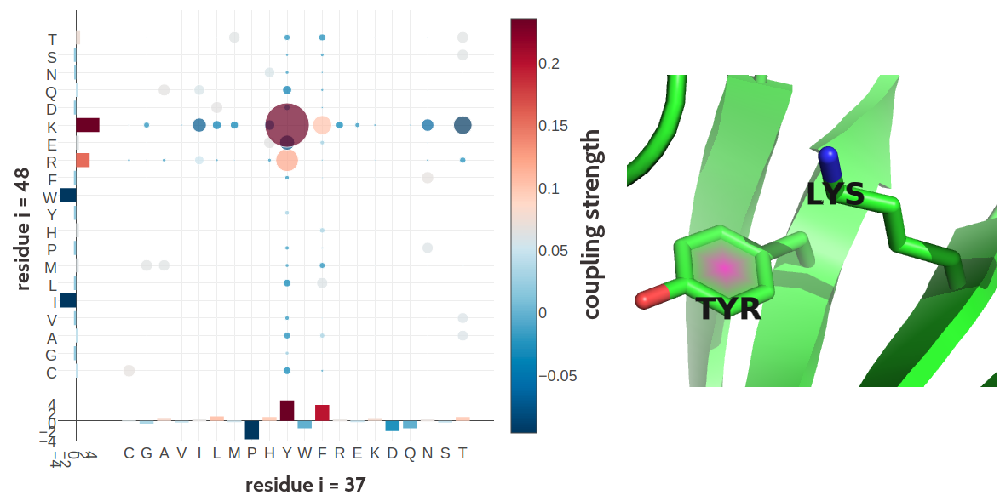
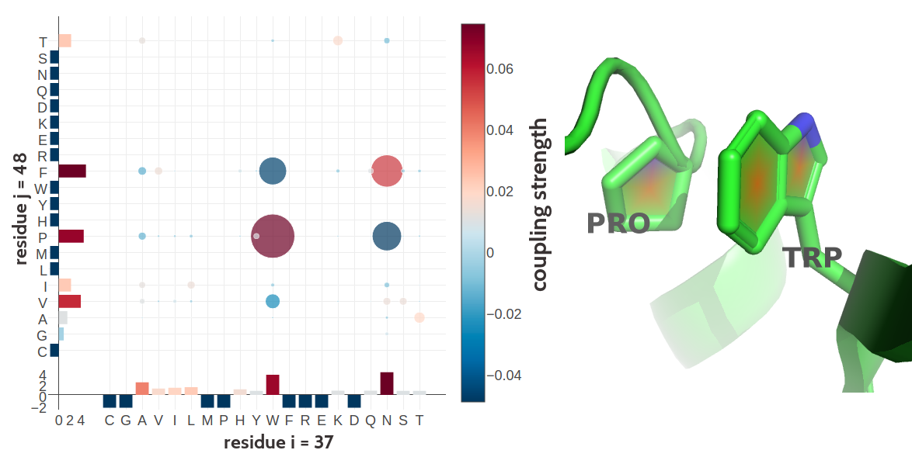
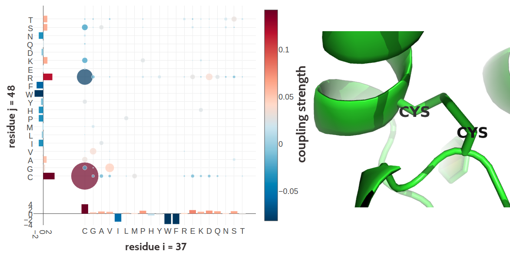

# Interpretation of Coupling Matrices {#interpreting-coupling-matrices}

Contact prediction methods learning a *Potts model* for the [MSA](#abbrev) of a protein familiy, map the inferred 20 x 20 dimensional coupling matrices $w_{ij}$ onto scalar values to obtain contact scores for each residue pair as outlined in section \@ref(post-processing-heuristics). 
As a result, the full information contained in coupling matrices is lost, such as the contribution of individual couplings $\wijab$, whether a coupling is positive or negative, higher order dependencies between couplings or possibly biological meaningful signals.
The following sections give some intuition for the information contained in coupling matrices.

## Single Coupling Values Carry Evidence of Contacts {#correlation-between-couplings-and-class}

Given the success of [DCA](#abbrev) methods, it is clear that the inferred couplings $\wij$ are good indicators of spatial proximity for residue pairs. 
As described in section \@ref(post-processing-heuristics), a contact score $C_{i,j}$ for a residue pair $(i,j)$ is commonly computed as the Frobenius norm over the coupling matrix, $C_{i,j}=||\wij||_2 = \sqrt{\sum_{a,b=1}^{20} {\wijab}^2}$.

The plots in Figure \@ref(fig:sq-coupling-correlation) show the correlation of squared coupling values ${\wijab}^2$ with binary contact class (contact=1, non-contact=0) and the standard deviation of squared coupling values ${\wijab}^2$ for contacts computed on a dataset of 100.000 residue pairs per class (for details see methods section \@ref(method-coupling-correlation)).
All couplings have a weak positive class correlation, meaning the stronger the squared coupling value, the more likely a contact can be inferred. 
Correlation is weak because most couplings $\wijab$ are close to zero since typically only few amino acid pairings per residue pair carry evidence and produce a signal.
Generally, couplings that involve an aliphatic amino acid such as isoleucine (I), leucine (L), valine (V) or an alanine (A) express the strongest class correlation. 
In contrast, cysteine pairs (C-C) or pairs involving only the charged residus arginine (R), glutamic acid (E), lysine (K) or aspartic acid (D) correlate only weakly with contact class.
Interestingly, for residue pairs being in physical contact, C-C and couplings involving charged residues have the highest standard-deviation among all couplings as can be seen in the right plot in Figure \@ref(fig:sq-coupling-correlation). 
Standard deviation of squared coupling values from non-contacts shows no relevant patterns and is on average one magnitude smaller than for the contact class (see Appendix Figure \@ref(fig:stdev-couplings-noncontacts)).

(ref:caption-sq-coupling) **Left** Pearson correlation of squared coupling values $(\wijab)^2$ with contact class (contact=1, non-contact=0). **Right** Standard deviation of squared coupling values for residue pairs in contact. Dataset contains 100.000 residue pairs per class (for details see methods section \@ref(method-coupling-correlation)). Amino acids are abbreviated with one-letter code and they are broadly grouped with respect to physico-chemical properties listed in Appendix \@ref(amino-acids).


```{r sq-coupling-correlation, echo = FALSE, screenshot.alt="img/coupling_matrix_analysis/combi_squared_couplings_correlation_and_stddev_heatmap_notitle.png", out.width='100%', fig.cap = '(ref:caption-sq-coupling)', fig.align='center'}
knitr::include_url("img/coupling_matrix_analysis/combi_squared_couplings_correlation_and_stddev_heatmap_notitle.html", height="550px")
```

Different couplings are of varying importance for contact inference and have distinct characteristics. 
When looking at the raw coupling values (without squaring), these charateristics become even more pronounced. 
The plots in Figure \@ref(fig:coupling-correlation) show the correlation of raw coupling values $\wijab$ with contact class and the standard deviation of coupling values for contacts.
Standard deviation of coupling values for non-contacts shows no relevant patterns and is on average half as big as for the contact class (see Appendix Figure \@ref(fig:stdev-couplings-noncontacts)).
Interestingly, in contrast to the findings for squared coupling values, couplings for charged residue pairs, involving arginine (R), glutamic acid (E), lysine (K) and aspartic acid (D), have the strongest class correlation (positive and negative), whereas aliphatic coupling pairs correlate to a much lesser extent.
This implies that squared coupling value is a better indicator of a contact than the raw signed coupling value for aliphatic couplings.
On the contrary, the raw signed coupling values for charged residue pairs are much more indicative of a contact than the magnitude of their squared values.
Raw couplings for cysteine (C-C) pairs, proline (P) and tryptophane (W) correlate only weakly with contact class. 
For these pairs neither a squared coupling value nor the raw coupling value seems to be a good indicator for a contact.

(ref:caption-coupling-correlation) **Left** Pearson correlation of raw signed coupling values $\wijab$ with contact class (contact=1, non-contact=0). **Right** Standard deviation of coupling values for residue pairs in physical contact. Dataset contains 100.000 residue pairs per class (for details see section \@ref(method-coupling-correlation)). Amino acids are abbreviated with one-letter code and they are broadly grouped with respect to physico-chemical properties listed in Appendix \@ref(amino-acids).

```{r coupling-correlation, echo = FALSE, screenshot.alt="img/coupling_matrix_analysis/combi_couplings_correlation_and_stddev_heatmap_notitle.png", out.width='100%', fig.cap = '(ref:caption-coupling-correlation)'}
knitr::include_url("img/coupling_matrix_analysis/combi_couplings_correlation_and_stddev_heatmap_notitle.html", height = "600px")
```


Looking only at correlations can be misleading if there are non-linear patterns in the data, for example higher order dependencies between couplings. 
For this reason it is advisable to take a more detailed view at coupling matrices and the distributions of their values.

## Coupling Profiles Vary with Distance {#coupling-profiles}

Analyses in the previous section showed that certain coupling values correlate more or less strong with contact class. 

More insights can be obtained by looking at the distribution of distinct coupling values for contacts, non-contacts and arbitrary populations of residue pairs. 
Figure \@ref(fig:1d-coupling-profile-0-5) shows the distribution of selected couplings for filtered residue pairs with $\Cb-\Cb$ distances $< 5\angstrom$ (see methods section \@ref(method-coupling-profile) for details). 
The distribution of R-E and E-E coupling values is shifted and skewed towards positive and negative values respectively. 
This is in accordance with attracting electrostatic interactions between the positively charged side chain of arginine and the negatively charged side chain of gluatamic acid and also with repulsive interactions between the two negatively charged glutamic acid side chains.

Coupling values for cysteine pairs (C-C) have a broad distribution that is skewed towards positive values, reflecting the strong signals obtained from covalent disulphide bonds.
The broad distribution for C-C, R-E and E-E agrees with the observation in section \@ref(correlation-between-couplings-and-class) that these specific coupling values have large standard deviations and that for charged residue pairings the signed coupling value is a strong indicator of a contact.

Hydrophobic pairs like V-I have an almost symmetric coupling distribution, confirming the finding that the direction of coupling is not indicative of a true contact whereas the strength of the coupling is.
The hydrophobic effect that determines hydrophobic interactions is not specific or directed. 
Therefore, hydrophobic interaction partners can commonly be substituted by other hydrophobic residues, which explains the not very pronounced positive coupling signal compared to more specific interactions, e.g ionic interactions. 
It is not clear though, why hydrophobic pairs have an equally strong negative coupling signal at this distance range because this speaks against the hypothesis that hydrophobic pairs are commonly interchangeable.
A vague explanation could be that a location in the tighly packed protein core calls for other very specific constraints, e.g. sterical fit or contact number, besides hydrophobic properties that are prohibitive for a particular hydrophobic residue at a certain position.

The distribution of aromatic coupling values like F-W is slightly skewed towards negative values, accounting for steric hindrance of their large sidechains at small distances. 
The yet very pronounced positive coupling signal for the bulky aromatic residues at this short distance range is not clear. 
The bulky planar aromatic rings of two aromatic residues often point away from each other when their $\Cb$-$\Cb$ distances are small to avoid steric hindrance (see left plot in Figure \@ref(fig:aromatic-residue-properties)).
A positive coupling signal might originate from other structural constraints from the local environment affecting both sidechains, similar to the scenario hypothetically explaining the negative coupling signal for hydrophobic residues.

(ref:caption-1d-coupling-profile-0-5) Distribution of selected couplings for filtered residue pairs with $\Cb-\Cb$ distances $< 5\angstrom$ (see methods section \@ref(method-coupling-profile) for details). Number of coupling values used to determine the distribution is given in brackets in the legend. $\text{R-E}$ = couplings for arginine and glutamic acid pairs, $\text{C-C}$ = coupling for cystein residue pairs, $\text{V-I}$ = coupling for valine and isoleucine pairs, $\text{F-W}$ = coupling for phenylalanine and tryptophane pairs, $\text{E-E}$ = coupling for glutamic acid residue pairs.

```{r 1d-coupling-profile-0-5, echo = FALSE, screenshot.alt="img/coupling_matrix_analysis/1d_coupling_profile_0_5.png", out.width='100%', fig.cap = '(ref:caption-1d-coupling-profile-0-5)', fig.align='center'}
knitr::include_url("img/coupling_matrix_analysis/1d_coupling_profile_0_5.html")
```


(ref:caption-aromatic-residue-properties) Peculiarities of aromatic residues. **Left** The planar ring system of aromatic sidechains at short $\Cb$-$\Cb$ distances (e.g. $\Delta \Cb < 5 \angstrom$) often points away from each other to avoid steric hindrance. **Right** Network-like structure of aromatic residues in the protein core. 80% of aromatic residues are involved in such networks that are important for protein stability [@Burley1985].

```{r aromatic-residue-properties, echo = FALSE, out.width = '50%', fig.show='hold', fig.cap = '(ref:caption-aromatic-residue-properties)'}
knitr::include_graphics(c("img/coupling_matrix_analysis/aromatic_residues_short_distance.png", "img/coupling_matrix_analysis/aromatic_bundle.png"))
```

In an intermediate $\Cb$ distance range between $8\angstrom$ and $12\angstrom$ the distributions for all coupling values are centered close to zero and are less broad. 
The distributions are still shifted and skewed, but less pronounced compared to the distributions at $\Cb-\Cb$ distances $< 5\angstrom$. 
For aromatic pairs like F-W, the distribution of coupling values has very long tails, suggesting rare but strong couplings for aromatic side chains at this distance.

(ref:caption-1d-coupling-profile-8-12) Distribution of selected couplings for filtered residue pairs with $\Cb-\Cb$ distances between $8\angstrom$ and $12 \angstrom$ (see methods section \@ref(method-coupling-profile) for details). Number of coupling values used to determine the distribution is given in brackets in the legend. Couplings are the same as in Figure \@ref(fig:1d-coupling-profile-0-5).

```{r 1d-coupling-profile-8-12, echo = FALSE, screenshot.alt="img/coupling_matrix_analysis/1d_coupling_profile_8_12.png", out.width='100%', fig.cap = '(ref:caption-1d-coupling-profile-8-12)'}
knitr::include_url("img/coupling_matrix_analysis/1d_coupling_profile_8_12.html")
```

Figure \@ref(fig:1d-coupling-profile-20-50) shows the distribution of selected couplings for residue pairs far apart in the protein structure ($\Cb-\Cb$ distances $> 20\angstrom$).  
The distribution for all couplings is centered at zero and has small variance. 
Only for C-C coupling values, the distribution has a long tail for positve values, presumably arising from the fact that the maximum entropy model cannot distuinguish highly conserved signals of multiple disulphide bonds within a protein. 
This observation also agrees with the previous finding in section \@ref(correlation-between-couplings-and-class) that C-C coupling values, albeit having large standard-deviations, correlate only weakly with contact class.
The same arguments apply to couplings of aromatic pairs that have a comparably broad distribution and do not correlate strongly with the contact class.
The strong coevolution signals for aromatic pairs even at high distance ranges might result from some kind of cooperative effects.
Aromatic residues are known to form network-like structures in the protein core that stabilize protein structure [@Burley1985].
An example is given in the right plot in Figure \@ref(fig:aromatic-residue-properties). 
A possible explanation might be that the *Potts model* is limited to learning single positions and pairwise correlations. 
An extension to higher order couplings might resolve these cooperative effects observed between residues in the protein core. 

(ref:caption-1d-coupling-profile-20-50) Distribution of selected couplings for filtered residue pairs with $\Cb-\Cb$ distances between $20\angstrom$ and $50\angstrom$ (see methods section \@ref(method-coupling-profile) for details). Number of coupling values used to determine the distribution is given in brackets in the legend. Couplings are the same as in Figure \@ref(fig:1d-coupling-profile-0-5).

```{r 1d-coupling-profile-20-50, echo = FALSE, screenshot.alt="img/coupling_matrix_analysis/1d_coupling_profile_20_50.png", out.width='100%', fig.cap = '(ref:caption-1d-coupling-profile-20-50)'}
knitr::include_url("img/coupling_matrix_analysis/1d_coupling_profile_20_50.html")
```


## Physico-Chemical Fingerprints in Coupling Matrices

The previous analysis showed that individual couplings have characterstic distributions that reflect the biophysical and steric interaction properties between amino acids.
Individual coupling matrices for a residue pair that is in physcial contact often display striking patterns that agree with these findings. 
These patterns allow a biological interpretation of the coupling values that reveal details of the physico-chemical interdependency between both residues.

Figure \@ref(fig:coupling-matrix-ionic-interaction) visualizes the inferred coupling matrix and single potentials $\vi$ and $\vj$ for a residue pair $(i,j)$ computed with the pseudo-likelihood method.
The single potentials $\via$ and $\vja$ describe the tendency for each amino acid $a$ to appear at positions $i$ and $j$, and the couplings $\wijab$ describe the tendency of amino acid $a$ at position $i$ to co-occur with amino acid $b$ at position $j$.
A cluster of strong coupling values can be observed for the couplings between the charged residues glutamic acid (E), aspartic acid (D), lysine (K) and arginine (R) and the polar residue glutamine (Q). 
Positive coupling values arise between positively charged residues (K, R) and negatively charged residues (E, D), whereas couplings between equally charged residues have negative values. 
These exemplary couplings (E-R, E-K, K-D) perfectly reflect the interaction preference for residues forming salt bridges. 
Indeed, in the protein structure the first residue (E) forms a salt bridge with the second residue (R) as can be seen in the left plot in Figure \@ref(fig:coupling-matrix-pymol).

(ref:caption-coupling-matrix-ionic-interaction) Couplings $\wijab$ and single potentials $\via$ and $\vja$ computed with pseudo-likelihood for residues 6 and 82 in the carbamoyl phosphate synthetase protein (PDB id 1a9x_A domain 5). The matrix shows the 20x20 couplings $\wijab$ with color representing coupling strength and direction (red = positive coupling value, blue = negative coupling value) and diameter of bubbles representing absolute coupling value $|\wijab|$. Bars at the x-axis and y-axis correspond to the *Potts* model single potentials $\vi$ and $\vj$ respectively. Color reflects the value of single potentials. Amino acids are abbreviated with one-letter code and they are broadly grouped with respect to physico-chemical properties listed in Appendix \@ref(amino-acids).

```{r coupling-matrix-ionic-interaction, echo = FALSE, screenshot.alt="img/coupling_matrix_analysis/coupling_matrix_1a9xA05_6_82_notitle.png", out.width='100%', fig.cap = '(ref:caption-coupling-matrix-ionic-interaction)'}
knitr::include_url("img/coupling_matrix_analysis/coupling_matrix_1a9xA05_6_82_notitle.html", height = "600px")
```

Figure \@ref(fig:coupling-matrix-hydrophobic-interaction) visualizes the coupling matrix for a pair of hydrophobic residues.
Hydrophobic pairings, such as alanine (A) - isoleucine (I), or glycine (G) - isoleucine (I) have strong coupling values but the couplings also reflect a sterical constraint.
Alanine is a small hydrophobic residue and it is favoured at both residue positions: it has strong positive single potentials $\vi(A)$ and $\vj(A)$ and strong positive couplings with isoleucine (I), leucine (L) and methionine (M).
But alanine is disfavoured to appear at both positions at the same time since the A-A coupling is negative.
Figure \@ref(fig:coupling-matrix-pymol) illustrates the location of the two residues in the protein core. Here, hydrophobic residues are densely packed and the limited space allows for only small hydrophobic residues.

(ref:caption-coupling-matrix-hydrophobic-interaction) Couplings $\wijab$ and single potentials $\via$ and $\vja$ computed with pseudo-likelihood for residues 29 and 39 in the lambda integrase protein (PDB id 1ae9_A). The matrix shows the 20x20 couplings $\wijab$. Bars at the x-axis and y-axis correspond to the *Potts* model single potentials $\vi$ and $\vj$ respectively. Color coding is the same as in Figure \@ref(fig:coupling-matrix-ionic-interaction)

```{r coupling-matrix-hydrophobic-interaction, echo = FALSE, screenshot.alt="img/coupling_matrix_analysis/coupling_matrix_1ae9A00_29_39_notitle.png", out.width='100%', fig.cap = '(ref:caption-coupling-matrix-hydrophobic-interaction)'}
knitr::include_url("img/coupling_matrix_analysis/coupling_matrix_1ae9A00_29_39_notitle.html", height = "600px")
```

<!---
<iframe width="750" height="750" frameborder="0" scrolling="no" src="img/coupling_matrix_analysis/coupling_matrix_1awqA00_92_129_notitle.html">
-->

(ref:caption-coupling-matrix-pymol) Interactions between protein side chains. **Left**: Glutamic acid (residue 6) forms a salt bridge with arginine (residue 82) in the carbamoyl phosphate synthetase protein (PDB id 1a9x_A domain 5). **Right**: Alanine (residue 29) and lysine (residue 39) within the hydrophobic core of the lambda integrase protein (PDB id 1ae9_A).   

```{r coupling-matrix-pymol, echo = FALSE, out.width = '50%', fig.show = 'hold', fig.cap = '(ref:caption-coupling-matrix-pymol)'}
knitr::include_graphics(c("img/coupling_matrix_analysis/1a9xA05_6_82.png", "img/coupling_matrix_analysis/1ae9A00_29_39.png"))
```


Many more biological interpretable signals can be identified from coupling matrices, including pi-cation interactions (see Figure \@ref(fig:coupling-matrix-pication-pymol)), aromatic-proline interactions (see Figure \@ref(fig:coupling-matrix-aromatic-proline-pymol)), or disulphide bonds (see Figure \@ref(fig:coupling-matrix-disulfide-pymol)). 

(ref:caption-coupling-matrix-pication-pymol) Tyrosine (residue 37) and Lysine (residue 48) forming a cation-$\pi$ interaction in the C-terminal WRKY domain of Arabidopsis thaliana (PDB id 2ayd_A). **Left** Coupling matrix $\wij$ for residue $i\eq37$ and residue $j\eq48$. The matrix shows the 20x20 couplings $\wijab$. Bars at the x-axis and y-axis correspond to the *Potts* model single potentials $\vi$ and $\vj$ respectively. Color coding is the same as in Figure \@ref(fig:coupling-matrix-ionic-interaction) **Right** Cation-$\pi$ interaction between Tyrosine (residue 37) and Lysine (residue 48).

```{r coupling-matrix-pication-pymol, echo = FALSE, out.width = '100%', fig.cap = '(ref:caption-coupling-matrix-pication-pymol)'}

```

(ref:caption-coupling-matrix-aromatic-proline-pymol) Proline and tryptophan (residues 17 and 34) forming such a CH/$\pi$ interaction in the murine leukemia virus receptor-binding glycoprotein (PDB id 1aol_A). **Left** Coupling matrix $\wij$ for residue $i\eq17$ and residue $j\eq34$. The matrix shows the 20x20 couplings $\wijab$. Bars at the x-axis and y-axis correspond to the *Potts* model single potentials $\vi$ and $\vj$ respectively. Color coding is the same as in Figure \@ref(fig:coupling-matrix-ionic-interaction) **Right** Proline (residues 17) and tryptophan (residues 34) stacked on top of each other engaging in a CH/$\pi$ interaction.

```{r coupling-matrix-aromatic-proline-pymol, echo = FALSE, out.width = '100%', fig.cap = '(ref:caption-coupling-matrix-aromatic-proline-pymol)'}

```

(ref:caption-coupling-matrix-disulfide-pymol) Two cystein residues (residues 54 and 64) forming a covalent disulfide bond in human interleukin-6 (PDB id 1alu_A). **Left** Coupling matrix $\wij$ for residue $i\eq54$ and residue $j\eq64$. The matrix shows the 20x20 couplings $\wijab$. Bars at the x-axis and y-axis correspond to the *Potts* model single potentials $\vi$ and $\vj$ respectively. Color coding is the same as in Figure \@ref(fig:coupling-matrix-ionic-interaction)  **Right** Difulfide bond between the cystein residues 54 and 64 in the structure.

```{r coupling-matrix-disulfide-pymol, echo = FALSE, out.width = '100%', fig.cap = '(ref:caption-coupling-matrix-disulfide-pymol)'}

```

## Higher Order Dependencies Between Couplings {#higher-order-coupling-profiles}

The analyses in the last section showed that the contact matrices for residue pairs in physical contact often contain informative patterns regarding the underlying structural constraint. 
Therefore it can be expected that there are biological meaningful inderdependencies between individual coupling values and further insights might be concealed in higher order relationships.
Unfortunately, it is not possible to reasonably visualize high dimensional coupling matrices. 

Exploring two dimensional coupling scatter plots strengthens the observation that couplings matrices contain signals that reflect biological relevant amino acid interactions.
The plots in the top row in Figure \@ref(fig:2d-coupling-profiles-0-8) show the distribution of couplings for filtered residue pairs with $\Cb-\Cb$ distances $< 8\angstrom$ between the ionic pairings of E-R and R-E and between the ionic pairing R-E and the equally charged residues E-E, respectively.
Coupling values for R-E and E-R are positively correlated with predominantly positive values. 
This means when the amino acid pair R-E is frequently observed at two positions $i$ and $j$, then it also likely that the amino acid pair E-R can be frequently observed. 
This situation indicates an important ionic interaction whereby the location of the positively and negatively charged residue at position $i$ or $j$ is irrelevant.

On the contrary, coupling values for R-E and E-E are negatively correlated, with positive values for R-E and negative values for E-E.
This distribution can be interpreted with frequently occuring amino acid pairs R-E at two positions $i$ and $j$ while at the same time the amino acid pair E-E cannot be observed.
Again, this situation coincides with amino acid pairings that would be expected for an ionic interaction. 

The bottom left plot in Figure \@ref(fig:2d-coupling-profiles-0-8) shows the distribution between couplings for the hydrophobic pairings I-L and V-I that is almost symmetric and broadly centered around zero.
Coupling distributions for residue pairs that are not physically interacting ($\Cb  \gg 8 \angstrom$) resemble the distribution for hydrophobic pairings in that there is no correlation, but at high distance the  distributions are much tighter centered around zero (bottom right plot in Figure \@ref(fig:2d-coupling-profiles-0-8)).

(ref:caption-2d-coupling-profiles-0-8) Two-dimensional distribution of approximately 10000 coupling values computed with pseudo-likelihood. **Top Left** The 2-dimensional distribution of couplings E-R and R-E for residue pairs with $\Cb-\Cb$ distances $< 8 \angstrom$ is almost symmetric and the coupling values are positively correlated. **Top Right** The 2-dimensional distribution of couplings E-R and E-E for residue pairs with $\Cb-\Cb$ distances $< 8 \angstrom$ is almost symmetric and the coupling values are negatively correlated. **Bottom Left** The 2-dimensional distribution of couplings I-L and V-I for residue pairs with $\Cb-\Cb$ distances $< 8 \angstrom$ is symmetrically distributed around zero without visible correlation.  **Bottom Right** The 2-dimensional distribution of couplings I-L and V-I for residue pairs with $\Cb-\Cb$ distances $> 20 \angstrom$ is tighly distributed around zero.


```{r 2d-coupling-profiles-0-8, echo = FALSE, out.width='50%', fig.show='hold', fig.cap = '(ref:caption-2d-coupling-profiles-0-8)'}
knitr::include_graphics(c("img/coupling_matrix_analysis/pairwise_couplings_R-E_E-R_Cbdistance_0_8_notitle.png", "img/coupling_matrix_analysis/pairwise_couplings_R-E_E-E_Cbdistance_0_8_notitle.png", "img/coupling_matrix_analysis/pairwise_couplings_V-I_I-L_Cbdistance_0_8_notitle.png", "img/coupling_matrix_analysis/pairwise_couplings_V-I_I-L_Cbdistance_20_50_notitle.png"))
```


## Discussion

The analysis in this chapter proved that the 20x20 dimensional coupling matrices $\wij$ contain a wealth of information that is irretrievably lost when computing the heuristic contact score in form of the Frobenius norm of the coupling matrix. 
For several amino acid pairs (e.g. E-R, E-E) the direction of the corresponding coupling value is a strong indicator for a contact.
More quantitatively, the distribution of individual couplings reflect physico-chemical interaction preferences between amino acids.
Furthermore, characteristic patterns in the coupling matrices often point at the undelrying structural constraint that is subject to evolutionary pressure.
The patterns also illustrate that there are higher order dependencies between the individual coupling values that also are in accordance with physico-chemical interaction preferences between amino acids.

Coucke and collegues performed a thorough quantitative analysis of coupling matrices selected from confidently predicted residue pairs [@Coucke2016].
They showed that eigenmodes obtained from a spectral analysis of averaged coupling matrices are closely related to physico-chemical properties of amino acid interactions, like electrostaticity, hydrophobicity, steric interactions or disulphide bonds. 
By looking at specific populations of residues, like buried and exposed residues or residues from specific protein classes (small, mainly $\alpha$, etc), the eigenmodes of corresponding coupling matrices are found to capture very characteristic interactions for each class, e.g. rare disulfide contacts within small proteins and hydrophilic contacts between exposed residues. 
Their study confirms the qualitative observations presented above that amino acid interactions can leave characteristic physico-chemical fingerprints in coupling matrices. 


\newpage 
## Methods

### Dataset {#dataset}

A protein dataset has been constructed from the CATH (v4.1) [@Sillitoe2015] database for classification of protein domains.
All CATH domains from classes 1(mainly $\alpha$), 2(mainly $\beta$), 3($\alpha+\beta$) have been selected and filtered for internal redundancy at the sequence level using the `pdbfilter` script from the HH-suite[@Remmert2012] with an E-value cutoff=0.1. 
The dataset has been split into ten subsets aiming at the best possible balance between CATH classes 1,2,3 in the subsets. 
All domains from a given CATH topology (=fold) go into the same subsets, so that any two subsets are non-redundant at the fold level. 
Some overrepresented folds (e.g. Rossman Fold) have been subsampled ensuring that in every subset each class contains at max 50% domains of the same fold. 
Consequently, a fold is not allowed to dominate a subset or even a class in a subset.
In total there are 6741 domains in the dataset.

Multiple sequence alignments were built from the CATH domain sequences ([COMBS](http://www.cathdb.info/version/current/domain/3cdjA03/sequence)) using HHblits [@Remmert2012] with parameters to maximize the detection of homologous sequences:

`
hhblits -maxfilt 100000 -realign_max 100000 -B 100000 -Z 100000 -n 5 -e 0.1 -all
hhfilter -id 90 -neff 15 -qsc -30
`

The COMBS sequences are derived from the SEQRES records of the PDB file and sometimes contain extra residues that are not resolved in the structure. 
Therefore, residues in PDB files have been renumbered to match the COMBS sequences. The process of renumbering residues in PDB files yielded ambigious solutions for 293 proteins, that were removed from the dataset. 
Another filtering step was applied to remove 80 proteins that do not hold the following properties:

*  more than 10 sequences in the multiple sequence alignment ($N>10$)
*  protein length between 30 and 600 residues ($30 \leq L \leq 600$)
*  less than 80% gaps in the multiple sequence alignment (percent gaps < 0.8)
*  at least one residue-pair in contact at $C_\beta < 8\angstrom$ and minimum sequence separation of 6 positions

The final dataset is comprised of **6368** proteins with almost evenly distributed CATH classes over the ten subsets  (Figure \@ref(fig:dataset-cath-topologies)).

(ref:caption-dataset-cath-topologies) Distribution of CATH classes (1=mainly $\alpha$, 2=mainly $\beta$, 3=$\alpha-\beta$) in the dataset and the ten subsets.

```{r dataset-cath-topologies, echo = FALSE, screenshot.alt="img/dataset_statistics/cath_topologies_stacked_reative_notitle.png",  out.width = '100%', fig.cap = '(ref:caption-dataset-cath-topologies) '}
knitr::include_url("img/dataset_statistics/cath_topologies_stacked_reative_notitle.html")
```


### Computing Pseudo-Likelihood Couplings {#diff-ccmpred-ccmpredpy}

Dr Stefan Seemayer has reimplementated the open-source software CCMpred [@Seemayer2014] in Python. 
CCMpred optimizes the regularized negative pseudo-log-likelihood using a conjugate gradients optimizer. 
Based on a fork of his private github repository I continued development and extended the software, which is now called CCMpredPy. 
It is available upon request at https://bitbucket.org/svorberg/ccmpred-new.
All computations in this thesis are performed with CCMpredPy unless stated otherwise.


CCMpredPy differs from CCMpred [@Seemayer2014] which is available at https://github.com/soedinglab/CCMpred in several details:

Initialization of potentials $\v$ and $\w$: 
- CCMpred initializes single potentials $\v_i(a) = \log f_i(a) - \log f_i(a= "-")$ with $f_i(a)$ being the frequency of amino acid a at position i and $a="-"$ representing a gap. A single pseudo-count has been added before computing the frequencies. Pair potentials $\w$ are intialized at 0.
- CCMpredPy initializes single potentials $\v$ with the [ML](#abbrev) estimate of single potentials (see section \@ref(prior-v)) using amino acid frequencies computed as described in section \@ref(amino-acid-frequencies). Pair potentials $\w$ are initialized at 0.
  
Regularization:

- CCMpred uses a Gaussian regularization prior centered at zero for both single and pair potentials. The regularization coefficient for single potentials $\lambda_v = 0.01$ and for pair potentials $\lambda_w = 0.2 * (L-1)$ with $L$ being protein length.
- CCMpredPy uses a Gaussian regularization prior centered at zero for the pair potentials. For the single potentials the Gaussian regularization prior is centered at the [ML](#abbrev) estimate of single potentials (see section \@ref(prior-v)) using amino acid frequencies computed as described in section \@ref(amino-acid-frequencies). The regularization coefficient for single potentials $\lambda_v = 10$ and for pair potentials $\lambda_w = 0.2 * (L-1)$ with $L$ being protein length.

Default settings for CCMpredPy have been chosen to best reproduce CCMpred results.
A benchmark over a subset of approximately 3000 proteins confirms that performance measured as [PPV](#abbrev) for both methods is almost identical (see Figure \@ref(fig:cmmpredvanilla-vs-ccmpredpy)). 

(ref:caption-cmmpredvanilla-vs-ccmpredpy) Mean precision over 3124 proteins of top ranked contacts computed as [APC](#abbrev) corrected Frobenius norm of couplings from pseudo-likelihood maximization. Couplings have been computed with CCMpred [@Seemayer2014] and CCMpredPy as specified in the legend. Specific flags that have been used to run both methods are described in detail in the text (see section \@ref(diff-ccmpred-ccmpredpy)).

```{r cmmpredvanilla-vs-ccmpredpy, echo = FALSE, screenshot.alt="img/methods/ccmpredvanilla_vs_ccmpredpy_precision_vs_rank.png",  out.width = '90%', fig.cap = '(ref:caption-cmmpredvanilla-vs-ccmpredpy)'}
knitr::include_url("img/methods/ccmpredvanilla_vs_ccmpredpy_precision_vs_rank.html", height="500px")
```

Pseudo-likelihood couplings used in this thesis have been computed with CCMPredPy using the following flags:
```
--maxit 250                  # Compute a maximum of MAXIT operations
--center-v                   # Use a Gaussian prior for single potentials 
                             # centered at ML estimate v*          
--reg-l2-lambda-single 10    # regularization coefficient for 
                             # single potentials
--reg-l2-lambda-pair-factor 0.2   # regularization coefficient for 
                                  # pairwise potentials computed as 
                                  # reg-l2-lambda-pair-factor * (L-1)
--pc-uniform        # use uniform pseudocounts 
                    # (1/21 for 20 amino acids + 1 gap state) 
--pc-count 1        # defining pseudo count admixture coefficient 
                    # rho = pc-count/( pc-count+ Neff)
--epsilon 1e-5      # convergence criterion for minimum decrease 
                    # in the last K iterations
--ofn-pll           # using pseudo-likelihood as objective function
--alg-cg            # using conjugate gradient to optimize 
                    # objective function
```

For the comparison of CCMpred and CCMPredPy in Figure \@ref(fig:cmmpredvanilla-vs-ccmpredpy), CCMpred was run with the following flags:
```
-n 250    # NUMITER:  Compute a maximum of NUMITER operations
-l 0.2    # LFACTOR:  Set pairwise regularization coefficients 
          # to LFACTOR * (L-1) 
-w 0.8    # IDTHRES:  Set sequence reweighting identity 
          # threshold to IDTHRES
-e 1e-5   # EPSILON:  Set convergence criterion for minimum 
          # decrease in the last K iterations to EPSILON
```


### Sequence Reweighting {#seq-reweighting}

As discussed in section \@ref(phylogenetic-noise), sequences in a [MSA](#abbrev) do not represent independent draws from a probabilistic model. 
To reduce the effects of redundant sequences, a popular sequence reweighting strategy has been found to improve contact prediction performance.
Every sequence $x_n$ of length $L$ in an alignment with $N$ sequences has an associated weight $w_n = 1/m_n$, where $m_n$ represents the number of similar sequences:

\begin{equation} 
  w_n = \frac{1}{m_n}, m_n = \sum_{m=1}^N I \left( ID(x_n, x_m) \geq 0.8 \right) \\
  ID(x_n, x_m)=\frac{1}{L} \sum_{i=1}^L I(x_n^i = x_m^i)
  (\#eq:seqweight)
\end{equation} 

An identity threshold of 0.8 has been used for all analyses in this thesis.  
The number of effective sequences $\mathbf{\neff}$ of an alignment is then the number of sequence clusters computed as:

\begin{equation} 
  \neff = \sum_{n=1}^N w_n
  (\#eq:neff)
\end{equation}


### Computing Amino Acid Frequencies {#amino-acid-frequencies}

Single and pairwise amino acid frequencies are computed from amino acid counts of weighted sequences as described in the last section \@ref(seq-reweighting) and additional pseudocounts that are added to improve numerical stability. 

Let $a,b \in \{1,\ldots,20\}$ be amino acids and $q_0(x_i=a), q_0(x_i=a,x_j=b)$ be the empirical single and pair frequencies without pseudocounts. 
The empirical single and pair frequencies with pseudocounts, $q(x_i=a), q(x_i=a, x_j=b)$, are defined

\begin{align}
    q(x_i \eq a) :=& (1-\tau) \;  q_0(x_i \eq a) + \tau \tilde{q}(x_i\eq a) \\
    q(x_i \eq a, x_j \eq b) :=& (1-\tau)^2  \; [ q_0(x_i \eq a, x_j \eq b) - q_0(x_i \eq a)  q_0(x_j \eq b) ] + \nonumber\\
                            & q(x_i \eq a) \; q(x_j \eq b) 
(\#eq:pseudocounts)
\end{align}

with $\tilde{q}(x_i \eq a) := f(a)$ being background amino acid frequencies and $\tau \in [0,1]$ is a pseudocount admixture coefficient, which is a function of the diversity of the multiple sequence alignment:

\begin{equation}
    \tau = \frac{N_\mathrm{pc}}{(N_\mathrm{eff} + N_\mathrm{pc})}
(\#eq:tau)
\end{equation} 

where $N_{pc} > 0$.

The formula for $q(x_i \eq a, x_j \eq b)$ in the second line in eq \@ref(eq:pseudocounts) was chosen such that for $\tau \eq0$ we obtain $q(x_i \eq a, x_j \eq b) = q_0(x_i \eq a, x_j  \eq b)$, and furthermore
 $q(x_i \eq a, x_j  \eq b) = q(x_i \eq a)  q(x_j \eq b)$ exactly if $q_0(x_i \eq a, x_j  \eq b) = q_0(x_i \eq a)  q_0(x_j \eq b)$.


### Regularization {#methods-regularization}

*CCMpredPy* uses an L2-regularization per default that pushes the single and pairwise terms smoothly towards zero and is equivalent to the logarithm of a zero-centered Gaussian prior,

\begin{align}
  R(\v, \w)  &= \log \left[ \mathcal{N}(\v | \v^*, \lambda_v^{-1} I) \mathcal{N}(\w | \w^*, \lambda_w^{-1} I) \right] \nonumber \\
             &= -\frac{\lambda_v}{2} ||\v-\v^*||_2^2 - \frac{\lambda_w}{2} ||\w-w^*||_2^2 + \text{const.} \; ,
(\#eq:l2-reg)
\end{align}

where the regularization coefficients $\lambda_v$ and $\lambda_w$ determine the strength of regularization.

The regularization coefficient $\lambda_w$ for couplings $\w$ is defined with respect to protein length $L$ owing to the fact that the number of possible contacts in a protein increases quadratically with $L$ whereas the number of observed contacts only increases linearly as can be seen in Figure \@ref(fig:number-contacts-against-L).

(ref:caption-number-contacts-against-L) Number of contacts ($\Cb < 8 \angstrom$) with respect to protein length and sequence separation has a linear relationship.

```{r number-contacts-against-L, echo = FALSE, screenshot.alt="img/full_likelihood/no_contacts_vs_protein_length_thr8.png", out.width = '90%', fig.align='center', fig.cap = '(ref:caption-number-contacts-against-L)'}
knitr::include_url("img/full_likelihood/no_contacts_vs_protein_length_thr8.html", height = "500px")
```

Most previous pseudo-likelihood approaches using L2-regularization for pseudo-likelihood optimization set $\v^* \eq \w^* \eq \mathbf{0}$ [@Seemayer2014; @Ekeberg2014; @Kamisetty2013].
A different choice for $v^*$ is discussed in section \@ref(prior-v) that is is used per default with *CCMpredPy*.
The single potentials will not be optimized with [CD](#abbrev) but will be fixed at $v^*$ given in eq. \@ref(eq:prior-v).
Furthermore, *CCMpredPy* uses regularization coefficients $\lambda_v \eq 10$ and $\lambda_w \eq 0.2\cdot(L-1)$ for pseudo-likelihood optimization and the choice for $\lambda_w$ used with [CD](#abbrev) is discussed in section \@ref(regularization-for-cd-with-sgd).


### Correlation of Couplings with Contact Class {#method-coupling-correlation}

Approximately 100000 residue pairs have been filtered for contacts and non-contacts respectively according to the following criteria:

- sequence separation of residue pairs $\ge 10$
- diversity ($=\frac{\sqrt{N}}{L}$) of alignment $\ge 0.3$
- number of non-gapped sequences $\ge 1000$
- $\Cb$ distance threshold for contact: $<8\angstrom$
- $\Cb$ distance threshold for noncontact: $>25\angstrom$

### Coupling Distribution Plots {#method-coupling-profile}

For one-dimensional coupling distribution plots the residue pairs and respective pseudo-log-likelihood coupling values $\wijab$ have been selected as follows:

- sequence separation of residue pairs $\ge 10$
- percentage of gaps per column $\le 30\%$
- evidence for a coupling $\wijab$ estimated from the alignment, $N_{ij} \cdot q_i(a)  \cdot q_j(b) \ge 100$ with:
    - $N_{ij}$: number of sequences with no gaps at positions $i$ or $j$
    - $q_i(a)$, $q_j(b)$: frequencies of amino acids $a$ and $b$ at positions $i$ and $j$, respectively (computed as described in section \@ref(amino-acid-frequencies)) 
    
These criteria ensure that uninformative couplings are neglected, e.g. sequence neighbors albeit being contacts according to the $\Cb$ contact definition cannot be assumed to express biological meaningful coupling patterns, or couplings for amino acid pairings that do not have enough statistical power due to insufficient counts in the alignment.

The same criteria have been applied for selecting couplings for the two-dimensional distribution plots with the difference that evidence for a single coupling term has to be $N_{ij} \cdot q_i(a) \cdot q_j(b) > 80.$


