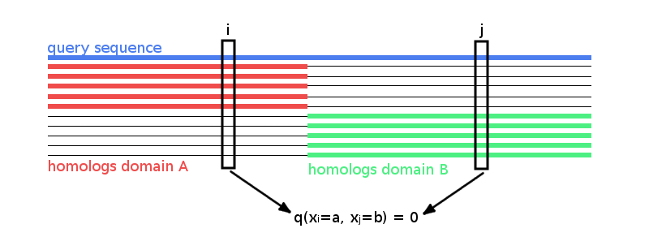

# Optimizing the Full-Likelihood {#optimizing-full-likelihood}

Section \@ref(maxent) introduced the *Potts model* for contact prediction that is able to distinguish between directly and indirectly coupled residue pairs by jointly modelling the probabilty of a protein sequence over all residues.
Maximum-likelihood inference of the model parameters is numerically challenging due to the exponential complexity of the partition function that normalizes the probability distribution. 
Several approximate inference techniques for the full likelihood have been developed trying to sidestep the exact computation of the partition function.
At this point in time, pseudo-likelihood is the most successful approximate solution with regard to the specific problem of predicting residue-residue contacts.
It has been shown that the pseudo-likelihood is a consistent estimator to the full likelihood in the limit of large amounts of data, however, it is unclear whether it represents a good approximation when there is only little data, in other words for small protein families that are typical of contact prediction.

Computing the gradient of the likelihood analytically is infeasible, because computing $p(x_i \eq a, x_j \eq b | \v, \w) = \sum_{y_1, \dots, y_L =1}^{20} p(y_1,  \dots, y_L | \v, \w) I(y_i \eq a, y_j \eq b)$ would require summing over $20^L$ sequences $(y_1,\ldots,y_L)$. 
Several approaches have been used to get around this problem as described in section \@ref(infering-max-ent-models). 
The most popular one for protein contact prediction is to optimize the pseudo likelihood instead (see section \@ref(pseudo-likelihood)). 
Its gradient involves a sum over just the 20 amino acids instead of over all possible sequences of length $L$. 


While the function value of the full likelihood cannot efficiently be computed, it is possible to approximate the gradient of the full likelihood with an approach called *contrastive divergence* that makes use of [MCMC](#abbrev) sampling techniques [@Hinton2002]. 

In the next sections I am going to specify the exact model that differs from the *Potts model* as it is used for pseudo-likelihood inference as explained in section \@ref(pseudo-likelihood}) in some small details.
Then I will discuss how the gradient of the likelihood can be approximated with *contrastive divergence* and present the results for this optimization stratedgy.

## The Likelihood of the Sequences as a Potts Model


The $N$ sequences of the [MSA](#abbrev) $\X$ are denoted as ${\seq_1, ..., \seq_N}$. 
Each sequence $\seq_n = (\seq_{n1}, ..., \seq_{nL})$ is a string of $L$ letters from an alphabet indexed by $\{0, ..., 20\}$, where 0 stands for a gap and $\{1, ... , 20\}$ stand for the 20 types of amino acids. 

As already described in detail in section \@ref(maxent), the likelihood of the sequences in the [MSA](#abbrev) of the protein family is modelled with a *Potts Model*: 

\begin{align}
    p(\X | \v, \w) &= \prod_{n=1}^N p(\seq_n | \v, \w) \nonumber \\
                   &= \prod_{n=1}^N \frac{1}{Z(\v, \w)} \exp \left( \sum_{i=1}^L v_i(x_{ni}) \sum_{1 \leq i < j \leq L} w_{ij}(x_{ni}, x_{nj}) \right)
\end{align}

The coefficients $\via$ and $\wijab$ are referred to as single potentials and couplings, respectively that describe the tendency of an amino acid a (and b) to (co-)occur at the respective positions in the [MSA](#abbrev).
$Z(\v, \w)$ is the partition function that normalizes the probability distribution $p(\seq_n |\v, \w)$:

\begin{equation}
  Z(\v, \w) = \sum_{y_1, ..., y_L = 1}^{20} \exp \left( \sum_{i=1}^L v_i(y_i) \sum_{1 \leq i < j \leq L} w_{ij}(y_i, y_j)  \right)
\end{equation}


## Treating Gaps as Missing Information {#gap-treatment}

Treating gaps explicitly as 0’th letter of the alphabet will lead to couplings between columns that are not in physical contact. 
To see why, imagine a hypothetical alignment consisting of two sets of sequences as it is illustrated in Figure \@ref(fig:gap-treatment). 
The first set has sequences covering only the left half of columns in the MSA, while the second set has sequences covering only the right half of columns. 
The two blocks could correspond to protein domains that were aligned to a single query sequence. 

Now consider couplings between a pair of columns $i, j$ with $i$ from the left half and $j$ from the right half. 
Since no sequence (except the single query sequence) overlaps both domains, the empirical amino acid pair frequencies $q(x_i = a, x_j = b)$ will vanish for all $a, b \in \{1,... , L\}$. 

(ref:caption-gap-treatment) Hypothetical [MSA](#abbrev) consisting of two sets of sequences: the first set has sequences covering only the left half of columns, while the second set has sequences covering only the right half of columns. The two blocks could correspond to protein domains that were aligned to a single query sequence. Empirical amino acid pair frequencies $q(x_i \eq a, x_j \eq b)$ will vanish for positions $i$ from the left half and $j$ from the right half of the alignment.

```{r gap-treatment, echo = FALSE, fig.cap = '(ref:caption-gap-treatment)'}

```


The gradient of the log likelihood for couplings is 

\begin{align}
\frac{\partial LL}{\partial \wijab} &= \sum_{n=1}^N I(x_{ni}=a, x_{nj}=b)  - N \frac{\partial}{\partial \wijab} \log Z(\v,\w) \\
                                        &= \sum_{n=1}^N I(x_{ni} \eq a, x_{nj} \eq b) \\
                                        & - N \sum_{y_1,\ldots,y_L=1}^{20} \!\! \frac{ \exp \left( \sum_{i=1}^L v_i(y_i) + \sum_{1 \le i < j \le L} w_{ij}(y_i,y_j) \right)}{Z(\v,\w)}  I(y_i \eq a, y_j \eq b) \\
                                        &=  N q(x_{i} \eq a, x_{j} \eq b) - N \sum_{y_1,\ldots,y_L=1}^{20} p(y_1, \ldots, y_L | \v,\w) \, I(y_i \eq a, y_j \eq b) \\
                                        &=  N q(x_{i} \eq a, x_{j} \eq b) - N p(x_i \eq a, x_j \eq b | \v,\w) 
(\#eq:gradient-LLreg-gaps-single)
\end{align}

Note that the empirical frequencies $q(x_{i} \eq a, x_{j} \eq b)$ are equal to the model probabilities $p(x_i \eq a, x_j \eq b | \v,\w)$ at the maximum of the likelihood when the gradient vanishes.
Therefore, $p(x_i \eq a, x_j \eq b | \v, \w)$ would have to be zero in the optimum when the empirical amino acid frequencies $q(x_i \eq a, x_j \eq b)$ vanish for pairs of columns as described above.
However, $p(x_i \eq a, x_j \eq b | \v, \w)$ can only become zero, when the exponential term is zero, which would only be possible if $\wijab$ goes to $−\infty$. 
This is clearly undesirable, as physical contacts will be deduced from the size of the couplings.

The solution is to treat gaps as missing information. 
This means that the normalisation of $p(\seq_n | \v, \w)$ should not run over all positions $i \in \{1,... , L\}$ but only over those $i$ that are not gaps in $\seq_n$.
Therefore, the set of sequences $\Sn$ used for normalization of $p(\seq_n | \v, \w)$ in the partition function will be defined as:

\begin{equation}
\Sn := \{(y_1,... , y_L): 0 \leq y_i \leq 20 \land (y_i \eq 0 \textrm{ iff } x_{ni} \eq 0) \}
\end{equation}

and the partition function becomes:

\begin{equation}
  Z_n(\v, \w) = \sum_{\mathbf{y} \in \Sn} \exp \left( \sum_{i=1}^L v_i(y_i) \sum_{1 \leq i < j \leq L} w_{ij}(y_i, y_j)  \right)
\end{equation}

To ensure that the gaps in $x_n$ do not contribute anything to the sums, the parameters associated with a gap will be fixed to 0:
$$
\vi(0) = \wij(0, b) = \wij(a, 0) = 0 \; ,
$$
for all $i, j \in \{1, ..., L\}$ and $a, b \in \{0, ..., 20\}$.
Furthermore, the empirical amino acid frequencies $q_{ia}$ and $q_{ijab}$ need to be redefined such that they are normalised over $\{1, ..., 20\}$:

\begin{align}
   N_i :=& \sum_{n=1}^N  I(x_{ni} \!\ne\! 0) &  q_{ia} = q(x_i \eq a) :=& \frac{1}{N_i} \sum_{n=1}^N I(x_{ni} \eq a)   \\
   N_{ij} :=& \sum_{n=1}^N  I(x_{ni} \!\ne\! 0, x_{nj} \!\ne\! 0)  &  q_{ijab} = q(x_i \eq a, x_j \eq b) :=& \frac{1}{N_{ij}} \sum_{n=1}^N I(x_{ni} \eq a, x_{nj} \eq b)
\end{align}

With this definition, empirical amino acid frequencies are normalized without gaps, so that

\begin{equation}
    \sum_{a=1}^{20} q_{ia} = 1      \; , \;     \sum_{a,b=1}^{20} q_{ijab} = 1.
(\#eq:normalized-emp-freq)
\end{equation}


## The Regularized Log Likelihood and its Gradient


As with pseudo-likelihood based methods, Gaussian priors $\mathcal{N}( \v | \v^*, \lambda_v^{-1} \I)$ and $\mathcal{N}( \w |\boldsymbol 0, \lambda_w^{-1} \I)$ will be used to constrain the parameters $\v$ and $\w$ and to fix the Gauge (see section \@ref(pseudo-likelihood)).
The choice of $v^*$ will be discussed in section \@ref(prior-v). 
By including the logarithm of this prior into the log likelihood using the gap treatment described in the last section, the regularised likelihood is obtained,

\begin{equation}
    \LLreg(\v,\w)  = \log \left[ p(\X | \v,\w) \;  \Gauss (\v | \v^*, \lambda_v^{-1} \I)  \; \Gauss( \w | \boldsymbol 0, \lambda_w^{-1} \I) \right] 
\end{equation}

or explicitely,

\begin{align}
    \LLreg(\v,\w) =& \sum_{n=1}^N  \left[ \sum_{i=1}^L v_i(x_{ni}) + \sum_{1\le i<j\le L} w_{ij}(x_{ni},x_{nj}) - \log Z_n(\v,\w) \right] \\
                    & - \frac{\lambda_v}{2} \!\! \sum_{i=1}^L \sum_{a=1}^{20} (\via - \via^*)^2  - \frac{\lambda_w}{2}  \sum_{1 \le i < j \le L} \sum_{a,b=1}^{20} \wijab^2 .
\end{align}


The gradient of the regularized log likelihood has single components

\begin{align}
    \frac{\partial \LLreg}{\partial \via} =& \sum_{n=1}^N I(x_{ni}=a) - \sum_{n=1}^N \frac{\partial}{\partial \via} \, \log Z_n(\v,\w) - \lambda_v (\via - \via^*)\\
                                          =& \; N_i q(x_i \eq a) \\
                                          & - \sum_{n=1}^N \sum_{\mathbf{y} \in \Sn} \frac{  \exp \left( \sum_{i=1}^L v_i(y_i) + \sum_{1 \le i<j \le L}^L w_{ij}(y_i,y_j) \right) }{Z_n(\v,\w)}  I(y_i=a) \\
                                          & - \lambda_v (\via - \via^*) 
(\#eq:gradient-LLreg-single)
\end{align}

and pair components

\begin{align}
    \frac{\partial \LLreg}{\partial \wijab} =& \sum_{n=1}^N I(x_{ni} \eq a, x_{nj} \eq b) - \sum_{n=1}^N \frac{\partial}{\partial \wijab} \log Z_n(\v,\w)  - \lambda_w \wijab \\
                                            =& \; N_{ij} q(x_i \eq a, x_j=b) \\
                                            & - \sum_{n=1}^N \sum_{\mathbf{y} \in \Sn} \frac{ \exp \left( \sum_{i=1}^L v_i(y_i) + \sum_{1 \le i<j \le L}^L w_{ij}(y_i,y_j) \right) }{Z_n(\v,\w)} I(y_i \eq a, y_j \eq b) \\
                                            & - \lambda_w \wijab  
(\#eq:gradient-LLreg-pair)
\end{align}


Note that (without regulariation $\lambda_v = \lambda_w = 0$) the empirical frequencies $q(x_i \eq a)$ and $q(x_i \eq a, x_j=b)$ are equal to the model probabilities at the maximum of the likelihood when the gradient becomes zero.


## The prior on $\v$ {#prior-v}

Most previous approaches chose a prior around the origin, $p(\v) = \Gauss ( \v| \mathbf{0}, \lambda_v \I)$. 
This choice has an obvious draw-back. 
Taking the sum over $b=1,\ldots, 20$ at the optimum of the gradient of couplings in eq. \@ref(eq:gradient-LLreg-approx), yields

\begin{equation}
    0 =   N_{ij}\, q(x_i \eq a, x_j \ne 0)   - N_{ij}\, p(x_i \eq a | \v, \w)  - \lambda_w \sum_{b=1}^{20} \wijab.
    (\#eq:sum-over-b-at-optimum)
\end{equation}


Incidentally, by taking the sum over $a$ it follows that, 

\begin{equation}
    \sum_{a,b=1}^{20} \wijab  = 0.
(\#eq:zero-sum-wij)
\end{equation}

At the optimum the gradient with respect to $\via$ vanishes and $p(x_i=a|\v,\w) = q(x_i=a) - \lambda_v (\via - \via^*) / N_i$ can be substituted into equation  \@ref(eq:sum-over-b-at-optimum), yielding 

\begin{equation}
    0 =  N_{ij} \, q(x_i \eq a, x_j \ne 0)  - N_{ij} \, q(x_i=a) + \frac{N_{ij}}{N_i}\lambda_v (\via - \via^*)  - \lambda_w \sum_{b=1}^{20} \wijab \; ,
(\#eq:gauge-opt-1)
\end{equation}

for all $i,j \in \{1,\ldots,L\}$ and all $a \in \{1,\ldots,20\}$. 
Considering a [MSA](#abbrev) without gaps, it can be shown how the choice $\v^*= \mathbf{0}$ leads to undesirable results.
The first two terms $N_{ij} \, q(x_i \eq a, x_j \ne 0)  - N_{ij} \, q(x_i=a)$ cancel out, leaving

\begin{equation}
    0 =  \lambda_v (\via - \via^*)  - \lambda_w \sum_{b=1}^{20} \wijab .
(\#eq:gauge-opt-2)
\end{equation}

Consider a column $i$ that is not coupled to any other and assume that amino acid $a$ was frequent in column $i$ and therefore $\via$ would be large and positive. 
Then according to eq. \@ref(eq:gauge-opt-2),  for any other column $j$ the 20 coefficients $\wijab$ for $b \in \{1,\ldots,20\}$ would have to take up the bill and deviate from zero! 

This unwanted behaviour can be corrected by instead choosing a Gaussian prior centered around $\v^*$ obeying 
\begin{equation}
  \frac{\exp(\via^*)}{\sum_{a'=1}^{20} \exp(v_{ia'}^*)} = q(x_i=a) .
\end{equation}

This choice ensures that if no columns are coupled, i.e. $p(\seq | \v,\w) = \prod_{i=1}^L p(x_i)$, $\v=\v^*$ and $\w= \mathbf{0}$ gives the correct probability model for the sequences in the [MSA](#abbrev). 
Furthermore imposing the restraint $\sum_{a=1}^{20} \via \eq 0$ to fix the gauge of the $\via$ (i.e. to remove the indeterminacy), yields

\begin{align}
\via^* = \log q(x_i \eq a) - \frac{1}{20} \sum_{a^{\prime}=1}^{20} \log q(x_i \eq a^{\prime}) .
(\#eq:prior-v)
\end{align}

For this choice, $\via - \via^*$ will be approximately zero and will certainly be much smaller than $\via$, hence the sum over coupling coefficients in eq. \@ref(eq:gauge-opt-2) will be close to zero, as it should be. 

Another way to understand the choice of $\v^*$ in eq. \@ref(eq:prior-v) as opposed to $\v^*=\mathbf{0}$ is by noting that in that case $q(x_i \eq a) \approx p(x_i \eq a|\v^*,\w^*)$. 
Therefore, if $q(x_i \eq a,x_j \eq b) = q(x_i \eq a) \, q(x_j \eq b)$ it follows that $p(x_i \eq a, x_j \eq b | \v,\w) \approx  q(x_i \eq a, x_j \eq b)  = p(x_i \eq a | \v^*,\w^*)\,  p(x_j \eq b | \v^*,\w^*)$, i.e. we would correctly conclude that $\wijab=0$ and $(i,a)$ and $(j,b)$ are not coupled.


Regarding \@ref(eq:gradient-LLreg-approx):
Note that the couplings between columns $i$ and $j$ in the hypothetical MSA presented in the last section \@ref(gap-treatment) will now vanish since $N_{ij} \eq 0$ and the gradient with respect to $\wijab$ is equal to $-\lambda_w \wijab$.


## Approximation of the Gradient with Contrastive Divergence {#full-likelihood-gradient}


If the proportion of gap positions in $\X$ is small (e.g. $<5\%$, also compare percentage of gaps in dataset in Appendix Figure \@ref(fig:dataset-gaps)), the sums over $\mathbf{y} \in \Sn$ in eqs. \@ref(eq:gradient-LLreg-single) and \@ref(eq:gradient-LLreg-pair) can be approximated by $p(x_i=a | \v,\w) I(x_{ni} \ne 0)$ and $p(x_i=a, x_j=b | \v,\w) I(x_{ni} \ne 0, x_{nj} \ne 0)$, respectively, and the partial derivatives become

\begin{align}
  \frac{\partial \LLreg}{\partial \via}   =& \; N_i q(x_i \eq a) -  N_i \; p(x_i \eq a  | \v,\w)  - \lambda_v (\via - \via^*)  \\
  \frac{\partial \LLreg}{\partial \wijab} =& \; N_{ij} q(x_i \eq a, x_j=b) - N_{ij} \; p(x_i \eq a, x_j \eq b | \v,\w) - \lambda_w \wijab
  (\#eq:gradient-LLreg-approx)
\end{align}

The gradients consist of the empirical single and pairwise amino acid counts, which are constant and can be computed once from the alignment and the model probability terms that cannot be computed analytically. 

MCMC algorithms are typically used in Bayesian statistics to generate samples from probability distributions that involve the computation of complex integrals and therefore cannot be computed analytically. 
Samples are generated from an distribution as the current state of a running Markov chain. 
The equilibrium statistics identical to true prob distribution statistics if MCMC is run long enough
Lapedes et al. applied such a scheme in 1999 but running the Markov Chain until reaching its stationary distribution is only feasible for small proteins. 

Hinton suggests CD as an approximation to MCMC methods. 
- represents a general framework that is applicable to all kinds of likelihoods evenhtough originally proposed for products of experts models
- approach that is applicable to all kinds of ML problems and that makes use of another class of MCMC algorithms: Gibbs sampling. 
Instead of starting a Markov Chain from a random point, it is initialized from a data sample.
It is then evolved for only one Gibbs step and the newly generated samples are used to compute estimate marginal distribution from simple statistics. 
$N$ Markov chains will be initialized with the $N$ sequences from the [MSA](#abbrev) and $N$ new samples will be generated by a single step of Gibbs sampling from each of the $N$ sequences.
Single and pairwise amino acid counts can be computed from the newly generated sample that correspond to an estimate of the marginal probabilies from the model. 


Gibbs sampling works only when conditional probabilites of the target distribution can be exactly computed.  
This is the case and the conditionals look like this:

One step of Gibbs sampling samples a new amino acid according to the conditional probability for each position in the sequence (randomly selected).
When enough sampling steps are made, samples can be considered independent of one another. 


- gradient is really noisy but hinton showed empirically and later it was shown proven that CD gradients becomes zero when full likelihood is at optimum
-Just performing a single Gibbs sampling step away from the original data vectors r n moves the sampled r n,t into the direction of the equilibrium posterior distribution, and therefore promises to yield a similar direction of change as the true gradient of the likelihood.
- The intuition is that one obtains a rough estimate of the gradient even though the sampler has not reached the equilibrium distribution
Even though the approximation for the second term is very bad, it can be seen that this approximate gradient will become zero approximately where the true gradient of the likelihood also becomes zero. To see this, imagine $(\v^*, \w^*)$ is the maximum of the likelihood. Then, starting from the sequences in the MSA, the Gibbs sampling step should not lead away from the empirical distribution, because the parameters $(\v^*, \w^*)$  already describe the empirical distribution correctly. This equality of the two maxima is accurate to the extent that the empirical distribution with its finite number of sequences $N$ can represent the true distribution given by parameters $(\v^*, \w^*)$. Therefore, the larger $N$, the better CD will optimise into the maximum of the true likelihood.
- It can be shown that [CD](#abbrev) using one step of Gibbs sampling for on only one variable for fully visible Boltzman machines  is exactly equivalent to optimising the pseudo likelihood. In general CD can be considered an approximation to pLL [@Hyvarinen2006; @Hyvarinen2007].
- it was shown that CD10 works better than CD 1, but of course more computational complex
- PCD is a variation of CD in that the markov chain is NOT reinitialized at every iteration
- tieleman showed improved convergence properties


For [PCD](#abbrev), the Markov chains are not restarted from the $N$ sequences in the MSA every time a new gradient is computed. Instead the Markov chains are evolved between successive gradient computations without resetting them. This ensures that, as we approach the maximum $(\v^*, \w^*)$, we acquire more and more samples from the distribution corresponding to parameters $(\v,\w)$ near the optimum. Hence our approximation to the gradient of the likelihood gets better the longer we sample, independent of the number of sequences $N$ in the MSA. 


Dr Stefan Seemayer provided a Python implementation of CCMpred that was extended to optimize the full-likelihood of the [MRF](#abbrev).


CD is about the difference between the original data set and a perturbed data set 
perturbed data set : The contrasting data set needs to represent A data sample characteristic of the current PARAMETERS --> Gibbs Sampling starting from data
Note: as contrasting dataset towards true_parameters, the elements of the gradient converge to the gradient of the max log likelihood
– At the limit of the Markov chain, the CD converges to the actual MLE


## Optimizing the Full Likelihood {#full-likelihood-optimization}

Given the likelihood gradient estimates obtained with [CD](#abbrev), the full negative log likelihood can now be minimized using a gradient descent optimization algorithm.
Gradient descent algorithms are used to find the minimum of an objective function with respect to its parametrization by iteratively updating the parameters values in the opposite direction of the gradient of the objective function with respect to these parameters.
[SGD](#abbrev) is a variant thereof that uses an stochastic estimate of the gradient whose average over many updates approaches the true gradient.
The stochasticity is commonly obtained by evaluating a random subsample of the data at each iteration. 
For [CD](#abbrev) stochasticity additionally arises from the Gibbs sampling process in order to obtain a gradient estimate in the first place.

As a consequence of stochasticity, the gradient estimates are noisy, resulting in parameter updates with high variance and strong fluctuations of the objective function.
These fluctuations enable stochastic gradient descent to escape local minima but also complicate finding the exact minimum of the objective function. 
By slowly decreasing the step size, which is also called learning rate, of the parameter updates at every iteration, stochastic gradient descent most likely will converge to the global minimum for convex objective functions [@Ruder2017; @Bottou2012].
However, choosing an optimal step size for parameter updates as well as finding the optimal annealing schedule offers a challenge and needs manual tuning [@Schaul2013]. 
If the step size is chosen too small, progress will be unnecessarily slow, if it is chosen too large, the optimum will be overshot and parameter estimates might diverge.
Another key challenge is that one specific step size often is not an optimal choice for all parameters.
Because the magnitudes of gradients might vary considerably for different parameters, e.g. because of sparse data, different parameters require different optimal step sizes.
Another disadvantage of [SGD](#abbrev) methods is that it is not easy to identify suitable convergence criteria.

Unfortunately, it is neither possible to use second order optimization algorithms nor sophisticated first order algorithms like conjugate gradients to optimize the full likelihood.
While the former class of algorithms requires (approximate) computation of the second partial derivatives, the latter requires evaluating the objective function in order to identify the optimal step size via linesearch, both being computationally too demanding.

There exist many variants of stochastic gradient descent algorithms that deal with the aforementioned challenges e.g. speeding up convergence rates using momentum or defining adaptive learning rates for each parameter [@Ruder2017]. 
One of these [SGD](#abbrev) variants is Adaptive Moment Estimation (*ADAM*) [@Kingma2014], an algorithm that computes adaptive learning rates for each parameter including momentum (see methods section \@ref(methods-full-likelihood-adam) for details). 
A major advantage is that *ADAM* does not require tuning many hyperparameters as the default values have been found to work quite well. 


### Optimizing with ADAM {#full-likelihood-adam}

- explain adam with its advantage of adaptive learning rates

- define optimal learning rate and decay dependent on neff --> see methods

- violates sum_wijab condition, sum_wijab could be used as convergence criterium but practice shows that it is esp hard to reach for huge Neff, L?
  use change in parameter values as criteria instead

- benchmark plot with PLL
- correlation plot for some proteins with pLL


### Optimizing with vanilla stochastic gradient descent {#full-likelihood-sgd}

- need to manually tune learning rate and decay
- no adaptivity --> harder to choose learning rate and decay than for adam
- however sum_wijab condition is not violated
- convergence criteria change of parameter values

- benchmark plot with pLL
- correlation plot with pLL

### Altering Gibbs sampling Schemes

- until now: cd-1
- but cd-k has been found to improve performance
- pcd
- nr of sequences that are sampled..


