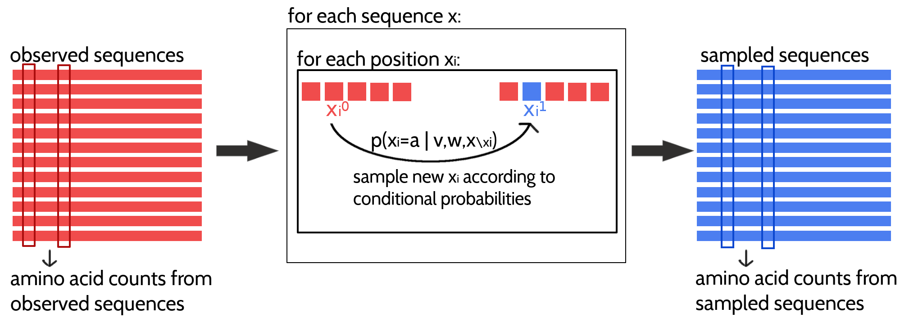
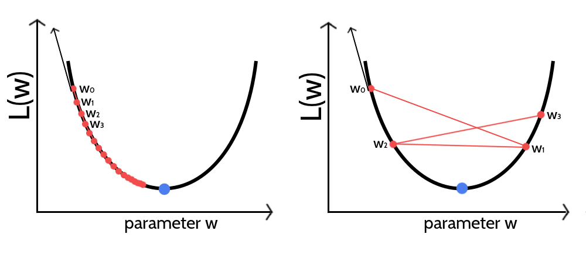
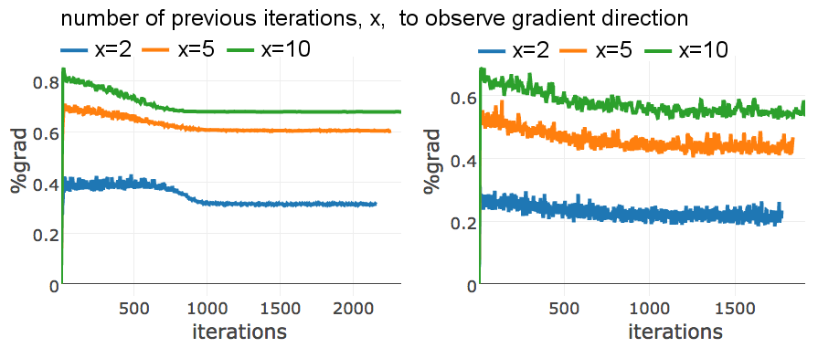
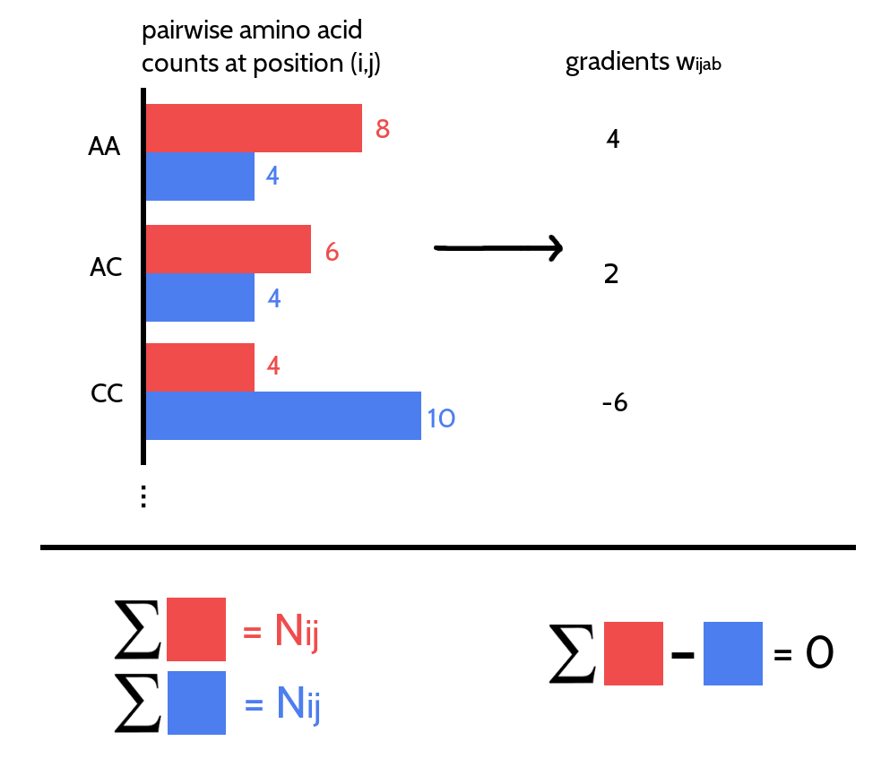
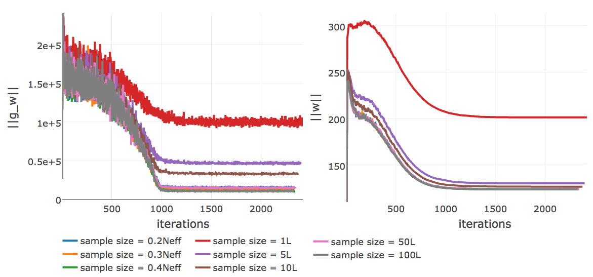

# Optimizing the Full Likelihood {#optimizing-full-likelihood}

Section \@ref(maxent) introduced the *Potts model* for contact prediction that is able to distinguish between directly and indirectly coupled residue pairs by jointly modelling the probabilty of a protein sequence over all residues.
Maximum-likelihood inference of the model parameters is numerically challenging due to the exponential complexity of the partition function that normalizes the probability distribution. 
Several approximate inference techniques for the full likelihood have been developed trying to sidestep the exact computation of the partition function.
At this point in time, pseudo-likelihood is the most successful approximate solution with regard to predicting residue-residue contacts (see section \@ref(pseudo-likelihood)).
It has been shown that the pseudo-likelihood is a consistent estimator to the full likelihood in the limit of large amounts of data.
However, it is unclear whether it represents a good approximation when there is only little data, in other words for small protein families that are the most interesting targets for contact prediction (see Figure \@ref(fig:pfam)).

While the partition function of the full likelihood cannot be efficiently computed, it is possible to approximate the gradient of the full likelihood with an approach called *contrastive divergence* that makes use of [MCMC](#abbrev) sampling techniques [@Hinton2002]. 
This section elaborates on how *contrastive divergence* can be used to optimize the full likelihood with gradient descent techniques.
Furthermore, two aspects of the underlying *Potts model*, namely gap treatment and the choice of regularization, have been refined which is explained in detail in methods section \@ref(potts-full-likelihood). 


## Approximating the Gradient of the Full Likelihood with Contrastive Divergence {#full-likelihood-gradient}

The gradient of the regularized full log likelihood with respect to the couplings $\wijab$ can be written as
\begin{equation}
    \frac{\partial \LLreg}{\partial \wijab} = \; N_{ij} q(x_i \eq a, x_j=b) - N_{ij} \; p(x_i \eq a, x_j \eq b | \v,\w) - \lambda_w \wijab  \; ,
(\#eq:gradient-wijab-full-likelihood-approx)
\end{equation}
where $N_{ij} q(x_i \eq a, x_j=b)$ are the empirical pairwise amino acid counts, $p(x_i \eq a, x_j \eq b | \v,\w)$ corresponds to the marginal distribution of the *Potts model* and $\lambda_w \wijab$ is the partial derivative of the L2-regularizer used to constrain the couplings $\w$.
The empirical amino acid counts are constant and need to be computed only once from the alignment.
The model probability term cannot be computed analytically as it involves the partition function that has exponential complexity. 


[MCMC](#abbrev) algorithms are predominantly used in Bayesian statistics to generate samples from probability distributions that involve the computation of complex integrals and therefore cannot be computed analytically [@Andrieu2003; @Murphy2012]. 
Samples are generated from a probability distribution as the current state of a running Markov chain. 
If the Markov chain is run long enough, the equilibrium statistics of the samples will be identical to the true probability distribution statistics.
In 2002, Lapedes et al. applied [MCMC](#abbrev) sampling to approximate the probability terms in the gradient of the full likelihood [@Lapedes2012a].
They obtained sequence samples from a Markov chain that was run for 4,000,000 steps by keeping every tenth configuration of the chain.
Optimization converged after 10,000 - 15,000 epochs when the gradient had become zero.
The expected amino acid counts according to the model distribution, $N_{ij} \; p(x_i \eq a, x_j \eq b | \v,\w)$, were estimated from the generated samples.
Their approach was successfull but is computationally feasible only for small proteins and points out the limits of applying [MCMC](#abbrev) algorithms.
Typically, they require many sampling steps to obtain unbiased estimates from the stationary distribution which comes at high computational costs.

In 2002, Hinton invented *Contrastive Divergence* as an approximation to [MCMC](#abbrev) methods [@Hinton2002].
It was originally developed for training products of experts models but it can generally be applied to maximizing log likelihoods and has become popular for training restricted Boltzmann machines [@Fischer2012; @Murphy2012; @Bengio2009]. 
The idea is simple: instead of starting a Markov chain from a random point and running it until it has reached the stationary distribution, it is initialized with a data sample and evolved for only a small number of steps.
Obviously the chain has not yet converged to its stationary distribution and the data sample obtained from the current configuration of the chain presents a biased estimate.
The intuition behind [CD](#abbrev) is, that eventhough the gradient estimate is noisy and biased, it points roughly into a similar direction as the true gradient of the full likelihood.
Therefore the approximate [CD](#abbrev) gradient should become zero approximately where the true gradient of the likelihood becomes zero.
Once the parameters are close to the optimum, starting a Gibbs chain from a data sample should reproduce the empirical distribution and not lead away from it, because the parameters already describe the empirical distribution correctly.

The approximation of the likelihood gradient with [CD](#abbrev) according to the *Potts* model for modelling protein families is visualized in Figure \@ref(fig:cd-gibbs-sampling).
$N$ Markov chains will be initialized with the $N$ sequences from the [MSA](#abbrev) and $N$ new samples will be generated by a single step of Gibbs sampling from each of the $N$ sequences.
One full step of Gibbs sampling updates every sequence position $i \in \{1, \ldots, L\}$ subsequently by randomly selecting an amino acid based on the conditional probabilities for observing an amino acid $a$ at position $i$ given the model parameters and all other (already updated) sequence positions:
\begin{equation}
  p(\seq_i = a | (x_1, \ldots, x_{i-1}, x_{i+1}, \ldots, x_L), \v, \w) \propto \exp \left( \vi(a) + \sum_{\substack{j=1 \\ i \ne j}}^L \wij(a, x_j)  \right)
(\#eq:conditional-prob-full-likelihood)
\end{equation}
The generated sample sequences are then used to compute the pairwise amino acid frequencies that correspond to rough estimates of the marginal probabilities of the *Potts* model.
Finally, an approximate gradient of the full likelihood is obtained by subtracting the sampled amino acid counts from the empirical amino acid counts as denoted in eq. \@ref(eq:gradient-wijab-full-likelihood-approx).
 
(ref:caption-gibbs-sampling) Approximating the full likelihood gradient of the *Potts* model with [CD](#abbrev). Pairwise amino acid counts are computed from the observed sequences of the input alignment shown in red on the left. 
Expected amino acid frequencies according to the model distribution are computed from a sampled alignment shown in blue on the right. The [CD](#abbrev) approximation of the likelihood gradient is obtained by computing the difference in amino acid counts of the observed and sampled alignment. A newly sampled sequence is obtained by evolving a Markov chain, that is initialized with an observed sequence, for one full Gibbs step. The Gibbs step involves updating every position in the sequence (unless it is a gap) according to the conditional probabilities for the 20 amino acids at this position. 

```{r cd-gibbs-sampling, echo = FALSE, out.width = '90%', fig.align='center',  fig.cap = '(ref:caption-gibbs-sampling)'}

```


The next sections elucidate the optimization of the *Potts* model full likelihood with [CD](#abbrev) to obtain an approximation to the gradient.


## Optimizing the Full Likelihood {#full-likelihood-optimization}

Given the likelihood gradient estimates obtained with [CD](#abbrev), the full negative log likelihood can now be minimized using a gradient descent optimization algorithm.
Gradient descent algorithms are used to find the minimum of an objective function with respect to its parametrization by iteratively updating the parameters values in the opposite direction of the gradient of the objective function with respect to these parameters.
*Stochastic* gradient descent ([SGD](#abbrev)) is a variant thereof that uses a stochastic estimate of the gradient whose average over many updates approaches the true gradient.
The stochasticity is commonly obtained by evaluating a random subsample of the data at each iteration. 
For [CD](#abbrev) stochasticity additionally arises from the Gibbs sampling process in order to obtain a gradient estimate in the first place.

As a consequence of stochasticity, the gradient estimates are noisy, resulting in parameter updates with high variance and strong fluctuations of the objective function.
These fluctuations enable stochastic gradient descent to escape local minima but also complicate finding the exact minimum of the objective function. 
By slowly decreasing the step size of the parameter updates at every iteration, stochastic gradient descent most likely will converge to the global minimum for convex objective functions [@Ruder2017; @Bottou2012; @Bottou2010].
However, choosing an optimal step size for parameter updates as well as finding the optimal annealing schedule offers a challenge and needs manual tuning [@Schaul2013; @Zeiler2012]. 
If the step size is chosen too small, progress will be unnecessarily slow, if it is chosen too large, the optimum will be overshot and can cause the system to diverge (see Figure \@ref(fig:gd-learning-rate-intro)).
Further complications arise from the fact that different parameters often require different optimal step sizes, because the magnitude of gradients might vary considerably for different parameters, e.g. because of sparse data.

(ref:caption-gd-learning-rate-intro) Visualization of gradient descent optimization of an objective function $L(w)$ for different step sizes $\alpha$. The blue dot marks the minimum of the objective function. The direction of the gradient at the initial parameter estimate $w_0$ is given as black arrow. The updated parameter estimate $w_1$ is obtained by taking a step of size $\alpha$ into the opposite direction of the gradient. **Left** If the step size is too small the algorithm will require too many iterations to converge. **Right** If the step size is too large, gradient descent will overshoot the minimum and can cause the system to diverge.

```{r gd-learning-rate-intro, echo = FALSE, out.width = '80%', fig.align='center', fig.cap = '(ref:caption-gd-learning-rate-intro)'}

```

Unfortunately, it is neither possible to use second order optimization algorithms nor sophisticated first order algorithms like conjugate gradients to optimize the full likelihood of the *Potts* model.
While the former class of algorithms requires (approximate) computation of the second partial derivatives, the latter requires evaluating the objective function in order to identify the optimal step size via linesearch, both being computationally too demanding.

The next subsections describe the hyperparameter tuning for stochastic gradient descent, covering the choice of the convergence criterion and finding the optimal learning rate annealing schedule.

### Convergence Criterion for Stochastic Gradient Descent {#convergence-criteria-sgd}

In theory the gradient descent algorithm has converged and the optimum of the objective function has been reached when the gradient becomes zero. 
In practice the gradients will never be exactly zero, especially due to the stochasticity of the gradient estimates when using stochastic gradient descent with [CD](#abbrev).
For this reason, it is crucial to define a suitable convergence criterion that can be tested during optimization and once the criterion is met, convergence is assumed and the algorithm is stopped. 
Typically, the objective function (or a related loss function) is periodically evaluated on a validation set and the optimizer is halted whenever the function value saturates or starts to increase.
This technique is called early stopping and additionally prevents overfitting [@Bengio2012; @Mahsereci2017].
Unfortunately, we cannot compute the full likelihood function due to its complexity and need to define a different convergence criterion.

One possibility is to stop learning when the L2 norm of the gradient for the coupling parameters $||\nabla_{\w} L\!L(\v^*, \w)||_2$ is close to zero [@Carreira-Perpinan2005].
However, when using a finite number of sequences for sampling, the norm of the gradient does not converge to zero but towards a certain offset as it is described in section \@ref(cd-sampling-size).
Convergence could also be monitored as the relative change of the norm of gradients within a certain number of iterations.
Optimization will be stopped when the relative change becomes negligibly small, that is when the gradient norm has reached a plateau.
As gradient estimates are very noisy with stochastic gradient descent, gradient fluctuations complicate the proper assessment of this criterion.

Instead of the gradient, it is also possible to observe the relative change of the norm of parameter estimates $||\w||_2$ over several iterations and stop learning when it falls below a small threshold $\epsilon$,
\begin{equation}
  \frac{||\w_{t-x}||_2 - ||\w_t||_2}{||\w_{t-x}||_2} < \epsilon \; .
  (\#eq:parameter-convergence-criterion)
\end{equation}
This measure is less noisy than subsequent gradient estimates because the magnitude of parameter updates is bounded by the learning rate.

For stochastic gradient descent the optimum is a moving target and the gradient will start oscillating when approaching the optimum. 
Therefore, another idea is to monitor the direction of the partial derivatives.
However, this theoretical assumption is complicated by the fact that gradient oscillations are also typically observed when the parameter surface contains narrow valleys or generally when the learning rate is too big, as it is visualized in the right plot in Figure \@ref(fig:gd-learning-rate-intro).
When optimizing high-dimensional problems using the same learning rate for all dimensions, it is likely that parameters converge at different speeds [@Ruder2017] leading to oscillations that could either originate from convergence or yet too large learning rates. 
As can be seen in Figure \@ref(fig:gradient-directions), the percentage of parameters for which the derivate changes direction within the last $x$ iterations is usually high and varies for different proteins.
Therefore it is not a good indicator of convergence.
When using the adaptive learning rate optimizer *ADAM*, the momentum term is an interfering factor for assessing the direction of partial derivatives.
Parameters will be updated into the direction of a smoothed historical gradient and oscillations, regardless of which origin, will be dampened.
It is therefore hard to define a general convergence criteria based on the direction of derivatives that can distinguish these different scenarios. 

(ref:caption-gradient-directions) Percentage of parameters for which the derivate has changed its direction (i.e. the sign) during the previous $x$ iterations ($x$ is specified in the legend). Optimization is performed with [SGD](#abbrev) using the optimal hyperparameters defined in section \@ref(sgd-hyperparameter-tuning) and using a regularization coefficient $\lambda_w \eq 0.1L$ (see section \@ref(regularization-for-cd-with-sgd)) and using one step of Gibbs sampling. Optimization is stopped when the relative change over the L2-norm of parameter estimates $||\w||_2$ over the last $x$ iterations falls below the threshold of $\epsilon \eq 1e-8$. Development has been monitored for two different proteins, **Left** 1c75A00 (protein length = 71, number sequences = 28078, [Neff](#abbrev) = 16808) **Right** 1ahoA00 (protein length = 64, number sequences = 378, [Neff](#abbrev) = 229). 

```{r gradient-directions, echo = FALSE, screenshot.alt="img/full_likelihood/sgd/percentage_changes_in_gradient_direction.png", out.width = '100%', fig.align='center', fig.cap = '(ref:caption-gradient-directions)'}

```


Of course, the simplest strategy to assume convergence is to specify a maximum number of iterations for the optimization procedure, which also ensures that the algorithm will stop eventually if none of the other convergence criteria is met.

A necessary but not sufficient condition that is satisfied at the optimum when the gradient is zero, is given by $\sum_{a,b=1}^{20} \wijab = 0$ (see section \@ref(prior-v)).
This condition is never violated, as long as parameters satisfy this criterion at initialization and the same step size is used to update all parameters. 
To understand why, note that the 400 partial derivatives $\frac{\partial L\!L(\v^*, \w)}{\partial \wijab}$ for a residue pair $(i,j)$ and for $a,b \in \{1, \ldots, 20\}$ are not independent.
The sum over the 400 pairwise amino acid counts at positions $i$ and $j$ is identical for the observed and the sampled alignment and amounts to,

\begin{equation}
  \sum_{a,b=1}^{20} N_{ij} q(x_i \eq a, q_j \eq b) = N_{ij} \; .
\end{equation}

Considering a residue pair $(i,j)$ and assuming amino acid pair $(a,b)$ has higher counts in the sampled alignment than in the observed input alignment, then this difference in counts must be compensated by other amino acid pairs $(c,d)$ having less counts in the sampled alignment compared to the true alignment (see Figure \@ref(fig:visualisation-wijab-constraint)).
Therefore, it holds $\sum_{a,b=1}^{20} \frac{\partial L\!L(\v^*, \w)}{\partial \wijab} = 0$.
This symmetry is translated into parameter updates as long as the same step size is used to update all parameters. 
However, when using adaptive learning rates (e.g. with the *ADAM* optimizer), this symmetry is broken and the condition $\sum_{a,b=1}^{20} \wijab = 0$ can be violated during the optimization processs.
It is therefore interesting to monitor $\sum_{1 \le 1 < j \le L} \sum_{a,b=1}^{20} \wijab$.

(ref:caption-visualisation-wijab-constraint) The 400 partial derivatives $\frac{\partial \LLreg(\v^*,\w)}{\partial \wijab}$ at position $(i,j)$ for $a,b \in \{1, \ldots, 20 \}$ are not independent. Red bars represent pairwise amino acid counts at position $(i,j)$ for the sampled alignment. Blue bars represent pairwise amino acid counts at position $(i,j)$ for the input alignment. The sum over pairwise amino acid counts at position $(i,j)$ for both alignments is $N_{ij}$, which is the number of ungapped sequences. The partial derivative for $\wijab$ is computed as the difference of pairwise amino acid counts for amino acids $a$ and $b$ at position $(i,j)$. The sum over the partial derivatives $\frac{\partial \LLreg(\v^*,\w)}{\partial \wijab}$ at position $(i,j)$ for all $a,b \in \{1, \ldots, 20 \}$ is zero.

```{r visualisation-wijab-constraint, echo = FALSE, out.width = '60%', fig.align='center', fig.cap = '(ref:caption-visualisation-wijab-constraint)'}

```


### Tuning Hyperparameters of Stochastic Gradient Descent Optimizer {#sgd-hyperparameter-tuning}

The coupling parameters $\w$ will be updated at each time step $t$ by taking a step of size $\alpha$ along the direction of the negative gradient of the regularized full log likelihood, $- \nabla_w \LLreg(\v^*,\w)$, that has been approximated with [CD](#abbrev),

\begin{equation}
  \w_{t+1} = \w_t - \alpha \cdot \nabla_w \LLreg(\v^*,\w) \; .
\end{equation}

In order to get a first intuition of the optimization problem, I tested initial learning rates $\alpha_0 \in  \{1\mathrm{e}{-4}, 5\mathrm{e}{-4}, 1\mathrm{e}{-3}, 5\mathrm{e}{-3}\}$ with a standard learning rate annealing schedule, $\alpha  = \frac{\alpha_0}{1 + \gamma \cdot t}$ where $t$ is the time step and $\gamma$ is the decay rate that is set to 0.01[@Bottou2012].

Figure \@ref(fig:performance-cd-alphaopt) shows the mean precision for top ranked contacts computed from pseudo-likelihood couplings and from [CD](#abbrev) couplings optimized with stochastic gradient descent using the four different learning rates. 
Overall, mean precision for [CD](#abbrev) contacts is lower than for pseudo-likelihood contacts, especially when using the smallest ($\alpha_0 \eq 1\mathrm{e}{-4}$) and largest ($\alpha_0 \eq 5\mathrm{e-}{3}$) learning rate.


(ref:caption-performance-cd-alphaopt)  Mean precision for top ranked contact predictions over 300 proteins. Contact scores are computed as the [APC](#abbrev) corrected Frobenius norm of the couplings $\wij$.  **pseudo-likelihood**:  couplings computed with pseudo-likelihood. **CD alpha0 = X**: couplings computed with [CD](#abbrev) using stochastic gradient descent with different initial learning rates $\alpha_0$ (see legend).

```{r performance-cd-alphaopt, echo = FALSE, screenshot.alt="img/full_likelihood/sgd/precision_vs_rank_learning_rates.png", out.width = '85%', fig.align='center', fig.cap = '(ref:caption-performance-cd-alphaopt)'}
knitr::include_url("img/full_likelihood/sgd/precision_vs_rank_learning_rates.html", height = "500px")
```

By looking at individual proteins it becomes evident that the optimal learning rate depends on alignment size.
Figure \@ref(fig:sgd-single-proteins-initial-learning-rate) displays the development of the L2 norm of the coupling parameters, $||\w||_2$, during optimization using different learning rates for two proteins with different alignment sizes. 
The left plot shows protein 1c75A00 that has a large alignment with 28078 sequences ([Neff](#abbrev) = 16808) while the right plot shows protein 1ahoA00 that has a small alignment with 378 sequences ([Neff](#abbrev) = 229).
For protein 1ahoA00 and using a small initial learning rate $\alpha_0 \eq \mathrm{1e-4}$, the optimization runs very slowly and does not converge within tha maximum number of 5000 iterations.
Using a large initial learning rate $\alpha_0 \eq \mathrm{5e-3}$ results in slighly overshooting the optimum at the beginning of the optimization but with the learning rate decaying over time the parameter estimates converge. 
In contrast, for protein 1c75A00, the choice of learning rate has a more pronounced effect.
With a small initial learning rate  $\alpha_0 \eq \mathrm{1e-4}$ the optimization runs slowly but almost converges within 5000 iterations.
A large initial learning rate $\alpha_0 \eq \mathrm{5e-3}$ lets the parameters diverge quickly and the optimum cannot be recovered.
With learning rates $\alpha_0 \eq \mathrm{5e-4}$ and $\alpha_0 \eq \mathrm{1e-3}$, the optimum is well overshot at the beginning of the optimization but the parameter estimates eventually converge as the learning rate decreases over time.

These observations can be explained by the fact that the magnitude of the gradient scales with the number of sequences in the alignment.
The gradient is computed from amino acid counts as explained before.
Therefore, alignments with many sequences will generally produce larger gradients than alignments with few sequences, especially at the beginning of the optimization procedure when the difference in amino acid counts between sampled and observed sequences is largest.
Following these observations, I defined the initial learning rate $\alpha_0$ as a function of [Neff](#abbrev),

\begin{equation}
  \alpha_0 = \frac{5\mathrm{e}{-2}}{\sqrt{N_{\text{eff}}}} \; .
  (\#eq:learning-rate-wrt-neff)
\end{equation}

For small [Neff](#abbrev), e.g. 5th percentile of the distribution in the dataset $\approx 50$, this definition of the learning rate yields $\alpha_0 \approx 7\mathrm{e}{-3}$ and for large [Neff](#abbrev), e.g. 95th percentile $\approx 15000$, this yields $\alpha_0 \approx 4\mathrm{e}{-4}$. 
These values for $\alpha_0$ lie in the optimal range that has been observed for the two representative proteins in Figure \@ref(fig:performance-cd-alphaopt).
With the initial learning rate defined as a function of [Neff](#bbrev), precision slightly improves over the previous fixed learning rates (see Appendix Figure \@ref(fig:performance-cd-alphaopt-0)).
All following analyses are conducted using the [Neff](#abbrev)-dependent initial learning rate.

(ref:caption-sgd-single-proteins-initial-learning-rate) Convergence plots for two proteins during [SGD](#abbrev) optimization with different learning rates and convergence measured as L2-norm of the coupling parameters $||\w||_2$. Linear learning rate annealing schedule has been used with decay rate $\gamma=0.01$ and initial learning rates $\alpha_0$ have been set as specified in the legend. **Left** 1c75A00 (protein length = 71, number sequences = 28078, [Neff](#abbrev) = 16808). Figure is cut at the yaxis at $||\w||_2=1000$, but learning rate of $5\mathrm{e}{-3}$ reaches $||\w||_2 \approx 9000$. **Right** 1ahoA00 (protein length = 64, number sequences = 378,  [Neff](#abbrev) = 229)

```{r sgd-single-proteins-initial-learning-rate, echo = FALSE, out.width = '48%', fig.align='center', fig.show='hold', fig.cap = '(ref:caption-sgd-single-proteins-initial-learning-rate)'}
knitr::include_graphics(c("img/full_likelihood/sgd/parameter_norm_1c75a00_alphas_lindecay001.png","img/full_likelihood/sgd/parameter_norm_1ahoa00_alphas_lindecay001.png"))
```

In a next step, I evaluated the following learning rate annealing schedules and decay rates using the [Neff](#abbrev)-dependent initial learning rate given in eq. \@ref(eq:learning-rate-wrt-neff):

- default linear learning rate schedule $\alpha  = \frac{\alpha_0}{1 + \gamma t}$ with $\gamma \in \{1\mathrm{e}{-3}, 1\mathrm{e}{-2}, 1\mathrm{e}{-1}, 1 \}$
- square root learning rate schedule $\alpha  = \frac{\alpha_0}{\sqrt{1 + \gamma t}}$ with $\gamma \in \{1\mathrm{e}{-2}, 1\mathrm{e}{-1}, 1 \}$
- sigmoidal learning rate schedule $\alpha_{t+1}  = \frac{\alpha_{t}}{1 + \gamma t}$ with $\gamma \in \{1\mathrm{e}{-6}, 1\mathrm{e}{-5}, 1\mathrm{e}{-4}, 1\mathrm{e}{-3}\}$
- exponential learning rate schedule $\alpha_{t+1}  = \alpha_0 \cdot\exp(- \gamma t)$ with $\gamma \in \{5\mathrm{e}{-4}, 1\mathrm{e}{-4}, 5\mathrm{e}{-3}\}$

The learning rate annealing schedules are visualized for different decay rates in Appendix Figure \@ref(fig:learning-rate-schedules).
Optimizing [CD](#abbrev) with [SGD](#abbrev) using any of the learning rate schedules listed above yields on average lower precision for the top ranked contacts than the pseudo-likelihood contact score.
Several learning rate schedules perform almost equally and yield a mean precision that is about one to two percentage below the mean precision for the pseudo-likelihood contact score (see Figure \@ref(fig:performance-cd-learnignrate-schedules)):
a linear learning rate schedule with decay rate $\gamma \eq 1\mathrm{e}{-2}$, a sigmoidal learning rate schedule with decay rates $\gamma \eq 1\mathrm{e}{-5}$ or $\gamma \eq 1\mathrm{e}{-6}$ and an exponential learning rate schedule with decay rates $\gamma \eq 1\mathrm{e}{-3}$ or $\gamma \eq 1\mathrm{e}{-5}$. 
The square root learning rate schedule gives ovarall bad results and does not lead to convergence because the learning rate decays slowly at later time steps.
The benchmark plots for all learning rate schedules are shown in Appendix section \@ref(benchmark-learning-rate-annealing-schedules).

(ref:caption-performance-cd-learnignrate-schedules) Mean precision for top ranked contact predictions over 300 proteins. Contact scores are computed as the [APC](#abbrev) corrected Frobenius norm of the couplings $\wij$. **pseudo-likelihood**:  couplings computed with pseudo-likelihood. **CD**: couplings computed with [CD](#abbrev) using stochastic gradient descent with an initial learning rate defined with respect to [Neff](#abbrev). Learning rate annealing schedules and decay rates are specified in the legend.

```{r performance-cd-learnignrate-schedules, echo = FALSE, screenshot.alt="img/full_likelihood/sgd/precision_vs_rank_schedules.png", out.width = '90%', fig.align='center', fig.cap = '(ref:caption-performance-cd-learnignrate-schedules)'}
knitr::include_url("img/full_likelihood/sgd/precision_vs_rank_schedules.html", height = "500px")
```


In contrast to the findings regarding the initial learning rate earlier, an optimal decay rate can be defined independent of the alignment size.
Figure \@ref(fig:sgd-single-proteins-learning-rate-schedule) shows the development of the L2 norm of the coupling parameters, $||\w||_2$, during optimization for the same two representative proteins with small and large alignments as before.
Convergence for protein 1ahoA00, having small [Neff](#abbrev)=229, is robust against the particular choice of learning rate schedule and decay rate and the presumed optimum at $||w||_2 \approx 13.2$ is reached regardless of the learning rate annealing schedule (see right plot in Figure \@ref(fig:sgd-single-proteins-learning-rate-schedule)).
For protein 1c75A00, with high [Neff](#abbrev)=16808, the choice of the learning rate schedule has a notable impact on the rate of convergence.
Using a linear schedule, the learning rate decays quickly but then converges to a certain offset, which effectively prevents further optimization progress and the presumed optimum at $||w||_2 \approx 90$  is not reached within 5000 iterations.
Learning rate schedules that decay slower but decay continously for 5000 iterations, such as an exponential schedule with $\gamma \eq 1\mathrm{e}{-3}$ or a sigmoidal schedule with $\gamma \eq 1\mathrm{e}{-6}$, guide the parameter estimates close to the expected optimum.
Therefore, learning rate schedules with an exponential or sigmoidal decay can be used with proteins having low [Neffs](#abbrev) as well as high [Neffs](#abbrev).

(ref:caption-sgd-single-proteins-learning-rate-schedule) L2-norm of the coupling parameters $||\w||_2$ during stochastic gradient descent optimization with different learning rates schedules. The initial learning rate $\alpha_0$ is defined with respect to [Neff](#abbrev) as given in eq. \@ref(eq:learning-rate-wrt-neff). Learning rate schedules and decay rates are used according to the legend. **Left** 1c75A00 (protein length = 71, number sequences = 28078, [Neff](#abbrev) = 16808). **Right** 1ahoA00 (protein length = 64, number sequences = 378,  [Neff](#abbrev) = 229)

```{r sgd-single-proteins-learning-rate-schedule, echo = FALSE, out.width = '48%', fig.align='center', fig.show='hold', fig.cap = '(ref:caption-sgd-single-proteins-learning-rate-schedule)'}
knitr::include_graphics(c("img/full_likelihood/sgd/parameter_norm_1c75a00_alpha0_different_schedules.png","img/full_likelihood/sgd/parameter_norm_1ahoa00_alpha0_different_schedules.png"))
```


Another aspect worth considering is runtime and it can be observed that the different learning rate annealing schedules differ in convergence speed.
Figure \@ref(fig:distribution-num-iterations) shows the distribution over the number of iterations until convergence for [SGD](#abbrev) optimizations with five different learning rate schedules that yield similar performance. 
The optimization converges on average within less than 2000 iterations only when using either a sigmoidal learning rate annealing schedule with decay rate $\gamma \eq 1\mathrm{e}{-5}$ or an exponential learning rate annealing schedule with decay rate $\gamma \eq 5\mathrm{e}{-3}$, 
On the contrary, the distribution  of iterations until convergence has a median of 5000 when using a linear learning rate annealing schedule with $\gamma \eq 1\mathrm{e}{-2}$ or an exponential schedule with decay rate $\gamma \eq 1\mathrm{e}{-3}$.
Under these considerations, I chose a sigmoidal learning rate schedule with $\gamma \eq 5\mathrm{e}{-6}$ for all further analysis.

(ref:caption-distribution-num-iterations) Distribution of the number of iterations until convergence for [SGD](#abbrev) optimizations of [CD](#abbrev) for different learning rate schedules. Convergence is reached when the relative difference of parameter norms, $||\w||_2$, over the last five iterations falls below $\epsilon \eq 1e-8$. Initial learning rate $\alpha_0$ is defined with respect to [Neff](#abbrev) as given in eq. \@ref(eq:learning-rate-wrt-neff) and maximum number of iterations is set to 5000. Learning rate schedules and decay rates are specified in the legend.

```{r distribution-num-iterations, echo = FALSE, screenshot.alt="img/full_likelihood/sgd/distribution_numiterations_against_selected_learningrate_schedules.png", out.width = '100%', fig.align='center', fig.cap = '(ref:caption-distribution-num-iterations)'}
knitr::include_url("img/full_likelihood/sgd/distribution_numiterations_against_selected_learningrate_schedules.html", height = "500px")
```

Finally, I checked whether altering the convergence criteria has notable impact on performance.
Per default, optimization is stopped whenever the relative change of the L2 norm over coupling parameters, $||\w||_2$, over the last 5 iterations falls below a small value $\epsilon < 1e-8$ as denoted in eq. \@ref(eq:parameter-convergence-criterion).
Figure \@ref(fig:performance-cd-convergence-prev) shows that the mean precision over proteins is robust to different settings of the number of iterations over which the relative change is computed. 
The convergence rate is mildly affected by the different settings. 
Optimization converges on average within 1697, 1782 and 1917 iterations, when computing the relative change of the parameter norm over the previous 2,5 and 10 iterations, respectively (see Appendix Figure \@ref(fig:numit-convergence-convergence-prev)).
For all following analysis, I chose 10 to be the number of iterations over which the convergence criterion is computed.

(ref:caption-performance-cd-convergence-prev)  Mean precision for top ranked contact predictions over 300 proteins. Contact scores are computed as the [APC](#abbrev) corrected Frobenius norm of the couplings $\wij$. **pseudo-likelihood**:  couplings computed with pseudo-likelihood. **#previous iterations = X**: couplings computed with [CD](#abbrev) using stochastic gradient descent with an initial learning rate defined with respect to [Neff](#abbrev) and the sigmoidal learning rate schedule with $\gamma \eq 5\mathrm{e}{-6}$. The relative change of the L2 norm over coupling parameters, $||\w||_2$, is evaluated over the previous X iterations (specified in the legend) and convergence is assumed when the relative change falls below a small value $\epsilon \eq 1e-8$.

```{r performance-cd-convergence-prev, echo = FALSE, screenshot.alt="img/full_likelihood/sgd/precision_vs_rank_convergence_prev.png", out.width = '90%', fig.align='center', fig.cap = '(ref:caption-performance-cd-convergence-prev)'}
knitr::include_url("img/full_likelihood/sgd/precision_vs_rank_convergence_prev.html", height = "500px")
```


## Tuning the Gibbs Sampling Scheme for Contrastive Divergence {#cd-sampling-optimization}

The original [CD](#abbrev)-k algorithm described by Hinton in 2002 evolves the Markov chains by k=1 Gibbs steps [@Hinton2002]. 
As described earlier, [CD](#abbrev)-1 provides a biased estimate of the true gradient because the Markov chains have not reached the stationary distribution [@Fischer2012]. 
Bengio and Delalleau show that the bias for [CD](#abbrev)-k kan be understood as a residual term when expressing the log likelihood gradient as an expansion that involves the k-th sample of the Gibbs chain [@Ma2016; @Bengio2009].
As the number of Gibbs steps, k, goes to infinity the residual term and hence the bias converges to zero and the [CD](#abbrev) gradient estimate converges to a stochastic estimation of the true likelihood gradient.
Indeed, eventhough surprising results have been obtained by evolving the Markov chains for only one Gibbs step, typically [CD](#abbrev)-k for k>>1 gives more precise results [@Bengio2009].
Furthermore it has been shown, that bias also depends on the mixing rate (rate of convergence) of the chains whereby the mixing rate decreases when model parameters increase [@Tieleman2008].
This can lead to divergence of the [CD](#abbrev)-k solution from optimal solution in a sense that the model systematically gets worse as optimization progresses [@Fischer2010].
Regularization of the parameters offers a solution to this problem, constraining the magnitude of the parameters.
A different solution suggested by Bengio and Delalleau is to dynamically increase k when the model parameters increase [@Bengio2009].
These studies analysing the convergence properties and the expected approximation error for [CD](#abbrev)-k have mainly been conducted for Restricted Boltzmann Machines. 
It is therefore not clear, whether and to what extent these findings apply to the *Potts* model.

Several connections of [CD](#abbrev) to other well known approximation algorithms have been drawn. 
For example, it can be shown that [CD](#abbrev) using one Gibbs update step on a randomly selected variable is exactly equivalent to a stochastic maximum pseudo-likelihood estimation [@Hyvarinen2006; @Hyvarinen2007].
Asuncion and colleagues showed further that an arbitrary good approximation to the full likelihood can be reached by applying blocked-Gibbs sampling [@Asuncion2010].
[CD](#abbrev) based on sampling an arbitraty number of variables, has an equivalent stochastic composite likelihood, which is a higher-order generalization of the pseudo-likelihood.

Another variant of [CD](#abbrev) is [PCD](#abbrev), such that the Markov chain is not reinitialized at a data sample every time a new gradient is computed [@Tieleman2008].
Instead, the Markov chains are kept *persistent* that is, they are evolved between successive gradient computations.
The fundamental idea behind [PCD](#abbrev) is that the model changes only slowly between parameter updates given a sufficiently small learning rate.
Consequently, the Markov chains will not be pushed too far from equilibrium after each update but rather stay close to the stationary distribution [@Tieleman2008; @Murphy2012; @Fischer2012].
Tieleman and others observed that [PCD](#abbrev) performs better than [CD](#abbrev) in all practical cases tested, eventhough [CD](#abbrev) can be faster in the early stages of learning and thus should be preferred when runtime is the limiting factor [@Tieleman2008; @Murphy2012; @Swersky2010].

The next sections discuss various modifications of the [CD](#abbrev) algorithm, such as varying the regularization strength $\lambda_w$ for constraining the coupling parameters $\w$, increasing the number of Gibbs sampling steps and varying the number of Markov chains used for sampling.
Persistent contrastive divergence is analysed for various combinations of the above mentioned settings and eventually combined with [CD](#abbrev)-k. 
Unless noted otherwise, all optimizations will be performed using stochastic gradient descent with the tuned hyperparameters described in the last sections. 

### Tuning Regularization Coefficients for Contrastive Divergence {#regularization-for-cd-with-sgd}

For tuning the hyperparameters of the stochastic gradient descent optimizer in the last section \@ref(sgd-hyperparameter-tuning), the coupling parameters $\w$ were constrained by a Gaussian prior $\mathcal{N}(\w | 0, \lambda_w^{-1} I)$ using the default pseudo-likelihood regularization coefficient $\lambda_w \eq 1\mathrm{e}{-2}L$ as decscribed in methods section \@ref(methods-regularization).
It is conceivable that [CD](#abbrev) achieves optimal performance using stronger or weaker regularization than used for pseudo-likelihood optimization.
Therefore, I evaluated performance for different regularization coefficients $\lambda_w \in \{ 5\mathrm{e}{-2}L, 1\mathrm{e}{-1}L, 1\mathrm{e}{-2}L, L\}$ using the previously identified hyperparamters for [SGD](#abbrev).
The single potentials $\v$ are not subject to optimization and are kept fixed at their maximum-likelihood estimate $v^*$ that is derived in eq. \@ref(eq:prior-v). 

As can be seen in Figure \@ref(fig:precison-cd-regularization), using strong regularization for the couplings, with $\lambda_w \eq L$, results in a drastic drop of mean precision.
Using weaker regularization, with $\lambda_w \eq \mathrm{5e}{-2}L$, improves precision for the top $L/10$ and $L/5$ predicted contacts but decreases precision when including lower ranked predictions.
As a matter of fact, a slightly weaker regularization $\lambda_w \eq \mathrm{1e}{-1}L$ than the default $\lambda_w \eq \mathrm{1e}{-2}L$ improves mean precision especially for the top $L/2$ contacts in such a way, that it is comparable to the pseudo-likelihood performance. 

(ref:caption-precison-cd-regularization) Mean precision for top ranked contact predictions over 300 proteins. Contact scores are computed as the [APC](#abbrev) corrected Frobenius norm of the couplings $\wij$. **pseudo-likelihood**:  couplings computed with pseudo-likelihood. **CD lambda_w = X**: couplings computed with [CD](#abbrev) using L2-regularization on the couplings $\w$ with regularization coefficient $\lambda_w$ specified in the legend and keeping the single potentials $\vi$ fixed at their [MLE](#abbrev) optimum $\vi^*$ denoted in eq. \@ref(eq:prior-v).

```{r precison-cd-regularization, echo = FALSE, screenshot.alt="img/full_likelihood/sgd/precision_vs_rank_regularizer.png", out.width = '90%', fig.align='center', fig.cap = '(ref:caption-precison-cd-regularization)'}
knitr::include_url("img/full_likelihood/sgd/precision_vs_rank_regularizer.html", height = "500px")
```

As mentioned before, in contrast to pseudo-likelihood optimization the single potentials $\v$ are not optimized with [CD](#abbrev) but rather set to their maximum-likelihood estimate as it is obtained in a single position model that is discussed in methods section \@ref(eq:prior-v).
When the single potentials $\v$ are optimized with [CD](#abbrev) using the same regularization coefficient $\lambda_v \eq 10$ as for pseudo-likelihood optimization, performance is almost indistinguishable compared to keeping the single potentials $\v$ fixed (see Appendix Figure \@ref(fig:full-likelihood-opt-fixv)).

### Varying the Sample Size {#cd-sampling-size}

The default Gibbs sampling scheme outlined in method section \@ref(methods-cd-sampling) involves the random selection of $10L$ sequences from the input alignment, with $L$ being protein length, at every iteration of the optimization procedure.
These selected sequences are used to initialize the same number of Markov chains. 
The particular choice of $10L$ sequences was motivated by the fact that there is a relationship between the precision of contacts predicted from pseudo-likelihood and protein length, at least for alignments with less than $10^3$ diverse sequences [@Anishchenko2017].
It has been argued that roughly $5L$ nonredundant sequences are required to obtain confident predictions that can bet used for protein structure prediction [@Kamisetty2013].

I analysed whether varying the number of sequences used for the approximation of the gradient via Gibbs sampling affects performance.
Randomly selecting only a subset of sequences $S$ from the $N$ sequences of the input alignment corresponds to the stochastic gradient descent idea of a minibatch and introduces additional stochasticity over the [CD](#abbrev) Gibbs sampling process. 
Using $S < N$ sequences for Gibbs sampling has the further advantage of decreasing the runtime at each iteration. 
I evaluated different schemes for the random selection of sequences:

- sampling $x$L sequences with $x \in \{ 1, 5, 10, 50 \}$ without replacement enforcing $S \eq \min(N, xL)$
- sampling $x$[Neff](#abbrev) sequences with $x \in \{ 0.2, 0.3, 0.4 \}$ without replacement

Figure \@ref(fig:cd-performance-samplesize) illustrates performance for several of the choices.
Randomly selecting $L$ sequences for sampling results in a visible drop in performance. 
There is no benefit in using more than $10L$ sequences, especially as sampling more sequences increases runtime per iteration.
Specifying the number of sequences for sampling as fractions of [Neff](#abbrev) generally improves precision slightly over selecting $10L$ or $50L$ sequences for sampling.
By sampling $0.3$[Neff](#abbrev) sequences, [CD](#abbrev) does slighty improve over pseudo-likelihood.

(ref:caption-cd-performance-samplesize) Mean precision for top ranked contact predictions over 300 proteins. Contact scores are computed as the [APC](#abbrev) corrected Frobenius norm of the couplings $\wij$. **pseudo-likelihood**:  couplings computed with pseudo-likelihood.  **CD sample size = X **: contact scores computed from [CD](#abbrev) with [SGD](#abbrev). At every iteration, a particular number of sequences is randomly selected from the input alignmet to initialize the Markoc chains for Gibbs sampling. The number of randomly selected sequences is specified in the legend. It is defined either as multiples of protein length $L$ or as fraction of the effective number of sequences [Neff](#abbrev). 

```{r cd-performance-samplesize, echo = FALSE, screenshot.alt="img/full_likelihood/gibbs_sampling/precision_vs_rank_samplesize.png", out.width = '90%', fig.align='center', fig.cap = '(ref:caption-cd-performance-samplesize)'}
knitr::include_url("img/full_likelihood/gibbs_sampling/precision_vs_rank_samplesize.html", height = "500px")
```

When evaluating performance with respect to the number of effective sequences [Neff](#abbrev), it can clearly be noted that the optimal number of randomly selected sequences should be defined as a fraction of [Neff](#abbrev). 
Selecting too many sequences, e.g. $50L$ for small alignments (left plot in Figure \@ref(fig:cd-precision-sampling-size-neff)), or selecting too few sequences, e.g $1L$ for large alignments (right plot in Figure \@ref(fig:cd-precision-sampling-size-neff)), results in a decrease in precision compared to defining the number of sequences as fractions of [Neff](#abbrev).
Especially small alignments benefit from sample sizes defined as a fraction of [Neff](#abbrev) with improvements of about three percentage points in precision over pseudo-likelihood.

(ref:caption-cd-precision-sampling-size-neff) Mean precision for top ranked contact predictions over subsets of 75 proteins, defined according to [Neff](#abbrev) quartiles. Contact scores are computed as the [APC](#abbrev) corrected Frobenius norm of the couplings $\wij$. **pseudo-likelihood**:  contact scores computed from pseudo-likelihood. **CD sample size = X **: contact scores computed from [CD](#abbrev) with [SGD](#abbrev). The number of randomly selected sequences for the Gibbs sampling process is specified in the legend. It is defined either as multiples of protein length $L$ or as fraction of the effective number of sequences [Neff](#abbrev).  **Left** Subset of 75 proteins with [Neff](#abbrev) < Q1. **Right** Subset of 75 proteins with Q3 <= [Neff](#abbrev) < Q4.

```{r cd-precision-sampling-size-neff, echo = FALSE, screenshot.alt="img/full_likelihood/gibbs_sampling/precision_vs_rank_facetted_by_neff_samplesize.png", out.width='100%', fig.align='center', fig.cap = '(ref:caption-cd-precision-sampling-size-neff)'}
knitr::include_url("img/full_likelihood/gibbs_sampling/precision_vs_rank_facetted_by_neff_samplesize.html", height = "600px")
```

To understand the effect of different choices of sample size it is necessary to look at single proteins. 
The left plot in Figure \@ref(fig:cd-samplesize-protein1c75a00) shows the development of the L2 norm of the gradient for couplings, $||\nabla_{\w} L\!L(\v^*, \w)||_2$, for protein chain 1c75A00 that is of length 71 and has [Neff](#abbrev) = 16808.
The norm of the gradient decreases during optimization and for increasing choices of the sample size it saturates at decreasing levels.
For example, increasing the sample size by a factor 100 (from $L$ to $100L$) leads to an approximately 10-fold reduction of the norm of the gradient at convergence ($\mathrm{1e}{+5}$ compared to $\mathrm{1e}{+4}$), which corresponds to a typical reduction of statistical noise as the square root of the number of samples.
It is not feasible to sample the number of sequences at each iteration that would be necessary to reduce the norm of the gradient to near zero! 

The previous benchmark showed, that precision of the top ranked contacts does not improve to the same amount as the norm of the gradient decreases when the sample size is increased.
Probably, the improved gradient when using a larger sample size helps to finetune the parameters, which only has a negligible effect on the contact score computed as [APC](#abbrev) corrected Frobenius norm of the couplings $\wij$.
For example, the difference between the parameter norm at convergence for sampling $10L = 710$ sequences or $50L = 3550$ sequences is only marginal (see right plot in Figure \@ref(fig:cd-samplesize-protein1c75a00)), despite a larger difference of the norm of gradients. 

It is not clear why an improved gradient estimate due to sampling more sequences results in weaker performance for proteins with small alignments as could be seen in the previous benchmark in Figure \@ref(fig:cd-precision-sampling-size-neff). 
Protein 1ahoA00, that has length 64 and an alignment of 378 sequences ([Neff](#abbrev)=229), achieves a mean precision of 0.44 over the top $0.1L$ - $L$ contacts when using all $N \eq 378$ sequences for sampling. When only $0.3N_{\textrm{eff}} \eq 69$ sequences are used in the sampling procedure, 1ahoA00 achieves a mean precision of 0.62.
Appendix Figure \@ref(fig:cd-samplesize-protein1ahoa00) shows the course of the norm of the gradient and the norm of coupling parameters during optimization for this protein. 
Similarly as it has been observed for protein 1c75A00, the norm of the gradient converges towards smaller values when more sequences are used in the Gibbs sampling process and the improved gradient is supposed to lead to a better approximation of the likelihood.
One explanation for this obvious discrepancy could be some effect of overfitting. 
Eventhough a regularizer is used for optimization and the norm of coupling parameters actually is smaller when using a larger sample size (see the right plot in Appendix Figure \@ref(fig:cd-samplesize-protein1ahoa00)). 

(ref:caption-cd-samplesize-protein1c75a00) Monitoring parameter norm and gradient norm for protein 1c75A00 during [SGD](#abbrev) using different sample sizes. Protein 1c75A00 has length L=71 and 28078 sequences in the alignment ([Neff](#abbrev)=16808). The number of sequences, that is used for Gibbs sampling to approximate the gradient, is given in the legend with 1L = 71 sequences, 5L = 355 sequences, 10L = 710 sequences, 50L = 3550 sequences, 100L = 7100 sequences, 0.2Neff = 3362 sequences, 0.3Neff = 5042 sequences, 0.4Neff = 6723 sequences.  **Left** L2-norm of the gradients for coupling parameters, $||\nabla_{\w} L\!L(\v^*, \w)||_2$ (without contribution of regularizer).  **Right** L2-norm of the coupling parameters $||\w||_2$.

```{r cd-samplesize-protein1c75a00, echo = FALSE, out.width = '100%', fig.align='center', fig.show='hold', fig.cap = '(ref:caption-cd-samplesize-protein1c75a00)'}

```


### Varying the number of Gibbs Steps  {#cd-gibbs-steps}

As discussed earlier, it has been pointed out in the literature that using $k>1$ Gibbs steps for sampling sequences gives more precise results at the cost of longer runtimes per gradient evaluation [@Bengio2009; @Tieleman2008].
I analysed the impact on performance when the number of Gibbs steps is increased to 5 and 10.
As can be seen in Figure \@ref(fig:precision-cd-gibbs-steps), increasing the number of Gibbs steps does result in a slight drop of performance.
When evaluating precision with respect to [Neff](#abbrev) it can be found that using more Gibbs sampling steps is especially disadvantageous for large alignments (see Appendix Figure \@ref(fig:cd-precision-gibbssteps-neff)). 


(ref:caption-precision-cd-gibbs-steps) Mean precision for top ranked contact predictions over 300 proteins. Contact scores are computed as the [APC](#abbrev) corrected Frobenius norm of the couplings $\wij$. **pseudo-likelihood**:  contact scores computed from pseudo-likelihood. **CD #Gibbs steps = X**: contact scores computed from [CD](#abbrev) optimized with [SGD](#abbrev) and evolving each Markov chain using the number of Gibbs steps specified in the legend. 

```{r precision-cd-gibbs-steps, echo = FALSE, screenshot.alt="img/full_likelihood/gibbs_sampling/precision_vs_rank_gibbssteps.png", out.width = '90%', fig.align='center', fig.cap = '(ref:caption-precision-cd-gibbs-steps)'}
knitr::include_url("img/full_likelihood/gibbs_sampling/precision_vs_rank_gibbssteps.html", height = "500px")
```

When evaluating single proteins, it can be observed that for proteins with small alignments the L2 norm of the parameters, $||\w||_2$, converges towards a different offset when using more than one Gibbs steps (see left plot in Figure \@ref(fig:cd-gibbssteps-single-proteins)). 
Naturally, the Markov chains can wander further away from their initialization when they are evolved over a longer time which results in a stronger gradient at the beginning of the optimization. 
Therefore and because the initial learning rate has been optimized for sampling with one Gibbs step, the parameter norm overshoots the optimum at the beginning.
Even when lowering the initial learning rate from $\alpha_0 = \frac{5e-2}{\sqrt{N_{\text{eff}}}}$ to $\alpha_0 \in \left \{ \frac{3e-2}{\sqrt{N_{\text{eff}}}}, \frac{2e-2}{\sqrt{N_{\text{eff}}}} , \frac{1e-2}{\sqrt{N_{\text{eff}}}}  \right \}$, the [SGD](#abbrev) optimizer evidently approaches a different optimum.
Surprisingly, the different optimum that is found for proteins with small alignments has no substantial impact on precision, as becomes evident from Figure \@ref(fig:cd-precision-gibbssteps-neff).
For proteins with large alignments it can be observed that there is not one alternative solution to the parameters, but depending on the number of Gibbs steps and on the initial learning rate, $\alpha_0$, the L2 norm over parameters converges towards various different offsets (see right plot in Figure \@ref(fig:cd-gibbssteps-single-proteins)).
It is not clear how these observations can be interpreted, in particular given the fact, that the L2 norm of gradients, $||\nabla_{\w} L\!L(\v^*, \w)||_2$, converges to the identical offset for all settings regardless of alignment size (see Appendix Figure \@ref(fig:cd-gibbssteps-single-proteins-gradient)).
Optimizing [CD](#abbrev) with 10 Gibbs steps and using a smaller initial learning rate, $\alpha0 = \frac{2e-2}{\sqrt{N_{\text{eff}}}}$, does not have an overal impact on mean precision as can be seen in Figure \@ref(fig:precision-cd-gibbs-steps).

(ref:caption-cd-gibbssteps-single-proteins) Monitoring parameter norm, $||\w||_2$, for protein 1aho_A_00 and 1c75_A_00 during [SGD](#abbrev) optimization using different number of Gibbs steps and initial learning rates, $\alpha_0$. Number of Gibbs steps is given in the legend, as well as particular choices for the initial learning rate, when not using the default $\alpha_0 = \frac{5e-2}{\sqrt{N_{\text{eff}}}}$. **Left** Protein 1aho_A_00 has length L=64 and 378 sequences in the alignment ([Neff](#abbrev)=229) **Right** Protein 1c75_A_00 has length L=71 and 28078 sequences in the alignment ([Neff](#abbrev)=16808).


```{r cd-gibbssteps-single-proteins, echo = FALSE, out.width = '48%', fig.align='center', fig.show='hold', fig.cap = '(ref:caption-cd-gibbssteps-single-proteins)'}
knitr::include_graphics(c("img/full_likelihood/gibbs_sampling/parameter_norm_1ahoa00.png", "img/full_likelihood/gibbs_sampling/parameter_norm_1c75a00.png"))
```

### Persistent Contrastive Divergence  {#cd-gibbs-steps} 

Finally I analysed, whether evolving the Markov chains over successive iterations, which is known as [PCD](#abbrev), does improve performance [@Tieleman2008].
Several empirical studies have shown that [PCD](#abbrev) performs superior compared to [CD](#abbrev)-1 and also to [CD](#abbrev)-10 [@Tieleman2008; @Swersky2010].
In the literatur is has been pointed out that [PCD](#abbrev) needs to use small learning rates because in order to sample from a distribution close to the stationary distribution, the parameters cannot change too rapidly. 
However, using smaller learning rates not only increases runtime but also requires tuning of the learning rate and learning rate schedule once again. 
Since it has been found, that [CD](#abbrev) is faster in learning at the beginning of the optimization, I tested a compromise, that uses [CD](#abbrev)-1 at the beginning of the optimization and when learning slows down, [PCD](#abbrev) is switched on. 
Concretely, [PCD](#abbrev) is switched on, when the relative change of the norm of coupling parameters, $||\w||_2$, falls below $\epsilon \in \{\mathrm{1e}{-3}, \mathrm{1e}{-5}\}$ while the convergence criterion is not altered and convergence is assumed when the relative change falls below $\epsilon \eq \mathrm{1e}{-8}$.
As a result, the model will already have approached the optimum when [PCD](#abbrev) is switched on so that the coupling parameters $\w$ will mot change to quickly over many updates. 


(ref:caption-precision-pcd) Mean precision for top ranked contact predictions over 300 proteins. Contact scores are computed as the [APC](#abbrev) corrected Frobenius norm of the couplings $\wij$.  **pseudo-likelihood**:  contact scores computed from pseudo-likelihood. **pCD**: contact scores computed from [PCD](#abbrev) optimized with [SGD](#abbrev) using the hyperparameters that have been found to work optimal with [CD](#abbrev) as described throughout the last sections. **pCD #Gibbs steps = 10**: same as pCD, but evolving the Gibbs chain for 10 steps. **pCD start = 1e-3**: [SGD](#abbrev) optimization starts by optimizing the full likelihood using the [CD](#abbrev) gradient approximation and switches to the [PCD](#abbrev) gradient approximation once the relative change of L2 norm of parameters has fallen below $\epsilon \eq \mathrm{1e}{-3}$ evaluated over the last 10 iterations. **pCD start = 1e-5**: same as 'pCD start = 1e-3', but with $\epsilon \eq \mathrm{1e}{-5}$.

```{r precision-pcd, echo = FALSE, screenshot.alt="img/full_likelihood/pcd/precision_vs_rank_notitle.png", out.width = '90%', fig.align='center', fig.cap = '(ref:caption-precision-pcd)'}
knitr::include_url("img/full_likelihood/pcd/precision_vs_rank_notitle.html", height = "500px")
```


Figure \@ref(fig:precision-pcd) shows the mean precision of top ranked contacts on the validation set computed with several [PCD](#abbrev) variants that perform almost equally well.
Evolving the Gibbs chains for k=10 steps results in a slight drop in performance, just as it has been observed for [CD](#abbrev).
Optimizing the full likelihoood with [CD](#abbrev) and switiching to [PCD](#abbrev) at a later stage of optimization does also not have a notable impact on performance.

Again it is insightful to observe the optimization progresss for single proteins. 
For protein 1ahoA00, with low [Neff](#abbrev)=229, the [PCD](#abbrev) model converges to the same coupling norm offset ($||\w||_2 \approx 24$) as the [CD](#abbrev) model using 5 and 10 Gibbs steps (see left plot in Figure \@ref(fig:pcd-single-proteins) compared to left plot in \@ref(fig:cd-gibbssteps-single-proteins)). 
It can also be seen that when [PCD](#abbrev) is switched on at a later stage of optimization the coupling norm jumps from the [CD](#abbrev)-1 level to the [PCD](#abbrev) level.
The different optimum that is found for proteins with small alignments does not seem to affect predictive performance.
Interestingly, convergence behaves differently for protein 1c75A00, that has high [Neff](#abbrev)=16808 (see right plot in Figure \@ref(fig:pcd-single-proteins)).
[PCD](#abbrev) using one Gibbs step converges to a different coupling norm offset than [CD](#abbrev)-1 and [PCD](#abbrev) using ten Gibbs steps.
However, when [PCD](#abbrev) is switched on later during optimization the model either ends up in the [CD](#abbrev)-1 (switch at $\epsilon \eq 1e-5$ or $\epsilon \eq 1e-6$) or in the [PCD](#abbrev) optimum (switch at $\epsilon \eq 1e-3$).
The cause for this behaviour is unclear, yet it has no noticable impact on overal performance.

(ref:caption-pcd-single-proteins) Monitoring parameter norm, $||\w||_2$, for protein 1ahoA00 and 1c75A00 during [SGD](#abbrev) optimization of different objectives.  **Left** Protein 1ahoA00 has length L=64 and 378 sequences in the alignment ([Neff](#abbrev)=229) **Right** Protein 1c75A00 has length L=71 and 28078 sequences in the alignment ([Neff](#abbrev)=16808). **CD** contrastive divergence using 1 Gibbs step. **pCD** persistent contrastive divergence using 1 Gibbs step. **pCD #Gibbs steps = 10** persistent contrastive divergence using 10 Gibbs steps. **pCD start = 1e-3**, **pCD start = 1e-5**: same as in Figure \@ref(fig:precision-pcd) **pCD start = 1e-6**: same as 'pCD start = 1e-3', but with $\epsilon \eq \mathrm{1e}{-6}$.


```{r pcd-single-proteins, echo = FALSE, out.width = '48%', fig.align='center', fig.show='hold', fig.cap = '(ref:caption-pcd-single-proteins)'}
knitr::include_graphics(c("img/full_likelihood/pcd/1ahoA00_parameter_norm.png", "img/full_likelihood/pcd/1c75A00_parameter_norm.png"))
```


Against expectations from the findings in literature, neither [CD](#abbrev)-k with k>1 Gibbs steps nor [PCD](#abbrev) does improve performance with respect to precision of the top ranked contact predictions. 
Swersky and colleagues ellaborated on various choices of hyperparameters (e.g momentum, averaging, regularization, etc.) for training Restricted Boltzmann Machines as classifiers with [CD](#abbrev)-k and [PCD](#abbrev) [@Swersky2010].
They found many subtleties that need to be explored and can play a crucial role for successfull training.
In section \@ref(sgd-hyperparameter-tuning) I manually tuned the learning rate and annealing schedule for stoachstic gradient descent to be used with [CD](#abbrev)-1.
It is plausible, that these settings are not optimal for [CD](#abbrev)-k with k>1 Gibbs steps and [PCD](#abbrev) and require tuning once again.
Because hyperparameter optimization with stochastic gradient descent is a time-consuming task, in the following, I applied the popular *ADAM* stochastic gradient descent optimizer that does in theory not require tuning many hyperparameters [@Kingma2014].

## Using ADAM to optimize Contrastive Divergence {#adam-results}

*ADAM* computes per-parameter adaptive learning rates and includes momentum and the default values have been found to work quite well (see methods section \@ref(methods-full-likelihood-adam) for details) [@Ruder2017; @Kingma2014]. 
However, I tested different learning rates for *ADAM* to optimize the full likelihood with [CD](#abbrev)-1 for protein 1mkcA00 (number of sequences = 142) and 1c75A00 (number of sequences = 28078) and found that both proteins require a differnt optimal learning rate.
In contrast to plain stochastic gradient descent, with *ADAM* it is possible to use larger learning rates for proteins having large alignments, because the learning rate will be adapted to the magnitude of the gradient for every parameter individually. 
For protein 1mkcA00, with [Neff](#abbrev)=96, a learning rate of 5e-3 quickly leads to convergence whereas for protein 1c75A00, having [Neff](#abbrev)=16808, an even larger learning rate can be chosen to obtain quick convergence (see Appendix Figure \@ref(fig:adam-learning-rate)). 
Therefore, I again specified the learning rate as a function of [Neff](#abbrev), 

\begin{equation}
  \alpha = 2\mathrm{e}{-3}\log(\text{N}_{\text{eff}}) \; ,
  (\#eq:learning-rate-wrt-neff-adam)
\end{equation}

such that or small [Neff](#abbrev), e.g. 5th percentile of the distribution in the dataset $\approx 50$, this definition of the learning rate yields $\alpha_0 \approx 8\mathrm{e}{-3}$ and for large [Neff](#abbrev), e.g. 95th percentile $\approx 15000$, this yields $\alpha_0 \approx 2\mathrm{e}{-2}$. 

It is interesting to note, that the norm of the coupling parameters, $||\w||_2$, converges towards different values depending on the choice of the learning rate $\alpha$ ((see Appendix Figure \@ref(fig:adam-learning-rate)).
By default, *ADAM* uses a constant learning rate, because the algorithm performs a kind of step size annealing by nature.
However, popular implementations of *ADAM* in the [Keras](https://github.com/fchollet/keras/blob/master/keras/optimizers.py#L385) [@Chollet2015] and [Lasagne](https://github.com/Lasagne/Lasagne/blob/master/lasagne/updates.py#L565-L629) [@Dieleman2015] packages allow the use of an annealing schedule.
I therefore tested *ADAM* with a sigmoidal learning rate annealing schedule which already gave good results for [SGD](#abbrev) (see section \@ref(sgd-hyperparameter-tuning)). 
Indeed, as can be seen in Appendix Figure \@ref(fig:adam-learning-rate-annealing), when *ADAM* is used with a sigmoidal decay of the learning rate, the L2-norm of the coupling parameters $||\w||_2$ converges roughly towards the same value.
For the following analysis I used *ADAM* with a learning rate defined as a function of [Neff](#abbrev) and a sigmoidal learning rate annealing schedule with decay rate $\gamma \eq 5e-6$.

TODO

A problem when using *ADAM* is that the necessarty condidtion $\sum_{a,b=1}^{20} \wijab = 0$ is violated (see section \@ref(convergence-criteria-sgd)). 


## Comparing CD couplings to pLL couplings {#comparing-pll-cd}

The previous sections dealed intensively with the hyperparameter optimization for the stochastic gradient descent optimizer and the [CD](#abbrev) model itself. 
Eventhough the adaptive learning rate optimizer *ADAM* did not improve performance over plain stochastic gradient descent, it is still likely that appropriate modifications to the optimization procedure, e.g. averaging [@Ma2016], might be beneficial for particular variants of [CD](#abbrev).
As dicussed in section \@ref(convergence-criteria-sgd), the convergence criterion is a crucial aspect for optimization, not only affecting runtime but also preventing overfitting.
It might be worth to assess the convergence properties with more sophisticated convergence metrics, like the EB-criterion proposed by Mahsereci et al. [@Mahsereci2017], instead of using the L2 norm of the coupling parameters, $||\w||_2$.

Against expectations, the best performance with respect to the precision of the top ranked contacts, was obtained by using the most simple variant of the *contrastive divergence* algorithm, [CD](#abbrev)-1.
With [CD](#abbrev)-1,  sequence samples are generated according to the current state of the model by evolving Gibbs chains, that have been initialized at data samples, for only one full step.
Interestingly, better gradient estimates that were obtained by running more Gibbs chains in parallel (see section \@ref(cd-sampling-size)), did not carry over to better predictive performance. 
It is possible that the improved gradient helps to finetune the parameters which has no effect on the contact score, computed as the [APC](#abbrev) corrected Frobenius norm of the couplings, and the ovaral ranking of residue pairs. 
Furthermore, it can be speculated that the heuristic contact score that has empirically been found to work very well for pseudo-likelihood couplings, might not be an appropriate choice for couplings computed with [CD](#abbrev).

(ref:caption-precision-cd-final) Mean precision for top ranked contact predictions over 2000 proteins. **pseudo-likelihood (APC)**: contact score is computed as [APC](#abbrev) corrected Frobenius norm of the couplings computed from pseudo-likelihood. **pseudo-likelihood**: same as "pseudo-likelihood (APC)" but without [APC](#abbrev). **contrastive divergence (APC)**: contact score is computed as [APC](#abbrev) corrected Frobenius norm of the couplings computed from contrastive-divergence. **contrastive divergence**: same as "contrastive divergence (APC)" but without [APC](#abbrev).

```{r precision-cd-final, echo = FALSE, screenshot.alt="img/full_likelihood/final/precision_vs_rank_notitle.png", out.width = '90%', fig.align='center', fig.cap = '(ref:caption-precision-cd-final)'}
knitr::include_url("img/full_likelihood/final/precision_vs_rank_notitle.html", height = "500px")
```

A final benchmark over a larger set of proteins (2000 proteins randomly selected from subsets 5 to 10 described in method section \@ref(dataset)) reveals that contact predictions obtained by maximizing the pseudo-likelihood and by optimizing the full likelihood with contrastive divergence perform similar (see Figure \@ref(fig:precision-cd-final)). 
At any rate it is interesting to not only compare pseudo-likelihood and contrastive divergence based on ovaral performance, but to also have a look at single predictions.
In the following, I will examine and compare the predicitons made by both methods for two representative proteins, one with a small alignment and low corresponding [Neff](#abbrev) value and one with a large alignment and high corresponding [Neff](#abbrev) value. 

### Protein 1c75A00

Protein 1c75A00 has length L=71 and 28078 sequences in the alignment and is among the proteins with the highest number of effective sequences ([Neff](#abbrev)=16808 > 95th percentile).
The contact score ([APC](#abbrev) corrected Frobenius norm of the couplings $\wij$) computed from pseudo-likelihood and contrastive divergence couplings performs equally well (see Appendix Figure \@ref(fig:precision-pll-cd-1c75a00)). 
The 14 (=L/5) highest scoring contacts predicted with [CD](#abbrev) are true positive contacts according to an $8 \angstrom \Cb$ distance cutoff compared to 13 true positive contacts predicted with pseudo-likelihood. 
Both methods predict very similar contact maps (see Figure \@ref(fig:contact-maps-1c75a00)).
The highest scoring predictions (top L/5 contacts marked with croses) are identical except for one contact, which is the false positive contact predicted by the pseudo-likelihood.

(ref:caption-contact-maps-1c75a00)  Contact maps computed for protein 1c75A00. Upper left shows computed contact map and lower right shows the native distance map. Contacts are defined according to a $8 \angstrom \Cb$ distance cutoff. Contact scores have been computed as [APC](#abbrev) corrected Frobenius norm of the couplings. **Left** Couplings computed from pseudo-likelihood. **Right** Couplings computed from [CD](#abbrev).

```{r contact-maps-1c75a00, echo = FALSE, out.width = '49%', fig.align='center', fig.show='hold', fig.cap = '(ref:caption-contact-maps-1c75a00)'}
knitr::include_graphics(c("img/full_likelihood/comparing_couplings/1c75A00/contact_map_pseudo-likelihood_apc_1c75A00.png", "img/full_likelihood/comparing_couplings/1c75A00/contact_map_contrastive_divergence_apc_1c75A00.png"))
```

The contact maps suggest that both scores are very similar.
Indeed, the correlation between both scores is very high (Pearson’s correlation coefficient = 0.98) as can bee seen in the right plot in Figure \@ref(fig:scatter-plots-1c75a00).
Of course, by applying the average product correction (APC), the scores are normalized with respect to the raw contact scores (=Frobenius norm of couplings $\wij$).
The left plot in Figure \@ref(fig:scatter-plots-1c75a00) shows the contact scores before applying the average product correction.
The raw contact scores computed from contrastive divergence couplings are systematically stronger than for pseudo-likelihood.
Most likely this effect arises from the weaker regularization that is used with contrastive divergence ($\lambda_w = 0.1L$) than compared to pseudo-likelihood optimization ($\lambda_w = 0.2L$) (see section \@ref(regularization-for-cd-with-sgd)). 

(ref:caption-scatter-plots-1c75a00)  Contact scores computed from pseudo-likelihood and [CD](#abbrev) couplings for protein 1c75A00. **Left** Frobenius norm of couplings. **Right** Frobenius norm + [APC](#abbrev) of couplings.

```{r scatter-plots-1c75a00, echo = FALSE, out.width = '48%', fig.align='center', fig.show='hold', fig.cap = '(ref:caption-scatter-plots-1c75a00)'}
knitr::include_graphics(c("img/full_likelihood/comparing_couplings/1c75A00/scatter_for_pseudo-likelihoodvs_contrastive_divergence_1c75A00.png", "img/full_likelihood/comparing_couplings/1c75A00/scatter_for_pseudo-likelihoodvs_contrastive_divergence_apc_1c75A00.png"))
```

However, the contact scores have no meaning by themselfs but merely reflect the confidence of the prediction.  
It is more meaningful to compare the ranking of the residue pairs imposed by the scores.
The left plot in Figure \@ref(fig:ranking-pll-cd-1c75a00) compares the ordered scores of both methods that lie very close to the diagonal which indicates that both distribution are very similar (Kolmogorov-Smirnov pvalue = 0.0078, Spearman rho = 0.947536). 
A detailed view of the top ranked predictions is given in the right plot in Figure \@ref(fig:ranking-pll-cd-1c75a00).
The three most confident predictions are identical for both methods. 
Yet, the ranks of subsequent predictions are swapped by only a few positions which was already evident from the contact maps.


(ref:caption-ranking-pll-cd-1c75a00)  Comparing the ranking of highest scoring contacts predicted with pseudo-likelihood and contrastive divergence for protein 1c75A00. Contact scores are computed as [APC](#abbrev) corrected Frobenius norm of the couplings. **Left** Q-Q plot. **Right** Contact scores for the top 71 (=L) predictions from either method. Identical residue pairs are connected with a line. Green indicates identical ranking of the residue pair for both methods. Blue indicates higher ranking of the residue pair for contrastive divergence. Red indicates higher ranking of the residue pair for pseudo-likelihood. 

```{r ranking-pll-cd-1c75a00, echo = FALSE, out.width = '48%', fig.align='center', fig.show='hold', fig.cap = '(ref:caption-ranking-pll-cd-1c75a00)'}
knitr::include_graphics(c("img/full_likelihood/comparing_couplings/1c75A00/qq_plot_for_pseudo-likelihoodvs_contrastive_divergence_apc_1c75A00.png", "img/full_likelihood/comparing_couplings/1c75A00/comparative_value_top_ranked_contacts_for_1c75A00_method1_pseudo-likelihood_method2_contrastive_divergence_seqsep8.png"))
```


### Protein 1ss3A00 and 1c55A00

When analysing sample size it was shown that by randomly selecting 0.3[Neff](#abbrev) sequences for Gibbs sampling improves performance especially for proteins with small [Neff](#abbrev) (see Figure \@ref(fig:cd-precision-sampling-size-neff)) on a small dataset used for benchmarking (75 proteins per Neff quantile bin).
This trend is still visible on the larger test dataset but to a lesser extent (see Figure \@ref(fig:precision-cd-final-neff)).

By looking at some of these proteins with small [Neff](#abbrev) for which the contact score computed from [CD](#abbrev) couplings performs better than the score computed from pseudo-likelihood couplings, it is striking that [CD](#abbrev) mainly predicts strongly conserved positions that have high entropy.

For example, for protein 1ss3A00 (protein length=50, [Neff](#abbrev)=36), [CD](#abbrev) makes strong predictions for all pairings of the residues (8, 12, 16, 26, 30, 34) (see Figure \@ref(fig:cd-predictions-small-neff-proteins)).
Five of the predicted contacts are actually true contacts. 
Taking a look at the structure it is revealed that these positions are disulfide bonds which are strongly conserved.
Another example is protein 1c55A00 (protein length=40, Neff=78) for which [CD](#abbrev) makes strong predictions for pairings beetween residues (10, 16, 20, 31, 36, 38).
Again, it turns out that the five true positive predictions are disulfide bonds (see bottom plot in Figure \@ref(fig:cd-predictions-small-neff-proteins)).

Interestingly, pseudo-likelihood does not predict the strongly conserved residues pairs and therefore misses some true contacts (see Appendix Figure \@ref(fig:pll-predictions-small-neff-proteins)).
However, when recapitulating the analysis from section \@ref(cd-sampling-size) by increasing the sample size step-wise, the contact maps predicted with [CD](#abbrev) start to resemble those predicted by pseudo-likelihood and the predicted contacts between strongly conserved residues vanish (see Appendix Figure \@ref(fig:contactmaps-1c55a00-different-samplesize)).
It was unclear from the analysis of the gradients for different samples sizes in section \@ref(cd-sampling-size) why sampling less sequences and consequently a worse gradient estimate results in improved performance for proteins with small [Neff](#abbrev). 
Now it can be hypothesized that the improved performance simply originates from the fact that contacts are predicted between strongly conserved columns. 

(ref:caption-cd-predictions-small-neff-proteins)  Contact maps and structures for protein 1ss3A00 and 1c55A00. Contact scores have been computed as [APC](#abbrev) corrected Frobenius norm of the [CD](#abbrev) couplings.  Contacts are defined according to a $8 \angstrom \Cb$ distance cutoff. **Upper left**: predicted contact map and native distance map for protein 1ss3A00 (protein length=50, N=42, [Neff](#abbrev)=36). **Upper Right**: native protein structure of 1ss3A00 with disulfide bonds between residues pairs (8, 34), (12, 30), (16, 26).  **Lower Left** predicted contact map and native distance map for protein 1c55A00 (protein length=40, N=115,  Neff=78) **Lower Right** native protein structure of 1c55A00 with disulfide bonds between residues pairs (10, 31), (16, 36), (20, 38).

```{r cd-predictions-small-neff-proteins, echo = FALSE, out.width = '49%', fig.align='center', fig.show='hold', fig.cap = '(ref:caption-cd-predictions-small-neff-proteins)'}
knitr::include_graphics(c("img/full_likelihood/comparing_couplings/1ss3A00/contact_map_contrastive_divergence_apc_1ss3A00.png", "img/full_likelihood/comparing_couplings/1ss3A00/1ss3A00_structure.png", "img/full_likelihood/comparing_couplings/1c55A00/contact_map_contrastive_divergence_apc_1c55A00.png", "img/full_likelihood/comparing_couplings/1c55A00/1c55A00_structure.png"))
```


This observation stresses the importance to complement coevolutionary analysis in low data scenarios by the use of other sequence derived information, like conservation. 
The most successfull contact predictors presented in section \@ref(meta-predictors) integrate features extracted from the [MSA](#abbrev) because it is known that sequence-based contact prediction is robust when only few sequences are available [@Stahl2017; @He2017].


## Theoretical Methods

### The Potts Model {#potts-full-likelihood}

The $N$ sequences of the [MSA](#abbrev) $\X$  of a protein family are denoted as ${\seq_1, ..., \seq_N}$. 
Each sequence $\seq_n = (\seq_{n1}, ..., \seq_{nL})$ is a string of $L$ letters from an alphabet indexed by $\{0, ..., 20\}$, where 0 stands for a gap and $\{1, ... , 20\}$ stand for the 20 types of amino acids. 
The likelihood of the sequences in the [MSA](#abbrev) of the protein family is modelled with a *Potts Model*, as described in detail in section \@ref(maxent): 

\begin{align}
    p(\X | \v, \w) &= \prod_{n=1}^N p(\seq_n | \v, \w) \nonumber \\
                   &= \prod_{n=1}^N \frac{1}{Z(\v, \w)} \exp \left( \sum_{i=1}^L v_i(x_{ni}) \sum_{1 \leq i < j \leq L} w_{ij}(x_{ni}, x_{nj}) \right)
\end{align}

The coefficients $\via$ and $\wijab$ are referred to as single potentials and couplings, respectively that describe the tendency of an amino acid a (and b) to (co-)occur at the respective positions in the [MSA](#abbrev).
$Z(\v, \w)$ is the partition function that normalizes the probability distribution $p(\seq_n |\v, \w)$:

\begin{equation}
  Z(\v, \w) = \sum_{y_1, ..., y_L = 1}^{20} \exp \left( \sum_{i=1}^L v_i(y_i) \sum_{1 \leq i < j \leq L} w_{ij}(y_i, y_j)  \right)
\end{equation}


The log likelihood is
\begin{align}
    \LL &= \log p(\X | \v, \w) \nonumber \\
        &= \sum_{n=1}^N \left [  \sum_{i=1}^L v_i(x_{ni}) \sum_{1 \leq i < j \leq L} w_{ij}(x_{ni}, x_{nj})   \right ] - N \log Z(\v, \w) .
\end{align}


The gradient of the log likelihood has single components
\begin{align}
    \frac{\partial \LL}{\partial \via} &= \sum_{n=1}^N I(x_{ni} \eq a)  - N \frac{\partial}{\partial \via} \log Z(\v,\w) \nonumber\\
                                        &= \sum_{n=1}^N I(x_{ni} \eq a) - N \sum_{y_1,\ldots,y_L=1}^{20} \!\! \frac{ \exp \left( \sum_{i=1}^L v_i(y_i) + \sum_{1 \le i < j \le L} w_{ij}(y_i,y_j) \right)}{Z(\v,\w)}  I(y_i \eq a) \nonumber\\
                                        &=  N q(x_{i} \eq a) - N p(x_i \eq a | \v,\w) 
(\#eq:gradient-LL-single)
\end{align}

and pair components

\begin{align}
    \frac{\partial \LL}{\partial \wijab} =& \sum_{n=1}^N I(x_{ni}=a, x_{nj}=b)  - N \frac{\partial}{\partial \wijab} \log Z(\v,\w) \nonumber\\
                                        =& \sum_{n=1}^N I(x_{ni} \eq a, x_{nj} \eq b) \nonumber\\
                                        & - N \sum_{y_1,\ldots,y_L=1}^{20} \!\! \frac{ \exp \left( \sum_{i=1}^L v_i(y_i) + \sum_{1 \le i < j \le L} w_{ij}(y_i,y_j) \right)}{Z(\v,\w)}  I(y_i \eq a, y_j \eq b) \nonumber\\
                                        =&  N q(x_{i} \eq a, x_{j} \eq b) - N \sum_{y_1,\ldots,y_L=1}^{20} p(y_1, \ldots, y_L | \v,\w) \, I(y_i \eq a, y_j \eq b) \nonumber\\
                                        =&  N q(x_{i} \eq a, x_{j} \eq b) - N p(x_i \eq a, x_j \eq b | \v,\w) 
(\#eq:gradient-LL-pair)
\end{align}


### Treating Gaps as Missing Information {#gap-treatment}

Treating gaps explicitly as 0’th letter of the alphabet will lead to couplings between columns that are not in physical contact. 
To see why, imagine a hypothetical alignment consisting of two sets of sequences as it is illustrated in Figure \@ref(fig:gap-treatment). 
The first set has sequences covering only the left half of columns in the MSA, while the second set has sequences covering only the right half of columns. 
The two blocks could correspond to protein domains that were aligned to a single query sequence. 
Now consider couplings between a pair of columns $i, j$ with $i$ from the left half and $j$ from the right half. 
Since no sequence (except the single query sequence) overlaps both domains, the empirical amino acid pair frequencies $q(x_i = a, x_j = b)$ will vanish for all $a, b \in \{1,... , L\}$. 

(ref:caption-gap-treatment) Hypothetical [MSA](#abbrev) consisting of two sets of sequences: the first set has sequences covering only the left half of columns, while the second set has sequences covering only the right half of columns. The two blocks could correspond to protein domains that were aligned to a single query sequence. Empirical amino acid pair frequencies $q(x_i \eq a, x_j \eq b)$ will vanish for positions $i$ from the left half and $j$ from the right half of the alignment.

```{r gap-treatment, echo = FALSE, fig.align='center', out.width="100%", fig.cap = '(ref:caption-gap-treatment)'}
knitr::include_graphics("img/gap_treatment.png")
```


According to the gradient of the log likelihood for couplings $\wijab$ given in eq \@ref(eq:gradient-LL-pair), the empirical frequencies $q(x_{i} \eq a, x_{j} \eq b)$ are equal to the model probabilities $p(x_i \eq a, x_j \eq b | \v,\w)$ at the maximum of the likelihood when the gradient vanishes.
Therefore, $p(x_i \eq a, x_j \eq b | \v, \w)$ would have to be zero at the optimum when the empirical amino acid frequencies $q(x_i \eq a, x_j \eq b)$ vanish for pairs of columns as described above.
However, $p(x_i \eq a, x_j \eq b | \v, \w)$ can only become zero, when the exponential term is zero, which would only be possible if $\wijab$ goes to $−\infty$. 
This is clearly undesirable, as physical contacts will be deduced from the size of the couplings.

The solution is to treat gaps as missing information. 
This means that the normalisation of $p(\seq_n | \v, \w)$ should not run over all positions $i \in \{1,... , L\}$ but only over those $i$ that are not gaps in $\seq_n$.
Therefore, the set of sequences $\Sn$ used for normalization of $p(\seq_n | \v, \w)$ in the partition function will be defined as:

\begin{equation}
\Sn := \{(y_1,... , y_L): 0 \leq y_i \leq 20 \land (y_i \eq 0 \textrm{ iff } x_{ni} \eq 0) \}
\end{equation}

and the partition function becomes:

\begin{equation}
  Z_n(\v, \w) = \sum_{\mathbf{y} \in \Sn} \exp \left( \sum_{i=1}^L v_i(y_i) \sum_{1 \leq i < j \leq L} w_{ij}(y_i, y_j)  \right)
\end{equation}

To ensure that the gaps in $y \in \Sn$ do not contribute anything to the sums, the parameters associated with a gap will be fixed to 0
$$
\vi(0) = \wij(0, b) = \wij(a, 0) = 0 \; ,
$$
for all $i, j \in \{1, ..., L\}$ and $a, b \in \{0, ..., 20\}$.


Furthermore, the empirical amino acid frequencies $q_{ia}$ and $q_{ijab}$ need to be redefined such that they are normalised over $\{1, ..., 20\}$,

\begin{align}
   N_i :=& \sum_{n=1}^N  w_n I(x_{ni} \!\ne\! 0) &  q_{ia} = q(x_i \eq a) :=& \frac{1}{N_i} \sum_{n=1}^N w_n I(x_{ni} \eq a)   \\
   N_{ij} :=& \sum_{n=1}^N  w_n I(x_{ni} \!\ne\! 0, x_{nj} \!\ne\! 0)  &  q_{ijab} = q(x_i \eq a, x_j \eq b) :=& \frac{1}{N_{ij}} \sum_{n=1}^N w_n I(x_{ni} \eq a, x_{nj} \eq b)
\end{align}

with $w_n$ being sequence weights calculated as described in methods section \@ref(seq-reweighting).
With this definition, empirical amino acid frequencies are normalized without gaps, so that

\begin{equation}
    \sum_{a=1}^{20} q_{ia} = 1      \; , \;     \sum_{a,b=1}^{20} q_{ijab} = 1.
(\#eq:normalized-emp-freq)
\end{equation}


### The Regularized Full Log Likelihood and its Gradient With Gap Treatment

In pseudo-likelihood based methods, a regularisation is commonly used that can be interpreted to arise from a prior probability.
The same treatment will be applied to the full likelihood.
Gaussian priors $\mathcal{N}( \v | \v^*, \lambda_v^{-1} \I)$ and $\mathcal{N}( \w |\boldsymbol 0, \lambda_w^{-1} \I)$ will be used to constrain the parameters $\v$ and $\w$ and to fix the gauge.
The choice of $v^*$ is discussed in section \@ref(prior-v). 
By including the logarithm of this prior into the log likelihood the regularised log likelihood is obtained,

\begin{equation}
    \LLreg(\v,\w)  = \log \left[ p(\X | \v,\w) \;  \Gauss (\v | \v^*, \lambda_v^{-1} \I)  \; \Gauss( \w | \boldsymbol 0, \lambda_w^{-1} \I) \right] 
\end{equation}

or explicitely,

\begin{align}
    \LLreg(\v,\w) =& \sum_{n=1}^N  \left[ \sum_{i=1}^L v_i(x_{ni}) + \sum_{1\le i<j\le L} w_{ij}(x_{ni},x_{nj}) - \log Z_n(\v,\w) \right] \nonumber\\
                    & - \frac{\lambda_v}{2} \!\! \sum_{i=1}^L \sum_{a=1}^{20} (\via - \via^*)^2  - \frac{\lambda_w}{2}  \sum_{1 \le i < j \le L} \sum_{a,b=1}^{20} \wijab^2 .
\end{align}


The gradient of the regularized log likelihood has single components

\begin{align}
    \frac{\partial \LLreg}{\partial \via} =& \sum_{n=1}^N I(x_{ni}=a) - \sum_{n=1}^N \frac{\partial}{\partial \via} \, \log Z_n(\v,\w) - \lambda_v (\via - \via^*) \nonumber\\
                                          =& \; N_i q(x_i \eq a) \nonumber\\
                                          & - \sum_{n=1}^N \sum_{\mathbf{y} \in \Sn} \frac{  \exp \left( \sum_{i=1}^L v_i(y_i) + \sum_{1 \le i<j \le L}^L w_{ij}(y_i,y_j) \right) }{Z_n(\v,\w)}  I(y_i=a) \nonumber\\
                                          & - \lambda_v (\via - \via^*) 
(\#eq:gradient-LLreg-single)
\end{align}

and pair components

\begin{align}
    \frac{\partial \LLreg}{\partial \wijab} =& \sum_{n=1}^N I(x_{ni} \eq a, x_{nj} \eq b) - \sum_{n=1}^N \frac{\partial}{\partial \wijab} \log Z_n(\v,\w)  - \lambda_w \wijab \nonumber\\
                                            =& \; N_{ij} q(x_i \eq a, x_j=b) \nonumber\\
                                            & - \sum_{n=1}^N \sum_{\mathbf{y} \in \Sn} \frac{ \exp \left( \sum_{i=1}^L v_i(y_i) + \sum_{1 \le i<j \le L}^L w_{ij}(y_i,y_j) \right) }{Z_n(\v,\w)} I(y_i \eq a, y_j \eq b) \nonumber\\
                                            & - \lambda_w \wijab  
(\#eq:gradient-LLreg-pair)
\end{align}


Note that (without regulariation $\lambda_v = \lambda_w = 0$) the empirical frequencies $q(x_i \eq a)$ and $q(x_i \eq a, x_j=b)$ are equal to the model probabilities at the maximum of the likelihood when the gradient becomes zero.


If the proportion of gap positions in $\X$ is small (e.g. $<5\%$, also compare percentage of gaps in dataset in Appendix Figure \@ref(fig:dataset-gaps)), the sums over $\mathbf{y} \in \Sn$ in eqs. \@ref(eq:gradient-LLreg-single) and \@ref(eq:gradient-LLreg-pair) can be approximated by $p(x_i=a | \v,\w) I(x_{ni} \ne 0)$ and $p(x_i=a, x_j=b | \v,\w) I(x_{ni} \ne 0, x_{nj} \ne 0)$, respectively, and the partial derivatives become

\begin{equation}
  \frac{\partial \LLreg}{\partial \via}   = \; N_i q(x_i \eq a) -  N_i \; p(x_i \eq a  | \v,\w)  - \lambda_v (\via - \via^*)
(\#eq:gradient-LLreg-single-approx)
\end{equation}

\begin{equation}
  \frac{\partial \LLreg}{\partial \wijab} = \; N_{ij} q(x_i \eq a, x_j=b) - N_{ij} \; p(x_i \eq a, x_j \eq b | \v,\w) - \lambda_w \wijab
(\#eq:gradient-LLreg-pair-approx)
\end{equation}

Note that the couplings between columns $i$ and $j$ in the hypothetical MSA presented in the last section \@ref(gap-treatment) will now vanish since $N_{ij} \eq 0$ and the gradient with respect to $\wijab$ is equal to $-\lambda_w \wijab$.


### The prior on $\v$ {#prior-v}

Most previous approaches chose a prior around the origin, $p(\v) = \Gauss ( \v| \mathbf{0}, \lambda_v^{-1} \I)$, i.e., $\via^* \eq 0$. 
It can be shown that the choice $\via^* \eq 0$ leads to undesirable results.
Taking the sum over $b=1,\ldots, 20$ at the optimum of the gradient of couplings in eq. \@ref(eq:gradient-LLreg-pair-approx), yields

\begin{equation}
    0 =   N_{ij}\, q(x_i \eq a, x_j \ne 0)   - N_{ij}\, p(x_i \eq a | \v, \w)  - \lambda_w \sum_{b=1}^{20} \wijab \; ,
    (\#eq:sum-over-b-at-optimum)
\end{equation}
for all $i,j \in \{1,\ldots,L\}$ and all $a \in \{1,\ldots,20\}$. 

Note, that by taking the sum over $a=1,\ldots, 20$ it follows that, 
\begin{equation}
    \sum_{a,b=1}^{20} \wijab  = 0.
(\#eq:zero-sum-wij)
\end{equation}

At the optimum the gradient with respect to $\via$ vanishes and according to eq. \@ref(eq:gradient-LLreg-single-approx), $p(x_i=a|\v,\w) = q(x_i=a) - \lambda_v (\via - \via^*) / N_i$.
This term can be substituted into equation \@ref(eq:sum-over-b-at-optimum), yielding 

\begin{equation}
    0 =  N_{ij} \, q(x_i \eq a, x_j \ne 0)  - N_{ij} \, q(x_i=a) + \frac{N_{ij}}{N_i}\lambda_v (\via - \via^*)  - \lambda_w \sum_{b=1}^{20} \wijab \; .
(\#eq:gauge-opt-1)
\end{equation}

Considering a [MSA](#abbrev) without gaps, the terms $N_{ij} \, q(x_i \eq a, x_j \ne 0)  - N_{ij} \, q(x_i=a)$ cancel out, leaving

\begin{equation}
    0 =  \lambda_v (\via - \via^*)  - \lambda_w \sum_{b=1}^{20} \wijab .
(\#eq:gauge-opt-2)
\end{equation}

Now, consider a column $i$ that is not coupled to any other and assume that amino acid $a$ was frequent in column $i$ and therefore $\via$ would be large and positive. 
Then according to eq. \@ref(eq:gauge-opt-2),  for any other column $j$ the 20 coefficients $\wijab$ for $b \in \{1,\ldots,20\}$ would have to take up the bill and deviate from zero! 
This unwanted behaviour can be corrected by instead choosing a Gaussian prior centered around $\v^*$ obeying 
\begin{equation}
  \frac{\exp(\via^*)}{\sum_{a^{\prime}=1}^{20} \exp(v_{ia^{\prime}}^*)} = q(x_i=a) .
\end{equation}

This choice ensures that if no columns are coupled, i.e. $p(\seq | \v,\w) = \prod_{i=1}^L p(x_i)$, $\v=\v^*$ and $\w= \mathbf{0}$ gives the correct probability model for the sequences in the [MSA](#abbrev). 
Furthermore imposing the restraint $\sum_{a=1}^{20} \via \eq 0$ to fix the gauge of the $\via$ (i.e. to remove the indeterminacy), yields

\begin{align}
\via^* = \log q(x_i \eq a) - \frac{1}{20} \sum_{a^{\prime}=1}^{20} \log q(x_i \eq a^{\prime}) .
(\#eq:prior-v)
\end{align}

For this choice, $\via - \via^*$ will be approximately zero and will certainly be much smaller than $\via$, hence the sum over coupling coefficients in eq. \@ref(eq:gauge-opt-2) will be close to zero, as it should be. 


### Practical Methods {#methods-sgd}

The couplings $\wijab$ are initialized at 0 and single potentials $\vi$ will not be optimized but rather kept fixed at their maximum-likleihood estimate $\vi^*$ as described in methods section \@ref(prior-v).
The optimization is stopped when the maximum number of 5000 iterations has been reached or when the relative change over the L2-norm of parameter estimates, $||\w||_2$, over the last five iterations falls below the threshold of $\epsilon = 1e-8$.
The gradient of the full likelihood is approximated with [CD](#abbrev) which involves Gibbs sampling of protein sequences according to the current model parametrization and is described in detail in methods section \@ref(methods-cd-sampling).
Zero centered L2-regularization is used to constrain the coupling parameters $\w$ using the regularization coefficient $\lambda_w = 0.2L$ which is the default setting for optimizing the pseudo-likelihood with *CCMpredPy*. 
Performance will be evaluated by the mean precision of top ranked contact predictions over a validation set of 300 proteins, that is a subset of the data set described in methods section \@ref(dataset).
Contact scores for couplings are computed as the [APC](#abbrev) corrected Frobenius norm as explained in section \@ref(post-processing-heuristics).
Pseudo-likelihood couplings are computed with the tool *CCMpredPy* that is introduced in methods section \@ref(diff-ccmpred-ccmpredpy) and the pseudo-likelihood contact score will serve as general reference method for tuning the hyperparameters.


### Tuning Hyperparameters of *ADAM* Optimizer {#methods-full-likelihood-adam}

*ADAM* [@Kingma2014] stores an exponentially decaying average of past gradients and squared gradients,

\begin{align}
  m_t &= \beta_1 m_{t−1} + (1 − \beta_1) g \\
  v_t &= \beta_2 v_{t−1} + (1 − \beta_2) g^2 \; ,
\end{align}

with $g = \nabla_w \LLreg(\v^*,\w)$  and the rate of decay being determined by hyperparameters $\beta_1$ and $\beta_2$.
Both terms $m_t$ and $v_t$ represent estimates of the first and second moments of the gradient, respectively. 
The following bias correction terms compensates for the fact that the vectors $m_t$ and $v_t$ are both initialized at zero and therefore are biased towards zero especially at the beginning of optimization, 

\begin{align}
  \hat{m_t} &= \frac{m_t}{1-\beta_1^t} \\
  \hat{v_t} &= \frac{v_t}{1-\beta_2^t} \; .
\end{align}

Parameters are then updated using step size $\alpha$, a small noise term $\epsilon$ and the corrected moment estimates $\hat{m_t}$, $\hat{v_t}$, according to 
\begin{equation}
  x_{t+1} = x_t - \alpha \cdot \frac{\hat{m_t}}{\sqrt{\hat{v_t}} + \epsilon}
\end{equation}

Kingma et al. proposed the default values $\beta_1=0.9$, $\beta_2=0.999$ and $\epsilon=1e−8$ and a constant learning rate $\alpha=1e-3$  [@Kingma2014].


## Computing the Gradient with Contrastive Divergence {#methods-cd-sampling}

This section describes the implementation details for approximating the gradient of the full likelihood with [CD](#abbrev). 

The gradient of the full log likelihood with respect to the couplings $\w$ is computed as the difference of paiwise amino acid counts between the input alignment and a sampled alignment plus an additional regularization term as given in eq. \@ref(eq:gradient-wijab-full-likelihood-approx).
Pairwise amino acid counts are computed from the input alignment accounting for sequence weights (described in methods section \@ref(seq-reweighting)) and including pseudo counts (described in methods section \@ref(amino-acid-frequencies)).
Pairwise amino acid counts for the sampled alignment are computed in the same way using the same sequence weights that have been computed for the input alignment.
A subset of sequences of size $S \eq \min(10L, N)$, with $L$ being the length of sequences and $N$ the number of sequences in the input alignment, is randomly selected from the input alignment and used to initialize the Markov chains for the Gibbs sampling procedure.
Consequently, the input [MSA](#abbrev) is bigger than the sampled [MSA](#abbrev) whenever there are more than $10L$ sequences in the input alignment. 
In that case, the weighted pairwise amino acid counts of the sampled alignment need to be rescaled such that the total sample counts match the total counts from the input alignment.

During the Gibbs sampling process, every position in every sequence will be sampled $K$ times (default $K\eq1$), according to the conditional probabilties given in eq. \@ref(eq:conditional-prob-full-likelihood).
The sequence positions will be sampled in a random order to prevent position bias.
Gap positions will not be sampled, because Dr. Stefan Seemayer showed that sampling gap positions leads to artefacts in the contat maps (not published).
For [PCD](#abbrev) a copy of the input alignment is generated at the beginning of optimization that will keep the persistent Markov chains and that will be updated after the Gibbs sampling procedure.
The default Gibbs sampling procedure is outlined in the following pseudo-code:

```
# Input: multiple sequence alignment X  with N sequences of length L
# Input: model parameters v and w

N = dim(X)[0]     # number of sequences in alignment
L = dim(X)[1]     # length of sequences in alignment
S = min(10L, N)   # number of sequences that will be sampled
K = 1             # number of Gibbs steps

# randomly select S sequences from the input alignment X without replacement
sequences = random.select.rows(X, size=S, replace=False)

for seq in sequences:
    # perform K steps of Gibbs sampling
    for step in range(K):
        # iterate over permuted sequence positions i in {1, ..., L}
        for i in shuffle(range(L)):
            # ignore gap positions
            if seq[i] == gap:
              continue
            # compute conditional probabilities for every 
            # amino acid a in {1, ..., 20}
            for a in range(20):
              p_cond[a] = p(seq[i]=a | seq/i, v, w)
            # randomly select a new amino acid 
            # a in {1, ..., 20} for position i 
            # according to conditional probabilities
            seq[i] = random.integer({1, ...,20}, p_cond)

# sequences will now contain S newly sampled sequences
return sequences
```
