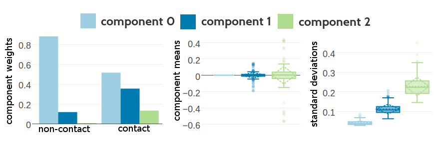

# A Bayesian Statistical Model for Residue-Residue Contact Prediction {#bayesian-approach}

All methods so far predict contacts by finding the one solution of parameters $\via$ and $\wijab$ that maximizes a regularized version of the log likelihood of the [MSA](#abbrev) and in a second step transforming the [MAP](#abbrev) estimates of the couplings $\w^*$ into heuristic contact scores (see Introduction \@ref(pseudo-likelihood)). 
Apart from the heuristic transformation that omits meaningful information comprised in the coupling matrices $\wij$ as discussed in section \@ref(interpreting-coupling-matrices), using the [MAP](#abbrev) estimate of the parameters instead of the true distribution has the decisive disadvantage of concealing the uncertainty of the estimates.

The next sections present the derivation of a principled Bayesian statistical approach for contact prediction eradicating these deficiencies. 
The model provides estimates of the posterior probability distributions of contact states $\cij$ for all residues pairs $i$ and $j$, given the [MSA](#abbrev) $\X$.
A true contact (contact state $\cij\eq1$) is defined as two residues whose $\Cb$-$\Cb$ distance $\le 8 \angstrom$, whereas a residue pair with $\Cb$-$\Cb$ distance $>8 \angstrom$ is considered not to be in physical contact (contact state $\cij\eq0$). 
<!--
The model provides estimates of the probability distributions of the distances $\rij$ between $\Cb$ atoms of all residues pairs $i$ and $j$, given the [MSA](#abbrev) $\X$. 
-->
The parameters $(\v, \w)$ of the [MRF](#abbrev) model describing the probability distribution of the sequences in the [MSA](#abbrev) are treated as hidden parameters that can be integrated out using an approximation to the posterior distribution of couplings $\w$.
This approach also allows to explictely model the dependence of coupling coeffcients $\wij$ on contacts/non-contacts as a mixture of Gaussians with
contact state dependent mixture weights and thus can even learn correlations between couplings.
Furthermore, it provides probability estimates for the predicted contacts that could simplify the selection of constraints for *de novo* structure prediction by establishing suitable probability cutoffs.

<!--
## Computing the Posterior Distribution of Distances $p(\r | \X)$ {#overview-posterior-distances}
-->
## Computing the Posterior Probabiilty of a Contact {#overview-posterior-distances}

The joint probability of contact states $\c$ and [MRF](#abbrev) model parameters $(\v, \w)$ given the [MSA](#abbrev) $\X$ and a set of sequence derived features $\phi$ (such as listed in method section \@ref(seq-features)), can be written as a hierarchical Bayesian model of the form:

\begin{align}
        p(\c, \v, \w | \X, \phi) &\propto p(\X | \v, \w) p(\v, \w | \c) \, p(\c | \phi ) \, .
(\#eq:hierarchical-bayesian-model)
\end{align}

The ultimate goal is to compute the posterior probability of the contact states, $p(\c | \X, \phi)$, that can be obtained by treating the parameters $(\v, \w)$ as hidden variables and marginalizing over these parameters,

\begin{align}
    p(\c | \X , \phi) &\propto  p(\X | \c) p(\c | \phi)\\
    p(\X | \c) &= \int \int p(\X | \v,\w) \, p(\v, \w | \c) \,d\v\,d\w  \; .
(\#eq:integrate-out-vw)
\end{align}

The single potentials $\v$ will be fixed at their best estimate $\v^*$ (see method section \@ref(prior-v)) by using a very tight prior $p(\v) = \Gauss(\v|\v^*,\lambda_v^{-1} \I) \rightarrow \delta(\v-\v*)$ for $\lambda_v \rightarrow \infty$ that acts as a delta function. 
This allows the replacement of the intergral over $\v$ with the value of the integrand at its mode $\v^*$. 

Computing the integral over $\w$ can be achieved by factorizing the integrand into factors over $(i,j)$ and performing each integration over the coupling coefficients $\wij$ for $(i,j)$ separately. 

For that account, the prior over $\w$ will be modelled as a product over independent contributions over $\wij$ with $\wij$ depending only on the contact state $\cij$, which is described in detail in the next section \@ref(coupling-prior).
The prior over the *Potts* model parameters then yields,

\begin{equation}
  p(\v,\w|\c) = \Gauss(\v|\v^*,\lambda_v^{-1} \I) \, \prod_{1\le i<j\le L} p(\wij|\cij) \; .
(\#eq:definition-parameter-prior)
\end{equation}

Furthermore, method section \@ref(laplace-approx) proposes an approximation to the regularised likelihood, $p(\X | \v,\w) \, p(\v, \w)$, with a Gaussian distribution that facilitates the analytical solution of the integral in eq. \@ref(eq:integrate-out-vw).
The detailed derivation of the solution to the integral is covered in method section \@ref(likelihood-fct-distances).

Finally, the marginals $p(\cij | \X, \phi) = \int  p(\c | \X, \phi) d \c_{\backslash ij}$, where $\c_{\backslash ij}$ is the vector containing all coordinates of $\c$ except $\cij$ can be computed to obtain the posterior probability distribution of the contact states (see method section \@ref(posterior-of-rij)). 


## Modelling the Prior Over Couplings Depending on Contact States {#coupling-prior}

The prior over couplings $p(\wij|\cij)$ will be modelled as a mixture of $K\!+\!1$ 400-dimensional Gaussians, with means $\muk \in \mathbb{R}^{400}$, precision matrices $\Lk \in \mathbb{R}^{400\times 400}$, and  normalised weights $g_k(\cij)$ that depend on the contact state $\cij$, 

\begin{align}	
	  p(\wij | \cij) = \sum_{k=0}^K g_k(\cij) \, \Gauss(\wij | \muk, \Lk^{-1}) \,.
(\#eq:definition-mixture-coupling-prior)
\end{align}

The assumption that the contact-state dependent coupling prior can be modelled as a multivariate Gaussian is justified by the analysis of single and 2-dimensional coupling distributions presented in section \@ref(coupling-profiles) and in section \@ref(higher-order-coupling-profiles).
The couplings $\wijab$ for the analysis presented in those sections have been filtered, such that there is sufficient evidence for $a$ and $b$ in the alignment (see method section \@ref(method-coupling-correlation) for details). 
Therefore, the presented distributions should resemble the posterior distribution of couplings, $p(\w | \X , \v^*) \propto  \Gauss (\w | \w^*, \H^{-1})$, in the case that the diagonal elements $(\H)_{ijab, ijab}$ have non-negligible values.
The analysis showed that the univariate distributions of single couplings $\wijab$ are characteristic for the physico-chemical properties of the corresponding amino acid pairing $(a,b)$ and vary with inter-residue distance.
More than that, the 2-dimensional distributions suggest that there are higher order dependencies between the 400 couplings $\wijab$ that reflect amino acid specific pereferences of the interaction between the corresponding residues $i$ and $j$.
By explicitely modelling the prior over couplings, $p(\wij|\cij)$, as a 400-dimensional Gaussian mixture, is is possible to capture these characteristic interdependencies between the couplings.

The $K$ 400-dimensional Gaussian mixture components are defined by means $\muk \in \mathbb{R}^{400}$, precision matrices $\Lk \in \mathbb{R}^{400\times 400}$, and normalised weights $g_k(\cij)$ that depend on the contact state $\cij \! \in \! \{0,1\}$.
The zeroth component is expected to capture the majority of coupling parameters without a strong covariation signal, $\wijab \! \approx \! 0$. 
Generally, the couplings are expected to vanish for non-contacts ($\cij \eq 0$) but couplings will also be close to zero for contacts ($\cij \eq 1$) when there is no covariation between residues $i$ and $j$ or when there is no evidence in the alignment originating from amino acid pairings $a$ and $b$.
Therefore, $\mu_{0} \eq 0$  will be kept fixed.
Furthermore, the precision matrices $\Lk$ will be modelled as diagonal matrices, thereby drastically reducing the computational complexity of the optimization problem.
In order to ensure that interdependencies between couplings can be modelled with diagonal precision matrices, the number of components $K$ is a crucial parameter.


## Training the Hyperparameters in the Likelihood Function of Contact States  {#bayesian-model-training-hyperparameters}

Solving the integral in eq. \@ref(eq:integrate-out-vw) as described in in detail in method section \@ref(likelihood-fct-distances), yields the likelihood function of contact states, $p(\X | \c)$.
It contains the hyperparameters of the prior over couplings, $p(\wij|\cij)$, which is modelled as a mixture of $K$ 400-dimensional Gaussians with component weights that depend on the contact state.


The hyperparameters are trained by minimizing the negative logarithm of the likelihood over a set of training [MSAs](#abbrev) as described in detail in method section \@ref(training-hyperparameters-bayesian-model).
The [MAP](#abbrev) estimates of the coupling parameters $\wij^*$ are needed to compute the Hessian of the regularized *Potts* model likelihood, which again is needed for the Gaussian approximation to the regularized likelihood (see method section \@ref(laplace-approx)).
For that purpose, I trained the hyperparameters by utilizing couplings $\wij^*$ obtained from pseudo-likelihood maximization as well as couplings $\wij^*$ obtained by maximizing the full likelihood with contrastive divergence ([CD](#abbrev)).

In the following I present the results of learning the hyperparameters for the coupling prior modelled as a Gaussian mixture with $K \in \{3,5,10\}$ Gaussian components with diagonal precision matrices $\Lk$ and a zero-component that is fixed at $\mu_0=0$ on datasets of different sizes (see method section \@ref(dataset-training-bayesian-model) for details).

## Training Hyperparameters for a Gaussian Mixture with Three Components

Optimization using pseudo-likelihood and contrastive divergence couplings converged after several hundreds of iterations of training on the dataset with 10,000, 100,000 and 300,000 residue pairs per contact class.
The inferred hyperparameters obtained by several independent optimization runs and on the datasets of different size are consistent.
The following analysis is conducted for the training on the dataset with 300,000 residue pairs per contact class and using pseudo-likelihood couplings for estimation of the Hessian. 

Figure \@ref(fig:stats-pll-3comp-300k) shows the statistics of the inferred hyperparameters. 
The zeroth component, with $\mu_0=0$ has a weight of 0.88 for the non-contact class, whereas it has only weight 0.51 for the contact class.
This is expected given that the couplings $\wijab$ for non-contacts have a much tighter distribution around zero than contacts. 
Component 2 has on average the highest standard deviations and for several dimensions this component is located far off from zero, e.g. dimension EE has $\mu_2(\text{EE}) \eq -0.57$ or ER has $\mu_2(\text{ER}) \eq 0.43$. 
Therefore, it is not surprising that component 2 has a low weight for non-contacts ($g_2(0) \eq 0.0026$) but a higher weight for contacts ($g_2(1) \eq 0.13$). 
Statistics of the hyperparameters of the Gaussian mixture obtained after learning for several hundred of iterations on the other datasets is shown in Appendix Figures \@ref(fig:stats-pll-3comp-10k) and \@ref(fig:stats-pll-3comp-100k).
The inferred hyperparameters for the Gaussian mixture model based on couplings optimized with contrastive divergence are consistent with the estimates obtained by using pseudo-likelihood couplings as can be seen in Appendix Figures \@ref(fig:stats-cd-3comp-100k) ans \@ref(fig:stats-cd-3comp-10k).

(ref:caption-stats-pll-3comp-300k) Statistics for the hyperparameters, $\gamma_k(\cij)$, $\muk$ and $\Lk$ obtained after 331 iterations. Trained on 300,000 residue pairs per contact class for a three component Gaussian mixture and using *pseudo-likelihood* couplings to estimate the Hessian.  **Left** Component weights $\gamma_k(\cij)$ for residue pairs not in physical contact ($\cij \eq 0$) and true contacts ($\cij \eq 1$). **Center** Distribution of the 400 elements in the mean vectors $\muk$. **Right** Distribution of the 400 standard deviations corresponding to the square root of the diagonal of $\Lk^{-1}$.

```{r stats-pll-3comp-300k, echo = FALSE, out.width = '100%', fig.cap = '(ref:caption-stats-pll-3comp-300k)'}

```


Figure \@ref(fig:vis1d-pll-3comp-300k) shows several one-dimensional projections of the 400 dimensionl Gaussian mixture with three components.
Generally, the Gaussian mixture learned for residue pairs that are not in contact is much narrower and almost symmetrically centered around zero.
The Gaussian mixture for contacts, by contrast is much broader and often skewed.
For the aliphatic amino acid pair V-I, the Gaussian mixture for both contacts and non-contacts is very symmetrical and much narrower compared for example to the Gaussian mixtures for the aromatic amino acid pair F-W, which also has symmetrical distributions.
In contrast, the distribution for ER and EE has strong tails for positive and negative values respectively.
The one-dimensional projections of the Gaussian mixture model greaty resembles the empirical distributions in Figure \@ref(fig:1d-coupling-profile-0-5) and in Figure \@ref(fig:1d-coupling-profile-20-50).
The model learned on larger datasets produces very similar distributions (see Appendix Figures \@ref(fig:vis1d-pll-3comp-100k) and \@ref(fig:vis1d-pll-3comp-500k)).
Likewise, the distributions for the model based on contrastive divergence couplings are also very similar and shown in Appendix Figure \@ref(fig:vis1d-cd-3comp-100k).

(ref:caption-vis1d-pll-3comp-300k) Visualisation of one-dimensional projections of the three-component Gaussian mixture model for the contact-dependent coupling prior. Hyperparameters, $\gamma_k(\cij)$, $\muk$ and $\Lk$, have been trained on 300,000 residue pairs per contact class and using *pseudo-likelihood* couplings to estimate the Hessian. Green solid line: Gaussian mixture for contacts. Blue solid line: Gaussian mixture for non-contacts. Black solid line: regularization prior with $\lambda_1 \eq 0.2L$ with L being protein length and assumed $L\eq150$. Light blue dashed line: Gaussian component 0. Dark blue dashed line: Gaussian component 1. Light Green dashed line: Gaussian component 2. **Top Left** One dimensional projection for pair (V,I). **Top Right** One dimensional projection for pair (F,W).  **Bottom Left** One dimensional projection for pair (E,R). **Bottom Right** One dimensional projection for pair (E,E).  

```{r vis1d-pll-3comp-300k, echo = FALSE, out.width = '100%', fig.cap = '(ref:caption-vis1d-pll-3comp-300k)'}
knitr::include_graphics("img/bayesian_model/pll/3/1dvis_combined_300k")
```


The two-dimensional projections of the Gaussian mixture are shown in Figure \@ref(fig:vis2d-pll-3comp-300k) for several pairs of couplings.
The type of paired couplings has been chosen to allow a direct comparison to the empirical distributions in Figure \@ref(fig:2d-coupling-profiles-0-8).
The top left plot shows the distribution of coupling values according to the Gaussian mixture model for contacts for amino acid pairs E-R and R-E. 
Component 2 has a weight of 0.13 for contacts and is mainly responsible for the positive coupling between E-R and R-E.
The amino acid pairs E-E and R-E are negatively coupled and again component 2 generates the strongest couplings far off zero as can be seen in the top right plot.
The plots at the bottom of Figure \@ref(fig:vis2d-pll-3comp-300k) show the distribution of amino acid pairs I-L and V-I according to the Gaussian mixture model for contacts (component weight $g_k(1)$) as well as for non-contacts (component weight $g_k(0)$). 
The coupling distribution for contacts is symmetrically centered around zero just as the distribution for non-contacts. 
Because of the higher weight of component 2, the distribution for contacts is much broader than the distribution for non-contacts. 
The two-dimensional distributions obtained from the set of Gaussian mixture hyperparameters that have been learned based on contrastive divergence couplings, are very similar and shown in Appendix Figure \@ref(fig:vis2d-cd-3comp-100k)

(ref:caption-vis2d-pll-3comp-300k) Visualisation of two-dimensional projections of the three-component Gaussian mixture model for the contact-dependent coupling prior. Hyperparameters, $\gamma_k(\cij)$, $\muk$ and $\Lk$, have been trained on 300,000 residue pairs per contact class. 10,000 values have been samples from the Gaussian mixture model. Light blue: values that have been generated by zero component. Dark blue: values that have been generated by Gaussian component 1. Light green: values that have been generated by Gaussian component 3. **Top Left** Two-dimensional projection for pairs (E,R) and (R-E) for contacts (using component weight $g_k(1)$). **Top Right** Two- dimensional projection for pairs (E,E) and (R,E) for contacts (using component weight $g_k(1)$).  **Bottom Left** Two-dimensional projection for pairs (I,L) and (V,I) for contacts (using component weight $g_k(1)$). **Bottom Right** Two-dimensional projection for pair (I,L) and (V,I) for non-contacts (using component weight $g_k(0)$).  

```{r vis2d-pll-3comp-300k, echo = FALSE, out.width = '100%', fig.cap = '(ref:caption-vis2d-pll-3comp-300k)'}

```


## Training Hyperparameters for a Gaussian Mixture with Five and Ten Components

The increased complexity of training five or even ten instead of three component Gaussian mixtures does not only result in longer runtimes until convergence but also slows down runtime per iteration. 
The optimization runs for five and ten component Gaussian mixtures did not converge within 2000 iterations. 
Nevertheless, the obtained hyperparameters and resulting Gaussian mixture are consistent.


Figure \@ref(fig:stats-pll-5comp-300k) and  \@ref(fig:stats-pll-10comp-300k) show the statistics of the inferred hyperparameters for a five and ten component Gaussian mixture respectively. 
Similary to three component Gaussian mixtures, the zeroth component receives a high weight for couplings from residue pairs that are not in physical contact ($g_0(0) \eq 0.93$ for five component mixture and $g_0(0) \eq 0.87$ for ten component mixture).
There is a second component with a noteworthy contribution to the Gaussian mixture for non-contact couplings (component 3 with $g_1(0) \eq 0.07$ for five component mixture and component 9 with $g_1(0) \eq 0.13$ for ten component mixture).
These two components are also the strongest components for the Gaussian mixture representing couplings from contacting residue pairs.
Furthermore, hyperparameters inferred using contrastive divergence couplings are again similar to those based on pseudo-likelihood couplings and statistics of hyperparameter are visualized in Appendix Figures \@ref(fig:stats-cd-5comp-100k) and \@ref(fig:stats-cd-5comp-300k).

(ref:caption-stats-pll-5comp-300k) Statistics for the hyperparameters, $\gamma_k(\cij)$, $\muk$ and $\Lk$ obtained after 1134 iterations for a five component Guassian mixture. Trained on 300,000 residue pairs per contact class for a five component Gaussian mixture and using *pseudo-likelihood* couplings to estimate the Hessian. **Left** Component weights $\gamma_k(\cij)$ for residue pairs not in physical contact ($\cij \eq 0$) and true contacts ($\cij \eq 1$). **Center** Distribution of the 400 elements in the mean vectors $\muk$. **Right** Distribution of the 400 standard deviations corresponding to the square root of the diagonal of $\Lk^{-1}$.

```{r stats-pll-5comp-300k, echo = FALSE, out.width = '100%', fig.cap = '(ref:caption-stats-pll-5comp-300k)'}

```

(ref:caption-stats-pll-10comp-300k) Statistics for the hyperparameters, $\gamma_k(\cij)$, $\muk$ and $\Lk$ obtained after 700 iterations for a ten component Gaussian mixture. Trained on 300,000 residue pairs per contact class for a five component Gaussian mixture and using *pseudo-likelihood* couplings to estimate the Hessian. **Top** Component weights $\gamma_k(\cij)$ for residue pairs not in physical contact ($\cij \eq 0$) and true contacts ($\cij \eq 1$). **Middle** Distribution of the 400 elements in the mean vectors $\muk$. **Bottom** Distribution of the 400 standard deviations corresponding to the square root of the diagonal of $\Lk^{-1}$.

```{r stats-pll-10comp-300k, echo = FALSE, out.width = '90%', fig.show='hold', fig.cap = '(ref:caption-stats-pll-10comp-300k)'}
knitr::include_graphics(c("img/bayesian_model/pll/10/300k_weights_noncontacththr25.png", "img/bayesian_model/pll/10/300k_mus_noncontactthr25.png", "img/bayesian_model/pll/10/300k_std_noncontactthr25.png"))
```


Figure \@ref(fig:vis1d-pll-5-10-comp-300k) compares the one-dimensional projections of the 400 dimensionl Gaussian mixtures with five and ten components for the amino acid pair V-I and E-R.
The general observations regarding the shape of the Gaussian mixture for couplings from contacts and non-contacts that have been found for the three component mixture also apply here.
Generally, the Gaussian mixture for couplings from non-contacts is narrower in the five and ten component mixtures than in the three component Gaussian mixture model. 
Thereby, the differentiation between contacts and non-contacts is enhanced because the ratio between the Gaussian mixture probability distribution for contacts and non-contacts increases.
Furthermore, whereas in the three component model only two components would contribute to defining the tails of the distribution for couplings from contacts, now there are more components that can refine the tails.
For example, in the case of amino acid pair E-R all but the zeroth component, which is fixed at zero, are shifted towards positive values.
In the case of amino acid pair V-I the components are shifted towards both positive and negative values. 
Overall, the Gaussian mixtures with five and ten components seem to refine the modelling of the coupling distributions compared to the simpler three component model.
The same observations apply to the Gaussian mixtures inferred based on contrastive divergence couplings only that the resultant mixtures are narrower (see Appendix Figure \@ref(fig:vis1d-cd-5comp-300k)).


(ref:caption-vis1d-pll-5-10-comp-300k) Visualisation of one-dimensional projections of the five and ten component Gaussian mixture model for the contact-dependent coupling prior. Hyperparameters, $\gamma_k(\cij)$, $\muk$ and $\Lk$, have been trained on 300,000 residue pairs per contact class and using *pseudo-likelihood* couplings to estimate the Hessian. Green solid line: Gaussian mixture for contacts. Blue solid line: Gaussian mixture for non-contacts. Black solid line: regularization prior with $\lambda_1 \eq 0.2L$ with L being protein length and assumed $L\eq150$. Dashed lines represent the unweighted Gaussian mixture components.
**Top Left** One dimensional projection for pair (V,I) from the five component model. **Top Right** One dimensional projection for pair (V,I) from the ten component model.  **Bottom Left** One dimensional projection for pair (E,R) from the five component model. **Bottom Right** One dimensional projection for pair (E,R) from the ten component model.  

```{r vis1d-pll-5-10-comp-300k, echo = FALSE, out.width = '100%', fig.cap = '(ref:caption-vis1d-pll-5-10-comp-300k)'}

```


Two-dimensional projections of the Gaussian mixture with five and ten components are shown in Figure \@ref(fig:vis2d-pll-5-10-comp-300k) for different pairs of couplings.
The distributions resemble the ones learned for the Gaussian mixture with three components.
However, it is visible that the zeroth component is narrower for the five and ten component Gaussian mixture and that the additional components model particular parts of the distribution.
The optimized coupling prior model that has been learned based on couplings computed with contrastive-divergence in general produces distributions that are narrower which is expected given the hyperparameter statistics and the observations from the univariate distributions.


(ref:caption-vis2d-pll-5-10-comp-300k) Visualisation of two-dimensional projections of the five and ten component Gaussian mixture model for the contact-dependent coupling prior. Hyperparameters, $\gamma_k(\cij)$, $\muk$ and $\Lk$, have been trained on 300,000 residue pairs per contact class. 10,000 values have been samples from the Gaussian mixture model. The color of a sampled coupling pair represents the Gaussian mixture component that has generated this sample point. Color code is specified in the legend. **Top Left** Two-dimensional projection for pairs (E,R) and (R-E) for contacts (using component weight $g_k(1)$) from the five component Gaussian mixture model. **Top Right** Two-dimensional projection for pairs (E,R) and (R-E) for contacts (using component weight $g_k(1)$) from the ten component Gaussian mixture model.  **Bottom Left** Two-dimensional projection for pair (I,L) and (V,I) for non-contacts (using component weight $g_k(0)$) from the five component Gaussian mixture model.  **Bottom Right** Two-dimensional projection for pair (I,L) and (V,I) for non-contacts (using component weight $g_k(0)$) from the ten component Gaussian mixture model.  

```{r vis2d-pll-5-10-comp-300k, echo = FALSE, out.width = '100%', fig.cap = '(ref:caption-vis2d-pll-5-10-comp-300k)'}

```

In conclusion it can be found that the learned Gaussian mixtures for the contact-dependent couplig prior seem to reproduce the empirical distribution of couplings in Figure \@ref(fig:2d-coupling-profiles-0-8)  very well. 
Of course it must be noted that the empirical distributions do not take the uncertainty of the inferred couplings into account.
They are computed for high evidence couplings as explained in method section \@ref(method-coupling-profile) and therefore do not provide a completely correct reference.
The more components define the Gaussian mixture, the longer it takes to train the model per iteration and the more iterations it takes to reach convergence. 
Eventhough, training the five and ten component Gaussian mixtures could not be continued until convergence because of time requirements, the resulting models seem robust and consistently produce similar distributions regardless of the dataset size and repeated independent runs.


## Computing The Posterior Probability of Contacts {#posterior-of-rij}

The posterior distribution for $c_{ij}$ can be computed by marginalizing over all other contact states, which are summarized in the vector $\c_{\backslash ij}$: 

\begin{eqnarray}
    p(\cij | \X, \phi) &=& \int d \c_{\backslash ij} \, p(\c |\X, \mathbf{\phi}) \nonumber\\
                &\propto & \int d \c_{\backslash ij} \, p(\X|\c) \, p(\c | \phi) \nonumber\\
                &\propto & \int d \c_{\backslash ij} \prod_{i'<j'} \sum_{k=0}^K g_{k}(c_{i'j'}) \, \frac{\Gauss( \mathbf{0} | \muk, \Lk^{-1})}{\Gauss(\mathbf{0} | \muijk, \Lijk^{-1})}
 \, \prod_{i'<j'} p(c_{i'j'} |\phi_{i'j'})  \,,
 \end{eqnarray}
 
where $p(\c | \phi)$ represents a prior on contacts that is implemented by the random forest classifier trained on sequence derived features, $\phi$, as described in chapter \@ref(contact-prior).
By pulling out of the integral over $\c_{\backslash ij}$ the term depending only on $\cij$ one obtains the posterior distribution for $c_{ij}$ , 
 
 \begin{eqnarray}
    p(\cij | \X, \phi) & \propto & 
            p(\cij |\phi_{ij}) \, \sum_{k=0}^K g_{k}(\cij) \, \frac{\Gauss( \mathbf{0} | \muk, \Lk^{-1})}{\Gauss(\mathbf{0} | \muijk, \Lijk^{-1})} \nonumber\\
            & \times  & \prod_{i'<j', (i',j') \ne (i,j)} \int d c_{i'j'} \, p(c_{i'j'} |\phi_{i'j'}) \, \sum_{k=0}^K g_{k}(c_{i'j'}) \, \frac{\Gauss( \mathbf{0} | \muk, \Lk^{-1})}{\Gauss(\mathbf{0} | \muijk, \Lijk^{-1})} \; .
\end{eqnarray}

Since the second factor involving the integrals over $c_{i'j'}$ is a constant with respect to $\cij$, it can be written,

\begin{equation}
    p(\cij | \X, \phi) \propto  p(\cij |\phi_{ij}) \,  \sum_{k=0}^K g_{k}(\cij) \, \frac{\Gauss( \mathbf{0} | \muk, \Lk^{-1})}{\Gauss(\mathbf{0} | \muijk, \Lijk^{-1})}  \, .
(\#eq:posterior-marginal-rij)
\end{equation}

### Evaluation of the Bayesian models for contact-prediction

In the following I am going to assess the performance of the Bayesian models with respect to the top ranked contact predictions based on the pseudo-likelihood couplings. 
The ranking of predictions now follows the posterior probability estimates for contacts.

Figure \@ref(fig:precision-bayesian-model-pll-3comp) shows a benchmark for the Bayesian models using a three component Gaussian mixture model for the coupling prior and with hyperparameters trained on different dataset sizes (100,000, 300,000 and 500,000 residue pairs per contact class). 
The analysis of the Gaussian mixture models in the last sections has revealed that the statistics and resultant distributions are coherent regardless of dataset size. 
And indeed, the precision over top ranked predictions is almost indistinguishable for the models learned on different dataset sizes.
The Gaussian mixture model with three components has 2004 parameters (see methods section \@ref(model-specifications-training-bayesian-model)) and therefore it is a reasonable assumption that a dataset of 2x 100,000 residue pairs provides sufficient signal despite the unknown uncertainty of the couplings to be modelled.

Because the posterior of contacts is computed from the likelihood function of contacts and a contact prior in form of the random forest classifier (see chapter \@ref(contact-prior)), it is not fair to compare them directly to the pseudo-likelihood predictions. 
Instead, the predictions from the Bayesian model can be compared to the Random Forest model that has additionally been trained on the pseudo-likelihood derived contact scores.
As can be seen in Figure \@ref(fig:precision-bayesian-model-pll-3comp), the Bayesian model predicts contacts more accurately than the heuristic contact score obtained from pseudo-likelihood couplings, but less accurately than the random forest model trained on the pseudo-likelihood contact scores.

(ref:caption-precision-bayesian-model-pll-3comp) Mean precision for top ranked contact predictions over 500 proteins. "Bayesian Posterior" computing the posterior probability of contacts with the Bayesian framwork employing a three component Gaussian mixture coupling prior. Hyperparameters for the coupling prior have been trained on different dataset sizes as specified in the legend. **random forest (pLL)** random forest model trained on sequence features and and additional pseudo-likelihood contact score feature. **Bayesian Posterior 100k**:  Trained on 100,000 residue pairs per contact class. **Bayesian Posterior 300k**: Trained on 300,000 residue pairs per contact class. **Bayesian Posterior 500k**: Trained on 500,000 residue pairs per contact class. **pseudo-likelihood**: contact score is computed as [APC](#abbrev) corrected Frobenius norm of the couplings computed from pseudo-likelihood. 

```{r precision-bayesian-model-pll-3comp, echo = FALSE, screenshot.alt="img/bayesian_model/benchmark/precision_vs_rank_pll_3comp_all_datasets.png", out.width = '90%', fig.align='center', fig.cap = '(ref:caption-precision-bayesian-model-pll-3comp)'}
knitr::include_url("img/bayesian_model/benchmark/precision_vs_rank_pll_3comp_all_datasets.html", height = "500px")
```

The likelihood function of contacts has been optimized using an equal number of residue pairs that are in physical contact and that are not in physical contact. 
The residue pairs that are not in physical contact have been defined on basis of a $>25 \angstrom \Cb$ distance threshold.
Choosing a different non-contact threshold, $\Cb$ distance $>8 \angstrom$,  has a negligible impact on performance with the $25 \angstrom$ cutoff giving slightly better results (see Appendix Figure \@ref(fig:precision-bayesian-model-pll-3comp-ncthr)).
Furthermore, I checked whether a different ratio of contacts and non-contacts has an impact on performance. 
Appendix Figure \@ref(fig:precision-bayesian-model-pll-3comp-ncthr) also shows that choosing five times as many non-contacts as contacts gives slightly worse precision and has the disadvantage of longer runtimes.


Figure \@ref(fig:precision-bayesian-model-pll-100k) shows the performance of the Bayesian models with Gaussian mixtures having different number of Gaussain components and trained on 100,000 residue pairs per contact class.
The Bayesian model with a Gaussian mixture having five components shows minor improvements over the model with a three-component Gaussian mixture.
Surprisingly, the Bayesian models with the ten component Gaussian mixture performs slightly worse than the other two models.
This is unexpected, because the analysis in the last section indicated that both the five and the ten component Gaussian mixture models are able to precisely model the empirical coupling distributions.


(ref:caption-precision-bayesian-model-pll-100k) Mean precision for top ranked contact predictions over 500 proteins.  **random forest (pLL)** random forest model trained on sequence features and and additional pseudo-likelihood contact score feature. **Bayesian Posterior 3**: Bayesian model computing the posterior probability of contacts with a three component Gaussian mixture coupling prior. Hyperparameters for the coupling prior have been trained on 100,000 residue pairs per contact class. **Bayesian Posterior 5**: Bayesian model computing the posterior probability of contacts with a five component Gaussian mixture coupling prior. Hyperparameters for the coupling prior have been trained on 100,000 residue pairs per contact class. **Bayesian Posterior 10**: Bayesian model computing the posterior probability of contacts with a ten component Gaussian mixture coupling prior. Hyperparameters for the coupling prior have been trained on 100,000 residue pairs per contact class.  **pseudo-likelihood**: contact score is computed as [APC](#abbrev) corrected Frobenius norm of the couplings computed from pseudo-likelihood.

```{r precision-bayesian-model-pll-100k, echo = FALSE, screenshot.alt="img/bayesian_model/benchmark/precision_vs_rank_pll_100k_allcomponents.png", out.width = '90%', fig.align='center', fig.cap = '(ref:caption-precision-bayesian-model-pll-100k)'}
knitr::include_url("img/bayesian_model/benchmark/precision_vs_rank_pll_100k_allcomponents.html", height = "500px")
```


The trends described for the Bayesian models based on pseudo-likelihood couplings also apply for the Bayesian models based on contrastive divergence couplings.
The Bayesian models perform very similar regardless whether trained on 100000, 300000 or 500000 residue pairs per contact class (see Appendix Figure \@ref(fig:precision-bayesian-model-cd-3comp)) and the non-contact threshold has no substantial impact on precision.
Furthermore, modelling the coupling prior as Gaussian mixtures with 3,5 or ten components does not seem to make a difference(see Appendix Figure \@ref(fig:precision-bayesian-model-cd-100k)). 
Rather surprising is the finding the Bayesian models based on contrastive divergence couplings perform worse than the Bayesian models based on pseudo-likelihood couplings (see Figure \@ref(fig:precision-bayesian-model-pll-vs-cd-3comp-300k)).
The reason being that the approximation of the regularized likelihood of sequences (see method section \@ref(laplace-approx)) employs the Hessian of the full likelihood and not of the pseudo-likelihood. 
Therefore it can be assumed that the approximation is more accurate when using the couplings that have been obtained by maximizing the full likelihood with contrastive divergence.
However, the Bayesian model rooted in couplings compute with contrastive divergence performs even worse than heuristic pseudo-likelihood score. 

(ref:caption-precision-bayesian-model-pll-vs-cd-3comp-300k) Mean precision for top ranked contact predictions over 500 proteins. **random forest (pLL)** random forest model trained on sequence features and and additional pseudo-likelihood contact score feature. **Bayesian Posterior pLL**: Bayesian model computing the posterior probability of contacts with a three component Gaussian mixture coupling prior based on *pseudo-likelihood* couplings. Hyperparameters for the coupling prior have been trained on 300,000 residue pairs per contact class. **Bayesian Posterior CD**: Bayesian model computing the posterior probability of contacts with a three component Gaussian mixture coupling prior based on *contrastive divergence* couplings. Hyperparameters for the coupling prior have been trained on 300,000 residue pairs per contact class. **pseudo-likelihood**: contact score is computed as [APC](#abbrev) corrected Frobenius norm of the couplings computed from pseudo-likelihood.

```{r precision-bayesian-model-pll-vs-cd-3comp-300k, echo = FALSE, screenshot.alt="img/bayesian_model/benchmark/precision_vs_rank_pll_vs_cd_3comp_300k.png", out.width = '90%', fig.align='center', fig.cap = '(ref:caption-precision-bayesian-model-pll-vs-cd-3comp-300k)'}
knitr::include_url("img/bayesian_model/benchmark/precision_vs_rank_pll_vs_cd_3comp_300k.html", height = "500px")
```


## Analysing Contact Maps 

In the following I will analyse contat maps predicted with the Bayesian model.
While the posterior probabilties for contacts can be used as predictions it is also worth having a look at the likelihood of contacts, given by eq. \@ref(eq:pXr-final), to dissect the effect of likelihood and prior on the posterior. 
Figure \@ref(fig:precision-bayesian-model-pll-3comp-300k-lik) shows the precision of predictions computed as the posterior probability of a contact as well as the likelihood of a contact. 
It can be found, that the likelihood has worse predictive performance than the heuristic contact score computed from pseudo-likelihood couplings. 

(ref:caption-precision-bayesian-model-pll-3comp-300k-lik) Mean precision for top ranked contact predictions over 500 proteins. **random forest (pLL)** random forest model trained on sequence features and and additional pseudo-likelihood contact score feature. **Bayesian Posterior**: Bayesian model computing the posterior probability of contacts with a three component Gaussian mixture coupling prior based on *pseudo-likelihood* couplings. Hyperparameters for the coupling prior have been trained on 300,000 residue pairs per contact class. **Bayesian Likelihood**: Normalized Likelihood of observing a contact as gicen in eq. \@ref(eq:pXr-final). Coupling prior is modelled as three component Gaussian mixture based on *pseudo-likelihood* couplings. Hyperparameters for the coupling prior have been trained on 300,000 residue pairs per contact class. **pseudo-likelihood**: contact score is computed as [APC](#abbrev) corrected Frobenius norm of the couplings computed from pseudo-likelihood.

```{r precision-bayesian-model-pll-3comp-300k-lik, echo = FALSE, screenshot.alt="img/bayesian_model/benchmark/precision_vs_rank_pll_3comp_300k_likelihood.png", out.width = '90%', fig.align='center', fig.cap = '(ref:caption-precision-bayesian-model-pll-3comp-300k-lik)'}
knitr::include_url("img/bayesian_model/benchmark/precision_vs_rank_pll_3comp_300k_likelihood.html", height = "500px")
```


## Discussion

The Bayesian models have been shown to be less precise than the random forest trained on sequence features and pseudo-likelihood couplings.
Eventhough the coupling prior modelled as a Gaussian mixture seems to reproduce the empirical distributions of high evident couplings very well, there might be possible drawbacks of the current implementation.

First of all, the Gaussian components are modelles with diagonal covariance matrices.
Much more information can be learned by using full covariance matrices whcih would also require less components.
However, using full covariance matrices would increase computational complexity because the inverse of the matrix has to be computed.

It is unlikely that using more data would improve the models.
For one thing, the neg log likelihood has been monitored on a validation set during optimization and there seems to be no overfitting. 
Further on, the hyperparameter statistics are almost identical regardless of the training set size.

There is only one assumption in the theoretical framework that might be incorrect, but unfortunately it is not easy to verify: setting the off-diagonal block matrices in the Hessian to zero (see method section \@ref(Hessian-offdiagonal)).
These off-diagonal block matrices describe the interdependency between specific couplings in different pairs of columns.
However, in our view the entries in these off-diagonal matrices should be negligible.

Another important point is that the quality of the Gaussian approximation to the posterior distribution of couplings $p(\w | \X , \v^*)$ depends on two points,

  1. how well is the posterior distribution of couplings approximated by a Gaussian 
  2. how closely does the mode of the posterior distribution of couplings lie near the mode of the integrand in equation \@ref(eq:in_over_w_1).
  
  
Finally, a proof of concept that the full information in the coupling matrices can be used to improve the precision of contact predictions was given in the work of Golkov and colleagues [@Golkov2016a].
The developed a convolutional neural network for the prediction of protein residue-residue contacts that uses only coupling matrices as input features. 
In their benchmark the convolutional network predictor improved over  Meta-PSICOV, which is a meta predictor combining several coevolution methods and sequence features. 


\newpage

## Methods

### Modelling the Prior Over Couplings Depending on Contact States {#methods-coupling-prior}

The mixture weights $g_k(\cij)$  in eq. \@ref(eq:definition-mixture-coupling-prior) are modelled as softmax: 

\begin{equation}
	g_k(\cij) = \frac{\exp \gamma_k(\cij)}{\sum_{k'=0}^K \exp \gamma_{k'}(\cij)} 
(\#eq:def-g-k-binary)
\end{equation}

The functions $g_k(\cij)$ remain invariant when adding an offset to all $\gamma_k(\cij)$. 
This degeneracy can be removed by setting $\gamma_0(\cij)=1$.

### Gaussian Approximation to the Posterior of Couplings {#laplace-approx}

From sampling experiments done by Markus Gruber we know that the regularized pseudo-log-likelihood for realistic examples of protein MSAs obeys the equipartition theorem. 
The equipartition theorem states that in a harmonic potential (where third and higher order derivatives around the energy minimum vanish) the mean potential energy per degree of freedom (i.e. per eigendirection of the Hessian of the potential) is equal to $k_B T/2$, which is of course equal to the mean kinetic energy per degree of freedom. 
Hence we have a strong indication that in realistic examples the pseudo log likelihood is well approximated by a harmonic potential. 
We assume here that this will also be true for the regularized log likelihood. 

The posterior distribution of couplings $\w$ is given by

\begin{equation}
p(\w | \X , \v^*) = p(\X | \v^*, \w) \Gauss (\w | \mathbf{0}, \lambda_w^{-1} \I)
\end{equation}

where the single potentials $\v$ are set to the target vector $\v^*$ as discussed in section \@ref(overview-posterior-distances).

The posterior distribution can be approximated with a so called "Laplace Approximation"[@Murphy2012]:
by performing a second order Taylor expansion around the mode $\w^*$ of the log posterior it can be written as

\begin{align}
    \log p(\w | \X , \v^*) \overset{!}{\approx} &  \;  \log p(\w^* | \X , \v^*) \nonumber\\
                & + \nabla_\w \log p(\w | \X , \v^*)|_{\w^*}(\w-\w^*) \nonumber\\ 
  			    & - \frac{1}{2} (\w-\w^*)^{\mathrm{T}} \H (\w-\w^*)  \; .
\end{align}

where $\H$ signifies the *negative* Hessian matrix with respect to the components of $\w$,

\begin{equation}
    (\H)_{klcd, ijab} = - \left. \frac{\partial^2  \log p(\w | \X , \v^{*})}{\partial \w_{klcd} \, \partial \wijab  } \right|_{(\w^{*})} \; .
\end{equation}

The mode $\w^*$ will be determined with the [CD](#abbrev) approach described in detail in section \@ref(optimizing-full-likelihood). 
Since the gradient vanishes at the mode maximum,  $\nabla_\w \log p(\w | \X , \v^*)|_{\w^*} = 0$, the second order approximation can be written as

\begin{equation}
    \log p(\w | \X , \v^*) {\approx}  \log p(\w^* | \X , \v^*)  - \frac{1}{2} (\w-\w^*)^{\mathrm{T}} \, \H \, (\w-\w^*)  \;.
\end{equation}

Hence, the posterior of couplings can be approximated with a Gaussian

\begin{align}
   p(\w | \X , \v^*) &\approx p(\w^* | \X , \v^*) \exp \left( - \frac{1}{2} (\w-\w^*)^{\mathrm{T}} \H  (\w -\w^*) \right) \nonumber \\
              &= p(\w^* | \X , \v^*) \frac{(2 \pi)^\frac{D}{2}} { |\H|^\frac{D}{2}} \times \Gauss (\w | \w^*, \H^{-1} ) \nonumber \\
              &\propto  \Gauss (\w | \w^*, \H^{-1}) \,,
(\#eq:reg-lik-gauss-approx)
\end{align}

with proportionality constant that depends only on the data and with a precision matrix equal to the negative Hessian matrix.
The surprisingly easy computation of the Hessian can be found in Methods section \@ref(neg-Hessian-computation). 


<!--
### Iterative improvement of Laplace approximation {#laplace-approx-improvement}

The quality of the Gaussian approximation to the posterior distribution of couplings $p(\w | \X , \v^*)$ depends on two points,

1. how well is the posterior distribution of couplings approximated by a Gaussian 
2. how closely does the mode of the  posterior distribution of couplings lie near the mode of the integrand in equation \@ref(eq:). 

The second point can be addressed quite effectively in the following way. 

(see Murphy page 658 eq. 18.137 and eq 18.138)


Supppose the optimal prior parameters $(\tilde{\muk}, \tilde{\Lk})$ have been trained as described in Methods section \@ref(training-hyperparameters), using the standard isotropic regularisation prior $\Gauss(\w_{ij} | \mathbf{0}, \lambda_w^{-1} \I)$. 
An improved regularisation prior $\Gauss( \wij | \mu(r_{ij}), \mathbf{\Sigma}(r_{ij}))$ can then be selected using the knowledge of the true, optimised prior, by matching the mean and variance of the improved regularisation with those of the true prior from the first optimisation:

\begin{align} 
	\mathbf{\mu}(r_{ij}) &= \operatorname{E}_{p( \wij | \rij, \tilde{\mathbf{\mu}}, \tilde{\Lambda})} \left[  \wij \right]  \\
	&= \int \wij \, p( \wij | \rij, \tilde{\mathbf{\mu}}, \tilde{\Lambda}) d \w  \\
	&= \int \wij \sum_{k=0}^K g_k(\rij) \, \Gauss(\wij | \tilde{\muk}, \tilde{\Lambda}_k^{-1})  d \w \\
	&= \sum_{k=0}^K g_k(\rij) \int \wij  \, \Gauss(\wij | \tilde{\muk}, \tilde{\Lambda}_k^{-1})  d \w  \\
	\mathbf{\mu}(r_{ij}) &= \sum_{k=0}^K g_k(\rij) \, \tilde{\muk}
\end{align}

and similarly,  

\begin{align}
	\mathbf{\Sigma}(r_{ij}) &= \operatorname{var}_{ p(\wij | \rij, \tilde{\mathbf{\mu}}, \tilde{\Lambda} )}  \left[ \wij \right] \\
	&= \int (\wij - \mathbf{\mu}(r_{ij})) (\wij - \mathbf{\mu}(r_{ij}))^\mathrm{T} \, p( \wij | \rij, \tilde{\mathbf{\mu}}, \tilde{\Lambda}) d \w \\
	&= \sum_{k=0}^K g_k(\rij) \int  (\wij - \mathbf{\mu}(r_{ij})) (\wij - \mathbf{\mu}(r_{ij}))^\mathrm{T} \, \Gauss(\wij | \tilde{\muk}, \tilde{\Lk}^{-1}) d \w \\
	&= \sum_{k=0}^K g_k(\rij) \int  (\wij - \mathbf{\mu}(r_{ij}) + \tilde{\muk}) (\wij - \mathbf{\mu}(r_{ij}) + \tilde{\muk})^\mathrm{T} \, \Gauss(\wij | \mathbf{0} , \tilde{\Lk}^{-1}) d \w \\
	\mathbf{\Sigma}(r_{ij}) &= \sum_{k=0}^K g_k(\rij) \left( \tilde{\Lk}^{-1} + (\mathbf{\mu}(r_{ij}) - \tilde{\muk}) (\mathbf{\mu}(r_{ij}) - \tilde{\muk})^\mathrm{T}\right) \,. 
\end{align}

We can now run a second optimisation with better regularisation prior, in which the $\tilde{\mathbf{\mu}}$ and $\tilde{\Lambda}$ are fixed and will not be optimised. Instead we optimise the marginal likelihood as a function of $\muk$ and $\Lk$. Since the new regularisation prior will be very close to the mode of the integrand in the marginal likelihood, our approximation for the second iteration has improved in comparison to the first iteration. In principle, a third iteration can be done in which our regularisation prior derived from the prior that was found by optimisation in the second iteration. However this is unlikely to further improve the predictions. 

-->


### Integrating out the Hidden Variables to Obtain the Likelihood Function of the Contact States {#likelihood-fct-distances}

In order to compute the likelihood function of the contact states, one needs to solve the integral over $(\v, \w)$,

\begin{equation}
    p(\X | \c) = \int \int p(\X | \v,\w) \, p(\v, \w | \c) \,d\v\,d\w \; .
(\#eq:likelihood-distances)
\end{equation}

Inserting the prior over parameters $p(\v, \w | \c)$ from eq. \@ref(eq:definition-parameter-prior) into the previous equation and performing the integral over $\v$, as discussed earlier in section \@ref(overview-posterior-distances), yields

\begin{eqnarray}
    p(\X | \c) &=& \int \left( \int  p(\X | \v,\w) \, \Gauss(\v|\v^*,\lambda_v^{-1} \I) \,d\v \right) \, \prod_{1\le i<j\le L} p(\wij|\cij) \, d\w  \\
    p(\X | \c) &=& \int  p(\X | \v^*,\w) \, \prod_{1\le i<j\le L} p(\wij|\cij) \, d\w  
(\#eq:in-over-w-1)
\end{eqnarray}

Next, the likelihood of sequences, $p(\X | \v^*,\w)$, will be multiplied with the regularisation prior $\Gauss(\w|\mathbf{0}, \lambda_w^{-1} \I)$ and at the same time the coupling prior, which depends on the contact states, will be divided by the regularisation prior again:

\begin{eqnarray}
	  p(\X | \c) &=& \int p(\X | \v^*,\w) \, \Gauss(\w|\mathbf{0}, \lambda_w^{-1} \I) \, \prod_{1\le i<j\le L} \frac{p(\wij|\cij)}{\Gauss(\wij|\mathbf{0}, \lambda_w^{-1} \I)} \,d\w \, .
\end{eqnarray}

Now the crucial advantage of the likelihood regularisation is borne out: the strength of the regularisation prior, $\lambda_w$, can be chosen such that the mode $\w^*$ of the regularised likelihood is near to the mode of the integrand in the last integral. 
The regularisation prior $\Gauss(\wij|\mathbf{0}, \lambda_w^{-1} \I)$ is then a simpler, approximate version of the real coupling prior $\prod_{1\le i<j\le L} p(\wij|\cij)$ that depends on the contact state. 
This allows to approximate the regularised likelihood with a Gaussian distribution (eq. \@ref(eq:reg-lik-gauss-approx)), because this approximation will be fairly accurate in the region around its mode, which is near the region around the mode of the integrand and this again is in the region that contributes most to the integral:

\begin{eqnarray}
	  p(\X | \c) &\propto& \int \Gauss (\w | \w^*, \H^{-1} ) \, \prod_{1 \le i<j \le L} \frac{p(\wij | \cij)}{\Gauss(\wij|\mathbf{0}, \lambda_w^{-1} \I)} d\w \,.
(\#eq:int-over-w)
\end{eqnarray}

The matrix $\H$ has dimensions $(L^2 \times 20^2) \times (L^2 \times 20^2)$. 
Computing it is obviously infeasible, even if there was a way to compute $p(x_i \eq a, x_j \eq b| \v^*,\w^*)$ efficiently. 
In Methods section \@ref(Hessian-offdiagonal) is shown that in practice, the off-diagonal block matrices with $(i,j) \ne (k,l)$ are negligible in comparison to the diagonal block matrices.
For the purpose of computing the integral in eq. \@ref(eq:int-over-w), it is therefore a good approximation to simply set the off-diagonal block matrices (case 3 in eq. \@ref(eq:Hw-offdiag)) to zero! 
The first term in the integrand of eq. \@ref(eq:int-over-w) now factorizes over $(i,j)$, 

\begin{equation}
  \Gauss (\w | \w^{*}, \H^{-1}) \approx \prod_{1 \le i < j \le L} \Gauss (\wij | \wij^{*}, \H_{ij}^{-1}) ,
\end{equation}

with the diagonal block matrices $(\H_{ij})_{ab,cd} := (\H)_{ijab,ijcd}$. 
Now the product over all residue indices can be moved in front of the integral and each integral can be performed over $\wij$ separately, 

\begin{eqnarray}
  p(\X | \c) &\propto& \int \prod_{1 \le i < j \le L} \Gauss (\wij | \wij^{*}, \H_{ij}^{-1}) \prod_{1 \le i<j \le L} \frac{p(\wij | \cij)}{\Gauss(\wij|\mathbf{0}, \lambda_w^{-1} \I)} d\w  \\
  p(\X | \c) &\propto& \int \prod_{1\le i<j\le L} \left(  \Gauss (\wij | \wij^*, \H_{ij}^{-1}) \, \frac{p(\wij | \cij)}{\Gauss(\wij | \mathbf{0}, \lambda_w^{-1} \I)} \right) d\w \\
  p(\X | \c) &\propto& \prod_{1\le i<j\le L}  \int \Gauss (\wij | \wij^*, \H_{ij}^{-1}) \frac{p(\wij | \cij)}{\Gauss (\wij | \mathbf{0}, \lambda_w^{-1} \I)} d \wij 
(\#eq:int-over-w-2)
\end{eqnarray}

Inserting the coupling prior defined in eq. \@ref(eq:definition-mixture-coupling-prior) yields

\begin{eqnarray}
   p(\X | \c) &\propto& \prod_{1\le i<j\le L} \int \Gauss (\wij | \wij^*, \H_{ij}^{-1}) \frac{\sum_{k=0}^K g_{k}(\cij) \Gauss(\wij | \muk, \Lk^{-1})}{\Gauss (\wij | \mathbf{0}, \lambda_w^{-1} \I)} d \wij \\
   p(\X | \c) &\propto& \prod_{1\le i<j\le L} \sum_{k=0}^K g_{k}(\cij) \int \frac{\Gauss (\wij | \wij^*, \H_{ij}^{-1})}{\Gauss (\wij | \mathbf{0}, \lambda_w^{-1} \I)} \Gauss(\wij | \muk, \Lk^{-1}) d\wij \; .
(\#eq:int-over-w-3)
\end{eqnarray}


The integral can be carried out using the following formula:
\begin{equation}
    \int d\seq \, \frac{ \Gauss( \seq | \mathbf{\mu}_1, \mathbf{\Lambda}_1^{-1}) }{\Gauss(\seq|\mathbf{0},\mathbf{\Lambda}3^{-1})} \, \Gauss(\seq|\mathbf{\mu}_2,\mathbf{\Lambda}_2^{-1}) = \\
    \frac{\Gauss(\mathbf{0}| \mathbf{\mu}_1, \mathbf{\Lambda}_{1}^{-1}) \Gauss(\mathbf{0}| \mathbf{\mu}_2, \mathbf{\Lambda}_{2}^{-1})}{\Gauss(\mathbf{0}|\mathbf{0}, \mathbf{\Lambda}_{3}^{-1}) \Gauss(\mathbf{0}| \mathbf{\mu}_{12}, \mathbf{\Lambda}_{123}^{-1})} 
\end{equation}

with 
\begin{eqnarray}
  	\mathbf{\Lambda}_{123} &:=& \mathbf{\Lambda}_1 - \mathbf{\Lambda}_3 + \mathbf{\Lambda}_2 \\
  	\mathbf{\mu}_{12}  &:=& \mathbf{\Lambda}_{123}^{-1}(\mathbf{\Lambda}_1 \mathbf{\mu}_1 + \mathbf{\Lambda}_2 \mathbf{\mu}_2).
\end{eqnarray}

We define 
\begin{align}
  	\Lijk   &:= \H_{ij} - \lambda_w \I + \Lk \\ 
  	\muijk  &:= \Lijk^{-1}(\H_{ij} \wij^* + \Lk \muk) \,.
(\#eq:def-Jkij)
\end{align}

and obtain

\begin{align}
p(\X | \c) \propto \prod_{1 \le i < j \le L}  \sum_{k=0}^K g_{k}(\cij) \frac{\Gauss( \mathbf{0} | \muk, \Lk^{-1})}{\Gauss(\mathbf{0} | \muijk, \Lijk^{-1})}  \,.
(\#eq:pXr-final)
\end{align}

$\Gauss( \mathbf{0} | \mathbf{0}, \lambda_w^{-1} \I)$ and $\Gauss( \mathbf{0} | \wij^*, \H_{ij}^{-1})$ are constants that depend only on $\X$ and $\lambda_w$ and can be omitted. 


### The Hessian off-diagonal Elements Carry a Negligible Signal {#Hessian-offdiagonal}


Assume that $\lambda_w=0$, i.e., no regularisation is applied. 
Suppose in columns $i$ and $j$ a set of sequences in the MSA contain amino acids $a$ and $b$ and the same sequences contain $c$ and $d$ in columns $k$ and $l$. 
Furthermore, assume that $(a,b)$ occur nowhere else in columns $i$ and $j$ and the same holds for $(c,d)$ in columns $k$ and $l$. 
This means that the coupling between $a$ at position $i$ and $b$ at position $j$ can be perfectly compensated by the coupling between $c$ at position $k$ and $d$ at position $l$. 
Adding $10^6$ to $w_{ijab}$ and substracting $10^6$ from $w_{klcd}$ leaves $p(\X|\v,\w)$ unchanged. 
This means that $w_{ijab}$ and $w_{klcd}$ are almost perfectly negatively correlated in $\Gauss(\w|\w^*,(\H)^{-1})$. 
Another way to see this is to evaluate $(\H)_{ijab,klcd}$ with eq. \@ref(eq:Hw-offdiag), which gives $(\H)_{klcd, ijab}=N_{ij}\,p(x_i \eq a, x_j \eq b| \v^*,\w^*) \, ( 1 - p(x_i \eq a, x_j \eq b| \v^*,\w^*)$ for this case. 
Under the assumption $\lambda_w=0$, this precision matrix element is the same as the diagonal elements $(\H)_{ijab, ijab}$ and $(\H)_{klcd, klcd}$ (see case 2 in eq. \@ref(eq:Hw-offdiag)). 

But when a realistic regularisation constant is assumed, e.g. $\lambda_w \eq 0.2 L \approx 20$, $w_{ijab}$ and $w_{klcd}$ will be pushed to near zero, because the matrix element that couples $w_{ijab}$ with $w_{klcd}$, $N_{ij}\,p(x_i \eq a, x_j \eq b| \v^*,\w^*) \, ( 1 - p(x_i \eq a, x_j \eq b| \v^*,\w^*)$ is the number of sequences that share amino acids $a$ and $b$ at position $(i,j)$ and $c$ and $d$ at position $(k,l)$, and this number is usually much smaller than $\lambda_w$. 

(ref:caption-hessian-off-diagonal) Setting the off-diagonal block matrices to zero in $\H$ corresponds to replacing the violett Gaussian distrubution by the pink one. The ratios between the overlaps of $\Gauss\!\left(\w \left| \w^*, \H^{-1} \right. \right)$ with the distributions $\Gauss(\wij | \muk, \Lk^{-1})$ for various choices of $k$ is only weakly affected by this replacement.

```{r hessian-off-diagonal, echo = FALSE, out.width = '80%', fig.align='center',  fig.cap = '(ref:caption-hessian-off-diagonal)'}
knitr::include_graphics("img/theory/hessian-off-diagonal.png")
```

It is therefore a good approximation to set the off-diagonal block matrices $(\H)_{klcd, ijab}$  (case 3 in eq. \@ref(eq:Hw-offdiag)) to zero.
This corresponds to replacing the violett distribution in Figure \@ref(fig:hessian-off-diagonal) by the pink one. 
To see why, first note that the functions $g_k(\cij)$ and the component distributions $\Gauss(\wij | \mu_k, \Lk^{-1})$ will be learned in such a way as to maximize the likelihood for predicting the correct contact state $\c^m$ from the respective alignments $\X^m$ for many [MSAs](#abbrev) of protein families $m$. 
Therefore, these model parameters will adjust to the fact that the off-diagonal blocks in $\H$ are neglected. 
Second, note that the integral over the product of  $\Gauss(\w | \w^*, \H^{-1})$ and $\prod_{i<j} p(\wij | \cij) / \Gauss(\wij| 0, \lambda_w^{-1} \I)$ in eq. \@ref(eq:int-over-w) evaluates the overlap of these two Gaussians. 
Third, the components of $p(\wij|\cij)$ will be very much concentrated within a radius of less than $1$ from the origin, because even residues with short $C_\beta$-$C_\beta$ distance will rarely have coupling coefficients above $1$. Fourth, the Gaussian components have no couplings between elements of $\wij$ and $\w_{kl}$, which is why they are axis-aligned (green in Figure \@ref(fig:hessian-off-diagonal)). 
For these reasons, the relative strengths of the overlaps with different mixture components labeled by $k$ in eq. \@ref(eq:definition-mixture-coupling-prior) should be little affected by setting the off-diagonal block matrix couplings to zero. 


### Efficiently Computing the negative Hessian of the regularized log-likelihood {#neg-Hessian-computation}

Surprisingly, the elements of the Hessian at the mode $\w^*$ are easy to compute. 
Let $i,j,k,l \in \{1,\ldots,L\}$ be columns in the [MSA](#abbrev) and let $a, b, c, d \in \{1,\ldots,20\}$ represent amino acids. 
The partial derivative $\partial / \partial \w_{klcd}$ of the second term in the gradient of the couplings in eq. \@ref(eq:gradient-LLreg-pair) is

\begin{eqnarray}
    \frac{\partial^2 \LLreg(\v^*,\w)}{\partial \wklcd \, \partial \wijab } 
    &=&  - \sum_{n=1}^{N} \, \sum_{\mathbf{y} \in \Sn} \frac{\partial \left( \frac{\exp \left( \sum_{i=1}^L v_i(y_i) + \sum_{1 \le i < j \le L}^L w_{ij}(y_i,y_j) \right) }{Z_n(\v,\w)} \right)}{\partial \wklcd}   I(y_i \eq a, y_j \eq b) \nonumber \\
    &&- \lambda_w \delta_{ijab,klcd} \,,
\end{eqnarray}


where $\delta_{ijab,klcd} = I(ijab=klcd)$ is the Kronecker delta. Applying the product rule, it is found

\begin{eqnarray}
    \frac{\partial^2 \LLreg(\v^*,\w)}{\partial \wklcd \, \partial \wijab  } 
    &=&  - \sum_{n=1}^{N} \, \sum_{\mathbf{y} \in \Sn} \frac{\exp \left(\sum_{i=1}^L v_i(y_i) + \sum_{1 \le i < j \le L}^L w_{ij}(y_i,y_j)  \right)}{Z_n(\v,\w)}  I(y_i \eq a, y_j \eq b) \nonumber \\
    && \times  \left[ \frac{\partial}{\partial \wklcd} \left( \sum_{i=1}^L v_i(y_i) + \sum_{1 \le i < j \le L}  w_{ij}(y_i,y_j)  \right) 
                  - \frac{1}{Z_n(\v,\w)} \frac{\partial  Z_n(\v,\w) }{\partial\wklcd} \right] \nonumber\\
    &&- \lambda_w \delta_{ijab,klcd} \\
    \frac{\partial^2 \LLreg(\v^*,\w)}{\partial \wklcd \, \partial \wijab  } 
    &=&  - \sum_{n=1}^{N} \, \sum_{\mathbf{y} \in \Sn} \frac{\exp \left(\sum_{i=1}^L v_i(y_i) + \sum_{1 \le i < j \le L}^L w_{ij}(y_i,y_j)  \right)}{Z_n(\v,\w)}  I(y_i \eq a, y_j \eq b) \nonumber\\
    && \times \left[ I(y_k \eq c, y_l \eq d) - \frac{\partial}{\partial \wklcd} \log Z_n(\v,\w) \right] \nonumber\\
    &&- \lambda_w \delta_{ijab,klcd} \,.
\end{eqnarray}


This expression can be simpified using

\begin{equation}
    p(\mathbf{y} | \v,\w) = \frac{\exp \left( \sum_{i=1}^L v_i(y_i) + \sum_{1 \le i < j \le L} w_{ij}(y_i,y_j) \right)}{Z_n(\v,\w)}  ,
\end{equation} 

yielding

\begin{eqnarray}
    \frac{\partial^2 \LLreg(\v^*,\w)}{\partial \wklcd \, \partial \wijab} 
    &=& -  \sum_{n=1}^{N} \, \sum_{\mathbf{y} \in \Sn} p(\mathbf{y} | \v,\w) \, I(y_i \eq a, y_j \eq b, y_k \eq c, y_l \eq d) \nonumber \\
    && + \sum_{n=1}^{N} \, \sum_{\mathbf{y} \in \mathcal{S}_n} p(\mathbf{y} | \v,\w) \, I(y_i \eq a, y_j \eq b ) \sum_{\mathbf{y} \in \Sn} p(\mathbf{y} | \v,\w)  I(y_k \eq c, y_l \eq d ) \nonumber \\
    && - \lambda_w \delta_{ijab,klcd} \,.
\end{eqnarray}

If $\X$ does not contain too many gaps, this expression can be approximated by 

\begin{eqnarray}
    \frac{\partial^2 \LLreg(\v^*,\w)}{\partial \wklcd \, \partial \wijab  } 
    &=& - N_{ijkl} \: p(x_i \eq a, x_j \eq b, x_k \eq c, x_l \eq d | \v,\w)  \nonumber \\
    && +  N_{ijkl} \: p(x_i \eq a, x_j \eq b | \v,\w) \, p(x_k \eq c, x_l \eq d | \v,\w) - \lambda_w \delta_{ijab,klcd} \,,
\end{eqnarray}

where $N_{ijkl}$ is the number of sequences that have a residue in $i$, $j$, $k$ and $l$.

Looking at three cases separately: 
  
  - case 1: $(k,l) = (i,j)$ and $(c,d) = (a,b)$
  - case 2: $(k,l) = (i,j)$ and $(c,d) \ne (a,b)$
  - case 3: $(k,l) \ne (i,j)$ and $(c,d) \ne (a,b)$,
  
the elements of $\H$, which are the negative second partial derivatives of $\LLreg(\v^*,\w)$ with respect to the components of $\w$, are

\begin{eqnarray}
  \mathrm{case~1:} (\H)_{ijab, ijab} &=& N_{ij} \, p(x_i \eq a, x_j \eq b| \v^*,\w^*) \, ( 1 - p(x_i \eq a, x_j \eq b| \v^*,\w^*) \,) \nonumber \\
                                      && +\lambda_w \\
  \mathrm{case~2:} (\H)_{ijcd, ijab} &=& -N_{ij} \, p(x_i \eq a, x_j \eq b |\v^*,\w^*) \, p(x_i \eq c, x_j \eq d |\v^*,\w^*) \\
  \mathrm{case~3:} (\H)_{klcd, ijab} &=& N_{ijkl} \, p(x_i \eq a, x_j \eq b, x_k \eq c, x_l \eq d  | \v^*,\w^*) \nonumber \\
                                      && -N_{ijkl} \, p(x_i \eq a, x_j \eq b | \v^*,\w^*)\, p(x_k \eq c, x_l \eq d | \v^*,\w^*) \,.
(\#eq:Hw-offdiag)
\end{eqnarray}

We know from eq. \@ref(eq:gradient-LLreg-pair-approx) that at the mode $\w^*$ the model probabilities match the empirical frequencies up to a small regularization term,

\begin{equation}
    p(x_i \eq a, x_j \eq b | \v^*,\w^*) = q(x_i \eq a, x_j \eq b) - \frac{\lambda_w}{N_{ij}}  \wijab^* \,,
\end{equation}

and therefore the negative Hessian elements in cases 1 and 2 can be expressed as


<!-- The first term ($N_{ij} \left(\,q(x_i\!=\!a, x_j\!=\!b)  - \frac{\lambda_w}{N_{ij}} \wijab^* \right)$) actually is accurate and only the second $(\dots)$ iss approximated according to the gap approximation in eq. \@ref(eq:gradient-LLreg-approx) 
-->

\begin{eqnarray}
   (\H)_{ijab, ijab} &=& N_{ij} \left( q(x_i \eq a, x_j \eq b)  - \frac{\lambda_w}{N_{ij}} \wijab^* \right) \left( 1 - q(x_i \eq a, x_j \eq b) +\frac{\lambda_w}{N_{ij}} \wijab^* \right) \nonumber\\
                      && +\lambda_w \\
   (\H)_{ijcd, ijab} &=& -N_{ij} \left(\,q(x_i \eq a, x_j \eq b)  - \frac{\lambda_w}{N_{ij}} \wijab^* \right) \left( q(x_i \eq c, x_j \eq d) -\frac{\lambda_w}{N_{ij}} \wijcd^* \right) .
(\#eq:Hw-diag)
\end{eqnarray}


In order to write the previous eq. \@ref(eq:Hw-diag) in matrix form, the *regularised* empirical frequencies $\qij$ will be defined as

\begin{equation}
    (\qij)_{ab} = q'_{ijab} := q(x_i \eq a, x_j \eq b) - \lambda_w  \wijab^* / N_{ij} \,,
\end{equation}

and the $400 \times 400$ diagonal matrix $\Qij$ will be defined as

\begin{equation}
    \Qij := \text{diag}(\qij) \; .
\end{equation}

Now eq. \@ref(eq:Hw-diag) can be written in matrix form

\begin{equation}
	 \H_{ij} = N_{ij} \left( \Qij -  \qij \qij^{\mathrm{T}} \right)  + \lambda_w \I \; .
(\#eq:mat-Hij)
\end{equation}


### Efficiently Computing the Inverse of Matrix $\Lijk$ {#inv-lambda-ij-k}

It is possible to efficiently invert the matrix $\Lijk = \H_{ij} - \lambda_w \I + \Lambda_k$, that is introduced in section \@ref(likelihood-fct-distances) where $\H_{ij}$ is the $400 \times 400$ diagonal block submatrix $(\H_{ij})_{ab,cd} := (\H)_{ijab,ijcd}$ and $\Lambda_k$ is an invertible diagonal precision matrix. 
Equation \@ref(eq:mat-Hij) can be used to write $\Lijk$ in matrix form as

\begin{equation}
	 \Lijk = \H_{ij} - \lambda_w \I + \Lk = N_{ij} \Qij- N_{ij} \qij \qij^{\mathrm{T}} + \Lk \,.
(\#eq:mat-Lijk)
\end{equation}

Owing to eqs. \@ref(eq:normalized-emp-freq) and \@ref(eq:zero-sum-wij), $\sum_{a,b=1}^{20} q'_{ijab} = 1$.
The previous equation \@ref(eq:mat-Lijk) facilitates the calculation of the inverse of this matrix using the *Woodbury identity* for matrices

\begin{equation}
    (\mathbf{A} + \mathbf{B} \mathbf{D}^{-1} \mathbf{C})^{-1} = \mathbf{A}^{-1} - \mathbf{A}^{-1} \mathbf{B} (\mathbf{D} + \mathbf{C} \mathbf{A}^{-1} \mathbf{B}) ^{-1} \mathbf{C} \mathbf{A}^{-1} \;. 
\end{equation}

by setting 

\begin{align}
  \mathbf{A} &= N_{ij} \Qij + \Lk \nonumber\\
  \mathbf{B} &= \qij \nonumber\\
  \mathbf{C} &= \qij^\mathrm{T} \nonumber\\
  \mathbf{D} &=- N_{ij}^{-1} \nonumber
\end{align}

Now, the inverse of $\Lijk$ can be computed as 

\begin{align}
	  \left( \H_{ij} - \lambda_w \I + \Lk \right)^{-1} & = \mathbf{A}^{-1} - \mathbf{A}^{-1} \qij  \left( -N_{ij}^{-1}  + \qij^\mathrm{T} \mathbf{A}^{-1} \qij \right)^{-1}  \qij^\mathrm{T} \mathbf{A}^{-1} \nonumber\\
     & = \mathbf{A}^{-1} + \frac{ (\mathbf{A}^{-1} \qij) (\mathbf{A}^{-1} \qij)^{\mathrm{T}} }{ N_{ij}^{-1} - \qij^\mathrm{T} \mathbf{A}^{-1} \qij} \,.
(\#eq:fast-inverse-mat-Lijk)
\end{align}

Note that $\mathbf{A}$ is diagonal as $\Qij$ and $\Lk$ are diagonal matrices: $\mathbf{A} = \text{diag}(N_{ij} q'_{ijab} + (\Lk)_{ab,ab})$.
Moreover, $\mathbf{A}$ has only positive diagonal elements, because $\Lk$ is invertible and has only positive diagonal elements and because $q'_{ijab} = p(x_i \eq a, x_j \eq b | \v^*,\w^*) \ge 0$. 
Therefore $\mathbf{A}$ is invertible: $\mathbf{A}^{-1} = \text{diag}(N_{ij} q'_{ijab} + (\Lk)_{ab,ab} )^{-1}$.
Because $\sum_{a,b=1}^{20} q'_{ijab} = 1$, the denominator of the second term is 

\begin{equation}
    N_{ij}^{-1} - \sum_{a,b=1}^{20}  \frac{{q'}_{ijab}^2}{N_{ij} q'_{ijab} + {(\Lk)}_{ab,ab} } > N_{ij}^{-1} - \sum_{a,b=1}^{20} \frac{{q'}^2_{ijab}}{N_{ij} q'_{ijab}} = 0
\end{equation}

and therefore the inverse of $\Lijk$ in eq. \@ref(eq:fast-inverse-mat-Lijk) is well defined.
The log determinant of $\Lijk$ is necessary to compute the ratio of Gaussians (see equation \@ref(eq:pXr-final)) and can be computed using the matrix determinant lemma:

\begin{equation}
  \det(\mathbf{A} + \mathbf{uv}^\mathrm{T}) = (1+\mathbf{v}^\mathrm{T} \mathbf{A}^{-1} \mathbf{u}) \det(\mathbf{A})
\end{equation}

Setting $\mathbf{A} = N_{ij} \Qij + \Lk$ and $\v = \qij$ and $\mathbf{u} = - N_{ij} \qij$ yields

\begin{equation}
  \det(\Lijk ) = \det(\H_{ij} - \lambda_w \I + \Lk) = (1 - N_{ij}\qij^\mathrm{T} \mathbf{A}^{-1}\qij) \det(\mathbf{A}) \,.
\end{equation}

$\mathbf{A}$ is diagonal and has only positive diagonal elements so that $\log(\det(\mathbf{A})) = \sum \log \left( \text{diag}(\mathbf{A}) \right)$.


### The gradient of the log likelihood with respect to $\muk$ {#gradient-muk}
 
By applying the formula $d f(x) / dx = f(x) \, d \log f(x) / dx$ to compute the gradient of eq. \@ref(eq:ll-coupling-prior) (neglecting the regularization term) with respect to $\mu_{k,ab}$, one obtains

\begin{equation}
 \frac{\partial}{\partial \mu_{k,ab}} L\!L(\mathbf{\mu}, \mathbf{\Lambda}, \gamma_k)
	= \sum_{1\le i<j\le L}  
	\frac{ 
		g_{k}(\cij) \frac{  \Gauss ( \mathbf{0} | \muk, \Lk^{-1})}{\Gauss( \mathbf{0} | \muijk, \Lijk^{-1})} 
			 \frac{\partial}{\partial \mu_{k,ab}}  \log \left( \frac{ \Gauss(\mathbf{0} | \muk, \Lk^{-1})}{\Gauss( \mathbf{0} | \muijk, \Lijk^{-1})} \right)  
	 } { \sum_{k'=0}^K g_{k'}(\cij) \, \frac{ \Gauss(\mathbf{0} | \muk', \Lk'^{-1})}{\Gauss( \mathbf{0} | \muijk, \Lijk^{-1})}  } .
(\#eq:gradient-mukab)
\end{equation}

To simplify this expression, we define the responsibility of component $k$ for the posterior distribution of $\wij$, the probability that $\wij$ has been generated by component $k$:

\begin{align}
      p(k|ij)  = 
      \frac{ g_{k}(\cij) \frac{ \Gauss( \mathbf{0} | \muk, \Lk^{-1})}{\Gauss(\mathbf{0} | \muijk, \Lijk^{-1})} } 
    {\sum_{k'=0}^K g_{k'}(\cij) \frac{ \Gauss(\mathbf{0} | \muk', \Lk'^{-1})}{\Gauss( \mathbf{0} | \muijk', \Lijk'^{-1})} }  \,.
(\#eq:responsibilities)
\end{align}

By substituting the definition for responsibility, \@ref(eq:gradient-mukab) simplifies

\begin{equation}
  \frac{\partial}{\partial \mu_{k,ab}}  L\!L(\mathbf{\mu}, \mathbf{\Lambda}, \gamma_k)
	= \sum_{1\le i<j\le L}  p(k | ij)  \frac{\partial}{\partial \mu_{k,ab}} \log \left( \frac{ \Gauss(\mathbf{0} | \muk, \Lk^{-1})}{\Gauss( \mathbf{0} | \muijk, \Lijk^{-1})} \right) ,
(\#eq:gradient-LL-mukab)
\end{equation}
and analogously for partial derivatives with respect to $\Lambda_{k,ab,cd}$.
The partial derivative inside the sum can be written

\begin{equation}
	 \frac{\partial}{\partial \mu_{k,ab}} \log \left( \frac{ \Gauss(\mathbf{0} | \muk, \Lk^{-1})}{\Gauss( \mathbf{0} | \muijk, \Lijk^{-1})} \right)
	= \frac{1}{2}  \frac{\partial}{\partial \mu_{k,ab}}   \left( \log | \Lk | - \muk^\mathrm{T} \Lk \muk - \log | \Lijk | + \muijk^\mathrm{T} \Lijk \muijk \right)\,.
\end{equation}

Using the following formula for a matrix $\mathbf{A}$, a real variable $x$ and a vector $\mathbf{y}$ that depends on $x$,

\begin{equation}
	\frac{\partial}{\partial x} \left( \mathbf{y}^\mathrm{T} \mathbf{A} \mathbf{y} \right) = \frac{\partial \mathbf{y}^\mathrm{T}}{\partial x}  \mathbf{A} \mathbf{y} + \mathbf{y}^\mathrm{T} \mathbf{A} \frac{\partial \mathbf{y}}{\partial x}  =  \mathbf{y}^\mathrm{T} (\mathbf{A} + \mathbf{A}^\mathrm{T}) \frac{\partial \mathbf{y}}{\partial x} 
(\#eq:matrix-gradient)
\end{equation}

the partial derivative therefore becomes

\begin{align}
	 \frac{\partial}{\partial \mu_{k,ab}} \log \left( \frac{ \Gauss(\mathbf{0} | \muk, \Lk^{-1})}{\Gauss( \mathbf{0} | \muijk, \Lijk^{-1})} \right)
	=& \left( -\muk^\mathrm{T} \Lk \mathbf{e}_{ab} \, +  \muijk^\mathrm{T} \Lijk \Lijk^{-1} \Lk \mathbf{e}_{ab} \right) \nonumber \\
	=& \, \mathbf{e}^\mathrm{T}_{ab} \Lk ( \muijk - \muk ) \; . 
\end{align}

Finally, the gradient of the log likelihood with respect to $\mathbf{\mu}$ becomes

\begin{align}
    \nabla_{\muk} L\!L(\mathbf{\mu}, \mathbf{\Lambda}, \gamma_k) =  \sum_{1\le i<j\le L}  p(k|ij)  \,  \Lk \left(  \muijk  - \muk \right) \; .
(\#eq:gradient-muk-final)
\end{align}

The correct computation of the gradient $\nabla_{\muk} L\!L(\mathbf{\mu}, \mathbf{\Lambda}, \gamma_k)$ has been verified using finite differences.


### The gradient of the log likelihood with respect to $\Lk$ {#gradient-lambdak}

Analogously to eq. \@ref(eq:gradient-LL-mukab) one first needs to solve

\begin{align}
	 & \frac{\partial}{\partial \Lambda_{k,ab,cd}} \log \frac{\Gauss( \mathbf{0} | \muk, \Lk^{-1})}{\Gauss( \mathbf{0} | \muijk, \Lijk^{-1})} \nonumber\\
	 &= \frac{1}{2}  \frac{\partial}{\partial \Lambda_{k,ab,cd}}  \left( \log |\Lk| - \muk^\mathrm{T} \Lk \muk - \log |\Lijk| + \muijk^\mathrm{T} \Lijk \muijk \right) \,,
(\#eq:grad-log-N-N-lambdakabcd)
\end{align}


by applying eq. \@ref(eq:matrix-gradient) as before as well as the formulas

\begin{align}
	\frac{\partial}{\partial x} \log |\mathbf{A} | &= \text{Tr}\left( \mathbf{A}^{-1} \frac{\partial \mathbf{A}}{\partial x}  \right) , \nonumber\\
	\frac{\partial \mathbf{A}^{-1}}{\partial x} &= - \mathbf{A}^{-1} \frac{\partial \mathbf{A}}{\partial x} \mathbf{A}^{-1} \,.
\end{align}

This yields

\begin{align}
\frac{\partial}{\partial \Lambda_{k,ab,cd}}  \log |\Lk|
	 &= \text{Tr} \left( \Lk^{-1} \frac{\partial \Lk}{\partial \Lambda_{k,ab,cd}} \right) 
	 = \text{Tr} \left( \Lk^{-1} \mathbf{e}_{ab} \mathbf{e}_{cd}^\mathrm{T} \right) 
	 = \Lambda^{-1}_{k,cd,ab} \\
\frac{\partial}{\partial \Lambda_{k,ab,cd}}  \log |\Lijk|
	 &= \text{Tr} \left( \Lijk^{-1} \frac{\partial (\H_{ij} - \lambda_w \I + \Lk)}{\partial \Lambda_{k,ab,cd}}   \right) 
	 = \Lambda^{-1}_{ij,k,cd,ab} \\
\frac{\partial (\muk^\mathrm{T} \Lk \muk)}{\partial \Lambda_{k,ab,cd}} 
	&= \muk^\mathrm{T} \mathbf{e}_{ab} \mathbf{e}_{cd}^\mathrm{T} \muk 
	= \mathbf{e}_{ab}^\mathrm{T} \muk \muk^\mathrm{T} \mathbf{e}_{cd} = (\muk \muk^\mathrm{T})_{ab,cd} \\
\frac{\partial ( \muijk^\mathrm{T} \Lijk \muijk) }{\partial \Lambda_{k,ab,cd}} 
	=& \muijk^\mathrm{T} \frac{\partial \Lijk}{\partial \Lambda_{k,ab,cd}} \muijk 
	+ 2 \muijk^\mathrm{T} \Lijk \frac{\partial \Lijk^{-1}}{\partial \Lambda_{k,ab,cd}}  (\Hij \wij^* + \Lk \muk) \nonumber\\
	&+ 2 \muijk^\mathrm{T} \frac{\partial \Lk}{\partial \Lambda_{k,ab,cd}} \muk \nonumber \\
	=& (\muijk \muijk^\mathrm{T} + 2 \muijk \muk^\mathrm{T})_{ab,cd} \nonumber \\
	& -2 \muijk^\mathrm{T} \Lijk  \Lijk^{-1} \frac{\partial \Lijk}{\partial \Lambda_{k,ab,cd}} \Lijk^{-1} (\Hij\wij^* + \Lk \muk) \nonumber \\
	=& (\muijk \muijk^\mathrm{T} + 2 \muijk \muk^\mathrm{T})_{ab,cd}  
	- 2 \muijk^\mathrm{T}  \frac{\partial \Lijk}{\partial \Lambda_{k,ab,cd}} \muijk \nonumber\\
	=& (- \muijk \muijk^\mathrm{T} + 2 \muijk \muk^\mathrm{T})_{ab,cd} \,.
\end{align}

Inserting these results into eq. \@ref(eq:grad-log-N-N-lambdakabcd) yields

\begin{align}
	 \frac{\partial}{\partial \Lambda_{k,ab,cd}} \log \frac{  \Gauss(\mathbf{0} | \muk, \Lk^{-1})}{\Gauss( \mathbf{0} | \muijk, \Lijk^{-1})} 
	= \frac{1}{2} \left( \Lk^{-1} - \Lijk^{-1} - (\muijk - \muk) (\muijk - \muk)^\mathrm{T} \right)_{ab,cd}\,.
\end{align}

Substituting this expression into the equation \@ref(eq:gradient-LL-mukab) analogous to the derivation of gradient for $\mu_{k,ab}$ yields the equation

\begin{align}
    \nabla_{\Lk}  L\!L(\mathbf{\mu}, \mathbf{\Lambda}, \gamma_k)
	=  \frac{1}{2} \sum_{1\le i<j\le L}  p(k|ij)  \, 
		\left( \Lk^{-1} - \Lijk^{-1} - (\muijk - \muk) (\muijk - \muk)^\mathrm{T} \right). 
(\#eq:gradient-lambdak-final)
\end{align}

The correct computation of the gradient $\nabla_{\Lk}  L\!L(\mathbf{\mu}, \mathbf{\Lambda}, \gamma_k)$ has been verified using finite differences.


### The gradient of the log likelihood with respect to $\gamma_k$

With $\cij \in \{0,1\}$ defining a residue pair in physical contact or not in contact, the mixing weights can be modelled as a softmax function according to eq. \@ref(eq:def-g-k-binary). 
The derivative of the mixing weights $g_k(\cij)$ is: 

\begin{eqnarray}
\frac{\partial g_{k'}(\cij)} {\partial \gamma_k} = \left\{
  \begin{array}{lr}
    g_k(\cij) (1 - g_k(\cij)) & : k' = k\\
    g_{k'}(\cij) - g_k(\cij)  & : k' \neq k
  \end{array}
  \right.
\end{eqnarray}

The partial derivative of the likelihood function with respect to $\gamma_k$ is:

\begin{align}
\frac{\partial} {\partial \gamma_k}  	L\!L(\mathbf{\mu}, \mathbf{\Lambda}, \gamma_k) 
  =&  \sum_{1\le i<j\le L} \frac{\sum_{k'=0}^K  \frac{\partial}{\partial \gamma_k} g_{k'}(\cij)  
  \frac{\Gauss(\mathbf{0} | \muk, \Lk^{-1})}{\Gauss( 0 | \muijk, \Lijk^{-1})}}
  {\sum_{k'=0}^K g_{k'}(\cij)  \frac{  \Gauss(\mathbf{0} | \muk, \Lk^{-1})}{\Gauss( \mathbf{0} | \muijk, \Lijk^{-1})}} \nonumber \\
  =&  \sum_{1\le i<j\le L} \frac{\sum_{k'=0}^K  g_{k'}(\cij)  
  \frac{  \Gauss(\mathbf{0} | \muk, \Lk^{-1})}{\Gauss( \mathbf{0} | \muijk, \Lijk^{-1})} \cdot 
  \begin{cases} 
   1-g_k(\cij) & \text{if } k' = k \\
   -g_k(\cij)  & \text{if } k' \neq k
  \end{cases}}
  {\sum_{k'=0}^K g_{k'}(\cij)  \frac{  \Gauss(\mathbf{0} | \muk, \Lk^{-1})}{\Gauss( \mathbf{0} | \muijk, \Lijk^{-1})}} \nonumber\\
  =& \sum_{1\le i<j\le L} \sum_{k'=0}^K p(k'|ij) 
  \begin{cases} 
  	1-g_k(\cij) & \text{if } k' = k \\
   	-g_k(\cij)  & \text{if } k' \neq k 
  \end{cases} \nonumber\\
  =& \sum_{1 \leq i<j\leq L} p(k|ij) - g_k(\cij) \sum_{k'=0}^K p(k'|ij) \nonumber\\
  =& \sum_{1 \leq i<j\leq L} p(k|ij) - g_k(\cij)
\end{align}


### Extending the Bayesian Statistical Model for the Prediction of Protein Residue-Residue Distances {#bayesian-model-distances}

It is straightforward to extend the Baysian model for contact prediction presented in section \@ref(overview-posterior-distances) for distances. 
The prior over couplings will modelled using distance dependent mixture weights $g_k(\cij)$.
Therefore eq. \@ref(eq:definition-mixture-coupling-prior) is modified such that mixture weights $g_k(\cij)$ are modelled as softmax over linear functions $\gamma_k(\cij)$ (see Figure \@ref(fig:softmax-linear-fct):

\begin{align}
	  g_k(\cij)        &= \frac{\exp \gamma_k(\cij)}{\sum_{k'=0}^K \exp \gamma_{k'}(\cij)} \, , \\
	  \gamma_k(\cij)   &= - \sum_{k'=0}^{k} \alpha_{k'} ( \cij - \rho_{k'}) .
(\#eq:definition-mixture-weights)
\end{align}

(ref:caption-softmax-linear-fct) The Gaussian mixture coefficients $g_k(\cij)$ of $p(\wij|\cij)$ are modelled as softmax over linear functions $\gamma_k(\cij)$. $\rho_k$ sets the transition point between neighbouring components $g_{k-1}(\cij)$ and $g_k(\cij)$, while $\alpha_k$ quantifies the abruptness of the transition between $g_{k-1}(\cij)$ and $g_k(\cij)$.

```{r softmax-linear-fct, echo = FALSE, out.width = '50%', fig.align='center', fig.cap = '(ref:caption-softmax-linear-fct)'}
knitr::include_graphics("img/theory/softmax_linear_fct.png")
```

The functions $g_k(\cij)$ remain invariant when adding an offset to all $\gamma_k(\cij)$. 
This degeneracy can be removed by setting $\gamma_0(\cij) \eq 0$ (i.e., $\alpha_0 \eq 0$ and $\rho_0 \eq 0$). 
Further, the components are ordered, $\rho_1> \ldots > \rho_K$ and it is demanded that $\alpha_k > 0$ for all $k$. 
This ensures that for $\cij \rightarrow \infty$ we will obtain $g_0(\cij) \rightarrow 1$ and hence $p(\w | \X) \rightarrow \Gauss(0, \sigma_0^2 \I )$.

The parameters $\rho_k$ mark the transition points between the two Gaussian mixture components $k-1$ and $k$, i.e., the points at which the two components obtain equal weights. 
This follows from $\gamma_k(\cij) - \gamma_{k-1}(r) \eq \alpha_{t} ( \cij - \rho_{t})$ and hence $\gamma_{k-1}(\rho_k) \eq= \gamma_k(\rho_k)$. 
A change in $\rho_k$ or $\alpha_k$ only changes the behaviour of $g_{k-1}(\cij)$ and $g_k(\cij)$ in the transition region around $\rho_k$. 
Therefore, this particular definition of $\gamma_k(\cij)$ makes the parameters $\alpha_k$ and $\rho_k$ as independent of each other as possible, rendering the optimisation of these parameters more efficient.

#### The derivative of the log likelihood with respect to $\rho_k$

Analogous to the derivations of $\muk$ in section \@ref(gradient-muk) and $\Lk$ in section \@ref(gradient-lambdak), the partial derivative with respect to $\rho_k$ is

\begin{equation}
\frac{\partial} {\partial \rho_k} L\!L(\mathbf{\mu}, \mathbf{\Lambda}, \rho, \alpha) =  \sum_{1\le i<j\le L}  \, \sum_{k'=0}^K  p(k'|ij) \,  \frac{\partial} {\partial \rho_k}  \log g_{k'}(\cij)  \,.
	(\#eq:nabla-rhok-LL-pre)
\end{equation}

Using the definition of $g_k(\cij)$ in eq. \@ref(eq:definition-mixture-weights), we find (rember that $\alpha_0 \eq 0$ as noted in the last section) that
\begin{eqnarray}
	\frac{\partial} {\partial \rho_k}  \log g_{l}(\cij)  
	&=& \frac{\partial} {\partial \rho_k}  \log  \frac{\exp \left(- \sum_{k''=1}^{k'} \alpha_{k''} (\cij - \rho_{k''} ) \right) }{ \sum_{k'=0}^K  \exp \left(- \sum_{k''=1}^{k'} \alpha_{k''} (\cij - \rho_{k''} ) \right) } \nonumber \\
	&=& -  \frac{\partial} {\partial \rho_k}  \sum_{k''=1}^{l} \alpha_{k''} (\cij - \rho_{k''} )  
		- \frac{\partial} {\partial \rho_k}  \log  \sum_{k'=0}^K  \exp \left(- \sum_{k''=1}^{k'} \, \alpha_{k''} (\cij - \rho_{k''} ) \right)  \nonumber \\
	&=& \alpha_k \, I(l \ge k)   
		-  \frac{ \sum_{k'=0}^K \frac{\partial} {\partial \rho_k}  \exp (- \sum_{k''=1}^{k'} \, \alpha_{k''} (\cij - \rho_{k''} ) ) }{ \sum_{k'=0}^K  \exp (- \sum_{k''=1}^{k'} \alpha_{k''} (\cij - \rho_{k''} ) ) } \nonumber \\
	&=& \alpha_k \, I(l \ge k)   
		-  \frac{ \sum_{k'=0}^K \exp (- \sum_{k''=1}^{k'} \alpha_{k''} (\cij - \rho_{k''} ) ) \, \alpha_k \, I(k' \ge k)    }{ \sum_{k'=0}^K  \exp (- \sum_{k''=1}^{k'} \alpha_{k''} (\cij - \rho_{k''} ) ) } \nonumber \\
	&=& \alpha_k \, I(l \ge k)   
		-  \frac{ \sum_{k'=0}^K \exp (\gamma_{k'}(\cij) ) \, \alpha_k \, I(k' \ge k)    }{ \sum_{k'=0}^K  \exp (\gamma_{k'}(\cij) ) } \nonumber \\
	&=& \alpha_k \, I(l \ge k)   
		-  \sum_{k'=0}^K  g_{k'}(\cij) \, \alpha_k \, I(k' \ge k)  \nonumber \\ 
	&=& \alpha_k \, \left(  I(l \ge k)  -  \sum_{k'=k}^K  g_{k'}(\cij) \right)  \, .
	(\#eq:dlog-gk-drho)
\end{eqnarray}

Inserting this into eq. \@ref(eq:nabla-rhok-LL-pre) yields

\begin{align}
	\frac{\partial} {\partial \rho_k}  L\!L(\mathbf{\mu}, \mathbf{\Lambda}, \rho, \alpha)  
	&= \sum_{1\le i<j\le L}  \, \sum_{k'=0}^K  p(k'|ij) \, \alpha_k \, \left(  I(k' \ge k)  -  \sum_{k''=k}^K  g_{k''}(\cij) \right)  \nonumber \\
	&= \alpha_k \, \sum_{1\le i<j\le L}  \, \left( \sum_{k'=k}^K  p(k'|ij)   -  \sum _{k'=0}^K  p(k'|ij) \, \sum_{k''=k}^K  g_{k''}(\cij)  \right) ,
\end{align}
	
and finally

\begin{equation}
	\frac{\partial} {\partial \rho_k}  L\!L(\mathbf{\mu}, \mathbf{\Lambda}, \rho, \alpha)  = \alpha_k \, \sum_{1\le i<j\le L}  \, \sum_{k'=k}^K  ( p(k'|ij) - g_{k'}(\cij) )  \, .
\end{equation}

This equation has an intuitive meaning: The gradient is the difference between the summed probability mass predicted to be due to components $k' \ge k$, $p(k'\ge k | ij)$, and the sum of the prior probabilities $g_k(\cij)$ for components $k' \ge k$, where the sum runs over all training points indexed by $i,j$. 


#### The derivative of the log likelihood with respect to $\alpha_k$


Last and similar to the previous derivation, the partial derivative with respect to $\alpha_k$ is

\begin{equation}
  \frac{\partial} {\partial \alpha_k} L\!L(\mathbf{\mu}, \mathbf{\Lambda}, \rho, \alpha) = \sum_{1\le i<j\le L}  \, \sum_{k'=0}^K  p(k'|ij) \,  \frac{\partial} {\partial \alpha_k}  \log g_{k'}(\cij)  \,.
	(\#eq:nabla-alphak-LLpre)
\end{equation}

Similarly as before, 

\begin{align}
	\frac{\partial} {\partial \alpha_k}  \log g_{l}(\cij)  
	&= \frac{\partial} {\partial \alpha_k}  \log  \frac{\exp (- \sum_{k''=1}^{l} \alpha_{k''} (\cij - \rho_{k''} ) }{ \sum_{k'=0}^K  \exp (- \sum_{k''=1}^{k'} \alpha_{k''} (\cij - \rho_{k''} ) ) } \nonumber \\
	&= -  \frac{\partial} {\partial \alpha_k}  \sum_{k''=1}^{l} \alpha_{k''} (\cij - \rho_{k''} )  
		- \frac{\partial} {\partial \alpha_k}  \log  \sum_{k'=0}^K  \exp \left(- \sum_{k''=1}^{k'} \, \alpha_{k''} (\cij - \rho_{k''} ) \right)  \nonumber \\
	&= - (\cij - \rho_{k} ) \, I(l \ge k) -  \frac{ \sum_{k'=0}^K \frac{\partial} {\partial \alpha_k}  \exp (- \sum_{k''=1}^{k'} \, \alpha_{k''} (\cij - \rho_{k''} ) ) }{ \sum_{k'=0}^K  \exp (- \sum_{k''=1}^{k'} \alpha_{k''} (\cij - \rho_{k''} ) ) } \nonumber \\
	&= - (\cij - \rho_{k} )  \, \left(  I(l \ge k)  -  \sum_{k''=k}^K  g_{k''}(\cij) )  \right)  \, .
	(\#eq:dlog-gk-dalpha)
\end{align}

Inserting this into eq. \@ref(eq:nabla-alphak-LLpre) yields

\begin{align}
	\frac{\partial} {\partial \alpha_k}  L\!L(\mathbf{\mu}, \mathbf{\Lambda}, \rho, \alpha) 
	&= - \sum_{1\le i<j\le L}  \, \sum_{k'=0}^K  p(k'|ij) \, (\cij - \rho_k) \, \left(  I(k' \ge k)  -  \sum_{k''=k}^K  g_{k''}(\cij) )  \right)  \nonumber \\
	&= -\sum_{1\le i<j\le L}  \, (\cij - \rho_k) \, \left( \sum_{k'=k}^K  p(k'|ij)   -  \sum _{k'=0}^K  p(k'|ij) \, \sum_{k''=k}^K  g_{k''}(\cij) )  \right) ,
\end{align}
	
and finally

\begin{equation}
	\frac{\partial} {\partial \alpha_k}  L\!L(\mathbf{\mu}, \mathbf{\Lambda}, \rho, \alpha)  	= \sum_{1\le i<j\le L}  \, (\rho_k - \cij) \, \sum_{k'=k}^K  ( p(k'|ij) -  g_{k'}(\cij) )  \, .
\end{equation}


### Training the Hyperparameters in the Likelihood Function of Contact States {#training-hyperparameters-bayesian-model}

The model parameters $\mathbf{\mu} = (\mathbf{\mu}_{1},\ldots,\mathbf{\mu}_K)$,  $\mathbf{\Lambda} = (\mathbf{\Lambda}_1,\ldots,\mathbf{\Lambda}_K)$ and $\mathbf{\gamma} = (\mathbf{\gamma}_1,\ldots,\mathbf{\gamma}_K)$ will be trained by maximizing the logarithm of the full likelihood over a set of training [MSAs](#abbrev) $\X^1,\ldots,\X^N$ and associated structures with $\c^1,\ldots,\c^M$ plus a regularizer $R(\mathbf{\mu}, \mathbf{\Lambda})$:

\begin{equation}
	L\!L(\mathbf{\mu}, \mathbf{\Lambda}, \mathbf{\gamma}) + R(\mathbf{\mu}, \mathbf{\Lambda}) = \sum_{n=1}^M  \log p(\X^m | \c^m, \mathbf{\mu}, \mathbf{\Lambda}, \mathbf{\gamma} ) + R(\mathbf{\mu}, \mathbf{\Lambda})  \rightarrow \max \, .
\end{equation}

The regulariser penalizes values of  $\muk$ and $\Lk$ that deviate too far from zero: 

\begin{align}
 	R(\mathbf{\mu}, \mathbf{\Lambda}) = -\frac{1}{2 \sigma_{\mu}^2} \sum_{k=1}^K \sum_{ab=1}^{400} \mu_{k,ab}^2 
					    -\frac{1}{2 \sigma_\text{diag}^2} \sum_{k=1}^K \sum_{ab=1}^{400} \Lambda_{k,ab,ab}^2
(\#eq:reg)
\end{align}

Reasonable values are $\sigma_{\mu}=0.1$, $\sigma_\text{diag} = 100$.  
These values have been chosen empirically, so that regularization does not substantially impact the strength of hyperparameters but does prevent components with small weights from wandering off zero too far or from becoming too narrow.
It has been found that this is necessary especially for mixtures with many components.

The log likelihood can be optimized using L-BFGS-B [@Byrd1995], which requires the computation of the gradient of the log likelihood. 
For simplicity of notation, the following calculations consider the contribution of the log likelihood for just one protein, which allows to drop the index $m$ in $\cij^m$, $(\wij^m)^*$ and $\Hij^m$.
From eq. \@ref(eq:pXr-final) the log likelihood for a single protein is

\begin{equation}
 	L\!L(\mathbf{\mu}, \mathbf{\Lambda}, \gamma_k) =  \sum_{1 \le i < j \le L}  \log \sum_{k=0}^K g_{k}(\cij) \frac{\Gauss( \mathbf{0} | \muk, \Lk^{-1})}{\Gauss(\mathbf{0} | \muijk, \Lijk^{-1})}  + R(\mathbf{\mu}, \mathbf{\Lambda}) + \text{const.}\,.
(\#eq:ll-coupling-prior)
\end{equation}

For the optimization, I used the module `optimize.minimize` from the Python package `SciPy (v 0.19.1)` and the flag `method="L-BFGS-B"`.
According to the default setting, optimization will converge when `(f^k - f^{k+1})/max{|f^k|,|f^{k+1}|,1} <= ftol` with `ftol=2.220446049250313e-09`.

The negative log likelihood will be monitored during optimization.
Every ten iterations it will be evaluated on a validation set of 1000 residue pairs per contact class to ensure that the model is not overfitting the training data.

#### Dataset Specifications {#dataset-training-bayesian-model}

An equal number of residue pairs that are in physical contact $\Delta\Cb <8 \angstrom$ and are not in contact $\Delta\Cb >8 \angstrom$ is selected according to the following criteria:

- contact: $\Delta\Cb <8 \angstrom$
- non-contact: $\Delta\Cb >8 \angstrom$ or $\Delta\Cb >20 \angstrom$
- diversity ($\frac{\sqrt{N}}{L}$) > 0.3
- percentage of gaps per column $\leq 0.5$
- number of non-gapped sequences at position $i$ and $j$, $N_{ij} > 1$
- maximum number of contacts selected per protein = 500
- maximum number of non-contacts selected per protein = 1000
- number residue pairs for contacts ($\cij \eq 1$) and  
non-contacts ($\cij \eq 0$) $\in \{10000, 100000, 30000, 500000 \}$ 

Proteins from subsets 1-5 of the dataset described in method section \@ref(dataset) have been used for training. 
Proteins are randomly selected and before residue pairs are selected from a protein, they are shuffled to avoid position bias. 
The validation set is generated according to the same criteria and constitutes 1000 residue pairs per contact class.

The [MAP](#abbrev) estimates of the coupling parameters $\wij^*$ that are needed to compute the Hessian $\Hij$ as descibed in method section \@ref(neg-Hessian-computation) are computed by maximizing the pseudo-likelihodd and by maximizing the full likelihood with contrastive divergence. 
Stochastic gradient descent using the tuned hyperparameters presented in chapter \@ref(optimizing-full-likelihood) will be used to optimize the full likelihood with contrastive divergence.
The *ADAM* optimizer is not used because its adaptive learning rates violate the condition $\sum_{a,b}^{20} \wijab = 0$ which is described in section \@ref(adam-violates-sum-wij).

For validation of the models, 500 proteins are randomly selected from subsets 6-8 of the dataset described in method section \@ref(dataset). 

#### Model Specifications {#model-specifications-training-bayesian-model}

The mixture weights $g_k(\cij)$ are randomly sampled from a uniform distribution over the half-open interval [0, 1) and normalized so that $\sum_k^K g_k(\cij) = 1$ for $\cij=0$ and $\cij=1$, respectively.
Subsequently, the $g_k(\cij)$ are reparameterized as softmax functions as given in eq. \@ref(eq:def-g-k-binary) and fixing $\gamma_0(\cij)=0$ to avoid overparametrization.

The 400 dimensional $\muk$ vectors for $k \in \{1, \ldots, K\}$ are initialized from 400 random draws from a normal distribution with zero mean and standard deviation $\sigma \eq 0.05$.
The zeroth component is kept fixed at zero ($\mathbf{\mu_0} \eq 0$) and will not be optimized.

The precision matrices $\Lk$ will be modelled as diagonal matrices, setting all off-diagonal elements to zero.
The 400 diagonal elements $(\Lk)_{ab, ab}$ for $k \in \{1, \ldots, K\}$ are initialized from 400 random draws from a normal distribution with zero mean and standard deviation $\sigma \eq 0.005$.
The 400 diagonal elements of the precision matrix for the zeroth component $\mathbf{\Lambda_0}$ are initialized as 400 random draws from a normal distribution with zero mean and standard deviation $\sigma \eq 0.0005$. 
Therefore, the zeroth component is sharply centered at zero.
Furthermore, the diagonals of the precision matrices are reparameterized as $(\Lk)_{ab, ab} = \exp((\Lk)_{ab, ab}^{\prime})$ in order to ensure that the values stay positive.
Gradients for $\Lk$ derived in next sections have been adapted according to this reparametrization.

The number of model parameters assembles as follows:

- $(K-1) \times 400$ parameters for $\muk$ with $k \in \{1, \ldots, K \}$ ($\mu_0 = 0$)
- $K \times 400$ parameters for the diagonal $(\Lk)_{ab, ab}$ with $k \in \{0, \ldots, K\}$ 
- $2 \times (K\!-\!1)$ parameters for $\gamma_k(\cij)$ for $k \in \{1,2\}$ and $\cij \in \{0,1\}$ ($\gamma_0(\cij)\eq1$).

This yields 2004 parameters for $K\eq3$ Gaussian components, 3608 parameters for $K\eq5$ and 7618 parameters for $K\eq10$ components. 

