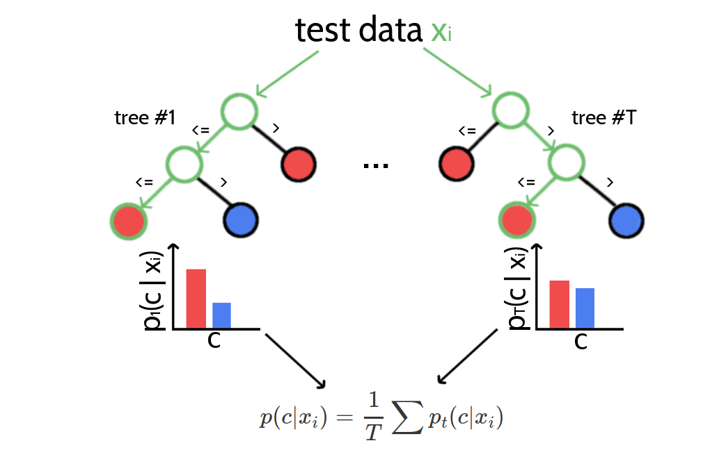

# Contact Prior {#contact-prior}

The wealth of successful meta-predictors presented in section \@ref(meta-predictors) highlights the importance to exploit other sources of information apart from coevolution statistics.
Much information about residue interactions is typically contained in single position features that can be predicted from local sequence profiles, such as secondary structure, solvent accessibility or contact number, and in pairwise features such as the contact prediction scores for residue pairs $(i,j)$ from a simple local statistical methods as presented in section \@ref(local-methods). 

For example, predictions of secondary structure elements and solvent accessibility are used by almost all modern machine learning predictors, such as MetaPsicov [@Jones2015a], NeBCon [@He2017], EPSILON-CP [@Stahl2017], PconsC3 [@Skwark2016].
Other frequently used sequence derived features include pairwise contact potentials, sequence separation and conservation measures such as column entropy [@Jones2015a; @He2017; @Ma2015a].

In the following sections I present a random forest classifier that uses sequence derived features to distinguish contacts from non-contacts.
Methods section \@ref(seq-features) lists all features used to train the classifier including the aforementioned standard features as well as some novel features. 

The probabilistic predictions of the random forest model can be introduced directly as prior information into the Bayesian statistical model presented in the last section \@ref(bayesian-approach) to improve the overall prediction accuracy in terms of posterior probabilities.
Furthermore, contact scores from coevolution methods can be added as additional feature to the random forest model in order to elucidate how much the combined information improves prediction accuracy over the single methods. 


## Random Forest Classifiers

Random Forests are supervised machine learning methods that belong to the class of ensemble methods [@Ho1998;@TinKamHo;@Breiman2001].
They are easy to implement, fast to train and can handle large numbers of features due to implicit feature selection [@Menze2009].

Ensemble methods combine the predictions of several independent base estimators with the goal to improve generalizability over a single estimator.
Random forests are ensembles of decision trees where randomness is introduced in two ways:

1. every tree is build on a random sample that is drawn with replacement from the training set and has the same size as the training set (i.e., a bootstrap sample) 
2. every split of a node is evaluated on a random subset of features

A single decision tree, especially when it is grown very deep is highly susceptible to noise in the training set and therefore prone to overfitting which results in poor generalization ability. 
As a consequence of randomness and averaging over many decision trees, the variance of a random forest predictor decreases and therefore the risk of overfitting [@Louppe2014].
It is still advisable to restrict the depth of single trees in a random forest, not only to counteract overfitting but also to reduce model complexity and to speedup the algorithm. 

Random forests are capable of regression and classification tasks.
For classification, predictions for new data are obtained by running each data sample down every tree in the forest and then either apply majority voting over single class votes or averaging the probabilistic class predictions. Probabilistic class predictions of single trees are computed as the fraction of training set samples of the same class in a leaf whereas the single class vote refers to the majority class in a leaf. 
Figure \@ref(fig:rf-intro) visualizes the procedure of classifying a new data sample.

(ref:caption-rf-intro) Classifying new data with random forests. A new data sample is run down every tree in the forest until it ends up in a leaf node. Every leaf node has associated class probabilities $p(c)$ reflecting the fraction of training samples belonging to every class $c$. The color of the leaf nodes reflects the class with highest probability. The predictions from all trees in form of the class probabilties are averaged over all trees and yield the final prediction. 

```{r rf-intro, echo = FALSE, out.width='80%', fig.align='center', fig.cap = '(ref:caption-rf-intro)'}

```


Typically, *Gini impurity*, which is a computationally efficient approximation to the entropy, is used as a split criterion to evaluate the quality of a split.
It measures the degree of purity in a data set regarding class labels as $GI = (1 - \sum_{k=1}^K p_k^2)$, where $p_k$ is the proportion of class $k$ in the data set.
For every feature $f$ in the random subset that is considered for splitting a particular node $N$, the *decrease in Gini impurity* $\Delta GI_f$  will be computed as,
 
$$
\Delta GI_f(N_{\textrm{parent}}) = GI_f(N_{\textrm{parent}}) - p_{\textrm{left}} GI_f(N_{\textrm{left}}) - p_{\textrm{right}} GI_f(N_{\textrm{left}})
$$

where $p_{\textrm{left}}$ and $p_{\textrm{right}}$ refers to the fraction of samples ending up in the left and right child node respectively [@Menze2009].
The feature $f$ with highest $\Delta GI_f$ over the two resulting child node subsets will be used to split the data set at the given node $N$.

Summing the *decrease in Gini impurity* for a feature $f$ over all trees whenever $f$ was used for a split yields the *Gini importance* measure, which can be used as an estimate of general feature relevance.
Random forests therefore are popular methods for feature selection and it is common practice to remove the least important features from a data set to reduce the complexity of the model.
However, feature importance measured with respect to *Gini importance* needs to be interpreted with care.
The random forest model cannot distinguish between correlated features and it will choose any of the correlated features for a split, thereby reducing the importance of the other features and introducing bias.
Furthermore, it has been found that feature selection based on *Gini importance* is biased towards selecting features with more categories as they will be chosen more often for splits and therefore tend to obtain higher scores [@Strobl2007].


## Evaluating Random Forest Model as Contact Predictor

I trained a random forest classifier on the feature set described in methods section \@ref(seq-features) and optimized model hyperparameters as well as some data set specific settings (e.g window size and class ratios) with 5-fold cross-validation as described in methods section \@ref(rf-hyperparameter-optimization).

Figure \@ref(fig:rf-feature-importance) shows the ranking of the ten most important features according to *Gini importance*.
Both local statistical contact scores, *OMES* [@Fodor2004a] and [MI](#abbrev) (mutual information between amino acid counts), constitute the most important features besides the mean pair potentials acording to Miyazawa & Jernigan [@Miyazawa1999a] and Li&Fang[@Li2011].
Further important features include the relative solvent accessibility at both pair positions, the total percentage of gaps at both positions, the correlation between mean isoelectric point property at both positions, sequence separation and the beta-sheet propensity in a window of size five around position i. 

(ref:caption-rf-feature-importance) Top ten features ranked according to *Gini importance*. **OMES+APC**:  [APC](#abbrev) corrected OMES score according to Fodor&Aldrich [@Fodor2004a]. **mean pair potential (Miyasawa & Jernigan)**: average quasi-chemical energy of transfer of amino acids from water to the protein environment [@Miyazawa1999a]. **MI+APC**: [APC](#abbrev) corrected mutual information between amino acid counts (using pseudo-counts). **mean pair potential (Li&Fang)**: average general contact potential by Li & Fang [@Li2011]. **rel. solvent accessibilty i(j)**: RSA score computed with Netsurfp (v1.0) [@Petersen2009a] for position i(j). **pairwise gap%**: percentage of gapped sequences at either position i and j. **correlation mean isoelectric feature**: Pearson correlation between the mean isoelectric point feature (according to Zimmermann et al., 1968) for positions i and j. **sequence separation**: |j-i|. **beta sheet propensity window(i)**: beta-sheet propensity according to Psipred [@Jones1999] computed within a window of five positions around i.  eatures are described in detail in methods section \@ref(seq-features).

```{r rf-feature-importance, echo = FALSE, screenshot.alt="img/random_forest_contact_prior/feature_random_forest_optimalhyperparameters_topfeatures.png", out.width = '100%', fig.cap = '(ref:caption-rf-feature-importance)'}
knitr::include_url("img/random_forest_contact_prior/feature_random_forest_optimalhyperparameters_topfeatures.html", height = "600px")
```

Many features have low *Gini importance* scores which means they are rarely considered for splitting a node and can likely be removed from the dataset. 
Removing irrelevant features from the dataset is a convenient procedure to reduce model complexity.
As described in methods section \@ref(rf-feature-selection), I performed feature selection by evaluating model performance on subsets of features of decreasing importance.
Most models trained on subsets of the total feature space perform nearly identical compared to the model trained on all features, as can be seen in Figure \@ref(fig:rf-feature-selection-performance).
Performance of the random forest models drops noticeably when using only the 25 most important features.
For the further analysis I am using the random forest model trained on the 75 most important features as this model constitutes the smallest set of features while performing nearly identical compared to the model trained on the complete feature set. 

(ref:caption-rf-feature-selection-performance) Mean precision of top ranked predictions over 200 proteins for random forest models trained on subsets of features of decreasing importance. Subsets of features have been selected as described in methods section \@ref(rf-feature-selection).  

```{r rf-feature-selection-performance, echo = FALSE, screenshot.alt="img/random_forest_contact_prior/precision_vs_rank_featureselection_random_forest_optimized_hyperparameters.png", out.width = '100%', fig.cap = '(ref:caption-rf-feature-selection-performance)'}
knitr::include_url("img/random_forest_contact_prior/precision_vs_rank_featureselection_random_forest_optimized_hyperparameters.html", height = "500px")
```


Figure \@ref(fig:performance-rf) shows the mean precision for the random forest model trained on the 75 most important features. 
The random forest model has a mean precision of 0.33 for the top $0.5\cdot L$ contacts compared to a precision of 0.47 for pseudo-likelihood.
Furthermore, the random forest model improves approximately ten percentage points in precision over the local statistical contact scores, *OMES* and mutual information (MI).
Both methods comprise important features of the random forest model as can be seen in Figure \@ref(fig:rf-feature-importance).

When analysing performance with respect to alignment size it can be found that the random forest model outperforms the pseudo-likelihood score for small alignments (see Figure \@ref(fig:performance-neff-rf)).  
Both, local statistial models *OMES* and [MI](#abbrev) also perform weak on small alignments, leading to the conclusion that the remaining sequence derived features are highly relevant when the alignment contains only few sequences.
This finding is expected, as it is well known that models trained on simple sequence features perform almost independent of alignment size [@Stahl2017, @Skwark2016]. 


(ref:caption-performance-rf) Mean precision for top ranked contacts on a test set of 774 proteins. **random forest (pLL)** = random forest model using sequence derived features and pseudo-likelihood contact score ([APC](#abbrev) corrected Frobenius norm of couplings). **pseudo-likelihood** = [APC](#abbrev) corrected Frobenius norm of couplings computed with pseudo-likelihood. **random forest** = random forest model trained on 75 sequence derived features.  **OMES** = [APC](#abbrev) corrected *OMES* contact score according to Fodor&Aldrich [@Fodor2004a]. **mutual information** = [APC](#abbrev) corrected mutual information between amino acid counts (using pseudo-counts).   

```{r performance-rf, echo = FALSE, screenshot.alt="img/random_forest_contact_prior/precision_vs_rank_notitle.png", out.width = '100%', fig.cap = '(ref:caption-performance-rf)'}
knitr::include_url("img/random_forest_contact_prior/precision_vs_rank_notitle.html", height = "500px")
```


(ref:caption-performance-neff-rf) Mean precision for top ranked contacts on a test set of 774 proteins splitted into four equally sized subsets with respect to [Neff](#abbrev). Subsets are defined according to quantiles of [Neff](#abbrev) values. Upper left: Subset of proteins with [Neff](#abbrev) < Q1. Upper right: Subset of proteins with Q1 <= [Neff](#abbrev) < Q2. Lower left: Subset of proteins with Q2 <= [Neff](#abbrev) < Q3. Lower right: Subset of proteins with Q3 <= [Neff](#abbrev) < Q4. **random forest (pLL)** = random forest model using sequence derived features and pseudo-likelihood contact score ([APC](#abbrev) corrected Frobenius norm of couplings). **pseudo-likelihood** = [APC](#abbrev) corrected Frobenius norm of couplings computed with pseudo-likelihood. **random forest** = random forest model trained on 75 sequence derived features.  **OMES** = [APC](#abbrev) corrected *OMES* contact score according to Fodor&Aldrich [@Fodor2004a]. **mutual information** = [APC](#abbrev) corrected mutual information between amino acid counts (using pseudo-counts).   

```{r performance-neff-rf, echo = FALSE, screenshot.alt="img/random_forest_contact_prior/precision_vs_rank_facetted_by_neff_notitle.png", out.width = '100%', fig.cap = '(ref:caption-performance-neff-rf)'}
knitr::include_url("img/random_forest_contact_prior/precision_vs_rank_facetted_by_neff_notitle.html", height = "600px")
```


Figure \@ref(fig:performance-neff-rf) showed that the random forest predictor improves over the pseudo-likelihood coevolution method when the alignment consists of only few sequences. 
In order to assess this improvement in a more direct manner, it is possible to build a combined random forest predictor that is not only trained on the sequence derived features but also on the pseudo-likelihood contact score as an additional feature (see methods section \@ref(rf-with-pll-score) for details). 
As expected, the pseudo-likelihood score comprises the most important feature in the model (Figure \@ref(fig:feature-importance-rf-with-pll-score) in methods section) followed by the same sequence features that were found in the previous analysis in Figure \@ref(fig:rf-feature-importance).

Finally, comparing the random forest model trained on sequence features and pseudo-likelihood contact score to the pseudo-likelihood score in Figure \@ref(fig:performance-rf) reveals that combining both types of information indeed improves predictive power over both single approaches.
Especially for small alignments, the improvement is substantial as can be seen in in the left upper plot in Figure \@ref(fig:performance-neff-rf).
In contrast, the improvement on large alignments (right lower plot in Figure \@ref(fig:performance-neff-rf)) is small, as the gain from simple sequence features compared to the much more powerful coevolution signals is neglectable. 


