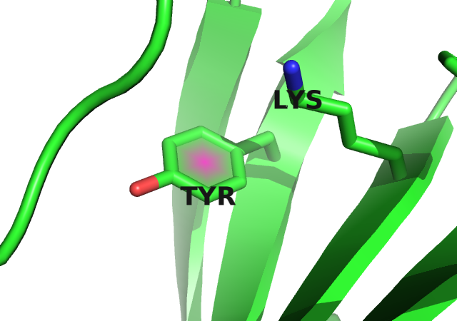
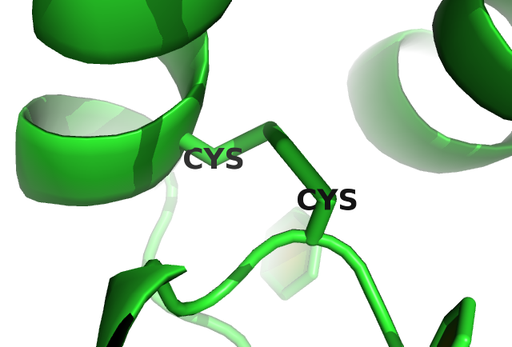
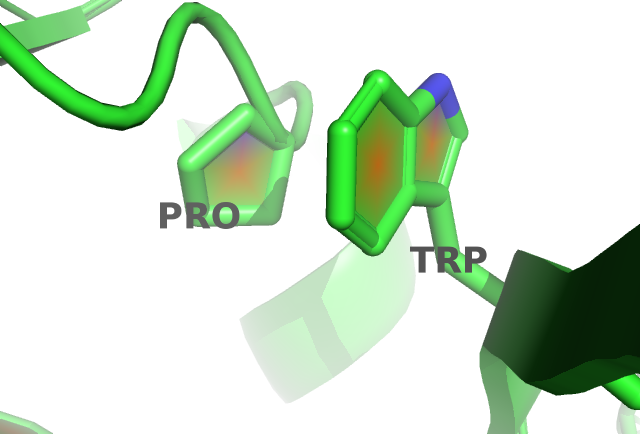
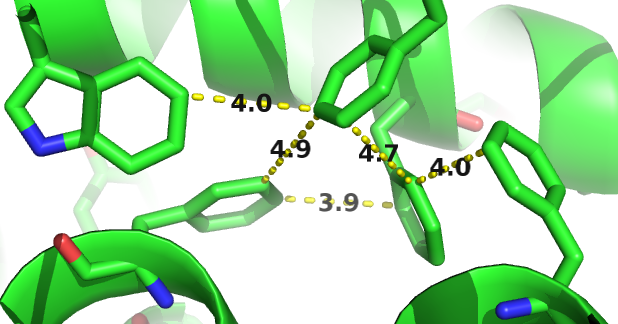

# (APPENDIX) Appendix {-} 

# Abbreviations {#abbrev}


**APC** Avarage Product Correction

**CASP** Critical Assessment of protein Structure Prediction

**CD** Contrastive Divergence

**DCA** Direct Coupling Analysis

**DI** Direct Information

**EM** electron microscopy

**IDP** intrinsically disordered proteins

**MAP** Maximum a posteriori

**ML** Maximum-Likelihood

**MLE** Maximum-Likelihood Estimate

**MRF** Markov-Random Field

**MSA** Multiple Sequence Alignment

**PCD** Persistent Contrastive Divergence

**PDB** protein data bank

%%%% used as: [MRF](#abbrev)


# Dataset Properties

The following figures display various statistics about the dataset used throughout this thesis. 
See section \@ref(dataset) for information on how this dataset has been generated. 

## Alignment Diversity
(ref:caption-dataset-diversity) Distribution of alignment diversity ($=\sqrt(\frac{N}{L})$) in the dataset an its ten subsets.

```{r dataset-diversity, echo = FALSE, out.width = '100%', out.height = '100%', fig.cap = '(ref:caption-dataset-diversity)'}
knitr::include_url("img/dataset_statistics/diversity_dataset_boxplot_notitle.html")
```

## Proportion of Gaps in Alignment
(ref:caption-gaps) Distribution of gap percentage of alignments in the dataset an its ten subsets.

```{r dataset-gaps, echo = FALSE, out.width = '100%', out.height = '100%', fig.cap = '(ref:caption-gaps)'}
knitr::include_url("img/dataset_statistics/gap_percentage_boxplot_notitle.html")
```

## Alignment Size (number of sequences)
(ref:caption-alignment-size) Distribution of alignment size (number of sequences N) in the dataset an its ten subsets.

```{r dataset-alignment-size, echo = FALSE, out.width = '100%', out.height = '100%', fig.cap = '(ref:caption-alignment-size)'}
knitr::include_url("img/dataset_statistics/msa_size_dataset_boxplot_notitle.html")
```

## Protein Length
(ref:caption-protein-length) Distribution of protein length L in the dataset an its ten subsets.

```{r dataset-protein-length, echo = FALSE, out.width = '100%', out.height = '100%', fig.cap = '(ref:caption-protein-length)'}
knitr::include_url("img/dataset_statistics/protein_length_dataset_boxplot_notitle.html")
```

# Amino Acid Interaction Preferences Reflected in Coupling Matrices

## Pi-Cation interactions {#pi-cation}

Figure \@ref(fig:coupling-matrix-pication-pymol) shows a Tyrosine and a Lysine residue forming a cation-$\pi$ interaction in protein 2ayd.
The corresponding coupling matrix in figure \@ref(fig:coupling-matrix-pication-interaction) reflects the strong interaction preference. 

(ref:caption-coupling-matrix-pication-pymol) Tyrosing (residue 37) and Lysine (residue 48) forming a cation-$\pi$ interaction in protein 2ayd.

```{r coupling-matrix-pication-pymol, echo = FALSE, out.width = '50%', fig.show = 'hold', fig.cap = '(ref:caption-coupling-matrix-pication-pymol)'}

```

(ref:caption-coupling-matrix-pication-interaction) Coupling Matrix for residue pair i=37 and j=48 of PDB 2ayd chain A domain 1. Size of the bubbles represents coupling strength and color represents the direction of coupling: red = positive coupling, blue = negative coupling. Bars at the x-axis represent single potentials for residue i=37 and bars at the y-axis represent single potentials for residue j=48. Height of the bars represents potential strength and color represents positive (red) and negative (blue) values.

```{r coupling-matrix-pication-interaction, echo = FALSE, out.width='750px', fig.show = 'hold', fig.cap = '(ref:caption-coupling-matrix-pication-interaction)'}
knitr::include_url("img/coupling_matrix_analysis/coupling_matrix_2aydA01_37_48_notitle.html", height = "750px")
```

## Disulfide Bonds {#disulfide}

Figure \@ref(fig:coupling-matrix-disulfide-pymol) shows two cysteine residues forming a covalent disulfide bond in protein 1alu.
The corresponding coupling matrix in figure \@ref(fig:coupling-matrix-disulfide-interaction) reflects the strong interaction preference of cysteines. 

(ref:caption-coupling-matrix-disulfide-pymol) Two cystein residues (residues 54 and 64) forming a covalent disulfide bond in protein 1alu.

```{r coupling-matrix-disulfide-pymol, echo = FALSE, out.width = '50%', fig.show = 'hold', fig.cap = '(ref:caption-coupling-matrix-disulfide-pymol)'}

```

(ref:caption-coupling-matrix-disulfide-interaction) Coupling Matrix for residue pair i=54 and j=64 of PDB 1alu chain A. Size of the bubbles represents coupling strength and color represents the direction of coupling: red = positive coupling, blue = negative coupling. Bars at the x-axis represent single potentials for residue i=54 and bars at the y-axis represent single potentials for residue j=64. Height of the bars represents potential strength and color represents positive (red) and negative (blue) values.

```{r coupling-matrix-disulfide-interaction, echo = FALSE, out.width='750px', fig.show = 'hold', fig.cap = '(ref:caption-coupling-matrix-disulfide-interaction)'}
knitr::include_url("img/coupling_matrix_analysis/coupling_matrix_1aluA00_54_64_notitle.html", height = "750px")
```


## Aromatic-Proline Interactions {#aromatic-proline}

Figure \@ref(fig:coupling-matrix-aromatic-proline-pymol )shows a proline and a tryptophan residue forming such a CH/$\pi$ interaction in protein 1aol.
The corresponding coupling matrix in figure \@ref(fig:coupling-matrix-aromatic-proline) reflects this interaction with strong positive coupling between proline and tryptophan. 

(ref:caption-coupling-matrix-aromatic-proline-pymol) Proline and tryptophan  (residues 17 and 34)  stacked on top of each otherengaging in a CH/$\pi$ interaction in protein 1alu.

```{r coupling-matrix-aromatic-proline-pymol, echo = FALSE, out.width = '50%', fig.show = 'hold', fig.cap = '(ref:caption-coupling-matrix-aromatic-proline-pymol)'}

```

(ref:caption-coupling-matrix-aromatic-proline) Coupling Matrix for residue pair i=17 and j=34 of PDB 1aol chain A. Size of the bubbles represents coupling strength and color represents the direction of coupling: red = positive coupling, blue = negative coupling. Bars at the x-axis represent single potentials for residue i=17 and bars at the y-axis represent single potentials for residue j=34. Height of the bars represents potential strength and color represents positive (red) and negative (blue) values.

```{r coupling-matrix-aromatic-proline, echo = FALSE, out.width='750px', fig.show = 'hold', fig.cap = '(ref:caption-coupling-matrix-aromatic-proline)'}
knitr::include_url("img/coupling_matrix_analysis/coupling_matrix_1aolA00_17_34_notitle.html", height = "750px")
```


## Network-like structure of aromatic residues {#aromatic-network}

(ref:caption-aromatic-network) Network-like structure of aromatic residues in the protein core. 80% of aromatic residues are involved in such networks that are important for protein stability [@Burley1985].

```{r aromatic-network, echo = FALSE, out.width = '50%', fig.cap = '(ref:caption-aromatic-network)'}

```
