# (APPENDIX) Appendix {-} 

\phantomsection
\addcontentsline{toc}{chapter}{Appendix}

# Abbreviations {#abbrev}

**APC** Avarage Product Correction

**CASP** Critical Assessment of protein Structure Prediction

**CD** Contrastive Divergence

**DCA** Direct Coupling Analysis

**DI** Direct Information

**EM** electron microscopy

**MAP** Maximum a posteriori

**MCMC** Markov Chain Monte Carlo

**MI** mutual information

**ML** Maximum-Likelihood

**MLE** Maximum-Likelihood Estimate

**MRF** Markov-Random Field

**MSA** Multiple Sequence Alignment

**Neff** Number of effective sequences

**PCD** Persistent Contrastive Divergence

**PDB** protein data bank

**SGD** stochastic gradient descent


# Amino Acid Alphabet {#amino-acids}

\blandscape

| One letter Code | Three letter Code | Amino Acid | Physico-chemical properties | 
|:---:|:------:|----------:|:-------------|
| A | Ala | **A**lanine         | tiny, hydrophobic                     |
| C | Cys | **C**ysteine        | small, hydrophobic, polar ($C_{S-H}$) |
| D | Asp | Aspartic Aci**D**   | small, negatively charged, polar      |
| E | Glu | Glutamic Acid       | negatively charged, polar             |
| F | Phe | Phenylalanine       | aromatic, hydrophobic                 |
| G | Gly | **G**lycine         | tiny, hydrophobic                     |
| H | His | **H**istidine       | hydrophobic, aromatic, polar, (positively charged)  |
| I | Ile | **I**soleucine      | aliphatic, hydrophobic                |
| K | Lys | Lysine              | positively charged, polar             |
| L | Leu | **L**eucine         | aliphatic, hydrophobic                |
| M | Met | **M**ethionine      | hydrophobic                           |
| N | Asn | Asparagi**N**e      | small, polar                          |
| P | Pro | **P**roline         | small                                 |
| Q | Gln | Glutamine           | tiny, hydrophobic                     |
| R | Arg | A**R**ginine        | positively charged, polar             |
| S | Ser | **S**erine          | tiny, polar                           |
| T | Thr | **T**hreonine       | hydrophobic, polar                    |
| V | Val | **V**aline          | small, aliphatic                      |
| W | Trp | **T**ryptophan      | aromatic, hydrophobic, polar          |
| Y | Tyr | T**Y**rosine        | aromatic, hydrophobic, polar          |
:(#tab:amino-acid-prop) Amino acid abbreviations and physico-chemical properties according to Livingstone et al., 1993 [@Livingstone1993]

\elandscape

# Dataset Properties

(ref:caption-dataset-diversity) Distribution of alignment diversity ($=\sqrt(\frac{N}{L})$) in the dataset and its ten subsets.

```{r dataset-diversity, echo = FALSE, screenshot.alt="img/dataset_statistics/diversity_dataset_boxplot_notitle.png", out.width = '100%', fig.align='center', fig.cap = '(ref:caption-dataset-diversity)'}
knitr::include_url("img/dataset_statistics/diversity_dataset_boxplot_notitle.html")
```

(ref:caption-gaps) Distribution of gap percentage of alignments in the dataset and its ten subsets.

```{r dataset-gaps, echo = FALSE, screenshot.alt="img/dataset_statistics/gap_percentage_boxplot_notitle.png", out.width = '100%', fig.align='center', fig.cap = '(ref:caption-gaps)'}
knitr::include_url("img/dataset_statistics/gap_percentage_boxplot_notitle.html")
```

(ref:caption-alignment-size) Distribution of alignment size (number of sequences N) in the dataset and its ten subsets.

```{r dataset-alignment-size, echo = FALSE, screenshot.alt="img/dataset_statistics/msa_size_dataset_boxplot_notitle.png", out.width = '100%', fig.align='center', fig.cap = '(ref:caption-alignment-size)'}
knitr::include_url("img/dataset_statistics/msa_size_dataset_boxplot_notitle.html")
```

(ref:caption-protein-length) Distribution of protein length L in the dataset and its ten subsets.

```{r dataset-protein-length, echo = FALSE, screenshot.alt="img/dataset_statistics/protein_length_dataset_boxplot_notitle.png", out.width = '100%', fig.align='center', fig.cap = '(ref:caption-protein-length)'}
knitr::include_url("img/dataset_statistics/protein_length_dataset_boxplot_notitle.html")
```


# Interpretation of Coupling Matrices

(ref:caption-stdev-couplings-noncontacts) Standard deviation of squared coupling values ${\wijab}^2$ and of coupling values $\wijab$ for residue pairs not in physical contact ($\Delta \Cb > 25 \angstrom$). Dataset contains 100.000 residue pairs per class (for details see methods section \@ref(method-coupling-correlation)). Amino acids are abbreviated with one-letter code and they are broadly grouped with respect to physico-chemical properties listed in Appendix \@ref(amino-acids) **Left** Standard deviation of squared coupling values ${\wijab}^2$ . **Right** Standard deviation of coupling values $\wijab$.

```{r stdev-couplings-noncontacts, echo = FALSE, out.width = '49%', fig.show='hold', fig.cap = '(ref:caption-stdev-couplings-noncontacts)'}
knitr::include_graphics(c("img/coupling_matrix_analysis/stdev_squared_couplings_noncontacts_heatmap_notitle.png", "img/coupling_matrix_analysis/stdev_couplings_noncontacts_heatmap_notitle.png"))
```


# Optimizing Full Likelihood with Gradient Descent

(ref:caption-performance-cd-alphaopt-0)  Mean precision for top ranked contact predictions over 300 proteins. Contact scores are computed as the [APC](#abbrev) corrected Frobenius norm of the couplings $\wij$.  **pseudo-likelihood**:  couplings computed with pseudo-likelihood. **CD alpha0 = 5e-4**: couplings computed with [CD](#abbrev) using stochastic gradient descent with initial learning rate, $\alpha_0 \eq 5e-4$. **CD alpha0 = 1e-3**: couplings computed with [CD](#abbrev) using stochastic gradient descent with initial learning rate, $\alpha_0 \eq 1e-3$. **CD alpha0 = 5e-2Neff^-0.5**: couplings computed with [CD](#abbrev) using stochastic gradient descent with initial learning rate defined as a function of [Neff](#abbrev), $\alpha_0 \eq \frac{5e-2}{\sqrt{N_{\text{eff}}}}$. 

```{r performance-cd-alphaopt-0, echo = FALSE, screenshot.alt="img/full_likelihood/appendix/precision_vs_rank_learningrates_comparealpha0.png", out.width = '85%', fig.align='center', fig.cap = '(ref:caption-performance-cd-alphaopt-0)'}
knitr::include_url("img/full_likelihood/appendix/precision_vs_rank_learningrates_comparealpha0.html", height = "500px")
```

(ref:caption-learning-rate-schedules) Value of learning rate against the number of iterations for different learning rate schedules. Red legend group represents the **exponential** learning rate schedule $\alpha_{t+1}  = \alpha_0 \cdot\exp(- \gamma t)$. Blue legend group represents the **linear** learning rate schedule $\alpha  = \alpha_0 / (1 + \gamma \cdot t)$. Green legend group represents the **sigmoidal** learning rate schedule $\alpha_{t+1}  = \alpha_{t} / (1 + \gamma \cdot t)$. Purple legend group represents the **square root** learning rate schedule $\alpha  = \alpha_0 / \sqrt{1 + \gamma \cdot t}$. The initial learning rate $\alpha_0$ is set to 1e-4, the iteration number is given by $t$ and $\gamma$ is the decay rate and its value is given in brackets in the legend.

```{r learning-rate-schedules, echo = FALSE, screenshot.alt="img/full_likelihood/appendix/learning_rate_schedules_alpha0_1e-4_notitle.png", out.width = '100%', fig.align='center', fig.cap = '(ref:caption-learning-rate-schedules)'}
knitr::include_url("img/full_likelihood/appendix/learning_rate_schedules_alpha0_1e-4_notitle.html", height = "500px")
```

(ref:caption-performance-cd-linschedule) Mean precision for top ranked contact predictions over 300 proteins. Contact scores are computed as the [APC](#abbrev) corrected Frobenius norm of the couplings $\wij$. pseudo-likelihood: contact scores computed from pseudo-likelihood. The other methods derive contact scores from couplings computed from [CD](#abbrev) using stochastic gradient descent with an initial learning rate defined with respect to [Neff](#abbrev) and a *linear* learning rate annealing schedule $\alpha  = \frac{\alpha_0}{1 + \gamma t}$ with decay rate $\gamma$ as specified in the legend.

```{r performance-cd-linschedule, echo = FALSE, screenshot.alt="img/full_likelihood/appendix/precision_vs_rank_alpha0_0_lin_decayrate.png", out.width = '85%', fig.align='center', fig.cap = '(ref:caption-performance-cd-linschedule)'}
knitr::include_url("img/full_likelihood/appendix/precision_vs_rank_alpha0_0_lin_decayrate.html", height = "500px")
```

(ref:caption-performance-cd-sigschedule) Mean precision for top ranked contact predictions over 300 proteins. Contact scores are computed as the [APC](#abbrev) corrected Frobenius norm of the couplings $\wij$. pseudo-likelihood: contact scores computed from pseudo-likelihood. The other methods derive contact scores from couplings computed from [CD](#abbrev) using stochastic gradient descent with an initial learning rate defined with respect to [Neff](#abbrev) and a *sigmoidal* learning rate annealing schedule $\alpha_{t+1}  = \frac{\alpha_{t}}{1 + \gamma t}$ with t being the iteration number and decay rate $\gamma$ as specified in the legend.

```{r performance-cd-sigschedule, echo = FALSE, screenshot.alt="img/full_likelihood/appendix/precision_vs_rank_alpha0_0_sig_decayrate.png", out.width = '85%', fig.align='center', fig.cap = '(ref:caption-performance-cd-sigschedule)'}
knitr::include_url("img/full_likelihood/appendix/precision_vs_rank_alpha0_0_sig_decayrate.html", height = "500px")
```

(ref:caption-performance-cd-sqrtschedule) Mean precision for top ranked contact predictions over 300 proteins. Contact scores are computed as the [APC](#abbrev) corrected Frobenius norm of the couplings $\wij$. pseudo-likelihood: contact scores computed from pseudo-likelihood. The other methods derive contact scores from couplings computed from [CD](#abbrev) using stochastic gradient descent with an initial learning rate defined with respect to [Neff](#abbrev) and a *square root* learning rate annealing schedule $\alpha  = \frac{\alpha_0}{\sqrt{1 + \gamma t}}$ with t being the iteration number and decay rate $\gamma$ as specified in the legend.

```{r performance-cd-sqrtschedule, echo = FALSE, screenshot.alt="img/full_likelihood/appendix/precision_vs_rank_alpha0_0_sqrt_decayrate.png", out.width = '85%', fig.align='center', fig.cap = '(ref:caption-performance-cd-sqrtschedule)'}
knitr::include_url("img/full_likelihood/appendix/precision_vs_rank_alpha0_0_sqrt_decayrate.html", height = "500px")
```


(ref:caption-performance-cd-expschedule) Mean precision for top ranked contact predictions over 300 proteins. Contact scores are computed as the [APC](#abbrev) corrected Frobenius norm of the couplings $\wij$. pseudo-likelihood: contact scores computed from pseudo-likelihood. The other methods derive contact scores from couplings computed from [CD](#abbrev) using stochastic gradient descent with an initial learning rate defined with respect to [Neff](#abbrev) and a *exponential* learning rate annealing schedule $\alpha  = \alpha_0 \cdot\exp(- \gamma t)$ with t being the iteration number and decay rate $\gamma$ as specified in the legend.

```{r performance-cd-expschedule, echo = FALSE, screenshot.alt="img/full_likelihood/appendix/precision_vs_rank_alpha0_0_exp_decayrate.png", out.width = '85%', fig.align='center', fig.cap = '(ref:caption-performance-cd-expschedule)'}
knitr::include_url("img/full_likelihood/appendix/precision_vs_rank_alpha0_0_exp_decayrate.html", height = "500px")
```

(ref:caption-cd-numit-lin-learning-rate-schedule) Distribution of the number of iterations until convergence for stochastic gradient descent optimizations of the full likelihood using different decay rates with a **linear** learning rate schedule $\alpha = \alpha_0 / (1 + \gamma  t)$ with $t$ being the iteration number and the decay rate $\gamma$ is specified in the legend. Initial learning rate $\alpha_0$ defined with respect to [Neff](#abbrev) and maximum number of iterations is set to 5000. 

```{r cd-numit-lin-learning-rate-schedule, echo = FALSE, screenshot.alt="img/full_likelihood/appendix/distribution_numiterations_against_linear_learningrate_schedule.png", out.width='90%', fig.align='center', fig.cap = '(ref:caption-cd-numit-lin-learning-rate-schedule)'}
knitr::include_url("img/full_likelihood/appendix/distribution_numiterations_against_linear_learningrate_schedule.html", height = "500px")
```

(ref:caption-cd-numit-sig-learning-rate-schedule) Distribution of the number of iterations until convergence for stochastic gradient descent optimizations of the full likelihood using different decay rates with a **sigmoidal** learning rate schedule $\alpha_{t+1}  = \alpha_{t} / (1 + \gamma  t)$  with $t$ being the iteration number and the decay rate $\gamma$ is specified in the legend. Initial learning rate $\alpha_0$ defined with respect to [Neff](#abbrev) and maximum number of iterations is set to 5000. 

```{r cd-numit-sig-learning-rate-schedule, echo = FALSE, screenshot.alt="img/full_likelihood/appendix/distribution_numiterations_against_sigmoidal_learningrate_schedule.png", out.width='90%', fig.align='center', fig.cap = '(ref:caption-cd-numit-sig-learning-rate-schedule)'}
knitr::include_url("img/full_likelihood/appendix/distribution_numiterations_against_sigmoidal_learningrate_schedule.html", height = "500px")
```

(ref:caption-cd-numit-sqrt-learning-rate-schedule) Distribution of the number of iterations until convergence for stochastic gradient descent optimizations of the full likelihood using different decay rates with a **square root** learning rate schedule $\alpha  = \alpha_0 / \sqrt{1 + \gamma t}$ with $t$ being the iteration number and the decay rate  $\gamma$ is specified in the legend. Initial learning rate $\alpha_0$ defined with respect to [Neff](#abbrev) and maximum number of iterations is set to 5000. 

```{r cd-numit-sqrt-learning-rate-schedule, echo = FALSE, screenshot.alt="img/full_likelihood/appendix/distribution_numiterations_against_sqrt_learningrate_schedule.png", out.width='90%', fig.align='center', fig.cap = '(ref:caption-cd-numit-sqrt-learning-rate-schedule)'}
knitr::include_url("img/full_likelihood/appendix/distribution_numiterations_against_sqrt_learningrate_schedule.html", height = "500px")
```

(ref:caption-cd-numit-exp-learning-rate-schedule) Distribution of the number of iterations until convergence for stochastic gradient descent optimizations of the full likelihood using different decay rates with an **exponential** learning rate schedule $\alpha  = \alpha_0 \cdot\exp(- \gamma t)$ with $t$ being the iteration number and the decay rate $\gamma$ is specified in the legend. Initial learning rate $\alpha_0$ defined with respect to [Neff](#abbrev) and maximum number of iterations is set to 5000. 

```{r cd-numit-exp-learning-rate-schedule, echo = FALSE, screenshot.alt="img/full_likelihood/appendix/distribution_numiterations_against_exponential_learningrate_schedule.png", out.width='90%', fig.align='center', fig.cap = '(ref:caption-cd-numit-exp-learning-rate-schedule)'}
knitr::include_url("img/full_likelihood/appendix/distribution_numiterations_against_exponential_learningrate_schedule.html", height = "500px")
```


(ref:caption-numit-convergence-convergence-prev) Distribution of the number of iterations until convergence for gradient descent optimizations of the full likelihood. The relative change of the L2 norm over coupling parameters, $||\w||_2$, is evaluated over a defined number of previous iterations and is specified in the legend. Convergence is assumed when the relative change falls below a small value $\epsilon \eq 1e-8$. The optimal hyperparameters settings for [SGD](#abbrev) as described in section \@ref(sgd-hyperparameter-tuning) have been used. 


```{r numit-convergence-convergence-prev, echo = FALSE, screenshot.alt="img/full_likelihood/appendix/distribution_numiterations_against_convergence_prev.png", out.width='85%', fig.align='center', fig.cap = '(ref:caption-numit-convergence-convergence-prev)'}
knitr::include_url("img/full_likelihood/appendix/distribution_numiterations_against_convergence_prev.html", height = "500px")
```


(ref:caption-full-likelihood-opt-fixv) Mean precision for top ranked contact predictions over 300 proteins. Contact scores are computed as the [APC](#abbrev) corrected Frobenius norm of the couplings $\wij$. [SGD](#abbrev) settings for [CD](#abbrev) optimization are as follows: sigmoidal learning rate schedule with decay rate $\gamma = \mathrm{5e-6}$ and initial learning rate $\alpha_0 \eq \mathrm{5e-2}/N_{\textrm{eff}}$. **pseudo-likelihood**:  contact scores computed from pseudo-likelihood. **CD fixed v at v* **: contact scores computed from [CD](#abbrev) with [SGD](#abbrev) and single potentials $\v$ are not optimized but fixed at $\v^*$ as given in eq. \@ref(eq:prior-v). **CD lambda_v = 10**: contact scores computed from [CD](#abbrev) with [SGD](#abbrev) and single potentials $\v$ are subject to optimization using L2-reglarization with $\lambda_v \eq 10$.


```{r full-likelihood-opt-fixv, echo = FALSE, screenshot.alt="img/full_likelihood/appendix/precision_vs_rank_fixed_v.png", out.width='90%', fig.align='center', fig.cap = '(ref:caption-full-likelihood-opt-fixv)'}
knitr::include_url("img/full_likelihood/appendix/precision_vs_rank_fixed_v.html", height = "500px")
```


(ref:caption-cd-samplesize-protein1ahoa00) Monitoring parameter norm and gradient norm for protein 1ahoA00 during [SGD](#abbrev) optimization of [CD](#abbrev) using different sample sizes. Protein 1ahoA00 has length L=64 and 378 sequences in the alignment ([Neff](#abbrev)=229). The number of sequences, that is used for Gibbs sampling to approximate the gradient, is given in the legend with 1L = 64 sequences, 5L = 320 sequences, 10L = min(10L, N) = 378 sequences, 0.2Neff = 46 sequences, 0.3Neff = 69 sequences, 0.4Neff = 92 sequences.  **Left** L2-norm of the gradients for coupling parameters, $||\nabla_{\w} L\!L(\v^*, \w)||_2$ (without contribution of regularizer).  **Right** L2-norm of the coupling parameters $||\w||_2$.

```{r cd-samplesize-protein1ahoa00, echo = FALSE, out.width = '100%', fig.align='center', fig.cap = '(ref:caption-cd-samplesize-protein1ahoa00)'}
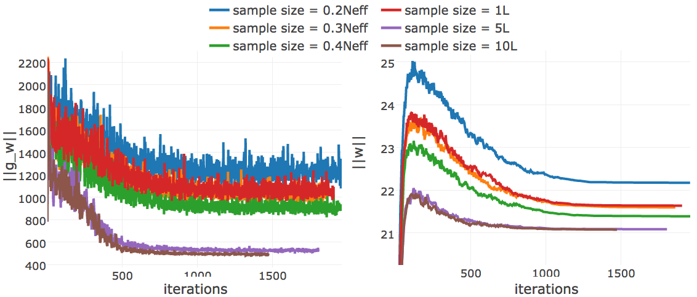
```

(ref:caption-cd-precision-gibbssteps-neff) Mean precision for top ranked contact predictions over 300 proteins splitted into four equally sized subsets with respect to [Neff](#abbrev). Contact scores are computed as the [APC](#abbrev) corrected Frobenius norm of the couplings $\wij$. Subsets are defined according to quantiles of [Neff](#abbrev) values. Upper left: Subset of proteins with [Neff](#abbrev) < Q1. Upper right: Subset of proteins with Q1 <= [Neff](#abbrev) < Q2. Lower left: Subset of proteins with Q2 <= [Neff](#abbrev) < Q3. Lower right: Subset of proteins with Q3 <= [Neff](#abbrev) < Q4. **pseudo-likelihood**:  contact scores computed from pseudo-likelihood. **CD #Gibbs steps = X**: contact scores computed from [CD](#abbrev) optimized with [SGD](#abbrev) and evolving each Markov chain using the number of Gibbs steps specified in the legend. 

```{r cd-precision-gibbssteps-neff, echo = FALSE, screenshot.alt="img/full_likelihood/appendix/precision_vs_rank_facetted_by_neff_gibbssteps.png", out.width='100%', fig.align='center', fig.cap = '(ref:caption-cd-precision-gibbssteps-neff)'}
knitr::include_url("img/full_likelihood/appendix/precision_vs_rank_facetted_by_neff_gibbssteps.html", height = "600px")
```


(ref:caption-cd-gibbssteps-single-proteins-gradient) Monitoring L2 norm of the gradient, $||\nabla_{\w} L\!L(\v^*, \w)||_2$, for protein 1aho_A_00 and 1c75_A_00 during [SGD](#abbrev) optimization using different number of Gibbs steps and initial learning rates, $\alpha_0$. Number of Gibbs steps is given in the legend, as well as particular choices for the initial learning rate, when not using the default $\alpha_0 = \frac{5e-2}{\sqrt{N_{\text{eff}}}}$. **Left** Protein 1aho_A_00 has length L=64 and 378 sequences in the alignment ([Neff](#abbrev)=229) **Right** Protein 1c75_A_00 has length L=71 and 28078 sequences in the alignment ([Neff](#abbrev)=16808).

```{r cd-gibbssteps-single-proteins-gradient, echo = FALSE, out.width = '48%', fig.align='center', fig.show='hold', fig.cap = '(ref:caption-cd-gibbssteps-single-proteins-gradient)'}
knitr::include_graphics(c("img/full_likelihood/gibbs_sampling/gradient_norm_1ahoa00.png", "img/full_likelihood/gibbs_sampling/gradient_norm_1c75a00.png"))
```


(ref:caption-adam-learning-rate) L2-norm of the coupling parameters, $||\w||_2$, during [CD](#abbrev) optimization with *ADAM* with different fixed learning rates (no decay). The learning rate $\alpha_0$ is specified in the legend. **Left** Protein 1c75A00 has length L=71 and 28078 sequences in the alignment ([Neff](#abbrev)=16808) **Right** Protein 1mkcA00 has length L=43 and 142 sequences in the alignment ([Neff](#abbrev)=96). 

```{r adam-learning-rate, echo = FALSE, out.width = '100%', fig.align='center', fig.cap = '(ref:caption-adam-learning-rate)'}
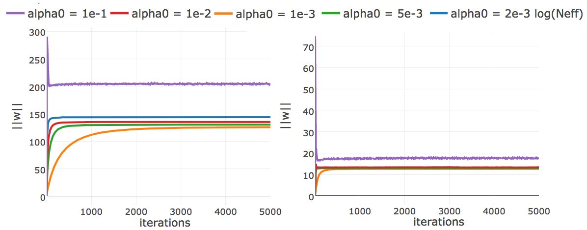
```


(ref:caption-adam-learning-rate-annealing) L2-norm of the coupling parameters, $||\w||_2$, during [CD](#abbrev) optimization with *ADAM* and different learning rate annealing schedules. The learning rate $\alpha$ is specified with respect to [Neff](#abbrev) as $\alpha = 2\mathrm{e}{-3}\log(\text{N}_{\text{eff}})$. The learning rate annealing schedule is specified in the legend. **Left** Convergence plot for protein 1mkc_A_00 having protein length L=43 and 142 sequences in the alignment ([Neff](#abbrev)=96). **Left** Protein 1c75A00 has length L=71 and 28078 sequences in the alignment ([Neff](#abbrev)=16808) **Right** Protein 1mkcA00 has length L=43 and 142 sequences in the alignment ([Neff](#abbrev)=96). 

```{r adam-learning-rate-annealing, echo = FALSE, out.width = '48%', fig.align='center', fig.show='hold', fig.cap = '(ref:caption-adam-learning-rate-annealing)'}
knitr::include_graphics(c("img/full_likelihood/adam/1c75A00_decaying_learningrates_parameternorm.png", "img/full_likelihood/adam/1mkcA00_decaying_learningrates_parameternorm.png"))
```

(ref:caption-precision-pll-cd-1c75a00) Precision of top ranked contact predictions for protein 1c75A00. Contact scores are computed as the [APC](#abbrev) corrected Frobenius norm of the couplings $\wij$. **pseudo-likelihood**:  contact scores computed from pseudo-likelihood. **contrastive divergence**: contact scores computed from [CD](#abbrev) optimized with [SGD](#abbrev).

```{r precision-pll-cd-1c75a00, echo = FALSE, screenshot.alt="img/full_likelihood/comparing_couplings/1c75A00/1c75A00_precision_vs_rank_8seqsep_8contacthr.png", out.width='90%', fig.align='center', fig.cap = '(ref:caption-precision-pll-cd-1c75a00)'}
knitr::include_url("img/full_likelihood/comparing_couplings/1c75A00/1c75A00_precision_vs_rank_8seqsep_8contacthr.html", height = "600px")
```


(ref:caption-precision-cd-final-neff) Rolling mean over the mean precision of the L/10 to L top ranked predictions per protein for testset with 2300 proteins. Contact scores computed as [APC](#abbrev) corrected Frobenius norm over pseudo-likelihood and contrastive divergence couplings. The rolling mean has been computed for the central protein within a window of 20 proteins. Window is shrunk for the proteins at the borders of Neff distribution.

```{r precision-cd-final-neff, echo = FALSE, screenshot.alt="img/full_likelihood/final/meanprecision_by_neff.png", out.width = '90%', fig.align='center', fig.cap = '(ref:caption-precision-cd-final-neff)'}
knitr::include_url("img/full_likelihood/final/meanprecision_by_neff.html", height = "500px")
```

(ref:caption-pll-predictions-small-neff-proteins)  Contact maps for protein 1ss3A00 and 1c55A00 computed as [APC](#abbrev) corrected Frobenius norm of the pseudo-likelihood couplings.  Contacts are defined according to a $8 \angstrom \Cb$ distance cutoff. **Left**: predicted contact map and native distance map for protein 1ss3A00 (protein length=50, N=42, [Neff](#abbrev)=36).  **Right** predicted contact map and native distance map for protein 1c55A00 (protein length = 40, N=115,  Neff = 78).

```{r pll-predictions-small-neff-proteins, echo = FALSE, out.width = '49%', fig.align='center', fig.show='hold', fig.cap = '(ref:caption-pll-predictions-small-neff-proteins)'}
knitr::include_graphics(c("img/full_likelihood/comparing_couplings/1ss3A00/contact_map_pseudo-likelihood_apc_1ss3A00.png", "img/full_likelihood/comparing_couplings/1c55A00/contact_map_pseudo-likelihood_apc_1c55A00.png"))
```

(ref:caption-contactmaps-1c55a00-different-samplesize)  Contact maps for protein 1c55A00 (protein length = 40, N=115,  Neff = 88) computed as [APC](#abbrev) corrected Frobenius norm of the contrastive-divergence couplings computed with different sample size choices.  Contacts are defined according to a $8 \angstrom \Cb$ distance cutoff. **Top Left**: sample size=0.3neff $\approx$ 23 sequences.  **Top Right** sample size=0.5neff $\approx$ 39 sequences. **Bottom Left**: sample size=0.8neff $\approx$ 62 sequences.  **Bottom Right** sample size=max(10L,N)=>115 sequences.

```{r contactmaps-1c55a00-different-samplesize, echo = FALSE, out.width = '49%', fig.align='center', fig.show='hold', fig.cap = '(ref:caption-contactmaps-1c55a00-different-samplesize)'}
knitr::include_graphics(c("img/full_likelihood/comparing_couplings/1c55A00/1c55A00_seqsep8_contacthr8_apcTrue_samplesize03neff.png", "img/full_likelihood/comparing_couplings/1c55A00/1c55A00_seqsep8_contacthr8_apcTrue_samplesize05neff.png", "img/full_likelihood/comparing_couplings/1c55A00/1c55A00_seqsep8_contacthr8_apcTrue_samplesize08neff.png", "img/full_likelihood/comparing_couplings/1c55A00/1c55A00_seqsep8_contacthr8_apcTrue_samplesize10L.png"))
```


<!--
## Statistics for Comparing Couplings computed with Pseudo-likelihood and Contrastive Divergence 

protein|L|Neff|spearman rho|spearman pvalue|kolmogorov-smirnov|kolmogorov-smirnov pvalue
------|----|-------|-------|-------|---------|---------
1amuA01|170|23508|0.883827|0.000000|0.186982|0.000000
1a0pA01|98|21369|0.966502|0.000000|0.027141|0.059272
1a0pA02|182|19856|0.928410|0.000000|0.066602|0.000000
1d06A00|130|19073|0.977675|0.000000|0.036255|0.000031
1ae9A00|179|18927|0.956188|0.000000|0.052539|0.000000
1bazA00|53|17286|0.982963|0.000000|0.031930|0.477401
1c75A00|71|16808|0.947536|0.000000|0.047082|0.007797
1bboA02|31|15883|0.971095|0.000000|0.062366|0.316705
1ecsA00|126|15824|0.968401|0.000000|0.035810|0.000079
1e3oC01|71|15252|0.971069|0.000000|0.047485|0.007088
1cc5A00|83|14881|0.963036|0.000000|0.040846|0.006616
1bquA01|104|14778|0.960453|0.000000|0.035288|0.002460
1dw9A01|88|14559|0.977450|0.000000|0.040491|0.003631
1bl0A02|65|14511|0.911355|0.000000|0.080288|0.000003
1a8lA01|117|13387|0.971515|0.000000|0.039935|0.000038
1djxB01|52|13052|0.965467|0.000000|0.044495|0.141169
1al3A01|101|12992|0.976814|0.000000|0.026931|0.050425
1ek6A01|128|12707|0.989052|0.000000|0.033711|0.000188
1atgA02|109|12596|0.982236|0.000000|0.040095|0.000149
1daqA00|71|12537|0.977804|0.000000|0.040241|0.034764
: Proteins with the 20th largest [Neff](#abbrev) values from the dataset of 300 proteins used to evaluate [CD](#abbrev). Statistics have been computed for the contact scores computed from pseudo-likelihood couplings and [CD](#abbrev) couplings. Contact scores are computed as the [APC](#abbrev) corrected Frobenius norm of the couplings $\wij$. [CD](#abbrev) coupling parameters have been optimized with [SGD](#abbrev) using the following hyperparameter settings: simgoidal learning rate schedule with initial learning rate $\alpha_0 = \frac{5e-2}{\sqrt{N_{\text{eff}}}}$ and decay rate $\gamma = 5e-6$. Regularization coefficient $\lambda_w = 0.1L$. In order to approximate the gradient with [CD](#abbrev), 0.3Neff sequences are randomly selected and evolved with a Gibbs chain for 1 step.

protein|L|Neff|spearman rho|spearman pvalue|kolmogorov-smirnov|kolmogorov-smirnov pvalue
------|----|-------|-------|-------|---------|---------
1ehsA00|48|3|0.933381|0.000000|0.100177|0.000022
1e0fI01|33|8|0.972043|0.000000|0.043561|0.688999
1d02A00|202|11|0.979033|0.000000|0.058667|0.000000
1cfrA00|285|15|0.970660|0.000000|0.059501|0.000000
1dmlA00|291|19|0.939673|0.000000|0.068752|0.000000
16vpA00|321|20|0.900008|0.000000|0.110903|0.000000
1c01A00|76|20|0.887544|0.000000|0.077895|0.000000
1cq3A00|233|20|0.861049|0.000000|0.047765|0.000000
1dc1A02|88|20|0.871925|0.000000|0.103187|0.000000
1cmbA00|104|20|0.712424|0.000000|0.127147|0.000000
1d4vA02|31|24|0.840701|0.000000|0.079570|0.100219
1bvp101|120|25|0.884899|0.000000|0.088936|0.000000
1dc1A01|235|25|0.805065|0.000000|0.176978|0.000000
1ahlA00|49|25|0.794887|0.000000|0.147959|0.000000
1bvp103|96|28|0.905518|0.000000|0.093640|0.000000
1e5rA02|87|28|0.964278|0.000000|0.068431|0.000000
1bcpB01|86|33|0.842349|0.000000|0.068947|0.000000
1cl8A00|276|34|0.666682|0.000000|0.146271|0.000000
1c1kA01|102|34|0.787192|0.000000|0.067171|0.000000
1bdsA00|43|35|0.744768|0.000000|0.173865|0.000000
: Proteins with the 20th smallest [Neff](#abbrev) values from the dataset of 300 proteins used to evaluate [CD](#abbrev). Statistics have been computed for the contact scores computed from pseudo-likelihood couplings and [CD](#abbrev) couplings. Contact scores are computed as the [APC](#abbrev) corrected Frobenius norm of the couplings $\wij$. [CD](#abbrev) coupling parameters have been optimized with [SGD](#abbrev) using the following hyperparameter settings: simgoidal learning rate schedule with initial learning rate $\alpha_0 = \frac{5e-2}{\sqrt{N_{\text{eff}}}}$ and decay rate $\gamma = 5e-6$. Regularization coefficient $\lambda_w = 0.1L$. In order to approximate the gradient with [CD](#abbrev), 0.3Neff sequences are randomly selected and evolved with a Gibbs chain for 1 step.

-->

# Training of the Random Forest Contact Prior

(ref:caption-performance-neff-rf) Mean precision for top ranked contacts predicted with random forest on a test set of 1000 proteins splitted into four equally sized subsets with respect to [Neff](#abbrev). Subsets are defined according to quantiles of [Neff](#abbrev) values. Upper left: Subset of proteins with [Neff](#abbrev) < Q1. Upper right: Subset of proteins with Q1 <= [Neff](#abbrev) < Q2. Lower left: Subset of proteins with Q2 <= [Neff](#abbrev) < Q3. Lower right: Subset of proteins with Q3 <= [Neff](#abbrev) < Q4. **pseudo-likelihood** = [APC](#abbrev) corrected Frobenius norm of couplings computed with pseudo-likelihood. **random forest** = random forest model trained on 75 sequence derived features.  **OMES** = [APC](#abbrev) corrected *OMES* contact score according to Fodor&Aldrich [@Fodor2004a]. **mutual information** = [APC](#abbrev) corrected mutual information between amino acid counts (using pseudo-counts).   

```{r performance-neff-rf, echo = FALSE, screenshot.alt="img/random_forest_contact_prior/precision_vs_rank_facetted_by_neff_notitle.png", out.width = '100%', fig.cap = '(ref:caption-performance-neff-rf)'}
knitr::include_url("img/random_forest_contact_prior/precision_vs_rank_facetted_by_neff_notitle.html", height = "600px")
```

(ref:caption-feature-importance-rf-with-pll-score) Top ten features for Random Forest trained with additional pseudo-likelihood contact score feature. Features ranked according to *Gini importance*. **pseudo-likelihood**: [APC](#abbrev) corrected Frobenius norm of couplings computed with pseudo-likelihood.  **mean pair potential (Miyasawa & Jernigan)**: average quasi-chemical energy of transfer of amino acids from water to the protein environment [@Miyazawa1999a]. **OMES+APC**:  [APC](#abbrev) corrected OMES score according to Fodor&Aldrich [@Fodor2004a].  **mean pair potential (Li&Fang)**: average general contact potential by Li & Fang [@Li2011]. **rel. solvent accessibilty i(j)**: RSA score computed with Netsurfp (v1.0) [@Petersen2009a] for position i(j). **MI+APC**: [APC](#abbrev) corrected mutual information between amino acid counts (using pseudo-counts).  **contact prior wrt L**: simple contact prior based on expected number of contacts wrt protein length (see methods section \@ref(contact-prior-protein-length)). **log protein length**: logarithm of protein length. **beta sheet propensity window(i)**: beta-sheet propensity according to Psipred [@Jones1999] computed within a window of five positions around i.  Features are described in detail in methods section \@ref(seq-features).

```{r feature-importance-rf-with-pll-score, echo = FALSE, screenshot.alt="img/random_forest_contact_prior/additional_contat_score_features/feature_random_forest_top_pLLfeature.png",out.width = '100%', fig.align='center', fig.cap = '(ref:caption-feature-importance-rf-with-pll-score)'}
knitr::include_url("img/random_forest_contact_prior/additional_contat_score_features/feature_random_forest_top_pLLfeature.html", height = "600px")
```

(ref:caption-feature-selection-rf-with-pll-score) Mean precision for top ranked contacts over 200 proteins for variaous random forest models trained on subsets of features. Subsets of features have been selected as described in section \@ref(rf-feature-selection). 

```{r feature-selection-rf-with-pll-score, echo = FALSE, screenshot.alt="img/random_forest_contact_prior/additional_contat_score_features/precision_vs_rank_featureselection_random_forest_nestimators1000_maxfeatures03_maxdepth100_minsamplesleaf10_pLLfeature.png",out.width = '90%',fig.align='center', fig.cap = '(ref:caption-feature-selection-rf-with-pll-score)'}
knitr::include_url("img/random_forest_contact_prior/additional_contat_score_features/precision_vs_rank_featureselection_random_forest_nestimators1000_maxfeatures03_maxdepth100_minsamplesleaf10_pLLfeature.html", height = "500px")
```

(ref:caption-feature-importance-rf-with-cd-score) Top ten features for Random Forest trained with additional contrastive divergence contact score feature. Features ranked according to *Gini importance*. Features are the same as in Figure \@ref(fig:feature-importance-rf-with-pll-score) plus the following additional features: **contrastive divergence**: [APC](#abbrev) corrected Frobenius norm of couplings computed with contrastive divergence. Features are described in detail in methods section \@ref(seq-features).

```{r feature-importance-rf-with-cd-score, echo = FALSE, screenshot.alt="img/random_forest_contact_prior/additional_contat_score_features/feature_random_forest_nestimators1000_maxfeatures030_cd.png",out.width = '100%', fig.align='center', fig.cap = '(ref:caption-feature-importance-rf-with-cd-score)'}
knitr::include_url("img/random_forest_contact_prior/additional_contat_score_features/feature_random_forest_nestimators1000_maxfeatures030_cd.html", height = "600px")
```

(ref:caption-feature-importance-rf-with-pll-cd-score) Top ten features for Random Forest trained with additional pseudo-likleihood and contrastive divergence contact score feature. Features ranked according to *Gini importance*. Features are the same as in Figure \@ref(fig:feature-importance-rf-with-pll-score) plus the following additional features:  **contrastive divergence**: [APC](#abbrev) corrected Frobenius norm of couplings computed with contrastive divergence. **Diversity (sqrt(N)/L)**: diversity of the alignment. Features are described in detail in methods section \@ref(seq-features).

```{r feature-importance-rf-with-pll-cd-score, echo = FALSE, screenshot.alt="img/random_forest_contact_prior/additional_contat_score_features/feature_random_forest_nestimators1000_maxfeatures030_cd_pll.png",out.width = '100%', fig.align='center', fig.cap = '(ref:caption-feature-importance-rf-with-pll-cd-score)'}
knitr::include_url("img/random_forest_contact_prior/additional_contat_score_features/feature_random_forest_nestimators1000_maxfeatures030_cd_pll.html", height = "600px")
```

(ref:caption-random-forest-window-size-cv) Mean precision over validation set of 200 proteins for top ranked contact predictions for different choices of window size for single position features. Dashed lines represent the models trained on four subsets of the training data according to the 5-fold cross-validation scheme. Solid lines represent the mean over the five cross-validation models.

```{r random-forest-window-size-cv, echo = FALSE, screenshot.alt="img/random_forest_contact_prior/cross_validation/precision_vs_rank_cv_on_test_random_forest_nestimators1000_maxfeatureslog2_maxdepth10_minsamplesleaf100_windowsize.png", out.width='90%', fig.align='center', fig.cap = '(ref:caption-random-forest-window-size-cv)'}
knitr::include_url("img/random_forest_contact_prior/cross_validation/precision_vs_rank_cv_on_test_random_forest_nestimators1000_maxfeatureslog2_maxdepth10_minsamplesleaf100_windowsize.html", height = "600px")
```

(ref:caption-random-forest-noncontactthr-cv) Mean precision over validation set of 200 proteins for top ranked contact predictions for different choices of the non-contact threshold to define non-contacts. Dashed lines represent the models trained on four subsets of the training data according to the 5-fold cross-validation scheme. Solid lines represent the mean over the five cross-validation models.

```{r random-forest-noncontactthr-cv, echo = FALSE, screenshot.alt="img/random_forest_contact_prior/cross_validation/precision_vs_rank_cv_on_test_random_forest_nestimators1000_maxfeatureslog2_maxdepth10_minsamplesleaf100_noncontactthr.png", out.width='90%', fig.align='center', fig.cap = '(ref:caption-random-forest-noncontactthr-cv)'}
knitr::include_url("img/random_forest_contact_prior/cross_validation/precision_vs_rank_cv_on_test_random_forest_nestimators1000_maxfeatureslog2_maxdepth10_minsamplesleaf100_noncontactthr.html", height = "600px")
```

(ref:caption-random-forest-rationoncontactthr-cv) Mean precision over validation set of 200 proteins for top ranked contact predictions for different choices of dataset composition with respect to the ratio of contacts and non-contacts. Dashed lines represent the models trained on four subsets of the training data according to the 5-fold cross-validation scheme. Solid lines represent the mean over the five cross-validation models.

```{r random-forest-rationoncontactthr-cv, echo = FALSE, screenshot.alt="img/random_forest_contact_prior/cross_validation/precision_vs_rank_cv_on_test_random_forest_nestimators1000_maxfeatureslog2_maxdepth10_minsamplesleaf100_ratio.png", out.width='90%', fig.align='center', fig.cap = '(ref:caption-random-forest-rationoncontactthr-cv)'}
knitr::include_url("img/random_forest_contact_prior/cross_validation/precision_vs_rank_cv_on_test_random_forest_nestimators1000_maxfeatureslog2_maxdepth10_minsamplesleaf100_ratio.html", height = "600px")
```


# Bayesian statistical model for contact prediction


(ref:caption-neglogll-pll-3comp) Monitoring the negative log likelihood during optimization of three component Gaussian mixture using *pseudo-likelihood* couplings to estimate the Hessian.
**Top Left**: Training set contains 10,000 residue pairs per contact class. Converged after 388 iterations. **Top Right**: Training set contains 100,000 residue pairs per contact class. Converged after 371 iterations. **Bottom Left**: Training set contains 300,000 residue pairs per contact class. **Bottom Right**: Training set contains 500,000 residue pairs per contact class. 

```{r neglogll-pll-3comp, echo = FALSE, out.width = '100%', fig.cap = '(ref:caption-neglogll-pll-3comp)'}
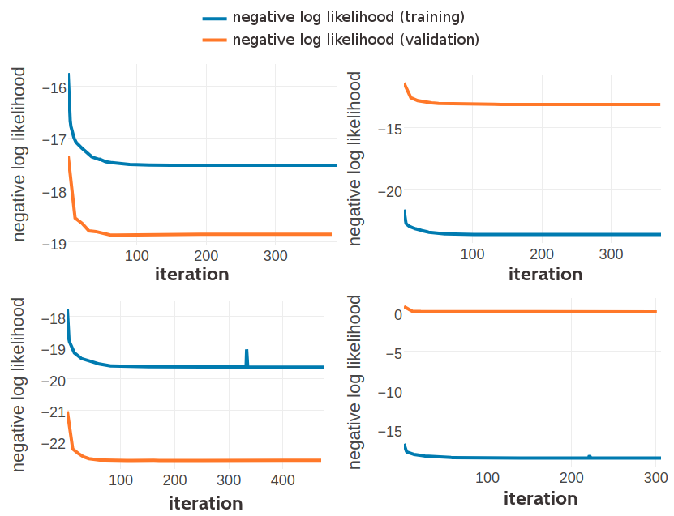
```


(ref:caption-stats-pll-3comp-10k) Statistics for the hyperparameters, $\gamma_k(\cij)$, $\muk$ and $\Lk$ obtained after 388 iterations. Trained on 10,000 residue pairs per contact class for a three component Gaussian mixture and using *pseudo-likelihood* couplings to estimate the Hessian. **Left** Component weights $\gamma_k(\cij)$ for residue pairs not in physical contact ($\cij \eq 0$) and true contacts ($\cij \eq 1$). **Center** Distribution of the 400 elements in the mean vectors $\muk$. **Right** Distribution of the 400 standard deviations corresponding to the square root of the diagonal of $\Lk^{-1}$.

```{r stats-pll-3comp-10k, echo = FALSE, out.width = '100%', fig.cap = '(ref:caption-stats-pll-3comp-10k)'}
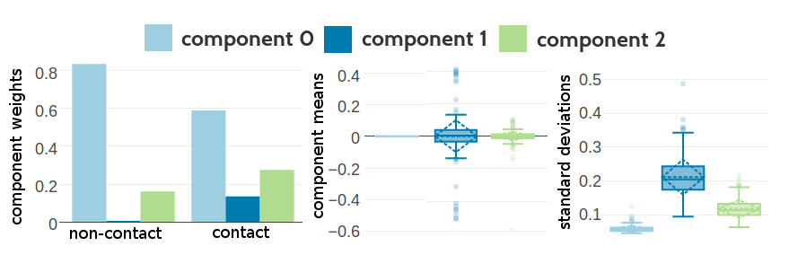
```

(ref:caption-stats-pll-3comp-100k) Statistics for the hyperparameters, $\gamma_k(\cij)$, $\muk$ and $\Lk$ obtained after 371 iterations. Trained on 100,000 residue pairs per contact class for a three component Gaussian mixture and using *pseudo-likelihood* couplings to estimate the Hessian. **Left** Component weights $\gamma_k(\cij)$ for residue pairs not in physical contact ($\cij \eq 0$) and true contacts ($\cij \eq 1$). **Center** Distribution of the 400 elements in the mean vectors $\muk$. **Right** Distribution of the 400 standard deviations corresponding to the square root of the diagonal of $\Lk^{-1}$.

```{r stats-pll-3comp-100k, echo = FALSE, out.width = '100%', fig.cap = '(ref:caption-stats-pll-3comp-100k)'}
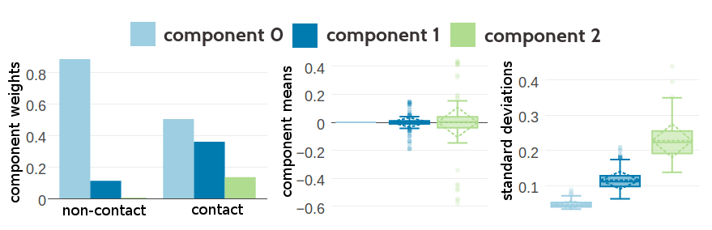
```


<!--
(ref:caption-stats-pll-3comp-500k) Statistics for the hyperparameters, $\gamma_k(\cij)$, $\muk$ and $\Lk$ obtained after 250 iterations. Trained on 500,000 residue pairs per contact class for a three component Gaussian mixture and using *pseudo-likelihood couplings* to estimate the Hessian.  **Left** Component weights $\gamma_k(\cij)$ for residue pairs not in physical contact ($\cij \eq 0$) and true contacts ($\cij \eq 1$). **Center** Distribution of the 400 elements in the mean vectors $\muk$. **Right** Distribution of the 400 standard deviations corresponding to the square root of the diagonal of $\Lk^{-1}$.

```{r stats-pll-3comp-500k, echo = FALSE, out.width = '100%', fig.cap = '(ref:caption-stats-pll-3comp-500k)'}
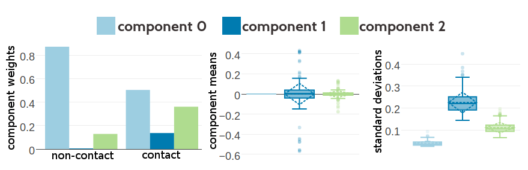
```
-->

(ref:caption-stats-cd-3comp-10k) Statistics for the hyperparameters, $\gamma_k(\cij)$, $\muk$ and $\Lk$ obtained after optimization of the likelihood function of contact states for 336 iterations. Trained on 10,000 residue pairs per contact class for a three component Gaussian mixture and using *contrastive divergence* couplings to estimate the Hessian. **Left** Component weights $\gamma_k(\cij)$ for residue pairs not in physical contact ($\cij \eq 0$) and true contacts ($\cij \eq 1$). **Center** Distribution of the 400 elements in the mean vectors $\muk$. **Right** Distribution of the 400 standard deviations corresponding to the square root of the diagonal of $\Lk^{-1}$.

```{r stats-cd-3comp-10k, echo = FALSE, out.width = '100%', fig.cap = '(ref:caption-stats-cd-3comp-10k)'}
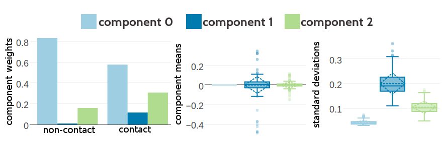
```

(ref:caption-stats-cd-3comp-100k) Statistics for the hyperparameters, $\gamma_k(\cij)$, $\muk$ and $\Lk$ obtained after optimization of the likelihood function of contact states for 377 iterations. Trained on 100,000 residue pairs per contact class for a three component Gaussian mixture and using *contrastive divergence* couplings to estimate the Hessian. **Left** Component weights $\gamma_k(\cij)$ for residue pairs not in physical contact ($\cij \eq 0$) and true contacts ($\cij \eq 1$). **Center** Distribution of the 400 elements in the mean vectors $\muk$. **Right** Distribution of the 400 standard deviations corresponding to the square root of the diagonal of $\Lk^{-1}$.

```{r stats-cd-3comp-100k, echo = FALSE, out.width = '100%', fig.cap = '(ref:caption-stats-cd-3comp-100k)'}

```

(ref:caption-vis1d-pll-3comp-100k) Visualisation of one-dimensional projections of the three-component Gaussian mixture model for the contact-dependent coupling prior. Hyperparameters, $\gamma_k(\cij)$, $\muk$ and $\Lk$, have been trained on 100,000 residue pairs per contact class and using *pseudo-likelihood* couplings to estimate the Hessian. Green solid line: Gaussian mixture for contacts. Blue solid line: Gaussian mixture for non-contacts. Black solid line: regularization prior with $\lambda_1 \eq 0.2L$ with L being protein length and assumed $L\eq150$. Light blue dashed line: Gaussian component 0. Dark blue dashed line: Gaussian component 1. Light green dashed line: Gaussian component 2.
**Top Left** One dimensional projection for pair (V,I). **Top Right** One dimensional projection for pair (F,W).  **Bottom Left** One dimensional projection for pair (E,R). **Bottom Right** One dimensional projection for pair (E,E).  

```{r vis1d-pll-3comp-100k, echo = FALSE, out.width = '100%', fig.cap = '(ref:caption-vis1d-pll-3comp-100k)'}
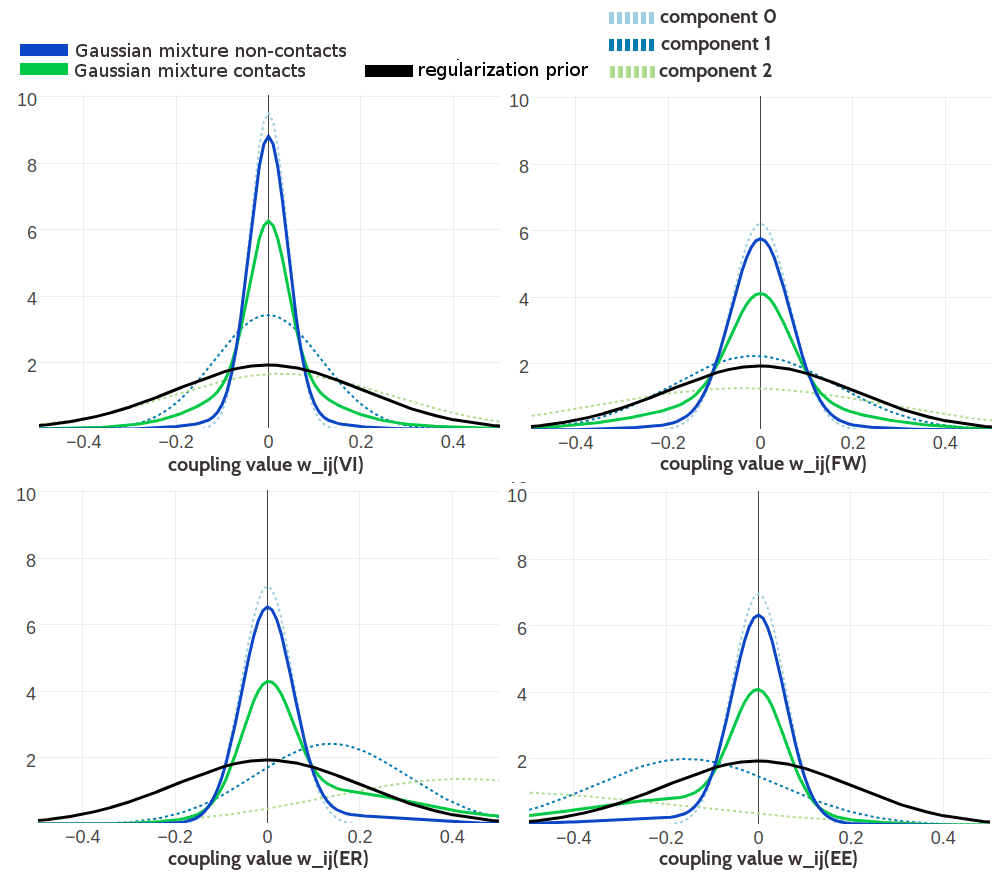
```

(ref:caption-vis1d-pll-3comp-500k) Visualisation of one-dimensional projections of the three-component Gaussian mixture model for the contact-dependent coupling prior. Hyperparameters, $\gamma_k(\cij)$, $\muk$ and $\Lk$, have been trained on 500,000 residue pairs per contact class and using *pseudo-likelihood* couplings to estimate the Hessian. Green solid line: Gaussian mixture for contacts. Blue solid line: Gaussian mixture for non-contacts. Black solid line: regularization prior with $\lambda_1 \eq 0.2L$ with L being protein length and assumed $L\eq150$. Light blue dashed line: Gaussian component 0. Dark blue dashed line: Gaussian component 1. Light Green dashed line: Gaussian component 2. **Top Left** One dimensional projection for pair (V,I). **Top Right** One dimensional projection for pair (F,W).  **Bottom Left** One dimensional projection for pair (E,R). **Bottom Right** One dimensional projection for pair (E,E).  

```{r vis1d-pll-3comp-500k, echo = FALSE, out.width = '100%', fig.cap = '(ref:caption-vis1d-pll-3comp-500k)'}
knitr::include_graphics("img/bayesian_model/pll/3/1dvis_combined_500k")
```

(ref:caption-vis1d-cd-3comp-100k) Visualisation of one-dimensional projections of the three-component Gaussian mixture model for the contact-dependent coupling prior. Hyperparameters, $\gamma_k(\cij)$, $\muk$ and $\Lk$, have been trained on 100,000 residue pairs per contact class and using *contrastive divergence* couplings to estimate the Hessian. Green solid line: Gaussian mixture for contacts. Blue solid line: Gaussian mixture for non-contacts. Black solid line: regularization prior with $\lambda_1 \eq 0.2L$ with L being protein length and assumed $L\eq150$. Light blue dashed line: Gaussian component 0. Dark blue dashed line: Gaussian component 1. Light green dashed line: Gaussian component 2.
**Top Left** One dimensional projection for pair (V,I). **Top Right** One dimensional projection for pair (F,W).  **Bottom Left** One dimensional projection for pair (E,R). **Bottom Right** One dimensional projection for pair (E,E).  

```{r vis1d-cd-3comp-100k, echo = FALSE, out.width = '100%', fig.cap = '(ref:caption-vis1d-cd-3comp-100k)'}
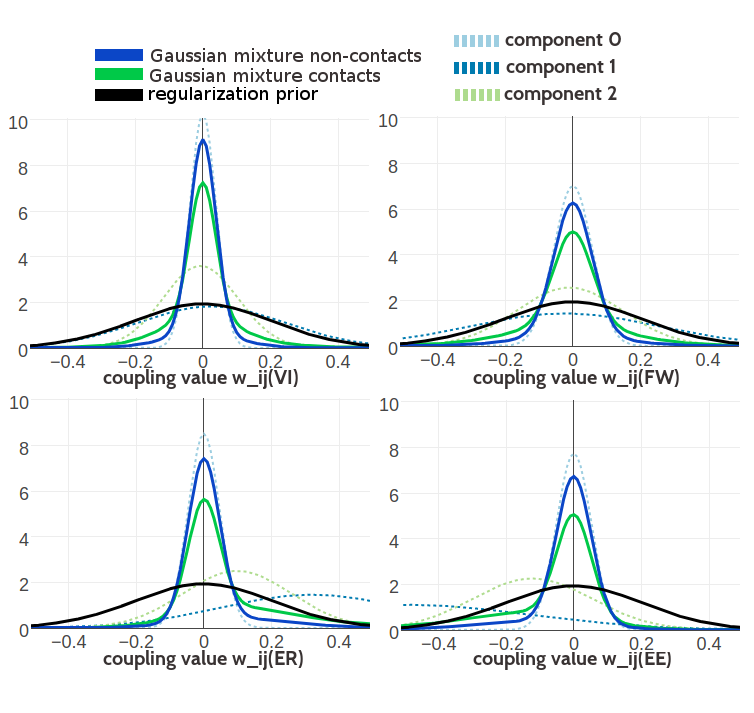
```

(ref:caption-vis2d-cd-3comp-100k) Visualisation of two-dimensional projections of the three-component Gaussian mixture model for the contact-dependent coupling prior. Hyperparameters, $\gamma_k(\cij)$, $\muk$ and $\Lk$, have been trained on 100,000 residue pairs per contact class and using *contrastive divergence* couplings to estimate the Hessian. 10,000 values have been samples from the Gaussian mixture model. Light blue: values that have been generated by zero component. Dark blue: values that have been generated by Gaussian component 1. Light green: values that have been generated by Gaussian component 3. **Top Left** Two-dimensional projection for pairs (E,R) and (R-E) for contacts (using component weight $g_k(1)$). **Top Right** Two- dimensional projection for pairs (E,E) and (R,E) for contacts (using component weight $g_k(1)$).  **Bottom Left** Two-dimensional projection for pairs (I,L) and (V,I) for contacts (using component weight $g_k(1)$). **Bottom Right** Two-dimensional projection for pair (I,L) and (V,I) for non-contacts (using component weight $g_k(0)$).  

```{r vis2d-cd-3comp-100k, echo = FALSE, out.width = '100%', fig.cap = '(ref:caption-vis2d-cd-3comp-100k)'}
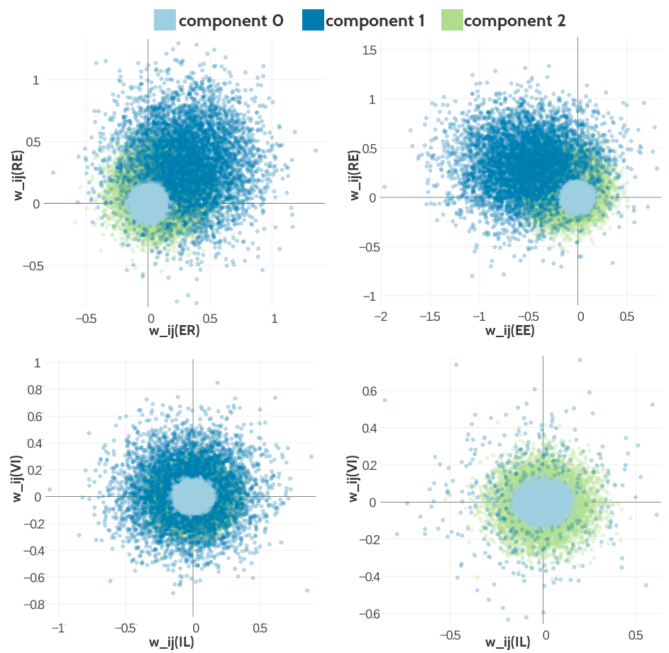
```


(ref:caption-stats-cd-5comp-100k) Statistics for the hyperparameters, $\gamma_k(\cij)$, $\muk$ and $\Lk$ obtained after 2605 iterations. Trained on 100,000 residue pairs per contact class for a five component Gaussian mixture and using *contrastive divergence* couplings to estimate the Hessian. **Left** Component weights $\gamma_k(\cij)$ for residue pairs not in physical contact ($\cij \eq 0$) and true contacts ($\cij \eq 1$). **Center** Distribution of the 400 elements in the mean vectors $\muk$. **Right** Distribution of the 400 standard deviations corresponding to the square root of the diagonal of $\Lk^{-1}$.

```{r stats-cd-5comp-100k, echo = FALSE, out.width = '100%', fig.cap = '(ref:caption-stats-cd-5comp-100k)'}
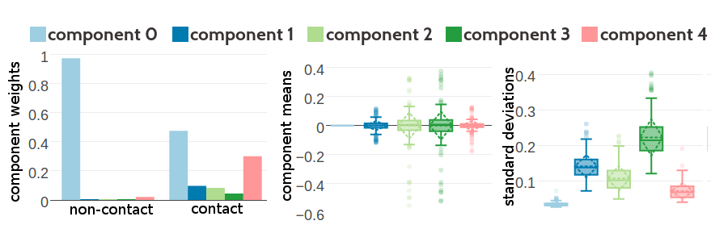
```

(ref:caption-stats-cd-5comp-300k) Statistics for the hyperparameters, $\gamma_k(\cij)$, $\muk$ and $\Lk$ obtained after 1229 iterations. Trained on 300,000 residue pairs per contact class for a five component Gaussian mixture and using *contrastive divergence* couplings to estimate the Hessian. **Left** Component weights $\gamma_k(\cij)$ for residue pairs not in physical contact ($\cij \eq 0$) and true contacts ($\cij \eq 1$). **Center** Distribution of the 400 elements in the mean vectors $\muk$. **Right** Distribution of the 400 standard deviations corresponding to the square root of the diagonal of $\Lk^{-1}$.

```{r stats-cd-5comp-300k, echo = FALSE, out.width = '100%', fig.cap = '(ref:caption-stats-cd-5comp-300k)'}
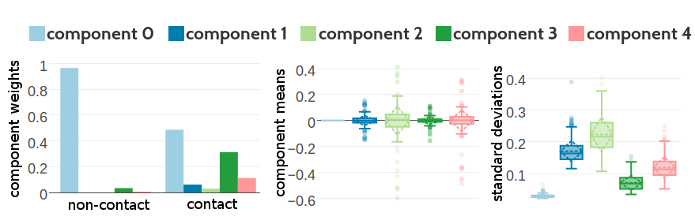
```


(ref:caption-vis1d-cd-5comp-300k) Visualisation of one-dimensional projections of the five-component Gaussian mixture model for the contact-dependent coupling prior. Hyperparameters, $\gamma_k(\cij)$, $\muk$ and $\Lk$, have been trained on 300,000 residue pairs per contact class and using *contrastive divergence* couplings to estimate the Hessian. Green solid line: Gaussian mixture for contacts. Blue solid line: Gaussian mixture for non-contacts. Black solid line: regularization prior with $\lambda_1 \eq 0.2L$ with L being protein length and assumed $L\eq150$. Light blue dashed line: Gaussian component 0. Dark blue dashed line: Gaussian component 1. Light green dashed line: Gaussian component 2. Dark green dashed line: Gaussian component 3. Light pink dashed line: Gaussian component 4.
**Top Left** One dimensional projection for pair (V,I). **Top Right** One dimensional projection for pair (F,W).  **Bottom Left** One dimensional projection for pair (E,R). **Bottom Right** One dimensional projection for pair (E,E).  

```{r vis1d-cd-5comp-300k, echo = FALSE, out.width = '100%', fig.cap = '(ref:caption-vis1d-cd-5comp-300k)'}
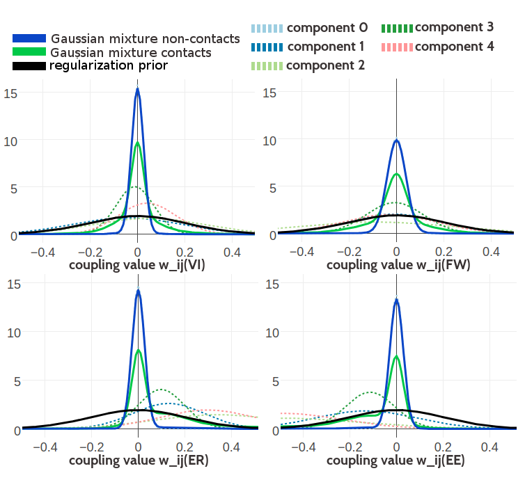
```

(ref:caption-vis2d-cd-5comp-300k) Visualisation of two-dimensional projections of the five-component Gaussian mixture model for the contact-dependent coupling prior. Hyperparameters, $\gamma_k(\cij)$, $\muk$ and $\Lk$, have been trained on 300,000 residue pairs per contact class and using *contrastive divergence* couplings to estimate the Hessian. 10,000 values have been samples from the Gaussian mixture model. Light blue: values that have been generated by zero component. Dark blue: values that have been generated by Gaussian component 1. Light green: values that have been generated by Gaussian component 3. Dark green: values that have been generated by Gaussian component 4. Light pink: values that have been generated by Gaussian component 4. **Top Left** Two-dimensional projection for pairs (E,R) and (R-E) for contacts (using component weight $g_k(1)$). **Top Right** Two- dimensional projection for pairs (E,E) and (R,E) for contacts (using component weight $g_k(1)$).  **Bottom Left** Two-dimensional projection for pairs (I,L) and (V,I) for contacts (using component weight $g_k(1)$). **Bottom Right** Two-dimensional projection for pair (I,L) and (V,I) for non-contacts (using component weight $g_k(0)$).  

```{r vis2d-cd-5comp-300k, echo = FALSE, out.width = '100%', fig.cap = '(ref:caption-vis2d-cd-5comp-300k)'}
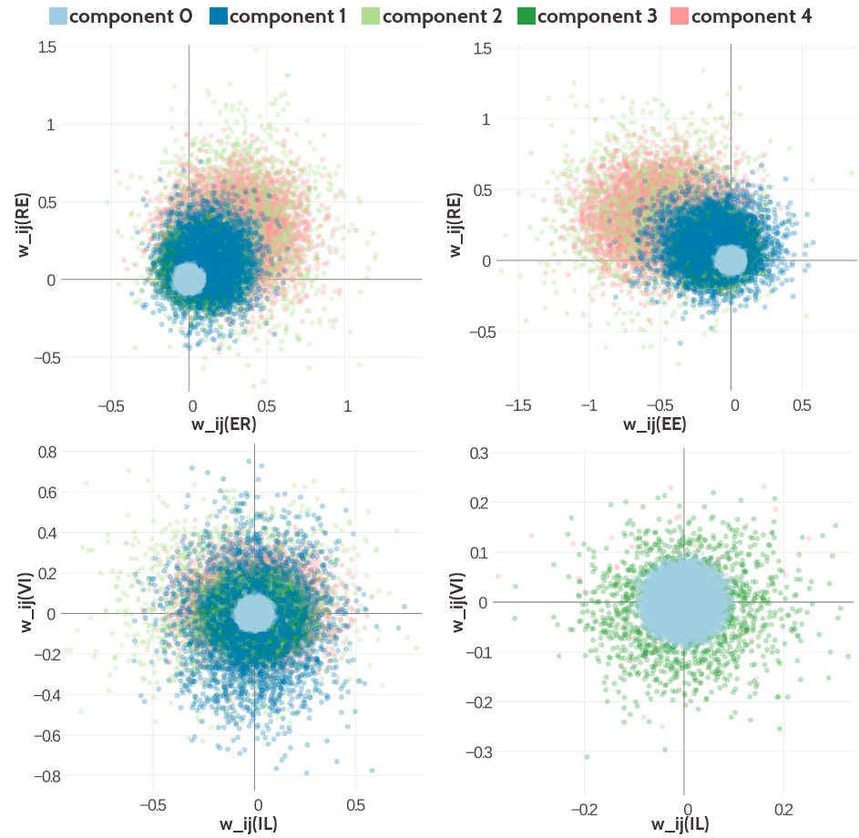
```


(ref:caption-precision-bayesian-model-pll-3comp-ncthr) Mean precision for top ranked contact predictions over 500 proteins. Posterior probabilities of contacts have been computed with the Bayesian model using a three component Gaussian mixture coupling prior. Hyperparameters for the coupling prior have been trained on different dataset sizes as specified in the legende.  Furthermore residue pairs not in physical contact are defined either by $\Cb$ distances $>8\angstrom$ or $>25\angstrom$. **Bayesian Posterior 100k 8A**: Bayesian model trained on 100,000 residue pairs per class and non-contacts defined by an $8 \angstrom$ distance threshold. **Bayesian Posterior 100k 25A**: Bayesian model trained on 100,000 residue pairs per class and non-contacts defined by an $25 \angstrom$ distance threshold. **Bayesian Posterior 300k 8A**: Bayesian model trained on 100,000 residue pairs per class and non-contacts defined by an $8 \angstrom$ distance threshold. **Bayesian Posterior 300k 25A**: Bayesian model trained on 100,000 residue pairs per class and non-contacts defined by an $25 \angstrom$ distance threshold. **Bayesian Posterior 100k, non-contacts 5 **: Bayesian model trained on 100,000 contacts and 500,000 non-contacts with non-contacts defined by an $25 \angstrom$ distance threshold. 


```{r precision-bayesian-model-pll-3comp-ncthr, echo = FALSE, screenshot.alt="img/bayesian_model/benchmark/precision_vs_rank_pll_3comp_ncthr.png", out.width = '90%', fig.align='center', fig.cap = '(ref:caption-precision-bayesian-model-pll-3comp-ncthr)'}
knitr::include_url("img/bayesian_model/benchmark/precision_vs_rank_pll_3comp_ncthr.html", height = "500px")
```

(ref:caption-precision-bayesian-model-cd-3comp) Mean precision for top ranked contact predictions over 500 proteins. Bayesian models are based on couplings computed with *contrastive divergence*. **random forest (pLL)** random forest model trained on sequence features and and additional pseudo-likelihood contact score feature. **Bayesian Posterior 100k**: Bayesian model computing the posterior probability of contacts with a three component Gaussian mixture coupling prior. Hyperparameters for the coupling prior have been trained on 100,000 residue pairs per contact class. **Bayesian Posterior 300k**: Bayesian model computing the posterior probability of contacts with a three component Gaussian mixture coupling prior. Hyperparameters for the coupling prior have been trained on 300,000 residue pairs per contact class. **Bayesian Posterior 500k**: Bayesian model computing the posterior probability of contacts with a three component Gaussian mixture coupling prior. Hyperparameters for the coupling prior have been trained on 500,000 residue pairs per contact class. **pseudo-likelihood**: contact score is computed as [APC](#abbrev) corrected Frobenius norm of the couplings computed from pseudo-likelihood. 

```{r precision-bayesian-model-cd-3comp, echo = FALSE, screenshot.alt="img/bayesian_model/benchmark/precision_vs_rank_cd_3comp_all_datasets.png", out.width = '90%', fig.align='center', fig.cap = '(ref:caption-precision-bayesian-model-cd-3comp)'}
knitr::include_url("img/bayesian_model/benchmark/precision_vs_rank_cd_3comp_all_datasets.html", height = "500px")
```

(ref:caption-precision-bayesian-model-cd-100k) Mean precision for top ranked contact predictions over 500 proteins. Bayesian models are based on couplings computed with *contrastive divergence*. **random forest (pLL)** random forest model trained on sequence features and and additional pseudo-likelihood contact score feature. **Bayesian Posterior 3**: Bayesian model computing the posterior probability of contacts with a three component Gaussian mixture coupling prior. Hyperparameters for the coupling prior have been trained on 100,000 residue pairs per contact class. **Bayesian Posterior 5**: Bayesian model computing the posterior probability of contacts with a five component Gaussian mixture coupling prior. Hyperparameters for the coupling prior have been trained on 100,000 residue pairs per contact class. **Bayesian Posterior 10**: Bayesian model computing the posterior probability of contacts with a ten component Gaussian mixture coupling prior. Hyperparameters for the coupling prior have been trained on 100,000 residue pairs per contact class.  **pseudo-likelihood**: contact score is computed as [APC](#abbrev) corrected Frobenius norm of the couplings computed from pseudo-likelihood.

```{r precision-bayesian-model-cd-100k, echo = FALSE, screenshot.alt="img/bayesian_model/benchmark/precision_vs_rank_cd_100k_allcomponents.png", out.width = '90%', fig.align='center', fig.cap = '(ref:caption-precision-bayesian-model-cd-100k)'}
knitr::include_url("img/bayesian_model/benchmark/precision_vs_rank_cd_100k_allcomponents.html", height = "500px")
```


