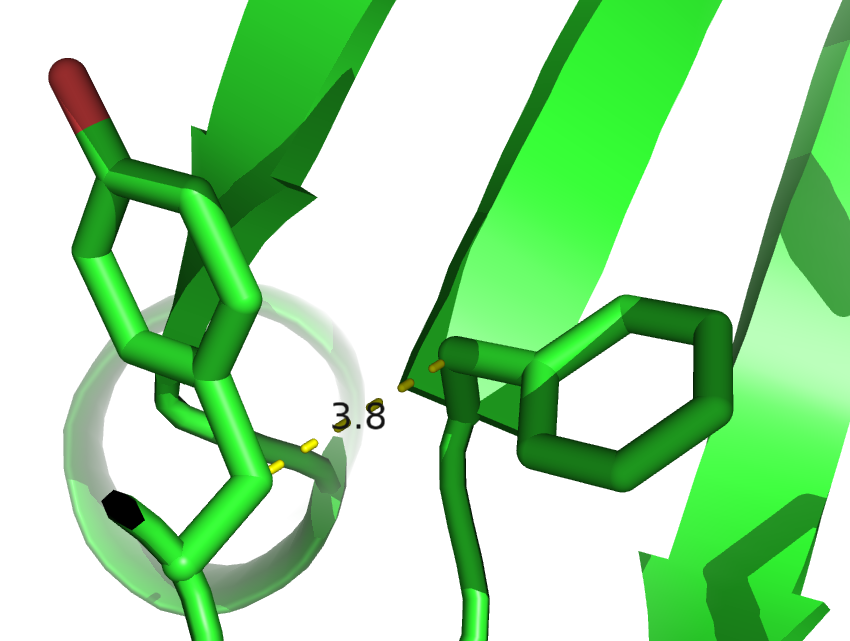

# (APPENDIX) Appendix {-} 

# Abbreviations {#abbrev}


**APC** Avarage Product Correction

**CASP** Critical Assessment of protein Structure Prediction

**CD** Contrastive Divergence

**DCA** Direct Coupling Analysis

**DI** Direct Information

**EM** electron microscopy

**IDP** intrinsically disordered proteins

**MAP** Maximum a posteriori

**MCMC** Markov Chain Monte Carlo

**MI** mutual information

**ML** Maximum-Likelihood

**MLE** Maximum-Likelihood Estimate

**MRF** Markov-Random Field

**MSA** Multiple Sequence Alignment

**Neff** Number of effective sequences

**PCD** Persistent Contrastive Divergence

**PDB** protein data bank

**SGD** stochastic gradient descent


# Amino Acid Alphabet {#amino-acids}

\blandscape

| One letter Code | Three letter Code | Amino Acid | Physico-chemical properties | 
|:---:|:------:|----------:|:-------------|
| A | Ala | **A**lanine         | tiny, hydrophobic                     |
| C | Cys | **C**ysteine        | small, hydrophobic, polar ($C_{S-H}$) |
| D | Asp | Aspartic Aci**D**   | small, negatively charged, polar      |
| E | Glu | Glutamic Acid       | negatively charged, polar             |
| F | Phe | Phenylalanine       | aromatic, hydrophobic                 |
| G | Gly | **G**lycine         | tiny, hydrophobic                     |
| H | His | **H**istidine       | hydrophobic, aromatic, polar, (positively charged)  |
| I | Ile | **I**soleucine      | aliphatic, hydrophobic                |
| K | Lys | Lysine              | positively charged, polar             |
| L | Leu | **L**eucine         | aliphatic, hydrophobic                |
| M | Met | **M**ethionine      | hydrophobic                           |
| N | Asn | Asparagi**N**e      | small, polar                          |
| P | Pro | **P**roline         | small                                 |
| Q | Gln | Glutamine           | tiny, hydrophobic                     |
| R | Arg | A**R**ginine        | positively charged, polar             |
| S | Ser | **S**erine          | tiny, polar                           |
| T | Thr | **T**hreonine       | hydrophobic, polar                    |
| V | Val | **V**aline          | small, aliphatic                      |
| W | Trp | **T**ryptophan      | aromatic, hydrophobic, polar          |
| Y | Tyr | T**Y**rosine        | aromatic, hydrophobic, polar          |
:(#tab:amino-acid-prop) Amino acid abbreviations and physico-chemical properties according to Livingstone et al., 1993 [@Livingstone1993]

\elandscape

# Dataset Properties

The following figures display various statistics about the dataset used throughout this thesis. 
See section \@ref(dataset) for information on how this dataset has been generated. 


(ref:caption-dataset-diversity) Distribution of alignment diversity ($=\sqrt(\frac{N}{L})$) in the dataset and its ten subsets.

```{r dataset-diversity, echo = FALSE, screenshot.alt="img/dataset_statistics/diversity_dataset_boxplot_notitle.png", out.width = '100%', fig.align='center', fig.cap = '(ref:caption-dataset-diversity)'}
knitr::include_url("img/dataset_statistics/diversity_dataset_boxplot_notitle.html")
```

(ref:caption-gaps) Distribution of gap percentage of alignments in the dataset and its ten subsets.

```{r dataset-gaps, echo = FALSE, screenshot.alt="img/dataset_statistics/gap_percentage_boxplot_notitle.png", out.width = '100%', fig.align='center', fig.cap = '(ref:caption-gaps)'}
knitr::include_url("img/dataset_statistics/gap_percentage_boxplot_notitle.html")
```


(ref:caption-alignment-size) Distribution of alignment size (number of sequences N) in the dataset and its ten subsets.

```{r dataset-alignment-size, echo = FALSE, screenshot.alt="img/dataset_statistics/msa_size_dataset_boxplot_notitle.png", out.width = '100%', fig.align='center', fig.cap = '(ref:caption-alignment-size)'}
knitr::include_url("img/dataset_statistics/msa_size_dataset_boxplot_notitle.html")
```

(ref:caption-protein-length) Distribution of protein length L in the dataset and its ten subsets.

```{r dataset-protein-length, echo = FALSE, screenshot.alt="img/dataset_statistics/protein_length_dataset_boxplot_notitle.png", out.width = '100%', fig.align='center', fig.cap = '(ref:caption-protein-length)'}
knitr::include_url("img/dataset_statistics/protein_length_dataset_boxplot_notitle.html")
```


# Standard Deviation of Couplings for Noncontacts


(ref:caption-stdev-squared-couplings-noncontacts) Standard deviation of squared coupling values ${\wijab}^2$ for residue pairs not in physical contact ($\Delta \Cb > 25 \angstrom$). Dataset contains 100.000 residue pairs per class (for details see methods section \@ref(method-coupling-correlation)). Amino acids are abbreviated with one-letter code and they are broadly grouped with respect to physico-chemical properties listed in Appendix \@ref(amino-acids)

```{r stdev-squared-couplings-noncontacts, echo = FALSE, screenshot.alt="img/coupling_matrix_analysis/stdev_squared_couplings_noncontacts_heatmap_notitle.png", out.width = '100%', fig.cap = '(ref:caption-stdev-squared-couplings-noncontacts)'}
knitr::include_url("img/coupling_matrix_analysis/stdev_squared_couplings_noncontacts_heatmap_notitle.html", height="500px")
```


(ref:caption-stdev-raw-couplings-noncontacts) Standard deviation of coupling values $\wijab$ for residue pairs not in physical contact ($\Delta \Cb > 25 \angstrom$). Dataset contains 100.000 residue pairs per class (for details see section \@ref(method-coupling-correlation)). Amino acids are abbreviated with one-letter code and they are broadly grouped with respect to physico-chemical properties listed in Appendix \@ref(amino-acids).

```{r stdev-raw-couplings-noncontacts, echo = FALSE, screenshot.alt="img/coupling_matrix_analysis/stdev_couplings_noncontacts_heatmap_notitle.png", out.width = '100%', fig.cap = '(ref:caption-stdev-raw-couplings-noncontacts)'}
knitr::include_url("img/coupling_matrix_analysis/stdev_couplings_noncontacts_heatmap_notitle.html", height="500px")
```


# Amino Acid Interaction Preferences Reflected in Coupling Matrices

## Pi-Cation interactions {#pi-cation}

Figure \@ref(fig:coupling-matrix-pication-pymol) shows a Tyrosine and a Lysine residue forming a cation-$\pi$ interaction in protein 2ayd.
The corresponding coupling matrix in figure \@ref(fig:coupling-matrix-pication-interaction) reflects the strong interaction preference. 

(ref:caption-coupling-matrix-pication-pymol) Tyrosine (residue 37) and Lysine (residue 48) forming a cation-$\pi$ interaction in protein 2ayd.

```{r coupling-matrix-pication-pymol, echo = FALSE, out.width = '50%', fig.show = 'hold', fig.cap = '(ref:caption-coupling-matrix-pication-pymol)'}
knitr::include_graphics("img/coupling_matrix_analysis/2ayda01_37_48.png")
```

<!--

(ref:caption-coupling-matrix-pication-interaction) Coupling Matrix for residue pair i=37 and j=48 of PDB 2ayd chain A domain 1. Size of the bubbles represents coupling strength and color represents the direction of coupling: red = positive coupling, blue = negative coupling. Bars at the x-axis represent single potentials for residue i=37 and bars at the y-axis represent single potentials for residue j=48. Height of the bars represents potential strength and color represents positive (red) and negative (blue) values.

```{r coupling-matrix-pication-interaction, echo = FALSE, screenshot.alt="img/amino_acid_physico_chemical_properties_venn_diagramm.png", out.width='100%', fig.cap = '(ref:caption-coupling-matrix-pication-interaction)'}
knitr::include_url("img/coupling_matrix_analysis/coupling_matrix_2aydA01_37_48_notitle.html", height = "750px")
```

-->

## Disulfide Bonds {#disulfide}

Figure \@ref(fig:coupling-matrix-disulfide-pymol) shows two cysteine residues forming a covalent disulfide bond in protein 1alu.
The corresponding coupling matrix in figure \@ref(fig:coupling-matrix-disulfide-interaction) reflects the strong interaction preference of cysteines. 

(ref:caption-coupling-matrix-disulfide-pymol) Two cystein residues (residues 54 and 64) forming a covalent disulfide bond in protein 1alu.

```{r coupling-matrix-disulfide-pymol, echo = FALSE, out.width = '50%', fig.cap = '(ref:caption-coupling-matrix-disulfide-pymol)'}
knitr::include_graphics("img/coupling_matrix_analysis/1aluA00_54_64.png")
```

<!--

(ref:caption-coupling-matrix-disulfide-interaction) Coupling Matrix for residue pair i=54 and j=64 of PDB 1alu chain A. Size of the bubbles represents coupling strength and color represents the direction of coupling: red = positive coupling, blue = negative coupling. Bars at the x-axis represent single potentials for residue i=54 and bars at the y-axis represent single potentials for residue j=64. Height of the bars represents potential strength and color represents positive (red) and negative (blue) values.

```{r coupling-matrix-disulfide-interaction, echo = FALSE, screenshot.alt="img/amino_acid_physico_chemical_properties_venn_diagramm.png", out.width='100%', fig.cap = '(ref:caption-coupling-matrix-disulfide-interaction)'}
knitr::include_url("img/coupling_matrix_analysis/coupling_matrix_1aluA00_54_64_notitle.html", height = "750px")
```

-->

## Aromatic-Proline Interactions {#aromatic-proline}

Figure \@ref(fig:coupling-matrix-aromatic-proline-pymol) shows a proline and a tryptophan residue forming such a CH/$\pi$ interaction in protein 1aol.
The corresponding coupling matrix in figure \@ref(fig:coupling-matrix-aromatic-proline) reflects this interaction with strong positive coupling between proline and tryptophan. 


(ref:caption-coupling-matrix-aromatic-proline-pymol) Proline and tryptophan (residues 17 and 34) stacked on top of each otherengaging in a CH/$\pi$ interaction in protein chain 1aol_A_00.

```{r coupling-matrix-aromatic-proline-pymol, echo = FALSE, out.width = '50%', fig.cap = '(ref:caption-coupling-matrix-aromatic-proline-pymol)'}
knitr::include_graphics("img/coupling_matrix_analysis/1aolA00_17_34.png")
```


<!--

(ref:caption-coupling-matrix-aromatic-proline) Coupling Matrix for residue pair i=17 and j=34 of PDB 1aol chain A. Size of the bubbles represents coupling strength and color represents the direction of coupling: red = positive coupling, blue = negative coupling. Bars at the x-axis represent single potentials for residue i=17 and bars at the y-axis represent single potentials for residue j=34. Height of the bars represents potential strength and color represents positive (red) and negative (blue) values.

```{r coupling-matrix-aromatic-proline, echo = FALSE, screenshot.alt="img/amino_acid_physico_chemical_properties_venn_diagramm.png", out.width='100%', fig.cap = '(ref:caption-coupling-matrix-aromatic-proline)'}
knitr::include_url("img/coupling_matrix_analysis/coupling_matrix_1aolA00_17_34_notitle.html", height = "750px")
```

--> 

## Network-like structure of aromatic residues {#aromatic-network}

(ref:caption-aromatic-network) Network-like structure of aromatic residues in the protein core. 80% of aromatic residues are involved in such networks that are important for protein stability [@Burley1985].

```{r aromatic-network, echo = FALSE, out.width = '50%', fig.cap = '(ref:caption-aromatic-network)'}
knitr::include_graphics("img/coupling_matrix_analysis/aromatic_bundle.png")
```

## Aromatic Sidechains at small $Cb$-$\Cb$ distances {#aromatic-small-distances}

(ref:caption-aromatic-residues-at-short-distances) The planar ring system of aromatic sidechains at short $\Cb$-$\Cb$ distances (e.g. $\Delta \Cb < 5 \angstrom$) often points away from each other to avoid steric hindrance.

```{r aromatic-residues-at-short-distances, echo = FALSE, out.width = '50%', fig.cap = '(ref:caption-aromatic-residues-at-short-distances)'}

```


# Optimizing Full Likelihood with Gradient Descent

## Defining the initial learning rate as a function of Neff

(ref:caption-performance-cd-alphaopt-0)  Mean precision for top ranked contact predictions over 300 proteins. Contact scores are computed as the [APC](#abbrev) corrected Frobenius norm of the couplings $\wij$.  **pseudo-likelihood**:  couplings computed with pseudo-likelihood. **CD alpha0 = 5e-4**: couplings computed with [CD](#abbrev) using stochastic gradient descent with initial learning rate, $\alpha_0 \eq 5e-4$. **CD alpha0 = 1e-3**: couplings computed with [CD](#abbrev) using stochastic gradient descent with initial learning rate, $\alpha_0 \eq 1e-3$. **CD alpha0 = 5e-2Neff^-0.5**: couplings computed with [CD](#abbrev) using stochastic gradient descent with initial learning rate defined as a function of [Neff](#abbrev), $\alpha_0 \eq \frac{5e-2}{\sqrt{N_{\text{eff}}}}$. 

```{r performance-cd-alphaopt-0, echo = FALSE, screenshot.alt="img/full_likelihood/appendix/precision_vs_rank_learningrates_comparealpha0.png", out.width = '85%', fig.align='center', fig.cap = '(ref:caption-performance-cd-alphaopt-0)'}
knitr::include_url("img/full_likelihood/appendix/precision_vs_rank_learningrates_comparealpha0.html", height = "500px")
```


## Visualisation of learning rate schedules

(ref:caption-learning-rate-schedules) Value of learning rate against the number of iterations for different learning rate schedules. Red legend group represents the **exponential** learning rate schedule $\alpha_{t+1}  = \alpha_0 \cdot\exp(- \gamma t)$. Blue legend group represents the **linear** learning rate schedule $\alpha  = \alpha_0 / (1 + \gamma \cdot t)$. Green legend group represents the **sigmoidal** learning rate schedule $\alpha_{t+1}  = \alpha_{t} / (1 + \gamma \cdot t)$. Purple legend group represents the **square root** learning rate schedule $\alpha  = \alpha_0 / \sqrt{1 + \gamma \cdot t}$. The initial learning rate $\alpha_0$ is set to 1e-4, the iteration number is given by $t$ and $\gamma$ is the decay rate and its value is given in brackets in the legend.

```{r learning-rate-schedules, echo = FALSE, screenshot.alt="img/full_likelihood/appendix/learning_rate_schedules_alpha0_1e-4_notitle.png", out.width = '100%', fig.align='center', fig.cap = '(ref:caption-learning-rate-schedules)'}
knitr::include_url("img/full_likelihood/appendix/learning_rate_schedules_alpha0_1e-4_notitle.html", height = "500px")
```

## Benchmarking learning rate schedules {#benchmark-learning-rate-annealing-schedules}

The following figures show the mean precision over the validation set for contacts computed from [CD](#abbrev) with stochastic gradient descent and using different learning rate annealing schedules

(ref:caption-performance-cd-linschedule) Mean precision for top ranked contact predictions over 300 proteins. Contact scores are computed as the [APC](#abbrev) corrected Frobenius norm of the couplings $\wij$. pseudo-likelihood: contact scores computed from pseudo-likelihood. The other methods derive contact scores from couplings computed from [CD](#abbrev) using stochastic gradient descent with an initial learning rate defined with respect to [Neff](#abbrev) and a *linear* learning rate annealing schedule $\alpha  = \frac{\alpha_0}{1 + \gamma t}$ with decay rate $\gamma$ as specified in the legend.

```{r performance-cd-linschedule, echo = FALSE, screenshot.alt="img/full_likelihood/appendix/precision_vs_rank_alpha0_0_lin_decayrate.png", out.width = '85%', fig.align='center', fig.cap = '(ref:caption-performance-cd-linschedule)'}
knitr::include_url("img/full_likelihood/appendix/precision_vs_rank_alpha0_0_lin_decayrate.html", height = "500px")
```

(ref:caption-performance-cd-sigschedule) Mean precision for top ranked contact predictions over 300 proteins. Contact scores are computed as the [APC](#abbrev) corrected Frobenius norm of the couplings $\wij$. pseudo-likelihood: contact scores computed from pseudo-likelihood. The other methods derive contact scores from couplings computed from [CD](#abbrev) using stochastic gradient descent with an initial learning rate defined with respect to [Neff](#abbrev) and a *sigmoidal* learning rate annealing schedule $\alpha_{t+1}  = \frac{\alpha_{t}}{1 + \gamma t}$ with t being the iteration number and decay rate $\gamma$ as specified in the legend.

```{r performance-cd-sigschedule, echo = FALSE, screenshot.alt="img/full_likelihood/appendix/precision_vs_rank_alpha0_0_sig_decayrate.png", out.width = '85%', fig.align='center', fig.cap = '(ref:caption-performance-cd-sigschedule)'}
knitr::include_url("img/full_likelihood/appendix/precision_vs_rank_alpha0_0_sig_decayrate.html", height = "500px")
```

(ref:caption-performance-cd-sqrtschedule) Mean precision for top ranked contact predictions over 300 proteins. Contact scores are computed as the [APC](#abbrev) corrected Frobenius norm of the couplings $\wij$. pseudo-likelihood: contact scores computed from pseudo-likelihood. The other methods derive contact scores from couplings computed from [CD](#abbrev) using stochastic gradient descent with an initial learning rate defined with respect to [Neff](#abbrev) and a *square root* learning rate annealing schedule $\alpha  = \frac{\alpha_0}{\sqrt{1 + \gamma t}}$ with t being the iteration number and decay rate $\gamma$ as specified in the legend.

```{r performance-cd-sqrtschedule, echo = FALSE, screenshot.alt="img/full_likelihood/appendix/precision_vs_rank_alpha0_0_sqrt_decayrate.png", out.width = '85%', fig.align='center', fig.cap = '(ref:caption-performance-cd-sqrtschedule)'}
knitr::include_url("img/full_likelihood/appendix/precision_vs_rank_alpha0_0_sqrt_decayrate.html", height = "500px")
```


(ref:caption-performance-cd-expschedule) Mean precision for top ranked contact predictions over 300 proteins. Contact scores are computed as the [APC](#abbrev) corrected Frobenius norm of the couplings $\wij$. pseudo-likelihood: contact scores computed from pseudo-likelihood. The other methods derive contact scores from couplings computed from [CD](#abbrev) using stochastic gradient descent with an initial learning rate defined with respect to [Neff](#abbrev) and a *exponential* learning rate annealing schedule $\alpha  = \alpha_0 \cdot\exp(- \gamma t)$ with t being the iteration number and decay rate $\gamma$ as specified in the legend.

```{r performance-cd-expschedule, echo = FALSE, screenshot.alt="img/full_likelihood/appendix/precision_vs_rank_alpha0_0_exp_decayrate.png", out.width = '85%', fig.align='center', fig.cap = '(ref:caption-performance-cd-expschedule)'}
knitr::include_url("img/full_likelihood/appendix/precision_vs_rank_alpha0_0_exp_decayrate.html", height = "500px")
```


## Number of iterations until convergence for different learning rate schedules {#learning-rate-schedules-distribution-iterations}

The following Figures show the distribution of the number of iterations until convergence over the validation dataset for stochastic gradient descent optimization of [CD](#abbev) for different learning rate annealing schedules.

(ref:caption-cd-numit-lin-learning-rate-schedule) Distribution of the number of iterations until convergence for stochastic gradient descent optimizations of the full likelihood using different decay rates with a **linear** learning rate schedule $\alpha = \alpha_0 / (1 + \gamma  t)$ with $t$ being the iteration number and the decay rate $\gamma$ is specified in the legend. Initial learning rate $\alpha_0$ defined with respect to [Neff](#abbrev) and maximum number of iterations is set to 5000. 

```{r cd-numit-lin-learning-rate-schedule, echo = FALSE, screenshot.alt="img/full_likelihood/appendix/distribution_numiterations_against_linear_learningrate_schedule.png", out.width='90%', fig.align='center', fig.cap = '(ref:caption-cd-numit-lin-learning-rate-schedule)'}
knitr::include_url("img/full_likelihood/appendix/distribution_numiterations_against_linear_learningrate_schedule.html", height = "500px")
```


(ref:caption-cd-numit-sig-learning-rate-schedule) Distribution of the number of iterations until convergence for stochastic gradient descent optimizations of the full likelihood using different decay rates with a **sigmoidal** learning rate schedule $\alpha_{t+1}  = \alpha_{t} / (1 + \gamma  t)$  with $t$ being the iteration number and the decay rate $\gamma$ is specified in the legend. Initial learning rate $\alpha_0$ defined with respect to [Neff](#abbrev) and maximum number of iterations is set to 5000. 

```{r cd-numit-sig-learning-rate-schedule, echo = FALSE, screenshot.alt="img/full_likelihood/appendix/distribution_numiterations_against_sigmoidal_learningrate_schedule.png", out.width='90%', fig.align='center', fig.cap = '(ref:caption-cd-numit-sig-learning-rate-schedule)'}
knitr::include_url("img/full_likelihood/appendix/distribution_numiterations_against_sigmoidal_learningrate_schedule.html", height = "500px")
```


(ref:caption-cd-numit-sqrt-learning-rate-schedule) Distribution of the number of iterations until convergence for stochastic gradient descent optimizations of the full likelihood using different decay rates with a **square root** learning rate schedule $\alpha  = \alpha_0 / \sqrt{1 + \gamma t}$ with $t$ being the iteration number and the decay rate  $\gamma$ is specified in the legend. Initial learning rate $\alpha_0$ defined with respect to [Neff](#abbrev) and maximum number of iterations is set to 5000. 

```{r cd-numit-sqrt-learning-rate-schedule, echo = FALSE, screenshot.alt="img/full_likelihood/appendix/distribution_numiterations_against_sqrt_learningrate_schedule.png", out.width='90%', fig.align='center', fig.cap = '(ref:caption-cd-numit-sqrt-learning-rate-schedule)'}
knitr::include_url("img/full_likelihood/appendix/distribution_numiterations_against_sqrt_learningrate_schedule.html", height = "500px")
```


(ref:caption-cd-numit-exp-learning-rate-schedule) Distribution of the number of iterations until convergence for stochastic gradient descent optimizations of the full likelihood using different decay rates with an **exponential** learning rate schedule $\alpha  = \alpha_0 \cdot\exp(- \gamma t)$ with $t$ being the iteration number and the decay rate $\gamma$ is specified in the legend. Initial learning rate $\alpha_0$ defined with respect to [Neff](#abbrev) and maximum number of iterations is set to 5000. 

```{r cd-numit-exp-learning-rate-schedule, echo = FALSE, screenshot.alt="img/full_likelihood/appendix/distribution_numiterations_against_exponential_learningrate_schedule.png", out.width='90%', fig.align='center', fig.cap = '(ref:caption-cd-numit-exp-learning-rate-schedule)'}
knitr::include_url("img/full_likelihood/appendix/distribution_numiterations_against_exponential_learningrate_schedule.html", height = "500px")
```


## Modifying Number of Iterations over which Relative Change of Coupling Norm is Evaluated  

(ref:caption-numit-convergence-convergence-prev) Distribution of the number of iterations until convergence for gradient descent optimizations of the full likelihood. The relative change of the L2 norm over coupling parameters, $||\w||_2$, is evaluated over a defined number of previous iterations and is specified in the legend. Convergence is assumed when the relative change falls below a small value $\epsilon \eq 1e-8$. The optimal hyperparameters settings for [SGD](#abbrev) as described in section \@ref(sgd-hyperparameter-tuning) have been used. 


```{r numit-convergence-convergence-prev, echo = FALSE, screenshot.alt="img/full_likelihood/appendix/distribution_numiterations_against_convergence_prev.png", out.width='85%', fig.align='center', fig.cap = '(ref:caption-numit-convergence-convergence-prev)'}
knitr::include_url("img/full_likelihood/appendix/distribution_numiterations_against_convergence_prev.html", height = "500px")
```

## Fix single potentials at maximum-likelihood estimate v*

(ref:caption-full-likelihood-opt-fixv) Mean precision for top ranked contact predictions over 300 proteins. Contact scores are computed as the [APC](#abbrev) corrected Frobenius norm of the couplings $\wij$. [SGD](#abbrev) settings for [CD](#abbrev) optimization are as follows: sigmoidal learning rate schedule with decay rate $\gamma = \mathrm{5e-6}$ and initial learning rate $\alpha_0 \eq \mathrm{5e-2}/N_{\textrm{eff}}$. **pseudo-likelihood**:  contact scores computed from pseudo-likelihood. **CD fixed v at v* **: contact scores computed from [CD](#abbrev) with [SGD](#abbrev) and single potentials $\v$ are not optimized but fixed at $\v^*$ as given in eq. \@ref(eq:prior-v). **CD lambda_v = 10**: contact scores computed from [CD](#abbrev) with [SGD](#abbrev) and single potentials $\v$ are subject to optimization using L2-reglarization with $\lambda_v \eq 10$.


```{r full-likelihood-opt-fixv, echo = FALSE, screenshot.alt="img/full_likelihood/appendix/precision_vs_rank_fixed_v.png", out.width='90%', fig.align='center', fig.cap = '(ref:caption-full-likelihood-opt-fixv)'}
knitr::include_url("img/full_likelihood/appendix/precision_vs_rank_fixed_v.html", height = "500px")
```

## Monitoring Optimization for Protein 1aho for Different Sample Sizes

(ref:caption-cd-samplesize-protein1ahoa00) Monitoring parameter norm and gradient norm for protein 1ahoA00 during [SGD](#abbrev) optimization of [CD](#abbrev) using different sample sizes. Protein 1ahoA00 has length L=64 and 378 sequences in the alignment ([Neff](#abbrev)=229). The number of sequences, that is used for Gibbs sampling to approximate the gradient, is given in the legend with 1L = 64 sequences, 5L = 320 sequences, 10L = min(10L, N) = 378 sequences, 0.2Neff = 46 sequences, 0.3Neff = 69 sequences, 0.4Neff = 92 sequences.  **Left** L2-norm of the gradients for coupling parameters, $||\nabla_{\w} L\!L(\v^*, \w)||_2$ (without contribution of regularizer).  **Right** L2-norm of the coupling parameters $||\w||_2$.

```{r cd-samplesize-protein1ahoa00, echo = FALSE, out.width = '100%', fig.align='center', fig.cap = '(ref:caption-cd-samplesize-protein1ahoa00)'}
knitr::include_graphics("img/full_likelihood/appendix/1ahoa00_parameter_gradient_norm_for_samplesizes.png")
```


## Number of Gibbs steps with respect to Neff

(ref:caption-cd-precision-gibbssteps-neff) Mean precision for top ranked contact predictions over 300 proteins splitted into four equally sized subsets with respect to [Neff](#abbrev). Contact scores are computed as the [APC](#abbrev) corrected Frobenius norm of the couplings $\wij$. Subsets are defined according to quantiles of [Neff](#abbrev) values. Upper left: Subset of proteins with [Neff](#abbrev) < Q1. Upper right: Subset of proteins with Q1 <= [Neff](#abbrev) < Q2. Lower left: Subset of proteins with Q2 <= [Neff](#abbrev) < Q3. Lower right: Subset of proteins with Q3 <= [Neff](#abbrev) < Q4. **pseudo-likelihood**:  contact scores computed from pseudo-likelihood. **CD #Gibbs steps = X**: contact scores computed from [CD](#abbrev) optimized with [SGD](#abbrev) and evolving each Markov chain using the number of Gibbs steps specified in the legend. 

```{r cd-precision-gibbssteps-neff, echo = FALSE, screenshot.alt="img/full_likelihood/appendix/precision_vs_rank_facetted_by_neff_gibbssteps.png", out.width='100%', fig.align='center', fig.cap = '(ref:caption-cd-precision-gibbssteps-neff)'}
knitr::include_url("img/full_likelihood/appendix/precision_vs_rank_facetted_by_neff_gibbssteps.html", height = "600px")
```


## Monitoring Norm of Gradients for Different Number of Gibbs Steps

(ref:caption-cd-gibbssteps-single-proteins-gradient) Monitoring L2 norm of the gradient, $||\nabla_{\w} L\!L(\v^*, \w)||_2$, for protein 1aho_A_00 and 1c75_A_00 during [SGD](#abbrev) optimization using different number of Gibbs steps and initial learning rates, $\alpha_0$. Number of Gibbs steps is given in the legend, as well as particular choices for the initial learning rate, when not using the default $\alpha_0 = \frac{5e-2}{\sqrt{N_{\text{eff}}}}$. **Left** Protein 1aho_A_00 has length L=64 and 378 sequences in the alignment ([Neff](#abbrev)=229) **Right** Protein 1c75_A_00 has length L=71 and 28078 sequences in the alignment ([Neff](#abbrev)=16808).

```{r cd-gibbssteps-single-proteins-gradient, echo = FALSE, out.width = '48%', fig.align='center', fig.show='hold', fig.cap = '(ref:caption-cd-gibbssteps-single-proteins-gradient)'}
knitr::include_graphics(c("img/full_likelihood/gibbs_sampling/gradient_norm_1ahoa00.png", "img/full_likelihood/gibbs_sampling/gradient_norm_1c75a00.png"))
```

## Statistics for Comparing Couplings computed with Pseudo-likelihood and Contrastive Divergence 


protein|L|Neff|spearman rho|spearman pvalue|kolmogorov-smirnov|kolmogorov-smirnov pvalue
------|----|-------|-------|-------|---------|---------
1amuA01|170|23508|0.883827|0.000000|0.186982|0.000000
1b9wA01|51|12101|0.973103|0.000000|0.051765|0.063476
1cbfA02|121|8204|0.979253|0.000000|0.038292|0.000046
1b7yB05|191|5066|0.978799|0.000000|0.040066|0.000000
1dxyA01|136|4165|0.985675|0.000000|0.038562|0.000002
1b63A01|216|3228|0.940097|0.000000|0.053015|0.000000
1ddgA02|105|2602|0.977835|0.000000|0.035348|0.002110
1dfuP00|94|1904|0.975344|0.000000|0.045527|0.000222
1c96A01|201|1280|0.937276|0.000000|0.050448|0.000000
1dp3A00|55|739|0.980825|0.000000|0.043098|0.123624
1am7A00|158|376|0.960172|0.000000|0.056035|0.000000
1ahoA00|64|229|0.909696|0.000000|0.103671|0.000000
1bg1A02|145|153|0.961517|0.000000|0.064559|0.000000
1ceuA00|51|57|0.429229|0.000000|0.258039|0.000000
1cq3A00|233|20|0.861049|0.000000|0.047765|0.000000
: large Neff

protein|L|Neff|spearman rho|spearman pvalue|kolmogorov-smirnov|kolmogorov-smirnov pvalue
------|----|-------|-------|-------|---------|---------
1ehsA00|48|3|0.933381|0.000000|0.100177|0.000022
1e0fI01|33|8|0.972043|0.000000|0.043561|0.688999
1d02A00|202|11|0.979033|0.000000|0.058667|0.000000
1cfrA00|285|15|0.970660|0.000000|0.059501|0.000000
1dmlA00|291|19|0.939673|0.000000|0.068752|0.000000
16vpA00|321|20|0.900008|0.000000|0.110903|0.000000
1c01A00|76|20|0.887544|0.000000|0.077895|0.000000
1cq3A00|233|20|0.861049|0.000000|0.047765|0.000000
1dc1A02|88|20|0.871925|0.000000|0.103187|0.000000
1cmbA00|104|20|0.712424|0.000000|0.127147|0.000000
1d4vA02|31|24|0.840701|0.000000|0.079570|0.100219
1bvp101|120|25|0.884899|0.000000|0.088936|0.000000
1dc1A01|235|25|0.805065|0.000000|0.176978|0.000000
1ahlA00|49|25|0.794887|0.000000|0.147959|0.000000
1bvp103|96|28|0.905518|0.000000|0.093640|0.000000
1e5rA02|87|28|0.964278|0.000000|0.068431|0.000000
1bcpB01|86|33|0.842349|0.000000|0.068947|0.000000
1cl8A00|276|34|0.666682|0.000000|0.146271|0.000000
1c1kA01|102|34|0.787192|0.000000|0.067171|0.000000
1bdsA00|43|35|0.744768|0.000000|0.173865|0.000000
:small Neff


# Training of the Random Forest Contact Prior

## Training Random Forest Model with pseudo-likelihood Feature

(ref:caption-feature-importance-rf-with-pll-score) Top ten features ranked according to *Gini importance*. **pseudo-likelihood**: [APC](#abbrev) corrected Frobenius norm of couplings computed with pseudo-likelihood.  **mean pair potential (Miyasawa & Jernigan)**: average quasi-chemical energy of transfer of amino acids from water to the protein environment [@Miyazawa1999a]. **OMES+APC**:  [APC](#abbrev) corrected OMES score according to Fodor&Aldrich [@Fodor2004a].  **mean pair potential (Li&Fang)**: average general contact potential by Li & Fang [@Li2011]. **rel. solvent accessibilty i(j)**: RSA score computed with Netsurfp (v1.0) [@Petersen2009a] for position i(j). **MI+APC**: [APC](#abbrev) corrected mutual information between amino acid counts (using pseudo-counts).  **contact prior wrt L**: simple contact prior based on expected number of contacts wrt protein length (see methods section \@ref(contact-prior-protein-length)). **log protein length**: logarithm of protein length. **beta sheet propensity window(i)**: beta-sheet propensity according to Psipred [@Jones1999] computed within a window of five positions around i.  Features are described in detail in methods section \@ref(seq-features).

```{r feature-importance-rf-with-pll-score, echo = FALSE, screenshot.alt="img/random_forest_contact_prior/additional_contat_score_features/feature_random_forest_top_pLLfeature.png",out.width = '100%', fig.align='center', fig.cap = '(ref:caption-feature-importance-rf-with-pll-score)'}
knitr::include_url("img/random_forest_contact_prior/additional_contat_score_features/feature_random_forest_top_pLLfeature.html", height = "600px")
```

(ref:caption-feature-selection-rf-with-pll-score) Mean precision for top ranked contacts over 200 proteins for variaous random forest models trained on subsets of features. Subsets of features have been selected as described in section \@ref(rf-feature-selection). 

```{r feature-selection-rf-with-pll-score, echo = FALSE, screenshot.alt="img/random_forest_contact_prior/additional_contat_score_features/precision_vs_rank_featureselection_random_forest_nestimators1000_maxfeatures03_maxdepth100_minsamplesleaf10_pLLfeature.png",out.width = '100%',fig.align='center', fig.cap = '(ref:caption-feature-selection-rf-with-pll-score)'}
knitr::include_url("img/random_forest_contact_prior/additional_contat_score_features/precision_vs_rank_featureselection_random_forest_nestimators1000_maxfeatures03_maxdepth100_minsamplesleaf10_pLLfeature.html", height = "500px")
```

## Evaluating window size with 5-fold Cross-validation {#rf-window-size}

(ref:caption-random-forest-window-size-cv) Mean precision over validation set of 200 proteins for top ranked contact predictions for different choices of window size for single position features. Dashed lines represent the models trained on four subsets of the training data according to the 5-fold cross-validation scheme. Solid lines represent the mean over the five cross-validation models.

```{r random-forest-window-size-cv, echo = FALSE, screenshot.alt="img/random_forest_contact_prior/cross_validation/precision_vs_rank_cv_on_test_random_forest_nestimators1000_maxfeatureslog2_maxdepth10_minsamplesleaf100_windowsize.png", out.width='90%', fig.align='center', fig.cap = '(ref:caption-random-forest-window-size-cv)'}
knitr::include_url("img/random_forest_contact_prior/cross_validation/precision_vs_rank_cv_on_test_random_forest_nestimators1000_maxfeatureslog2_maxdepth10_minsamplesleaf100_windowsize.html", height = "600px")
```

## Evaluating non-contact threshold with 5-fold Cross-validation {#rf-noncontact-threshold}

(ref:caption-random-forest-noncontactthr-cv) Mean precision over validation set of 200 proteins for top ranked contact predictions for different choices of the non-contact threshold to define non-contacts. Dashed lines represent the models trained on four subsets of the training data according to the 5-fold cross-validation scheme. Solid lines represent the mean over the five cross-validation models.

```{r random-forest-noncontactthr-cv, echo = FALSE, screenshot.alt="img/random_forest_contact_prior/cross_validation/precision_vs_rank_cv_on_test_random_forest_nestimators1000_maxfeatureslog2_maxdepth10_minsamplesleaf100_noncontactthr.png", out.width='90%', fig.align='center', fig.cap = '(ref:caption-random-forest-noncontactthr-cv)'}
knitr::include_url("img/random_forest_contact_prior/cross_validation/precision_vs_rank_cv_on_test_random_forest_nestimators1000_maxfeatureslog2_maxdepth10_minsamplesleaf100_noncontactthr.html", height = "600px")
```

## Evaluating ratio of non-contacts and contacts in the training set with 5-fold Cross-validation {#rf-ratio-noncontacts}

(ref:caption-random-forest-rationoncontactthr-cv) Mean precision over validation set of 200 proteins for top ranked contact predictions for different choices of dataset composition with respect to the ratio of contacts and non-contacts. Dashed lines represent the models trained on four subsets of the training data according to the 5-fold cross-validation scheme. Solid lines represent the mean over the five cross-validation models.

```{r random-forest-rationoncontactthr-cv, echo = FALSE, screenshot.alt="img/random_forest_contact_prior/cross_validation/precision_vs_rank_cv_on_test_random_forest_nestimators1000_maxfeatureslog2_maxdepth10_minsamplesleaf100_ratio.png", out.width='90%', fig.align='center', fig.cap = '(ref:caption-random-forest-rationoncontactthr-cv)'}
knitr::include_url("img/random_forest_contact_prior/cross_validation/precision_vs_rank_cv_on_test_random_forest_nestimators1000_maxfeatureslog2_maxdepth10_minsamplesleaf100_ratio.html", height = "600px")
```


