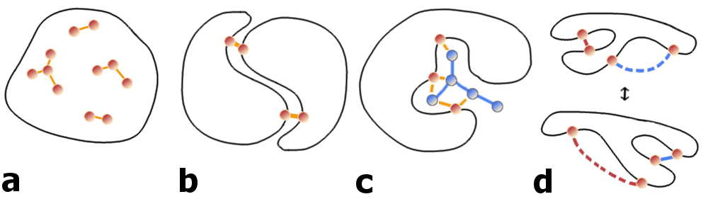
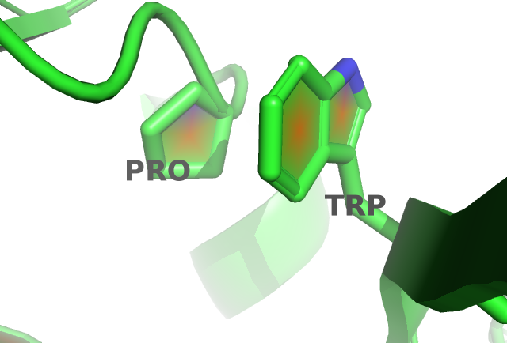

# Summary {-}
Awesome contact prediction project abstract
 
# Acknowledgements {-}

I thank the world.

\tableofcontents
\addcontentsline{toc}{chapter}{Table of Contents}


\mainmatter \setcounter{page}{1}

<!--chapter:end:index.md-->

# Introduction {#general-intro}

In his Nobel Prize speech in 1973 [@Anfinsen1973] Anfinsen postulated one of the basic principles in molecular biology, which is known as *Anfinsen's dogma*: a protein's native structure is uniquely determined by its amino acid sequence. 
With certain exceptions (e.g. [IDP](#abbrev) [@Wright1999]), this dogma has proven to hold true for the majority of proteins.

Ever since, it is regarded as the biggest challenge in structural bioinformatics [@Samish2015], to realiably predict a protein's structure given only its amino acid sequence. 
*De-novo* protein structure prediction methods use physical or knowledge based energy potentials to find a protein conformation that minimizes the protein's energy landscape. 
However, these methods are limited by the complexity of the conformational space and the accuracy of the energy potentials. 
Considering a protein with 150 amino acids, that has approximately 450 degrees of freedom, 
Regarding the rotational and translational degrees of freedom of the protein chain, the complexity scales with XXX [@Anfinsen1973].

Far more successfull are template-based modelling approaches. 
Given the observation that structure is more conserved than sequence in a protein family [@Lesk1980], the structure of a target protein can be inferred from a homologue protein [@Sander1991]. 
The degree of structural conservation is linked to the level of pairwise sequence identity [@Chothia1986]. 
Therefore, the accuracy of a model crucially depends on the sequence identity between target and template and determines the applicability of the model [@Marti-Renom2000]. 
By definition, homology derived models are unable to capture new folds [@Dorn2014] and their main limitation lies in the availability of suitable templates.  

```{r seq-str-gap, echo = FALSE, out.width = '100%', fig.cap = 'Yearly growth of number of solved structures in the PDB[@Berman2000] and protein sequences in the Uniprot[@TheUniProtConsortium2013].'}
knitr::include_url("img/pdb_growth.html", height = "750px")
```

Unfortunately, the number of solved protein structures increases only slowly, as experimental methods are both time consuming and expensive [@Dorn2014].
The [PDB](#abbrev)[@Berman2000] is the main repository for marcomolecular structures and currently (Jul 2017) holds about 120 000 atomic models of proteins. 
The primary technique for determining protein structures is X-ray crystallography, accounting for roughly 90% of entries in the [PDB](#abbrev). 
About 9% of protein structures have been solved using [NMR](#abbrev) and less than 1% using [EM](#abbrev) (see FIG 1).

All three experimental techniques have advantages and limitations with respect to certain modelling aspects.
X-ray crystallography requires the protein to form crystals, which is an arduous and sometimes impossible task. 
Furthermore, crystal packing forces the protein into a unnatural and rigid environment preventing the observation of conformational flexibility. 
$\ac{NMR}$ studies the protein in an physiological environment in solution and enables the study of protein dynamics as ensembles of protein structures can be observed. However, $\ac{NMR}$ is limited to look at small proteins. 
Recently, $\ac{EM}$ has undergone a "resolution revolution" [@Egelman2016] and macromolecular structures have been solved with resolutions up to 2A[citation]. 
The limit of $\ac{cryo-EM}$ lies in the size of proteins.

Compared to the tedious task of revealing atomic resolution of a protein tertiary structure, it has become very easy to decipher the primary sequence of proteins. 
With the latest sequencing technologies [examples], it takes only hours to sequence millions of basepaires at low costs [example numbers] and the number of sequenced genomes has risen tremendously.
The UniProtKB [@TheUniProtConsortium2013], the leading resource for protein sequences, contains more than 80 million sequence entries (24 July 2017). 
 
Consequently, the gap between the number of protein structures and sequences is still growing and even new developments as single protein structure determination [@CITE] are not expected to close this gap near in time.
[Figure sequence structure gap]

Protein structure determines protein function. Therefore, structural insights are of uttermost importance. They are essential for a detailed understanding of chemical reactions, regulatory processes and transport mechanisms.
They are fundamental for the design of drugs and antibiotics. Moreover structural abnormalities can lead to misfolding and aggregation potentially causing diseases so studying them is pathologically relevant.

The aformentioned trends illustrate the need of computational methods and motivate research to solve *Ansinsens Dogma* to reliably predict protein structures from sequence alone. 

## Protein Structure

- Primary: Amino Acid Sewuence
- Secondary: Helices, sheets, coils, repeats,..
- tertiary: interaction of secondary structure elementws
- quartary: interaction of domains


### Amino Acid Interactions {#amino-acid-interactions}

The Venn diagram in figure \@ref(fig:amino-acid-physico-chemical-properties) displays a typical classification of amino acids with respect to their physico-chemical properties. 


The aromatic amino acids tryptophan (W), tyrosine (Y), phenylalanine (F), and histidine (H) contain an aromatic ring system. 
Generally, aromatic ring systems are planar, and electons are shared over the whole ring structure.
Interactions between aromatic residues have very constrained geometries regarding the angle between the centroid of their rings. 
The $\pi$-electron systems favour T-shaped or offset stacked conformations [@Waters2002].
Preferred distances between aromatic residues have been observed between 4.5\AA and 7\AA of their ring centroids [@Burley1985].

Cysteine (C) residues can form disulphide bonds, which are the only covalent bonds between two amino acid side chains.
They comprise the strongest side chain interactions in protein structures and their length varies between 3.5\AA to 4\AA.
Disulphide bonds also have a well defined geometry: there are five dihedral angles in a disulphide bond resulting in 20 different possible configurations. 
Only one configuration is favoured so that the dihedral angle between the carbon and sulfur atoms is close to 90 degrees [@Thornton1981].
They play a very important role in stabilizing protein structures. 
The number of disulfide bonds is negatively correlated with protein length: smaller proteins have more disulfide bonds helping to stabilize the structure in absence of strong hydrophobic packing in the core.
It has also been found that disulfide bonds are more frequently observed in proteins of hyperthermophilic bacteria, being positively selected for increased stability [@Bastolla2005].

Salt bridges are based on electrostatic interactions between positively charged residues (arginine (R) and lysine (K)) and negatively charged residues (aspartic acid (D) and glutamic acid (E)). 
The strength of electrostatic interactions, as described by Coulomb's law, decreases with distance between the point charges at the functional groups. 
It has been found to be maximal at 4\AA with respect to the functional groups of the both residues [@Donald2011].

Hydrogen bonds can be formed between a donor residue which possesses an hydrogen atom attached to a strongly electronegative atom and an acceptor residue which possesses an electronegative atom with a lone electron pair. 
They are electrostatic interactions as well and thus their strength depends on distance as well. 
Hydrogen bonds are formed at distances of 2.4\AA to 3.5\AA between the non-hydrogen atoms (Berg JM, Tymoczko JL, 2002).

Salt bridges as well as hydrogen bonds have strong geometric preferences (Kumar and Nussinov, 1999). 
The geometry of a hydrogen bond depends on the angle between the HB donor, the hydrogen atom and the HB acceptor (Torshin et al., 2002).

Cation–$\pi$ interactions are formed between positively charged or partially charged amino acids with amino groups (K,R,Q,E) and aromatic residues (W,Y,F,H). 
The preferential distance of the amino group to the $\pi$-electron system has been determined between 3.4\AA and 6\AA [@Burley1986] [@Crowley2005]
Their role in stabilizing protein structures is still under debate [@Slutsky2004].

Proline residues are conformationally restricted, with the alpha-amino group of the backbone directly attached to the side chain. 
The sterical rigidity of the proline side chain restricts the backbone angle and thus affects secondary structure formation.
Proline is known as a helix-breaker. 
Whereas other aromatic side chains are defined by their negatively charged $\pi$ faces, the face of proline side chains is partially positively charged.
Thus, aromatic and proline residues can interact favorably with each other.
Once due to the hydrophobic nature of the residues and also due to the interaction between the negatively charged aroamtic $\pi$ face and the polarized C-H bonds in proline, called a CH/$\pi$  interaction.

Petersen et al. (2012) found clear secondary structure elements preferences for each amino acid pair. 
For example, residue pairs containing Alanine and Leucine are predominantly found in buried $\alpha$-helices, whereas pairs containing Isoleucine and Valine preferentially are located in $\beta$-sheet environments. 
Of course, solvent accessibility represents an important criterion for residue interactions. 
Hydrophobic residues are rather buried in the structure, whereas polar and charged residues are found more frequently on the protein surface and interact with water molecules.

```{r amino-acid-physico-chemical-properties, echo = FALSE, out.width = '50%',  fig.cap = 'Physico-chemical properties of amino acids. The 20 naturally occuring amino acids are grouped with respect to ten physico-chemical properties. Adapted from Figure 1a in [@Livingstone1993].'}
knitr::include_graphics("img/amino_acid_physico_chemical_properties_venn_diagramm.png")
```


## Structure Prediction

Despite the knowledge of Anfinsen's postulate, we are not able to reliably predict the structure of a protein from its sequence alone. Generally it is assumed that a protein folds into a unique, well-defined native structure that is near the global free energy minimum (\autoref{fig:folding_funnel}). Levinthal's paradox [@Levinthal1969] describes the complexity of the folding process towards this minimum. It stresses the problem that it is not possible for a protein to exhaustively search the conformational space to get to its native fold. Due to the "combinatorial explosion" of possible conformations, an exhaustive search would take unreasonably long. Hence, it is not a feasible approach for structure prediction to scan all possible conformations. Different approaches have been developed over time to overcome or elude this problem.


### Template-based methods

Homology modeling is by far the most successful approach to structure prediction. 
The basic concept of this strategy relates to the fact that structure is more conserved than sequence [@Lesk1980]. 
After detecting a homologous protein of known structure, that has sufficient sequence similarity, it can be used as a template to model the structure of the target protein.

The degree of structural conservation is linked to the level of pariwise sequence identity [@Chothia1986]. 
Homology Modelling is assumed to yield reliably accurate models when query and target protein share more than 30\% sequence similarity, depending on the sequence length (*safe homology zone*) [@Sander1991]. 
Below a threshold of ~20-35% pairwise sequence identity (*twighlight-zone*) the number of false positives regarding structural similarity explodes and structural inference becomes less reliable and more than 95% of structures are dissmilar [@Rost1999]. 
Advances in remote homology detection and alignment generation have improved the quality of models, even beyond the once postulated limit of the *twighlight-zone* [@Yan2013].
Integration of multiple templates has also proved to increase model quality [@Meier2015]

After the identification of a suitable template, there are different strategies that can be followed to obtain a model for the target protein. 
The the backbone of the model is generated by simply copying the coordinates of the target backbone atoms onto the model. 
Non-aligned residues due to gaps in the alignment have to be modelled \textit{de-novo}, meaning from scratch.
This can be done by a knowledge-based search for suitable fragments in the PDB or by true energy-based \textit{de-novo} modelling. 
When the backbone is generated, the side chains are modelled, usually by searching rotamer libraries for energetically favoured residue conformations. 
Finally, the model is energetically optimized in an iterative procedure. 
Force fields are applied to correct the backbone and side chain conformations [@Gu2009}. 
Several automated pipelines for homology modelling are well-established (Modeller [@Eswar2007}, 3D-Jigsaw [@Bates2001}, SwissModel [@Arnold2006}) which allow more or less manual intervention in the modelling process. 

        
Fold Recognition describes the inverse folding problem \citep{Bowie1993}: instead of finding the compatible structure for a given sequence, one tries to find sequences that fit onto a given structure. Whether the query sequence fits a structure from the database is not determined by sequence similarities but rather energetic or environment specific measures. Thus, fold recognition methods are able to recognize structural similarity even in the absence of sequence similarity. The rationale basis for this strategy is the assumption that the fold space is limited. It has been found that seemingly unrelated proteins often adopt similar folds. This might be due to divergent evolution (proteins are related, but homology cannot be detected at the corresponding sequence level) or convergent evolution (functional requirements lead to similar folds for unrelated proteins) \citep{Gu2009}. Early approaches include profile based methods. Here, the structural information of the protein is encoded into profiles, which subsequently are aligned to the sequences \citep{Bowie1991,Fischer1996,Ouzounis1993}. Advanced techniques are known as  "threading" techniques, describing the process of threading a sequence through a structure and determining the optimal fit via energy functions. \citep{Jones1992,Jones1998,Lemer1995}


### Template-free structure prediction

Ab initio or de-novo modeling techniques implement Anfinsen’s Dogma most closely in mimicking the folding process based only on physico-chemical principles.
Energy functions (physical or knowledge-based) are used to describe the folding landscape and are minimized to arrive at the global energy minimum corresponding to the native conformation. 
Since the native conformation can be found near the global energy minimum of the folding landscape, energy functions (physical or knowledge-based) have been developed to describe this landscape.
With respect to the idea of a folding funnel, the energy function is minimized to mimic the folding process that automatically leads to the global minimum.
 Again, there exist numerous webservers that combine energy minimization,  threading techniques and fragment-based approaches, e.g. Rosetta \citep{Simons1999}, Tasser \citep{Zhang2004}, Touchstone II \citep{Zhang2003}.

Drawbacks of these methods are the time requirements due to the computational complexity of energy functions as well as their inaccuracy. 
    
    

Minimize a physical or knowledge-based energy function for the protein. This has huge complexity due to large conformational space that needs to be sampled. 

### contact assisted de-novo predictions {#contact-assisted-str-pred}

Structure Reconstruction from true contacts maps works well. Even a small number of contacts is sufficient to reconstruct the fold of the protein. Distance maps work even better. 

What is the optimal distance cutoff to define a contact? 
Duarte et al 2010: between 8 and 12A
Dyrka et al 2016
Konopka et al 2014
Sathyapriya et al 2009

Many studies that successfuly predict structures denovo with the help of predicted contact.

Vice versa, because contacts at large primary distances are rare, they are most informative for protein structure prediction: Izarzugaza J, Gran ˜a O, Tress M, Valencia A, Clarke N (2007) Assessment of intramolecular contact predictions for CASP7


## Contact Prediction

Contact Prediction refers to the prediction of physical contacts between amino acid side chains in the 3D protein structure, given the protein sequence as input. 

Historically, contact prediction was motivated by the idea that compensatory mutations between spatially neighboring residues can be traced down from evolutionary records [@Gobel1994].
As proteins evolve, they are under selective pressure to maintain their function and correspondingly their structure.
Consequently, residues and interactions between residues constraining the fold, protein complex formation or other aspects of function are under selective pressure.
Highly constrained residues and interactions will be strongly conserved. 
Another possibility to maintain structural integrity is the mutual compensation of unbeneficial mutations.
For example, the unfavourable mutation of a small amino acid residue into a bulky residue in the densely packed protein core might have been compensated in the course of evolution by a particularly small side chain in a neighboring position. 
Other physico-chemical quantities such as amino acid charge or hydrogen bonding capacity can also be responsible for compensatory effects.
In a [MSA](#abbrev), sequences that descended from a common ancestral sequence are aligned such that the homologous residues line up with each other in columns. 
According to the hypothesis, compensatory mutations show up as correlations between the amino acid types of pairs of [MSA](#abbrev) columns and can be used to infer spatial proximity of residue pairs (see Figure \@ref(fig:correlated-mutations)).

(ref:caption-correlated-mutations) Compensatory mutations between spatially neighboring residues subject to particular physico-chemical constraints can leave coevolutionary record in protein sequences. Mining protein family sequence alignments for residue pairs with strong coevolutionary records using statistical models allows inference of spatial proximity for these residue pairs.

```{r correlated-mutations, echo = FALSE, out.width = '80%', fig.align = 'center', fig.cap = '(ref:caption-correlated-mutations)'}
knitr::include_graphics("img/intro/correlated-mutations-transparent.png")
```

Early methods from the 1990's were very inaccurate as the number of available protein sequences was only small and weak statistical models were prone to noise.
It took until the end of the last decade that major sources of noise could be eliminated and sophisticated statistical models allowed for the distinction between transitively mediated and causal interactions [@Dunn2008; @Weigt2009].
With the steady increase in protein sequence data, purely machine learning based methods emerged that are trained on features extracted from [MSAs](#abbrev).
Currently, the most accurate methods to predict residue-residue contacts are meta-predictors, combining one or several coevolution methods with sequence derived features and other sources of information. 
    
This chapter will give an overview over important previous methods, will introduce the state-of-the-art statistical model for inferring coevolutionary couplings and present well-known challenges for contact prediction methods.


### Local Statistical Models {#local-methods}

Early contact prediction methods used local pairwise statistics to infer contacts that regard pairs of amino acids in a sequence as statistically independent from another.
The drawback of these approaches is that they do not account for transitive effects arising from chains of correlations between multiple residue pairs as described in the section on [Transitive Effects].

Several of these methods use correlation coefficient based measures, such as Pearson correlation between amino acid counts, properties associated with amino acids or mutational propensities at the sites of a [MSA](#abbrev) [@Neher1994; @Taylor1994; @Gobel1994; @Oliveira2002]. 

Many methods have been developed that are rooted in information theory and use [MI](#abbrev) measures to describe the dependencies between sites in the alignment [@Clarke1995; @Korber1993; @Martin2005].
Phylogenetic and entropic biases have been identified as the major sources of noise that confound the true coevolution signal [@Atchley2000; @Fodor2004; @Martin2005].
Different variants of [MI](#abbrev) based approaches try to address these effects and improve on the signal-to-noise ratio [@Atchley2000; @Tillier2003; @Gouveia_Oliveira2007].
The most prominent correction for background noises is [APC](#abbrev), developed by Dunn et al. that drastically removes background noise from entropic effects and is discussed in section  \@ref(post-processing-heuristics) [@Dunn2008].

Another popular method is *OMES* that essentially computes a chi-squared statistic to detect the differences between observed and expected pairwise amino acid frequencies for a pair of columns [@Kass2002; @Noivirt2005].

Eventhough these methods cannot compete with modern predictors, *OMES* and [MI](#abbrev) based scores often serve as a baseline to benchmark the performance of new methods [@DeJuan2013; @Jones2012].


### Global Statistical Models {#global-methods}

Global statistical models make predictions for a single residue pair while considering all other pairs in the protein.
By doing so they solve the correlation versus causation phenomenon and distinguish direct from indirect couplings which has been referred to in the literature as [DCA](#abbrev) [@Lapedes1999; @Weigt2009].

In 1999 Lapedes et al. were the first to propose a global statistical approach for the prediction of residue-residue contacts in order to disentangle  transitive effects [@Lapedes1999].
They consider a Pott's model that can be derived under a maximum entropy assumption and use the model specific coupling parameters to infer interactions.
At that time the wider implications of this great advancement went unnoted but meanwhile the Pott's Model has become the most prominent statistical model for contact prediction.
Section \@ref(maxent) deals extensively with the derivation and properties of the Pott's model, its application to contact prediction and its numerous realizations.


A global statistical model not motivated by the maximum entropy approach was proposed by Burger and Nijmwegen in 2010 [@Burger2008; @Burger2010]. 
Their fast Bayesian network model incorporates additional prior information and phylogenetic correction via [APC](#abbrev) but cannot compete with the currently most successfull pseudo-likelihood approaches presented in section \@ref(pseudo-likelihood). 


### Machine Learnign Methods and Meta-Predictors

These methods combine abundant information on sequence and
amino acid properties in order to learn associations between input features and residue-residue
contacts. Methods dier mainly in the type of the applied Machine Learning (ML) algorithm,
e.g Neural Networks (NNs), Support Vector Machines (SVMs) or Random Forests (RFs) and the
chosen input features, e.g. contact predictions, solvent accessibility, physico-chemical properties
of amino acids, secondary structure predictions or evolutionary information. (Kukic et al.,
2014; Alfonso Marquez-Chamorro, 2013; Li et al., 2011) The problem with these methods is
interpretability, as it is dicult to elucidate which feature patterns contribute in which amount
to the model.


- combining different approaches
 - jones et al: overlap between methods but also many unique predictions
- machine learning methods incorporate sequence-derived features:
  - secondary structure predictions
  - solvent accessibilty
  - contact potentials
  - msa properties
  - pssms 
  - physico-chemcial properties of amino acids

However, Meta-predictors will improve if basic methods improve. Ultra-deep learning paper identifies coevolution features as crucial feature. 

### Evaluating Contact Prediction Methods {#intro-cp-evaluation}

Choosing an appropriate benchmark for contact prediction methods depends on the further utilization of the predictions.
Most prominently, predicted contacts are used to assist structure prediction as outlined in section \@ref(contact-assisted-str-pred).
Therefore, one could in fact assess the quality of structural models computed with the help of predicted contacts.
However, predicting structural models adds not only another layer of computational complexity but also raises questions about implementation details of the folding protocol. 
Generally it has been found that a small number of accurate contacts is sufficient to constrain the overal protein fold as discussed in section \@ref(contact-assisted-str-pred).

From these considerations emerged a standard benchmark that evaluates the mean precision over a testset of proteins with known high quality 3D structures with respect to the top scoring predictions from every protein.
The number of top scoring predictions per protein is typically normalized with respect to protein length $L$ and precision is defined as the number of true contacts among the top scoring predicted contacts.
Usually, a pair of residues is defined to be in contact when the distance between their $\Cb$ atoms ($C\alpha$ in case of glycine) is less than $8 \AA \; \;$ in the reference protein structure [@Monastyrskyy2015].

**Contact Definition**

However, whether two residues truly interact in a protein structure depends only marginally on the distance between their $\Cb$ atoms.
More importantly, interactions between side-chains depend on their physico-chemical properties, on their orientation and vary within the vast number of alternative environments within proteins [@Bettsa] (see section \@ref(amino-acid-interactions)). 
Therefore, a simple $\Cb$ distance threshold cannot capture the true interaction preferences of amino acids and yields an imperfect gold-standard for benchmarking.

Other distance thresholds or definitions for contacts (e.g minimal atomic distances or distance between functional groups) have been studied as well.
In fact, Duarte and colleagues found that using a $\Cb$ distance threshold between 9$\AA \; \;$ and 11$\AA \; \;$ yields optimal results when predicting the 3D structure from the respective contacts [@Duarte2010].

Anishchenko and colleagues [@Anishchenko2017] analysed false positive predictions with respect to a minimal atom distance threshold $< 5 \AA \; \;$, as they found that this cutoff optimally defines direct physical interactions of residue pairs.

With regard to the utilization of contacts for structure prediction, a simple $\Cb$ cutoff is nonetheless a convenient choice, as this threshold can be easily implemented as a restraint in common structure predictions protocols (e.g Modeller).


**Sequence Separation**

Local residue pairs separated by only some positions in sequence (e.g $|i-j| < 6$) are usually filtered out for evaluation of contact prediction methods.
They are trivial to predict as they typically correspond to contacts within secondary structure elements and reflect the local geometrical constraints.
Figure \@ref(fig:Cb-distribution) shows the distribution of $\Cb$ distances for various minimal sequence separation thresholds. 

(ref:caption-Cb-distribution) Distribution of residue pair $\Cb$ distances over all proteins in the dataset (see Methods \@ref(dataset)) at different minimal sequence separation thresholds: blue = $|i-j| > 1$ (all residue pairs), orange = $|i-j| > 6$, green = $|i-j| > 12$, red = $|i-j| > 24$.

```{r Cb-distribution, echo = FALSE, out.width = '100%', out.height = '100%', fig.cap = '(ref:caption-Cb-distribution)'}
knitr::include_url("img/dataset_statistics/Cb_distribution_all_data43579541_log.html", height="500px")
```


Without filtering local residue pairs (sequence separation 1), there are several additional peaks in the distribution around $5.5\AA \; \;$, $7.4\AA \; \;$ and $10.6\AA \; \;$ that can be attributed to local interactions in e.g. helices (see Figure \@ref(fig:peaks-Cb-distribution)).
 
 
(ref:caption-peaks-Cb-distribution) $\Cb$ distances between neighboring residues in $\alpha$-helices. Left: Direct neighbors in $\alpha$-helices have $\Cb$ distances around $5.4\AA\; \;$ due to the geometrical constraints from $\alpha$-helical architecture. Right: Residues separated by two positions ($|i-j| = 2$) are less geometrically restricted to $\Cb$ distances between $7\AA\; \;$ and $7.5\AA\; \;$.

```{r peaks-Cb-distribution, echo = FALSE, out.width = '50%', fig.show = 'hold', fig.cap = '(ref:caption-peaks-Cb-distribution)'}
knitr::include_graphics(c("img/dataset_statistics/cb_distribution_peak_5-6.png","img/dataset_statistics/cb_distribution_peak_7.png"))
```

Commonly, sequence separation bins are applied to distuinguish short ($6 < |i-j| \le 12$), medium ($12 < |i-j| \le 24$) and long range ($|i-j| > 24$) contacts [@Monastyrskyy2015].
Especially long range contacts are of importance for structure prediction as they are informative and able to constrain the overal fold of a protein [@CITE].


**CASP**

CASP, the well-respected and independent competition for the structural bioinformatic's community that is taking place every two years, introduced the contact prediction category in 1996 and developed a standard procedure for the assessment of predictions.
The precision of predicted long range ($|i-j| > 24$) contacts is assessed based on a $8 \AA \; \; \Cb$ distance threshold for proteins with no (or only hard to detect) structural homologs.
During CASP11 further evaluation metrics have been introduced, such as Matthews correlation coefficient and area under the precision-recall curve. 

Currently best methods perform in the range XXX


### Maximum Entropy Modelling of Protein Families {#maxent}

The principle of maximum entropy, proposed by Jaynes in 1957 [@Jaynes1957a; @Jaynes1957b], states that the probability distribution which makes  minimal assumptions and best represents observed data is the one that is in agreement with measured constraints (prior information) and has the largest entropy. In other words, from all the distributions that are consistent with the given data one chooses the distribution with maximal Shannon entropy.

Applied to the problem of modelling protein families, one seeks a probability distribution $p(\seq)$ for protein sequences $\seq = (x_1, \ldots, x_L)$ of length $L$ from the protein family under study. 
The categorical variables $x_{i}$ can take one of $q=21$ values representing the 20 naturally occuring amino acids and a gap ('-').
Given $N$ sequences of the protein family in a [MSA](#abbrev) with $\X = \{ \seq_1, \ldots, \seq_N \}$, the empirically observed single and pairwise amino acid frequencies can be calculated as

\begin{equation}
    \mathcal{f}_i(a) = \mathcal{f}(x_i\eq a) = \frac{1}{N}\sum_{n=1}^N I(x_{ni} \eq a) \\
    \mathcal{f}_{ij}(a,b) = \mathcal{f}(x_i\eq a, x_j\eq b) = \frac{1}{N} \sum_{n=1}^N I(x_{ni} \eq a, x_{nj} \eq b) \; .
 (\#eq:emp-freq)
\end{equation}

According to the maximum entropy principle, the distribution $p(\seq)$ should have maximal entropy and reproduce the empirically observed amino acid frequencies, so that

\begin{align}
   \mathcal{f}(x_i\eq a)            &\equiv p(x_i\eq a)  \\
                                    &= \sum_{\seq'_1, \ldots, \seq'_L = 1}^{q} p(x') I(x'_i \eq a) \\
  \mathcal{f}(x_i\eq a, x_j\eq b)   &\equiv p(x_i\eq a, x_j \eq b) \\
                                    &= \sum_{\seq'_1, \ldots, \seq'_L = 1}^{q}  p(x') I(x'_i\eq a, x'_j \eq b)  \; .
 (\#eq:maxent-reproducing-emp-freq)
\end{align}


Solving for the distribution $p(\seq)$ that maximizes the Shannon entropy $S= -\sum_{\seq'} p(\seq') \log p(\seq')$ while satisfying the constraints given in eq. \@ref(eq:maxent-reproducing-emp-freq) by introducing the Lagrange multipliers $\wij$ and $\vi$, 

\begin{align}
F \left[ p(\seq) \right] =& -\sum_{\seq'} p(\seq') \log p(\seq') \\
        & + \sum_{i=1}^L \sum_{a=1}^{q} \vi(a) \left( p(x_i\eq a) - \mathcal{f}(x_i\eq a) \right) \\
        & + \sum_{1 \leq i < j \leq L}^L \; \sum_{a,b=1}^{q} \wij(a,b) \left( p(x_i\eq a, x_j \eq b) - \mathcal{f}(x_i\eq a, x_j\eq b) \right) \\
        & + \Omega \left( 1-\sum_{\seq'} p(\seq')  \right)
(\#eq:derivation-max-ent-model)
\end{align}

results in the formulation of an exponential model known as *Potts model* in statistical physics or [MRF](#abbrev) in statistics,

\begin{equation}
    p(\seq | \v, \w ) = \frac{1}{Z} \exp \left( \sum_{i=1}^L v_i(x_i) \sum_{1 \leq i < j \leq L}^L w_{ij}(x_i, x_j) \right) \; .
(\#eq:max-ent-model)
\end{equation}

The Lagrange multipliers $\wij$ and $\vi$ remain as model parameters to be fitted to data.
$Z$ is a normalization constant also known as *partition function* that ensures the total probabilty adds up to one by summing over all possible assignments to $\seq$, 

\begin{equation}
  Z = \sum_{\seq'_1, \ldots, \seq'_L = 1}^{q} \exp  \left( \sum_{i=1}^L v_i(x_i) \sum_{1 \leq i < j \leq L}^L w_{ij}(x_i, x_j) \right) \; .
  (\#eq:partition-fct-likelihood)
\end{equation}


#### Model Properties 

The Potts model is specified by singlet terms $\via$ which describe the tendency for each amino acid a to appear at position $i$, and pair terms $\wijab$, also called couplings, which describe the tendency of amino acid a at position $i$ to co-occur with amino acid b at position $j$.
In contrast to mere correlations, the couplings explain the causative dependence structure between positions by jointly modelling the distribution of all positions in a protein sequence and thus account for transitive effects (see \@ref(local-methods)). 

Maximum entropy models naturally give rise to exponential family distributions that express useful properties for statistical modelling, such as the convexity of the likelihood function which consequently has a unique, global minimum [@Wainwright2007; @Murphy2012]. 

The Potts model is a discrete instance of what is referred to as a pairwise [Markov random field](#abbrev) in the statistics community.
[MRFs](#abbrev) belong to the class of undirected graphical models, that represent the probability distribution in terms of a graph with nodes and edges characterizing the variables and the dependence structure between variables, respectively.


##### Gauge Invariance {-}

As $x_{ni}$ can take $q=21$ values, the model has $L \! \times \! q + L(L-1)/2 \! \times \! q^2$ parameters but the parameters are not uniquely determined as multiple parametrizations yield identical probability distributions. 

For example, adding a constant $c_i$ to all elements in $v_i$ for any fixed position $i$ or similarly adding a constant $c_{ia}$ to $\via$ for any fixed position $i$ and amino acid $a$ and subtracting the same constant from the $qL$ coefficients $\wijab$ with $b \in \{1, \ldots, q\}$ and $j \in \{1, \ldots, L \}$ leaves the probabilities for all sequences under the model unchanged, since such a change will be compensated by a change of $Z$ in eq. \@ref(eq:partition-fct-likelihood).


The overparametrization, referred to as *gauge invariance* in statistical physics literature, can be eliminated by removing parameters.
An appropriate choice of which parameters to remove, referred to as *gauge choice*, reduces the number of parameters to $L \! \times \! (q-1) + L(L-1)/2 \! \times \! (q-1)^2$.
Popular gauge choices are the *zero-sum gauge* or *Ising-gauge* used by [@Weigt2009] imposed by the restraints,

\begin{equation}
    \sum_{a=1}^{q} v_{ia} = \sum_{a=1}^{q} \wijab = \sum_{a=1}^{q} w_{ijba} = 0
(\#eq:zero-sum-gauge)
\end{equation}

for all $i,j,b$  or the *lattice-gas gauge* used by [@Morcos2011; @Marks2011] imposed by restraints

\begin{equation}
    \wij(q,a) = \wij(a,q) = \vi(q) = 0
(\#eq:ising-gauge)
\end{equation}

for all $i,j,a$ [@Cocco2017].

Alternatively, the indeterminacy can be fixed by including a regularization prior (see next section).
The regularizer selects for a unique solution among all parametrizations of the optimal distribution and therefore eliminates the need to choose a gauge [@Koller2009; @Ekeberg2013;  @Stein2015a].


##### Regularization {-}

The number of parameters in a Potts model is typically larger than the number of observations, i.e. the number of sequences in the [MSA](#abbrev).
Considering a protein of length $L=100$, there are approximately $2 \times 10^6$ parameters in the model whereas the largest protein families comprise only around $10^5$ sequences (see Figure \@ref(fig:pfam)).
An underdetermined problem like this renders the use of regularizer neccessary in order to prevent overfitting.

Typically, an L2-regularization is used that pushes the single and pairwise terms smoothly towards zero and is equivalent to the logarithm of a zero-centered Gaussian prior,

\begin{align}
  R(\v, \w)  &= \log \left[ \mathcal{N}(\v | \mathbf{0}, \lambda_v^{-1} I) \mathcal{N}(\w | \mathbf{0}, \lambda_w^{-1} I) \right] \\
             &= -\frac{\lambda_v}{2} ||\v||_2^2 - \frac{\lambda_w}{2} ||\w||_2^2 + \text{const.} \; ,
(\#eq:l2-reg)
\end{align}

where the strength of regularization is tuned via the regularization coefficients $\lambda_v$ and $\lambda_w$ [@Seemayer2014; @Ekeberg2014; @Kamisetty2013].

#### Intractability of the Partition Function {#partition-function}

Typically, one obtains parameter estimates by maximizing the log-likelihood function of the parameters over observed data.
For the Potts model, the log-likelihood function is computed over sequences in the alignment $\mathbf{X}$: 

\begin{align}
    \text{LL}(\v, \w | \mathbf{X}) =& \sum_{n=1}^N \log p(\seq_n) \\
    =& \sum_{n=1}^N \left[ \sum_{i=1}^L v_i(x_{ni}) + \sum_{1 \leq i < j \leq L}^L w_{ij}(x_{xn}, x_{nj}) - \log Z \right] \\
(\#eq:full-log-likelihood)
\end{align}

However, optimizing the log-likelihood requires computing the partition function $Z$ given in eq. \@ref(eq:partition-fct-likelihood) that sums $q^L$ terms, with $L$ being in the hundreds for naturally occurig protein domains.
Because of this exponential complexity in protein length $L$, it is computationally intractable to evaluate the log-likelihood function at every iteration of an optimization procedure. 

Several approximate solutions have been developed to sidestep the infeasible computation of the partition function for the specific problem of predicting contacts between residues that are briefly explained in the next section. 

#### Solving the Inverse Potts Problem

In 1999 Lapedes et al. were the first to propose maximum entropy models for the prediction of residue-residue contacts in order to disentangle  transitive effects [@Lapedes1999].
They used an iterative Monte Carlo procedure to obtain estimates of the partition function. 
As the calculations involved were very time-consuming and at that time required supercomputing resources, the wider implications were not noted yet.

In 2009 Weight et al proposed an iterative message-passing algorithm, here referred to as *mpDCA*, to approximate the partition function [@Weigt2009].
Eventhough their approach is computationally very expensive and in practive only applicable to small proteins, they obtained remarkable results for the two-component signaling system in bacteria.

Balakrishnan et al [@Balakrishnan2011] were the first to apply pseudo-likelihood approximations to the full likelihood in 2011. 
The pseudo-likelihood optimizes a different objective and replaces the global partition function $Z$ with local estimates.
Balakrishnan and colleagues applied their method *GREMLIN* to learn sparse graphical models for 71 protein families.
In a follow-up study in 2013 [@Kamisetty2013], an improved version of *GREMLIN* incorporating prior information was evaluated in a comprehensive benchmark tailored towards the contact prediction problem.

Also in 2011, Morcos et al. introduced a naive mean-field inversion approximation to the partition function, named *mfDCA* [@Morcos2011].
This method allows for drastically shorter running times as the mean-field approach boils down to inverting the empirical covariance matrix calculated from observed amino acid frequencies for each residue pair $i$ and $j$ of the alignment.
This study performed the first high-throughput analysis of intradomain contacts for 131 protein families and facilitated the prediction of protein structures from accurately predicted contacts in [@Marks2011].

The initial work by Balakrishnan and collegueas went almost unnoted as it was not primarily targeted to the problem of contact prediction.
Ekeberg and collegueas independently developed the pseudo-likelihood method *plmDCA*  and showed its superior precision towards *mfDCA* [@Ekeberg2013].

A related approach to mean-field approximation is sparse inverse covariance estimation, named *PSICOV*, by Jones et al [@Jones2012]. 
They use L1-regularization, known as graphical Lasso, to invert the correlation matrix and learn a sparse graphical model [@Friedman2008].
Both procedures, *mfDCA* and *PSICOV*, assume the model distribution to be a multivariate Gaussian. 
It has been shown by Banerjee et al. (2008) that this dual optimization solution also applies to binary data (as is the case in this application). 
In order to represent the [MSA](#abbrev) as continuous distributed, each position is encoded as a 20-dimensional binary vector. 

Another related approach to *mfDCA* and *PSICOV* is *gaussianDCA*, proposed in 2014 by Baldassi et al. [@Baldassi2014].
Similar to the other both approaches, they model the data as multivariate Gaussian but within a simple Bayesian formalism by using a suitable prior and estimating parameters over the posterior distribution.

So far, pseudo-likelihood maximization has proven to be the most accurate approach with respect to the standard evaluation procedures for contact prediction presented in the following section. 
Currently, there exist several implementations of pseudo-likelihood maximization that vary in slight details, perform similarly and thus are equally popular in the community, such as CCMpred [@Seemayer2014], plmDCA[@Ekeberg2014] and GREMLIN [@Kamisetty2013].

#### Pseudo-Likelihood {#pseudo-likelihood}

Instead of the full likelihood, Besag suggested to optimize a different objective function that he called *pseudo-likelihood* [@Besag1975].
The pseudo-likelihood approximates the joint probability with the product over conditionals for each variable, i.e. the conditional probability of observing one variable given all the others:

\begin{equation}
  p(\seq | \v,\w) \approx   \prod_{i=1}^L p(x_i | \seq_{\backslash xi}, \v,\w) =  \prod_{i=1}^L \frac{1}{Z_i} \exp \left(  v_i(x_i) \sum_{1 \leq i < j \leq L}^L w_{ij}(x_i, x_j) \right)
\end{equation}

Here, the normalization term $Z_i$ sums only over all assignments to one position $i$ in sequence:

\begin{equation}
  Z_i = \sum_{a=1}^{q} \exp \left( v_i(a) \sum_{1 \leq i < j \leq L}^L w_{ij}(a, x_j) \right)
(\#eq:partition-fct-pll)
\end{equation}


Replacing the global partition function in the full likelihood with local estimates of lower complexity in the pseudo-likelihood objective resolves the computational intractability of the parameter optimization procedure.
Hence, it is feasible to maximize the pseudo-log-likelihood function,

\begin{align}
    \text{pLL}(\v, \w | \mathbf{X}) =& \sum_{n=1}^N \sum_{i=1}^L \log p(x_i | \seq_{\backslash xi}, \v,\w) \\
    =& \sum_{n=1}^N \sum_{i=1}^L  \left[ v_i(x_{ni}) + \sum_{j=i+1}^L  w_{ij}(x_{ni}, x_{nj}) - \log Z_{ni} \right] \;,
\end{align}

plus an additional regularization term in order to prevent overfitting and to fix the gauge (see section on [Gauge Invariance] and eq. \@ref(eq:l2-reg)) to arrive at a [MAP](#abbrev) estimate of the parameters, 

\begin{equation}
    \hat{\v}, \hat{\w} = \underset{\v, \w}{\operatorname{argmax}} \; \text{pLL}(\v, \w | \mathbf{X}) + R(\v, \w) \; .
\end{equation}


Eventhough the pseudo-likelihood optimizes a different objective than the full-likelihood, it has been found to work well in practice for many problems, including contact prediction [@Koller2009; @Murphy2012; @Stein2015a; @Ekeberg2013].
The pseudo-likelihood function retains the concavity of the likelihood and it has been shown to be a consistent estimator in the limit of infinite data for models of the exponential family [@Besag1975; @Gidas1988; @Koller2009]. 
That is, as the number of sequences in the alignment increases, pseudo-likelihood estimates converge towards the true full likelihood parameters.


#### Computing Contact Maps {#post-processing-heuristics}

Model inference as described in the last section yields [MAP](#abbrev) estimates of the couplings $\hat{\w}_{ij}$. 
In order to obtain a scalar measure for the coupling strength between two residues $i$ and $j$, current methods heuristically map the $q \! \times \! q$ dimensional coupling matrix $\wij$ to a single scalar quantity.

*mpDCA* [@Weigt2009] and *mfDCA* [@Morcos2011; @Marks2011] employ a score called [DI](#abbrev), that essentially computes the [MI](#abbrev) for two positions $i$ and $j$ using the couplings $\wij$ instead of pairwise amino acid frequencies.
However, [DI](#abbrev) scores have quickly been replaced by the Frobenius norm as it was found to improve prediction performance over [DI](#abbrev) [@Ekeberg2013; @Baldassi2014].

Currently, all pseudo-likelihood methods (*plmDCA* [@Ekeberg2013; @Ekeberg2014], *CCMpred* [@Seemayer2014], *GREMLIN* [@Kamisetty2013]) compute the *Frobenius norm* of the coupling matrix $\wij$ to obtain a scalar contact score $C_{ij}$,

\begin{equation}
    C_{ij}  = ||\wij||_2 = \sqrt{\sum_{a,b=1}^q \wijab^2} \; .
(\#eq:frobenius-norm)
\end{equation}

It was found that prediction precision improves further when the Frobenius norm is computed only on the $20 \times 20$ submatrix, thus ignoring contributions from gaps [@Feinauer2014].
*PSICOV* [@Jones2012] uses an L1-norm on the $20 \times 20$ submatrix instead of the Frobenius norm.

The Frobenius norm is gauge dependent and is minimized by the *zero-sum gauge* [@Weigt2009].
Therefore, in [@Ekeberg2013; @Ekeberg2014; @Seemayer2014; @Baldassi2014] the coupling matrices are transformed to *zero-sum gauge* before computing the Frobenius norm:

\begin{equation}
    \w'_{ij}  = \wij - \wij(\cdot, b) - \wij(a, \cdot) + \wij(\cdot, \cdot) \; ,
(\#eq:zero-sum-gauge-transform)
\end{equation}

where $\cdot$ denotes average over the respective indices.


Another commonly applied heuristic known as [APC](#abbrev) has been found to substantially boost contact prediction performance [@Dunn2008; @Kamisetty2013].
Dunn et al. introduced [APC](#abbrev) in order to remove the influence of background noise arising from correlations between positions with high entropy or phylogenetic couplings [@Dunn2008].
[APC](#abbrev) was first adopted by *PSICOV* [@Jones2012] but is now used by most methods to adjust scores.
It substracts a term that is computed as the product over average row and column contact scores $\overline{C_i}$ divided by the average contact score over all pairs $\overline{C_{ij}}$,

\begin{equation}
    C_{ij}^{APC}  = C_{ij} - \frac{\overline{C_i} \; \overline{C_j}}{\overline{C_{ij}}}\; .
(\#eq:apc)
\end{equation}


It was long under debate why [APC](#abbrev) works so well and how it can be interpreted. 
Zhang et al. showed that [APC](#abbrev) essentially approximates the removal of the first principal component of the contact matrix and therefore removes the highest variability in the matrix that is assumed to arise from background biases [@Zhang2016].
Furthermore, they studied an advanced decomposition technique, called low-rank and sparse matrix decomposition (LRS), that decomposes the contact matrix into a low-rank and a sparse component, representing background noise and true correlations, respectively.  
Inferring contacts from the sparse component works astonishing well, improving precision further over [APC](#abbrev) independent of the underlying statistical model.

Dr Stefan Seemayer could show that the main component of background noise can be attributed to entropic effects and that a substantial part of [APC](#abbrev) amounts to correcting for these entropic biases (unpublished).
In his doctoral thesis, he developed a proper entropy correction, computed as the geometric mean of per-column entropies, that correlates well with the [APC](#abbrev) correction term and yields similar precision for predicted contacts.
The entropy correction has the advantage that it is computed from input statistics and therefore is independent of the statistical model used to infer the couplings.
In contrast, [APC](#abbrev) and other denoising techniques such as LRS [@Zhang2016] discussed above, estimate a background model from the final contact matrix, thus depending on the statistical model used to infer the contact matrix. 

The general "smoothing" effect observed when applying [APC](#abbrev) that can mainly be attributed to removing entropy bias is illustrated in Figure \@ref(fig:apc-correction).

(ref:caption-apc-correction) Contact Matrices computed from  pseudo-likelihood couplings. **a**: Contact map computed with Frobenius norm as in eq. \@ref(eq:frobenius-norm). Overall coupling values are dominated by entropic effects, i.e. the amount of variation for a [MSA](#abbrev) position, leading to striped patterns. **b**: Contact map from (a) corrected for background noise with the [APC](#abbrev) as in eq. \@ref(eq:apc).

```{r apc-correction, echo = FALSE, out.width = '100%', fig.show = 'hold', fig.cap = '(ref:caption-apc-correction)'}
knitr::include_graphics("img/intro/apc_correction_transparent.png")
```


### Challenges in Coevolutionary Inference {#challenges}

Coevolutionary methods face several challenges when interpreting the covariation signals obtained from [MSA](#abbrev) that will be addressed in the following. 
Some of these challenges have been successfully met (e.g. transitive effects with global statistical models), others are still open and again others open up new possibilities, such as dissecting different sources of coevolution. 


#### Phylogenetic Bias {-}

Sequences in [MSAs](#abbrev) do not represent independent samples of a protein family. 
In fact, there is selection bias from sequencing species of special interest (e.g human pathogens) or sequencing closely related species, e.g multiple strains. 
This uneven sampling of a protein family's sequence space thus leaves certain regions unexplored whereas others are statistically overrepresented [@Morcos2011; @Marks2012]. 

Furthermore, due to their evolutionary relationships, sequences have a complicated dependence structure.
Closely related sequences can cause spurious correlations between positions, as there was not sufficient time for the sequences to diverge from their common ancestor [@Gouveia_Oliveira2007; @Lapedes1999; @Burger2010]. 
Figure \@ref(fig:phylogenetic-effect) illustrates a simplified example, where dependence of sequences due to phylogeny leads to a covariation signal.

(ref:caption-phylogenetic-effect) The phylogenetic dependence of closely related sequences can produce covariation signals. Here, two independent mutation events in two branches of the tree result in a perfect covariation signal for two positions.

```{r phylogenetic-effect, echo = FALSE, out.width='50%', fig.align='center', fig.cap = '(ref:caption-phylogenetic-effect)'}
knitr::include_graphics("img/intro/phylogenetic_effect.png")
```

To reduce the effects of redundant sequences, a popular sequence reweighting strategy has been found to improve contact prediction performance, where every sequence receives a weight that is the inverse of the number of similar sequences according to an identity threshold (see section \@ref(seq-reweighting)) [@Buslje2009; @Morcos2011; @Jones2012]. 


#### Entropic bias {-}

Another source for noise is entropy bias that is closely linked to phylogenetic effects.
By nature, methods detecting signals from correlated mutations rely on a certain degree of covariation between sequence positions [@Burger2010].
Highly conserved interactions pose a conceptual challenge, as changes from one amino acid to another cannot be detected if sequences do not vary.
This results in generally higher co-evolution signals from positions with high entropy and underestimated signals for highly conserved interactions [@Fodor2004, @Martin2005].

Several heuristics have been proposed to reduce entropy effects, such as Row-Column-Weighting (RCW) [@Gouveia_Oliveira2007] or Average Product Correction (APC) [@Dunn2008] (see section \@ref(post-processing-heuristics)).


#### Finite Sampling Effects {-}

Spurious correlations can arise from random statistical noise and blur true co-evolution signals especially in low data scenarios.
Consequently, false positive predictions attributable to random noise accumulate for protein families comprising low numbers of homologous sequences.
This relationship was confirmed in many studies and as a rule of thumb it has been argued that proteins with $L$ residues need at least *5L* sequences in order to obtain confident predictions useful for protein structure prediction [@Kamisetty2013; @Marks2012].
Recently it was shown that precision of predicted contacts saturates for protein families with more than $10^3$ diverse sequences and that precision is only dependent on protein length for families with small number of sequences [@Anishchenko2017].

Interesting targets for contact prediction are protein families without any associated structural information. 
As can be seen in Figure \@ref(fig:pfam), those protein families generally comprise low numbers of homologous sequences with a median of 185 sequences per family and are thus susceptible to finite sampling effects. 

With the rapidly increasing size of protein sequence databases  (see section \@ref(general-intro)) the number of protein families with enough sequences for accuarate contact predictions will also increase steadily  [@TheUniProtConsortium2013; @Kamisetty2013].
Nevertheless, because of the already mentioned sequencing biases, better and more sensitive statistical models are indespensible to extend the applicability domain of coevolutionary methods.

  (ref:caption-pfam) Distribution of PFAM family sizes. Less than half of the families in PFAM (7990 compared to 8489 families) do not have an annotated structure. The median family size in number of sequences for families with and without annotated structures is 185 and 827 respectively. Data taken from PFAM 31.0 (March 2017, 16712 entries) [@Finn2016].

```{r pfam, echo = FALSE, out.width='100%', fig.cap = '(ref:caption-pfam)'}
knitr::include_url("img/pfam_pdb_notitle.html", height = "650px")
```


#### Transitive Effects {-}

One important shortcoming of traditional covariance approaches arises from the fact that chains of amino acid interactions are very common in protein structures and lead to direct as well as indirect correlation signals [@Lapedes1999; @Burger2010; @Weigt2009].  

Considering three residues $i$, $j$ and $k$, where $i$ interacts with $j$ and $j$ interacts with $k$.
Even when there is no physical interaction between $i$ and $k$, there will be a correlation between $i$ and $k$ due to the correlation versus causation phenomenon. 
Strong statistical dependence between pairs $(i,j)$ and $(j,k)$ can induce strong indirect signals which can be even larger than signals of other directly interacting pairs and thus lead to false predictions [@Burger2010].

Local statistical methods, being introduced in section \@ref(local-methods), are unable to disentangle these transitive effects as they consider residue pairs independent of one another.
In contrast, global statistical models presented in section \@ref(global-methods) learn a joint probability over all residues allowing to dissect direct and indirect correlations [@Weigt2009; @Burger2010].


#### Multiple Sequence Alignments {-}

Obviously, a correct [MSA](#abbrev) is the essential starting point for correlated mutation analysis as incorrectly aligned residues will confound the true covariation signal. 
Highly sensitive and accurate tools such as HHblits generate high quality alignments suitable for contact prediction [@Remmert2012]. 
However, there are certain subtleties to be kept in mind when generating alignments.

For example, proteins with repeated stretches of amino acids or with regions of low complexity are notoriously hard to align.
Especially, repeat proteins have been found to account for a considerable fraction of false positive predictions [@Anishchenko2017]. 
Therefore, [MSAs](#abbrev) need to be generated with great care and covariation methods need to be tailored to these specific problems [@Espada2014; @Toth-Petroczy2016].

Sensitivity of sequence search is critically dependent on the research question and the protein family of interest. 
While many diverse sequences generally increase precision of predictions, co-evolutionary signals specific to a subfamily might be averaged out when alignments become too deep. 
Therefore a trade-off between specificity and diversity of the alignment is required to reach optimal results [@Hopf2012]. 

Another intrinsic characteristic of [MSAs](#abbrev) are repeated stretches of gaps that result from commonly utilized gap-penalty schemes assigning large penalties to insert a gap and lower penalties to gap extensions. 
Most statistical models treat gaps as the 21st amino acid, thus introducing an imbalance as gaps and amino acid express different behaviours which often results in gap-induced artefacts [@Feinauer2014]. 


#### Evaluation Strategy {-}

Contact prediction methods are typically evaluated based on a rigid definition of a residue contact that does not reflect true biological interactions between amino acids as discussed in section \@ref(intro-cp-evaluation).
Choosing different distance cutoffs or different reference atoms for defining a true contact changes the evaluation outcome.

Related to the problem of choosing the right trade-off between sensitivity and specificity when generating alignemnts is the issue of structural variation within a protein family.
Evolutionary couplings are inferred from all family memebers in the [MSA](#abbrev) and thus might be physical contacts in one family member but not in another. 
Anishchenko et al. could show that more than $80\%$ of false positives at intermediate distances (minimal heavy atom distance $5-15 \AA \;\;$) are true contacts in at least one homolog structure [@Anishchenko2017].


#### Alternative Sources of Co-evolution{-}

Co-evolutionary signals can not only arise from intra-domain contacts, but also from other sources, like homo-oligomeric contacts, alternative conformations, ligand-mediated interactions or even contacts over hetero-oligomeric interfaces (see Figure \@ref(fig:sources-coevolution))  [@Marks2012].
With the objective to predict physical contacts it is therefore necessary to identify and filter these alternative sources for co-evolutionary couplings.

(ref:caption-sources-coevolution) Possible causes of coevolution. **a)** Physical interactions between intra-domain residues. **b)** Interactions across the interface of predominantly homo-oligomeric complexes. **c)** Interactions mediated by ligands or metal atoms. **d)** Transient interactions due to conformational flexibility.

```{r sources-coevolution, echo = FALSE, out.width='80%', fig.align='center', fig.cap = '(ref:caption-sources-coevolution)'}

```


Many proteins form homo-oligomers with evolutionary conserved interaction surfaces.
Currently it is hard to reliably distinguish intra- and inter-molecular contacts.
Anishchenko et al. found that approximately one third of strong co-evolutionary signals between residue pairs at long distances (minimal heavy atom distance $>15 \AA \;\;$) can be attributed to interactions across homo-oligomeric interfaces [@Anishchenko2017].
Several studies specifically analysed co-evolution across homo-oligomeric interfaces for proteins of known structure by filtering for residue pairs with strong couplings at long distances [@Hopf2012; @Lee2009; @Wang2015; @Sutto2015; @Jana2014] or used co-evolutionary signals to predict homo-dimeric complexes [@DosSantos2015a].   

It has been proposed that co-evolutionary signals can also arise from ligand or atom mediated interactions between residues or from critical interactions in intermediate folding states [@Buslje2009; @Ovchinnikov2015b].
Confirming this hypothesis, a study showed that the cumulative strength of couplings for a particular residue can be used to predict functional sites [@Marks2012; @Hopf2012].

Another important aspect is conformational flexibility. 
PDB structures used to evaluate co-evolution analysis represent only rigid snapshots taken in an unnatural crystalline environment. 
Yet proteins possess huge conformational plasticity and can adopt distinct alternative conformations or adapt shape when interacting with other proteins in an induced fit manner [@Noel2016].
Several studies demonstrated successfully that co-evolutionary signals can capture interactions specific to different distinct conformations [@Hopf2012; @Jana2014; @Sfriso2016; @Morcos2011]. 


## Developing a Bayesian Model for Contact Prediction


The most popular and successfull methods for contact prediction optimize the pseudo-log-likelihood of the [MSA](#abbrev) and use several heuristics to calculate a contact score (see section \@ref(post-processing-heuristics)). 

By doing so valuable information in contact matrices is lost. 
Analyses in section 1 shows what information is contained in coupling matrices and that the signal in coupling matrices varies with $\Cb$ distance. 

This thesis introcudes a principled Bayesian statistical approach that eradicates these heuristics to fully exploit the information in coupling matrices.
Instead of transforming the model parameters $\w$ into heuristic contact scores, one can compute the posterior probability distributions of the distances $r_{ij}$ between $\Cb$ atoms of all residues pairs $i$ and $j$, given the [MSA](#abbrev) $\X$. 
The coupling parameters $\w$ are treated as hidden variables that will be integrated out analytically. 
This approach also allows for extraction of information contained in the particular types of amino acids, since each pair of amino acids will have a different preference to be coupled at certain distances.

TODO Figure ! ! 

In section 2 introduces max ent model for protein families that will produce the model parameters for the Bayesian model.

In section 3 describes in detail how the posterior distribution of distances can be computed.

Section 4 presents the optimizaton of the coupling prior. 

And the Bayesian model will be evalutated in  section 5.

The outlook describes an extension of the model to predict inter-residue distances. 
Development is ongoing.


<!--chapter:end:03-intro.Rmd-->

# Interpretation of Coupling Matrices {#interpreting-coupling-matrices}

State-of-the-art contact prediction methods map the 20 x 20 coupling matrices $w_{ij}$ onto scalar values to obtain contact scores for each residue pair (see section \@ref(post-processing-heuristics)). 
By doing so, the full information contained in coupling matrices is lost:

  - the contribution of individual couplings $\wijab$
  - the direction of couplings (positive or negative)
  - the correlation between couplings $\wijab$ and $\wijcd$
  - intrinsic biological meaning
  
The following analyses give some intuition for the information contained in coupling matrices.

## Single Coupling Values Carry Evidence of Contacts

Given the success of [DCA](#abbrev) methods, it is clear that contact scores are good indicators of spatial proximity for residue pairs. 
As described in section \@ref(post-processing-heuristics), a contact score for a residue pair is commonly computed as the square root over the sum of squared coupling values. 


Figure \@ref(fig:sq-coupling-correlation) shows the correlation between squared coupling values and contact class.
All couplings have a positive class correlation, meaning the stronger their squared value, the more likely a contact can be inferred. 
Generally, couplings that involve any aliphatic amino acid (I, L, V) or alanine express the strongest class correlation. 
In contrast, C-C or aromatic pairings (involving Y, F, W) correlate only weakly with contact class.
Therefore, these couplings often might contribute to false positive predictions. 

(ref:caption-sq-coupling) Correlation of squared coupling values $(\wijab)^2$ with contact class (contact=1, non-contact=0) for approximately 100 000 residue pairs per class (details see section \@ref(method-coupling-correlation)). Contacts defined as residue pairs with $\Cb < 8 \AA$ and non-contacts as residue pairs with $\Cb > 25 \AA$. 


```{r sq-coupling-correlation, echo = FALSE, out.width='100%', fig.cap = '(ref:caption-sq-coupling)'}
knitr::include_url("img/coupling_matrix_analysis/correlation_squared_couplings_with_contact_class_notitle.html", height = "750px")
```

Apparantly, distinct couplings are of varying importance for contact inference. 
Without squaring the coupling values, these charateristics become even more pronounced. 

Figure \@ref(fig:coupling-correlation) shows the correlation of raw coupling values with contact class.
Interestingly, in contrast to the finding with squared coupling values, only couplings for charged pairs have strong correlation (positive and negative) with class value, whereas couplings for hydrophobic pairs correlate to a much lesser extent (mostly negative).
This implies that absolute (squared) coupling strength is much more indicative of a contact for hydrophobic pairings than the direction of coupling.
On the contrary, for charged residue pairs the direction of a coupling value is a stronger indicator than the strength of the squared coupling value.

As with squared couplings, raw couplings for aromatic pairs or C-C pairs correlate only weakly with contact class. 
For these pairings, neither coupling strength, nor direction of coupling seems to be a good indicator for a contact.
```{r coupling-correlation, echo = FALSE, out.width='750px', fig.cap = '(ref:caption-coupling-correlation)'}
knitr::include_url("img/coupling_matrix_analysis/correlation_couplings_with_contact_class_notitle.html", height = "750px")
```

Of course, looking only at correlations can be misleading if there are non-linear patterns in the data, for example higher order dependencies between couplings. 
For this reason it is advisable to take a more detailed view at coupling matrices and the distributions of their values.

## Physico-Chemical Fingerprints in Coupling Matrices


The correlation analysis of raw coupling matrices in the last section revealed that certain coupling values tend to indicate a contact more strongly than others. 
Single coupling matrices of residue contacts often display striking patterns that agree with the previuos findings. 
Most often, these patterns suggest biological relevant details of the interdependency between both residues.

Figure \@ref(fig:coupling-matrix-ionic-interaction) visualizes the inferred coupling matrix for a residue pair (residues 6 and 82) in protein 1awq, chain A.
Clearly visible is a cluster of strong coupling values for charged and polar residues (E,D,K,R,Q). 
Positive coupling values can be observed between positively charged residues (R,K) and negatively charged residues (E,D), whereas coupling values between equally charged residues are negative. 
The coupling matrix perfectly reflects the interaction preference for residues forming salt bridges. 
Indeed, in the protein structure residue 6 (glutamic acid) forms a salt bridge with residue 82 (lysine) as can be seen in figure \@ref(fig:coupling-matrix-pymol).

(ref:caption-coupling-matrix-ionic-interaction) Coupling matrix for residues 6 and 82 in protein 1awq chain A. Size of the bubbles represents coupling strength and color represents the direction of coupling: red = positive coupling, blue = negative coupling. Bars at the x-axis and y-axis represent the corresponding single potentials for both residues. Height of the bars represents potential strength and color represents positive (red) and negative (blue) values.

```{r coupling-matrix-ionic-interaction, echo = FALSE, out.width='750px', fig.cap = '(ref:caption-coupling-matrix-ionic-interaction)'}
knitr::include_url("img/coupling_matrix_analysis/coupling_matrix_1a9xA05_6_82_notitle.html", height = "750px")
```

Figure \@ref(fig:coupling-matrix-hydrophobic-interaction) visualizes the coupling matrix for a pair of hydrophobic residues (residues 29 and 39) in protein 1ae9 chain A.
Hydrophobic pairings have strong coupling values but the couplings also reflect a sterical constraint:
alanine as a small hydrophobic residue is favoured at either position 29 or position 39, but disfavoured to appear at both positions.
Figure \@ref(fig:coupling-matrix-pymol) illustrates the location of the two residues in the protein core. Here, hydrophobic residues are densely packed and the limited space allows for only small hydrophobic residues.

(ref:caption-coupling-matrix-hydrophobic-interaction) Coupling matrix for residues 29 and 39 in protein 1ae9 chain A. Size of the bubbles represents coupling strength and color represents the direction of coupling: red = positive coupling, blue = negative coupling. Bars at the x-axis and y-axis represent the corresponding single potentials for both residues. Height of the bars represents potential strength and color represents positive (red) and negative (blue) values.

```{r coupling-matrix-hydrophobic-interaction, echo = FALSE, out.width='750px', fig.cap = '(ref:caption-coupling-matrix-hydrophobic-interaction)'}
knitr::include_url("img/coupling_matrix_analysis/coupling_matrix_1ae9A00_29_39_notitle.html", height = "750px")
```

<!---
<iframe width="750" height="750" frameborder="0" scrolling="no" src="img/coupling_matrix_analysis/coupling_matrix_1awqA00_92_129_notitle.html">
-->

(ref:caption-coupling-matrix-pymol) Interactions between protein side chains. Left: residue 6 (glutamic acid) forming a salt bridge with residue 82 (lysine) in protein 1awq, chain A. Right: residue 29 (alanine) and residue 39 (leucine) within the hydrophobic core of protein 1ae9 chain A.   

```{r coupling-matrix-pymol, echo = FALSE, out.width = '50%', fig.show = 'hold', fig.cap = '(ref:caption-coupling-matrix-pymol)'}
knitr::include_graphics(c("img/coupling_matrix_analysis/1a9xA05_6_82.png", "img/coupling_matrix_analysis/1ae9A00_29_39.png"))
```


Many more biological interpretable signals can be identified from coupling matrices, including pi-cation interactions (see Appendix \@ref(pi-cation)), aromatic-proline interactions (see Appendix \@ref(aromatic-proline)), sulfur-aromatic interactions or disulphide bonds (see Appendix \@ref(disulfide)). 

Coucke and collegues [@Coucke2016] performed a thorough quantitative analysis of coupling matrices selected from confidently predicted residue pairs.
They showed that eigenmodes obtained from a spectral analysis of averaged coupling matrices are closely related to physico-chemical properties of amino acid interactions, like electrostaticity, hydrophobicity, steric interactions or disulphide bonds. 
By looking at specific populations of residue pairs, like buried and exposed residues or residues pairs from specific protein classes (small, mainly $\alpha$, etc), the eigenmodes capture very characteristic interactions for each class, e.g. rare disulfide contacts withins small proteins and hydrophilic contacts between exposed residues. 
Their study confirms our qualitative observation that amino acid interactions can leave characteristic physico-chemical fingerprints in coupling matrices. 


## Coupling Profiles Vary with Distance

Analyses in the previous sections showed that certain coupling values correlate more or less strong with contact class and that coupling matrices for contacts express biological meaningpull patterns. 

More insights can be obtained by looking at the distribution of distinct coupling values for contacts, non-contacts and arbitrary populations of residue pairs. 
To avoid uninformative couplings, we consider only residue pairs with a sequence separation > 10 and with enough evidence for a certain amino acid pairing (see Methods section \@ref(method-coupling-profile) for details).

Figure \@ref(fig:1d-coupling-profile-0-5) shows the distribution of selected couplings for residue pairs within a $\Cb$ distance $< 5\AA$. 
The distribution of R-E and E-E coupling values is shifted and skewed towards positive and negative values respectively. 
This is in accordance with attracting electrostatic interactions between the positively charged side chain of arginine and the negatively charged side chain of gluatamic acid and also with repulsive interactions between the two negatively charged gluatamic acid side chains.
Couling values for C-C pairs have a broad distribution that is skewed towards positive values, reflecting the strong signals obtained from covalent disulphide bonds. 
Hydrophobic pairs like V-I have an almost symmetric coupling distribution, confirming the finding that the direction of coupling is not indicative of a true contact whereas the strength of the coupling is.
Hydrophobic interactions arising from the hydrophobic effect are not specific or directed and can easily be substituted by other hydrophobic residues, which explains the not very pronounced positive coupling signal compared to more specific interactions, e.g ionic interactions. 
The distribution of aromatic coupling values like F-W is slightly skewed towards negative values, accounting for steric hindrance of their large side chains at small distances. 

(ref:caption-1d-coupling-profile-0-5) Distribution of selected couplings for approximately 10000 filtered residue pairs with $\Cb$ distance $< 5\AA$ (see Methods section \@ref(method-coupling-profile) for details).

```{r 1d-coupling-profile-0-5, echo = FALSE, out.width='100%', fig.cap = '(ref:caption-1d-coupling-profile-0-5)'}
knitr::include_url("img/coupling_matrix_analysis/1d_coupling_profile_0_5.html")
```

In an intermediate $\Cb$ distance range between $8\AA$ and $12\AA$ the distributions for all coupling values are centered close to zero and are less broad. 
The distributions are still shifted and skewed as for $\Cb$ distance $< 5\AA$ but much less pronounced. 
For aromatic pairs like F-W, the distribution of coupling values has very long tails, suggesting strong couplings for aroamtic side chains at this distance.

(ref:caption-1d-coupling-profile-8-12) Distribution of selected couplings for approximately 10000 filtered residue pairs with $\Cb$ distance $< 5\AA$ (see Methods section \@ref(method-coupling-profile) for details).

```{r 1d-coupling-profile-8-12, echo = FALSE, out.width='100%', fig.cap = '(ref:caption-1d-coupling-profile-8-12)'}
knitr::include_url("img/coupling_matrix_analysis/1d_coupling_profile_8_12.html")
```


Figure \@ref(fig:1d-coupling-profile-20-50) shows the distribution of selected couplings for residue pairs far apart in the protein structure ($\Cb$ distance $> 20\AA$).  
The distribution for all couplings is centered at zero and has small variance. 
For C-C coupling values, the distribution has a long tail for positve values, presumably arising from the fact that the maximum entropy model cannot distuinguish highly conserved signals of multiple disulphide bonds within a protein. 
This observation also agrees with the previous finding that C-C couplings correlate only weakly with contact class.
The same arguments apply to couplings of aromatic pairs that have a comparably broad distribution and do not correlate strongly with contact class.
The strong coevolution signals for aromatic pairs even at high distance ranges might be to insufficient disentanglig of transitive effects, as aromatic residues are known to form network-like structures in the protein core that stabilize protein structure (see Figure \@ref(fig:aromatic-network) in Appendix)[@Burley1985]. 


(ref:caption-1d-coupling-profile-20-50) Distribution of selected couplings for approximately 10000 filtered residue pairs with $\Cb$ distance $> 25\AA$ (see Methods section \@ref(method-coupling-profile) for details).

```{r 1d-coupling-profile-20-50, echo = FALSE, out.width='100%', fig.cap = '(ref:caption-1d-coupling-profile-20-50)'}
knitr::include_url("img/coupling_matrix_analysis/1d_coupling_profile_20_50.html")
```


## Higher Order Dependencies Between Couplings 

The analyses in the previous sections focused on single coupling values of the $20 \times 20$-dimensional coupling matrices.
As mentioned before, looking at single variables might be misleading if they are dependent on another.
Unfortunately, it is not possible to reasonably visualize the high dimensional coupling matrices. 
But there are several ways to identify interesting dimensions. 

First of all, 2-dimensional scatter plots of couplings for biological relevant pairings confirm the previous trend that couplings reflect amino acid interactions.

Figure \@ref(fig:2d-coupling-profile-re-er-0-8) and \@ref(fig:2d-coupling-profile-re-ee-0-8) illustrate the distribution of attractive and repulsive ionic interactions at $\Cb$ distances less than $8\AA$.
Whereas coupling values for R-E and E-R are positively correlated, coupling values for R-E and E-E are negatively correlated. 
Hydrophobic coupling values for residue pairs at $\Cb$ distances less than $8\AA$ are symmetrically distributed around zero, in agreement with all previous analyses (Figure \@ref(fig:2d-coupling-profile-vi-il-0-8)).

(ref:caption-2d-coupling-profile-re-er-0-8) Two-dimensional distribution of coupling values R-E and E-R for approximately 10000 residue pairs with $\Delta\Cb < 8\AA$. The distribution is almost symmetrical and the coupling values are positively correlated. Residue pairs have been filtered for sequence separation, percentage of gaps and evidence in alignment (see Methods \@ref(method-coupling-profile)). 

```{r 2d-coupling-profile-re-er-0-8, echo = FALSE, out.width='75%', fig.show = 'hold', fig.cap = '(ref:caption-2d-coupling-profile-re-er-0-8)'}
knitr::include_url("img/coupling_matrix_analysis/pairwise_couplings_R-E_E-R_Cbdistance_0_8_notitle.html")
```

(ref:caption-2d-coupling-profile-re-ee-0-8) Two-dimensional distribution of coupling values R-E and E-E for approximately 10000 residue pairs with $\Delta\Cb < 8\AA$. The coupling values are negatively correlated. Residue paris have been filtered for sequence separation, percentage of gaps and evidence in alignment (see Methods \@ref(method-coupling-profile)). 

```{r 2d-coupling-profile-re-ee-0-8, echo = FALSE, out.width='75%', fig.cap = '(ref:caption-2d-coupling-profile-re-ee-0-8)'}
knitr::include_url("img/coupling_matrix_analysis/pairwise_couplings_R-E_E-E_Cbdistance_0_8_notitle.html")
```

(ref:caption-2d-coupling-profile-vi-il-0-8) Two-dimensional distribution of coupling values V-I and I-L for approximately 10000 residue pairs with $\Delta\Cb < 8\AA$. The coupling values are symmetrically distributed around zero. Residue paris have been filtered for sequence separation, percentage of gaps and evidence in alignment (see Methods \@ref(method-coupling-profile)). 

```{r 2d-coupling-profile-vi-il-0-8, echo = FALSE, out.width='75%', fig.cap = '(ref:caption-2d-coupling-profile-vi-il-0-8)'}
knitr::include_url("img/coupling_matrix_analysis/pairwise_couplings_V-I_I-L_Cbdistance_0_8_notitle.html")
```


<!--chapter:end:05-interpretation-coupling-matrices.Rmd-->

# Optimizing the Full-Likelihood {#optimizing-full-likelihood}


## Likelihood of the sequences as a Potts model

We denote the $N$ sequences in the [MSA](#abbrev) $\X$ with ${\seq_1, ..., \seq_N}$. 
Each sequence $\seq_n = (\seq_{n1}, ..., \seq_{nL})$ is a string of $L$ letters from an alphabet indexed by $\{0, ..., 20\}$, where 0 stands for a gap and $\{1, ... , 20\}$ stand for the 20 types of amino acids. 
The goal is to predict from $\X$ the distances $r_{ij}$ between the $\Cb$ atoms of all pairs of residues $(i, j) \in \{1, ..., L\}$.
The link between the [MSA](#abbrev) $\X$ and the vector $\mathbf{r}$ of all inter-$\Cb$ distances is described via the evolutionary couplings of residue pairs that are the $20^2$-dimensional vectors $w_{ij}$.

As already described in detail in section \@ref(maxent), we model the likelihood of the sequences in an [MSA](#abbrev) with a Potts Model, also known as [MRF](#abbrev): 

\begin{equation}
    p(\X | \v, \w) = \prod_{n=1}^N p(\seq_n | \v, \w) = \prod_{n=1}^N \frac{1}{Z(\v, \w)} \exp \left( \sum_{i=1}^L v_i(x_{ni}) \sum_{1 \leq i < j \leq L} w_{ij}(x_{ni}, x_{nj}) \right)
\end{equation}

The coefficients $\via$ are the single potentials and $\wijab$ denote the coupling strengths for pairs of residues. 
$Z(\v, \w)$ is the so-called partition sum that normalizes the probability distribution $p(\seq_n |\v, \w)$:

\begin{equation}
  Z(\v, \w) = \sum_{y_1, ..., y_L = 1}^{20} \exp \left( \sum_{i=1}^L v_i(y_i) \sum_{1 \leq i < j \leq L} w_{ij}(y_i, y_j)  \right)
\end{equation}

TODO: this is irrelevant for CD, isn't it?
For an efficient computational implementation, we might sum over all $1 \le i, j \le L$ without demanding $i < j$ and enforce trivial constraints $\wijab = w_{jiba}$ during the optimization.


## Treating Gaps as Missing Information {#gap-treatment}

Treating gaps explicitly as 0’th letter of the alphabet would lead to couplings between columns that are not in physical contact. 
To see why, imagine a hypothetical alignment consisting of two sets of sequences as it is illustrated in Figure \@ref(fig:gap-treatment). 
The first set has sequences covering only the left half of columns in the MSA, while the second set has sequences covering only the right half of columns. 
The two blocks could correspond to protein domains that were aligned to a single query sequence. 

Now consider couplings between a pair of columns $i, j$ with $i$ from the left half and $j$ from the right half. 
Since no sequence (except the single query sequence) overlaps both domains, the empirical amino acid pair frequencies $q(x_i = a, x_j = b)$ will vanish for all $a, b \in \{1,... , L\}$. 

(ref:caption-gap-treatment) Hypothetical [MSA](#abbrev) consisting of two sets of sequences: the first set has sequences covering only the left half of columns, while the second set has sequences covering only the right half of columns. The two blocks could correspond to protein domains that were aligned to a single query sequence. Empirical amino acid pair frequencies $q(x_i \eq a, x_j \eq b)$ will vanish for positions $i$ from the left half and $j$ from the right half of the alignment.

```{r gap-treatment, echo = FALSE, fig.cap = '(ref:caption-gap-treatment)'}
knitr::include_graphics("img/gap_treatment.png")
```


The gradient of the log likelihood for couplings is 

\begin{align}
\frac{\partial LL}{\partial \wijab} &= \sum_{n=1}^N I(x_{ni}=a, x_{nj}=b)  - N \frac{\partial}{\partial \wijab} \log Z(\v,\w) \\
                                        &= \sum_{n=1}^N I(x_{ni} \eq a, x_{nj} \eq b) \\
                                        & - N \sum_{y_1,\ldots,y_L=1}^{20} \!\! \frac{ \exp \left( \sum_{i=1}^L v_i(y_i) + \sum_{1 \le i < j \le L} w_{ij}(y_i,y_j) \right)}{Z(\v,\w)}  I(y_i \eq a, y_j \eq b) \\
                                        &=  N q(x_{i} \eq a, x_{j} \eq b) - N \sum_{y_1,\ldots,y_L=1}^{20} p(y_1, \ldots, y_L | \v,\w) \, I(y_i \eq a, y_j \eq b) \\
                                        &=  N q(x_{i} \eq a, x_{j} \eq b) - N p(x_i \eq a, x_j \eq b | \v,\w) 
(\#eq:gradient-LLreg-gaps-single)
\end{align}

Note that the empirical frequencies are equal to the model probabilities at the maximum of the likelihood when the gradient vanishes.
Therefore, $p(x_i \eq a, x_j \eq b | \v, \w)$ would have to be zero in the optimum when the empirical amino acid frequencies $q(x_i \eq a, x_j \eq b)$ vanish for pairs of columns as described above.
However, $p(x_i \eq a, x_j \eq b | \v, \w)$ can only become zero, when the exponential term in $p(x_i \eq a, x_j \eq b | \v, \w)$ ammounts to zero, which would only be possible if $\wijab$ goes to $−\infty$. 
This is clearly undesirable, as we want to deduce physical contacts from the size of the couplings.

The solution is to treat gaps as missing information. 
This means that the normalisation of $p(\seq_n | \v, \w)$ should not run over all positions $i \in \{1,... , L\}$ but only over those $i$ that are not gaps in $\seq_n$.
Therefore we define the set of sequences $\Sn$ used for normalization of $p(\seq_n | \v, \w)$ as:

\begin{equation}
\Sn := \{(y_1,... , y_L): 0 \leq y_i \leq 20 \land (y_i \eq 0 \textrm{ iff } x_{ni} \eq 0) \}
\end{equation}

and the partition function becomes:

\begin{equation}
  Z_n(\v, \w) = \sum_{\mathbf{y} \in \Sn} \exp \left( \sum_{i=1}^L v_i(y_i) \sum_{1 \leq i < j \leq L} w_{ij}(y_i, y_j)  \right)
\end{equation}

To ensure that the gaps in $x_n$ do not contribute anything to the sums, we fix all parameters associated with a gap to 0:

$v_i(0) = 0$ and $w_{ij}(0, b) = w_{ij}(a, 0) = 0$ for all $i, j \in \{1, ..., L\}$ and $a, b \in \{0, ..., 20\}$.

Furthermore, we redefine the empirical amino acid frequencies $q_{ia}$ and $q_{ijab}$ such that they are normalised over $\{1, ..., 20\}$:

\begin{align}
   N_i :=& \sum_{n=1}^N  I(x_{ni} \!\ne\! 0) &  q_{ia} = q(x_i \eq a) :=& \frac{1}{N_i} \sum_{n=1}^N I(x_{ni} \eq a)   \\
   N_{ij} :=& \sum_{n=1}^N  I(x_{ni} \!\ne\! 0, x_{nj} \!\ne\! 0)  &  q_{ijab} = q(x_i \eq a, x_j \eq b) :=& \frac{1}{N_{ij}} \sum_{n=1}^N I(x_{ni} \eq a, x_{nj} \eq b)
\end{align}

With this definition, empirical amino acid frequencies are normalized without gaps, so that

\begin{equation}
    \sum_{a=1}^{20} q_{ia} = 1      \; , \;     \sum_{a,b=1}^{20} q_{ijab} = 1.
(\#eq:normalized-emp-freq)
\end{equation}


## Gauge transformation 

The model  contains $L \times  20 + \frac{L(L − 1)}{2} \times 20^2$ parameters, but the parameters are not uniquely determined. 
For example, for any fixed position $i$ and amino acid a we can add a constant to $\via$ and subtract the same constant from the $20L$ coefficients $\wijab$ with $b \in \{1, ..., 20\}$ and $j  \in \{1, ..., L\}$. This overparametrization, the so-called gauge transformation, would leave the probabilities for all sequences under the model unchanged.

We could eliminate parameters by enforcing the restraints 
$\sum_{a=1}^{20} v_{ia} = 0$ and $\sum_{a=1}^{20} \wijab = 0 = \sum_{a=1}^{20} w_{ijba}$. 
However, it is easier to rather formulate carefully the link between the distribution of $\w_{ij}$ vectors and the distance $r_ij$ while taking the non-uniqueness of parameters into acount, as we will see below.


## The regularized log likelihood function LLreg(v,w)

In pseudo-likelihood based methods, a regularisation is commonly used that can be interpreted to arise from a prior probability. 
We will do the same here, constraining $\v$ and $\w$ by Gaussian priors $\mathcal{N}( \v | \v^*, \lambda_v^{-1} \I)$ and $\mathcal{N}( \w |\boldsymbol 0, \lambda_w^{-1} \I)$. 
The choice of $v^*$ will be discussed in the section \@ref(prior-v). 
By including the logarithm of this prior into the log likelihood using the gap treatment described in section \@ref{gap-treatment}, we obtain the regularised likelihood,

\begin{equation}
    \LLreg(\v,\w)  = \log \left[ p(\X | \v,\w) \;  \Gauss (\v | \v^*, \lambda_v^{-1} \I)  \; \Gauss( \w | \boldsymbol 0, \lambda_w^{-1} \I) \right] 
\end{equation}

or explicitely,

\begin{align}
    \LLreg(\v,\w) =& \sum_{n=1}^N  \left[ \sum_{i=1}^L v_i(x_{ni}) + \sum_{1\le i<j\le L} w_{ij}(x_{ni},x_{nj}) - \log Z_n(\v,\w) \right] \\
                    & - \frac{\lambda_v}{2} \!\! \sum_{i=1}^L \sum_{a=1}^{20} (\via - \via^*)^2  - \frac{\lambda_w}{2}  \sum_{1 \le i < j \le L} \sum_{a,b=1}^{20} \wijab^2 .
\end{align}


## The gradient of the regularized log likelihood

The gradient of the regularized log likelihood has single components

\begin{align}
    \frac{\partial \LLreg}{\partial \via} =& \sum_{n=1}^N I(x_{ni}=a) - \sum_{n=1}^N \frac{\partial}{\partial \via} \, \log Z_n(\v,\w) - \lambda_v (\via - \via^*)\\
                                          =& \; N_i q(x_i \eq a) \\
                                          & - \sum_{n=1}^N \sum_{\mathbf{y} \in \Sn} \frac{  \exp \left( \sum_{i=1}^L v_i(y_i) + \sum_{1 \le i<j \le L}^L w_{ij}(y_i,y_j) \right) }{Z_n(\v,\w)}  I(y_i=a) \\
                                          & - \lambda_v (\via - \via^*) 
(\#eq:gradient-LLreg-single)
\end{align}

and pair components

\begin{align}
    \frac{\partial \LLreg}{\partial \wijab} =& \sum_{n=1}^N I(x_{ni} \eq a, x_{nj} \eq b) - \sum_{n=1}^N \frac{\partial}{\partial \wijab} \log Z_n(\v,\w)  - \lambda_w \wijab \\
                                            =& \; N_{ij} q(x_i \eq a, x_j=b) \\
                                            & - \sum_{n=1}^N \sum_{\mathbf{y} \in \Sn} \frac{ \exp \left( \sum_{i=1}^L v_i(y_i) + \sum_{1 \le i<j \le L}^L w_{ij}(y_i,y_j) \right) }{Z_n(\v,\w)} I(y_i \eq a, y_j \eq b) \\
                                            & - \lambda_w \wijab  
(\#eq:gradient-LLreg-pair)
\end{align}


Note that (without regulariation $\lambda_v = \lambda_w = 0$) the empirical frequencies $q(x_i \eq a)$ and $q(x_i \eq a, x_j=b)$ are equal to the model probabilities at the maximum of the likelihood.

If the proportion of gap positions in $\X$ is small (e.g. $<5\%$, also compare percentage of gaps in dataset in Appendix Figure \@ref(fig:dataset-gaps)), we can approximate the sums over $\mathbf{y} \in \Sn$ in eqs. \@ref(eq:gradient-LLreg-single) and \@ref(eq:gradient-LLreg-pair) by $p(x_i=a | \v,\w) I(x_{ni} \ne 0)$ and $p(x_i=a, x_j=b | \v,\w) I(x_{ni} \ne 0, x_{nj} \ne 0)$, respectively, and the partial derivatives become

\begin{align}
  \frac{\partial \LLreg}{\partial \via}   =& \; N_i q(x_i \eq a) -  N_i \; p(x_i \eq a  | \v,\w)  - \lambda_v (\via - \via^*)  \\
  \frac{\partial \LLreg}{\partial \wijab} =& \; N_{ij} q(x_i \eq a, x_j=b) - N_{ij} \; p(x_i \eq a, x_j \eq b | \v,\w) - \lambda_w \wijab
  (\#eq:gradient-LLreg-approx)
\end{align}

Note that the couplings between columns $i$ and $j$ in our hypothetical MSA (see section \@ref(gap-treatment)) will now vanish since $N_{ij} \eq 0$ and the gradient with respect to $\wijab$ is equal to $-\lambda_w \wijab$.


## The prior on $\v$ {#prior-v}

Most previous approaches chose a prior around the origin, $p(\v) = \Gauss ( \v| \mathbf{0}, \lambda_v \I)$. 
This choice has an obvious draw-back. 
To see why, we take the sum over $b=1,\ldots, 20$ of the gradient of couplings in eq. \@ref(eq:gradient-LLreg-approx) at the optimum, where the gradient vanishes. 

This yields
\begin{equation}
    0 =   N_{ij}\, q(x_i \eq a, x_j \ne 0)   - N_{ij}\, p(x_i \eq a | \v, \w)  - \lambda_w \sum_{b=1}^{20} \wijab.
\end{equation}


Incidentally, we note that by taking the sum over $a$ we find 
\begin{equation}
    \sum_{a,b=1}^{20} \wijab  = 0.
(\#eq:zero-sum-wij)
\end{equation}

At the optimum the gradient with respect to $v_{ia}$ vanishes and we can substitute $p(x_i=a|\v,\w) = q(x_i=a) - \lambda_v (\via - \via^*) / N_i$, yielding   

\begin{equation}
    0 =  N_{ij} \, q(x_i \eq a, x_j \ne 0)  - N_{ij} \, q(x_i=a) + \frac{N_{ij}}{N_i}\lambda_v (\via - \via^*)  - \lambda_w \sum_{b=1}^{20} \wijab .
(\#eq:gauge-opt-1)
\end{equation}

for all $i,j \in \{1,\ldots,L\}$ and all $a \in \{1,\ldots,20\}$. 
To show that the choice $\v^*= \mathbf{0}$ leads to undesirable results, we take an [MSA](#abbrev) without gaps.
The first two terms $N_{ij} \, q(x_i \eq a, x_j \ne 0)  - N_{ij} \, q(x_i=a)$ vanish as they add up to zero, which leaves

\begin{equation}
    0 =  \lambda_v (\via - \via^*)  - \lambda_w \sum_{b=1}^{20} \wijab .
(\#eq:gauge-opt-2)
\end{equation}

Consider a column $i$ that is not coupled to any other and assume that amino acid $a$ was frequent in column $i$ and therefore $\via$ would be large and positive. 
Then according to eq. \@ref(eq:gauge-opt-2),  for any other column $j$ the 20 coefficients $\wijab$ for $b \in \{1,\ldots,20\}$ would have to take up the bill and deviate from zero! 

To correct this unwanted behaviour, we instead chose a Gaussian prior centered around $\v^*$ obeying 
\begin{equation}
  \frac{\exp(\via^*)}{\sum_{a'=1}^{20} \exp(v_{ia'}^*)} = q(x_i=a) .
\end{equation}

This choice ensures that if no columns are coupled, i.e. $p(\seq | \v,\w) = \prod_{i=1}^L p(x_i)$, $\v=\v^*$ and $\w= \mathbf{0}$ gives the correct probability model for the sequences in the MSA. 
If we impose the restraint $\sum_{a=1}^{20} \via = 0$ to fix the gauge of the $\via$ (i.e. to remove the indeterminacy), we get

\begin{align}
\via^* = \log q(x_i=a) - \frac{1}{20} \sum_{a'=1}^{20} \log q(x_i=a') .
(\#eq:prior-v)
\end{align}

For this choice, $\via - \via^*$ will be approximately zero and will certainly be much smaller than $\via$, hence the sum over coupling coefficients in eq. \@ref(eq:gauge-opt-2) will be close to zero, as it should be. 

Another way to understand the choice of $\v^*$ in eq. \@ref(eq:prior-v) as opposed to $\v^*=\mathbf{0}$ is by noting that in that case $q(x_i \eq a) \approx p(x_i \eq a|\v^*,\w^*)$. 
Therefore, if $q(x_i \eq a,x_j \eq b) = q(x_i \eq a) \, q(x_j \eq b)$ it follows that $p(x_i \eq a, x_j \eq b | \v,\w) \approx  q(x_i \eq a, x_j \eq b)  = p(x_i \eq a | \v^*,\w^*)\,  p(x_j \eq b | \v^*,\w^*)$, i.e. we would correctly conclude that $\wijab=0$ and $(i,a)$ and $(j,b)$ are not coupled.


### Full-likelihood


Computing the gradient of the likelihood analytically according to the previous equations is infeasible, because computing $p(x_i \eq a, x_j \eq b | \v, \w) = \sum_{y_1, \dots, y_L =1}^{20} p(y_1,  \dots, y_L | \v, \w) I(y_i \eq a, y_j \eq b)$ would require summing over $20^L$ sequences $(y_1,\ldots,y_L)$. 
Several approaches have been used to get around this problem as described in section \@ref(infering-max-ent-models). 
The most popular one for protein contact prediction is to optimize the pseudo likelihood instead (see section \@ref(pseudo-likelihood)). 
Its gradient involves a sum over just the 20 amino acids instead of over all possible sequences of length $L$. 

It is possible though to optimize the true likelihood by employing an approach called "persistent contrastive divergence" [PCD](#abbrev) that extends the "contrastive divergence" [CD](#abbrev) approach by G.E.~Hinton introduced in "Training products of experts by minimizing contrastive divergence", \emph{Neural computation} (2002).

In CD, we initialise $N$ Markov chains, one with each of the $N$ sequences from our MSA, and we generate $N$ new samples by a single step of Gibbs sampling from each of the $N$ sequences. From the $N$ new sequences we can estimate the frequencies of pairs $(x_{i}\!=\! a, x_{j}=b)$ to approximate the second term in \eqref{eq:dLLdw_gaps}, just as the first term is computed from the original $N$ sequences. Even though the approximation for the second term is very bad, it can be seen that this approximate gradient will become zero approximately where the true gradient of the likelihood also becomes zero. To see this, imagine $(\v^*, \w^*)$ is the maximum of the likelihood. Then, starting from the sequences in the MSA, the Gibbs sampling step should not lead away from the empirical distribution, because the parameters $(\v^*, \w^*)$  already describe the empirical distribution correctly. This equality of the two maxima is accurate to the extent that the empirical distribution with its finite number of sequences $N$ can represent the true distribution given by parameters $(\v^*, \w^*)$. Therefore, the larger $N$, the better CD will optimise into the maximum of the true likelihood. It can be shown that CD using a single-step Gibbs sampling is exactly equivalent to optimising the pseudo likelihood.

For [PCD](#abbrev), the Markov chains are not restarted from the $N$ sequences in the MSA every time a new gradient is computed. Instead the Markov chains are evolved between successive gradient computations without resetting them. This ensures that, as we approach the maximum $(\v^*, \w^*)$, we acquire more and more samples from the distribution corresponding to parameters $(\v,\w)$ near the optimum. Hence our approximation to the gradient of the likelihood gets better the longer we sample, independent of the number of sequences $N$ in the MSA. 

The optimization of the true likelihood with [CD](#abbrev) and [PCD](#abbrev) is discussed in section \@ref{optimizing-full-likelihood}.


Dr Stefan Seemayer provided a Python implementation of CCMpred that was extended to optimize the full-likelihood of the [MRF](#abbrev).


The full likelihood of the maximum entropy model cannot be optimized with [ML](#abbrev) methods due to the exponential complexity of the partition function (see section \@ref(maxent)).
As elaborated in the introduction, many approximations to maximum likelihood inference have been developed that resolve the computational intractability of the partition function. 
Pseudo-likelihood methods are now the state-of-the-art model for contact prediction that outperformed other approximations like mean-field methods or methods based on the Bethe-approximation or sparse inverse covariance. 
Even though pseudo-likelihood maximation has been shown to be a consistent estimator in the limit of infinite data [@Besag1975 @Aurell2012], it is not clear how well pseudo-likelihood approximation is for real-world datasets. 


### Likelihood Gradient

### Contrastive Divergence

CD is about the difference between the original data set and a perturbed data set 
perturbed data set : The contrasting data set needs to represent A data sample characteristic of the current PARAMETERS --> Gibbs Sampling starting from data
Note: as contrasting dataset towards true_parameters, the elements of the gradient converge to the gradient of the max log likelihood
– At the limit of the Markov chain, the CD converges to the actual MLE

<!--chapter:end:06-optimizing_full_likelihood.Rmd-->

# A Bayesian Statistical Model for Residue-Residue Contact Prediction

All methods so far predict contacts by finding the one solution of parameters $\via$ and $\wijab$ that maximizes a regularized version of the log likelihood of the [MSA](#abbrev) and in a second step transforming the [MAP](#abbrev) estimates of the couplings $\w^*$ into heuristic contact scores (see Introduction \@ref(pseudo-likelihood)). 
Apart from the heuristic transformation that omits meaningful information comprised in the coupling matrices $\wij$ as discussed in section \@ref(interpreting-coupling-matrices), using the [MAP](#abbrev) estimate of the parameters instead of the true distribution has the decisive disadvantage of concealing the uncertainty of the estimates.

The next sections present the derivation of a principled Bayesian statistical approach for contact prediction eradicating these deficiencies. 
The model provides estimates of the probability distributions of the distances $\rij$ between $\Cb$ atoms of all residues pairs $i$ and $j$, given the [MSA](#abbrev) $\X$. 
The parameters $(\v, \w)$ of the [MRF](#abbrev) model describing the probability distribution of the sequences in the [MSA](#abbrev) are treated as hidden parameters that can be integrated out using an approximation to the posterior distribution of couplings $\w$.
This approach also allows to explictely model the distance-dependence of coupling coeffcients $\wij$ as a mixture of Gaussians with
distance-dependent mixture weights and thus can even learn correlations between couplings.


## Computing the Posterior Distribution of Distances $p(\r | \X)$ {#overview-posterior-distances}

The joint probability of distances and [MRF](#abbrev) model parameters $(\v, \w)$ given the [MSA](#abbrev) $\X$ and a set of sequence derived features $\phi$ (described in detail in section \@ref(contact-prior)), can be written as a hierarchical Bayesian model of the form:

\begin{align}
        p(\r, \v, \w | \X, \phi) &\propto p(\X | \v, \w) p(\v, \w | \r) \, p(\r | \phi ) \, .
(\#eq:hierarchical-bayesian-model)
\end{align}

The ultimate goal is to compute the posterior probability of the distances, $p(\r | \X, \phi)$, that can be obtained by treating the parameters $(\v, \w)$ as hidden variables and marginalizing over these parameters,

\begin{align}
    p(\r | \X , \phi) &\propto  p(\X | \r) p(\r | \phi)\\
    p(\X | \r) &= \int \int p(\X | \v,\w) \, p(\v, \w | \r) \,d\v\,d\w  \; .
(\#eq:integrate-out-vw)
\end{align}

The single potentials $\v$ will be fixed at their best estimate $\v^*$ (see section \@ref(prior-v)) by using a very tight prior $p(\v) = \Gauss(\v|\v^*,\lambda_v^{-1} \I) \rightarrow \delta(\v-\v*)$ for $\lambda_v \rightarrow \infty$ that acts as a delta function. 
This allows the replacement of the intergral over $\v$ with the value of the integrand at its mode $\v^*$. 

Computing the integral over $\w$ can be achieved by factorizing the integrand into factors over $(i,j)$ and performing each integration over the coupling coefficients $\wij$ for $(i,j)$ separately. 

For that account, the prior over $\w$ will be modelled as a product over independent contributions over $\wij$ with $\wij$ depending only on the distance $\rij$, which is described in detail in the next section \@ref(coupling-prior).
The prior over [MRF](#abbrev) model parameters then yields,

\begin{equation}
  p(\v,\w|\r) = \Gauss(\v|\v^*,\lambda_v^{-1} \I) \, \prod_{1\le i<j\le L} p(\wij|\rij) \; .
(\#eq:definition-parameter-prior)
\end{equation}

Furthermore, section \@ref(laplace-approx) proposes an approximation to the regularised likelihood, $p(\X | \v,\w) \, p(\v, \w)$, with a Gaussian distribution that facilitates the analytical solution of the integral in eq. \@ref(eq:integrate-out-vw) and is covered in section \@ref(likelihood-fct-distances).

Finally, the marginals $p(\rij | \X, \phi) = \int  p(\r | \X, \phi) d \r_{\backslash ij}$, where $\r_{\backslash ij}$ is the vector containing all coordinates of $\r$ except $\rij$ will be computed in \@ref(posterior-of-rij). 


## Modelling the prior over couplings with dependence on $\rij$ {#coupling-prior}

The prior over couplings $p(\wij|\rij)$ will be modelled as a mixture of $K\!+\!1$ 400-dimensional Gaussians, with means $\muk \in \R^{400}$, precision matrices $\Lk \in \R^{400\times 400}$, and distance-dependent, normalised weights $g_k(\rij)$, 

\begin{align}	
	  p(\wij | \rij) = \sum_{k=0}^K g_k(\rij) \, \Gauss(\wij | \muk, \Lk^{-1}) \,.
(\#eq:definition-mixture-coupling-prior)
\end{align}

The mixture weights $g_k(\rij)$  in eq. \@ref(eq:definition-mixture-coupling-prior) are modelled as softmax: 

\begin{equation}
	g_k(\rij) = \frac{\exp \gamma_k(\rij)}{\sum_{k'=0}^K \exp \gamma_{k'}(\rij)} 
(\#eq:def-g-k-binary)
\end{equation}

The functions $g_k(\rij)$ remain invariant when adding an offset to all $\gamma_k(\rij)$. 
This degeneracy can be removed by setting $\gamma_0(\rij)=1$.


## Gaussian approximation to the posterior of couplings {#laplace-approx}


From sampling experiments done by Markus Gruber we know that the regularized pseudo-log-likelihood for realistic examples of protein MSAs obeys the equipartition theorem. 
The equipartition theorem states that in a harmonic potential (where third and higher order derivatives around the energy minimum vanish) the mean potential energy per degree of freedom (i.e. per eigendirection of the Hessian of the potential) is equal to $k_B T/2$, which is of course equal to the mean kinetic energy per degree of freedom. 
Hence we have a strong indication that in realistic examples the pseudo log likelihood is well approximated by a harmonic potential. 
We assume here that this will also be true for the regularized log likelihood. 


The posterior distribution of couplings $\w$ is given by

\begin{equation}
p(\w | \X , \v^*) = p(\X | \v^*, \w) \Gauss (\w | \mathbf{0}, \lambda_w^{-1} \I)
\end{equation}

where the single potentials $\v$ are set to the target vector $\v^*$ as discussed in section \@ref(overview-posterior-distances).

The posterior distribution can be approximated with a so called "Laplace Approximation"[@Murphy2012] as follows.
By performing a second order Taylor expansion around the mode $\w^*$ of the log posterior it can be written as

\begin{align}
    \log p(\w | \X , \v^*) \overset{!}{\approx} &  \;  \log p(\w^* | \X , \v^*) \\
                & + \nabla_\w \log p(\w | \X , \v^*)|_{\w^*}(\w-\w^*) \\ 
  			    & - \frac{1}{2} (\w-\w^*)^{\mathrm{T}} \H (\w-\w^*)  \; .
\end{align}

where $\H$ signifies the *negative* Hessian matrix with respect to the components of $\w$,

\begin{equation}
    (\H)_{klcd, ijab} = - \left. \frac{\partial^2  \log p(\w | \X , \v^{*})}{\partial \w_{klcd} \, \partial \wijab  } \right|_{(\w^{*})} \; .
\end{equation}

The mode $\w^*$ will be determined with the [CD](#abbrev) approach described in detail in section \@ref(optimizing-full-likelihood). 
Since the gradient vanishes at the mode maximum,  $\nabla_\w \log p(\w | \X , \v^*)|_{\w^*} = 0$, the second order approximation can be written as

\begin{equation}
    \log p(\w | \X , \v^*) {\approx}  \log p(\w^* | \X , \v^*)  - \frac{1}{2} (\w-\w^*)^{\mathrm{T}} \, \H \, (\w-\w^*)  \;.
\end{equation}


Hence, the posterior of couplings can be approximated with a Gaussian

\begin{align}
   p(\w | \X , \v^*) &\approx p(\w^* | \X , \v^*) \exp \left( - \frac{1}{2} (\w-\w^*)^{\mathrm{T}} \H  (\w -\w^*) \right) \nonumber \\
              &= p(\w^* | \X , \v^*) \frac{(2 \pi)^\frac{D}{2}} { |\H|^\frac{D}{2}} \times \Gauss (\w | \w^*, \H^{-1} )  \\
              &\propto  \Gauss (\w | \w^*, \H^{-1}) \,,
(\#eq:reg-lik-gauss-approx)
\end{align}

with proportionality constant that depends only on the data and with a precision matrix equal to the negative Hessian matrix.
The surprisingly easy computation of the Hessian can be found in Methods section \@ref(neg-Hessian-computation). 


### Iterative improvement of Laplace approximation {#laplace-approx-improvement}

The quality of the Gaussian approximation to the posterior distribution of couplings $p(\w | \X , \v^*)$ depends on two points,

1. how well is the posterior distribution of couplings approximated by a Gaussian 
2. how closely does the mode of the  posterior distribution of couplings lie near the mode of the integrand in equation \@ref(eq:). 

The second point can be addressed quite effectively in the following way. 

(see Murphy page 658 eq. 18.137 and eq 18.138)


Supppose the optimal prior parameters $(\tilde{\muk}, \tilde{\Lk})$ have been trained as described in Methods section \@ref(training-hyperparameters), using the standard isotropic regularisation prior $\Gauss(\w_{ij} | \mathbf{0}, \lambda_w^{-1} \I)$. 
An improved regularisation prior $\Gauss( \wij | \mu(r_{ij}), \mathbf{\Sigma}(r_{ij}))$ can then be selected using the knowledge of the true, optimised prior, by matching the mean and variance of the improved regularisation with those of the true prior from the first optimisation:

\begin{align} 
	\mathbf{\mu}(r_{ij}) &= \operatorname{E}_{p( \wij | \rij, \tilde{\mathbf{\mu}}, \tilde{\Lambda})} \left[  \wij \right]  \\
	&= \int \wij \, p( \wij | \rij, \tilde{\mathbf{\mu}}, \tilde{\Lambda}) d \w  \\
	&= \int \wij \sum_{k=0}^K g_k(\rij) \, \Gauss(\wij | \tilde{\muk}, \tilde{\Lambda}_k^{-1})  d \w \\
	&= \sum_{k=0}^K g_k(\rij) \int \wij  \, \Gauss(\wij | \tilde{\muk}, \tilde{\Lambda}_k^{-1})  d \w  \\
	\mathbf{\mu}(r_{ij}) &= \sum_{k=0}^K g_k(\rij) \, \tilde{\muk}
\end{align}

and similarly,  

\begin{align}
	\mathbf{\Sigma}(r_{ij}) &= \operatorname{var}_{ p(\wij | \rij, \tilde{\mathbf{\mu}}, \tilde{\Lambda} )}  \left[ \wij \right] \\
	&= \int (\wij - \mathbf{\mu}(r_{ij})) (\wij - \mathbf{\mu}(r_{ij}))^\mathrm{T} \, p( \wij | \rij, \tilde{\mathbf{\mu}}, \tilde{\Lambda}) d \w \\
	&= \sum_{k=0}^K g_k(\rij) \int  (\wij - \mathbf{\mu}(r_{ij})) (\wij - \mathbf{\mu}(r_{ij}))^\mathrm{T} \, \Gauss(\wij | \tilde{\muk}, \tilde{\Lk}^{-1}) d \w \\
	&= \sum_{k=0}^K g_k(\rij) \int  (\wij - \mathbf{\mu}(r_{ij}) + \tilde{\muk}) (\wij - \mathbf{\mu}(r_{ij}) + \tilde{\muk})^\mathrm{T} \, \Gauss(\wij | \mathbf{0} , \tilde{\Lk}^{-1}) d \w \\
	\mathbf{\Sigma}(r_{ij}) &= \sum_{k=0}^K g_k(\rij) \left( \tilde{\Lk}^{-1} + (\mathbf{\mu}(r_{ij}) - \tilde{\muk}) (\mathbf{\mu}(r_{ij}) - \tilde{\muk})^\mathrm{T}\right) \,. 
\end{align}

We can now run a second optimisation with better regularisation prior, in which the $\tilde{\mathbf{\mu}}$ and $\tilde{\Lambda}$ are fixed and will not be optimised. Instead we optimise the marginal likelihood as a function of $\muk$ and $\Lk$. Since the new regularisation prior will be very close to the mode of the integrand in the marginal likelihood, our approximation for the second iteration has improved in comparison to the first iteration. In principle, a third iteration can be done in which our regularisation prior derived from the prior that was found by optimisation in the second iteration. However this is unlikely to further improve the predictions. 


## Computing the likelihood function of distances $p(\X | \r)$ {#likelihood-fct-distances}

In order to compute the likelihood function of the distances, one needs to solve the integral over $(\v, \w)$,

\begin{equation}
    p(\X | \r) = \int \int p(\X | \v,\w) \, p(\v, \w | \r) \,d\v\,d\w \; .
(\#eq:likelihood-distances)
\end{equation}


Inserting the prior over parameters $p(\v, \w | \r)$ from eq. \@ref(eq:definition-parameter-prior) into the previous equation and performing the integral over $\v$, as discussed earlier in section \@ref(overview-posterior-distances), yields

\begin{eqnarray}
    p(\X | \r) &=& \int \left( \int  p(\X | \v,\w) \, \Gauss(\v|\v^*,\lambda_v^{-1} \I) \,d\v \right) \, \prod_{1\le i<j\le L} p(\wij|\rij) \, d\w  \\
    p(\X | \r) &=& \int  p(\X | \v^*,\w) \, \prod_{1\le i<j\le L} p(\wij|\rij) \, d\w  
\label{eq:in_over_w_1}
\end{eqnarray}

Next, the likelihood will be multiplied with the regularisation prior and the distance-dependent prior will be divided by the regularisation prior again:

\begin{eqnarray}
	  p(\X | \r) &=& \int p(\X | \v^*,\w) \, \Gauss(\w|\mathbf{0}, \lambda_w^{-1} \I) \, \prod_{1\le i<j\le L} \frac{p(\wij|\rij)}{\Gauss(\wij|\mathbf{0}, \lambda_w^{-1} \I)} \,d\w \, .
\end{eqnarray}

Now the crucial advantage of our likelihood regularisation is borne out: We can chose the strength of the regularisation prior, $\lambda_w$, such that the mode $\w^*$ of the regularised likelihood is near to the mode of the integrand in the last integral. 
The regularisation prior $\Gauss(\wij|\mathbf{0}, \lambda_w^{-1} \I)$ is then a simpler, approximate version of the real, distance-dependent prior $\prod_{1\le i<j\le L} p(\wij|\rij)$. 
This allows us to approximate the regularised likelihood with a Gaussian distribution (eq. \@ref(eq:reg-lik-gauss-approx)), because this approximation will be fairly accurate in the region around its mode, which is near the region around the mode of the integrand and this again is in the region that contributes most to the integral:

\begin{eqnarray}
	  p(\X | \r) &\propto& \int \Gauss (\w | \w^*, \H^{-1} ) \, \prod_{1 \le i<j \le L} \frac{p(\wij | \rij)}{\Gauss(\wij|\mathbf{0}, \lambda_w^{-1} \I)} d\w \,.
(\#eq:int-over-w)
\end{eqnarray}

The matrix $\H$ has dimensions $(L^2 \times 20^2) \times (L^2 \times 20^2)$. 
Computing it is obviously infeasible, even if there was a way to compute $p(x_i \eq a, x_j \eq b| \v^*,\w^*)$ efficiently. 
In Methods section \@ref(Hessian-offdiagonal) is shown that in practice, the off-diagonal block matrices with $(i,j) \ne (k,l)$ are negligible in comparison to the diagonal block matrices.
For the purpose of computing the integral in eq. \@ref(eq:int-over-w), it is therefore a good approximation to simply set the off-diagonal block matrices (case 3 in \@ref(eq:Hw-offdiag)) to zero! 

The first term in the integrand of eq. \@ref(eq:int-over-w) now factorizes over $(i,j)$, 

\begin{equation}
  \Gauss (\w | \w^{*}, \H^{-1}) \approx \prod_{1 \le i < j \le L} \Gauss (\wij | \wij^{*}, \H_{ij}^{-1}) ,
\end{equation}

with the diagonal block matrices are $(\H_{ij})_{ab,cd} := (\H)_{ijab,ijcd}$. 

Now the product over all residue indices can be moved in front of the integral and each integral can be performed over $\wij$ separately, 

\begin{eqnarray}
  p(\X | \r) &\propto& \int \prod_{1 \le i < j \le L} \Gauss (\wij | \wij^{*}, \H_{ij}^{-1}) \prod_{1 \le i<j \le L} \frac{p(\wij | \rij)}{\Gauss(\wij|\mathbf{0}, \lambda_w^{-1} \I)} d\w  \\
  p(\X | \r) &\propto& \int \prod_{1\le i<j\le L} \left(  \Gauss (\wij | \wij^*, \H_{ij}^{-1}) \, \frac{p(\wij | \rij)}{\Gauss(\wij | \mathbf{0}, \lambda_w^{-1} \I)} \right) d\w \\
  p(\X | \r) &\propto& \prod_{1\le i<j\le L}  \int \Gauss (\wij | \wij^*, \H_{ij}^{-1}) \frac{p(\wij | \rij)}{\Gauss (\wij | \mathbf{0}, \lambda_w^{-1} \I)} d \wij 
(\#eq:int-over-w-2)
\end{eqnarray}

Inserting the distance-dependent coupling prior defined in eq. \@ref(eq:definition-mixture-coupling-prior) yields

\begin{eqnarray}
   p(\X | \r) &\propto& \prod_{1\le i<j\le L} \int \Gauss (\wij | \wij^*, \H_{ij}^{-1}) \frac{\sum_{k=0}^K g_{k}(\rij) \Gauss(\wij | \muk, \Lk^{-1})}{\Gauss (\wij | \mathbf{0}, \lambda_w^{-1} \I)} d \wij \\
   p(\X | \r) &\propto& \prod_{1\le i<j\le L} \sum_{k=0}^K g_{k}(\rij) \int \frac{\Gauss (\wij | \wij^*, \H_{ij}^{-1})}{\Gauss (\wij | \mathbf{0}, \lambda_w^{-1} \I)} \Gauss(\wij | \muk, \Lk^{-1}) d\wij \; .
(\#eq:int-over-w-3)
\end{eqnarray}


The integral can be carried out using the following formula:
\begin{equation}
    \int d\seq \, \frac{ \Gauss( \seq | \mathbf{\mu}_1, \mathbf{\Lambda}_1^{-1}) }{\Gauss(\seq|\mathbf{0},\mathbf{\Lambda}3^{-1})} \, \Gauss(\seq|\mathbf{\mu}_2,\mathbf{\Lambda}_2^{-1}) = \\
    \frac{\Gauss(\mathbf{0}| \mathbf{\mu}_1, \mathbf{\Lambda}_{1}^{-1}) \Gauss(\mathbf{0}| \mathbf{\mu}_2, \mathbf{\Lambda}_{2}^{-1})}{\Gauss(\mathbf{0}|\mathbf{0}, \mathbf{\Lambda}_{3}^{-1}) \Gauss(\mathbf{0}| \mathbf{\mu}_{12}, \mathbf{\Lambda}_{123}^{-1})} 
\end{equation}

with 
\begin{eqnarray}
  	\mathbf{\Lambda}_{123} &:=& \mathbf{\Lambda}_1 - \mathbf{\Lambda}_3 + \mathbf{\Lambda}_2 \\
  	\mathbf{\mu}_{12}  &:=& \mathbf{\Lambda}_{123}^{-1}(\mathbf{\Lambda}_1 \mathbf{\mu}_1 + \mathbf{\Lambda}_2 \mathbf{\mu}_2).
\end{eqnarray}

We define 
\begin{align}
  	\Lijk   &:= \H_{ij} - \lambda_w \I + \Lk \\ 
  	\muijk  &:= \Lijk^{-1}(\H_{ij} \wij^* + \Lk \muk) \,.
(\#eq:def-Jkij)
\end{align}

and obtain

\begin{align}
p(\X | \r) \propto \prod_{1 \le i < j \le L}  \sum_{k=0}^K g_{k}(\rij) \frac{\Gauss( \mathbf{0} | \muk, \Lk^{-1})}{\Gauss(\mathbf{0} | \muijk, \Lijk^{-1})}  \,.
(\#eq:pXr-final)
\end{align}

$\Gauss( \mathbf{0} | \mathbf{0}, \lambda_w^{-1} \I)$ and $\Gauss( \mathbf{0} | \wij^*, \H_{ij}^{-1})$ are constants that depend only on $\X$ and $\lambda_w$ and can be omitted. 


## The posterior probability distribution for $\rij$ {#posterior-of-rij}

The posterior distribution for $r_{ij}$ can be computed by marginalizing over all other distances, which are summarized in the vector $\r_{\backslash ij}$: 

\begin{eqnarray}
    p(\rij | \X, \phi) &=& \int d \r_{\backslash ij} \, p(\r |\X, \mathbf{\phi})\\
                &\propto & \int d \r_{\backslash ij} \, p(\X|\r) \, p(\r | \phi) \\
                &\propto & \int d \r_{\backslash ij} \prod_{i'<j'} \sum_{k=0}^K g_{k}(r_{i'j'}) \, \frac{\Gauss( \mathbf{0} | \muk, \Lk^{-1})}{\Gauss(\mathbf{0} | \muijk, \Lijk^{-1})}
 \, \prod_{i'<j'} p(r_{i'j'} |\phi_{i'j'})  \,,
 \end{eqnarray}
 
 and, by pulling out of the integral over $\r_{\backslash ij}$ the term depending only on $\rij$, 
 
 \begin{eqnarray}
    p(\rij | \X, \phi) & \propto & 
            p(\rij |\phi_{ij}) \, \sum_{k=0}^K g_{k}(\rij) \, \frac{\Gauss( \mathbf{0} | \muk, \Lk^{-1})}{\Gauss(\mathbf{0} | \muijk, \Lijk^{-1})} \\
            & \times  & \prod_{i'<j', (i',j') \ne (i,j)} \int d r_{i'j'} \, p(r_{i'j'} |\phi_{i'j'}) \, \sum_{k=0}^K g_{k}(r_{i'j'}) \, \frac{\Gauss( \mathbf{0} | \muk, \Lk^{-1})}{\Gauss(\mathbf{0} | \muijk, \Lijk^{-1})}
\end{eqnarray}

Since the second factor involving the integrals over $r_{i'j'}$ is a constant with respect to $\rij$, we find

\begin{equation}
    p(\rij | \X, \phi) \propto  
    p(\rij |\phi_{ij}) \,  \sum_{k=0}^K g_{k}(\rij) \, \frac{\Gauss( \mathbf{0} | \muk, \Lk^{-1})}{\Gauss(\mathbf{0} | \muijk, \Lijk^{-1})}  \, .
(\#eq:posterior-marginal-rij)
\end{equation}


<!--chapter:end:07-posterior-distribution.Rmd-->

# Contact Prior {#contact-prior}

Up to now the only source of information to predict contacts was the [MSA](#abbrev) $\X$. 
There are other sources of information that can be exploited. 
As shown in subsection \ref{sec:1Dprops}, much information about the distance $\rij$ is typically contained in features of 1D properties at positions $i$ and $j$ predicted from local sequence profiles, such as  secondary structure, solvent accessibility, contact number or context states, and in features of predicted 2D properties such as the contact prediction scores for $(i,j)$ from a profile-based method. 

This information can be introduced directly as prior $p(\r |\phi)$ for the correlated mutations analysis to improve the overall prediction accuracy in terms of posterior probabilities.

<!--chapter:end:08-contact-prior.Rmd-->

# Methods

all you need to know

## Dataset {#dataset}

A protein dataset has been constructed from the CATH (v4.1) [@Sillitoe2015] database for classification of protein domains.
All CATH domains from classes 1(mainly $\alpha$), 2(mainly $\beta$), 3($\alpha+\beta$) have been selected and filtered for internal redundancy at the sequence level using the `pdbfilter` script from the HH-suite[@Remmert2012] with an E-value cutoff=0.1. 
The dataset has been split into ten subsets aiming at the best possible balance between CATH classes 1,2,3 in the subsets. 
All domains from a given CATH topology (=fold) go into the same subsets, so that any two subsets are non-redundant at the fold level. 
Some overrepresented folds (e.g. Rossman Fold) have been subsampled ensuring that in every subset each class contains at max 50% domains of the same fold. 
Consequently, a fold is not allowed to dominate a subset or even a class in a subset.
In total there are 6741 domains in the dataset.


Multiple sequence alignments were built from the CATH domain sequences ([COMBS](http://www.cathdb.info/version/current/domain/3cdjA03/sequence)) using HHblits [@Remmert2012] with parameters to maximize the detection of homologous sequences:

`hhblits -maxfilt 100000 -realign_max 100000 -B 100000 -Z 100000 -n 5 -e 0.1 -all`
`hhfilter -id 90 -neff 15 -qsc -30` 

The COMBS sequences are derived from the SEQRES records of the PDB file and sometimes contain extra residues that are not resolved in the structure. 
Therefore, residues in PDB files have been renumbered to match the COMBS sequences. The process of renumbering residues in PDB files yielded ambigious solutions for 293 proteins, that were removed from the dataset. 
Another filtering step was applied to remove 80 proteins that do not hold the following properties:

*  more than 10 sequences in the multiple sequence alignment ($N>10$)
*  protein length between 30 and 600 residues ($30 \leq L \leq 600$)
*  less than 80% gaps in the multiple sequence alignment (percent gaps < 0.8)
*  at least one residue-pair in contact at $C_\beta < 8\AA$ and minimum sequence separation of 6 positions

The final dataset is comprised of **6368** proteins with almost evenly distributed CATH classes over the ten subsets  (Figure \@ref(fig:dataset-cath-topologies)).


(ref:caption-dataset-cath-topologies) Distribution of CATH classes (1=mainly $\alpha$, 2=mainly $\beta$, 3=$\alpha-\beta$) in the dataset and the ten subsets.

```{r dataset-cath-topologies, echo = FALSE, out.width = '100%', out.height = '100%', fig.cap = '(ref:caption-dataset-cath-topologies) '}
knitr::include_url("img/dataset_statistics/cath_topologies_stacked_reative_notitle.html")
```


## Optimizing Pseudo-Likelihood

Dr Stefan Seemayer has reimplementated the open-source software CCMpred [@Seemayer2014] in Python. 
Based on a fork of his private github repository I continued development and extended the software, which is now called CCMpredPy. 
It will soon be available at https://github.com/soedinglab/CCMpredPy.
All computations in this thesis are performed with CCMpredPy unless stated otherwise.

### Pseudo-Likelihood Objective Function and its Gradients

CCMpred optimizes the regularized negative pseudo-log-likelihood using conjugate gradients optimizer. 

The negative pseudo-log-likelihood, abbreviated $\mathcal{npll}$, is defined as:

\begin{equation}
  \mathcal{npll}(\mathbf{X} | \v,\w) =   - \sum_{n=1}^N \sum_{i=1}^L  \left(  v_i(x_i^{(n)}) + \sum_{\substack{j=1 \\ j \neq i}}^L w_{ij}(x_i^{(n)}, x_j^{(n)})  - \log Z_i^{(n)} \right)
\end{equation}

The normalization term $Z_i$ sums over all assignments to one position $i$ in sequence:

\begin{equation}
  Z_i^{(n)} = \sum_{a=1}^{20} \exp \left( v_i(a) + \sum_{\substack{j=1 \\ j \neq i}}^L w_{ij}(a, x_j^{(n)}) \right)
\end{equation}


### Differences between CCMpred and CCMpredpy {#diff-ccmpred-ccmpredpy}

CCMpredPy differs from CCMpred [@Seemayer2014] which is available at https://github.com/soedinglab/CCMpred in several details:

- Initialization of potentials $\v$ and $\w$
    - CCMpred initializes single potentials $\v_i(a) = \log f_i(a) - \log f_i(a= "-")$ with $f_i(a)$ being the frequency of amino acid a at position i and $a="-"$ representing a gap. A single pseudo-count has been added before computing the frequencies. Pair potentials $\w$ are intialized at 0.
    - CCMpredPy initializes single potentials $\v$ with the [ML](#abbrev) estimate of single potentials (see section \@ref(regularization)) using amino acid frequencies computed as described in section \@ref(amino-acid-frequencies). Pair potentials $\w$ are initialized at 0.
- Regularization
    - CCMpred uses a Gaussian regularization prior centered at zero for both single and pair potentials. The regularization coefficient for single potentials $\lambda_v = 0.01$ and for pair potentials $\lambda_w = 0.2 * (L-1)$ with $L$ being protein length.
    - CCMpredPy uses a Gaussian regularization prior centered at zero for the pair potentials. For the single potentials the Gaussian regularization prior is centered at the [ML](#abbrev) estimate of single potentials (see section \@ref(regularization)) using amino acid frequencies computed as described in section \@ref(amino-acid-frequencies). The regularization coefficient for single potentials $\lambda_v = 10$ and for pair potentials $\lambda_w = 0.2 * (L-1)$ with $L$ being protein length.

Default settings for CCMpredPy have been chosen to best reproduce CCMpred results.
A benchmark over a subset of approximately 3000 proteins confirms that performance measured as [PPV](#abbrev) for both methods is almost identical (see Figure \@ref(fig:cmmpredvanilla-vs-ccmpredpy)). 


(ref:caption-cmmpredvanilla-vs-ccmpredpy) Benchmark for CCMpred and CCMpredPy on a dataset of 3124 proteins. ccmpred-vanilla+apc: CCMpred [@Seemayer2014] with [APC](#abbrev). ccmpred-pll-centerv+apc: CCMpredPy with [APC](#abbrev). Specific flags that have been used to run both methods are described in detail in the text (see section \@ref(diff-ccmpred-ccmpredpy)).

```{r cmmpredvanilla-vs-ccmpredpy, echo = FALSE, out.width = '100%', out.height = '100%', fig.cap = '(ref:caption-cmmpredvanilla-vs-ccmpredpy)'}
knitr::include_url("img/ccmpredvanilla_vs_ccmpredpy_precision_vs_rank.html")
```

The benchmark in Figure \@ref(fig:cmmpredvanilla-vs-ccmpredpy) as well as all contacts predicted with CCMpred and CCMPredPy (using pseudo-likelihood) in my thesis have been computed using the following flags:

Flags used with CCMpredPy (using pseudo-likelihood objective function):
```
--maxit 250                       # Compute a maximum of MAXIT operations
--center-v                        # Use a Gaussian prior for single potentials centered at ML estimate v*
--reg-l2-lambda-single 10         # regularization coefficient for single potentials
--reg-l2-lambda-pair-factor 0.2   # regularization coefficient for pairwise potentials computed as reg-l2-lambda-pair-factor * (L-1)
--pc-uniform                      # use uniform pseudocounts (1/21 for 20 amino acids + 1 gap state) 
--pc-count 1                      # defining pseudo count admixture coefficient rho = pc-count/( pc-count+ Neff)
--epsilon 1e-5                    # convergence criterion for minimum decrease in the last K iterations
--ofn-pll                         # using pseudo-likelihood as objective function
--alg-cg                          # using conjugate gradient to optimize objective function
```

Flags used with CCMpred:
```
-n 250    # NUMITER:  Compute a maximum of NUMITER operations
-l 0.2    # LFACTOR:  Set pairwise regularization coefficients to LFACTOR * (L-1) 
-w 0.8    # IDTHRES:  Set sequence reweighting identity threshold to IDTHRES
-e 1e-5   # EPSILON:  Set convergence criterion for minimum decrease in the last K iterations to EPSILON
```

### Sequence Reweighting {#seq-reweighting}

As discussed in section \@ref(challenges), sequences in a [MSA](#abbrev) do not represent independent draws from a probabilistic model. 
To reduce the effects of overrepresented sequences, typically a simple weighting strategy is applied that assigns a weight to each sequence that is the inverse of the number of similar sequences according to an identity threshold [@Stein2015a]. 
It has been found that reweighting improves contact prediction performance [@Buslje2009; @Morcos2011; @Jones2012] significantly but results are robust against the choice of the identity threshold in a range between 0.7 and 0.9 [@Morcos2011]. 
We chose an identity threshold of 0.8.   

Every sequence $x_n$ of length $L$ in an alignment with $N$ sequences has an associated weight $w_n = 1/m_n$, where $m_n$ represents the number of similar sequences:

\begin{equation} 
  w_n = \frac{1}{m_n}, m_n = \sum_{m=1}^N I \left( ID(x_n, x_m) \geq 0.8 \right) \\
  ID(x_n, x_m)=\frac{1}{L} \sum_{i=1}^L I(x_n^i = x_m^i)
  (\#eq:seqweight)
\end{equation} 

The number of effective sequences $\mathbf{\neff}$ of an alignment is then the number of sequence clusters computed as:

\begin{equation} 
  \neff = \sum_{n=1}^N w_n
  (\#eq:neff)
\end{equation}


\todo{Plot Performance for Seq weighting}


### Computing Amino Acid Frequencies {#amino-acid-frequencies}

Single and pairwise amino acid frequencies are computed from the alignment by weighting amino acid counts (see section \@ref(seq-reweighting)) and adding pseudocounts for numerical stability. 

Let $a,b \in \{1,\ldots,20\}$ be amino acids, $q(x_i=a), q(x_i=a, x_j=b)$ and $q_0(x_i=a), q_0(x_i=a,x_j=b)$ be the empirical single and pair frequencies with and without pseudocounts, respectively. 
We define


\begin{align}
    q(x_i \eq a) :=& (1-\tau) \;  q_0(x_i \eq a) + \tau \tilde{q}(x_i\eq a) \\
    q(x_i \eq a, x_j \eq b) :=& (1-\tau)^2  \; [ q_0(x_i \eq a, x_j \eq b) - q_0(x_i \eq a)  q_0(x_j \eq b) ] + \\
                            & q(x_i \eq a) \; q(x_j \eq b) 
(\#eq:pseudocounts)
\end{align}

with $\tilde{q}(x_i \eq a) := f(a)$ being background amino acid frequencies and $\tau \in [0,1]$ is a pseudocount admixture coefficient, which is a function of the diversity of the multiple sequence alignment:

\begin{equation}
    \tau = \frac{N_\mathrm{pc}}{(N_\mathrm{eff} + N_\mathrm{pc})}
(\#eq:tau)
\end{equation} 

where $N_{pc} > 0$.

The formula for $q(x_i \eq a, x_j \eq b)$ in the second line in eq \@ref(eq:pseudocounts) was chosen such that for $\tau \eq0$ we obtain $q(x_i \eq a, x_j \eq b) = q_0(x_i \eq a, x_j  \eq b)$, and furthermore
 $q(x_i \eq a, x_j  \eq b) = q(x_i \eq a)  q(x_j \eq b)$ exactly if $q_0(x_i \eq a, x_j  \eq b) = q_0(x_i \eq a)  q_0(x_j \eq b)$.

### Regularization {#regularization}

As the model is overparameterized, regularization is an alternative solution compared to choosing a gauge.
Furthermore it helps preventing overfitting. 

L2-regularization which corresponds to using a Gaussian prior, has proven to work better than L1 regularization [@cite].

\begin{equation}
  R(\v, \w) = \mathcal{N}(\v |  \vec{0}, \lambda_v \I^{-1})  + \mathcal{N}(\w | \vec{0}, \lambda_w \I^{-1}) 
\end{equation}


\begin{align}
 \mathcal{N}(\v |  \vec{0}, \lambda_v \I^{-1})   &= \lambda_v ||\v||_2^2 \\
                                                &= \frac{\lambda_v}{2} \sum_{i=1}^L \sum_{a=1}^{20}  \via^2
\end{align}


\begin{align}
\mathcal{N}(\w | \vec{0}, \lambda_w \I^{-1}) &= \lambda_w ||\w||_2^2 \\
                                            &= \frac{\lambda_w}{2} \sum_{i=1}^L \sum_{\substack{j=1 \\ i \neq j}}^L  \sum_{a,b=1}^{20} \wijab^2
\end{align}


However, it makes sense to use a Gaussian prior for single emission potentials that is centered at the [ML](#abbrev) estimate of the single potentials. 
Consider, .....


\begin{align}
 \mathcal{N}(\v |  \v^{*}, \lambda_v \I^{-1}) &= \lambda_v ||\v - \v^{*}||_2^2 \\
                                               &= \frac{\lambda_v}{2} \sum_{i=1}^L \sum_{a=1}^{20}  (\via - \via^{*})^2   
\end{align}

\begin{equation}
  \via^* = \log q(x_i=a) - \frac{1}{20} \sum_{a'=1}^{20} \log q(x_i=a')
\end{equation}


## Analysis of Coupling Matrices

### Correlation of Couplings with Contact Class {#method-coupling-correlation}

Approximately 100000 residue pairs have been filtered for contacts and non-contacts respectively according to the following criteria:

- consider only residue pairs separated by at least 10 positions in sequence
- minimal diversity ($=\frac{\sqrt{N}}{L}$) of alignment = 0.3
- minimal number of non-gapped sequences = 1000
- $\Cb$ distance threshold for contact: $<8\AA$
- $\Cb$ distance threshold for noncontact: $>25\AA$

### Coupling Distribution Plots {#method-coupling-profile}

For one-dimensional coupling distribution plots the residue pairs and respective pseudo-log-likelihood coupling values $\wijab$ have been selected as follows:

- consider only residue pairs separated by at least 10 positions in sequence
- discard residues that have more than 30% gaps in the alignment
- discard residue pairs that have insufficient evidence in the alignment: $N_{ij} \cdot q_i(a)  \cdot q_j(b) < 100$ with:
    - $N_{ij}$ is the number of sequences with neither a gap at position i nor at position j
    - $q_i(a)$ and $q_j(b)$ are the frequencies of amino acids a and b at positions i and j (computed as described in section \@ref(amino-acid-frequencies)) 
    
The same criteria have been applied for selecting couplings for the two-dimensional distribution plots with the difference that evidence for a single coupling term has to be $N_{ij} \cdot q_i(a) \cdot q_j(b) < 80.$

### Bayesian Model for Residue-Resdiue Contact Prediction

## Off-diagonal elements in $\H$ {#Hessian-offdiagonal}


## Efficiently Computing the negative Hessian of the regularized log-likelihood {#neg-Hessian-computation}

Surprisingly, the elements of the Hessian at the mode $\w^*$ are easy to compute. 
Let $i,j,k,l \in \{1,\ldots,L\}$ be columns in the [MSA](#abbrev) and let $a, b, c, d \in \{1,\ldots,20\}$ represent amino acids. 

The partial derivative $\partial / \partial \w_{klcd}$ of the second term in the gradient of the couplings in eq. \@ref(eq:gradient-LLreg-pair) is

\begin{eqnarray}
    \frac{\partial^2 \LLreg(\v^*,\w)}{\partial \wklcd \, \partial \wijab } 
    &=&  - \sum_{n=1}^{N} \, \sum_{\mathbf{y} \in \Sn} \frac{\partial \left( \frac{\exp \left( \sum_{i=1}^L v_i(y_i) + \sum_{1 \le i < j \le L}^L w_{ij}(y_i,y_j) \right) }{Z_n(\v,\w)} \right)}{\partial \wklcd}   I(y_i \eq a, y_j \eq b) \\
    &&- \lambda_w \delta_{ijab,klcd} \,,
\end{eqnarray}


where $\delta_{ijab,klcd} = I(ijab=klcd)$ is the Kronecker delta. Applying the product rule, we find

\begin{eqnarray}
    \frac{\partial^2 \LLreg(\v^*,\w)}{\partial \wklcd \, \partial \wijab  } 
    &=&  - \sum_{n=1}^{N} \, \sum_{\mathbf{y} \in \Sn} \frac{\exp \left(\sum_{i=1}^L v_i(y_i) + \sum_{1 \le i < j \le L}^L w_{ij}(y_i,y_j)  \right)}{Z_n(\v,\w)}  I(y_i \eq a, y_j \eq b) \\
    & \times & \left[ \frac{\partial}{\partial \wklcd} \left( \sum_{i=1}^L v_i(y_i) + \sum_{1 \le i < j \le L}  w_{ij}(y_i,y_j)  \right) 
                  - \frac{1}{Z_n(\v,\w)} \frac{\partial  Z_n(\v,\w) }{\partial\wklcd} \right] \\
    &-& \lambda_w \delta_{ijab,klcd} \\

    \frac{\partial^2 \LLreg(\v^*,\w)}{\partial \wklcd \, \partial \wijab  } 
    &=&  - \sum_{n=1}^{N} \, \sum_{\mathbf{y} \in \Sn} \frac{\exp \left(\sum_{i=1}^L v_i(y_i) + \sum_{1 \le i < j \le L}^L w_{ij}(y_i,y_j)  \right)}{Z_n(\v,\w)}  I(y_i \eq a, y_j \eq b) \\
    & \times & \left[ I(y_k \eq c, y_l \eq d) - \frac{\partial}{\partial \wklcd} \log Z_n(\v,\w) \right] \\
    &-& \lambda_w \delta_{ijab,klcd} \,.
\end{eqnarray}


We simplify this expression using

\begin{equation}
    p(\mathbf{y} | \v,\w) = \frac{\exp \left( \sum_{i=1}^L v_i(y_i) + \sum_{1 \le i < j \le L} w_{ij}(y_i,y_j) \right)}{Z_n(\v,\w)}  ,
\end{equation} 

yielding

\begin{eqnarray}
    \frac{\partial^2 \LLreg(\v^*,\w)}{\partial \wklcd \, \partial \wijab} 
    &=&  -  \sum_{n=1}^{N} \, \sum_{\mathbf{y} \in \Sn} p(\mathbf{y} | \v,\w) \, I(y_i \eq a, y_j \eq b, y_k \eq c, y_l \eq d)  \\
    &+& \sum_{n=1}^{N} \, \sum_{\mathbf{y} \in \mathcal{S}_n} p(\mathbf{y} | \v,\w) \, I(y_i \eq a, y_j \eq b ) \sum_{\mathbf{y} \in \Sn} p(\mathbf{y} | \v,\w)  I(y_k \eq c, y_l \eq d ) \\
    &-& \lambda_w \delta_{ijab,klcd} \,.
\end{eqnarray}

If $\X$ does not contain too many gaps, this expression can be approximated by 

\begin{eqnarray}
    \frac{\partial^2 \LLreg(\v^*,\w)}{\partial \wklcd \, \partial \wijab  } 
    &=& - N_{ijkl} \: p(x_i \eq a, x_j \eq b, x_k \eq c, x_l \eq d | \v,\w)  \nonumber \\
    && +  N_{ijkl} \: p(x_i \eq a, x_j \eq b | \v,\w) \, p(x_k \eq c, x_l \eq d | \v,\w) - \lambda_w \delta_{ijab,klcd} \,,
\end{eqnarray}

where $N_{ijkl}$ is the number of sequences that have a residue in $i$, $j$, $k$ and $l$.

Looking at three cases separately: 
  
  - case 1: $(k,l) = (i,j)$ and $(c,d) = (a,b)$
  - case 2: $(k,l) = (i,j)$ and $(c,d) \ne (a,b)$
  - case 3: $(k,l) \ne (i,j)$ and $(c,d) \ne (a,b)$,
  
the elements of $\H$, which are the negative second partial derivatives of $\LLreg(\v^*,\w)$ with respect to the components of $\w$, are

\begin{eqnarray}
    \mathrm{case~1:} (\H)_{ijab, ijab}  
    &=&  N_{ij} \, p(x_i \eq a, x_j \eq b| \v^*,\w^*) \, ( 1 - p(x_i \eq a, x_j \eq b| \v^*,\w^*) \,) \\
    &&   + \lambda_w \\
    \mathrm{case~2:} (\H)_{ijcd, ijab}  
    &=&  - N_{ij} \, p(x_i \eq a, x_j \eq b |\v^*,\w^*) \, p(x_i \eq c, x_j \eq d |\v^*,\w^*) \\
    \mathrm{case~3:} (\H)_{klcd, ijab}  
    &=&   N_{ijkl} \, p(x_i \eq a, x_j \eq b, x_k \eq c, x_l \eq d  | \v^*,\w^*) \nonumber \\
    &&    - N_{ijkl} \, p(x_i \eq a, x_j \eq b | \v^*,\w^*)\, p(x_k \eq c, x_l \eq d | \v^*,\w^*) \,.
(\#eq:Hw-offdiag)
\end{eqnarray}

We know from eq. \@ref(eq:gradient-LLreg-approx) that at the mode $\w^*$ the model probabilities match the empirical frequencies up to a small regularization term,

\begin{equation}
    p(x_i \eq a, x_j \eq b | \v^*,\w^*) = q(x_i \eq a, x_j \eq b) - \frac{\lambda_w}{N_{ij}}  \wijab^* \,,
\end{equation}

and therefore the negative Hessian elements in cases 1 and 2 can be expressed as


<!-- The first term ($N_{ij} \left(\,q(x_i\!=\!a, x_j\!=\!b)  - \frac{\lambda_w}{N_{ij}} \wijab^* \right)$) actually is accurate and only the second $(\dots)$ iss approximated according to the gap approximation in eq. \@ref(eq:gradient-LLreg-approx) -->

\begin{align}
   (\H)_{ijab, ijab} =& N_{ij} \left( q(x_i \eq a, x_j \eq b)  - \frac{\lambda_w}{N_{ij}} \wijab^* \right) \left( 1 - q(x_i \eq a, x_j \eq b) +\frac{\lambda_w}{N_{ij}} \wijab^* \right) \\
   & + \lambda_w \\
   (\H)_{ijcd, ijab} =& -N_{ij} \left(\,q(x_i \eq a, x_j \eq b)  - \frac{\lambda_w}{N_{ij}} \wijab^* \right) \left( q(x_i \eq c, x_j \eq d) -\frac{\lambda_w}{N_{ij}} \wijcd^* \right) .
(\#eq:Hw-diag)
\end{align}


In order to write the previous eq. \@ref(eq:Hw-diag) in matrix form, the *regularised* empirical frequencies $\qij$ will be defined as

\begin{equation}
    (\qij)_{ab} = q'_{ijab} := q(x_i \eq a, x_j \eq b) - \lambda_w  \wijab^* / N_{ij} \,,
\end{equation}

and the $400 \times 400$ diagonal matrix $\Qij$ will be defined as

\begin{equation}
    \Qij := \text{diag}(\qij) \; .
\end{equation}

Now eq. \@ref(eq:Hw-diag) can be written in matrix form

\begin{equation}
	 \H_{ij} = N_{ij} \left( \Qij -  \qij \qij^{\mathrm{T}} \right)  + \lambda_w \I \; .
(\#eq:mat-Hij)
\end{equation}


## Efficiently Computing the Inverse of Matrix $\Lijk$ {#inv-lambda-ij-k}

It is possible to efficiently invert the matrix $\Lijk = \H_{ij} - \lambda_w \I + \Lambda_k$, that is introduced in \@ref(coupling-prior) where $\H_{ij}$ is the $400 \times 400$ diagonal block submatrix $(\H_{ij})_{ab,cd} := (\H)_{ijab,ijcd}$ and $\Lambda_k$ is an invertible diagonal precision matrix that is introduced in section \@ref(modeling-dep-of-wij). 

Equation \@ref(eq:mat-Hij) can be used to write $\Lijk$ in matrix form as

\begin{equation}
	 \Lijk = \H_{ij} - \lambda_w \I + \Lk = N_{ij} \Qij- N_{ij} \qij \qij^{\mathrm{T}} + \Lk \,.
(\#eq:mat-Lijk)
\end{equation}

Owing to eqs. \@ref(eq:normalized-emp-freq) and \@ref(eq:zero-sum-wij), $\sum_{a,b=1}^{20} q'_{ijab} = 1$.
The previous equation \@ref(eq:mat-Lijk) facilitates the calculation of the inverse of this matrix using the *Woodbury identity* for matrices

\begin{equation}
    (\mathbf{A} + \mathbf{B} \mathbf{D}^{-1} \mathbf{C})^{-1} = \mathbf{A}^{-1} - \mathbf{A}^{-1} \mathbf{B} (\mathbf{D} + \mathbf{C} \mathbf{A}^{-1} \mathbf{B}) ^{-1} \mathbf{C} \mathbf{A}^{-1} \;. 
\end{equation}

by setting 

\begin{align}
  \mathbf{A} &= N_{ij} \Qij + \Lk \\
  \mathbf{B} &= \qij \\
  \mathbf{C} &= \qij^\mathrm{T} \\
  \mathbf{D} &=- N_{ij}^{-1} \\
\end{align}

\begin{align}
	  \left( \H_{ij} - \lambda_w \I + \Lk \right)^{-1} & = \mathbf{A}^{-1} - \mathbf{A}^{-1} \qij  \left( -N_{ij}^{-1}  + \qij^\mathrm{T} \mathbf{A}^{-1} \qij \right)^{-1}  \qij^\mathrm{T} \mathbf{A}^{-1} \\
     & = \mathbf{A}^{-1} + \frac{ (\mathbf{A}^{-1} \qij) (\mathbf{A}^{-1} \qij)^{\mathrm{T}} }{ N_{ij}^{-1} - \qij^\mathrm{T} \mathbf{A}^{-1} \qij} \,.
(\#eq:fast-inverse-mat-Lijk)
\end{align}

Note that $\mathbf{A}$ is diagonal as $\Qij$ and $\Lk$ are diagonal matrices: $\mathbf{A} = \text{diag}(N_{ij} q'_{ijab} + (\Lk)_{ab,ab})$.
Moreover, $\mathbf{A}$ has only positive diagonal elements, because $\Lk$ is invertible and has only positive diagonal elements and because $q'_{ijab} = p(x_i \eq a, x_j \eq b | \v^*,\w^*) \ge 0$. 

Therefore $\mathbf{A}$ is invertible: $\mathbf{A}^{-1} = \text{diag}(N_{ij} q'_{ijab} + (\Lk)_{ab,ab} )^{-1}$.

Because $\sum_{a,b=1}^{20} q'_{ijab} = 1$, the denominator of the second term is 

\begin{equation}
    N_{ij}^{-1} - \sum_{a,b=1}^{20}  \frac{{q'}_{ijab}^2}{N_{ij} q'_{ijab} + {(\Lk)}_{ab,ab} } > N_{ij}^{-1} - \sum_{a,b=1}^{20} \frac{{q'}^2_{ijab}}{N_{ij} q'_{ijab}} = 0
\end{equation}


and therefore the inverse of $\Lijk$ in eq. \@ref(eq:fast-inverse-mat-Lijk) is well defined.

The log determinant of $\Lijk$ is necessary to compute the ratio of Gaussians (see equation \@ref(eq:p-X-r-final)) and can be computed using the matrix determinant lemma:

\begin{equation}
  \det(\mathbf{A} + \mathbf{uv}^\mathrm{T}) = (1+\mathbf{v}^\mathrm{T} \mathbf{A}^{-1} \mathbf{u}) \det(\mathbf{A})
\end{equation}

Setting $\mathbf{A} = N_{ij} \Qij + \Lk$ and $\v = \qij$ and $\mathbf{u} = - N_{ij} \qij$ yields

\begin{equation}
  \det(\Lijk ) = \det(\H_{ij} - \lambda_w \I + \Lk) = (1 - N_{ij}\qij^\mathrm{T} \mathbf{A}^{-1}\qij) \det(\mathbf{A}) \,.
\end{equation}

$\mathbf{A}$ is diagonal and has only positive diagonal elements so that $\log(\det(\mathbf{A})) = \sum \log \left( \text{diag}(\mathbf{A}) \right)$.


## Training the Hyperparameters $\muk$, $\Lk$ and $\gamma_k$ {#training-hyperparameters}

The model parameters $\mathbf{\mu} = (\mathbf{\mu}_{1},\ldots,\mathbf{\mu}_K)$,  $\mathbf{\Lambda} = (\mathbf{\Lambda}_1,\ldots,\mathbf{\Lambda}_K)$ and $\mathbf{\gamma} = (\mathbf{\gamma}_1,\ldots,\mathbf{\gamma}_K)$ will be trained by maximizing the logarithm of the full likelihood over a set of training [MSAs](#abbrev) $\X^1,\ldots,\X^N$ and associated structures with distance vectors $\r^1,\ldots,\r^N$ plus a regularizer $R(\mathbf{\mu}, \mathbf{\Lambda})$:

\begin{equation}
	L\!L(\mathbf{\mu}, \mathbf{\Lambda}, \mathbf{\gamma}) + R(\mathbf{\mu}, \mathbf{\Lambda}) = \sum_{n=1}^N  \log p(\X^n | \r^n, \mathbf{\mu}, \mathbf{\Lambda}, \mathbf{\gamma} ) + R(\mathbf{\mu}, \mathbf{\Lambda})  \rightarrow \max \, .
\end{equation}

The regulariser penalizes values of  $\muk$ and $\Lk$ that deviate too far from zero: 

\begin{align}
 	R(\mathbf{\mu}, \mathbf{\Lambda}) = -\frac{1}{2 \sigma_{\mu}^2} \sum_{k=1}^K \sum_{ab=1}^{400} \mu_{k,ab}^2 
					    -\frac{1}{2 \sigma_\text{diag}^2} \sum_{k=1}^K \sum_{ab=1}^{400} \Lambda_{k,ab,ab}^2
(\#eq:reg)
\end{align}

Reasonable values are $\sigma_{\mu}=0.1$, $\sigma_\text{diag} = 100$.  

The log likelihood can be optimized using LBFG-S-B[@CITE], which requires the computation of the gradient of the log likelihood. 
For simplicity of notation, the following calculations consider the contribution of the log likelihood for just one protein, which allows to drop the index $n$ in $\rij^n$, $(\wij^n)^*$ and $\Hij^n$.

From eq. \@ref(eq:pXr-final) the log likelihood for a single protein is

\begin{equation}
 	L\!L(\mathbf{\mu}, \mathbf{\Lambda}, \gamma_k) =  \sum_{1 \le i < j \le L}  \log \sum_{k=0}^K g_{k}(\rij) \frac{\Gauss( \mathbf{0} | \muk, \Lk^{-1})}{\Gauss(\mathbf{0} | \muijk, \Lijk^{-1})}  + R(\mathbf{\mu}, \mathbf{\Lambda}) + \text{const.}\,.
(\#eq:ll-coupling-prior)
\end{equation}


### The gradient of the log likelihood with respect to $\mathbf{\mu}$
 
 
By applying the formula $d f(x) / dx = f(x) \, d \log f(x) / dx$ to compute the gradient of eq. \@ref(eq:ll-coupling-prior) (neglecting the regularization term) with respect to $\mu_{k,ab}$, one obtains

\begin{equation}
 \frac{\partial}{\partial \mu_{k,ab}} L\!L(\mathbf{\mu}, \mathbf{\Lambda}, \gamma_k)
	= \sum_{1\le i<j\le L}  
	\frac{ 
		g_{k}(\rij) \frac{  \Gauss ( \mathbf{0} | \muk, \Lk^{-1})}{\Gauss( \mathbf{0} | \muijk, \Lijk^{-1})} 
			 \frac{\partial}{\partial \mu_{k,ab}}  \log \left( \frac{ \Gauss(\mathbf{0} | \muk, \Lk^{-1})}{\Gauss( \mathbf{0} | \muijk, \Lijk^{-1})} \right)  
	 } { \sum_{k'=0}^K g_{k'}(\rij) \, \frac{ \Gauss(\mathbf{0} | \muk', \Lk'^{-1})}{\Gauss( \mathbf{0} | \muijk, \Lijk^{-1})}  } .
(\#eq:gradient-mukab)
\end{equation}

To simplify this expression, we define the responsibility of component $k$ for the posterior distribution of $\wij$, the probability that $\wij$ has been generated by component $k$:

\begin{align}
      p(k|ij)  = 
      \frac{ g_{k}(\rij) \frac{ \Gauss( \mathbf{0} | \muk, \Lk^{-1})}{\Gauss(\mathbf{0} | \muijk, \Lijk^{-1})} } 
    {\sum_{k'=0}^K g_{k'}(\rij) \frac{ \Gauss(\mathbf{0} | \muk', \Lk'^{-1})}{\Gauss( \mathbf{0} | \muijk', \Lijk'^{-1})} }  \,.
(\#eq:responsibilities)
\end{align}


By substituting the definition for responsibility, \@ref(eq:gradient-mukab) simplifies

\begin{equation}
  \frac{\partial}{\partial \mu_{k,ab}}  L\!L(\mathbf{\mu}, \mathbf{\Lambda}, \gamma_k)
	= \sum_{1\le i<j\le L}  p(k | ij)  \frac{\partial}{\partial \mu_{k,ab}} \log \left( \frac{ \Gauss(\mathbf{0} | \muk, \Lk^{-1})}{\Gauss( \mathbf{0} | \muijk, \Lijk^{-1})} \right) ,
(\#eq:gradient-LL-mukab)
\end{equation}
and analogously for partial derivatives with respect to $\Lambda_{k,ab,cd}$.

The partial derivative inside the sum can be written
\begin{equation}
	 \frac{\partial}{\partial \mu_{k,ab}} \log \left( \frac{ \Gauss(\mathbf{0} | \muk, \Lk^{-1})}{\Gauss( \mathbf{0} | \muijk, \Lijk^{-1})} \right)
	= \frac{1}{2}  \frac{\partial}{\partial \mu_{k,ab}}   \left( \log | \Lk | - \muk^\mathrm{T} \Lk \muk - \log | \Lijk | + \muijk^\mathrm{T} \Lijk \muijk \right)\,.
\end{equation}

Using the following formula for a matrix $\mathbf{A}$, a real variable $x$ and a vector $\mathbf{y}$ that depends on $x$,
\begin{equation}
	\frac{\partial}{\partial x} \left( \mathbf{y}^\mathrm{T} \mathbf{A} \mathbf{y} \right) = \frac{\partial \mathbf{y}^\mathrm{T}}{\partial x}  \mathbf{A} \mathbf{y} + \mathbf{y}^\mathrm{T} \mathbf{A} \frac{\partial \mathbf{y}}{\partial x}  =  \mathbf{y}^\mathrm{T} (\mathbf{A} + \mathbf{A}^\mathrm{T}) \frac{\partial \mathbf{y}}{\partial x} 
(\#eq:matrix-gradient)
\end{equation}

the partial derivative therefore becomes

\begin{align}
	 \frac{\partial}{\partial \mu_{k,ab}} \log \left( \frac{ \Gauss(\mathbf{0} | \muk, \Lk^{-1})}{\Gauss( \mathbf{0} | \muijk, \Lijk^{-1})} \right)
	=& \left( -\muk^\mathrm{T} \Lk \mathbf{e}_{ab} \, +  \muijk^\mathrm{T} \Lijk \Lijk^{-1} \Lk \mathbf{e}_{ab} \right) \\
	=& \mathbf{e}^\mathrm{T}_{ab} \Lk ( \muijk - \muk ) \; . 
\end{align}

Finally, the gradient of the log likelihood with respect to $\mathbf{\mu}$ becomes

\begin{align}
    \nabla_{\muk} L\!L(\mathbf{\mu}, \mathbf{\Lambda}, \gamma_k)
	=  \sum_{1\le i<j\le L}  p(k|ij)  \,  \Lk \left(  \muijk  - \muk \right) \; .
(\#eq:gradient-muk-final)
\end{align}


### The gradient of the log likelihood with respect to $\Lk$

Analogously to eq. \@ref(eq:gradient-LL-mukab) one first needs to solve

\begin{align}
	 & \frac{\partial}{\partial \Lambda_{k,ab,cd}} \log \frac{\Gauss( \mathbf{0} | \muk, \Lk^{-1})}{\Gauss( \mathbf{0} | \muijk, \Lijk^{-1})} 
	= \\
	&\frac{1}{2}  \frac{\partial}{\partial \Lambda_{k,ab,cd}}  \left( \log |\Lk| - \muk^\mathrm{T} \Lk \muk - \log |\Lijk| + \muijk^\mathrm{T} \Lijk \muijk \right) \,,
(\#eq:grad-log-N-N-lambdakabcd)
\end{align}


by applying eq. \@ref(eq:matrix-gradient) as before as well as the formulas

\begin{align}
	\frac{\partial}{\partial x} \log |\mathbf{A} | &= \text{Tr}\left( \mathbf{A}^{-1} \frac{\partial \mathbf{A}}{\partial x}  \right) , \\
	\frac{\partial \mathbf{A}^{-1}}{\partial x} &= - \mathbf{A}^{-1} \frac{\partial \mathbf{A}}{\partial x} \mathbf{A}^{-1} \,.
\end{align}


This yields


\begin{align}
\frac{\partial}{\partial \Lambda_{k,ab,cd}}  \log |\Lk|
	 &= \text{Tr} \left( \Lk^{-1} \frac{\partial \Lk}{\partial \Lambda_{k,ab,cd}} \right) 
	 = \text{Tr} \left( \Lk^{-1} \mathbf{e}_{ab} \mathbf{e}_{cd}^\mathrm{T} \right) 
	 = \Lambda^{-1}_{k,cd,ab} \\
\frac{\partial}{\partial \Lambda_{k,ab,cd}}  \log |\Lijk|
	 &= \text{Tr} \left( \Lijk^{-1} \frac{\partial (\H_{ij} - \lambda_w \I + \Lk)}{\partial \Lambda_{k,ab,cd}}   \right) 
	 = \Lambda^{-1}_{ij,k,cd,ab} \\
\frac{\partial (\muk^\mathrm{T} \Lk \muk)}{\partial \Lambda_{k,ab,cd}} 
	&= \muk^\mathrm{T} \mathbf{e}_{ab} \mathbf{e}_{cd}^\mathrm{T} \muk 
	= \mathbf{e}_{ab}^\mathrm{T} \muk \muk^\mathrm{T} \mathbf{e}_{cd} = (\muk \muk^\mathrm{T})_{ab,cd} \\
\frac{\partial ( \muijk^\mathrm{T} \Lijk \muijk) }{\partial \Lambda_{k,ab,cd}} 
	&= \muijk^\mathrm{T} \frac{\partial \Lijk}{\partial \Lambda_{k,ab,cd}} \muijk 
	+ 2 \muijk^\mathrm{T} \Lijk \frac{\partial \Lijk^{-1}}{\partial \Lambda_{k,ab,cd}}  (\Hij \wij^* + \Lk \muk) 
	+ 2 \muijk^\mathrm{T} \frac{\partial \Lk}{\partial \Lambda_{k,ab,cd}} \muk \nonumber \\
	&= (\muijk \muijk^\mathrm{T} + 2 \muijk \muk^\mathrm{T})_{ab,cd} 
	- 2 \muijk^\mathrm{T} \Lijk  \Lijk^{-1} \frac{\partial \Lijk}{\partial \Lambda_{k,ab,cd}} \Lijk^{-1} (\Hij\wij^* + \Lk \muk) \\
	&= (\muijk \muijk^\mathrm{T} + 2 \muijk \muk^\mathrm{T})_{ab,cd} 
	- 2 \muijk^\mathrm{T}  \frac{\partial \Lijk}{\partial \Lambda_{k,ab,cd}} \muijk\\
	&= (- \muijk \muijk^\mathrm{T} + 2 \muijk \muk^\mathrm{T})_{ab,cd} \,.
\end{align}


Inserting these results into eq. \@ref(eq:grad-log-N-N-lambdakabcd) yields

\begin{align}
	 \frac{\partial}{\partial \Lambda_{k,ab,cd}} \log \frac{  \Gauss(\mathbf{0} | \muk, \Lk^{-1})}{\Gauss( \mathbf{0} | \muijk, \Lijk^{-1})} 
	= \frac{1}{2} \left( \Lk^{-1} - \Lijk^{-1} - (\muijk - \muk) (\muijk - \muk)^\mathrm{T} \right)_{ab,cd}\,.
\end{align}

Substituting this expression into the equation \@ref(eq:gradient-LL-mukab) analogous to the derivation of gradient for $\mu_{k,ab}$ yields the equation

\begin{align}
    \nabla_{\Lk}  L\!L(\mathbf{\mu}, \mathbf{\Lambda}, \gamma_k)
	=  \frac{1}{2} \sum_{1\le i<j\le L}  p(k|ij)  \, 
		\left( \Lk^{-1} - \Lijk^{-1} - (\muijk - \muk) (\muijk - \muk)^\mathrm{T} \right). 
(\#eq:gradient-lambdak-final)
\end{align}


### The gradient of the log likelihood with respect to $\gamma_k$

With $\rij \in \{0,1\}$ defining a residue pair in physical contact or not in contact, the mixing weights can be modelled as a softmax function according to eq. \@ref(eq:def-g-k-binary). 
The derivative of the mixing weights $g_k(\rij)$ is: 

\begin{eqnarray}
\frac{\partial g_{k'}(\rij)} {\partial \gamma_k} = \left\{
  \begin{array}{lr}
    g_k(\rij) (1 - g_k(\rij)) & : k' = k\\
    g_{k'}(\rij) - g_k(\rij)  & : k' \neq k
  \end{array}
  \right.
\end{eqnarray}

The partial derivative of the likelihood function with respect to $\gamma_k$ is:

\begin{align}
\frac{\partial} {\partial \gamma_k}  	L\!L(\mathbf{\mu}, \mathbf{\Lambda}, \gamma_k) 
  =&  \sum_{1\le i<j\le L} \frac{\sum_{k'=0}^K  \frac{\partial}{\partial \gamma_k} g_{k'}(\rij)  
  \frac{\Gauss(\mathbf{0} | \muk, \Lk^{-1})}{\Gauss( 0 | \muijk, \Lijk^{-1})}}
  {\sum_{k'=0}^K g_{k'}(\rij)  \frac{  \Gauss(\mathbf{0} | \muk, \Lk^{-1})}{\Gauss( \mathbf{0} | \muijk, \Lijk^{-1})}} \\
  =&  \sum_{1\le i<j\le L} \frac{\sum_{k'=0}^K  g_{k'}(\rij)  
  \frac{  \Gauss(\mathbf{0} | \muk, \Lk^{-1})}{\Gauss( \mathbf{0} | \muijk, \Lijk^{-1})} \cdot 
  \begin{cases} 
   1-g_k(\rij) & \text{if } k' = k \\
   -g_k(\rij)  & \text{if } k' \neq k
  \end{cases}}
  {\sum_{k'=0}^K g_{k'}(\rij)  \frac{  \Gauss(\mathbf{0} | \muk, \Lk^{-1})}{\Gauss( \mathbf{0} | \muijk, \Lijk^{-1})}} \\
  =& \sum_{1\le i<j\le L} \sum_{k'=0}^K p(k'|ij) 
  \begin{cases} 
  	1-g_k(\rij) & \text{if } k' = k \\
   	-g_k(\rij)  & \text{if } k' \neq k 
  \end{cases} \\
  =& \sum_{1 \leq i<j\leq L} p(k|ij) - g_k(\rij) \sum_{k'=0}^K p(k'|ij) \nonumber\\
  =& \sum_{1 \leq i<j\leq L} p(k|ij) - g_k(\rij)
\end{align}

## Bayesian Statistical Model for Prediction of Protein Residue-Residue Distances

## Modelling the dependence of $\wij$ on distance

It is straightforward to extend the model presented in \@ref(coupling-prior) for distances. 

The mixture weights $g_k(\rij)$ in eq. \@ref(eq:definition-mixture-coupling-prior) are modelled as softmax over linear functions $\gamma_k(\rij)$ (Figure \ref(fig:softmax-linear-fct):

\begin{align}
	  g_k(\rij)        &= \frac{\exp \gamma_k(\rij)}{\sum_{k'=0}^K \exp \gamma_{k'}(\rij)} \, , \\
	  \gamma_k(\rij)   &= - \sum_{k'=0}^{k} \alpha_{k'} ( \rij - \rho_{k'}) .
(\#eq:definition-mixture-weights)
\end{align}

(ref:caption-softmax-linear-fct) The Gaussian mixture coefficients $g_k(\rij)$ of $p(\wij|\rij)$ are modelled as softmax over linear functions $\gamma_k(\rij)$. $\rho_k$ sets the transition point between neighbouring components $g_{k-1}(\rij)$ and $g_k(\rij)$, while $\alpha_k$ quantifies the abruptness of the transition between $g_{k-1}(\rij)$ and $g_k(\rij)$.

```{r softmax-linear-fct, echo = FALSE, out.width = '50%', fig.show = 'hold', fig.cap = '(ref:caption-softmax-linear-fct)'}
knitr::include_graphics("img/theory/softmax_linear_fct.png")
```


The functions $g_k(\rij)$ remain invariant when adding an offset to all $\gamma_k(\rij)$. 
This degeneracy can be removed by setting $\gamma_0(\rij) = 0$ (i.e., $\alpha_0 = 0$ and $\rho_0=0$). 
Further, the components are ordered, $\rho_1> \ldots > \rho_K$ and it is demanded that $\alpha_k > 0$ for all $k$. 
This ensures that for $\rij \rightarrow \infty$ we will obtain $g_0(\rij) \rightarrow 1$ and hence $p(\w | \X) \rightarrow \Gauss(0, \sigma_0^2 \I )$.

The parameters $\rho_k$ mark the transition points between the two Gaussian mixture components $k-1$ and $k$, i.e., the points at which the two components obtain equal weights. 
This follows from $\gamma_k(\rij) - \gamma_{k-1}(r) = \alpha_{t} ( \rij - \rho_{t})$ and hence $\gamma_{k-1}(\rho_k) = \gamma_k(\rho_k)$. 
A change in $\rho_k$ or $\alpha_k$ only changes the behaviour of $g_{k-1}(\rij)$ and $g_k(\rij)$ in the transition region around $\rho_k$. 
Therefore, this particular definition of $\gamma_k(\rij)$ makes the parameters $\alpha_k$ and $\rho_k$ as independent of each other as possible, rendering the optimisation of these parameters more efficient.


### Training the Hyperparameters $\rho_k$ and $\alpha_k$ for distance-dependent prior


<!--chapter:end:04-methods.Rmd-->

# (APPENDIX) Appendix {-} 

# Abbreviations {#abbrev}


**APC** Avarage Product Correction

**CASP** Critical Assessment of protein Structure Prediction

**CD** Contrastive Divergence

**DCA** Direct Coupling Analysis

**DI** Direct Information

**EM** electron microscopy

**IDP** intrinsically disordered proteins

**MAP** Maximum a posteriori

**MI** mutual information

**ML** Maximum-Likelihood

**MLE** Maximum-Likelihood Estimate

**MRF** Markov-Random Field

**MSA** Multiple Sequence Alignment

**PCD** Persistent Contrastive Divergence

**PDB** protein data bank

%%%% used as: [MRF](#abbrev)


# Dataset Properties

The following figures display various statistics about the dataset used throughout this thesis. 
See section \@ref(dataset) for information on how this dataset has been generated. 

## Alignment Diversity
(ref:caption-dataset-diversity) Distribution of alignment diversity ($=\sqrt(\frac{N}{L})$) in the dataset an its ten subsets.

```{r dataset-diversity, echo = FALSE, out.width = '100%', out.height = '100%', fig.cap = '(ref:caption-dataset-diversity)'}
knitr::include_url("img/dataset_statistics/diversity_dataset_boxplot_notitle.html")
```

## Proportion of Gaps in Alignment
(ref:caption-gaps) Distribution of gap percentage of alignments in the dataset an its ten subsets.

```{r dataset-gaps, echo = FALSE, out.width = '100%', out.height = '100%', fig.cap = '(ref:caption-gaps)'}
knitr::include_url("img/dataset_statistics/gap_percentage_boxplot_notitle.html")
```

## Alignment Size (number of sequences)
(ref:caption-alignment-size) Distribution of alignment size (number of sequences N) in the dataset an its ten subsets.

```{r dataset-alignment-size, echo = FALSE, out.width = '100%', out.height = '100%', fig.cap = '(ref:caption-alignment-size)'}
knitr::include_url("img/dataset_statistics/msa_size_dataset_boxplot_notitle.html")
```

## Protein Length
(ref:caption-protein-length) Distribution of protein length L in the dataset an its ten subsets.

```{r dataset-protein-length, echo = FALSE, out.width = '100%', out.height = '100%', fig.cap = '(ref:caption-protein-length)'}
knitr::include_url("img/dataset_statistics/protein_length_dataset_boxplot_notitle.html")
```

# Amino Acid Interaction Preferences Reflected in Coupling Matrices

## Pi-Cation interactions {#pi-cation}

Figure \@ref(fig:coupling-matrix-pication-pymol) shows a Tyrosine and a Lysine residue forming a cation-$\pi$ interaction in protein 2ayd.
The corresponding coupling matrix in figure \@ref(fig:coupling-matrix-pication-interaction) reflects the strong interaction preference. 

(ref:caption-coupling-matrix-pication-pymol) Tyrosing (residue 37) and Lysine (residue 48) forming a cation-$\pi$ interaction in protein 2ayd.

```{r coupling-matrix-pication-pymol, echo = FALSE, out.width = '50%', fig.show = 'hold', fig.cap = '(ref:caption-coupling-matrix-pication-pymol)'}
knitr::include_graphics("img/coupling_matrix_analysis/2ayda01_37_48.png")
```

(ref:caption-coupling-matrix-pication-interaction) Coupling Matrix for residue pair i=37 and j=48 of PDB 2ayd chain A domain 1. Size of the bubbles represents coupling strength and color represents the direction of coupling: red = positive coupling, blue = negative coupling. Bars at the x-axis represent single potentials for residue i=37 and bars at the y-axis represent single potentials for residue j=48. Height of the bars represents potential strength and color represents positive (red) and negative (blue) values.

```{r coupling-matrix-pication-interaction, echo = FALSE, out.width='750px', fig.show = 'hold', fig.cap = '(ref:caption-coupling-matrix-pication-interaction)'}
knitr::include_url("img/coupling_matrix_analysis/coupling_matrix_2aydA01_37_48_notitle.html", height = "750px")
```

## Disulfide Bonds {#disulfide}

Figure \@ref(fig:coupling-matrix-disulfide-pymol) shows two cysteine residues forming a covalent disulfide bond in protein 1alu.
The corresponding coupling matrix in figure \@ref(fig:coupling-matrix-disulfide-interaction) reflects the strong interaction preference of cysteines. 

(ref:caption-coupling-matrix-disulfide-pymol) Two cystein residues (residues 54 and 64) forming a covalent disulfide bond in protein 1alu.

```{r coupling-matrix-disulfide-pymol, echo = FALSE, out.width = '50%', fig.show = 'hold', fig.cap = '(ref:caption-coupling-matrix-disulfide-pymol)'}
knitr::include_graphics("img/coupling_matrix_analysis/1aluA00_54_64.png")
```

(ref:caption-coupling-matrix-disulfide-interaction) Coupling Matrix for residue pair i=54 and j=64 of PDB 1alu chain A. Size of the bubbles represents coupling strength and color represents the direction of coupling: red = positive coupling, blue = negative coupling. Bars at the x-axis represent single potentials for residue i=54 and bars at the y-axis represent single potentials for residue j=64. Height of the bars represents potential strength and color represents positive (red) and negative (blue) values.

```{r coupling-matrix-disulfide-interaction, echo = FALSE, out.width='750px', fig.show = 'hold', fig.cap = '(ref:caption-coupling-matrix-disulfide-interaction)'}
knitr::include_url("img/coupling_matrix_analysis/coupling_matrix_1aluA00_54_64_notitle.html", height = "750px")
```


## Aromatic-Proline Interactions {#aromatic-proline}

Figure \@ref(fig:coupling-matrix-aromatic-proline-pymol )shows a proline and a tryptophan residue forming such a CH/$\pi$ interaction in protein 1aol.
The corresponding coupling matrix in figure \@ref(fig:coupling-matrix-aromatic-proline) reflects this interaction with strong positive coupling between proline and tryptophan. 

(ref:caption-coupling-matrix-aromatic-proline-pymol) Proline and tryptophan  (residues 17 and 34)  stacked on top of each otherengaging in a CH/$\pi$ interaction in protein 1alu.

```{r coupling-matrix-aromatic-proline-pymol, echo = FALSE, out.width = '50%', fig.show = 'hold', fig.cap = '(ref:caption-coupling-matrix-aromatic-proline-pymol)'}

```

(ref:caption-coupling-matrix-aromatic-proline) Coupling Matrix for residue pair i=17 and j=34 of PDB 1aol chain A. Size of the bubbles represents coupling strength and color represents the direction of coupling: red = positive coupling, blue = negative coupling. Bars at the x-axis represent single potentials for residue i=17 and bars at the y-axis represent single potentials for residue j=34. Height of the bars represents potential strength and color represents positive (red) and negative (blue) values.

```{r coupling-matrix-aromatic-proline, echo = FALSE, out.width='750px', fig.show = 'hold', fig.cap = '(ref:caption-coupling-matrix-aromatic-proline)'}
knitr::include_url("img/coupling_matrix_analysis/coupling_matrix_1aolA00_17_34_notitle.html", height = "750px")
```


## Network-like structure of aromatic residues {#aromatic-network}

(ref:caption-aromatic-network) Network-like structure of aromatic residues in the protein core. 80% of aromatic residues are involved in such networks that are important for protein stability [@Burley1985].

```{r aromatic-network, echo = FALSE, out.width = '50%', fig.cap = '(ref:caption-aromatic-network)'}
knitr::include_graphics("img/coupling_matrix_analysis/aromatic_bundle.png")
```

<!--chapter:end:10-appendix.Rmd-->


\backmatter

\listoffigures
\addcontentsline{toc}{chapter}{List of Figures}

\listoftables
\addcontentsline{toc}{chapter}{List of Tables}

#References {-}


<!--chapter:end:12-references.md-->

