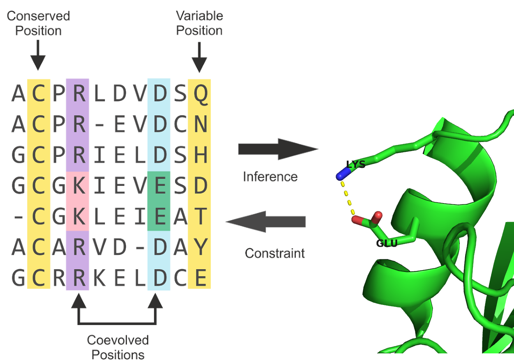
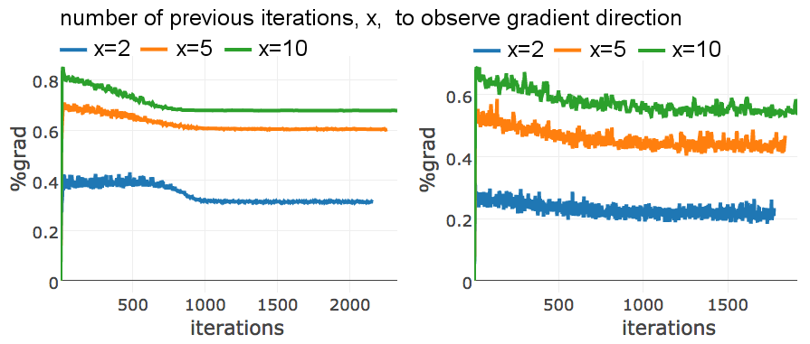
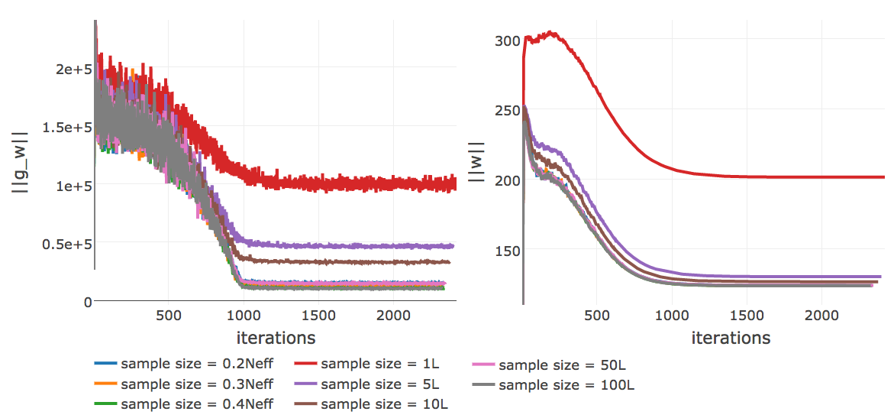
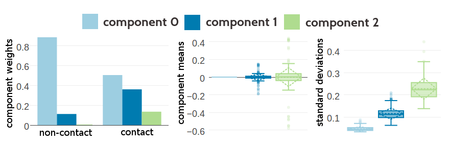
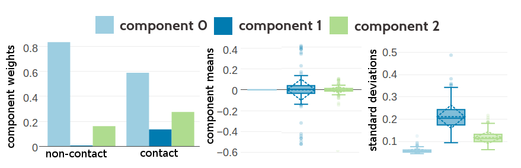

# Summary {-}

Despite tremendous efforts in automating experimental structure prediction and systematical target selection in structural genomics projects, the gap between the number of protein sequences and solved protein structures is constantly widening.
While high-throughput DNA sequencing technologies are advancing at an extraordinary pace, thereby not only decreasing the amount of time needed to sequence whole genomes but also drastically reducing costs, experimental techniques for structure determination are still labour intensive, time-consuming and very expensive.
This trend illustrates the essential importance of computational approaches that can complement experimental structural biology efforts in order to bridge the sequence-structure gap.

About half of the known protein families are annotated with experimental structural data and most likely are eligible for template-based structure prediction by which the protein structure is inferred from experimentally solved structures of homologous proteins.
The other half can theoratically be addressed by *de novo* structure prediction methods that minimize physical or knowledge based energy functions to identify the lowest-energy conformation that generally corresponds to the native protein conformation.
However, in practice these approaches are limited by the immense computational costs to search the space of possible conformations.

Recent advancements in residue-residue contact prediction have enabled the *de novo* prediction of protein structures by constraining the overall protein fold and thereby reducing the conformational search space sufficiently.
Residue-residue contact prediction is based on the old idea that spatially proximate amino acid residues tend to coevolve, leaving an echo of correlations in the evolutionary record.
The predicted contacts can not only be used to guide *de novo* structure prediction but they have also been successfully applied in diverse biological fields, such as predicting residue interactions in protein interfaces, studying protein flexibility and alternative conformations, quantifying the effects of mutations and ranking and validation of structural models. 

Despite the immense success of the new generation of contact prediction methods, several open challeges need to be addresed to broaden their applicability.
The most evident limitation lies in the requirement of deep alignments that amplify the coevolutionary signal.
Unfortunately, the most interesting targets for contact prediction, being protein families without any associated structural information, comprise low numbers of homologous sequences.
Furthermore, the current methods apply heuristics that leave certain aspects of the available coevolutionary information unexploited but have so far resisted efforts to replace them.

This work aims to improve the sensitivity of residue-residue contact prediction methods by exploiting the full coevolutionary information in a principled Bayesian framework.
The statistical model underlying the current contact prediction approaches is embedded into the Bayesian framework which allows to deliver posterior estimates of contact probabilities instead of heuristic contact scores.
The explicit modelling of amino acid preferences concealed in the coevolutionary coupling signal reflects the nature of residue-residue interactions.
Furthermore,the Bayesian framework can naturally be extended to derive estimates of the probability distributions of the distances between residue pairs, which will be the focus of future work.


# Acknowledgements {-}

I thank the world. 

<!--

I am very grateful to Johannes Söding, for giving me the opportunity to work in his lab, for his supervision and guidance on this fascinating project.
I learned a lot from you, not only analytical and statistical skills, but also about being a scientist and what holds the scientific world together at its core.
Your enthusiasm and your convincing attitude always kept me going.

I also want to thank Julien Gagneur for supervising this thesis together with the other members of my examination board: Franz Herzog, Klaus Förstermann, Karl-Peter Hopfner and Oliver Keppler.  
My thanks goes also to Roland Beckmann who was part of my thesis advisory commitee.
Special thanks goes to Julien who had great and pragmatic ideas that helped to keep the big picture in focus.

My gratitude goes also to the Quantitative Biosciences Munich graduate school.
Foremost to Ulrike Gaul and Erwin Frey for installing this great melting pot of science. 
With QBM's financial support I could visit inspiring conferences that helped me to grow as scientist and maybe even more as a person. 
Additionally, I thank the staff Mara Kieke, Julia Schlehe, Filiz Civril, Markus Hohle and Michael Mende who organized so many great lectures, workshops, and events for us and were always ready to help.

I want to thank my group, the Söding lab, for their support and distraction in- and outside the lab. 
You were more than mere colleagues, you became true friends and made me enjoy coming to work every single day.
In particular to Anja and Mark who stayed, like me, in Munich until the very end.
It will be an honor to shut down the lights in our beloved djungle office together with you.
Thanks a lot, Jessica, for finding the time for proofreading, even when there is no time at all.
My thanks also go to the Gagneur group with whom we shared the office space at the LMU gene center for many years. 
Thanks for your open office doors during my Garching visits whenever I felt I needed company. 

I also want to thank my former coaches, Henrik Lindner and Torsten Kunke, who supported my decision to leave the army and send me on my way to becoming Dr. Susi.
Without you I might still be soaring the skies. 

I want to thank my family for raising me curious and sceptical and therefore having me equipped with fundamental scientific skills. 

Daniel you are the love of my life.

-->

\tableofcontents
\addcontentsline{toc}{chapter}{Table of Contents}


\mainmatter \setcounter{page}{1}

<!--chapter:end:index.md-->

# Biological Background {#general-intro}

In 1972, Anfinsen and his collegues received the Nobel Prize for their research on protein folding which lead to the postulation of one of the basic principles in molecular biology, which is known as *Anfinsen's dogma*: a protein's native structure is uniquely determined by its amino acid sequence [@Anfinsen1973]. 
With certain exceptions (e.g. intrinsically disordered proteins [@Wright1999], prions[@Fraser2014]), this dogma has proven to hold true at least for globular proteins.

Ever since, it is regarded as the biggest challenge in structural bioinformatics to realiably predict a protein's structure given only its amino acid sequence [@Samish2015; @Schwede2013]. 
*De&#160;novo* protein structure prediction methods minimize physical or knowledge based energy functions to identify the lowest-energy conformation that generally corresponds to the native protein conformation.
However, due to the high degree of conformational flexibility, the search space of possible conformations cannot be explored exhaustively for proteins of typical length.
Given a protein with 101 residues that has 100 peptide bonds with two torsion angles each and assuming three stable conformations for each of the bond angles, there will be $3^200 \approx  10^{95}$ configurations.
This number of conformations cannot be sampled sequentially in a lifetime, even when sampling at high rates.
Yet, proteins fold almost instantaneously within milliseconds. 
This discrepancy is known as Levinthal's paradox [@Levinthal1969] and limits purely *de novo* based protein structure prediction to small proteins.

Far more successfull are template-based modelling approaches. 
Given the observation that structure is more conserved than sequence in a protein family [@Lesk1980], the structure of a target protein can be inferred from a homologue protein [@Sander1991]. 
The degree of structural conservation is linked to the level of pairwise sequence identity [@Chothia1986]. 
Therefore, the accuracy of a model crucially depends on the sequence identity between target and template and determines the applicability of the model [@Marti-Renom2000]. 
By definition, homology derived models are unable to capture new folds and their main limitation lies in the availability and identification of suitable templates [@Dorn2014].  

The number of solved protein structures increases steadily but only slowly, as experimental methods are both time consuming and expensive [@Dorn2014].
The [PDB](#abbrev)[@Berman2000] is the main repository for marcomolecular structures and currently (October 2017) holds about 135,000 atomic models of proteins. 
The primary technique for determining protein structures is X-ray crystallography, accounting for roughly 90% of entries in the [PDB](#abbrev). 
About 9% of protein structures have been solved using [NMR](#abbrev) and less than 1% using [EM](#abbrev) (see left plot in Figure \@ref(fig:seq-str-gap)).

(ref:caption-seq-str-gap) Yearly growth of number of solved structures in the [PDB](#abbrev) [@Berman2000] and protein sequences in the Uniprot [@TheUniProtConsortium2017]. **Left** Yearly growth of structures in PDB by structure determination method. **Right** Yearly growth of protein sequences in the UniprotKB/TrEMBL, containing automatically annotated sequences, and in the UniprotKB/SwissProt, which is curated by experts who critically review experimental and predicted, and protein structures in the [PDB](#abbrev).

```{r seq-str-gap, echo = FALSE, screenshot.alt="img/intro/pdb_uniprot_stats.png",out.width = '100%', fig.cap = '(ref:caption-seq-str-gap)'}
knitr::include_url("img/intro/pdb_uniprot_stats.html", height = "500px")
```

All three experimental techniques have advantages and limitations with respect to certain modelling aspects.
X-ray crystallography involves protein overexpression, purification and crystallization and finding the the correct experimental conditions to arrive at a pure and regular crystal is a challenging and sometimes impossible task. 
Especially membrane proteins are difficult to study owing to their overall flexibility and hydrophobic surfaces which requires suitable detergents to extract the proteins from their membrane environment which in turn makes crystallization even more challenging [@Carpenter2008; @Moraes2014].
Furthermore, the unnatural crystal environment can result in crystal-induced artifacts, like altererd sidechain conformations due to crystal packing interactions [@Jacobson2002]. 
In contrast, Nuclear magnetic resonance (NMR) spectroscopy studies the protein in solution under physiological conditions and enables the observation of intramolecular dynamics, reaction kinetics or protein folding as ensembles of protein structures can be observed [@Bieri2011]. 
On the downside, validation of NMR-derived structure ensembles is complicated and there is an upper size limit of about 25 kDa for efficient use of the technique [@Billeter2008]. 
Recently, cryo-EM has undergone a "resolution revolution" and macromolecules have been solved to near-atomic resolutions [@Egelman2016; @Fernandez-Leiro2016].
Technological developments, such as better electron detectors as well as advanced image processing software has enabled high resolution structure determination and led to an exponential growth in number of structures deposited in the PDB.
Cryo-EM is particularly suited to study large macromolecular complexes without the need to make crystals and therefore complements the other two structure determination techniques. 

In contrast to the tedious task of determining the tertiary structure of a protein to atomic resolution, it has become very easy to decipher the primary sequence of proteins. 
Since the completion of the human genome in 2003, high-throughput sequencing technologies have been developed at an extraordinary pace, thereby not only decreasing the amount of time needed to sequence whole genomes but also drastically reducing costs [@Reuter2015]. 
The price for sequencing a single genome has dropped from the US\$3 billion spent by the Human Genome Project to as little as US\$1,000[@Goodwin2016].
At the beginning of 2017, Illumina announced the launch of their latest high-throughput sequencing technology, NovaSeq, which is capable of sequencing $\sim \! 48$ human genomes in parallel at 30x coverage within ~45hours [@NovaSeqSystemSpecifications].
Advances in sequencing technologies have led to the emergence of new fields of studies, like metagenomics and single-cell genomics, that enable sequencing of microorganisms that cannot be cultured in a lab [@Tringe2005; @Hugenholtz2008; @Wooley2010]. 
With these approaches the genomic coverage of the microbial world is expanding which is directly reflected in a substantial increase in novel protein families [@Rinke2013; @Mukherjee2017; @Forster2017]. 
About 90 million sequences (October 2017) have been translated into protein amino acid sequences and are stored in the UniprotKB/TrEMBL database, the leading resource for protein sequences [@TheUniProtConsortium2017].


The resultant gap between the number of protein structures and protein sequences is constantly widening (see right plot in Figure \@ref(fig:seq-str-gap)) despite tremendous efforts in automating experimental structure determination and new developments such as electron crystallography[@Schwede2013; @Clabbers2017].
This trend illustrates the essential importance of computational approaches that can complement experimental structural biology efforts in order to bridge this gap.
Over the last decades, template-based methods have matured to a point where they are able to generate high-resolution structural models that are routinley and conveniently used in life-science research and by the biological community [@Schwede2013; @BKC2016].
*De novo* methods aiming at predicting protein structures from sequence alone are required in case no homologue template structure can be identified or the protein sequence represents a novel fold.
Albeit purely *de novo* approaches are hampered by the combinatorial explosion of possible conformations for larger proteins, combining them with structural information from heterogenous sources can help to reduce the degrees of freedom in the conformational search space [@Schwede2013].
For example, sparse low-resolution experimental data from chemical cross-linking/mass spectroscopy or nuclear Overhauser enhancement (NOE) distance data generated from [NMR](#abbrev) experiments, provide distance restraints to guide folding to a correct structure [@Li2004; @Walzthoeni2013; @Rappsilber2011].
Sophisticated integrative approaches, exploiting structural information from different types of experiments have proven to be a powerful approach [@Ornes2016; @Ward2013; @Tang2015]. 


(ref:caption-contact-map) 2D and 3D representations of triabin, a thombin inhibitor from triatoma pallidipennis (PDB identifier 1avg chain I). **Left** The upper left matrix illustrates a contact map using an $10 \angstrom \Cb$ cutoff. A black square is drawn at position $(i, j)$ if the $\Cb$ atoms of residues $i$ and $j$ are closer than $8 \angstrom$ in the structure. The lower right matrix illustrates a distance map. Color reflects $\Cb$ distances between residue pairs with red colors representing $\Delta \Cb \le 10 \angstrom$ and blue colors representing  $\Delta \Cb > 10 \angstrom$. **Right** 3D Structure showing an eight-stranded beta-barrel. 

```{r contact-map, echo = FALSE, out.width='100%', fig.align = 'center', fig.cap = '(ref:caption-contact-map)'}
knitr::include_graphics("img/intro/contat_map_and_structure_1avgi00.png")
```


Recently, computational methods have been developed using co-evolution information from deep multiple sequence alignments to predict contacts between pairs of amino acid residues.
More surprisingly, the modern contact prediction approaches produce predictions that are sufficiently accurate to successfully deduce the native fold of the protein [@Marks2011].
It has long been known that native contacts can be used to reliably reconstruct native protein 3D structure [@Vendruscolo1997].
Residue-residue contacts can be visualized in a contact map which is a binary $L \times L$ matrix, with $L$ being protein length.
For two residues, $i$ and $j$, the binary element in the matrix $C(i,j)$ is 

\begin{equation}
    C(i,j) =    
    \begin{cases}
        1, & \text{if } \Delta \Cb < T \\
        0, & \text{otherwise}
    \end{cases}
\end{equation}
where $\Delta \Cb$ is the euclidean distance between $\Cb$ atoms ($C_\alpha$ for glycine) of residues $i$ and $j$ and $T$ is a distance threshhold (typically 8 $\angstrom$).
Figure \@ref(fig:contact-map) shows an example of a residue-residue contact map generated from a small protein domain.


Eventhough a contact map provides only a 2D represenation of the protein structure, it retains the full 3D structural information of a protein.
While it has been shown that only a small subset of native contacts is sufficient to allow accurate modelling of the protein structure, the quality of predicted residue-residue contacts crucially controls the quality of the final structural model [@Kim2014; @Duarte2010].
The last years have seen an enourmous wealth of studies applying predicted residue-residue contacts not only as distance constraints for *de novo* modelling of protein structures, but also in many different fields in structural biology, such as domain prediction [@Sadowski2013], studying alternative conformations [@Parisi2015a] or mutational landscapes [@Hopf2017]. 
The next chapter gives an introduction to state-of-the-art contact prediction approaches, how the predicted residue-residue contacts are applied and which challenges the current methods have to face. 
The aim of this thesis is therefore to improve the models for residue-residue contact prediction by developing a Bayesian framework that addresses some of these challenges.

<!--

### Amino Acid Interactions {#amino-acid-interactions}

The Venn diagram in figure \@ref(fig:amino-acid-physico-chemical-properties) displays a typical classification of amino acids with respect to their physico-chemical properties. 


The aromatic amino acids tryptophan (W), tyrosine (Y), phenylalanine (F), and histidine (H) contain an aromatic ring system. 
Generally, aromatic ring systems are planar, and electons are shared over the whole ring structure.
Interactions between aromatic residues have very constrained geometries regarding the angle between the centroid of their rings. 
The $\pi$-electron systems favour T-shaped or offset stacked conformations [@Waters2002].
Preferred distances between aromatic residues have been observed between 4.5$\angstrom$ and 7$\angstrom$ of their ring centroids [@Burley1985].

Cysteine (C) residues can form disulphide bonds, which are the only covalent bonds between two amino acid side chains.
They comprise the strongest side chain interactions in protein structures and their length varies between 3.5$\angstrom$ to 4$\angstrom$.
Disulphide bonds also have a well defined geometry: there are five dihedral angles in a disulphide bond resulting in 20 different possible configurations. 
Only one configuration is favoured so that the dihedral angle between the carbon and sulfur atoms is close to 90 degrees [@Thornton1981].
They play a very important role in stabilizing protein structures. 
The number of disulfide bonds is negatively correlated with protein length: smaller proteins have more disulfide bonds helping to stabilize the structure in absence of strong hydrophobic packing in the core.
It has also been found that disulfide bonds are more frequently observed in proteins of hyperthermophilic bacteria, being positively selected for increased stability [@Bastolla2005].

Salt bridges are based on electrostatic interactions between positively charged residues (arginine (R) and lysine (K)) and negatively charged residues (aspartic acid (D) and glutamic acid (E)). 
The strength of electrostatic interactions, as described by Coulomb's law, decreases with distance between the point charges at the functional groups. 
It has been found to be maximal at 4$\angstrom$ with respect to the functional groups of the both residues [@Donald2011].

Hydrogen bonds can be formed between a donor residue which possesses an hydrogen atom attached to a strongly electronegative atom and an acceptor residue which possesses an electronegative atom with a lone electron pair. 
They are electrostatic interactions as well and thus their strength depends on distance as well. 
Hydrogen bonds are formed at distances of 2.4$\angstrom$ to 3.5$\angstrom$ between the non-hydrogen atoms (Berg JM, Tymoczko JL, 2002).

Salt bridges as well as hydrogen bonds have strong geometric preferences (Kumar and Nussinov, 1999). 
The geometry of a hydrogen bond depends on the angle between the HB donor, the hydrogen atom and the HB acceptor (Torshin et al., 2002).

Cation–$\pi$ interactions are formed between positively charged or partially charged amino acids with amino groups (K,R,Q,E) and aromatic residues (W,Y,F,H). 
The preferential distance of the amino group to the $\pi$-electron system has been determined between 3.4$\angstrom$ and 6$\angstrom$ [@Burley1986] [@Crowley2005]
Their role in stabilizing protein structures is still under debate [@Slutsky2004].

Proline residues are conformationally restricted, with the alpha-amino group of the backbone directly attached to the side chain. 
The sterical rigidity of the proline side chain restricts the backbone angle and thus affects secondary structure formation.
Proline is known as a helix-breaker. 
Whereas other aromatic side chains are defined by their negatively charged $\pi$ faces, the face of proline side chains is partially positively charged.
Thus, aromatic and proline residues can interact favorably with each other.
Once due to the hydrophobic nature of the residues and also due to the interaction between the negatively charged aroamtic $\pi$ face and the polarized C-H bonds in proline, called a CH/$\pi$  interaction.

Petersen et al. (2012) found clear secondary structure elements preferences for each amino acid pair. 
For example, residue pairs containing Alanine and Leucine are predominantly found in buried $\alpha$-helices, whereas pairs containing Isoleucine and Valine preferentially are located in $\beta$-sheet environments. 
Of course, solvent accessibility represents an important criterion for residue interactions. 
Hydrophobic residues are rather buried in the structure, whereas polar and charged residues are found more frequently on the protein surface and interact with water molecules.

```{r amino-acid-physico-chemical-properties, echo = FALSE, out.width = '50%',  fig.cap = 'Physico-chemical properties of amino acids. The 20 naturally occuring amino acids are grouped with respect to ten physico-chemical properties. Adapted from Figure 1a in [@Livingstone1993].'}
knitr::include_graphics("img/amino_acid_physico_chemical_properties_venn_diagramm.png")
```

-->

<!--chapter:end:03-intro.Rmd-->

# Introduction to Contact Prediction

Contact prediction refers to the prediction of physical contacts between amino acid side chains in the 3D protein structure, given the protein sequence as input. 

Historically, contact prediction was motivated by the idea that compensatory mutations between spatially neighboring residues can be traced down from evolutionary records [@Gobel1994].
As proteins evolve, they are under selective pressure to maintain their function and correspondingly their structure.
Consequently, residues and interactions between residues constraining the fold, protein complex formation, or other aspects of function are under selective pressure.
Highly constrained residues and interactions will be strongly conserved [@Godzik1989]. 
Another possibility to maintain structural integrity is the mutual compensation of unbeneficial mutations.
For example, the unfavourable mutation of a small amino acid residue into a bulky residue in the densely packed protein core might have been compensated in the course of evolution by a particularly small side chain in a neighboring position. 
Other physico-chemical quantities such as amino acid charge or hydrogen bonding capacity can also induce compensatory effects[@Neher1994].
The [MSA](#abbrev) of a protein family comprises homolog sequences that have descended from a common ancestor and are aligned relative to each other.
According to the hypothesis, compensatory mutations show up as correlations between the amino acid types of pairs of [MSA](#abbrev) columns and can be used to infer spatial proximity of residue pairs (see Figure \@ref(fig:correlated-mutations)).

(ref:caption-correlated-mutations)  The evolutionary record of a protein family reveals evidence of compensatory mutations between spatially neighboring residues that are under selective pressure with respect to some physico-chemical constraints. Mining protein family sequence alignments for residue pairs with strong coevolutionary signals using statistical methods allows inference of spatial proximity for these residue pairs.

```{r correlated-mutations, echo = FALSE, out.width='90%', fig.align = 'center', fig.cap = '(ref:caption-correlated-mutations)'}

```


The following sections will give an overview over important methods and developments in the field of contact prediction.


## Local Statistical Models {#local-methods}

Early contact prediction methods used local pairwise statistics to infer contacts that regard pairs of amino acids in a sequence as statistically independent from another.

Several of these methods use correlation coefficient based measures, such as Pearson correlation between amino acid counts, properties associated with amino acids or mutational propensities at the sites of a [MSA](#abbrev) [@Neher1994; @Taylor1994; @Gobel1994; @Oliveira2002; @Shindyalov1994]. 

Many methods have been developed that are rooted in information theory and use [MI](#abbrev) measures to describe the dependencies between sites in the alignment [@Clarke1995; @Korber1993; @Martin2005].
Phylogenetic and entropic biases have been identified as strong sources of noise that confound the true coevolution signal [@Atchley2000; @Fodor2004; @Martin2005].
Different variants of [MI](#abbrev) based approaches address these effects and improve on the signal-to-noise ratio [@Atchley2000; @Tillier2003; @Gouveia_Oliveira2007].
The most prominent correction for background noises is [APC](#abbrev) that is still used by many modern methods and is discussed in section  \@ref(post-processing-heuristics) [@Dunn2008].
Another popular method is *OMES* that essentially computes a chi-squared statistic to detect the differences between observed and expected pairwise amino acid frequencies for a pair of columns [@Kass2002; @Noivirt2005].

The traditional covariance approaches suffered from high false positive rates because of their inability to cope with transitive effects that arise from chains of correlations between multiple residue pairs [@Lapedes1999; @Burger2010; @Weigt2009].
The concept of transitve effects is illustrated in Figure \@ref(fig:transitive-effect).
Considering three residues A, B and C, where A physically interacts with B and B with C.
Strong statistical dependencies between pairs (A,B) and (B,C) can induce strong indirect signals for residues A and C, eventhough they are not physically interacting.
These indirect correlations can become even larger than signals of other directly interacting pairs (D,E) and thus lead to false predictions [@Burger2010].

Local statistical methods consider residue pairs independent of one another which is why they cannot distinguish between direct and indirect correlation signals.
In contrast, global statistical models presented in the next section learn a joint probability distribution over all residues allowing to disentangle transitive effects [@Weigt2009; @Burger2010].
Eventhough local statistical methods cannot compete with modern predictors, *OMES* and [MI](#abbrev) based scores often serve as a baseline in performance benchmarks for contact prediction [@DeJuan2013; @Jones2012].
 

(ref:caption-transitive-effect) Effects of chained covariation obscure signals from true physical interactions. Consider residues A through E with physical interactions between the residue pairs A-B, B-C and D-E. The thickness of blue lines between residues reflects the strength of statistical dependencies between the corresponding alignment columns. Strong statistical dependencies between residue pairs (A,B) and (B,C) can induce a strong dependency between the spatially distant residues A and C. Covariation signals arising from transitive effects can become even stronger than other direct covariation signals and lead to false positive predictions.  

```{r transitive-effect, echo = FALSE, out.width='25%',  fig.align='center', fig.cap = '(ref:caption-transitive-effect)'}
knitr::include_graphics("img/intro/transitive_effects.png")
```


## Global Statistical Models {#global-methods}

A huge leap forward was the development of sophisticated statistical models that make predictions for a single residue pair while considering all other pairs in the protein.
These global models allow for the distinction between transitive and causal interactions which has been referred to in the literature as [DCA](#abbrev) [@Lapedes1999; @Weigt2009].

In 1999 Lapedes et al. were the first to propose a global statistical approach for the prediction of residue-residue contacts in order to disentangle transitive effects [@Lapedes1999].
They consider a Pott's model that can be derived under a maximum entropy assumption and use the model specific coupling parameters to infer interactions.
At that time the wider implications of this advancement went unnoted, but meanwhile the Pott's Model has become the most prominent statistical model for contact prediction.
Section \@ref(maxent) deals extensively with the derivation and properties of the Pott's model, its application to contact prediction and its numerous realizations.

A global statistical model not motivated by the maximum entropy approach was proposed by Burger and Nijmwegen in 2010 [@Burger2008; @Burger2010]. 
Their fast Bayesian network model incorporates additional prior information and phylogenetic correction via [APC](#abbrev) but cannot compete with the pseudo-likelihood approaches presented in section \@ref(pseudo-likelihood). 


## Machine Learning Methods and Meta-Predictors {#meta-predictors}

With the steady increase in protein sequence data, machine learning based methods have emerged that extract features from [MSAs](#abbrev) in order to learn associations between input features and residue-residue contacts.
Sequence features typically include predicted solvent accessibility, predicted secondary structure, contact potentials, conservation scores, global protein features, pairwise coevolution statistics and averages of certain features over sequence windows. 
Numerous sequence-based methods have been developed using machine learning algorithms, such as support support vector machines (*SVMCon* [@Cheng2007], *SVM-SEQ* [@Wu2008]), random forests (*ProC_S3* [@Li2011], *TMhhcp* [@Wang2011], *PhyCMap* [@Wang2013]), neural networks (*NETCSS* [@Fariselli2001a], *SAM* [@Shackelford2007], [@Hamilton2004a], *SPINE-2D* [@Xue2009a], *NNCon* [@Tegge2009a]) deep neural networks (*DNCon* [@Eickholt2012], *CMAPpro* [@DiLena2012a]) and ensembles of genetic algorithm classfiers (*GaC* [@Chen2010]).

Different contact predictors, especially when rooted in distinct principles like sequence-based and coevolution methods, provide orthogonal information on the likelihood that a pair of residues makes a contact [@Cheng2007; @Jones2015].
The next logical step in method development therefore constitutes the combination of several base predictors and classical sequence-derived features in the form of meta-predictors.

The first published meta-predictor was *PconsC* in 2013, combining sequence features and predictions from the coevolution methods *PSICOV* and *plmDCA* [@Skwark2013].
In a follow-up version *PSICOV* has been replaced with *gaussianDCA* and the sequence-based method *PhyCMap* [@Skwark2016].
*EPC-MAP* was published in 2014 integrating *GREMLIN* as a coevolution feature with physicochemical information from predicted ab initio protein structures [@Schneider2014].
In 2015, *MetaPSICOV* was released combining predictions from *PSICOV*, *mfDCA* and *CCMpred* with other sequence derived feautures [@Jones2015a].
*RaptorX* uses *CCMpred* as coevolution feature and other standard contact prediction features within an ultra-deep neural network [@Wang2016a].
The newest developments *EPSILON-CP* and *NeBcon* both comprise the most comprehensive usage of contact prediction methods so far, combining five and eight state-of-the-art contact predictors, respectively [@Stahl2017; @He2017]. 

Another conceptual advancement besides the combination of sources of information is based on the fact that contacts are not randomly or independently distributed.
DiLena and colleagues found that over 98% of long-range contacts (sequence separation > 24 positions) are in close proximity of other contacts, compared to 30% for non-contacting pairs [@DiLena2012a].
The distribution of contacts is governed by local structural elements, like interactions between helices or $\beta$-sheets, leading to characteristic patterns in the contact map that can be recognised [@Andreani2015a].
Deep learning provides the means to model higher level abstractions of data and several methods apply multi-layered algorithms to refine predictions by learning patterns that reflect the local neighborhood of a contact [@Skwark2014a; @Jones2015a; @DiLena2012a; @Wang2016a]. 


Eventhough a benchmark comparing the recently developed meta-predictors is yet to be made, it becomes clear from the recent [CASP](#abbrev) experiments, that meta-predictors outperform pure coevolution methods [@Monastyrskyy2015].
As coevolution scores comprise the most informative feautures among the set of input features, it is clear that meta-predictors will benefit from further improvements of pure coevolution methods [@Wang2016a; @Stahl2017]. 


## Modelling Protein Families with Potts Model {#maxent}

Infering contacts from a joint probability distribution over all residues in a protein sequence instead of using simple pairwise statistics has been proven to enable the distinction of direct statistical dependencies between residues from indirect dependencies mediated through other residues.
The global statistical model that is commonly used to describe this joint probability distribution is the *Potts model*. 
It is a well-established model in statistical mechanics and can be derived from a maximum entropy assumption which is explained in the following.

The principle of maximum entropy, proposed by Jaynes in 1957 [@Jaynes1957a; @Jaynes1957b], states that the probability distribution which makes minimal assumptions and best represents observed data is the one that is in agreement with measured constraints (prior information) and has the largest entropy. 
In other words, from all distributions that are consistent with measured data, the distribution with maximal entropy should be chosen.


A protein family is represented by a [MSA](#abbrev) $\X = \{ \seq_1, \ldots, \seq_N \}$ of $N$ protein sequences.
Every protein sequence of the protein family represents a sample drawn from a target distribution $p(\seq)$, so that each protein sequence is associated with a probability. 
Each sequence $\seq_n = (\seq_{n1}, ..., \seq_{nL})$ is of length $L$ and every position constitutes a categorical variable $x_{i}$ that can take values from an alphabet indexed by $\{0, ..., 20\}$, where 0 stands for a gap and $\{1, ... , 20\}$ stand for the 20 types of amino acids. 
The measured constraints are given by the empirically observed single and pairwise amino acid frequencies that can be calculated as

<!--
Applied to the problem of modelling protein families, one seeks a probability distribution $p(\seq)$ for protein sequences $\seq = (x_1, \ldots, x_L)$ of length $L$ from the protein family under study. 
The categorical variables $x_{i}$ can take one of $q=21$ values representing the 20 naturally occuring amino acids and a gap ('-').
Given $N$ sequences of the protein family in a [MSA](#abbrev) with $\X = \{ \seq_1, \ldots, \seq_N \}$, the empirically observed single and pairwise amino acid frequencies can be calculated as
-->


\begin{equation}
    f_i(a) = f(x_i\eq a) = \frac{1}{N}\sum_{n=1}^N I(x_{ni} \eq a) \; ,
\end{equation}

\begin{equation}
    f_{ij}(a,b) = f(x_i\eq a, x_j\eq b) = \frac{1}{N} \sum_{n=1}^N I(x_{ni} \eq a, x_{nj} \eq b) \; .
 (\#eq:emp-freq)
\end{equation}


According to the maximum entropy principle, the distribution $p(\seq)$ should have maximal entropy and reproduce the empirically observed amino acid frequencies, so that

\begin{align}
   f(x_i\eq a)            &\equiv p(x_i\eq a)  \nonumber\\
                                    &= \sum_{\seq\prime_1, \ldots, \seq\prime_L = 1}^{q} p(x\prime) I(x\prime_i \eq a) \\
  f(x_i\eq a, x_j\eq b)   &\equiv p(x_i\eq a, x_j \eq b) \nonumber \\
                                    &= \sum_{\seq\prime_1, \ldots, \seq\prime_L = 1}^{q}  p(x\prime) I(x\prime_i\eq a, x\prime_j \eq b)  \; .
 (\#eq:maxent-reproducing-emp-freq)
\end{align}


Solving for the distribution $p(\seq)$ that maximizes the Shannon entropy $S= -\sum_{\seq\prime} p(\seq\prime) \log p(\seq\prime)$ while satisfying the constraints given by the empircial amino acid frequencies in eq. \@ref(eq:maxent-reproducing-emp-freq) by introducing Lagrange multipliers $\wij$ and $\vi$, results in the formulation of the *Potts model*,

<!--
\begin{align}
F \left[ p(\seq) \right] =& -\sum_{\seq\prime} p(\seq\prime) \log p(\seq\prime) \\
        & + \sum_{i=1}^L \sum_{a=1}^{q} \vi(a) \left( p(x_i\eq a) - \mathcal{f}(x_i\eq a) \right) \\
        & + \sum_{1 \leq i < j \leq L}^L \; \sum_{a,b=1}^{q} \wij(a,b) \left( p(x_i\eq a, x_j \eq b) - \mathcal{f}(x_i\eq a, x_j\eq b) \right) \\
        & + \Omega \left( 1-\sum_{\seq\prime} p(\seq\prime)  \right)
(\#eq:derivation-max-ent-model)
\end{align}
-->

\begin{equation}
    p(\seq | \v, \w ) = \frac{1}{Z(\v, \w)} \exp \left( \sum_{i=1}^L v_i(x_i) \sum_{1 \leq i < j \leq L}^L w_{ij}(x_i, x_j) \right) \; .
(\#eq:max-ent-model)
\end{equation}

The Lagrange multipliers $\wij$ and $\vi$ remain as model parameters to be fitted to data.
$Z$ is a normalization constant also known as *partition function* that ensures the total probabilty adds up to one by summing over all possible assignments to $\seq$, 

\begin{equation}
  Z(\v, \w) = \sum_{\seq\prime_1, \ldots, \seq\prime_L = 1}^{q} \exp  \left( \sum_{i=1}^L v_i(x_i) \sum_{1 \leq i < j \leq L}^L w_{ij}(x_i, x_j) \right) \; .
  (\#eq:partition-fct-likelihood)
\end{equation}


### Model Properties {#potts-model-properties}

The Potts model is specified by singlet terms $\via$ which describe the tendency for each amino acid a to appear at position $i$, and pair terms $\wijab$, also called couplings, which describe the tendency of amino acid a at position $i$ to co-occur with amino acid b at position $j$.
In contrast to mere correlations, the couplings explain the causative dependence structure between positions by jointly modelling the distribution of all positions in a protein sequence and thus account for transitive effects. 
By doing so, a major source of noise in contact prediction methods is eliminated.

To get some intuition for the coupling coefficients, note that $\wijab = 1$ corresponds to a 2.7-fold higher probability for a and b to occur together than what is expected from the singlet frequencies if
a and b were independent. 
Pairs of residues that are not in contact tend to have negligable couplings, $\wij \approx 0$, whereas pairs in contact tend to have vectors significantly different from 0.
For contacting residues $i$ and $j$ in real world [MSAs](#abbrev) typical coupling strengths are on the order of $||\wij || \approx 0.1$ (regularization dependent).


Maximum entropy models naturally give rise to exponential family distributions that express useful properties for statistical modelling, such as the convexity of the likelihood function which consequently has a unique, global minimum [@Wainwright2007; @Murphy2012]. 

The Potts model is a discrete instance of what is referred to as a pairwise [Markov random field](#abbrev) in the statistics community.
[MRFs](#abbrev) belong to the class of undirected graphical models, that represent the probability distribution in terms of a graph with nodes and edges characterizing the variables and the dependence structure between variables, respectively.

#### Gauge Invariance {#gauge-invariance}

As every variable $x_{ni}$ can take $q=21$ values, the model has $L \! \times \! q + L(L-1)/2 \! \times \! q^2$ parameters.
But the parameters are not uniquely determined and multiple parametrizations yield identical probability distributions. 

For example, adding a constant to all elements in $v_i$ for any fixed position $i$ or similarly adding a constant to $\via$ for any fixed position $i$ and amino acid $a$ and subtracting the same constant from the $qL$ coefficients $\wijab$ with $b \in \{1, \ldots, q\}$ and $j \in \{1, \ldots, L \}$ leaves the probabilities for all sequences under the model unchanged, since such a change will be compensated by a change of $Z(\v, \w)$ in eq. \@ref(eq:partition-fct-likelihood).


The overparametrization is referred to as *gauge invariance* in statistical physics literature and can be eliminated by removing parameters [@Weigt2009; @Morcos2011].
An appropriate choice of which parameters to remove, referred to as *gauge choice*, reduces the number of parameters to $L \! \times \! (q-1) + L(L-1)/2 \! \times \! (q-1)^2$.
Popular gauge choices are the *zero-sum gauge* or *Ising-gauge* used by Weigt et al. [@Weigt2009] imposed by the restraints,

\begin{equation}
    \sum_{a=1}^{q} v_{ia} = \sum_{a=1}^{q} \wijab = \sum_{a=1}^{q} w_{ijba} = 0
(\#eq:zero-sum-gauge)
\end{equation}

for all $i,j,b$  or the *lattice-gas gauge* used by Morcos et al [@Morcos2011] and Marks et al [@Marks2011] imposed by restraints

\begin{equation}
    \wij(q,a) = \wij(a,q) = \vi(q) = 0
(\#eq:ising-gauge)
\end{equation}

for all $i,j,a$ [@Cocco2017].

Alternatively, the indeterminacy can be fixed by including a regularization prior (see next section).
The regularizer selects for a unique solution among all parametrizations of the optimal distribution and therefore eliminates the need to choose a gauge [@Koller2009; @Ekeberg2013;  @Stein2015a].


### Inferring Parameters for the Potts Model  {#potts-mle}

Typically, parameter estimates are obtained by maximizing the log-likelihood function of the parameters over observed data.
For the Potts model, the log-likelihood function is computed over sequences in the alignment $\mathbf{X}$: 

\begin{align}
    \text{LL}(\v, \w | \mathbf{X}) =& \sum_{n=1}^N \log p(\seq_n)  \nonumber\\
    =& \sum_{n=1}^N \left[ \sum_{i=1}^L v_i(x_{ni}) + \sum_{1 \leq i < j \leq L}^L w_{ij}(x_{xn}, x_{nj}) - \log Z \right]
(\#eq:full-log-likelihood)
\end{align}


The number of parameters in a Potts model is typically larger than the number of observations, i.e. the number of sequences in the [MSA](#abbrev).
Considering a protein of length $L=100$, there are approximately $2 \times 10^6$ parameters in the model whereas the largest protein families comprise only around $10^5$ sequences (see Figure \@ref(fig:pfam)).
An underdetermined problem like this renders the use of regularizers neccessary in order to prevent overfitting.

Typically, an L2-regularization is used that pushes the single and pairwise terms smoothly towards zero and is equivalent to the logarithm of a zero-centered Gaussian prior,

\begin{align}
  R(\v, \w)  &= \log \left[ \mathcal{N}(\v | \mathbf{0}, \lambda_v^{-1} I) \mathcal{N}(\w | \mathbf{0}, \lambda_w^{-1} I) \right] \nonumber \\
             &= -\frac{\lambda_v}{2} ||\v||_2^2 - \frac{\lambda_w}{2} ||\w||_2^2 + \text{const.} \; ,
(\#eq:l2-reg)
\end{align}

where the strength of regularization is tuned via the regularization coefficients $\lambda_v$ and $\lambda_w$ [@Seemayer2014; @Ekeberg2014; @Kamisetty2013].

However, optimizing the log-likelihood requires computing the partition function $Z$ given in eq. \@ref(eq:partition-fct-likelihood) that sums $q^L$ terms.
Computing this sum is intractable for realistic protein domains with more than 100 residues.
Consequently, evaluating the likelihood function at each iteration of an optimization procedure is infeasible due to the exponential complexity of the partition function in protein length $L$.

Many approximate inference techniques have been developed to sidestep the infeasible computation of the partition function for the specific problem of predicting contacts that are briefly explained in the next section. 

### Solving the Inverse Potts Problem {#potts-model-solutions}

In 1999 Lapedes et al. were the first to propose maximum entropy models for the prediction of residue-residue contacts in order to disentangle transitive effects [@Lapedes1999].
In 2002 they applied their idea to 11 small proteins using an iterative Monte Carlo procedure to obtain estimates of the model parameters and achieved an increase in accuracy of 10-20% compared to the local statistical models [@Lapedes2012a]. 
As the calculations involved were very time-consuming and at that time required supercomputing resources, the wider implications were not noted yet.

Ten years later Weight et al proposed an iterative message-passing algorithm, here referred to as *mpDCA*, to approximate the partition function [@Weigt2009].
Eventhough their approach is computationally very expensive and in practice only applicable to small proteins, they obtained remarkable results for the two-component signaling system in bacteria.

Balakrishnan et al were the first to apply pseudo-likelihood approximations to the full likelihood in 2011  [@Balakrishnan2011]. 
The pseudo-likelihood optimizes a different objective and replaces the global partition function $Z$ with local estimates.
Balakrishnan and colleagues applied their method *GREMLIN* to learn sparse graphical models for 71 protein families.
In a follow-up study in 2013, the authors proposed an improved version of *GREMLIN* that uses additional prior information [@Kamisetty2013].

Also in 2011, Morcos et al. introduced a naive mean-field inversion approximation to the partition function, named *mfDCA* [@Morcos2011].
This method allows for drastically shorter running times as the mean-field approach boils down to inverting the empirical covariance matrix calculated from observed amino acid frequencies for each residue pair $i$ and $j$ of the alignment.
This study performed the first high-throughput analysis of intradomain contacts for 131 protein families and facilitated the prediction of protein structures from accurately predicted contacts in [@Marks2011].

The initial work by Balakrishnan and collegueas went almost unnoted as it was not primarily targeted to the problem of contact prediction.
Ekeberg and collegueas independently developed the pseudo-likelihood method *plmDCA*  in 2013 and showed its superior precision over *mfDCA* [@Ekeberg2013].

A related approach to mean-field approximation is sparse inverse covariance estimation, named *PSICOV*, developed by Jones et al. (2012) [@Jones2012]. 
PSICOV uses an L1-regularization, known as graphical Lasso, to invert the correlation matrix and learn a sparse graphical model [@Friedman2008].
Both procedures, *mfDCA* and *PSICOV*, assume the model distribution to be a multivariate Gaussian. 
It has been shown by Banerjee et al. (2008)that this dual optimization solution also applies to binary data, as is the case in this application, where each position is encoded as a 20-dimensional binary vector [@Banerjee2008]. 

Another related approach to *mfDCA* and *PSICOV* is *gaussianDCA*, proposed in 2014 by Baldassi et al. [@Baldassi2014].
Similar to the other both approaches, they model the data as multivariate Gaussian but within a simple Bayesian formalism by using a suitable prior and estimating parameters over the posterior distribution.

So far, pseudo-likelihood has proven to be the most successful approximation of the likelihood with respect to contact prediction performance. 
Currently, there exist several implementations of pseudo-likelihood maximization that vary in slight details, perform similarly and thus are equally popular in the community, such as CCMpred [@Seemayer2014], plmDCA[@Ekeberg2014] and GREMLIN [@Kamisetty2013].

#### Maximum Likelihood Inference for Pseudo-Likelihood {#pseudo-likelihood}

The pseudo-likelihood is a rather old estimation principle that was suggested by Besag already in 1975 [@Besag1975].
It represents a different objective function than the full likelihood and approximates the joint probability with the product over conditionals for each variable, i.e. the conditional probability of observing one variable given all the others:

\begin{align}
  p(\seq | \v,\w) \approx&   \prod_{i=1}^L p(x_i | \seq_{\backslash xi}, \v,\w) \nonumber \\
                        =&  \prod_{i=1}^L \frac{1}{Z_i} \exp \left(  v_i(x_i) \sum_{1 \leq i < j \leq L}^L w_{ij}(x_i, x_j) \right)
\end{align}

Here, the normalization term $Z_i$ sums only over all assignments to one position $i$ in sequence:

\begin{equation}
  Z_i = \sum_{a=1}^{q} \exp \left( v_i(a) \sum_{1 \leq i < j \leq L}^L w_{ij}(a, x_j) \right)
(\#eq:partition-fct-pll)
\end{equation}


Replacing the global partition function in the full likelihood with local estimates of lower complexity in the pseudo-likelihood objective resolves the computational intractability of the parameter optimization procedure.
Hence, it is feasible to maximize the pseudo-log-likelihood function,

\begin{align}
    \text{pLL}(\v, \w | \mathbf{X}) =& \sum_{n=1}^N \sum_{i=1}^L \log p(x_i | \seq_{\backslash xi}, \v,\w) \nonumber \\
    =& \sum_{n=1}^N \sum_{i=1}^L  \left[ v_i(x_{ni}) + \sum_{j=i+1}^L  w_{ij}(x_{ni}, x_{nj}) - \log Z_{ni} \right] \;,
\end{align}

plus an additional regularization term in order to prevent overfitting and to fix the gauge to arrive at a [MAP](#abbrev) estimate of the parameters, 

\begin{equation}
    \hat{\v}, \hat{\w} = \underset{\v, \w}{\operatorname{argmax}} \; \text{pLL}(\v, \w | \mathbf{X}) + R(\v, \w) \; .
\end{equation}


Eventhough the pseudo-likelihood optimizes a different objective than the full-likelihood, it has been found to work well in practice for many problems, including contact prediction [@Koller2009; @Murphy2012; @Stein2015a; @Ekeberg2013].
The pseudo-likelihood function retains the concavity of the likelihood and it has been proven to be a consistent estimator in the limit of infinite data for models of the exponential family [@Besag1975; @Gidas1988; @Koller2009]. 
That is, as the number of sequences in the alignment increases, pseudo-likelihood estimates converge towards the true full likelihood parameters.


### Computing Contact Maps {#post-processing-heuristics}

Model inference as described in the last section yields [MAP](#abbrev) estimates of the couplings $\hat{\w}_{ij}$. 
In order to obtain a scalar measure for the coupling strength between two residues $i$ and $j$, all available methods presented in section \@ref(potts-model-solutions) heuristically map the $21 \! \times \! 21$ dimensional coupling matrix $\wij$ to a single scalar quantity.

*mpDCA* [@Weigt2009] and *mfDCA* [@Morcos2011; @Marks2011] employ a score called [DI](#abbrev), that essentially computes the [MI](#abbrev) for two positions $i$ and $j$ using the couplings $\wij$ instead of pairwise amino acid frequencies.
Most pseudo-likelihood methods (*plmDCA* [@Ekeberg2013; @Ekeberg2014], *CCMpred* [@Seemayer2014], *GREMLIN* [@Kamisetty2013]) compute the *Frobenius norm* of the coupling matrix $\wij$ to obtain a scalar contact score $C_{ij}$,

\begin{equation}
    C_{ij}  = ||\wij||_2 = \sqrt{\sum_{a,b=1}^q \wijab^2} \; .
(\#eq:frobenius-norm)
\end{equation}

The Frobenius norm improves prediction performance over [DI](#abbrev) and further improvements can be obtained by computing the Frobenius norm only on the $20 \times 20$ submatrix thus ignoring contributions from gaps [@Ekeberg2013; @Baldassi2014; @Feinauer2014].
*PSICOV* [@Jones2012] uses an L1-norm on the $20 \times 20$ submatrix instead of the Frobenius norm.

Furthermore it should be noted that the Frobenius norm is gauge dependent and is minimized by the *zero-sum gauge* [@Weigt2009].
Therefore, the coupling matrices should be transformed to *zero-sum gauge* before computing the Frobenius norm

\begin{equation}
    \w^{\prime}_{ij}  = \wij - \wij(\cdot, b) - \wij(a, \cdot) + \wij(\cdot, \cdot) \; ,
(\#eq:zero-sum-gauge-transform)
\end{equation}

where $\cdot$ denotes average over the respective indices [@Ekeberg2013; @Ekeberg2014; @Seemayer2014; @Baldassi2014].


Another commonly applied heuristic known as [APC](#abbrev) has been introduced by Dunn et al. in order to reduce background noise arising from correlations between positions with high entropy or phylogenetic couplings [@Dunn2008].
[APC](#abbrev) is a correction term that is computed from the raw contact map as the product over average row and column contact scores $\overline{C_i}$ divided by the average contact score over all pairs $\overline{C_{ij}}$. 
The corrected contact score $C_{ij}^{APC}$ is obtained by subtracting the [APC](#abbrev) term from the raw contact score $C_{ij}$, 

\begin{equation}
    C_{ij}^{APC}  = C_{ij} - \frac{\overline{C_i} \; \overline{C_j}}{\overline{C_{ij}}}\; .
(\#eq:apc)
\end{equation}

Visually, [APC](#abbrev) creates a *smoothing* effect on the contact maps that is illustrated in Figure \@ref(fig:apc-correction) and it has been found to substantially boost contact prediction performance [@Dunn2008; @Kamisetty2013].
It was first adopted by *PSICOV* [@Jones2012] but is now used by most methods to adjust raw contact scores.

It was long under debate why [APC](#abbrev) works so well and how it can be interpreted. 
Zhang et al. showed that [APC](#abbrev) essentially approximates the first principal component of the contact matrix and therefore removes the highest variability in the matrix that is assumed to arise from background biases [@Zhang2016].
Furthermore, they studied an advanced decomposition technique, called LRS matrix decomposition, that decomposes the contact matrix into a low-rank and a sparse component, representing background noise and true correlations, respectively.  
Inferring contacts from the sparse component works astonishing well, improving precision further over [APC](#abbrev) independent of the underlying statistical model.

Dr Stefan Seemayer could show that the main component of background noise can be attributed to entropic effects and that a substantial part of [APC](#abbrev) amounts to correcting for these entropic biases (unpublished).
In his doctoral thesis, he developed an entropy correction, computed as the geometric mean of per-column entropies, that correlates well with the [APC](#abbrev) correction term and yields similar precision for predicted contacts.
The entropy correction has the advantage that it is computed from input statistics and therefore is independent of the statistical model used to infer the couplings.
In contrast, [APC](#abbrev) and other denoising techniques such as LRS [@Zhang2016] discussed above, estimate a background model from the final contact matrix, thus depending on the statistical model used to infer the contact matrix. 


(ref:caption-apc-correction) Contact maps computed from  pseudo-likelihood couplings. Subplot on top of the contact maps illustrates the normalized Shannon entropy (<span style="color:#e7539d;">pink </span> line) and percentage of gaps for every position in the alignment (<span style="color:brown;">brown </span> line). **Left**: Contact map computed with Frobenius norm as in eq. \@ref(eq:frobenius-norm). Overall coupling values are dominated by entropic effects, i.e. the amount of variation for a [MSA](#abbrev) position, leading to striped brightness patterns. For example, positions with high column entropy (e.g. positions 7, 12 or 31) have higher overall coupling values than positions with low column entropy (e.g. positions 11, 24 or 33). **b**: previous contact map but corrected for background noise with the [APC](#abbrev) as in eq. \@ref(eq:apc).

```{r apc-correction, echo = FALSE, out.width = '90%', fig.align='center', fig.cap = '(ref:caption-apc-correction)'}

```


## Applications {#application-contact-prediction}

The most popular and historically motivated application for contact prediction is contact-guided *de novo* structure prediction. 

It has long been known that the native protein 3D structure can be reconstructed from an error-free contact map [@Vendruscolo1997].
Also, protein fold reconstruction from sparse inter-residue proximity constraints obtained from experiments such as cross-linking/mass spectrometry, Foerster resonance energy transfer (FRET) or sparse nuclear Overhauser enhancement (NOE) distance data generated from NMR experiments has been demonstrated [@Li2004; @Yu2013; @Kalinin2012; @Bowers2000; @Kolinski1998; @Aszodi1995a].
Predicted contacts, however, have long been regarded as being of little use for structure prediction because of their high false-positive rates [@Wu2011; @Tress2010].
Only with the emergence of global statistical models for contact prediction which drastically reduced false-positive rates there has been renewed interest in *de novo* structure prediction aided by predicted contacts.
In 2011, Marks et al. showed that the top scoring contacts predicted with their mean-field approach *mfDCA* are sufficiently accurate to successfully deduce the native fold of the protein [@Marks2011].
In the following years, methods to predict contacts have been improved and applied to model many more protein structures culminating in the high-throughput prediction of 614 protein structures out of which more than 100 represent novel folds by Ovchinnikov and colleagues in 2017 [@Hopf2012; @Ovchinnikov2014a; @Hopf2014; @Hayat2015a; @Hopf2015a; @Raval2015a; @Wang2015; @Ovchinnikov2015a; @Ovchinnikov2017].

Many contact-guided protocols have been established since, that typically integrate predicted contacts in form of distance constraints into an energy function to guide the conformational sampling process: Unicon3D [@Bhattacharya2016], RASREC [@Braun2015], RBOAleph [@Mabrouk2015a],  GDFuzz3D [@Pietal2015a], PconsFold [@Michel2014], C2S_Pipeline [@Konopka2014], FRAGFOLD + PSICOV [@Kosciolek2014], FILM3 [@Nugent2012], EVFold [@Marks2011].
Figure \@ref(fig:contact-assisted-structure-prediction) presents a generalized structure prediction pipeline using predicted contacts.

(ref:caption-contact-assisted-structure-prediction) Generalized structure prediction pipeline integrating predicted contacts in form of distance constraints that guide conformational sampling.

```{r contact-assisted-structure-prediction, echo = FALSE, out.width = '100%', fig.align='center', fig.cap = '(ref:caption-contact-assisted-structure-prediction)'}
knitr::include_graphics("img/intro/contact_assisted_structure_prediction.png")
```


The optimal quality of inferred contacts and their effective utilization is still subject to discussion and further research.
It has been demonstrated that only a small subset of native contacts is sufficient to produce accurate structural models [@Kim2014; @Konopka2014; @Vendruscolo1997; @Sathyapriya2009; @Chen2007; @Vassura2007]. 
Sathyapriya and colleagues developed a rational strategy to select important native contacts and successfully reconstructed the structure to near native resolution with only 8% of contacts [@Sathyapriya2009].
Kim and colleagues formulated that only one correct contact for every 12 residues in the protein is sufficient to allow accurate topology level modeling given that the contacts are nonlocal and broadly distributed [@Kim2014].
These studies emphasize that certain contacts are more important than others. 
Long-range contacts are rare and most informative for protein structure prediction because they define the overal fold and packing of tertiary structure whereas short-range contacts define local secondary structure [@Adhikari2017].
It is a consistent finding that eventhough long-range contacts are of higher relevance than short-range contacts for structure reconstruction, their information alone is not sufficient [@Sathyapriya2009; @Kosciolek2014; @DiLena2009a].
Since a small number of correct residue-residue contacts is sufficient to improve protein structure prediction and many reconstruction protocols can tolerate missing contact information much better than erroneous contact information, it has been stressed that methods development should focus on predicting a small number of high confident contacts [@Kim2014; @Duarte2010].
Marks and colleagues observed that isolated false positives have a much stronger detrimental effect on structure prediction than false positives close to true contacts [@Marks2011].
Zhang et al. found that their tool Touchstone II required an accuracy of long-range contact predictions of at least 22% to generate a positive effect to structure prediction [@Zhang2003].
Frequently, folding protocols employ a filtering step to eliminate unsatisfied or conflicting constraints possibly originating from false-positive contacts [@Wang2016; @Adhikari2015a].
Generally it is assumed that higher precision of predicted long-range contacts results in improved structural models, albeit there is no strong correlation as model quality depends on many other factors such as the secondary structure composition of the protein, the domain size, the usage of additional sources of structural information, the type of distance constraint function and the particular structure reconstruction protocol [@Adhikari2017; @DeOliveira2016; @Kosciolek2014; @Marks2011; @Zhang2003].

Coevolution has not only been studied for residues pairs within a protein but also for residue pairs across protein–protein interfaces  [@Rodriguez-Rivas2016; @Ovchinnikov2015a; @Ovchinnikov2014a; @Hopf2014;  @Feinauer2016a]. 
Eventhough the methodology of detecting coevolving amino acid pairs from the [MSA](#abbrev) is the same, a new challenge arises for the correct identification of orthologous interacting partners.
Without the correct pairing of interacting partners for every species the detection of coevolutionary signals would be compromised.
However, the generation of a [MSA](#abbrev) of paired sequences is complicated in the presence of multiple paralogs of a gene in a single genome.
The problem of paralog matching is visualized in Figure \@ref(fig:matching-sequences-ppi).
For prokaryotes, sequence paires are typically identified by exploiting the bacterial gene organisation in form of operons, i.e. co-localized genes will be co-expressed and are more likely to physically interact.
Co-localisation of genes has also been applied to match genes from eurkaryotes, assuming that Uniprot accession numbers can be used as a proxy for genomic distances [@Feinauer2016a].
New strategies have been developed based on the idea that an alignment with correctly matched paralogs will maximize the coevolution score [@Gueudre2016; @Bitbol2016].

(ref:caption-matching-sequences-ppi) Concatenating two multiple sequence alignments. In case multiple paralogs exist for a gene in one species the correct interaction partner needs to be identified and matched (marked with arrows). Sequences that cannot be paired with a unique interaction partner need to be discarded (marked with x). 

```{r matching-sequences-ppi, echo = FALSE, out.width = '100%', fig.align='center', fig.cap = '(ref:caption-matching-sequences-ppi)'}
knitr::include_graphics("img/intro/matching_sequences_ppi.png")
```

A related objective is the study of the oligomerization status of proteins. 
The study of homo-oligomers is simplified in the sense that the identical protein sequence of both interaction partners renders the concatenation of two [MSAs](#abbrev) unnessary and allows to work with one [MSA](#abbrev).
A different challenge lies in the correct distinction between the physical contacts of the monomeric structure and the interprotein contacts.
With the availability of monomeric structural data the idea is to filter out those high scoring contacts that form contacts in the monomeric structure or are located in the protein core. 
The remaining high scoring false positive contacts at the surface of the protein are potential contacts at the interface that can be incorporated into a docking protocol to drive complex formation [@Uguzzoni2017; @DosSantos2015a].

Predicted contacts have also been appplied in the analysis of potential alternative conformations of proteins [@Parisi2015a; @Sfriso2016; @Sutto2015; @Jana2014; @Morcos2013a; @Jeon2011a].
Coevolutionary analysis detects all evolutionarily significant residue–residue correlations, regardless of whether the interaction is formed in a transient state of the protein or its stable form.
Therefore, predicted contact maps might capture multiple states of a protein, since they are of functional importance and thus under evolutionary pressure.
Sfriso and colleagues developed an automated pipiline that introduces filtered predicted contacts as ensemble restraints into a molecular dynamics simulations and is able to detect alternative relevant conformational states [@Sfriso2016].

Eventhough the coevolutionary methods have been developed for proteins, they have been successfully applied to analyse nucleotide coevolution and to predict RNA tertiary structures with the help of predicted nucleotide-nucleotide contacts  [@Nawy2016; @Weinreb2015; @DeLeonardis2015a]. 
Much less RNA sequences are required compared to protein sequences in order to extract statistically significant signals because of the reduced number of model parameters when working with a four letter alphabet (compared to a 20 letter alphabet with proteins).
On the downside, alignment errors resulting from the complicated determination of RNA multiple sequence alignments limits the accuracy of coevolution analysis [@DeLeonardis2015a]. 
Despite the diminished accuracy, predicted nucleotide contacts have been demonstrated to improve RNA structure prediction over conventional methods [@Weinreb2015]. 

Predicted residue-residue contacts have been used to tackle various other problems in the area of structural biology.
Sadowski used predicted contacts to parse domain boundaries based on the simple idea that contacts are more abundant within domains than between domains  [@Sadowski2013].
Contact maps display patterns that reflect secondary structure elements, which can be parsed to detect alpha helices and beta-sheets [@Andreani2015a; @SuvarnaVani2018].
Quality assessment of structural models, involving model selection and ranking, is a crucial task in structural biology.
Predicted residue-residue contacts can indicate the best protein structure among a set of properly folded and misfolded structures by counting the number of satisfied contacts [@Wozniak2017; @Tress2010].
Besides ranking of models, predicted contacts have been used as features for training machine learning methods that predict the global quality of a structural model [@Cao2016; @Terashi2014a].


The mathematical framework of the coevolution models used to predict residue-residue proteins has been found to be useful in other fields of biology beyond structure prediction.
Skwark and colleagues applied the popular coevolution statistical models to genomes and developed a statistical method called *genomeDCA* [@Skwark2017; @Gao2017].
They are able to identify coevolving polymorphic locus pairs based on the idea that the corresponding proteins form protein-protein interactions that are under strong evolutionary pressure.
In a case study on two large human pathogen populations they found that three quarters of coevolving loci are located in genes that determine beta-lactam (antibiotic) resistence.

The stastistical models used for coevolution analysis provide information about which residue pairs are important in evolution for folding or functional constraints.
They can be used to assign probabilities to sequences that reflect the overal compliance of a sequence with the protein family under study and thereby provide quantitative predictions of mutational effects [@Hopf2017; @Wu2016; @Figliuzzi2015].
Computational screening of mutational effects can support and complement the costly and time-consuming directed evolution or mutational screening experiments [@Hopf2017].
With a similar idea in mind, the coevolution models have been applied to sequences of human immune repertoires [@Asti2016; @Elhanati2014].
Antibody affinity maturation can be viewed as a Darwinian process with the affinity to the target antigen being the main fitness criterion. 
Therefore, given the model representing the antibody sequence family, the probability for a sequence reflects the binding affinity to the target antigen.
Quantifying the effect of mutations is also helpful for protein design.
Coevolving positions might be of particular interest as hotspots for engineering protein stability or functional specificity because they determine positions relevant to protein structure and function [@Franceus2016].
The interpretation of the model parameters as energies has hlped to analyse the sequence capacity of protein folds, that is how many sequences can fold into a specific structure [@Tian2017].

Fox and colleagues turn the idea of [DCA](#abbrev) upside down.
They developed a benchmark for testing the accuracy of large [MSAs](#abbrev) by evaluating the agreeement between the predicted and the native contacts [@Fox2016].
Based on the assumption that better alignments provide more accurate contact predictions, the alignment quality is inferred from the precision of predicted contacts. 

    


## Evaluating Contact Prediction Methods {#intro-cp-evaluation}

Choosing an appropriate benchmark for contact prediction is determined by the further utilization of the predictions.
Most prominently, predicted contacts are used to assist structure prediction as outlined in the last section \@ref(application-contact-prediction).
Therefore, one could assess the quality of structural models computed with the help of predicted contacts.
However, predicting structural models adds not only another layer of computational complexity but also raises questions about implementation details of the folding protocol. 

It has been found that in general a small number of accurate contacts is sufficient to constrain the overal protein fold as already discussed.
From these considerations emerged various standard benchmarks that have been established by the [CASP](#abbrev) community over many years [@Monastyrskyy2011; @Monastyrskyy2014a; @Monastyrskyy2015].
[CASP](#abbrev), the well-respected and independent competition for the structural bioinformatic's community introduced the contact prediction category in 1996.
Taking place every two years, the progress in the field is assessed in a blind competition and the community discusses the outcome in a subsequent meeting. 
According to the [CASP](#abbrev) regulations, a pair of residues is defined to be in physical contact when the distance between their $\Cb$ atoms ($C_{\alpha}$ in case of glycine) is less than $8 \angstrom$ in the reference protein structure.

The overall performance of a contact predictor is evaluated by the mean precision over a testset of proteins with known high quality 3D structures against the top scoring predictions from every protein.
The number of top scoring predictions per protein is typically normalized with respect to protein length $L$ and precision is defined as the number of true contacts among the top scoring predicted contacts, 

\begin{equation}
    \textrm{precision}  = \frac{TP}{TP + FP} \; ,
\end{equation}

where $TP$ is a true positive contact and $FP$ is false positive contact.
A popular variant of this benchmark plot shows the mean precision of a certain fraction of top ranked predictions (e.g. L/5 top ranked predictions) against specific properties of the test proteins such as protein length or alignment depth [@Ashkenazy2009].
Another informative metric is mean error defined as:

\begin{equation}
    \textrm{mean error}  = \frac{\textrm{error}}{TP + FP} 
        \begin{cases}
            error = \Delta\Cb - T & \text{if } \Delta\Cb > T\\
            error = 0, &\text{otherwise }
        \end{cases}
\end{equation}

where $\Delta\Cb$ is the actual distance of a residue pair in the native structure, and $T$ is the distance threshold defining a true contact.
The mean error helps to asses how wrong false positive predictions are.
During CASP11 further evaluation metrics have been introduced, such as Matthews correlation coefficient, area under the precision-recall curve or F1 measure but they are rarely used in studies [@Monastyrskyy2015].

Currently best methods perform in the range XXX.
Sequence feature based methods:
Their performance is less dependent on the number of available sequence homologs compared to coevolution methods and therefore they can outperform pure coevolution methods in low data ranges [@Wang2013; @Kosciolek2015a].
TODOOOPLOT

### Sequence Separation {#seq-sep}

Local residue pairs separated by only some positions in sequence (e.g $|i-j| < 6$) are usually filtered out for evaluating contact prediction methods.
They are trivial to predict as they typically correspond to contacts within secondary structure elements and reflect the local geometrical constraints.
Figure \@ref(fig:Cb-distribution) shows the distribution of $\Cb$ distances for various minimal sequence separation thresholds. 
Without filtering local residue pairs (sequence separation 1), there are several additional peaks in the distribution around $5.5\angstrom$, $7.4\angstrom$ and $10.6\angstrom$ that can be attributed to local interactions in e.g. helices (see Figure \@ref(fig:peaks-Cb-distribution)).

(ref:caption-Cb-distribution) Distribution of residue pair $\Cb$ distances over 6741 proteins in the dataset (see Methods \@ref(dataset)) at different minimal sequence separation thresholds.

```{r Cb-distribution, echo = FALSE, screenshot.alt="img/dataset_statistics/Cb_distribution_all_data43579541_log.png", out.width = '100%', fig.align='center', fig.cap = '(ref:caption-Cb-distribution)'}
knitr::include_url("img/dataset_statistics/Cb_distribution_all_data43579541_log.html", height="500px")
```

(ref:caption-peaks-Cb-distribution) $\Cb$ distances between neighboring residues in $\alpha$-helices. Left: Direct neighbors in $\alpha$-helices have $\Cb$ distances around $5.4\angstrom$ due to the geometrical constraints from $\alpha$-helical architecture. Right: Residues separated by two positions ($|i-j| = 2$) are less geometrically restricted to $\Cb$ distances between $7\angstrom$ and $7.5\angstrom$.

```{r peaks-Cb-distribution, echo = FALSE, out.width = '40%', fig.show = 'hold', fig.align='center', fig.cap = '(ref:caption-peaks-Cb-distribution)'}
knitr::include_graphics(c("img/dataset_statistics/cb_distribution_peak_5-6.png","img/dataset_statistics/cb_distribution_peak_7.png"))
```

Commonly, sequence separation bins are applied to distuinguish short ($6 < |i-j| \le 12$), medium ($12 < |i-j| \le 24$) and long range ($|i-j| > 24$) contacts [@Monastyrskyy2015; @Monastyrskyy2014a].
Especially long range contacts are of importance for structure prediction as they are the most informative and able to constrain the overal fold of a protein [@Monastyrskyy2011].

### Interpretation of Evaluation Results

There are certain subtleties to be considered when interpreting contact prediction evaluation results.

The rigid $\Cb$ distance definition of a contact is a very rough measure of true physical interactions between amino acid sidechains.
<!--Whether two residues truly interact in a protein structure depends only marginally on the distance between their $\Cb$ atoms.-->
More importantly, interactions between sidechains depend on their physico-chemical properties, on their orientation and different environments within proteins (see section \@ref(amino-acid-interactions)) [@Bettsa]. 
A simple $\Cb$ distance threshold not only misses to reflect biological interaction preferences of amino acids but also provides a questionable gold-standard for benchmarking.
Other distance thresholds and definitions for physical contacts (e.g minimal atomic distances or distance between functional groups) have been studied as well.
In fact, Duarte and colleagues found that using a $\Cb$ distance threshold between 9$\angstrom$ and 11$\angstrom$ yields optimal results when predicting the 3D structure from the respective contacts [@Duarte2010].
Anishchenko and colleagues analysed false positive predictions with respect to a minimal atom distance threshold $< 5 \angstrom$, as they found that this cutoff optimally defines direct physical interactions of residue pairs [@Anishchenko2017].

Another issue concerns structural variation within a protein family. 
Evolutionary couplings are inferred from all family members in the [MSA](#abbrev) and therefore predicted contacts might be physical contacts in one family member but not in another. 
Anishchenko et al. could show that more than $80\%$ of false positives at intermediate distances (minimal heavy atom distance 5-15$\angstrom$) are true contacts in at least one homolog structure [@Anishchenko2017].
Therefore, choosing the right trade-off between sensitivity and specificity when generating alignments is a crucial step as well as choosing the target protein structure for evaluation.

Finally, an important aspect not considered in the standard benchmarks is the spread of predicted contacts.
It is perfectly possible to improve precison of predicted contacts without translating this improvement to better structural models.
The reason being that structurally redundant contacts, that is contacts in the immediate sequence neighborhood of other contacts, do not give additional information to constrain the fold [@Kim2014; @Jones2015; @Marks2011].
For example, given a contact between residues $i$ and $j$, there is hardly an added value knowing that there is a contact between residues $i\!+\!1$ and $j\!+\!1$ when it comes to predicting the overal topology.
This observation is highly relevant for deep learning methods due to their unique ability to abstract higher order interactions and recognize contact patterns.
Several measures of the contact spread have been developed, like the mean euclidian distance between true and predicted contacts, but are not commonly evaluated yet [@DeOliveira2016; @Marks2011].


## Challenges for Coevolutionary Inference {#challenges}

Coevolution methods face several challenges when interpreting the covariation signals obtained from a [MSA](#abbrev). 
Some of these challenges have been successfully met (e.g. disentangling transitive effects with global statistical models), others are still open or open up new perspectives, such as dissecting different sources of coevolution signals. 


### Phylogenetic Effects as a Source of Noise

Sequences in [MSAs](#abbrev) do not represent independent samples of a protein family. 
In fact, there is selection bias from sequencing species of special interest (e.g human pathogens) or sequencing closely related species, e.g multiple strains. 
This uneven sampling of a protein family's sequence space leaves certain regions unexplored whereas others are statistically overrepresented [@Morcos2011; @Marks2012; @Cocco2017]. 
Furthermore, due to their evolutionary relationship, sequences of a protein family have a complicated dependence structure.
Closely related sequences can cause spurious correlations between positions, as there was not sufficient time for the sequences to diverge from their common ancestor [@Gouveia_Oliveira2007; @Lapedes1999; @Burger2010]. 
Figure \@ref(fig:phylogenetic-effect) illustrates a simplified example, where dependence of sequences due to phylogeny leads to a covariation signal.
To reduce the effects of redundant sequences, a popular sequence reweighting strategy has been found to improve contact prediction performance, where every sequence receives a weight that is the inverse of the number of similar sequences according to an identity threshold (see section \@ref(seq-reweighting)) [@Buslje2009; @Morcos2011; @Jones2012; @Cocco2017]. 

(ref:caption-phylogenetic-effect) The phylogenetic dependence of closely related sequences can produce covariation signals. Here, two independent mutation events (highlighted in red) in two branches of the tree result in a perfect covariation signal for two positions.

```{r phylogenetic-effect, echo = FALSE, out.width='60%', fig.align='center', fig.cap = '(ref:caption-phylogenetic-effect)'}
knitr::include_graphics("img/intro/phylogenetic_effect.png")
```


### Entropic Effects as a Source of Noise

Another source for noise is entropy bias that is closely linked to phylogenetic effects.
By nature, methods detecting signals from correlated mutations rely on a certain degree of covariation between sequence positions [@Burger2010].
Highly conserved interactions pose a conceptual challenge, as changes from one amino acid to another cannot be detected if sequences do not vary.
This results in generally higher co-evolution signals from positions with high entropy and underestimated signals for highly conserved interactions [@Fodor2004, @Martin2005].
Several heuristics have been proposed to reduce entropy effects, such as Row-Column-Weighting (RCW) [@Gouveia_Oliveira2007] or Average Product Correction (APC) [@Dunn2008] (see section \@ref(post-processing-heuristics)).


### Finite Sampling Effects

Spurious correlations can arise from random statistical noise and blur true co-evolution signals especially in low data scenarios.
Consequently, false positive predictions attributable to random noise accumulate for protein families comprising low numbers of homologous sequences.
This relationship was confirmed in many studies and as a rule of thumb it has been argued that proteins with $L$ residues need at least *5L* sequences in order to obtain confident predictions that can bet used for protein structure prediction [@Kamisetty2013; @Marks2012].
Recently it was shown that precision of predicted contacts saturates for protein families with more than $10^3$ diverse sequences and that precision is only dependent on protein length for families with small number of sequences [@Anishchenko2017].

Interesting targets for contact prediction are protein families without any associated structural information. 
As can be seen in Figure \@ref(fig:pfam), those protein families generally comprise low numbers of homologous sequences with a median of 185 sequences per family and are thus susceptible to finite sampling effects. 

With the rapidly increasing size of protein sequence databases  (see section \@ref(general-intro)) the number of protein families with enough sequences for accuarate contact predictions will increase steadily  [@TheUniProtConsortium2013; @Kamisetty2013].
Nevertheless, because of the already mentioned sequencing biases, better and more sensitive statistical models are indespensible to extend the applicability domain of coevolutionary methods.

  (ref:caption-pfam) Distribution of PFAM family sizes. Less than half of the families in PFAM (7990 compared to 8489 families) do not have an annotated structure. The median family size in number of sequences for families with and without annotated structures is 185 and 827 respectively. Data taken from PFAM 31.0 (March 2017, 16712 entries) [@Finn2016].

```{r pfam, echo = FALSE, screenshot.alt="img/pfam_pdb_notitle.png", out.width='90%', fig.cap = '(ref:caption-pfam)', fig.align='center'}
knitr::include_url("img/pfam_pdb_notitle.html", height = "500px")
```


### Multiple Sequence Alignments

A correct [MSA](#abbrev) is the essential starting point for coevolution analysis as incorrectly aligned residues will confound the true signal. 
Highly sensitive and accurate alignment tools such as HHblits generate high quality alignments suitable for contact prediction [@Remmert2012]. 
However, there are certain subtleties to be kept in mind when generating alignments.

For example, proteins with repeated stretches of amino acids or with regions of low complexity are notoriously hard to align.
Especially, repeat proteins have been found to produce many false positive contact predictions [@Anishchenko2017]. 
Therefore, [MSAs](#abbrev) need to be generated with great care and covariation methods need to be tailored to these specific types of proteins [@Espada2014; @Toth-Petroczy2016].

Furthermore, sensitivity of sequence search is critically dependent on the research question at hand and on the protein family under study. 
Many diverse sequences in general increase precision of predictions [@Ashkenazy2009; @Avila-Herrera2015a].
However, deep alignments can capture coevolutionary signals from different subfamilies [@Uguzzoni2017]. 
If only a specific subfamily is of interest, many false predictions might arise from strong coevolutionary signals specific to another subfamily that constitutes a prominent subset in the alignment [@Franceus2016].
Therefore, a trade-off between specificity and diversity of the alignment is required to reach optimal results [@Hopf2012]. 


Another intrinsic characteristic of [MSAs](#abbrev) are repeated stretches of gaps that result from commonly utilized gap-penalty schemes assigning large penalties to insert a gap and lower penalties to gap extensions. 
Most statistical coevolution models for contact prediction treat gaps as the 21st amino acid.
This introduces an imbalance as gaps and amino acids express different behaviours which can result in gap-induced artefacts [@Feinauer2014]. 


### Alternative Sources of Coevolution

Coevolutionary signals can not only arise from intra-domain contacts, but also from other sources, like homo-oligomeric contacts, alternative conformations, ligand-mediated interactions or even contacts over hetero-oligomeric interfaces (see Figure \@ref(fig:sources-coevolution))  [@Marks2012].
With the objective to predict physical contacts it is therefore necessary to identify and filter these alternative sources of coevolutionary couplings.

(ref:caption-sources-coevolution) Possible sources of coevolutionary signals. **a)** Physical interactions between intra-domain residues. **b)** Interactions across the interface of predominantly homo-oligomeric complexes. **c)** Interactions mediated by ligands or metal atoms. **d)** Transient interactions due to conformational flexibility.

```{r sources-coevolution, echo = FALSE, out.width='90%', fig.align='center', fig.cap = '(ref:caption-sources-coevolution)'}
knitr::include_graphics("img/intro/sources_of_coevolution.png")
```


Many proteins form homo-oligomers with evolutionary conserved interaction surfaces (Figure \@ref(fig:sources-coevolution) b).
Currently it is hard to reliably distinguish intra- and inter-molecular contacts [@Uguzzoni2017].
Anishchenko et al. found that approximately one third of strong co-evolutionary signals between residue pairs at long distances (minimal heavy atom distance >15$\angstrom$) can be attributed to interactions across homo-oligomeric interfaces [@Anishchenko2017].
Several studies specifically analysed co-evolution across homo-oligomeric interfaces for proteins of known structure by filtering for residue pairs with strong couplings at long distances [@Hopf2012; @Lee2009; @Wang2015; @Sutto2015; @Jana2014; @@Uguzzoni2017] or used co-evolutionary signals to predict homo-dimeric complexes [@DosSantos2015a].   

It has been proposed that co-evolutionary signals can also arise from ligand or atom mediated interactions between residues or from critical interactions in intermediate folding states (Figure \@ref(fig:sources-coevolution) c) [@Buslje2009; @Ovchinnikov2015b].
Confirming this hypothesis, a study showed that the cumulative strength of couplings for a particular residue can be used to predict functional sites [@Marks2012; @Hopf2012].

Another important aspect is conformational flexibility (Figure \@ref(fig:sources-coevolution) c). 
PDB structures used to evaluate coevolution methods represent only rigid snapshots taken in an unnatural crystalline environment. 
Yet proteins possess huge conformational plasticity and can adopt distinct alternative conformations or adapt shape when interacting with other proteins in an induced fit manner [@Noel2016].
Several studies demonstrated successfully that coevolutionary signals can capture interactions specific to different distinct conformations [@Hopf2012; @Jana2014; @Sfriso2016; @Morcos2011]. 


<!--chapter:end:04-intro-contact-prediction.Rmd-->

# Interpretation of Coupling Matrices {#interpreting-coupling-matrices}

Contact prediction methods learning a *Potts model* for the [MSA](#abbrev) of a protein familiy, map the inferred 20 x 20 dimensional coupling matrices $w_{ij}$ onto scalar values to obtain contact scores for each residue pair as outlined in section \@ref(post-processing-heuristics). 
As a result, the full information contained in coupling matrices is lost, such as the contribution of individual couplings $\wijab$, whether a coupling is positive or negative, higher order dependencies between couplings or possibly biological meaningful signals.
The following sections give some intuition for the information contained in coupling matrices.

## Single Coupling Values Carry Evidence of Contacts {#correlation-between-couplings-and-class}

Given the success of [DCA](#abbrev) methods, it is clear that the inferred couplings $\wij$ are good indicators of spatial proximity for residue pairs. 
As described in section \@ref(post-processing-heuristics), a contact score $C_{i,j}$ for a residue pair $(i,j)$ is commonly computed as the Frobenius norm over the coupling matrix, $C_{i,j}=||\wij||_2 = \sqrt{\sum_{a,b=1}^{20} {\wijab}^2}$.

The plots in Figure \@ref(fig:sq-coupling-correlation) show the correlation of squared coupling values ${\wijab}^2$ with binary contact class (contact=1, non-contact=0) and the standard deviation of squared coupling values ${\wijab}^2$ for contacts computed on a dataset of 100.000 residue pairs per class (for details see methods section \@ref(method-coupling-correlation)).
All couplings have a weak positive class correlation, meaning the stronger the squared coupling value, the more likely a contact can be inferred. 
Correlation is weak because most couplings $\wijab$ are close to zero since typically only few amino acid pairings per residue pair carry evidence and produce a signal.
Generally, couplings that involve an aliphatic amino acid such as isoleucine (I), leucine (L), valine (V) or an alanine (A) express the strongest class correlation. 
In contrast, cysteine pairs (C-C) or pairs involving only the charged residus arginine (R), glutamic acid (E), lysine (K) or aspartic acid (D) correlate only weakly with contact class.
Interestingly, for residue pairs being in physical contact, C-C and couplings involving charged residues have the highest standard-deviation among all couplings as can be seen in the right plot in Figure \@ref(fig:sq-coupling-correlation). 
Standard deviation of squared coupling values from non-contacts shows no relevant patterns and is on average one magnitude smaller than for the contact class (see Appendix Figure \@ref(fig:stdev-squared-couplings-noncontacts)).

(ref:caption-sq-coupling) **Left** Pearson correlation of squared coupling values $(\wijab)^2$ with contact class (contact=1, non-contact=0). **Right** Standard deviation of squared coupling values for residue pairs in contact. Dataset contains 100.000 residue pairs per class (for details see methods section \@ref(method-coupling-correlation)). Amino acids are abbreviated with one-letter code and they are broadly grouped with respect to physico-chemical properties listed in Appendix \@ref(amino-acids).


```{r sq-coupling-correlation, echo = FALSE, screenshot.alt="img/coupling_matrix_analysis/combi_squared_couplings_correlation_and_stddev_heatmap_notitle.png", out.width='100%', fig.cap = '(ref:caption-sq-coupling)', fig.align='center'}
knitr::include_url("img/coupling_matrix_analysis/combi_squared_couplings_correlation_and_stddev_heatmap_notitle.html", height="550px")
```

Different couplings are of varying importance for contact inference and have distinct characteristics. 
When looking at the raw coupling values (without squaring), these charateristics become even more pronounced. 
The plots in Figure \@ref(fig:coupling-correlation) show the correlation of raw coupling values $\wijab$ with contact class and the standard deviation of coupling values for contacts.
Standard deviation of coupling values for non-contacts shows no relevant patterns and is on average half as big as for the contact class (see Appendix Figure \@ref(fig:stdev-raw-couplings-noncontacts)).
Interestingly, in contrast to the findings for squared coupling values, couplings for charged residue pairs, involving arginine (R), glutamic acid (E), lysine (K) and aspartic acid (D), have the strongest class correlation (positive and negative), whereas aliphatic coupling pairs correlate to a much lesser extent.
This implies that squared coupling value is a better indicator of a contact than the raw signed coupling value for aliphatic couplings.
On the contrary, the raw signed coupling values for charged residue pairs are much more indicative of a contact than the magnitude of their squared values.
Raw couplings for cysteine (C-C) pairs, proline (P) and tryptophane (W) correlate only weakly with contact class. 
For these pairs neither a squared coupling value nor the raw coupling value seems to be a good indicator for a contact.

(ref:caption-coupling-correlation) **Left** Pearson correlation of raw signed coupling values $\wijab$ with contact class (contact=1, non-contact=0). **Right** Standard deviation of coupling values for residue pairs in physical contact. Dataset contains 100.000 residue pairs per class (for details see section \@ref(method-coupling-correlation)). Amino acids are abbreviated with one-letter code and they are broadly grouped with respect to physico-chemical properties listed in Appendix \@ref(amino-acids).

```{r coupling-correlation, echo = FALSE, screenshot.alt="img/coupling_matrix_analysis/combi_couplings_correlation_and_stddev_heatmap_notitle.png", out.width='100%', fig.cap = '(ref:caption-coupling-correlation)'}
knitr::include_url("img/coupling_matrix_analysis/combi_couplings_correlation_and_stddev_heatmap_notitle.html", height = "600px")
```


Looking only at correlations can be misleading if there are non-linear patterns in the data, for example higher order dependencies between couplings. 
For this reason it is advisable to take a more detailed view at coupling matrices and the distributions of their values.

## Physico-Chemical Fingerprints in Coupling Matrices


The correlation analysis of coupling matrices in the last section revealed that certain couplings are more indicative of a contact than others. 
Individual coupling matrices for a residue pair that is in physcial contact often display striking patterns that agree with the previous findings. 
These patterns allow a biological interpretation of the coupling values that reveal details of the physico-chemical interdependency between both residues.

Figure \@ref(fig:coupling-matrix-ionic-interaction) visualizes the inferred coupling matrix and single potentials $\vi$ and $\vj$ for a residue pair $(i,j)$ computed with the pseudo-likelihood method.
The single potentials $\via$ and $\vja$ describe the tendency for each amino acid $a$ to appear at positions $i$ and $j$, and the couplings $\wijab$ describe the tendency of amino acid $a$ at position $i$ to co-occur with amino acid $b$ at position $j$.
A cluster of strong coupling values can be observed for the couplings between the charged residues glutamic acid (E), aspartic acid (D), lysine (K) and arginine (R) and the polar residue glutamine (Q). 
Positive coupling values arise between positively charged residues (K, R) and negatively charged residues (E, D), whereas couplings between equally charged residues have negative values. 
These exemplary couplings (E-R, E-K, K-D) perfectly reflect the interaction preference for residues forming salt bridges. 
Indeed, in the protein structure the first residue (E) forms a salt bridge with the second residue (R) as can be seen in the left plot in Figure \@ref(fig:coupling-matrix-pymol).

(ref:caption-coupling-matrix-ionic-interaction) Couplings $\wijab$ and single potentials $\via$ and $\vja$ computed with pseudo-likelihood for residues 6 and 82 in protein chain 1a9x_A_05. The matrix shows the 20x20 couplings $\wijab$ with color representing coupling strength and direction (red = positive coupling value, blue = negative coupling value) and diameter of bubbles representing absolute coupling value $|\wijab|$. Bars at the x-axis and y-axis correspond to the *Potts* model single potentials $\vi$ and $\vj$ respectively. Color reflects the value of single potentials. Amino acids are abbreviated with one-letter code and they are broadly grouped with respect to physico-chemical properties listed in Appendix \@ref(amino-acids).

```{r coupling-matrix-ionic-interaction, echo = FALSE, screenshot.alt="img/coupling_matrix_analysis/coupling_matrix_1a9xA05_6_82_notitle.png", out.width='100%', fig.cap = '(ref:caption-coupling-matrix-ionic-interaction)'}
knitr::include_url("img/coupling_matrix_analysis/coupling_matrix_1a9xA05_6_82_notitle.html", height = "600px")
```

Figure \@ref(fig:coupling-matrix-hydrophobic-interaction) visualizes the coupling matrix for a pair of hydrophobic residues.
Hydrophobic pairings, such as alanine (A) - isoleucine (I), or glycine (G) - isoleucine (I) have strong coupling values but the couplings also reflect a sterical constraint.
Alanine is a small hydrophobic residue and it is favoured at both residue positions: it has strong positive single potentials $\vi(A)$ and $\vj(A)$ and strong positive couplings with isoleucine (I), leucine (L) and methionine (M).
But alanine is disfavoured to appear at both positions at the same time since the A-A coupling is negative.
Figure \@ref(fig:coupling-matrix-pymol) illustrates the location of the two residues in the protein core. Here, hydrophobic residues are densely packed and the limited space allows for only small hydrophobic residues.

(ref:caption-coupling-matrix-hydrophobic-interaction) Couplings $\wijab$ and single potentials $\via$ and $\vja$ computed with pseudo-likelihood for residues 29 and 39 in protein chain 1ae9_A_00. The matrix shows the 20x20 couplings $\wijab$ with color representing coupling strength and direction (red = positive coupling value, blue = negative coupling value) and diameter of bubbles representing absolute coupling value $|\wijab|$. Bars at the x-axis and y-axis correspond to the *Potts* model single potentials $\vi$ and $\vj$ respectively. Color reflects the value of single potentials. Amino acids are abbreviated with one-letter code and they are broadly grouped with respect to physico-chemical properties listed in Appendix \@ref(amino-acids).

```{r coupling-matrix-hydrophobic-interaction, echo = FALSE, screenshot.alt="img/coupling_matrix_analysis/coupling_matrix_1ae9A00_29_39_notitle.png", out.width='100%', fig.cap = '(ref:caption-coupling-matrix-hydrophobic-interaction)'}
knitr::include_url("img/coupling_matrix_analysis/coupling_matrix_1ae9A00_29_39_notitle.html", height = "600px")
```

<!---
<iframe width="750" height="750" frameborder="0" scrolling="no" src="img/coupling_matrix_analysis/coupling_matrix_1awqA00_92_129_notitle.html">
-->

(ref:caption-coupling-matrix-pymol) Interactions between protein side chains. **Left**: residue 6 (E) forms a salt bridge with residue 82 (R) in protein chain 1a9x_A_05. **Right**: residue 29 (A) and residue 39 (L) within the hydrophobic core of protein chain 1ae9_A_00.   

```{r coupling-matrix-pymol, echo = FALSE, out.width = '50%', fig.show = 'hold', fig.cap = '(ref:caption-coupling-matrix-pymol)'}
knitr::include_graphics(c("img/coupling_matrix_analysis/1a9xA05_6_82.png", "img/coupling_matrix_analysis/1ae9A00_29_39.png"))
```


Many more biological interpretable signals can be identified from coupling matrices, including pi-cation interactions (see Figure \@ref(fig:coupling-matrix-pication-pymol)), aromatic-proline interactions (see Figure \@ref(fig:coupling-matrix-aromatic-proline-pymol)), or disulphide bonds (see Figure \@ref(fig:coupling-matrix-disulfide-pymol)). 

Coucke and collegues performed a thorough quantitative analysis of coupling matrices selected from confidently predicted residue pairs [@Coucke2016].
They showed that eigenmodes obtained from a spectral analysis of averaged coupling matrices are closely related to physico-chemical properties of amino acid interactions, like electrostaticity, hydrophobicity, steric interactions or disulphide bonds. 
By looking at specific populations of residues, like buried and exposed residues or residues from specific protein classes (small, mainly $\alpha$, etc), the eigenmodes of corresponding coupling matrices are found to capture very characteristic interactions for each class, e.g. rare disulfide contacts within small proteins and hydrophilic contacts between exposed residues. 
Their study confirms the qualitative observations presented above that amino acid interactions can leave characteristic physico-chemical fingerprints in coupling matrices. 


(ref:caption-coupling-matrix-pication-pymol) Tyrosine (residue 37) and Lysine (residue 48) forming a cation-$\pi$ interaction in the C-terminal WRKY domain of Arabidopsis thaliana (PDB id 2ayd_A). **Left** Coupling Matrix. Size of the bubbles represents coupling strength and color represents the direction of coupling: red = positive coupling, blue = negative coupling. Bars at the x-axis represent single potentials for residue i=37 and bars at the y-axis represent single potentials for residue j=48. Height of the bars represents potential strength and color represents positive (red) and negative (blue) values. **Right** Cation-$\pi$ interaction between Tyrosine (residue 37) and Lysine (residue 48).

```{r coupling-matrix-pication-pymol, echo = FALSE, out.width = '100%', fig.cap = '(ref:caption-coupling-matrix-pication-pymol)'}
knitr::include_graphics("img/coupling_matrix_analysis/pi_cation_interaction_combined.png")
```

(ref:caption-coupling-matrix-aromatic-proline-pymol) Proline and tryptophan (residues 17 and 34) forming such a CH/$\pi$ interaction in the murine leukemia virus receptor-binding glycoprotein (PDB id 1aol_A). **Left** Coupling Matrix. Size of the bubbles represents coupling strength and color represents the direction of coupling: red = positive coupling, blue = negative coupling. Bars at the x-axis represent single potentials for residue i=17 and bars at the y-axis represent single potentials for residue j=34. Height of the bars represents potential strength and color represents positive (red) and negative (blue) values. **Right** Proline (residues 17) and tryptophan (residues 34) stacked on top of each other engaging in a CH/$\pi$ interaction.

```{r coupling-matrix-aromatic-proline-pymol, echo = FALSE, out.width = '100%', fig.cap = '(ref:caption-coupling-matrix-aromatic-proline-pymol)'}
knitr::include_graphics("img/coupling_matrix_analysis/proline_aromatic_interaction_combined.png")
```

Figure \@ref(fig:coupling-matrix-disulfide-pymol) shows two cysteine residues forming a covalent disulfide bond in protein 1alu.
The corresponding coupling matrix in figure \@ref(fig:coupling-matrix-disulfide-interaction) reflects the strong interaction preference of cysteines. 

(ref:caption-coupling-matrix-disulfide-pymol) Two cystein residues (residues 54 and 64) forming a covalent disulfide bond in human interleukin-6 (PDB id 1alu_A). **Left** Coupling Matrix. Size of the bubbles represents coupling strength and color represents the direction of coupling: red = positive coupling, blue = negative coupling. Bars at the x-axis represent single potentials for residue i=54 and bars at the y-axis represent single potentials for residue j=64. Height of the bars represents potential strength and color represents positive (red) and negative (blue) values. **Right** Difulfide bond between the cystein residues 54 and 64 in the structure.

```{r coupling-matrix-disulfide-pymol, echo = FALSE, out.width = '100%', fig.cap = '(ref:caption-coupling-matrix-disulfide-pymol)'}
knitr::include_graphics("img/coupling_matrix_analysis/disulfide_interaction_combined.png")
```


## Coupling Profiles Vary with Distance {#coupling-profiles}

Analyses in the previous sections showed that certain coupling values correlate more or less strong with contact class and that coupling matrices for contacts express biological meaningfull patterns. 

More insights can be obtained by looking at the distribution of distinct coupling values for contacts, non-contacts and arbitrary populations of residue pairs. 
Figure \@ref(fig:1d-coupling-profile-0-5) shows the distribution of selected couplings for filtered residue pairs with $\Cb-\Cb$ distances $< 5\angstrom$ (see methods section \@ref(method-coupling-profile) for details). 
The distribution of R-E and E-E coupling values is shifted and skewed towards positive and negative values respectively. 
This is in accordance with attracting electrostatic interactions between the positively charged side chain of arginine and the negatively charged side chain of gluatamic acid and also with repulsive interactions between the two negatively charged glutamic acid side chains.

Coupling values for cysteine pairs (C-C) have a broad distribution that is skewed towards positive values, reflecting the strong signals obtained from covalent disulphide bonds.
The broad distribution for C-C, R-E and E-E agrees with the observation in section \@ref(correlation-between-couplings-and-class) that these specific coupling values have large standard deviations and that for charged residue pairings the signed coupling value is a strong indicator of a contact.

Hydrophobic pairs like V-I have an almost symmetric coupling distribution, confirming the finding that the direction of coupling is not indicative of a true contact whereas the strength of the coupling is.
The hydrophobic effect that determines hydrophobic interactions is not specific or directed. 
Therefore, hydrophobic interaction partners can commonly be substituted by other hydrophobic residues, which explains the not very pronounced positive coupling signal compared to more specific interactions, e.g ionic interactions. 
It is not clear though, why hydrophobic pairs have an equally strong negative coupling signal at this distance range because this speaks against the hypothesis that hydrophobic pairs are commonly interchangeable.
A vague explanation could be that a location in the tighly packed protein core calls for other very specific constraints, e.g. sterical fit or contact number, besides hydrophobic properties that are prohibitive for a particular hydrophobic residue at a certain position.

The distribution of aromatic coupling values like F-W is slightly skewed towards negative values, accounting for steric hindrance of their large sidechains at small distances. 
The yet very pronounced positive coupling signal for the bulky aromatic residues at this short distance range is not clear. 
The bulky planar aromatic rings of two aromatic residues often point away from each other when their $\Cb$-$\Cb$ distances are small to avoid steric hindrance (see Apendix Figure \@ref(fig:aromatic-residues-at-short-distances)).
A positive coupling signal might originate from other structural constraints from the local environment affecting both sidechains, similar to the scenario hypothetically explaining the negative coupling signal for hydrophobic residues.

(ref:caption-1d-coupling-profile-0-5) Distribution of selected couplings for filtered residue pairs with $\Cb-\Cb$ distances $< 5\angstrom$ (see methods section \@ref(method-coupling-profile) for details). Number of coupling values used to determine the distribution is given in brackets in the legend. $\text{R-E}$ = couplings for arginine and glutamic acid pairs, $\text{C-C}$ = coupling for cystein residue pairs, $\text{V-I}$ = coupling for valine and isoleucine pairs, $\text{F-W}$ = coupling for phenylalanine and tryptophane pairs, $\text{E-E}$ = coupling for glutamic acid residue pairs.

```{r 1d-coupling-profile-0-5, echo = FALSE, screenshot.alt="img/coupling_matrix_analysis/1d_coupling_profile_0_5.png", out.width='100%', fig.cap = '(ref:caption-1d-coupling-profile-0-5)', fig.align='center'}
knitr::include_url("img/coupling_matrix_analysis/1d_coupling_profile_0_5.html")
```

In an intermediate $\Cb$ distance range between $8\angstrom$ and $12\angstrom$ the distributions for all coupling values are centered close to zero and are less broad. 
The distributions are still shifted and skewed, but less pronounced compared to the distributions at $\Cb-\Cb$ distances $< 5\angstrom$. 
For aromatic pairs like F-W, the distribution of coupling values has very long tails, suggesting rare but strong couplings for aromatic side chains at this distance.

(ref:caption-1d-coupling-profile-8-12) Distribution of selected couplings for filtered residue pairs with $\Cb-\Cb$ distances between $8\angstrom$ and $12 \angstrom$ (see methods section \@ref(method-coupling-profile) for details). Number of coupling values used to determine the distribution is given in brackets in the legend. Couplings are the same as in Figure \@ref(fig:1d-coupling-profile-0-5).

```{r 1d-coupling-profile-8-12, echo = FALSE, screenshot.alt="img/coupling_matrix_analysis/1d_coupling_profile_8_12.png", out.width='100%', fig.cap = '(ref:caption-1d-coupling-profile-8-12)'}
knitr::include_url("img/coupling_matrix_analysis/1d_coupling_profile_8_12.html")
```

Figure \@ref(fig:1d-coupling-profile-20-50) shows the distribution of selected couplings for residue pairs far apart in the protein structure ($\Cb-\Cb$ distances $> 20\angstrom$).  
The distribution for all couplings is centered at zero and has small variance. 
Only for C-C coupling values, the distribution has a long tail for positve values, presumably arising from the fact that the maximum entropy model cannot distuinguish highly conserved signals of multiple disulphide bonds within a protein. 
This observation also agrees with the previous finding in section \@ref(correlation-between-couplings-and-class) that C-C coupling values, albeit having large standard-deviations, correlate only weakly with contact class.
The same arguments apply to couplings of aromatic pairs that have a comparably broad distribution and do not correlate strongly with the contact class.
The strong coevolution signals for aromatic pairs even at high distance ranges might result from some kind of cooperative effects.
Aromatic residues are known to form network-like structures in the protein core that stabilize protein structure [@Burley1985].
An example is given in Appendix Figure \@ref(fig:aromatic-network). 
A possible explanation might be that the *Potts model* is limited to learning single positions and pairwise correlations. 
An extension to higher order couplings might resolve these cooperative effects observed between residues in the protein core. 

(ref:caption-1d-coupling-profile-20-50) Distribution of selected couplings for filtered residue pairs with $\Cb-\Cb$ distances between $20\angstrom$ and $50\angstrom$ (see methods section \@ref(method-coupling-profile) for details). Number of coupling values used to determine the distribution is given in brackets in the legend. Couplings are the same as in Figure \@ref(fig:1d-coupling-profile-0-5).

```{r 1d-coupling-profile-20-50, echo = FALSE, screenshot.alt="img/coupling_matrix_analysis/1d_coupling_profile_20_50.png", out.width='100%', fig.cap = '(ref:caption-1d-coupling-profile-20-50)'}
knitr::include_url("img/coupling_matrix_analysis/1d_coupling_profile_20_50.html")
```


## Higher Order Dependencies Between Couplings {#higher-order-coupling-profiles}

The analyses in the previous sections focused on single coupling values picked from the $20 \times 20$-dimensional coupling matrices $\wij$.
As mentioned before, analysing only single dimensions might be misleading when variables are dependent on each other and further insights might be concealed in higher order relationships.
Unfortunately, it is not possible to reasonably visualize high dimensional coupling matrices. 

Exploring two dimensional coupling scatter plots strengthens the observation that couplings matrices contain signals that reflect biological relevant amino acid interactions.
The plots in the top row in Figure \@ref(fig:2d-coupling-profiles-0-8) show the distribution of couplings for filtered residue pairs with $\Cb-\Cb$ distances $< 8\angstrom$ between the ionic pairings of E-R and R-E and between the ionic pairing R-E and the equally charged residues E-E, respectively.
Coupling values for R-E and E-R are positively correlated with predominantly positive values. 
This means when the amino acid pair R-E is frequently observed at two positions $i$ and $j$, then it also likely that the amino acid pair E-R can be frequently observed. 
This situation indicates an important ionic interaction whereby the location of the positively and negatively charged residue at position $i$ or $j$ is irrelevant.

On the contrary, coupling values for R-E and E-E are negatively correlated, with positive values for R-E and negative values for E-E.
This distribution can be interpreted with frequently occuring amino acid pairs R-E at two positions $i$ and $j$ while at the same time the amino acid pair E-E cannot be observed.
Again, this situation coincides with amino acid pairings that would be expected for an ionic interaction. 

The bottom left plot in Figure \@ref(fig:2d-coupling-profiles-0-8) shows the distribution between couplings for the hydrophobic pairings I-L and V-I that is almost symmetric and broadly centered around zero.
Coupling distributions for residue pairs that are not physically interacting ($\Cb  \gg 8 \angstrom$) resemble the distribution for hydrophobic pairings in that there is no correlation, but at high distance the  distributions are much tighter centered around zero (bottom right plot in Figure \@ref(fig:2d-coupling-profiles-0-8)).

(ref:caption-2d-coupling-profiles-0-8) Two-dimensional distribution of approximately 10000 coupling values computed with pseudo-likelihood. **Top Left** The 2-dimensional distribution of couplings E-R and R-E for residue pairs with $\Cb-\Cb$ distances $< 8 \angstrom$ is almost symmetric and the coupling values are positively correlated. **Top Right** The 2-dimensional distribution of couplings E-R and E-E for residue pairs with $\Cb-\Cb$ distances $< 8 \angstrom$ is almost symmetric and the coupling values are negatively correlated. **Bottom Left** The 2-dimensional distribution of couplings I-L and V-I for residue pairs with $\Cb-\Cb$ distances $< 8 \angstrom$ is symmetrically distributed around zero without visible correlation.  **Bottom Right** The 2-dimensional distribution of couplings I-L and V-I for residue pairs with $\Cb-\Cb$ distances $> 20 \angstrom$ is tighly distributed around zero.


```{r 2d-coupling-profiles-0-8, echo = FALSE, out.width='50%', fig.show='hold', fig.cap = '(ref:caption-2d-coupling-profiles-0-8)'}
knitr::include_graphics(c("img/coupling_matrix_analysis/pairwise_couplings_R-E_E-R_Cbdistance_0_8_notitle.png", "img/coupling_matrix_analysis/pairwise_couplings_R-E_E-E_Cbdistance_0_8_notitle.png", "img/coupling_matrix_analysis/pairwise_couplings_V-I_I-L_Cbdistance_0_8_notitle.png", "img/coupling_matrix_analysis/pairwise_couplings_V-I_I-L_Cbdistance_20_50_notitle.png"))
```


## Methods

### Correlation of Couplings with Contact Class {#method-coupling-correlation}

Approximately 100000 residue pairs have been filtered for contacts and non-contacts respectively according to the following criteria:

- sequence separation of residue pairs $\ge 10$
- diversity ($=\frac{\sqrt{N}}{L}$) of alignment $\ge 0.3$
- number of non-gapped sequences $\ge 1000$
- $\Cb$ distance threshold for contact: $<8\angstrom$
- $\Cb$ distance threshold for noncontact: $>25\angstrom$

### Coupling Distribution Plots {#method-coupling-profile}

For one-dimensional coupling distribution plots the residue pairs and respective pseudo-log-likelihood coupling values $\wijab$ have been selected as follows:

- sequence separation of residue pairs $\ge 10$
- percentage of gaps per column $\le 30\%$
- evidence for a coupling $\wijab$ estimated from the alignment, $N_{ij} \cdot q_i(a)  \cdot q_j(b) \ge 100$ with:
    - $N_{ij}$: number of sequences with no gaps at positions $i$ or $j$
    - $q_i(a)$, $q_j(b)$: frequencies of amino acids $a$ and $b$ at positions $i$ and $j$, respectively (computed as described in section \@ref(amino-acid-frequencies)) 
    
These criteria ensure that uninformative couplings are neglected, e.g. sequence neighbors albeit being contacts according to the $\Cb$ contact definition cannot be assumed to express biological meaningful coupling patterns, or couplings for amino acid pairings that do not have enough statistical power due to insufficient counts in the alignment.

The same criteria have been applied for selecting couplings for the two-dimensional distribution plots with the difference that evidence for a single coupling term has to be $N_{ij} \cdot q_i(a) \cdot q_j(b) > 80.$


<!--chapter:end:05-interpretation-coupling-matrices.Rmd-->

# Optimizing the Full Likelihood {#optimizing-full-likelihood}

Section \@ref(maxent) introduced the *Potts model* for contact prediction that is able to distinguish between directly and indirectly coupled residue pairs by jointly modelling the probabilty of a protein sequence over all residues.
Maximum-likelihood inference of the model parameters is numerically challenging due to the exponential complexity of the partition function that normalizes the probability distribution. 
Several approximate inference techniques for the full likelihood have been developed trying to sidestep the exact computation of the partition function.
At this point in time, pseudo-likelihood is the most successful approximate solution with regard to predicting residue-residue contacts (see section \@ref(pseudo-likelihood)).
It has been shown that the pseudo-likelihood is a consistent estimator to the full likelihood in the limit of large amounts of data.
However, it is unclear whether it represents a good approximation when there is only little data, in other words for small protein families that are the most interesting targets for contact prediction (see Figure \@ref(fig:pfam)).

While the partition function of the full likelihood cannot be efficiently computed, it is possible to approximate the gradient of the full likelihood with an approach called *contrastive divergence* that makes use of [MCMC](#abbrev) sampling techniques [@Hinton2002]. 
This section elaborates on how *contrastive divergence* can be used to optimize the full likelihood with gradient descent techniques.
Furthermore, two aspects of the underlying *Potts model*, namely gap treatment and the choice of regularization, have been refined which is explained in detail in methods section \@ref(potts-full-likelihood). 


## Approximating the Gradient of the Full Likelihood with Contrastive Divergence {#full-likelihood-gradient}

The gradient of the regularized full log likelihood with respect to the couplings $\wijab$ can be written as
\begin{equation}
    \frac{\partial \LLreg}{\partial \wijab} = \; N_{ij} q(x_i \eq a, x_j=b) - N_{ij} \; p(x_i \eq a, x_j \eq b | \v,\w) - \lambda_w \wijab  \; ,
(\#eq:gradient-wijab-full-likelihood-approx)
\end{equation}
where $N_{ij} q(x_i \eq a, x_j=b)$ are the empirical pairwise amino acid counts, $p(x_i \eq a, x_j \eq b | \v,\w)$ corresponds to the marginal distribution of the *Potts model* and $\lambda_w \wijab$ is the partial derivative of the L2-regularizer used to constrain the couplings $\w$.
The empirical amino acid counts are constant and need to be computed only once from the alignment.
The model probability term cannot be computed analytically as it involves the partition function that has exponential complexity. 


[MCMC](#abbrev) algorithms are predominantly used in Bayesian statistics to generate samples from probability distributions that involve the computation of complex integrals and therefore cannot be computed analytically [@Andrieu2003; @Murphy2012]. 
Samples are generated from a probability distribution as the current state of a running Markov chain. 
If the Markov chain is run long enough, the equilibrium statistics of the samples will be identical to the true probability distribution statistics.
In 2002, Lapedes et al. applied [MCMC](#abbrev) sampling to approximate the probability terms in the gradient of the full likelihood [@Lapedes2012a].
They obtained sequence samples from a Markov chain that was run for 4,000,000 steps by keeping every tenth configuration of the chain.
Optimization converged after 10,000 - 15,000 epochs when the gradient had become zero.
The expected amino acid counts according to the model distribution, $N_{ij} \; p(x_i \eq a, x_j \eq b | \v,\w)$, were estimated from the generated samples.
Their approach was successfull but is computationally feasible only for small proteins and points out the limits of applying [MCMC](#abbrev) algorithms.
Typically, they require many sampling steps to obtain unbiased estimates from the stationary distribution which comes at high computational costs.

In 2002, Hinton invented *Contrastive Divergence* as an approximation to [MCMC](#abbrev) methods [@Hinton2002].
It was originally developed for training products of experts models but it can generally be applied to maximizing log likelihoods and has become popular for training restricted Boltzmann machines [@Fischer2012; @Murphy2012; @Bengio2009]. 
The idea is simple: instead of starting a Markov chain from a random point and running it until it has reached the stationary distribution, it is initialized with a data sample and evolved for only a small number of steps.
Obviously the chain has not yet converged to its stationary distribution and the data sample obtained from the current configuration of the chain presents a biased estimate.
The intuition behind [CD](#abbrev) is, that eventhough the gradient estimate is noisy and biased, it points roughly into a similar direction as the true gradient of the full likelihood.
Therefore the approximate [CD](#abbrev) gradient should become zero approximately where the true gradient of the likelihood becomes zero.
Once the parameters are close to the optimum, starting a Gibbs chain from a data sample should reproduce the empirical distribution and not lead away from it, because the parameters already describe the empirical distribution correctly.

The approximation of the likelihood gradient with [CD](#abbrev) according to the *Potts* model for modelling protein families is visualized in Figure \@ref(fig:cd-gibbs-sampling).
$N$ Markov chains will be initialized with the $N$ sequences from the [MSA](#abbrev) and $N$ new samples will be generated by a single step of Gibbs sampling from each of the $N$ sequences.
One full step of Gibbs sampling updates every sequence position $i \in \{1, \ldots, L\}$ subsequently by randomly selecting an amino acid based on the conditional probabilities for observing an amino acid $a$ at position $i$ given the model parameters and all other (already updated) sequence positions:
\begin{equation}
  p(\seq_i = a | (x_1, \ldots, x_{i-1}, x_{i+1}, \ldots, x_L), \v, \w) \propto \exp \left( \vi(a) + \sum_{\substack{j=1 \\ i \ne j}}^L \wij(a, x_j)  \right)
(\#eq:conditional-prob-full-likelihood)
\end{equation}
The generated sample sequences are then used to compute the pairwise amino acid frequencies that correspond to rough estimates of the marginal probabilities of the *Potts* model.
Finally, an approximate gradient of the full likelihood is obtained by subtracting the sampled amino acid counts from the empirical amino acid counts as denoted in eq. \@ref(eq:gradient-wijab-full-likelihood-approx).
 
(ref:caption-gibbs-sampling) Approximating the full likelihood gradient of the *Potts* model with [CD](#abbrev). Pairwise amino acid counts are computed from the observed sequences of the input alignment shown in red on the left. 
Expected amino acid frequencies according to the model distribution are computed from a sampled alignment shown in blue on the right. The [CD](#abbrev) approximation of the likelihood gradient is obtained by computing the difference in amino acid counts of the observed and sampled alignment. A newly sampled sequence is obtained by evolving a Markov chain, that is initialized with an observed sequence, for one full Gibbs step. The Gibbs step involves updating every position in the sequence (unless it is a gap) according to the conditional probabilities for the 20 amino acids at this position. 

```{r cd-gibbs-sampling, echo = FALSE, out.width = '90%', fig.align='center',  fig.cap = '(ref:caption-gibbs-sampling)'}
knitr::include_graphics("img/full_likelihood/gibbs_sampling.png")
```


The next sections elucidate the optimization of the *Potts* model full likelihood with [CD](#abbrev) to obtain an approximation to the gradient.


## Optimizing the Full Likelihood {#full-likelihood-optimization}

Given the likelihood gradient estimates obtained with [CD](#abbrev), the full negative log likelihood can now be minimized using a gradient descent optimization algorithm.
Gradient descent algorithms are used to find the minimum of an objective function with respect to its parametrization by iteratively updating the parameters values in the opposite direction of the gradient of the objective function with respect to these parameters.
*Stochastic* gradient descent ([SGD](#abbrev)) is a variant thereof that uses a stochastic estimate of the gradient whose average over many updates approaches the true gradient.
The stochasticity is commonly obtained by evaluating a random subsample of the data at each iteration. 
For [CD](#abbrev) stochasticity additionally arises from the Gibbs sampling process in order to obtain a gradient estimate in the first place.

As a consequence of stochasticity, the gradient estimates are noisy, resulting in parameter updates with high variance and strong fluctuations of the objective function.
These fluctuations enable stochastic gradient descent to escape local minima but also complicate finding the exact minimum of the objective function. 
By slowly decreasing the step size of the parameter updates at every iteration, stochastic gradient descent most likely will converge to the global minimum for convex objective functions [@Ruder2017; @Bottou2012; @Bottou2010].
However, choosing an optimal step size for parameter updates as well as finding the optimal annealing schedule offers a challenge and needs manual tuning [@Schaul2013; @Zeiler2012]. 
If the step size is chosen too small, progress will be unnecessarily slow, if it is chosen too large, the optimum will be overshot and can cause the system to diverge (see Figure \@ref(fig:gd-learning-rate-intro)).
Further complications arise from the fact that different parameters often require different optimal step sizes, because the magnitude of gradients might vary considerably for different parameters, e.g. because of sparse data.

(ref:caption-gd-learning-rate-intro) Visualization of gradient descent optimization of an objective function $L(w)$ for different step sizes $\alpha$. The blue dot marks the minimum of the objective function. The direction of the gradient at the initial parameter estimate $w_0$ is given as black arrow. The updated parameter estimate $w_1$ is obtained by taking a step of size $\alpha$ into the opposite direction of the gradient. **Left** If the step size is too small the algorithm will require too many iterations to converge. **Right** If the step size is too large, gradient descent will overshoot the minimum and can cause the system to diverge.

```{r gd-learning-rate-intro, echo = FALSE, out.width = '80%', fig.align='center', fig.cap = '(ref:caption-gd-learning-rate-intro)'}
knitr::include_graphics("img/full_likelihood/intro.png")
```

Unfortunately, it is neither possible to use second order optimization algorithms nor sophisticated first order algorithms like conjugate gradients to optimize the full likelihood of the *Potts* model.
While the former class of algorithms requires (approximate) computation of the second partial derivatives, the latter requires evaluating the objective function in order to identify the optimal step size via linesearch, both being computationally too demanding.

The next subsections describe the hyperparameter tuning for stochastic gradient descent, covering the choice of the convergence criterion and finding the optimal learning rate annealing schedule.

### Convergence Criterion for Stochastic Gradient Descent {#convergence-criteria-sgd}

In theory the gradient descent algorithm has converged and the optimum of the objective function has been reached when the gradient becomes zero. 
In practice the gradients will never be exactly zero, especially due to the stochasticity of the gradient estimates when using stochastic gradient descent with [CD](#abbrev).
For this reason, it is crucial to define a suitable convergence criterion that can be tested during optimization and once the criterion is met, convergence is assumed and the algorithm is stopped. 
Typically, the objective function (or a related loss function) is periodically evaluated on a validation set and the optimizer is halted whenever the function value saturates or starts to increase.
This technique is called early stopping and additionally prevents overfitting [@Bengio2012; @Mahsereci2017].
Unfortunately, we cannot compute the full likelihood function due to its complexity and need to define a different convergence criterion.

One possibility is to stop learning when the L2 norm of the gradient for the coupling parameters $||\nabla_{\w} L\!L(\v^*, \w)||_2$ is close to zero [@Carreira-Perpinan2005].
However, when using a finite number of sequences for sampling, the norm of the gradient does not converge to zero but towards a certain offset as it is described in section \@ref(cd-sampling-size).
Convergence could also be monitored as the relative change of the norm of gradients within a certain number of iterations.
Optimization will be stopped when the relative change becomes negligibly small, that is when the gradient norm has reached a plateau.
As gradient estimates are very noisy with stochastic gradient descent, gradient fluctuations complicate the proper assessment of this criterion.

Instead of the gradient, it is also possible to observe the relative change of the norm of parameter estimates $||\w||_2$ over several iterations and stop learning when it falls below a small threshold $\epsilon$,
\begin{equation}
  \frac{||\w_{t-x}||_2 - ||\w_t||_2}{||\w_{t-x}||_2} < \epsilon \; .
  (\#eq:parameter-convergence-criterion)
\end{equation}
This measure is less noisy than subsequent gradient estimates because the magnitude of parameter updates is bounded by the learning rate.

For stochastic gradient descent the optimum is a moving target and the gradient will start oscillating when approaching the optimum. 
Therefore, another idea is to monitor the direction of the partial derivatives.
However, this theoretical assumption is complicated by the fact that gradient oscillations are also typically observed when the parameter surface contains narrow valleys or generally when the learning rate is too big, as it is visualized in the right plot in Figure \@ref(fig:gd-learning-rate-intro).
When optimizing high-dimensional problems using the same learning rate for all dimensions, it is likely that parameters converge at different speeds [@Ruder2017] leading to oscillations that could either originate from convergence or yet too large learning rates. 
As can be seen in Figure \@ref(fig:gradient-directions), the percentage of parameters for which the derivate changes direction within the last $x$ iterations is usually high and varies for different proteins.
Therefore it is not a good indicator of convergence.
When using the adaptive learning rate optimizer *ADAM*, the momentum term is an interfering factor for assessing the direction of partial derivatives.
Parameters will be updated into the direction of a smoothed historical gradient and oscillations, regardless of which origin, will be dampened.
It is therefore hard to define a general convergence criteria based on the direction of derivatives that can distinguish these different scenarios. 

(ref:caption-gradient-directions) Percentage of parameters for which the derivate has changed its direction (i.e. the sign) during the previous $x$ iterations ($x$ is specified in the legend). Optimization is performed with [SGD](#abbrev) using the optimal hyperparameters defined in section \@ref(sgd-hyperparameter-tuning) and using a regularization coefficient $\lambda_w \eq 0.1L$ (see section \@ref(regularization-for-cd-with-sgd)) and using one step of Gibbs sampling. Optimization is stopped when the relative change over the L2-norm of parameter estimates $||\w||_2$ over the last $x$ iterations falls below the threshold of $\epsilon \eq 1e-8$. Development has been monitored for two different proteins, **Left** 1c75A00 (protein length = 71, number sequences = 28078, [Neff](#abbrev) = 16808) **Right** 1ahoA00 (protein length = 64, number sequences = 378, [Neff](#abbrev) = 229). 

```{r gradient-directions, echo = FALSE, screenshot.alt="img/full_likelihood/sgd/percentage_changes_in_gradient_direction.png", out.width = '100%', fig.align='center', fig.cap = '(ref:caption-gradient-directions)'}

```


Of course, the simplest strategy to assume convergence is to specify a maximum number of iterations for the optimization procedure, which also ensures that the algorithm will stop eventually if none of the other convergence criteria is met.

A necessary but not sufficient condition that is satisfied at the optimum when the gradient is zero, is given by $\sum_{a,b=1}^{20} \wijab = 0$ (see section \@ref(prior-v)).
This condition is never violated, as long as parameters satisfy this criterion at initialization and the same step size is used to update all parameters. 
To understand why, note that the 400 partial derivatives $\frac{\partial L\!L(\v^*, \w)}{\partial \wijab}$ for a residue pair $(i,j)$ and for $a,b \in \{1, \ldots, 20\}$ are not independent.
The sum over the 400 pairwise amino acid counts at positions $i$ and $j$ is identical for the observed and the sampled alignment and amounts to,

\begin{equation}
  \sum_{a,b=1}^{20} N_{ij} q(x_i \eq a, q_j \eq b) = N_{ij} \; .
\end{equation}

Considering a residue pair $(i,j)$ and assuming amino acid pair $(a,b)$ has higher counts in the sampled alignment than in the observed input alignment, then this difference in counts must be compensated by other amino acid pairs $(c,d)$ having less counts in the sampled alignment compared to the true alignment (see Figure \@ref(fig:visualisation-wijab-constraint)).
Therefore, it holds $\sum_{a,b=1}^{20} \frac{\partial L\!L(\v^*, \w)}{\partial \wijab} = 0$.
This symmetry is translated into parameter updates as long as the same step size is used to update all parameters. 
However, when using adaptive learning rates (e.g. with the *ADAM* optimizer), this symmetry is broken and the condition $\sum_{a,b=1}^{20} \wijab = 0$ can be violated during the optimization processs.
It is therefore interesting to monitor $\sum_{1 \le 1 < j \le L} \sum_{a,b=1}^{20} \wijab$.

(ref:caption-visualisation-wijab-constraint) The 400 partial derivatives $\frac{\partial \LLreg(\v^*,\w)}{\partial \wijab}$ at position $(i,j)$ for $a,b \in \{1, \ldots, 20 \}$ are not independent. Red bars represent pairwise amino acid counts at position $(i,j)$ for the sampled alignment. Blue bars represent pairwise amino acid counts at position $(i,j)$ for the input alignment. The sum over pairwise amino acid counts at position $(i,j)$ for both alignments is $N_{ij}$, which is the number of ungapped sequences. The partial derivative for $\wijab$ is computed as the difference of pairwise amino acid counts for amino acids $a$ and $b$ at position $(i,j)$. The sum over the partial derivatives $\frac{\partial \LLreg(\v^*,\w)}{\partial \wijab}$ at position $(i,j)$ for all $a,b \in \{1, \ldots, 20 \}$ is zero.

```{r visualisation-wijab-constraint, echo = FALSE, out.width = '60%', fig.align='center', fig.cap = '(ref:caption-visualisation-wijab-constraint)'}
knitr::include_graphics("img/full_likelihood/constraint_wijab.png")
```


### Tuning Hyperparameters of Stochastic Gradient Descent Optimizer {#sgd-hyperparameter-tuning}

The coupling parameters $\w$ will be updated at each time step $t$ by taking a step of size $\alpha$ along the direction of the negative gradient of the regularized full log likelihood, $- \nabla_w \LLreg(\v^*,\w)$, that has been approximated with [CD](#abbrev),

\begin{equation}
  \w_{t+1} = \w_t - \alpha \cdot \nabla_w \LLreg(\v^*,\w) \; .
\end{equation}

In order to get a first intuition of the optimization problem, I tested initial learning rates $\alpha_0 \in  \{1\mathrm{e}{-4}, 5\mathrm{e}{-4}, 1\mathrm{e}{-3}, 5\mathrm{e}{-3}\}$ with a standard learning rate annealing schedule, $\alpha  = \frac{\alpha_0}{1 + \gamma \cdot t}$ where $t$ is the time step and $\gamma$ is the decay rate that is set to 0.01[@Bottou2012].

Figure \@ref(fig:performance-cd-alphaopt) shows the mean precision for top ranked contacts computed from pseudo-likelihood couplings and from [CD](#abbrev) couplings optimized with stochastic gradient descent using the four different learning rates. 
Overall, mean precision for [CD](#abbrev) contacts is lower than for pseudo-likelihood contacts, especially when using the smallest ($\alpha_0 \eq 1\mathrm{e}{-4}$) and largest ($\alpha_0 \eq 5\mathrm{e-}{3}$) learning rate.


(ref:caption-performance-cd-alphaopt)  Mean precision for top ranked contact predictions over 300 proteins. Contact scores are computed as the [APC](#abbrev) corrected Frobenius norm of the couplings $\wij$.  **pseudo-likelihood**:  couplings computed with pseudo-likelihood. **CD alpha0 = X**: couplings computed with [CD](#abbrev) using stochastic gradient descent with different initial learning rates $\alpha_0$ (see legend).

```{r performance-cd-alphaopt, echo = FALSE, screenshot.alt="img/full_likelihood/sgd/precision_vs_rank_learning_rates.png", out.width = '85%', fig.align='center', fig.cap = '(ref:caption-performance-cd-alphaopt)'}
knitr::include_url("img/full_likelihood/sgd/precision_vs_rank_learning_rates.html", height = "500px")
```

By looking at individual proteins it becomes evident that the optimal learning rate depends on alignment size.
Figure \@ref(fig:sgd-single-proteins-initial-learning-rate) displays the development of the L2 norm of the coupling parameters, $||\w||_2$, during optimization using different learning rates for two proteins with different alignment sizes. 
The left plot shows protein 1c75A00 that has a large alignment with 28078 sequences ([Neff](#abbrev) = 16808) while the right plot shows protein 1ahoA00 that has a small alignment with 378 sequences ([Neff](#abbrev) = 229).
For protein 1ahoA00 and using a small initial learning rate $\alpha_0 \eq \mathrm{1e-4}$, the optimization runs very slowly and does not converge within tha maximum number of 5000 iterations.
Using a large initial learning rate $\alpha_0 \eq \mathrm{5e-3}$ results in slighly overshooting the optimum at the beginning of the optimization but with the learning rate decaying over time the parameter estimates converge. 
In contrast, for protein 1c75A00, the choice of learning rate has a more pronounced effect.
With a small initial learning rate  $\alpha_0 \eq \mathrm{1e-4}$ the optimization runs slowly but almost converges within 5000 iterations.
A large initial learning rate $\alpha_0 \eq \mathrm{5e-3}$ lets the parameters diverge quickly and the optimum cannot be recovered.
With learning rates $\alpha_0 \eq \mathrm{5e-4}$ and $\alpha_0 \eq \mathrm{1e-3}$, the optimum is well overshot at the beginning of the optimization but the parameter estimates eventually converge as the learning rate decreases over time.

These observations can be explained by the fact that the magnitude of the gradient scales with the number of sequences in the alignment.
The gradient is computed from amino acid counts as explained before.
Therefore, alignments with many sequences will generally produce larger gradients than alignments with few sequences, especially at the beginning of the optimization procedure when the difference in amino acid counts between sampled and observed sequences is largest.
Following these observations, I defined the initial learning rate $\alpha_0$ as a function of [Neff](#abbrev),

\begin{equation}
  \alpha_0 = \frac{5\mathrm{e}{-2}}{\sqrt{N_{\text{eff}}}} \; .
  (\#eq:learning-rate-wrt-neff)
\end{equation}

For small [Neff](#abbrev), e.g. 5th percentile of the distribution in the dataset $\approx 50$, this definition of the learning rate yields $\alpha_0 \approx 7\mathrm{e}{-3}$ and for large [Neff](#abbrev), e.g. 95th percentile $\approx 15000$, this yields $\alpha_0 \approx 4\mathrm{e}{-4}$. 
These values for $\alpha_0$ lie in the optimal range that has been observed for the two representative proteins in Figure \@ref(fig:performance-cd-alphaopt).
With the initial learning rate defined as a function of [Neff](#bbrev), precision slightly improves over the previous fixed learning rates (see Appendix Figure \@ref(fig:performance-cd-alphaopt-0)).
All following analyses are conducted using the [Neff](#abbrev)-dependent initial learning rate.

(ref:caption-sgd-single-proteins-initial-learning-rate) Convergence plots for two proteins during [SGD](#abbrev) optimization with different learning rates and convergence measured as L2-norm of the coupling parameters $||\w||_2$. Linear learning rate annealing schedule has been used with decay rate $\gamma=0.01$ and initial learning rates $\alpha_0$ have been set as specified in the legend. **Left** 1c75A00 (protein length = 71, number sequences = 28078, [Neff](#abbrev) = 16808). Figure is cut at the yaxis at $||\w||_2=1000$, but learning rate of $5\mathrm{e}{-3}$ reaches $||\w||_2 \approx 9000$. **Right** 1ahoA00 (protein length = 64, number sequences = 378,  [Neff](#abbrev) = 229)

```{r sgd-single-proteins-initial-learning-rate, echo = FALSE, out.width = '48%', fig.align='center', fig.show='hold', fig.cap = '(ref:caption-sgd-single-proteins-initial-learning-rate)'}
knitr::include_graphics(c("img/full_likelihood/sgd/parameter_norm_1c75a00_alphas_lindecay001.png","img/full_likelihood/sgd/parameter_norm_1ahoa00_alphas_lindecay001.png"))
```

In a next step, I evaluated the following learning rate annealing schedules and decay rates using the [Neff](#abbrev)-dependent initial learning rate given in eq. \@ref(eq:learning-rate-wrt-neff):

- default linear learning rate schedule $\alpha  = \frac{\alpha_0}{1 + \gamma t}$ with $\gamma \in \{1\mathrm{e}{-3}, 1\mathrm{e}{-2}, 1\mathrm{e}{-1}, 1 \}$
- square root learning rate schedule $\alpha  = \frac{\alpha_0}{\sqrt{1 + \gamma t}}$ with $\gamma \in \{1\mathrm{e}{-2}, 1\mathrm{e}{-1}, 1 \}$
- sigmoidal learning rate schedule $\alpha_{t+1}  = \frac{\alpha_{t}}{1 + \gamma t}$ with $\gamma \in \{1\mathrm{e}{-6}, 1\mathrm{e}{-5}, 1\mathrm{e}{-4}, 1\mathrm{e}{-3}\}$
- exponential learning rate schedule $\alpha_{t+1}  = \alpha_0 \cdot\exp(- \gamma t)$ with $\gamma \in \{5\mathrm{e}{-4}, 1\mathrm{e}{-4}, 5\mathrm{e}{-3}\}$

The learning rate annealing schedules are visualized for different decay rates in Appendix Figure \@ref(fig:learning-rate-schedules).
Optimizing [CD](#abbrev) with [SGD](#abbrev) using any of the learning rate schedules listed above yields on average lower precision for the top ranked contacts than the pseudo-likelihood contact score.
Several learning rate schedules perform almost equally and yield a mean precision that is about one to two percentage below the mean precision for the pseudo-likelihood contact score (see Figure \@ref(fig:performance-cd-learnignrate-schedules)):
a linear learning rate schedule with decay rate $\gamma \eq 1\mathrm{e}{-2}$, a sigmoidal learning rate schedule with decay rates $\gamma \eq 1\mathrm{e}{-5}$ or $\gamma \eq 1\mathrm{e}{-6}$ and an exponential learning rate schedule with decay rates $\gamma \eq 1\mathrm{e}{-3}$ or $\gamma \eq 1\mathrm{e}{-5}$. 
The square root learning rate schedule gives ovarall bad results and does not lead to convergence because the learning rate decays slowly at later time steps.
The benchmark plots for all learning rate schedules are shown in Appendix section \@ref(benchmark-learning-rate-annealing-schedules).

(ref:caption-performance-cd-learnignrate-schedules) Mean precision for top ranked contact predictions over 300 proteins. Contact scores are computed as the [APC](#abbrev) corrected Frobenius norm of the couplings $\wij$. **pseudo-likelihood**:  couplings computed with pseudo-likelihood. **CD**: couplings computed with [CD](#abbrev) using stochastic gradient descent with an initial learning rate defined with respect to [Neff](#abbrev). Learning rate annealing schedules and decay rates are specified in the legend.

```{r performance-cd-learnignrate-schedules, echo = FALSE, screenshot.alt="img/full_likelihood/sgd/precision_vs_rank_schedules.png", out.width = '90%', fig.align='center', fig.cap = '(ref:caption-performance-cd-learnignrate-schedules)'}
knitr::include_url("img/full_likelihood/sgd/precision_vs_rank_schedules.html", height = "500px")
```


In contrast to the findings regarding the initial learning rate earlier, an optimal decay rate can be defined independent of the alignment size.
Figure \@ref(fig:sgd-single-proteins-learning-rate-schedule) shows the development of the L2 norm of the coupling parameters, $||\w||_2$, during optimization for the same two representative proteins with small and large alignments as before.
Convergence for protein 1ahoA00, having small [Neff](#abbrev)=229, is robust against the particular choice of learning rate schedule and decay rate and the presumed optimum at $||w||_2 \approx 13.2$ is reached regardless of the learning rate annealing schedule (see right plot in Figure \@ref(fig:sgd-single-proteins-learning-rate-schedule)).
For protein 1c75A00, with high [Neff](#abbrev)=16808, the choice of the learning rate schedule has a notable impact on the rate of convergence.
Using a linear schedule, the learning rate decays quickly but then converges to a certain offset, which effectively prevents further optimization progress and the presumed optimum at $||w||_2 \approx 90$  is not reached within 5000 iterations.
Learning rate schedules that decay slower but decay continously for 5000 iterations, such as an exponential schedule with $\gamma \eq 1\mathrm{e}{-3}$ or a sigmoidal schedule with $\gamma \eq 1\mathrm{e}{-6}$, guide the parameter estimates close to the expected optimum.
Therefore, learning rate schedules with an exponential or sigmoidal decay can be used with proteins having low [Neffs](#abbrev) as well as high [Neffs](#abbrev).

(ref:caption-sgd-single-proteins-learning-rate-schedule) L2-norm of the coupling parameters $||\w||_2$ during stochastic gradient descent optimization with different learning rates schedules. The initial learning rate $\alpha_0$ is defined with respect to [Neff](#abbrev) as given in eq. \@ref(eq:learning-rate-wrt-neff). Learning rate schedules and decay rates are used according to the legend. **Left** 1c75A00 (protein length = 71, number sequences = 28078, [Neff](#abbrev) = 16808). **Right** 1ahoA00 (protein length = 64, number sequences = 378,  [Neff](#abbrev) = 229)

```{r sgd-single-proteins-learning-rate-schedule, echo = FALSE, out.width = '48%', fig.align='center', fig.show='hold', fig.cap = '(ref:caption-sgd-single-proteins-learning-rate-schedule)'}
knitr::include_graphics(c("img/full_likelihood/sgd/parameter_norm_1c75a00_alpha0_different_schedules.png","img/full_likelihood/sgd/parameter_norm_1ahoa00_alpha0_different_schedules.png"))
```


Another aspect worth considering is runtime and it can be observed that the different learning rate annealing schedules differ in convergence speed.
Figure \@ref(fig:distribution-num-iterations) shows the distribution over the number of iterations until convergence for [SGD](#abbrev) optimizations with five different learning rate schedules that yield similar performance. 
The optimization converges on average within less than 2000 iterations only when using either a sigmoidal learning rate annealing schedule with decay rate $\gamma \eq 1\mathrm{e}{-5}$ or an exponential learning rate annealing schedule with decay rate $\gamma \eq 5\mathrm{e}{-3}$, 
On the contrary, the distribution  of iterations until convergence has a median of 5000 when using a linear learning rate annealing schedule with $\gamma \eq 1\mathrm{e}{-2}$ or an exponential schedule with decay rate $\gamma \eq 1\mathrm{e}{-3}$.
Under these considerations, I chose a sigmoidal learning rate schedule with $\gamma \eq 5\mathrm{e}{-6}$ for all further analysis.

(ref:caption-distribution-num-iterations) Distribution of the number of iterations until convergence for [SGD](#abbrev) optimizations of [CD](#abbrev) for different learning rate schedules. Convergence is reached when the relative difference of parameter norms, $||\w||_2$, over the last five iterations falls below $\epsilon \eq 1e-8$. Initial learning rate $\alpha_0$ is defined with respect to [Neff](#abbrev) as given in eq. \@ref(eq:learning-rate-wrt-neff) and maximum number of iterations is set to 5000. Learning rate schedules and decay rates are specified in the legend.

```{r distribution-num-iterations, echo = FALSE, screenshot.alt="img/full_likelihood/sgd/distribution_numiterations_against_selected_learningrate_schedules.png", out.width = '100%', fig.align='center', fig.cap = '(ref:caption-distribution-num-iterations)'}
knitr::include_url("img/full_likelihood/sgd/distribution_numiterations_against_selected_learningrate_schedules.html", height = "500px")
```

Finally, I checked whether altering the convergence criteria has notable impact on performance.
Per default, optimization is stopped whenever the relative change of the L2 norm over coupling parameters, $||\w||_2$, over the last 5 iterations falls below a small value $\epsilon < 1e-8$ as denoted in eq. \@ref(eq:parameter-convergence-criterion).
Figure \@ref(fig:performance-cd-convergence-prev) shows that the mean precision over proteins is robust to different settings of the number of iterations over which the relative change is computed. 
The convergence rate is mildly affected by the different settings. 
Optimization converges on average within 1697, 1782 and 1917 iterations, when computing the relative change of the parameter norm over the previous 2,5 and 10 iterations, respectively (see Appendix Figure \@ref(fig:numit-convergence-convergence-prev)).
For all following analysis, I chose 10 to be the number of iterations over which the convergence criterion is computed.

(ref:caption-performance-cd-convergence-prev)  Mean precision for top ranked contact predictions over 300 proteins. Contact scores are computed as the [APC](#abbrev) corrected Frobenius norm of the couplings $\wij$. **pseudo-likelihood**:  couplings computed with pseudo-likelihood. **#previous iterations = X**: couplings computed with [CD](#abbrev) using stochastic gradient descent with an initial learning rate defined with respect to [Neff](#abbrev) and the sigmoidal learning rate schedule with $\gamma \eq 5\mathrm{e}{-6}$. The relative change of the L2 norm over coupling parameters, $||\w||_2$, is evaluated over the previous X iterations (specified in the legend) and convergence is assumed when the relative change falls below a small value $\epsilon \eq 1e-8$.

```{r performance-cd-convergence-prev, echo = FALSE, screenshot.alt="img/full_likelihood/sgd/precision_vs_rank_convergence_prev.png", out.width = '90%', fig.align='center', fig.cap = '(ref:caption-performance-cd-convergence-prev)'}
knitr::include_url("img/full_likelihood/sgd/precision_vs_rank_convergence_prev.html", height = "500px")
```


## Tuning the Gibbs Sampling Scheme for Contrastive Divergence {#cd-sampling-optimization}

The original [CD](#abbrev)-k algorithm described by Hinton in 2002 evolves the Markov chains by k=1 Gibbs steps [@Hinton2002]. 
As described earlier, [CD](#abbrev)-1 provides a biased estimate of the true gradient because the Markov chains have not reached the stationary distribution [@Fischer2012]. 
Bengio and Delalleau show that the bias for [CD](#abbrev)-k kan be understood as a residual term when expressing the log likelihood gradient as an expansion that involves the k-th sample of the Gibbs chain [@Ma2016; @Bengio2009].
As the number of Gibbs steps, k, goes to infinity the residual term and hence the bias converges to zero and the [CD](#abbrev) gradient estimate converges to a stochastic estimation of the true likelihood gradient.
Indeed, eventhough surprising results have been obtained by evolving the Markov chains for only one Gibbs step, typically [CD](#abbrev)-k for k>>1 gives more precise results [@Bengio2009].
Furthermore it has been shown, that bias also depends on the mixing rate (rate of convergence) of the chains whereby the mixing rate decreases when model parameters increase [@Tieleman2008].
This can lead to divergence of the [CD](#abbrev)-k solution from optimal solution in a sense that the model systematically gets worse as optimization progresses [@Fischer2010].
Regularization of the parameters offers a solution to this problem, constraining the magnitude of the parameters.
A different solution suggested by Bengio and Delalleau is to dynamically increase k when the model parameters increase [@Bengio2009].
These studies analysing the convergence properties and the expected approximation error for [CD](#abbrev)-k have mainly been conducted for Restricted Boltzmann Machines. 
It is therefore not clear, whether and to what extent these findings apply to the *Potts* model.

Several connections of [CD](#abbrev) to other well known approximation algorithms have been drawn. 
For example, it can be shown that [CD](#abbrev) using one Gibbs update step on a randomly selected variable is exactly equivalent to a stochastic maximum pseudo-likelihood estimation [@Hyvarinen2006; @Hyvarinen2007].
Asuncion and colleagues showed further that an arbitrary good approximation to the full likelihood can be reached by applying blocked-Gibbs sampling [@Asuncion2010].
[CD](#abbrev) based on sampling an arbitraty number of variables, has an equivalent stochastic composite likelihood, which is a higher-order generalization of the pseudo-likelihood.

Another variant of [CD](#abbrev) is [PCD](#abbrev), such that the Markov chain is not reinitialized at a data sample every time a new gradient is computed [@Tieleman2008].
Instead, the Markov chains are kept *persistent* that is, they are evolved between successive gradient computations.
The fundamental idea behind [PCD](#abbrev) is that the model changes only slowly between parameter updates given a sufficiently small learning rate.
Consequently, the Markov chains will not be pushed too far from equilibrium after each update but rather stay close to the stationary distribution [@Tieleman2008; @Murphy2012; @Fischer2012].
Tieleman and others observed that [PCD](#abbrev) performs better than [CD](#abbrev) in all practical cases tested, eventhough [CD](#abbrev) can be faster in the early stages of learning and thus should be preferred when runtime is the limiting factor [@Tieleman2008; @Murphy2012; @Swersky2010].

The next sections discuss various modifications of the [CD](#abbrev) algorithm, such as varying the regularization strength $\lambda_w$ for constraining the coupling parameters $\w$, increasing the number of Gibbs sampling steps and varying the number of Markov chains used for sampling.
Persistent contrastive divergence is analysed for various combinations of the above mentioned settings and eventually combined with [CD](#abbrev)-k. 
Unless noted otherwise, all optimizations will be performed using stochastic gradient descent with the tuned hyperparameters described in the last sections. 

### Tuning Regularization Coefficients for Contrastive Divergence {#regularization-for-cd-with-sgd}

For tuning the hyperparameters of the stochastic gradient descent optimizer in the last section \@ref(sgd-hyperparameter-tuning), the coupling parameters $\w$ were constrained by a Gaussian prior $\mathcal{N}(\w | 0, \lambda_w^{-1} I)$ using the default pseudo-likelihood regularization coefficient $\lambda_w \eq 1\mathrm{e}{-2}L$ as decscribed in methods section \@ref(methods-regularization).
It is conceivable that [CD](#abbrev) achieves optimal performance using stronger or weaker regularization than used for pseudo-likelihood optimization.
Therefore, I evaluated performance for different regularization coefficients $\lambda_w \in \{ 5\mathrm{e}{-2}L, 1\mathrm{e}{-1}L, 1\mathrm{e}{-2}L, L\}$ using the previously identified hyperparamters for [SGD](#abbrev).
The single potentials $\v$ are not subject to optimization and are kept fixed at their maximum-likelihood estimate $v^*$ that is derived in eq. \@ref(eq:prior-v). 

As can be seen in Figure \@ref(fig:precison-cd-regularization), using strong regularization for the couplings, with $\lambda_w \eq L$, results in a drastic drop of mean precision.
Using weaker regularization, with $\lambda_w \eq \mathrm{5e}{-2}L$, improves precision for the top $L/10$ and $L/5$ predicted contacts but decreases precision when including lower ranked predictions.
As a matter of fact, a slightly weaker regularization $\lambda_w \eq \mathrm{1e}{-1}L$ than the default $\lambda_w \eq \mathrm{1e}{-2}L$ improves mean precision especially for the top $L/2$ contacts in such a way, that it is comparable to the pseudo-likelihood performance. 

(ref:caption-precison-cd-regularization) Mean precision for top ranked contact predictions over 300 proteins. Contact scores are computed as the [APC](#abbrev) corrected Frobenius norm of the couplings $\wij$. **pseudo-likelihood**:  couplings computed with pseudo-likelihood. **CD lambda_w = X**: couplings computed with [CD](#abbrev) using L2-regularization on the couplings $\w$ with regularization coefficient $\lambda_w$ specified in the legend and keeping the single potentials $\vi$ fixed at their [MLE](#abbrev) optimum $\vi^*$ denoted in eq. \@ref(eq:prior-v).

```{r precison-cd-regularization, echo = FALSE, screenshot.alt="img/full_likelihood/sgd/precision_vs_rank_regularizer.png", out.width = '90%', fig.align='center', fig.cap = '(ref:caption-precison-cd-regularization)'}
knitr::include_url("img/full_likelihood/sgd/precision_vs_rank_regularizer.html", height = "500px")
```

As mentioned before, in contrast to pseudo-likelihood optimization the single potentials $\v$ are not optimized with [CD](#abbrev) but rather set to their maximum-likelihood estimate as it is obtained in a single position model that is discussed in methods section \@ref(eq:prior-v).
When the single potentials $\v$ are optimized with [CD](#abbrev) using the same regularization coefficient $\lambda_v \eq 10$ as for pseudo-likelihood optimization, performance is almost indistinguishable compared to keeping the single potentials $\v$ fixed (see Appendix Figure \@ref(fig:full-likelihood-opt-fixv)).

### Varying the Sample Size {#cd-sampling-size}

The default Gibbs sampling scheme outlined in method section \@ref(methods-cd-sampling) involves the random selection of $10L$ sequences from the input alignment, with $L$ being protein length, at every iteration of the optimization procedure.
These selected sequences are used to initialize the same number of Markov chains. 
The particular choice of $10L$ sequences was motivated by the fact that there is a relationship between the precision of contacts predicted from pseudo-likelihood and protein length, at least for alignments with less than $10^3$ diverse sequences [@Anishchenko2017].
It has been argued that roughly $5L$ nonredundant sequences are required to obtain confident predictions that can bet used for protein structure prediction [@Kamisetty2013].

I analysed whether varying the number of sequences used for the approximation of the gradient via Gibbs sampling affects performance.
Randomly selecting only a subset of sequences $S$ from the $N$ sequences of the input alignment corresponds to the stochastic gradient descent idea of a minibatch and introduces additional stochasticity over the [CD](#abbrev) Gibbs sampling process. 
Using $S < N$ sequences for Gibbs sampling has the further advantage of decreasing the runtime at each iteration. 
I evaluated different schemes for the random selection of sequences:

- sampling $x$L sequences with $x \in \{ 1, 5, 10, 50 \}$ without replacement enforcing $S \eq \min(N, xL)$
- sampling $x$[Neff](#abbrev) sequences with $x \in \{ 0.2, 0.3, 0.4 \}$ without replacement

Figure \@ref(fig:cd-performance-samplesize) illustrates performance for several of the choices.
Randomly selecting $L$ sequences for sampling results in a visible drop in performance. 
There is no benefit in using more than $10L$ sequences, especially as sampling more sequences increases runtime per iteration.
Specifying the number of sequences for sampling as fractions of [Neff](#abbrev) generally improves precision slightly over selecting $10L$ or $50L$ sequences for sampling.
By sampling $0.3$[Neff](#abbrev) sequences, [CD](#abbrev) does slighty improve over pseudo-likelihood.

(ref:caption-cd-performance-samplesize) Mean precision for top ranked contact predictions over 300 proteins. Contact scores are computed as the [APC](#abbrev) corrected Frobenius norm of the couplings $\wij$. **pseudo-likelihood**:  couplings computed with pseudo-likelihood.  **CD sample size = X **: contact scores computed from [CD](#abbrev) with [SGD](#abbrev). At every iteration, a particular number of sequences is randomly selected from the input alignmet to initialize the Markoc chains for Gibbs sampling. The number of randomly selected sequences is specified in the legend. It is defined either as multiples of protein length $L$ or as fraction of the effective number of sequences [Neff](#abbrev). 

```{r cd-performance-samplesize, echo = FALSE, screenshot.alt="img/full_likelihood/gibbs_sampling/precision_vs_rank_samplesize.png", out.width = '90%', fig.align='center', fig.cap = '(ref:caption-cd-performance-samplesize)'}
knitr::include_url("img/full_likelihood/gibbs_sampling/precision_vs_rank_samplesize.html", height = "500px")
```

When evaluating performance with respect to the number of effective sequences [Neff](#abbrev), it can clearly be noted that the optimal number of randomly selected sequences should be defined as a fraction of [Neff](#abbrev). 
Selecting too many sequences, e.g. $50L$ for small alignments (left plot in Figure \@ref(fig:cd-precision-sampling-size-neff)), or selecting too few sequences, e.g $1L$ for large alignments (right plot in Figure \@ref(fig:cd-precision-sampling-size-neff)), results in a decrease in precision compared to defining the number of sequences as fractions of [Neff](#abbrev).
Especially small alignments benefit from sample sizes defined as a fraction of [Neff](#abbrev) with improvements of about three percentage points in precision over pseudo-likelihood.

(ref:caption-cd-precision-sampling-size-neff) Mean precision for top ranked contact predictions over subsets of 75 proteins, defined according to [Neff](#abbrev) quartiles. Contact scores are computed as the [APC](#abbrev) corrected Frobenius norm of the couplings $\wij$. **pseudo-likelihood**:  contact scores computed from pseudo-likelihood. **CD sample size = X **: contact scores computed from [CD](#abbrev) with [SGD](#abbrev). The number of randomly selected sequences for the Gibbs sampling process is specified in the legend. It is defined either as multiples of protein length $L$ or as fraction of the effective number of sequences [Neff](#abbrev).  **Left** Subset of 75 proteins with [Neff](#abbrev) < Q1. **Right** Subset of 75 proteins with Q3 <= [Neff](#abbrev) < Q4.

```{r cd-precision-sampling-size-neff, echo = FALSE, screenshot.alt="img/full_likelihood/gibbs_sampling/precision_vs_rank_facetted_by_neff_samplesize.png", out.width='100%', fig.align='center', fig.cap = '(ref:caption-cd-precision-sampling-size-neff)'}
knitr::include_url("img/full_likelihood/gibbs_sampling/precision_vs_rank_facetted_by_neff_samplesize.html", height = "600px")
```

To understand the effect of different choices of sample size it is necessary to look at single proteins. 
The left plot in Figure \@ref(fig:cd-samplesize-protein1c75a00) shows the development of the L2 norm of the gradient for couplings, $||\nabla_{\w} L\!L(\v^*, \w)||_2$, for protein chain 1c75A00 that is of length 71 and has [Neff](#abbrev) = 16808.
The norm of the gradient decreases during optimization and for increasing choices of the sample size it saturates at decreasing levels.
For example, increasing the sample size by a factor 100 (from $L$ to $100L$) leads to an approximately 10-fold reduction of the norm of the gradient at convergence ($\mathrm{1e}{+5}$ compared to $\mathrm{1e}{+4}$), which corresponds to a typical reduction of statistical noise as the square root of the number of samples.
It is not feasible to sample the number of sequences at each iteration that would be necessary to reduce the norm of the gradient to near zero! 

The previous benchmark showed, that precision of the top ranked contacts does not improve to the same amount as the norm of the gradient decreases when the sample size is increased.
Probably, the improved gradient when using a larger sample size helps to finetune the parameters, which only has a negligible effect on the contact score computed as [APC](#abbrev) corrected Frobenius norm of the couplings $\wij$.
For example, the difference between the parameter norm at convergence for sampling $10L = 710$ sequences or $50L = 3550$ sequences is only marginal (see right plot in Figure \@ref(fig:cd-samplesize-protein1c75a00)), despite a larger difference of the norm of gradients. 

It is not clear why an improved gradient estimate due to sampling more sequences results in weaker performance for proteins with small alignments as could be seen in the previous benchmark in Figure \@ref(fig:cd-precision-sampling-size-neff). 
Protein 1ahoA00, that has length 64 and an alignment of 378 sequences ([Neff](#abbrev)=229), achieves a mean precision of 0.44 over the top $0.1L$ - $L$ contacts when using all $N \eq 378$ sequences for sampling. When only $0.3N_{\textrm{eff}} \eq 69$ sequences are used in the sampling procedure, 1ahoA00 achieves a mean precision of 0.62.
Appendix Figure \@ref(fig:cd-samplesize-protein1ahoa00) shows the course of the norm of the gradient and the norm of coupling parameters during optimization for this protein. 
Similarly as it has been observed for protein 1c75A00, the norm of the gradient converges towards smaller values when more sequences are used in the Gibbs sampling process and the improved gradient is supposed to lead to a better approximation of the likelihood.
One explanation for this obvious discrepancy could be some effect of overfitting. 
Eventhough a regularizer is used for optimization and the norm of coupling parameters actually is smaller when using a larger sample size (see the right plot in Appendix Figure \@ref(fig:cd-samplesize-protein1ahoa00)). 

(ref:caption-cd-samplesize-protein1c75a00) Monitoring parameter norm and gradient norm for protein 1c75A00 during [SGD](#abbrev) using different sample sizes. Protein 1c75A00 has length L=71 and 28078 sequences in the alignment ([Neff](#abbrev)=16808). The number of sequences, that is used for Gibbs sampling to approximate the gradient, is given in the legend with 1L = 71 sequences, 5L = 355 sequences, 10L = 710 sequences, 50L = 3550 sequences, 100L = 7100 sequences, 0.2Neff = 3362 sequences, 0.3Neff = 5042 sequences, 0.4Neff = 6723 sequences.  **Left** L2-norm of the gradients for coupling parameters, $||\nabla_{\w} L\!L(\v^*, \w)||_2$ (without contribution of regularizer).  **Right** L2-norm of the coupling parameters $||\w||_2$.

```{r cd-samplesize-protein1c75a00, echo = FALSE, out.width = '100%', fig.align='center', fig.show='hold', fig.cap = '(ref:caption-cd-samplesize-protein1c75a00)'}

```


### Varying the number of Gibbs Steps  {#cd-gibbs-steps}

As discussed earlier, it has been pointed out in the literature that using $k>1$ Gibbs steps for sampling sequences gives more precise results at the cost of longer runtimes per gradient evaluation [@Bengio2009; @Tieleman2008].
I analysed the impact on performance when the number of Gibbs steps is increased to 5 and 10.
As can be seen in Figure \@ref(fig:precision-cd-gibbs-steps), increasing the number of Gibbs steps does result in a slight drop of performance.
When evaluating precision with respect to [Neff](#abbrev) it can be found that using more Gibbs sampling steps is especially disadvantageous for large alignments (see Appendix Figure \@ref(fig:cd-precision-gibbssteps-neff)). 


(ref:caption-precision-cd-gibbs-steps) Mean precision for top ranked contact predictions over 300 proteins. Contact scores are computed as the [APC](#abbrev) corrected Frobenius norm of the couplings $\wij$. **pseudo-likelihood**:  contact scores computed from pseudo-likelihood. **CD #Gibbs steps = X**: contact scores computed from [CD](#abbrev) optimized with [SGD](#abbrev) and evolving each Markov chain using the number of Gibbs steps specified in the legend. 

```{r precision-cd-gibbs-steps, echo = FALSE, screenshot.alt="img/full_likelihood/gibbs_sampling/precision_vs_rank_gibbssteps.png", out.width = '90%', fig.align='center', fig.cap = '(ref:caption-precision-cd-gibbs-steps)'}
knitr::include_url("img/full_likelihood/gibbs_sampling/precision_vs_rank_gibbssteps.html", height = "500px")
```

When evaluating single proteins, it can be observed that for proteins with small alignments the L2 norm of the parameters, $||\w||_2$, converges towards a different offset when using more than one Gibbs steps (see left plot in Figure \@ref(fig:cd-gibbssteps-single-proteins)). 
Naturally, the Markov chains can wander further away from their initialization when they are evolved over a longer time which results in a stronger gradient at the beginning of the optimization. 
Therefore and because the initial learning rate has been optimized for sampling with one Gibbs step, the parameter norm overshoots the optimum at the beginning.
Even when lowering the initial learning rate from $\alpha_0 = \frac{5e-2}{\sqrt{N_{\text{eff}}}}$ to $\alpha_0 \in \left \{ \frac{3e-2}{\sqrt{N_{\text{eff}}}}, \frac{2e-2}{\sqrt{N_{\text{eff}}}} , \frac{1e-2}{\sqrt{N_{\text{eff}}}}  \right \}$, the [SGD](#abbrev) optimizer evidently approaches a different optimum.
Surprisingly, the different optimum that is found for proteins with small alignments has no substantial impact on precision, as becomes evident from Figure \@ref(fig:cd-precision-gibbssteps-neff).
For proteins with large alignments it can be observed that there is not one alternative solution to the parameters, but depending on the number of Gibbs steps and on the initial learning rate, $\alpha_0$, the L2 norm over parameters converges towards various different offsets (see right plot in Figure \@ref(fig:cd-gibbssteps-single-proteins)).
It is not clear how these observations can be interpreted, in particular given the fact, that the L2 norm of gradients, $||\nabla_{\w} L\!L(\v^*, \w)||_2$, converges to the identical offset for all settings regardless of alignment size (see Appendix Figure \@ref(fig:cd-gibbssteps-single-proteins-gradient)).
Optimizing [CD](#abbrev) with 10 Gibbs steps and using a smaller initial learning rate, $\alpha0 = \frac{2e-2}{\sqrt{N_{\text{eff}}}}$, does not have an overal impact on mean precision as can be seen in Figure \@ref(fig:precision-cd-gibbs-steps).

(ref:caption-cd-gibbssteps-single-proteins) Monitoring parameter norm, $||\w||_2$, for protein 1aho_A_00 and 1c75_A_00 during [SGD](#abbrev) optimization using different number of Gibbs steps and initial learning rates, $\alpha_0$. Number of Gibbs steps is given in the legend, as well as particular choices for the initial learning rate, when not using the default $\alpha_0 = \frac{5e-2}{\sqrt{N_{\text{eff}}}}$. **Left** Protein 1aho_A_00 has length L=64 and 378 sequences in the alignment ([Neff](#abbrev)=229) **Right** Protein 1c75_A_00 has length L=71 and 28078 sequences in the alignment ([Neff](#abbrev)=16808).


```{r cd-gibbssteps-single-proteins, echo = FALSE, out.width = '48%', fig.align='center', fig.show='hold', fig.cap = '(ref:caption-cd-gibbssteps-single-proteins)'}
knitr::include_graphics(c("img/full_likelihood/gibbs_sampling/parameter_norm_1ahoa00.png", "img/full_likelihood/gibbs_sampling/parameter_norm_1c75a00.png"))
```

### Persistent Contrastive Divergence  {#cd-gibbs-steps} 

Finally I analysed, whether evolving the Markov chains over successive iterations, which is known as [PCD](#abbrev), does improve performance [@Tieleman2008].
Several empirical studies have shown that [PCD](#abbrev) performs superior compared to [CD](#abbrev)-1 and also to [CD](#abbrev)-10 [@Tieleman2008; @Swersky2010].
In the literatur is has been pointed out that [PCD](#abbrev) needs to use small learning rates because in order to sample from a distribution close to the stationary distribution, the parameters cannot change too rapidly. 
However, using smaller learning rates not only increases runtime but also requires tuning of the learning rate and learning rate schedule once again. 
Since it has been found, that [CD](#abbrev) is faster in learning at the beginning of the optimization, I tested a compromise, that uses [CD](#abbrev)-1 at the beginning of the optimization and when learning slows down, [PCD](#abbrev) is switched on. 
Concretely, [PCD](#abbrev) is switched on, when the relative change of the norm of coupling parameters, $||\w||_2$, falls below $\epsilon \in \{\mathrm{1e}{-3}, \mathrm{1e}{-5}\}$ while the convergence criterion is not altered and convergence is assumed when the relative change falls below $\epsilon \eq \mathrm{1e}{-8}$.
As a result, the model will already have approached the optimum when [PCD](#abbrev) is switched on so that the coupling parameters $\w$ will mot change to quickly over many updates. 


(ref:caption-precision-pcd) Mean precision for top ranked contact predictions over 300 proteins. Contact scores are computed as the [APC](#abbrev) corrected Frobenius norm of the couplings $\wij$.  **pseudo-likelihood**:  contact scores computed from pseudo-likelihood. **pCD**: contact scores computed from [PCD](#abbrev) optimized with [SGD](#abbrev) using the hyperparameters that have been found to work optimal with [CD](#abbrev) as described throughout the last sections. **pCD #Gibbs steps = 10**: same as pCD, but evolving the Gibbs chain for 10 steps. **pCD start = 1e-3**: [SGD](#abbrev) optimization starts by optimizing the full likelihood using the [CD](#abbrev) gradient approximation and switches to the [PCD](#abbrev) gradient approximation once the relative change of L2 norm of parameters has fallen below $\epsilon \eq \mathrm{1e}{-3}$ evaluated over the last 10 iterations. **pCD start = 1e-5**: same as 'pCD start = 1e-3', but with $\epsilon \eq \mathrm{1e}{-5}$.

```{r precision-pcd, echo = FALSE, screenshot.alt="img/full_likelihood/pcd/precision_vs_rank_notitle.png", out.width = '90%', fig.align='center', fig.cap = '(ref:caption-precision-pcd)'}
knitr::include_url("img/full_likelihood/pcd/precision_vs_rank_notitle.html", height = "500px")
```


Figure \@ref(fig:precision-pcd) shows the mean precision of top ranked contacts on the validation set computed with several [PCD](#abbrev) variants that perform almost equally well.
Evolving the Gibbs chains for k=10 steps results in a slight drop in performance, just as it has been observed for [CD](#abbrev).
Optimizing the full likelihoood with [CD](#abbrev) and switiching to [PCD](#abbrev) at a later stage of optimization does also not have a notable impact on performance.

Again it is insightful to observe the optimization progresss for single proteins. 
For protein 1ahoA00, with low [Neff](#abbrev)=229, the [PCD](#abbrev) model converges to the same coupling norm offset ($||\w||_2 \approx 24$) as the [CD](#abbrev) model using 5 and 10 Gibbs steps (see left plot in Figure \@ref(fig:pcd-single-proteins) compared to left plot in \@ref(fig:cd-gibbssteps-single-proteins)). 
It can also be seen that when [PCD](#abbrev) is switched on at a later stage of optimization the coupling norm jumps from the [CD](#abbrev)-1 level to the [PCD](#abbrev) level.
The different optimum that is found for proteins with small alignments does not seem to affect predictive performance.
Interestingly, convergence behaves differently for protein 1c75A00, that has high [Neff](#abbrev)=16808 (see right plot in Figure \@ref(fig:pcd-single-proteins)).
[PCD](#abbrev) using one Gibbs step converges to a different coupling norm offset than [CD](#abbrev)-1 and [PCD](#abbrev) using ten Gibbs steps.
However, when [PCD](#abbrev) is switched on later during optimization the model either ends up in the [CD](#abbrev)-1 (switch at $\epsilon \eq 1e-5$ or $\epsilon \eq 1e-6$) or in the [PCD](#abbrev) optimum (switch at $\epsilon \eq 1e-3$).
The cause for this behaviour is unclear, yet it has no noticable impact on overal performance.

(ref:caption-pcd-single-proteins) Monitoring parameter norm, $||\w||_2$, for protein 1ahoA00 and 1c75A00 during [SGD](#abbrev) optimization of different objectives.  **Left** Protein 1ahoA00 has length L=64 and 378 sequences in the alignment ([Neff](#abbrev)=229) **Right** Protein 1c75A00 has length L=71 and 28078 sequences in the alignment ([Neff](#abbrev)=16808). **CD** contrastive divergence using 1 Gibbs step. **pCD** persistent contrastive divergence using 1 Gibbs step. **pCD #Gibbs steps = 10** persistent contrastive divergence using 10 Gibbs steps. **pCD start = 1e-3**, **pCD start = 1e-5**: same as in Figure \@ref(fig:precision-pcd) **pCD start = 1e-6**: same as 'pCD start = 1e-3', but with $\epsilon \eq \mathrm{1e}{-6}$.


```{r pcd-single-proteins, echo = FALSE, out.width = '48%', fig.align='center', fig.show='hold', fig.cap = '(ref:caption-pcd-single-proteins)'}
knitr::include_graphics(c("img/full_likelihood/pcd/1ahoA00_parameter_norm.png", "img/full_likelihood/pcd/1c75A00_parameter_norm.png"))
```


Against expectations from the findings in literature, neither [CD](#abbrev)-k with k>1 Gibbs steps nor [PCD](#abbrev) does improve performance with respect to precision of the top ranked contact predictions. 
Swersky and colleagues ellaborated on various choices of hyperparameters (e.g momentum, averaging, regularization, etc.) for training Restricted Boltzmann Machines as classifiers with [CD](#abbrev)-k and [PCD](#abbrev) [@Swersky2010].
They found many subtleties that need to be explored and can play a crucial role for successfull training.
In section \@ref(sgd-hyperparameter-tuning) I manually tuned the learning rate and annealing schedule for stoachstic gradient descent to be used with [CD](#abbrev)-1.
It is plausible, that these settings are not optimal for [CD](#abbrev)-k with k>1 Gibbs steps and [PCD](#abbrev) and require tuning once again.
Because hyperparameter optimization with stochastic gradient descent is a time-consuming task, in the following, I applied the popular *ADAM* stochastic gradient descent optimizer that does in theory not require tuning many hyperparameters [@Kingma2014].

## Using ADAM to optimize Contrastive Divergence {#adam-results}

*ADAM* computes per-parameter adaptive learning rates and includes momentum and the default values have been found to work quite well (see methods section \@ref(methods-full-likelihood-adam) for details) [@Ruder2017; @Kingma2014]. 
However, I tested different learning rates for *ADAM* to optimize the full likelihood with [CD](#abbrev)-1 for protein 1mkcA00 (number of sequences = 142) and 1c75A00 (number of sequences = 28078) and found that both proteins require a differnt optimal learning rate.
In contrast to plain stochastic gradient descent, with *ADAM* it is possible to use larger learning rates for proteins having large alignments, because the learning rate will be adapted to the magnitude of the gradient for every parameter individually. 
For protein 1mkcA00, with [Neff](#abbrev)=96, a learning rate of 5e-3 quickly leads to convergence whereas for protein 1c75A00, having [Neff](#abbrev)=16808, an even larger learning rate can be chosen to obtain quick convergence (see Appendix Figure \@ref(fig:adam-learning-rate)). 
Therefore, I again specified the learning rate as a function of [Neff](#abbrev), 

\begin{equation}
  \alpha = 2\mathrm{e}{-3}\log(\text{N}_{\text{eff}}) \; ,
  (\#eq:learning-rate-wrt-neff-adam)
\end{equation}

such that or small [Neff](#abbrev), e.g. 5th percentile of the distribution in the dataset $\approx 50$, this definition of the learning rate yields $\alpha_0 \approx 8\mathrm{e}{-3}$ and for large [Neff](#abbrev), e.g. 95th percentile $\approx 15000$, this yields $\alpha_0 \approx 2\mathrm{e}{-2}$. 

It is interesting to note, that the norm of the coupling parameters, $||\w||_2$, converges towards different values depending on the choice of the learning rate $\alpha$ ((see Appendix Figure \@ref(fig:adam-learning-rate)).
By default, *ADAM* uses a constant learning rate, because the algorithm performs a kind of step size annealing by nature.
However, popular implementations of *ADAM* in the [Keras](https://github.com/fchollet/keras/blob/master/keras/optimizers.py#L385) [@Chollet2015] and [Lasagne](https://github.com/Lasagne/Lasagne/blob/master/lasagne/updates.py#L565-L629) [@Dieleman2015] packages allow the use of an annealing schedule.
I therefore tested *ADAM* with a sigmoidal learning rate annealing schedule which already gave good results for [SGD](#abbrev) (see section \@ref(sgd-hyperparameter-tuning)). 
Indeed, as can be seen in Appendix Figure \@ref(fig:adam-learning-rate-annealing), when *ADAM* is used with a sigmoidal decay of the learning rate, the L2-norm of the coupling parameters $||\w||_2$ converges roughly towards the same value.
For the following analysis I used *ADAM* with a learning rate defined as a function of [Neff](#abbrev) and a sigmoidal learning rate annealing schedule with decay rate $\gamma \eq 5e-6$.

TODO

A problem when using *ADAM* is that the necessarty condidtion $\sum_{a,b=1}^{20} \wijab = 0$ is violated (see section \@ref(convergence-criteria-sgd)). 


## Comparing CD couplings to pLL couplings {#comparing-pll-cd}

The previous sections dealed intensively with the hyperparameter optimization for the stochastic gradient descent optimizer and the [CD](#abbrev) model itself. 
Eventhough the adaptive learning rate optimizer *ADAM* did not improve performance over plain stochastic gradient descent, it is still likely that appropriate modifications to the optimization procedure, e.g. averaging [@Ma2016], might be beneficial for particular variants of [CD](#abbrev).
As dicussed in section \@ref(convergence-criteria-sgd), the convergence criterion is a crucial aspect for optimization, not only affecting runtime but also preventing overfitting.
It might be worth to assess the convergence properties with more sophisticated convergence metrics, like the EB-criterion proposed by Mahsereci et al. [@Mahsereci2017], instead of using the L2 norm of the coupling parameters, $||\w||_2$.

Against expectations, the best performance with respect to the precision of the top ranked contacts, was obtained by using the most simple variant of the *contrastive divergence* algorithm, [CD](#abbrev)-1.
With [CD](#abbrev)-1,  sequence samples are generated according to the current state of the model by evolving Gibbs chains, that have been initialized at data samples, for only one full step.
Interestingly, better gradient estimates that were obtained by running more Gibbs chains in parallel (see section \@ref(cd-sampling-size)), did not carry over to better predictive performance. 
It is possible that the improved gradient helps to finetune the parameters which has no effect on the contact score, computed as the [APC](#abbrev) corrected Frobenius norm of the couplings, and the ovaral ranking of residue pairs. 
Furthermore, it can be speculated that the heuristic contact score that has empirically been found to work very well for pseudo-likelihood couplings, might not be an appropriate choice for couplings computed with [CD](#abbrev).

(ref:caption-precision-cd-final) Mean precision for top ranked contact predictions over 2000 proteins. **pseudo-likelihood (APC)**: contact score is computed as [APC](#abbrev) corrected Frobenius norm of the couplings computed from pseudo-likelihood. **pseudo-likelihood**: same as "pseudo-likelihood (APC)" but without [APC](#abbrev). **contrastive divergence (APC)**: contact score is computed as [APC](#abbrev) corrected Frobenius norm of the couplings computed from contrastive-divergence. **contrastive divergence**: same as "contrastive divergence (APC)" but without [APC](#abbrev).

```{r precision-cd-final, echo = FALSE, screenshot.alt="img/full_likelihood/final/precision_vs_rank_notitle.png", out.width = '90%', fig.align='center', fig.cap = '(ref:caption-precision-cd-final)'}
knitr::include_url("img/full_likelihood/final/precision_vs_rank_notitle.html", height = "500px")
```

A final benchmark over a larger set of proteins (2000 proteins randomly selected from subsets 5 to 10 described in method section \@ref(dataset)) reveals that contact predictions obtained by maximizing the pseudo-likelihood and by optimizing the full likelihood with contrastive divergence perform similar (see Figure \@ref(fig:precision-cd-final)). 
At any rate it is interesting to not only compare pseudo-likelihood and contrastive divergence based on ovaral performance, but to also have a look at single predictions.
In the following, I will examine and compare the predicitons made by both methods for two representative proteins, one with a small alignment and low corresponding [Neff](#abbrev) value and one with a large alignment and high corresponding [Neff](#abbrev) value. 

### Protein 1c75A00

Protein 1c75A00 has length L=71 and 28078 sequences in the alignment and is among the proteins with the highest number of effective sequences ([Neff](#abbrev)=16808 > 95th percentile).
The contact score ([APC](#abbrev) corrected Frobenius norm of the couplings $\wij$) computed from pseudo-likelihood and contrastive divergence couplings performs equally well (see Appendix Figure \@ref(fig:precision-pll-cd-1c75a00)). 
The 14 (=L/5) highest scoring contacts predicted with [CD](#abbrev) are true positive contacts according to an $8 \angstrom \Cb$ distance cutoff compared to 13 true positive contacts predicted with pseudo-likelihood. 
Both methods predict very similar contact maps (see Figure \@ref(fig:contact-maps-1c75a00)).
The highest scoring predictions (top L/5 contacts marked with croses) are identical except for one contact, which is the false positive contact predicted by the pseudo-likelihood.

(ref:caption-contact-maps-1c75a00)  Contact maps computed for protein 1c75A00. Upper left shows computed contact map and lower right shows the native distance map. Contacts are defined according to a $8 \angstrom \Cb$ distance cutoff. Contact scores have been computed as [APC](#abbrev) corrected Frobenius norm of the couplings. **Left** Couplings computed from pseudo-likelihood. **Right** Couplings computed from [CD](#abbrev).

```{r contact-maps-1c75a00, echo = FALSE, out.width = '49%', fig.align='center', fig.show='hold', fig.cap = '(ref:caption-contact-maps-1c75a00)'}
knitr::include_graphics(c("img/full_likelihood/comparing_couplings/1c75A00/contact_map_pseudo-likelihood_apc_1c75A00.png", "img/full_likelihood/comparing_couplings/1c75A00/contact_map_contrastive_divergence_apc_1c75A00.png"))
```

The contact maps suggest that both scores are very similar.
Indeed, the correlation between both scores is very high (Pearson’s correlation coefficient = 0.98) as can bee seen in the right plot in Figure \@ref(fig:scatter-plots-1c75a00).
Of course, by applying the average product correction (APC), the scores are normalized with respect to the raw contact scores (=Frobenius norm of couplings $\wij$).
The left plot in Figure \@ref(fig:scatter-plots-1c75a00) shows the contact scores before applying the average product correction.
The raw contact scores computed from contrastive divergence couplings are systematically stronger than for pseudo-likelihood.
Most likely this effect arises from the weaker regularization that is used with contrastive divergence ($\lambda_w = 0.1L$) than compared to pseudo-likelihood optimization ($\lambda_w = 0.2L$) (see section \@ref(regularization-for-cd-with-sgd)). 

(ref:caption-scatter-plots-1c75a00)  Contact scores computed from pseudo-likelihood and [CD](#abbrev) couplings for protein 1c75A00. **Left** Frobenius norm of couplings. **Right** Frobenius norm + [APC](#abbrev) of couplings.

```{r scatter-plots-1c75a00, echo = FALSE, out.width = '48%', fig.align='center', fig.show='hold', fig.cap = '(ref:caption-scatter-plots-1c75a00)'}
knitr::include_graphics(c("img/full_likelihood/comparing_couplings/1c75A00/scatter_for_pseudo-likelihoodvs_contrastive_divergence_1c75A00.png", "img/full_likelihood/comparing_couplings/1c75A00/scatter_for_pseudo-likelihoodvs_contrastive_divergence_apc_1c75A00.png"))
```

However, the contact scores have no meaning by themselfs but merely reflect the confidence of the prediction.  
It is more meaningful to compare the ranking of the residue pairs imposed by the scores.
The left plot in Figure \@ref(fig:ranking-pll-cd-1c75a00) compares the ordered scores of both methods that lie very close to the diagonal which indicates that both distribution are very similar (Kolmogorov-Smirnov pvalue = 0.0078, Spearman rho = 0.947536). 
A detailed view of the top ranked predictions is given in the right plot in Figure \@ref(fig:ranking-pll-cd-1c75a00).
The three most confident predictions are identical for both methods. 
Yet, the ranks of subsequent predictions are swapped by only a few positions which was already evident from the contact maps.


(ref:caption-ranking-pll-cd-1c75a00)  Comparing the ranking of highest scoring contacts predicted with pseudo-likelihood and contrastive divergence for protein 1c75A00. Contact scores are computed as [APC](#abbrev) corrected Frobenius norm of the couplings. **Left** Q-Q plot. **Right** Contact scores for the top 71 (=L) predictions from either method. Identical residue pairs are connected with a line. Green indicates identical ranking of the residue pair for both methods. Blue indicates higher ranking of the residue pair for contrastive divergence. Red indicates higher ranking of the residue pair for pseudo-likelihood. 

```{r ranking-pll-cd-1c75a00, echo = FALSE, out.width = '48%', fig.align='center', fig.show='hold', fig.cap = '(ref:caption-ranking-pll-cd-1c75a00)'}
knitr::include_graphics(c("img/full_likelihood/comparing_couplings/1c75A00/qq_plot_for_pseudo-likelihoodvs_contrastive_divergence_apc_1c75A00.png", "img/full_likelihood/comparing_couplings/1c75A00/comparative_value_top_ranked_contacts_for_1c75A00_method1_pseudo-likelihood_method2_contrastive_divergence_seqsep8.png"))
```


### Protein 1ss3A00 and 1c55A00

When analysing sample size it was shown that by randomly selecting 0.3[Neff](#abbrev) sequences for Gibbs sampling improves performance especially for proteins with small [Neff](#abbrev) (see Figure \@ref(fig:cd-precision-sampling-size-neff)) on a small dataset used for benchmarking (75 proteins per Neff quantile bin).
This trend is still visible on the larger test dataset but to a lesser extent (see Figure \@ref(fig:precision-cd-final-neff)).

By looking at some of these proteins with small [Neff](#abbrev) for which the contact score computed from [CD](#abbrev) couplings performs better than the score computed from pseudo-likelihood couplings, it is striking that [CD](#abbrev) mainly predicts strongly conserved positions that have high entropy.

For example, for protein 1ss3A00 (protein length=50, [Neff](#abbrev)=36), [CD](#abbrev) makes strong predictions for all pairings of the residues (8, 12, 16, 26, 30, 34) (see Figure \@ref(fig:cd-predictions-small-neff-proteins)).
Five of the predicted contacts are actually true contacts. 
Taking a look at the structure it is revealed that these positions are disulfide bonds which are strongly conserved.
Another example is protein 1c55A00 (protein length=40, Neff=78) for which [CD](#abbrev) makes strong predictions for pairings beetween residues (10, 16, 20, 31, 36, 38).
Again, it turns out that the five true positive predictions are disulfide bonds (see bottom plot in Figure \@ref(fig:cd-predictions-small-neff-proteins)).

Interestingly, pseudo-likelihood does not predict the strongly conserved residues pairs and therefore misses some true contacts (see Appendix Figure \@ref(fig:pll-predictions-small-neff-proteins)).
However, when recapitulating the analysis from section \@ref(cd-sampling-size) by increasing the sample size step-wise, the contact maps predicted with [CD](#abbrev) start to resemble those predicted by pseudo-likelihood and the predicted contacts between strongly conserved residues vanish (see Appendix Figure \@ref(fig:contactmaps-1c55a00-different-samplesize)).
It was unclear from the analysis of the gradients for different samples sizes in section \@ref(cd-sampling-size) why sampling less sequences and consequently a worse gradient estimate results in improved performance for proteins with small [Neff](#abbrev). 
Now it can be hypothesized that the improved performance simply originates from the fact that contacts are predicted between strongly conserved columns. 

(ref:caption-cd-predictions-small-neff-proteins)  Contact maps and structures for protein 1ss3A00 and 1c55A00. Contact scores have been computed as [APC](#abbrev) corrected Frobenius norm of the [CD](#abbrev) couplings.  Contacts are defined according to a $8 \angstrom \Cb$ distance cutoff. **Upper left**: predicted contact map and native distance map for protein 1ss3A00 (protein length=50, N=42, [Neff](#abbrev)=36). **Upper Right**: native protein structure of 1ss3A00 with disulfide bonds between residues pairs (8, 34), (12, 30), (16, 26).  **Lower Left** predicted contact map and native distance map for protein 1c55A00 (protein length=40, N=115,  Neff=78) **Lower Right** native protein structure of 1c55A00 with disulfide bonds between residues pairs (10, 31), (16, 36), (20, 38).

```{r cd-predictions-small-neff-proteins, echo = FALSE, out.width = '49%', fig.align='center', fig.show='hold', fig.cap = '(ref:caption-cd-predictions-small-neff-proteins)'}
knitr::include_graphics(c("img/full_likelihood/comparing_couplings/1ss3A00/contact_map_contrastive_divergence_apc_1ss3A00.png", "img/full_likelihood/comparing_couplings/1ss3A00/1ss3A00_structure.png", "img/full_likelihood/comparing_couplings/1c55A00/contact_map_contrastive_divergence_apc_1c55A00.png", "img/full_likelihood/comparing_couplings/1c55A00/1c55A00_structure.png"))
```


This observation stresses the importance to complement coevolutionary analysis in low data scenarios by the use of other sequence derived information, like conservation. 
The most successfull contact predictors presented in section \@ref(meta-predictors) integrate features extracted from the [MSA](#abbrev) because it is known that sequence-based contact prediction is robust when only few sequences are available [@Stahl2017; @He2017].


## Theoretical Methods

### The Potts Model {#potts-full-likelihood}

The $N$ sequences of the [MSA](#abbrev) $\X$  of a protein family are denoted as ${\seq_1, ..., \seq_N}$. 
Each sequence $\seq_n = (\seq_{n1}, ..., \seq_{nL})$ is a string of $L$ letters from an alphabet indexed by $\{0, ..., 20\}$, where 0 stands for a gap and $\{1, ... , 20\}$ stand for the 20 types of amino acids. 
The likelihood of the sequences in the [MSA](#abbrev) of the protein family is modelled with a *Potts Model*, as described in detail in section \@ref(maxent): 

\begin{align}
    p(\X | \v, \w) &= \prod_{n=1}^N p(\seq_n | \v, \w) \nonumber \\
                   &= \prod_{n=1}^N \frac{1}{Z(\v, \w)} \exp \left( \sum_{i=1}^L v_i(x_{ni}) \sum_{1 \leq i < j \leq L} w_{ij}(x_{ni}, x_{nj}) \right)
\end{align}

The coefficients $\via$ and $\wijab$ are referred to as single potentials and couplings, respectively that describe the tendency of an amino acid a (and b) to (co-)occur at the respective positions in the [MSA](#abbrev).
$Z(\v, \w)$ is the partition function that normalizes the probability distribution $p(\seq_n |\v, \w)$:

\begin{equation}
  Z(\v, \w) = \sum_{y_1, ..., y_L = 1}^{20} \exp \left( \sum_{i=1}^L v_i(y_i) \sum_{1 \leq i < j \leq L} w_{ij}(y_i, y_j)  \right)
\end{equation}


The log likelihood is
\begin{align}
    \LL &= \log p(\X | \v, \w) \nonumber \\
        &= \sum_{n=1}^N \left [  \sum_{i=1}^L v_i(x_{ni}) \sum_{1 \leq i < j \leq L} w_{ij}(x_{ni}, x_{nj})   \right ] - N \log Z(\v, \w) .
\end{align}


The gradient of the log likelihood has single components
\begin{align}
    \frac{\partial \LL}{\partial \via} &= \sum_{n=1}^N I(x_{ni} \eq a)  - N \frac{\partial}{\partial \via} \log Z(\v,\w) \nonumber\\
                                        &= \sum_{n=1}^N I(x_{ni} \eq a) - N \sum_{y_1,\ldots,y_L=1}^{20} \!\! \frac{ \exp \left( \sum_{i=1}^L v_i(y_i) + \sum_{1 \le i < j \le L} w_{ij}(y_i,y_j) \right)}{Z(\v,\w)}  I(y_i \eq a) \nonumber\\
                                        &=  N q(x_{i} \eq a) - N p(x_i \eq a | \v,\w) 
(\#eq:gradient-LL-single)
\end{align}

and pair components

\begin{align}
    \frac{\partial \LL}{\partial \wijab} =& \sum_{n=1}^N I(x_{ni}=a, x_{nj}=b)  - N \frac{\partial}{\partial \wijab} \log Z(\v,\w) \nonumber\\
                                        =& \sum_{n=1}^N I(x_{ni} \eq a, x_{nj} \eq b) \nonumber\\
                                        & - N \sum_{y_1,\ldots,y_L=1}^{20} \!\! \frac{ \exp \left( \sum_{i=1}^L v_i(y_i) + \sum_{1 \le i < j \le L} w_{ij}(y_i,y_j) \right)}{Z(\v,\w)}  I(y_i \eq a, y_j \eq b) \nonumber\\
                                        =&  N q(x_{i} \eq a, x_{j} \eq b) - N \sum_{y_1,\ldots,y_L=1}^{20} p(y_1, \ldots, y_L | \v,\w) \, I(y_i \eq a, y_j \eq b) \nonumber\\
                                        =&  N q(x_{i} \eq a, x_{j} \eq b) - N p(x_i \eq a, x_j \eq b | \v,\w) 
(\#eq:gradient-LL-pair)
\end{align}


### Treating Gaps as Missing Information {#gap-treatment}

Treating gaps explicitly as 0’th letter of the alphabet will lead to couplings between columns that are not in physical contact. 
To see why, imagine a hypothetical alignment consisting of two sets of sequences as it is illustrated in Figure \@ref(fig:gap-treatment). 
The first set has sequences covering only the left half of columns in the MSA, while the second set has sequences covering only the right half of columns. 
The two blocks could correspond to protein domains that were aligned to a single query sequence. 
Now consider couplings between a pair of columns $i, j$ with $i$ from the left half and $j$ from the right half. 
Since no sequence (except the single query sequence) overlaps both domains, the empirical amino acid pair frequencies $q(x_i = a, x_j = b)$ will vanish for all $a, b \in \{1,... , L\}$. 

(ref:caption-gap-treatment) Hypothetical [MSA](#abbrev) consisting of two sets of sequences: the first set has sequences covering only the left half of columns, while the second set has sequences covering only the right half of columns. The two blocks could correspond to protein domains that were aligned to a single query sequence. Empirical amino acid pair frequencies $q(x_i \eq a, x_j \eq b)$ will vanish for positions $i$ from the left half and $j$ from the right half of the alignment.

```{r gap-treatment, echo = FALSE, fig.align='center', out.width="100%", fig.cap = '(ref:caption-gap-treatment)'}
knitr::include_graphics("img/gap_treatment.png")
```


According to the gradient of the log likelihood for couplings $\wijab$ given in eq \@ref(eq:gradient-LL-pair), the empirical frequencies $q(x_{i} \eq a, x_{j} \eq b)$ are equal to the model probabilities $p(x_i \eq a, x_j \eq b | \v,\w)$ at the maximum of the likelihood when the gradient vanishes.
Therefore, $p(x_i \eq a, x_j \eq b | \v, \w)$ would have to be zero at the optimum when the empirical amino acid frequencies $q(x_i \eq a, x_j \eq b)$ vanish for pairs of columns as described above.
However, $p(x_i \eq a, x_j \eq b | \v, \w)$ can only become zero, when the exponential term is zero, which would only be possible if $\wijab$ goes to $−\infty$. 
This is clearly undesirable, as physical contacts will be deduced from the size of the couplings.

The solution is to treat gaps as missing information. 
This means that the normalisation of $p(\seq_n | \v, \w)$ should not run over all positions $i \in \{1,... , L\}$ but only over those $i$ that are not gaps in $\seq_n$.
Therefore, the set of sequences $\Sn$ used for normalization of $p(\seq_n | \v, \w)$ in the partition function will be defined as:

\begin{equation}
\Sn := \{(y_1,... , y_L): 0 \leq y_i \leq 20 \land (y_i \eq 0 \textrm{ iff } x_{ni} \eq 0) \}
\end{equation}

and the partition function becomes:

\begin{equation}
  Z_n(\v, \w) = \sum_{\mathbf{y} \in \Sn} \exp \left( \sum_{i=1}^L v_i(y_i) \sum_{1 \leq i < j \leq L} w_{ij}(y_i, y_j)  \right)
\end{equation}

To ensure that the gaps in $y \in \Sn$ do not contribute anything to the sums, the parameters associated with a gap will be fixed to 0
$$
\vi(0) = \wij(0, b) = \wij(a, 0) = 0 \; ,
$$
for all $i, j \in \{1, ..., L\}$ and $a, b \in \{0, ..., 20\}$.


Furthermore, the empirical amino acid frequencies $q_{ia}$ and $q_{ijab}$ need to be redefined such that they are normalised over $\{1, ..., 20\}$,

\begin{align}
   N_i :=& \sum_{n=1}^N  w_n I(x_{ni} \!\ne\! 0) &  q_{ia} = q(x_i \eq a) :=& \frac{1}{N_i} \sum_{n=1}^N w_n I(x_{ni} \eq a)   \\
   N_{ij} :=& \sum_{n=1}^N  w_n I(x_{ni} \!\ne\! 0, x_{nj} \!\ne\! 0)  &  q_{ijab} = q(x_i \eq a, x_j \eq b) :=& \frac{1}{N_{ij}} \sum_{n=1}^N w_n I(x_{ni} \eq a, x_{nj} \eq b)
\end{align}

with $w_n$ being sequence weights calculated as described in methods section \@ref(seq-reweighting).
With this definition, empirical amino acid frequencies are normalized without gaps, so that

\begin{equation}
    \sum_{a=1}^{20} q_{ia} = 1      \; , \;     \sum_{a,b=1}^{20} q_{ijab} = 1.
(\#eq:normalized-emp-freq)
\end{equation}


### The Regularized Full Log Likelihood and its Gradient With Gap Treatment

In pseudo-likelihood based methods, a regularisation is commonly used that can be interpreted to arise from a prior probability.
The same treatment will be applied to the full likelihood.
Gaussian priors $\mathcal{N}( \v | \v^*, \lambda_v^{-1} \I)$ and $\mathcal{N}( \w |\boldsymbol 0, \lambda_w^{-1} \I)$ will be used to constrain the parameters $\v$ and $\w$ and to fix the gauge.
The choice of $v^*$ is discussed in section \@ref(prior-v). 
By including the logarithm of this prior into the log likelihood the regularised log likelihood is obtained,

\begin{equation}
    \LLreg(\v,\w)  = \log \left[ p(\X | \v,\w) \;  \Gauss (\v | \v^*, \lambda_v^{-1} \I)  \; \Gauss( \w | \boldsymbol 0, \lambda_w^{-1} \I) \right] 
\end{equation}

or explicitely,

\begin{align}
    \LLreg(\v,\w) =& \sum_{n=1}^N  \left[ \sum_{i=1}^L v_i(x_{ni}) + \sum_{1\le i<j\le L} w_{ij}(x_{ni},x_{nj}) - \log Z_n(\v,\w) \right] \nonumber\\
                    & - \frac{\lambda_v}{2} \!\! \sum_{i=1}^L \sum_{a=1}^{20} (\via - \via^*)^2  - \frac{\lambda_w}{2}  \sum_{1 \le i < j \le L} \sum_{a,b=1}^{20} \wijab^2 .
\end{align}


The gradient of the regularized log likelihood has single components

\begin{align}
    \frac{\partial \LLreg}{\partial \via} =& \sum_{n=1}^N I(x_{ni}=a) - \sum_{n=1}^N \frac{\partial}{\partial \via} \, \log Z_n(\v,\w) - \lambda_v (\via - \via^*) \nonumber\\
                                          =& \; N_i q(x_i \eq a) \nonumber\\
                                          & - \sum_{n=1}^N \sum_{\mathbf{y} \in \Sn} \frac{  \exp \left( \sum_{i=1}^L v_i(y_i) + \sum_{1 \le i<j \le L}^L w_{ij}(y_i,y_j) \right) }{Z_n(\v,\w)}  I(y_i=a) \nonumber\\
                                          & - \lambda_v (\via - \via^*) 
(\#eq:gradient-LLreg-single)
\end{align}

and pair components

\begin{align}
    \frac{\partial \LLreg}{\partial \wijab} =& \sum_{n=1}^N I(x_{ni} \eq a, x_{nj} \eq b) - \sum_{n=1}^N \frac{\partial}{\partial \wijab} \log Z_n(\v,\w)  - \lambda_w \wijab \nonumber\\
                                            =& \; N_{ij} q(x_i \eq a, x_j=b) \nonumber\\
                                            & - \sum_{n=1}^N \sum_{\mathbf{y} \in \Sn} \frac{ \exp \left( \sum_{i=1}^L v_i(y_i) + \sum_{1 \le i<j \le L}^L w_{ij}(y_i,y_j) \right) }{Z_n(\v,\w)} I(y_i \eq a, y_j \eq b) \nonumber\\
                                            & - \lambda_w \wijab  
(\#eq:gradient-LLreg-pair)
\end{align}


Note that (without regulariation $\lambda_v = \lambda_w = 0$) the empirical frequencies $q(x_i \eq a)$ and $q(x_i \eq a, x_j=b)$ are equal to the model probabilities at the maximum of the likelihood when the gradient becomes zero.


If the proportion of gap positions in $\X$ is small (e.g. $<5\%$, also compare percentage of gaps in dataset in Appendix Figure \@ref(fig:dataset-gaps)), the sums over $\mathbf{y} \in \Sn$ in eqs. \@ref(eq:gradient-LLreg-single) and \@ref(eq:gradient-LLreg-pair) can be approximated by $p(x_i=a | \v,\w) I(x_{ni} \ne 0)$ and $p(x_i=a, x_j=b | \v,\w) I(x_{ni} \ne 0, x_{nj} \ne 0)$, respectively, and the partial derivatives become

\begin{equation}
  \frac{\partial \LLreg}{\partial \via}   = \; N_i q(x_i \eq a) -  N_i \; p(x_i \eq a  | \v,\w)  - \lambda_v (\via - \via^*)
(\#eq:gradient-LLreg-single-approx)
\end{equation}

\begin{equation}
  \frac{\partial \LLreg}{\partial \wijab} = \; N_{ij} q(x_i \eq a, x_j=b) - N_{ij} \; p(x_i \eq a, x_j \eq b | \v,\w) - \lambda_w \wijab
(\#eq:gradient-LLreg-pair-approx)
\end{equation}

Note that the couplings between columns $i$ and $j$ in the hypothetical MSA presented in the last section \@ref(gap-treatment) will now vanish since $N_{ij} \eq 0$ and the gradient with respect to $\wijab$ is equal to $-\lambda_w \wijab$.


### The prior on $\v$ {#prior-v}

Most previous approaches chose a prior around the origin, $p(\v) = \Gauss ( \v| \mathbf{0}, \lambda_v^{-1} \I)$, i.e., $\via^* \eq 0$. 
It can be shown that the choice $\via^* \eq 0$ leads to undesirable results.
Taking the sum over $b=1,\ldots, 20$ at the optimum of the gradient of couplings in eq. \@ref(eq:gradient-LLreg-pair-approx), yields

\begin{equation}
    0 =   N_{ij}\, q(x_i \eq a, x_j \ne 0)   - N_{ij}\, p(x_i \eq a | \v, \w)  - \lambda_w \sum_{b=1}^{20} \wijab \; ,
    (\#eq:sum-over-b-at-optimum)
\end{equation}
for all $i,j \in \{1,\ldots,L\}$ and all $a \in \{1,\ldots,20\}$. 

Note, that by taking the sum over $a=1,\ldots, 20$ it follows that, 
\begin{equation}
    \sum_{a,b=1}^{20} \wijab  = 0.
(\#eq:zero-sum-wij)
\end{equation}

At the optimum the gradient with respect to $\via$ vanishes and according to eq. \@ref(eq:gradient-LLreg-single-approx), $p(x_i=a|\v,\w) = q(x_i=a) - \lambda_v (\via - \via^*) / N_i$.
This term can be substituted into equation \@ref(eq:sum-over-b-at-optimum), yielding 

\begin{equation}
    0 =  N_{ij} \, q(x_i \eq a, x_j \ne 0)  - N_{ij} \, q(x_i=a) + \frac{N_{ij}}{N_i}\lambda_v (\via - \via^*)  - \lambda_w \sum_{b=1}^{20} \wijab \; .
(\#eq:gauge-opt-1)
\end{equation}

Considering a [MSA](#abbrev) without gaps, the terms $N_{ij} \, q(x_i \eq a, x_j \ne 0)  - N_{ij} \, q(x_i=a)$ cancel out, leaving

\begin{equation}
    0 =  \lambda_v (\via - \via^*)  - \lambda_w \sum_{b=1}^{20} \wijab .
(\#eq:gauge-opt-2)
\end{equation}

Now, consider a column $i$ that is not coupled to any other and assume that amino acid $a$ was frequent in column $i$ and therefore $\via$ would be large and positive. 
Then according to eq. \@ref(eq:gauge-opt-2),  for any other column $j$ the 20 coefficients $\wijab$ for $b \in \{1,\ldots,20\}$ would have to take up the bill and deviate from zero! 
This unwanted behaviour can be corrected by instead choosing a Gaussian prior centered around $\v^*$ obeying 
\begin{equation}
  \frac{\exp(\via^*)}{\sum_{a^{\prime}=1}^{20} \exp(v_{ia^{\prime}}^*)} = q(x_i=a) .
\end{equation}

This choice ensures that if no columns are coupled, i.e. $p(\seq | \v,\w) = \prod_{i=1}^L p(x_i)$, $\v=\v^*$ and $\w= \mathbf{0}$ gives the correct probability model for the sequences in the [MSA](#abbrev). 
Furthermore imposing the restraint $\sum_{a=1}^{20} \via \eq 0$ to fix the gauge of the $\via$ (i.e. to remove the indeterminacy), yields

\begin{align}
\via^* = \log q(x_i \eq a) - \frac{1}{20} \sum_{a^{\prime}=1}^{20} \log q(x_i \eq a^{\prime}) .
(\#eq:prior-v)
\end{align}

For this choice, $\via - \via^*$ will be approximately zero and will certainly be much smaller than $\via$, hence the sum over coupling coefficients in eq. \@ref(eq:gauge-opt-2) will be close to zero, as it should be. 


### Practical Methods {#methods-sgd}

The couplings $\wijab$ are initialized at 0 and single potentials $\vi$ will not be optimized but rather kept fixed at their maximum-likleihood estimate $\vi^*$ as described in methods section \@ref(prior-v).
The optimization is stopped when the maximum number of 5000 iterations has been reached or when the relative change over the L2-norm of parameter estimates, $||\w||_2$, over the last five iterations falls below the threshold of $\epsilon = 1e-8$.
The gradient of the full likelihood is approximated with [CD](#abbrev) which involves Gibbs sampling of protein sequences according to the current model parametrization and is described in detail in methods section \@ref(methods-cd-sampling).
Zero centered L2-regularization is used to constrain the coupling parameters $\w$ using the regularization coefficient $\lambda_w = 0.2L$ which is the default setting for optimizing the pseudo-likelihood with *CCMpredPy*. 
Performance will be evaluated by the mean precision of top ranked contact predictions over a validation set of 300 proteins, that is a subset of the data set described in methods section \@ref(dataset).
Contact scores for couplings are computed as the [APC](#abbrev) corrected Frobenius norm as explained in section \@ref(post-processing-heuristics).
Pseudo-likelihood couplings are computed with the tool *CCMpredPy* that is introduced in methods section \@ref(diff-ccmpred-ccmpredpy) and the pseudo-likelihood contact score will serve as general reference method for tuning the hyperparameters.


### Tuning Hyperparameters of *ADAM* Optimizer {#methods-full-likelihood-adam}

*ADAM* [@Kingma2014] stores an exponentially decaying average of past gradients and squared gradients,

\begin{align}
  m_t &= \beta_1 m_{t−1} + (1 − \beta_1) g \\
  v_t &= \beta_2 v_{t−1} + (1 − \beta_2) g^2 \; ,
\end{align}

with $g = \nabla_w \LLreg(\v^*,\w)$  and the rate of decay being determined by hyperparameters $\beta_1$ and $\beta_2$.
Both terms $m_t$ and $v_t$ represent estimates of the first and second moments of the gradient, respectively. 
The following bias correction terms compensates for the fact that the vectors $m_t$ and $v_t$ are both initialized at zero and therefore are biased towards zero especially at the beginning of optimization, 

\begin{align}
  \hat{m_t} &= \frac{m_t}{1-\beta_1^t} \\
  \hat{v_t} &= \frac{v_t}{1-\beta_2^t} \; .
\end{align}

Parameters are then updated using step size $\alpha$, a small noise term $\epsilon$ and the corrected moment estimates $\hat{m_t}$, $\hat{v_t}$, according to 
\begin{equation}
  x_{t+1} = x_t - \alpha \cdot \frac{\hat{m_t}}{\sqrt{\hat{v_t}} + \epsilon}
\end{equation}

Kingma et al. proposed the default values $\beta_1=0.9$, $\beta_2=0.999$ and $\epsilon=1e−8$ and a constant learning rate $\alpha=1e-3$  [@Kingma2014].


## Computing the Gradient with Contrastive Divergence {#methods-cd-sampling}

This section describes the implementation details for approximating the gradient of the full likelihood with [CD](#abbrev). 

The gradient of the full log likelihood with respect to the couplings $\w$ is computed as the difference of paiwise amino acid counts between the input alignment and a sampled alignment plus an additional regularization term as given in eq. \@ref(eq:gradient-wijab-full-likelihood-approx).
Pairwise amino acid counts are computed from the input alignment accounting for sequence weights (described in methods section \@ref(seq-reweighting)) and including pseudo counts (described in methods section \@ref(amino-acid-frequencies)).
Pairwise amino acid counts for the sampled alignment are computed in the same way using the same sequence weights that have been computed for the input alignment.
A subset of sequences of size $S \eq \min(10L, N)$, with $L$ being the length of sequences and $N$ the number of sequences in the input alignment, is randomly selected from the input alignment and used to initialize the Markov chains for the Gibbs sampling procedure.
Consequently, the input [MSA](#abbrev) is bigger than the sampled [MSA](#abbrev) whenever there are more than $10L$ sequences in the input alignment. 
In that case, the weighted pairwise amino acid counts of the sampled alignment need to be rescaled such that the total sample counts match the total counts from the input alignment.

During the Gibbs sampling process, every position in every sequence will be sampled $K$ times (default $K\eq1$), according to the conditional probabilties given in eq. \@ref(eq:conditional-prob-full-likelihood).
The sequence positions will be sampled in a random order to prevent position bias.
Gap positions will not be sampled, because Dr. Stefan Seemayer showed that sampling gap positions leads to artefacts in the contat maps (not published).
For [PCD](#abbrev) a copy of the input alignment is generated at the beginning of optimization that will keep the persistent Markov chains and that will be updated after the Gibbs sampling procedure.
The default Gibbs sampling procedure is outlined in the following pseudo-code:

```
# Input: multiple sequence alignment X  with N sequences of length L
# Input: model parameters v and w

N = dim(X)[0]     # number of sequences in alignment
L = dim(X)[1]     # length of sequences in alignment
S = min(10L, N)   # number of sequences that will be sampled
K = 1             # number of Gibbs steps

# randomly select S sequences from the input alignment X without replacement
sequences = random.select.rows(X, size=S, replace=False)

for seq in sequences:
    # perform K steps of Gibbs sampling
    for step in range(K):
        # iterate over permuted sequence positions i in {1, ..., L}
        for i in shuffle(range(L)):
            # ignore gap positions
            if seq[i] == gap:
              continue
            # compute conditional probabilities for every 
            # amino acid a in {1, ..., 20}
            for a in range(20):
              p_cond[a] = p(seq[i]=a | seq/i, v, w)
            # randomly select a new amino acid 
            # a in {1, ..., 20} for position i 
            # according to conditional probabilities
            seq[i] = random.integer({1, ...,20}, p_cond)

# sequences will now contain S newly sampled sequences
return sequences
```

<!--chapter:end:06-optimizing_full_likelihood.Rmd-->

# Random Forest Contact Prior {#contact-prior}

The wealth of successful meta-predictors presented in section \@ref(meta-predictors) highlights the importance to exploit other sources of information apart from coevolution statistics.
Much information about residue interactions is typically contained in single position features that can be predicted from local sequence profiles, such as secondary structure, solvent accessibility or contact number, and in pairwise features such as the contact prediction scores for residue pairs $(i,j)$ from a simple local statistical methods as presented in section \@ref(local-methods). 

For example, predictions of secondary structure elements and solvent accessibility are used by almost all modern machine learning predictors, such as MetaPsicov [@Jones2015a], NeBCon [@He2017], EPSILON-CP [@Stahl2017], PconsC3 [@Skwark2016].
Other frequently used sequence derived features include pairwise contact potentials, sequence separation and conservation measures such as column entropy [@Jones2015a; @He2017; @Ma2015a].

In the following sections I present a random forest classifier that uses sequence derived features to distinguish contacts from non-contacts.
Methods section \@ref(seq-features) lists all features used to train the classifier including the aforementioned standard features as well as some novel features. 

The probabilistic predictions of the random forest model can be introduced directly as prior information into the Bayesian statistical model that will be presented in the next section \@ref(bayesian-approach) to improve the overall prediction accuracy in terms of posterior probabilities.
Furthermore, contact scores from coevolution methods can be added as additional feature to the random forest model in order to elucidate how much the combined information improves prediction accuracy over the single methods. 


## Random Forest Classifiers

Random Forests are supervised machine learning methods that belong to the class of ensemble methods [@Ho1998;@TinKamHo;@Breiman2001].
They are easy to implement, fast to train and can handle large numbers of features due to implicit feature selection [@Menze2009].

Ensemble methods combine the predictions of several independent base estimators with the goal to improve generalizability over a single estimator.
Random forests are ensembles of decision trees where randomness is introduced in two ways:

1. every tree is build on a random sample that is drawn with replacement from the training set and has the same size as the training set (i.e., a bootstrap sample) 
2. every split of a node is evaluated on a random subset of features

A single decision tree, especially when it is grown very deep is highly susceptible to noise in the training set and therefore prone to overfitting which results in poor generalization ability. 
As a consequence of randomness and averaging over many decision trees, the variance of a random forest predictor decreases and therefore the risk of overfitting [@Louppe2014].
It is still advisable to restrict the depth of single trees in a random forest, not only to counteract overfitting but also to reduce model complexity and to speedup the algorithm. 

Random forests are capable of regression and classification tasks.
For classification, predictions for new data are obtained by running each data sample down every tree in the forest and then either apply majority voting over single class votes or averaging the probabilistic class predictions. Probabilistic class predictions of single trees are computed as the fraction of training set samples of the same class in a leaf whereas the single class vote refers to the majority class in a leaf. 
Figure \@ref(fig:rf-intro) visualizes the procedure of classifying a new data sample.

(ref:caption-rf-intro) Classifying new data with random forests. A new data sample is run down every tree in the forest until it ends up in a leaf node. Every leaf node has associated class probabilities $p(c)$ reflecting the fraction of training samples at this leaf node belonging to every class $c$. The color of the leaf nodes reflects the class with highest probability. The predictions from all trees in form of the class probabilties are averaged and yield the final prediction. 

```{r rf-intro, echo = FALSE, out.width='80%', fig.align='center', fig.cap = '(ref:caption-rf-intro)'}
knitr::include_graphics("img/random_forest_contact_prior/intro_random_forest.png")
```


Typically, *Gini impurity*, which is a computationally efficient approximation to the entropy, is used as a split criterion to evaluate the quality of a split.
It measures the degree of purity in a data set regarding class labels as $GI = (1 - \sum_{k=1}^K p_k^2)$, where $p_k$ is the proportion of class $k$ in the data set.
For every feature $f$ in the random subset that is considered for splitting a particular node $N$, the *decrease in Gini impurity* $\Delta GI_f$  will be computed as,
 
$$
\Delta GI_f(N_{\textrm{parent}}) = GI_f(N_{\textrm{parent}}) - p_{\textrm{left}} GI_f(N_{\textrm{left}}) - p_{\textrm{right}} GI_f(N_{\textrm{left}})
$$

where $p_{\textrm{left}}$ and $p_{\textrm{right}}$ refers to the fraction of samples ending up in the left and right child node respectively [@Menze2009].
The feature $f$ with highest $\Delta GI_f$ over the two resulting child node subsets will be used to split the data set at the given node $N$.

Summing the *decrease in Gini impurity* for a feature $f$ over all trees whenever $f$ was used for a split yields the *Gini importance* measure, which can be used as an estimate of general feature relevance.
Random forests therefore are popular methods for feature selection and it is common practice to remove the least important features from a data set to reduce the complexity of the model.
However, feature importance measured with respect to *Gini importance* needs to be interpreted with care.
The random forest model cannot distinguish between correlated features and it will choose any of the correlated features for a split, thereby reducing the importance of the other features and introducing bias.
Furthermore, it has been found that feature selection based on *Gini importance* is biased towards selecting features with more categories as they will be chosen more often for splits and therefore tend to obtain higher scores [@Strobl2007].


## Hyperparameter Optimization for Random Forest

There are several hyperparameters in a random forest model that need to be tuned to achieve best balance between predictive power and runtime.
While more trees in the random forest generally improve performance of the model, they will slow down training and prediction. 
A crucial hyperparamter is the number of features that is randomly selected for a split at each node in a tree [@Bernard2009].
Stochasticity introduced by the random selection of features is a key characteristic of random forests as it reduces correlation between the trees and thus the variance of the predictor. 
Selecting many features typically increases performance as more options can be considered for each split, but at the same time increases risk of overfitting and decreases speed of the algorithm. 
In general, random forests are robust to overfitting, as long as there are enough trees in the ensemble and the selection of features for splitting a node introduces sufficient stochasticity. 
Overfitting can furthermore be prevented by restricting the depth of the trees, which is known as pruning or by enforcing a minimal leaf node size regarding the minimal number of data samples ending in a leaf node. 
Again, a positive side-effect of pruning and requiring minimal leaf node size is a speedup of the algorithm. [@Louppe2014]


In the following, I use 5-fold cross-validation to identify the optimal architecture of the random forest.
Details about the training set and he cross-validation procedure can be found  in method section \@ref(rf-training).
First I assessed performance of models for combinations of the parameter *n_estimators*, defining the number of trees in the forest and the parameter *max_depth* defining the maximum depth of the trees:

- *n_estimators* $\in \{100,500,1000\}$
- *max_depth* $\in \{10, 100, 1000, None\}$

Figure \@ref(fig:rf-gridsearch-nestimators-maxfeatures) shows that the top five parameter combinations perform nearly identical. 
Random forests with 1000 trees perform slightly better than models constituting 500 trees, irrespective of the depth of the trees.
In order to keep model complexity small, I chose `n_estimators=1000` and `max_depth=100` for further analysis.


(ref:caption-rf-gridsearch-nestimators-maxfeatures) Mean precision over 200 proteins against highest scoring contact predictions from random forest models for different settings of *n_estimators* and *max_depth*.  Dashed lines show the performance of models that have been learned on the five different subsets of training data. Solid lines give the mean precision over the five models. Only those models are shown that yielded the five highest mean precision values (given in parantheses in the legend). Random forest models with 1000 trees and maximum depth of trees of either 100, 1000 or unrestricted tree depth perform nearly identical (lines overlap). Random forest models with 500 trees and *max_depth*=10 or *max_depth*=100 perform slightly worse.

```{r rf-gridsearch-nestimators-maxfeatures, echo = FALSE, screenshot.alt="img/random_forest_contact_prior/new_gridsearch/precision_vs_rank_cv_on_test_random_forest_nestimators_maxdepth_top5_notitle.png", out.width = '90%', fig.align='center', fig.cap = '(ref:caption-rf-gridsearch-nestimators-maxfeatures)'}
knitr::include_url("img/random_forest_contact_prior/new_gridsearch/precision_vs_rank_cv_on_test_random_forest_nestimators_maxdepth_top5_notitle.html", height = "600px")
```

Next, I optimized the parameters *min_samples_leaf*, defining the minimum number of samples required at a leaf node and *max_features*, defining the number of randomly selected features considered for each split using the following settings:

- *min_samples_leaf* $\in \{1, 10, 100\}$
- *max_features* $\in \{8, 16, 38, 75 \}$ representing $\sqrt{N}$, $\log2{N}$, $0.15N$ and $0.3N$ respectively with $N=250$ being the number of features listed in method section \@ref(seq-features).

Randomly selecting 30% of features (=75 features) and requiring at least 10 samples per leaf gives highest mean precision as can be seen in Figure \@ref(fig:rf-gridsearch-maxdepth-minsampleleaf).
I chose `max_features=0.30` and `min_samples_leaf=10` for further analysis.
Tuning the hyperparameters in a different order or on a larger dataset gives similar results.


(ref:rf-gridsearch-maxdepth-minsampleleaf) Mean precision over 200 proteins against highest scoring contact predictions from random forest models with different settings of *min_samples_leaf* and *max_features*.  Dashed lines show the performance of models that have been learned on the five different subsets of training data. Solid lines give the mean precision over the five models. Only those models are shown that yielded the five best mean precision values (given in parantheses in the legend).

```{r rf-gridsearch-maxdepth-minsampleleaf, echo = FALSE, screenshot.alt="img/random_forest_contact_prior/new_gridsearch/precision_vs_rank_cv_on_test_random_forest_maxfeatures_minsampleleaf_top5_notitle.png", out.width = '90%', fig.align='center', fig.cap = '(ref:rf-gridsearch-maxdepth-minsampleleaf)'}
knitr::include_url("img/random_forest_contact_prior/new_gridsearch/precision_vs_rank_cv_on_test_random_forest_maxfeatures_minsampleleaf_top5_notitle.html", height = "600px")
```

In a next step I assessed dataset specific settings, such as the window size over which single positions features will be computed, the distance threshold to define non-contacts and the optimal proportions of contacts and non-contacts in the training set.
I used the previously identified settings of random forest hyperparameters (`n_estimators=1000, min_samples_leaf=10, max_depth=100, max_features=0.30`).

- proportion of contacts/non-contacts $\in \{1\!:\!2, 1\!:\!5, 1\!:\!10, 1\!:\!20 \}$ while keeping total dataset size fixed at 300,000 residue pairs
- window size:  $\in \{5, 7, 9, 11\}$
- non-contact threshold $\in \{8, 15, 20\}$

As can be seen in appendix \@ref(rf-window-size) and \@ref(rf-noncontact-threshold), the default choice of using a window size of five positions and the non-contact threshold of $8 \angstrom$ proves to be the optimal setting.
Furthermore, using five-times as many non-contacts as contacts in the training set results in highest mean precision as can be seen in appendix \@ref(rf-ratio-noncontacts). 
These estimates might be biased in a way since the random forest hyperparameters have been optimized on a dataset using exactly these optimal settings. 


## Evaluating Random Forest Model as Contact Predictor

I trained a random forest classifier on the feature set described in methods section \@ref(seq-features) and using the optimal hyperparameters identified with 5-fold cross-validation as described in the last section. 

Figure \@ref(fig:rf-feature-importance) shows the ranking of the ten most important features according to *Gini importance*.
Both local statistical contact scores, *OMES* [@Fodor2004a] and [MI](#abbrev) (mutual information between amino acid counts), constitute the most important features besides the mean pair potentials acording to Miyazawa & Jernigan [@Miyazawa1999a] and Li&Fang[@Li2011].
Further important features include the relative solvent accessibility at both pair positions, the total percentage of gaps at both positions, the correlation between mean isoelectric point property at both positions, sequence separation and the beta-sheet propensity in a window of size five around position i. 

(ref:caption-rf-feature-importance) Top ten features ranked according to *Gini importance*. **OMES+APC**:  [APC](#abbrev) corrected OMES score according to Fodor&Aldrich [@Fodor2004a]. **mean pair potential (Miyasawa & Jernigan)**: average quasi-chemical energy of transfer of amino acids from water to the protein environment [@Miyazawa1999a]. **MI+APC**: [APC](#abbrev) corrected mutual information between amino acid counts (using pseudo-counts). **mean pair potential (Li&Fang)**: average general contact potential by Li & Fang [@Li2011]. **rel. solvent accessibilty i(j)**: RSA score computed with Netsurfp (v1.0) [@Petersen2009a] for position i(j). **pairwise gap%**: percentage of gapped sequences at either position i and j. **correlation mean isoelectric feature**: Pearson correlation between the mean isoelectric point feature (according to Zimmermann et al., 1968) for positions i and j. **sequence separation**: |j-i|. **beta sheet propensity window(i)**: beta-sheet propensity according to Psipred [@Jones1999] computed within a window of five positions around i.  eatures are described in detail in methods section \@ref(seq-features).

```{r rf-feature-importance, echo = FALSE, screenshot.alt="img/random_forest_contact_prior/feature_random_forest_optimalhyperparameters_topfeatures.png", out.width = '100%', fig.cap = '(ref:caption-rf-feature-importance)'}
knitr::include_url("img/random_forest_contact_prior/feature_random_forest_optimalhyperparameters_topfeatures.html", height = "600px")
```

Many features have low *Gini importance* scores which means they are rarely considered for splitting a node and can most likely be removed from the dataset. 
Removing irrelevant features from the dataset is a convenient procedure to reduce model complexity.
It has been found, that prediction performance might even increase after removing the most irrelevant features [@Menze2009].
For example, during the development of *EPSILON-CP*, a deep neural network method for contact prediction, the authors performed feature selection using boosted trees.
By removing 75% of the most non-informative features (mostly features related to amino acid composition), the performance of their predictor increased slightly [@Stahl2017]. 
Other studies have also emphasized the importance of feature selection to improve performance and reduce model complexity [@Cheng2007; @Li2011].

(ref:caption-rf-feature-selection-performance) Mean precision of top ranked predictions over 200 proteins for random forest models trained on subsets of features of decreasing importance. Subsets of features have been selected as described in methods section \@ref(rf-feature-selection).  

```{r rf-feature-selection-performance, echo = FALSE, screenshot.alt="img/random_forest_contact_prior/precision_vs_rank_featureselection_random_forest_optimized_hyperparameters.png", out.width = '90%', fig.cap = '(ref:caption-rf-feature-selection-performance)'}
knitr::include_url("img/random_forest_contact_prior/precision_vs_rank_featureselection_random_forest_optimized_hyperparameters.html", height = "500px")
```

(ref:caption-performance-rf) Mean precision for top ranked contacts on a test set of 1000 proteins. **pseudo-likelihood** = [APC](#abbrev) corrected Frobenius norm of couplings computed with pseudo-likelihood. **random forest** = random forest model trained on 75 sequence derived features.  **OMES** = [APC](#abbrev) corrected *OMES* contact score according to Fodor&Aldrich [@Fodor2004a]. **mutual information** = [APC](#abbrev) corrected mutual information between amino acid counts (using pseudo-counts).   

```{r performance-rf, echo = FALSE, screenshot.alt="img/random_forest_contact_prior/precision_vs_rank_notitle.png", out.width = '90%', fig.cap = '(ref:caption-performance-rf)'}
knitr::include_url("img/random_forest_contact_prior/precision_vs_rank_notitle.html", height = "500px")
```

As described in methods section \@ref(rf-feature-selection), I performed feature selection by evaluating model performance on subsets of features of decreasing importance.
Most models trained on subsets of the total feature space perform nearly identical compared to the model trained on all features, as can be seen in Figure \@ref(fig:rf-feature-selection-performance).
Performance of the random forest models drops noticeably when using only the 25 most important features.
For the further analysis I am using the random forest model trained on the 75 most important features as this model constitutes the smallest set of features while performing nearly identical compared to the model trained on the complete feature set. 

Figure \@ref(fig:performance-rf) shows the mean precision for the random forest model trained on the 75 most important features. 
The random forest model has a mean precision of 0.33 for the top $0.5\cdot L$ contacts compared to a precision of 0.47 for pseudo-likelihood.
Furthermore, the random forest model improves approximately ten percentage points in precision over the local statistical contact scores, *OMES* and mutual information (MI).
Both methods comprise important features of the random forest model as can be seen in Figure \@ref(fig:rf-feature-importance).

When analysing performance with respect to alignment size it can be found that the random forest model outperforms the pseudo-likelihood score for small alignments (see Figure \@ref(fig:performance-neff-rf)).  
Both, local statistial models *OMES* and [MI](#abbrev) also perform weak on small alignments, leading to the conclusion that the remaining sequence derived features are highly relevant when the alignment contains only few sequences.
This finding is expected, as it is well known that models trained on simple sequence features perform almost independent of alignment size [@Stahl2017; @Skwark2016]. 


## Using Contact Scores as Additional Features


(ref:caption-performance-rf-additional-features) Mean precision for top ranked contacts on a test set of 1000 proteins. **random forest (pLL, CD)** random forest model trained on sequence features and the pseudo-likelihood and contrastive divergence contact scores.  **random forest (pLL)** random forest model trained on sequence features and the pseudo-likelihood contact score. **random forest (CD)** random forest model trained on sequence features and the contrastive divergence contact score. **contrastive divergence** [APC](#abbrev) corrected Frobenius norm of couplings computed with contrastive divergence. **pseudo-likelihood** = [APC](#abbrev) corrected Frobenius norm of couplings computed with pseudo-likelihood. **random forest** = random forest model trained on 75 sequence derived features.

```{r performance-rf-additional-features, echo = FALSE, screenshot.alt="img/random_forest_contact_prior/additional_contat_score_features/precision_vs_rank_rf_pll_cd.png", out.width = '90%', fig.cap = '(ref:caption-performance-rf-additional-features)'}
knitr::include_url("img/random_forest_contact_prior/additional_contat_score_features/precision_vs_rank_rf_pll_cd.html", height = "500px")
```


Figure \@ref(fig:performance-neff-rf) shows that the random forest predictor improves over the pseudo-likelihood coevolution method when the alignment consists of only few sequences. 
In order to assess this improvement in a more direct manner, it is possible to build a combined random forest predictor that is not only trained on the sequence derived features but also on the pseudo-likelihood contact score as an additional feature. 
As expected, the pseudo-likelihood score comprises the most important feature in the model (see Appendix Figure \@ref(fig:feature-importance-rf-with-pll-score)) followed by the same sequence features that were found in the previous analysis in Figure \@ref(fig:rf-feature-importance).
The model trained on the 76 most relevant features performs as well as the model trained on the full feature set and was used in the benchmark shown in Figure \@ref(fig:performance-rf-additional-features). 
The combination of simple sequence features with the coevolution pseudo-likelihood contact score indeed improves predictive power for the random forest model over both single approaches.
Especially for small alignments, the improvement is substantial (about 12%) as can be seen in in the left plot in Figure \@ref(fig:performance-neff-rf-additional-features).
In contrast, the improvement on large alignments (right plot in Figure \@ref(fig:performance-neff-rf-additional-features)) is smaller (about 5%), as the gain from simple sequence features compared to the much more powerful coevolution signals is neglectable. 

Similarly, the contact scores derived from couplings computed with [CD](#abbrev) in chapter \@ref(optimizing-full-likelihood) can be added as a feature instead of the pseudo-likelihood score or besides the pseudo-likelihood contact score. 
Again, the contrastive-divergence and the pseudo-likelihood contact score comprise the most important features in the respective models (see Appendix Figures \@ref(fig:feature-importance-rf-with-cd-score) and  \@ref(fig:feature-importance-rf-with-pll-cd-score)).
The three models trained on additional coevolution features perform comparably (see Figure \@ref(fig:performance-rf-additional-features)) and apparantly, there is minor information gain by adding both coevolution contact scores.
Since it has been shown in section \@ref(comparing-pll-cd) that pseudo-likelihood and contrastive divergence contact scores are highly correlated, resulting in very similar rankings for residue pairs, it is not surprising that the random forest model including both coevolution scores does not improve over the random forest model including only one of both scores.

(ref:caption-performance-neff-rf-additional-features) Mean precision for top ranked contacts on a test set of 1000 proteins splitted into four equally sized subsets with respect to [Neff](#abbrev). Subsets are defined according to quantiles of [Neff](#abbrev) values. **Left**: Subset of proteins with [Neff](#abbrev) < Q1. **Right**: Subset of proteins with Q3 <= [Neff](#abbrev) < Q4. Methods are the same as in Figure \@ref(fig:performance-rf-additional-features)

```{r performance-neff-rf-additional-features, echo = FALSE, screenshot.alt="img/random_forest_contact_prior/additional_contat_score_features/precision_vs_rank_facetted_by_neff_rf_pll_cd.png", out.width = '100%', fig.cap = '(ref:caption-performance-neff-rf-additional-features)'}
knitr::include_url("img/random_forest_contact_prior/additional_contat_score_features/precision_vs_rank_facetted_by_neff_rf_pll_cd.html", height = "600px")
```


## Methods

### Features used to train Random Forest Model {#seq-features}

Given a multiple sequence alignment of a protein family, various sequence features can be derived that have been found to be informative of a residue-residue contact.

In total there are 250 features that can be divided into global, single position and pairwise features and are described in the following sections. 
If not stated otherwise, *weighted* features have been computed using amino acid counts or amino acid frequencies based on weighted sequences as described in section \@ref(seq-reweighting).

### Global Features {#seq-features-global}

These features describe alignment characteristics.
Every pair of residues $(i,j)$ from the same protein will be attributed the same feature.


| Feature | Description | No. Features per residue pair $(i, j)$ | 
|-----------------------------:|:------------------------------------------------------------------|:---------------------:|
| L                                 | log of protein length | 1 |
| N                                 | number of sequences | 1 |
| Neff                              | number of effective sequences computed as the sum over sequence weights (see section \@ref(seq-reweighting)) | 1 |
| gaps                              | average percentage of gaps over all positions | 1 |
| diversity                         | $\frac{\sqrt{N}}{L}$, N=number of sequences, L=protein length| 1 |
| amino acid composition            | weighted amino acid frequencies in alignment | 20 |
| Psipred                           | secondary structure prediction by PSIPRED (v4.0)[@Jones1999] given as average three state propensities | 3 |
| NetsurfP                          | secomdary structure prediction by Netsurfp (v1.0)[@Petersen2009a] given as average three state propensities | 3 |
| contact prior protein length      | simple contact predictor based on expected number of contacts per protein with respect to protein length (see description below) | 1 |
: (\#tab:global-features)  Features characterizing the total alignment

There are in total 32 global alignment features per reside pair. 

The last feature listed in table \@ref(tab:global-features) ("contact prior protein length") stands for a simple contact predictor based on expected number of contacts per protein with respect to protein length.
The average number of contats per residue, computed as the observed number of contacts divided by protein length L, has a non-linear relationship with protein length $L$ as can be seen in Figure \@ref(fig:avg-nr-contacts-per-residue-vs-protein-length).

(ref:caption-avg-nr-contacts-per-residue-vs-protein-length) Observed number of contacts per residue has a non-linear relationship with protein length. Distribution is shown for several thresholds of sequence separation |j-i|.

```{r avg-nr-contacts-per-residue-vs-protein-length, echo = FALSE, screenshot.alt="img/random_forest_contact_prior/no_contacts_per_residue_vs_protein_length_thr8.png", out.width = '80%', fig.align='center', fig.cap = '(ref:caption-avg-nr-contacts-per-residue-vs-protein-length)'}
knitr::include_url("img/random_forest_contact_prior/no_contacts_per_residue_vs_protein_length_thr8.html", height = "500px")
```

In log space, the average number of contats per residue can be fitted with a linear regression (see Figure \@ref(fig:simple-contact-prior-linfit)) and yields the following functions:

- $f(L) = 1.556 + 0.596 \log (L)$ for sequence separation of 0 positions
- $f(L) = -1.273 + 0.59 \log (L)$ for sequence separation of 8 positions
- $f(L) = -1.567 + 0.615 \log (L)$ for sequence separation of 12 positions
- $f(L) = -2.0 + 0.624 \log (L)$ for sequence separation of 24 positions

A simple contact predictor can be formulated as the ratio of the expected number of contacts per residue, given by $f(L)$, and the possible number of contacts per residue which is $L-1$,

$$
p(r_{ij} = 1 | L) = \frac{f(L)}{L-1} \; ,
$$

with $r_{ij}=1$ representing a contact between residue $i$ and $j$. 

(ref:caption-simple-contact-prior-linfit) Distribution of average number of contacts per residue against protein length and corresponding linear regression fits. Protein length is on logarithmic scale.  Distribution and linear regression fits are shown for different sequence separation thresholds |j-i|. 

```{r simple-contact-prior-linfit, echo = FALSE, screenshot.alt="img/random_forest_contact_prior/model_linreg_transformlogL_no_contacts_per_residue_vs_protein_length_thr8.png", out.width = '90%', fig.align='center', fig.cap = '(ref:caption-simple-contact-prior-linfit)'}
knitr::include_url("img/random_forest_contact_prior/model_linreg_transformlogL_no_contacts_per_residue_vs_protein_length_thr8.html", height = "650px")
```


### Single Position Features {#seq-features-single}

These features describe characteristics of a single alignment column.
Every residue pair $(i,j)$ will be described by two features, once for each position.

| Feature | Description | No. Features per residue pair $(i, j)$ | 
|-----------------------------:|:------------------------------------------------------------------|:---------------------:|
|shannon entropy (excluding gaps)   | $- \sum_{a=1}^{20} p_a \log p_a$ | 2 |
|shannon entropy (including gaps)   | $- \sum_{a=1}^{21} p_a \log p_a$ | 2 |
|kullback leibler divergence        | between weighted observed and background amino acid frequencies [@Robinson1991] | 2 |
|jennson shannon divergence         | between weighted observed and background amino acid frequencies [@Robinson1991] | 2 |
|PSSM                               | log odds ratio of weighted observed and background amino acid frequencies [@Robinson1991] | 40 | 
|secondary structure prediction     | three state propensities PSIPRED (v4.0) [@Jones1999] | 6 |
|secondary structure prediction     | three state propensities Netsurfp (v1.0) [@Petersen2009a] | 6 |
|solvent accessibility prediction   | RSA and RSA Z-score Netsurfp (v1.0) [@Petersen2009a] | 4 |
|relative position in sequence      | $\frac{i}{L}$ for a protien of length $L$ | 2 |
|number of ungapped sequences       | $\sum_n w_n I(x_{ni} \neq 20)$ for sequences $x_n$ and sequence weights $w_n$ | 2 |
|percentage of gaps                 | $\frac{\sum_n w_n I(x_{ni} = 20)}{N_{\text{eff}}}$ for sequences $x_n$ and sequence weights $w_n$ | 2 |
|Average Atchley Factor             | Atchley Factors 1-5 [@Atchley2005] | 10 |
|Average polarity (Grantham)        | Polarity according to Grantham [@Grantham1974]. Data taken from [AAindex Database](http://www.genome.jp/dbget-bin/www_bget?aaindex:GRAR740102) [@Kawashima2008]. | 2 |
|Average polarity (Zimmermann)      | Polarity according to Zimmermann et al. [@Zimmerman1968]. Data taken from [AAindex Database](http://www.genome.jp/dbget-bin/www_bget?aaindex:ZIMJ680103) [@Kawashima2008]. | 2 |
|Average isoelectricity             | Isoelectric point according to Zimmermann et al. [@Zimmerman1968]. Data taken from [AAindex Database](http://www.genome.jp/dbget-bin/www_bget?aaindex:ZIMJ680104) [@Kawashima2008]. | 2 |
|Average hydrophobicity (Wimley&White) | Hydrophobicity scale according to Wimley & White [@Wimley1996]. Data taken from [UCSF Chimera](https://www.cgl.ucsf.edu/chimera/docs/ContributedSoftware/defineattrib/wwHydrophobicity.txt) [@Wimley1996]. | 2 |
|Average hydrophobicity (Kyte&Dolittle) | Hydrophobicity index according to Kyte & Doolittle [@Kyte1982]. Data taken from [AAindex Database](http://www.genome.jp/dbget-bin/www_bget?aaindex:KYTJ820101) [@Kawashima2008]. | 2 |
|Average hydrophobicity (Cornette)  | Hydrophobicity according to Cornette [@Cornette1987]. | 2 |
|Average bulkiness                  | Bulkiness according to Zimmerman et al. [@Zimmerman1968]. Data taken from [AAindex Database](http://www.genome.jp/dbget-bin/www_bget?aaindex:ZIMJ680102) [@Kawashima2008]. | 2 |
|Average volume                     | Average volumes of residues according to Pontius et al. [@Pontius1996]. Data taken from [AAindex Database](http://www.genome.jp/dbget-bin/www_bget?aaindex:PONJ960101) [@Kawashima2008]. | 2 |
: (\#tab:single-position-features) Caption hereSingle Position Sequence Features

There are 48 single sequnece features per residue and consequently 96 single sequence features per residue pair. 

Additionally, all single features will be computed within a window of size 5.
The window feature for center residue $i$ will be computed as the mean feature over residues $[i\!-\!2, \ldots, i, \ldots, i\!+\!2]$.
Whenever the window extends the range of the sequence (for $i\!<\!2$ and $i\!>\!(L-2)$), the window feature will be computed only for valid sequence positions. 
This results in additional 96 window features per residue pair.


### Pairwise Features {#seq-features-pairwise}

These features are computed for every pair of columns $(i, j)$ in the alignment with $i<j$.

| Feature | Description | No. Features per residue pair $(i, j)$ | 
|-----------------------------:|:------------------------------------------------------------------|:---------------------:|
| sequence separation                   | $j-i$ | 1 |
| gaps                                  | pairwise percentage of gaps using weighted sequences  | 1 |
| number of ungapped sequences          | $\sum_n w_n I(x_{ni} \! \neq \!  20, x_{nj} \! \neq \! 20)$ for sequences $x_n$ and sequence weights $w_n$ | 1 |
| correlation physico-chemical features | pairwise correlation of all physico-chemical properties listed in table \@ref(tab:single-position-features) | 13 |
| pairwise potential (buried)           | Average quasi-chemical energy of interactions in an average buried environment according to Miyazawa&Jernigan [@Miyazawa1999a]. Data taken from [AAindex Database](http://www.genome.jp/dbget-bin/www_bget?aaindex:MIYS990107) [@Kawashima2008]. | 1 |
| pairwise potential (water)            | Average quasi-chemical energy of transfer of amino acids from water to the protein environment according to Miyazawa&Jernigan [@Miyazawa1999a]. Data taken from [AAindex Database](http://www.genome.jp/dbget-bin/www_bget?aaindex:MIYS990106) [@Kawashima2008]. | 1 |
| pairwise potential (Li&Fang)          | Average general contact potential by Li&Fang [@Li2011]| 1 |
| pairwise potential (Zhu&Braun)        | Average statistical potential from residue pairs in beta-sheets by Zhu&Braun [@Zhu1999] | 1 |
| joint shannon entropy (excluding gaps)| $- \sum_{a=1}^{20}\sum_{b=1}^{20} p(a,b) \log p(a,b)$ | 1 |
| joint shannon entropy (including gaps)| $- \sum_{a=1}^{21}\sum_{b=1}^{21} p(a,b) \log p(a,b)$ | 1 |
| normalized [MI](#abbrev)              | normalized mutual information of amino acid counts at two positions| 1 |
| [MI](#abbrev) (+pseudo-counts)        | mutual information of amino acid counts at two positions, including uniform pseudo-counts | 1 |
| [MI](#abbrev) (+pseudo-counts + [APC](#abbrev)) | mutual information of amino acid counts at two positions; including pseudo-counts and average product correction| 1 |
| OMES coeevolution score               | according to Fodor&Aldrich [@Fodor2004a] with and without [APC](#abbrev) | 2 |
: (\#tab:pairwise-position-features) Pairwise Sequence Features

There are in total 26 pairwise sequence features. 


### Training Random Forest Contact Prior {#rf-training}

Proteins constitute highly imbalanced datasets with respect to the number of residue pairs that form and do not form physical contacts. 
As can be seen in Figure \@ref(fig:fraction-contacts-vs-protein-length), depending on the enforced sequence separation threshold and protein length the percentage of contacts per protein varies between 25% and 0%.
Most studies applying machine learning algorithms for predicting residue-residue contacts rebalanced the data set by undersampling of the majority class.
Table \@ref(tab:rebalancing-dataset) lists choices for the proportion of contacts to non-contacts used to train some machine learning contact predictors.
I followed the same strategy and undersampled residue pairs that are not physical contacts with a proportion of contacts to non-contacts of 1:5.

| Study | Machine Learning Algorithm | Proportion of Contacts : Non-contacts | 
|-----------------------:|:------------:|:--------------------:|
| Wu et al. (2008) [@Wu2008] | SVM | 1:4 |
| Li et al. (2011) [@Li2011] | Random Forest | 1:1, 1:2 |
| Wang et al. (2011) [@Wang2011] | Random Forest | 1:4 |
| DiLena et al. (2012) [@DiLena2012a] | deep neural network| 1:$\approx \!4$ (sampling 20% of non-contacts) |
| Wang et al. (2013) [@Wang2013] | Random Forest |  1:$\approx 4$ (sampling 20% of non-contacts) |
:(#tab:rebalancing-dataset) Important machine learning contact prediction approaches and their choices for rebalancing the data set.


(ref:caption-fraction-contacts-vs-protein-length) Fraction of contacts among all possible contacts in a protein against protein length L. The distribution has a non-linear relationship. At a sequence separation >8 positions the fraction of contacts for intermediate size proteins with length >100 is approximately 2%. Data set contains 6368 proteins and is explained in methods section \@ref(dataset).

```{r fraction-contacts-vs-protein-length, echo = FALSE, screenshot.alt="img/random_forest_contact_prior/fraction_contacts_vs_protein_length_thr8.png", out.width = '80%', fig.align='center', fig.cap = '(ref:caption-fraction-contacts-vs-protein-length)'}
knitr::include_url("img/random_forest_contact_prior/fraction_contacts_vs_protein_length_thr8.html", height = "500px")
```


The total training set is comprised of 50,000 residue pairs $<8 \angstrom$ ("contacts") and 250,000 residue pairs $>8 \angstrom$ ("non-contacts").
I filtered residue pairs using a sequence separation of 12 positions and selected at maximum 100 contacts and 500 non-contacts per protein.
The data is collected in equal parts from data subsets 1-5 (see methods section  \@ref(methods)), so that the training set consists of five subsets that are non-redundand at the fold level.
Each of the five models for cross-validation will be trained on 40,000 contacts and 200,000 non-contacts originating from four of the five subsets.
As the training set has been undersampled for non-contacts, it is not representative of real world proteins and the models need to be validated on a more realistic validation set. 
Therefore, each of the five trained models is not validated on the hold-out set but on separate validation sets containing 40 proteins at a time.
The proteins of the validation sets are randomly selected from the respective fifth data subset and consequently are non-redundant at the fold level with training data. 
Performance is assessed by means of the standard contact prediction benchmark (mean precision against top ranked contacts).

I used the module [RandomForestClassifier](http://scikit-learn.org/stable/modules/generated/sklearn.ensemble.RandomForestClassifier.html#sklearn.ensemble.RandomForestClassifier) in the Python package `sklearn (v. 0.19)`  [@Pedregosa2011] and trained the models on features extracted from [MSAs](#abbrev) which are listed in methods section \@ref(seq-features). 


### Feature Selection {#rf-feature-selection}

A random forest model is trained on the total set of features.
Given the distribution of *Gini importance* values of features from the model, subsets of features are defined by features having *Gini importance* values larger than the $\{10, 30, 50, 70, 90\}$-percentile of the distribution.
Performance of the models trained on these subsets of features is evaluated on the same validation set. 


<!--chapter:end:08-contact-prior.Rmd-->

# A Bayesian Statistical Model for Residue-Residue Contact Prediction {#bayesian-approach}

All methods so far predict contacts by finding the one solution of parameters $\via$ and $\wijab$ that maximizes a regularized version of the log likelihood of the [MSA](#abbrev) and in a second step transforming the [MAP](#abbrev) estimates of the couplings $\w^*$ into heuristic contact scores (see Introduction \@ref(pseudo-likelihood)). 
Apart from the heuristic transformation that omits meaningful information comprised in the coupling matrices $\wij$ as discussed in section \@ref(interpreting-coupling-matrices), using the [MAP](#abbrev) estimate of the parameters instead of the true distribution has the decisive disadvantage of concealing the uncertainty of the estimates.

The next sections present the derivation of a principled Bayesian statistical approach for contact prediction eradicating these deficiencies. 
The model provides estimates of the posterior probability distributions of contact states $\cij$ for all residues pairs $i$ and $j$, given the [MSA](#abbrev) $\X$.
A true contact (contact state $\cij\eq1$) is defined as two residues whose $\Cb$-$\Cb$ distance $\le 8 \angstrom$, whereas a residue pair with $\Cb$-$\Cb$ distance $>8 \angstrom$ is considered not to be in physical contact (contact state $\cij\eq0$). 
<!--
The model provides estimates of the probability distributions of the distances $\rij$ between $\Cb$ atoms of all residues pairs $i$ and $j$, given the [MSA](#abbrev) $\X$. 
-->
The parameters $(\v, \w)$ of the [MRF](#abbrev) model describing the probability distribution of the sequences in the [MSA](#abbrev) are treated as hidden parameters that can be integrated out using an approximation to the posterior distribution of couplings $\w$.
This approach also allows to explictely model the dependence of coupling coeffcients $\wij$ on contacts/non-contacts as a mixture of Gaussians with
contact state dependent mixture weights and thus can even learn correlations between couplings.

<!--
## Computing the Posterior Distribution of Distances $p(\r | \X)$ {#overview-posterior-distances}
-->
## Computing the Posterior Probabiilty of a Contact {#overview-posterior-distances}

The joint probability of contact states $\c$ and [MRF](#abbrev) model parameters $(\v, \w)$ given the [MSA](#abbrev) $\X$ and a set of sequence derived features $\phi$ (such as listed in method section \@ref(seq-features)), can be written as a hierarchical Bayesian model of the form:

\begin{align}
        p(\c, \v, \w | \X, \phi) &\propto p(\X | \v, \w) p(\v, \w | \c) \, p(\c | \phi ) \, .
(\#eq:hierarchical-bayesian-model)
\end{align}

The ultimate goal is to compute the posterior probability of the contact states, $p(\c | \X, \phi)$, that can be obtained by treating the parameters $(\v, \w)$ as hidden variables and marginalizing over these parameters,

\begin{align}
    p(\c | \X , \phi) &\propto  p(\X | \c) p(\c | \phi)\\
    p(\X | \c) &= \int \int p(\X | \v,\w) \, p(\v, \w | \c) \,d\v\,d\w  \; .
(\#eq:integrate-out-vw)
\end{align}

The single potentials $\v$ will be fixed at their best estimate $\v^*$ (see method section \@ref(prior-v)) by using a very tight prior $p(\v) = \Gauss(\v|\v^*,\lambda_v^{-1} \I) \rightarrow \delta(\v-\v*)$ for $\lambda_v \rightarrow \infty$ that acts as a delta function. 
This allows the replacement of the intergral over $\v$ with the value of the integrand at its mode $\v^*$. 

Computing the integral over $\w$ can be achieved by factorizing the integrand into factors over $(i,j)$ and performing each integration over the coupling coefficients $\wij$ for $(i,j)$ separately. 

For that account, the prior over $\w$ will be modelled as a product over independent contributions over $\wij$ with $\wij$ depending only on the contact state $\cij$, which is described in detail in the next section \@ref(coupling-prior).
The prior over the *Potts* model parameters then yields,

\begin{equation}
  p(\v,\w|\c) = \Gauss(\v|\v^*,\lambda_v^{-1} \I) \, \prod_{1\le i<j\le L} p(\wij|\cij) \; .
(\#eq:definition-parameter-prior)
\end{equation}

Furthermore, method section \@ref(laplace-approx) proposes an approximation to the regularised likelihood, $p(\X | \v,\w) \, p(\v, \w)$, with a Gaussian distribution that facilitates the analytical solution of the integral in eq. \@ref(eq:integrate-out-vw).
The detailed derivation of the solution to the integral is covered in method section \@ref(likelihood-fct-distances).

Finally, the marginals $p(\cij | \X, \phi) = \int  p(\c | \X, \phi) d \c_{\backslash ij}$, where $\c_{\backslash ij}$ is the vector containing all coordinates of $\c$ except $\cij$ can be computed to obtain the posterior probability distribution of the contact states (see method section \@ref(posterior-of-rij)). 


## Modelling the Prior Over Couplings Depending on Contact States {#coupling-prior}

The prior over couplings $p(\wij|\cij)$ will be modelled as a mixture of $K\!+\!1$ 400-dimensional Gaussians, with means $\muk \in \mathbb{R}^{400}$, precision matrices $\Lk \in \mathbb{R}^{400\times 400}$, and  normalised weights $g_k(\cij)$ that depend on the contact state $\cij$, 

\begin{align}	
	  p(\wij | \cij) = \sum_{k=0}^K g_k(\cij) \, \Gauss(\wij | \muk, \Lk^{-1}) \,.
(\#eq:definition-mixture-coupling-prior)
\end{align}

The assumption that the contact-state dependent coupling prior can be modelled as a multivariate Gaussian is justified by the analysis of single and 2-dimensional coupling distributions presented in section \@ref(coupling-profiles) and in section \@ref(higher-order-coupling-profiles).
The couplings $\wijab$ for the analysis presented in those sections have been filtered, such that there is sufficient evidence for $a$ and $b$ in the alignment (see method section \@ref(method-coupling-correlation) for details). 
Therefore, the presented distributions should resemble the posterior distribution of couplings, $p(\w | \X , \v^*) \propto  \Gauss (\w | \w^*, \H^{-1})$, in the case that the diagonal elements $(\H)_{ijab, ijab}$ have non-negligible values.
The analysis showed that the univariate distributions of single couplings $\wijab$ are characteristic for the physico-chemical properties of the corresponding amino acid pairing $(a,b)$ and vary with inter-residue distance.
More than that, the 2-dimensional distributions suggest that there are higher order dependencies between the 400 couplings $\wijab$ that reflect amino acid specific pereferences of the interaction between the corresponding residues $i$ and $j$.
By explicitely modelling the prior over couplings, $p(\wij|\cij)$, as a 400-dimensional Gaussian mixture, is is possible to capture these characteristic interdependencies between the couplings.

The $K$ 400-dimensional Gaussian mixture components are defined by means $\muk \in \mathbb{R}^{400}$, precision matrices $\Lk \in \mathbb{R}^{400\times 400}$, and normalised weights $g_k(\cij)$ that depend on the contact state $\cij \! \in \! \{0,1\}$.
The zeroth component is expected to capture the majority of coupling parameters without a strong covariation signal, $\wijab \! \approx \! 0$. 
Generally, the couplings are expected to vanish for non-contacts ($\cij \eq 0$) but couplings will also be close to zero for contacts ($\cij \eq 1$) when there is no covariation between residues $i$ and $j$ or when there is no evidence in the alignment originating from amino acid pairings $a$ and $b$.
Therefore, $\mu_{0} \eq 0$  will be kept fixed.
Furthermore, the precision matrices $\Lk$ will be modelled as diagonal matrices, thereby drastically reducing the computational complexity of the optimization problem immensely.
In order to ensure, that interdependencies between couplings can be modelled with diagonal precision matrices, the number of components $K$ is a crucial parameter.


## Training the Hyperparameters in the Likelihood Function of Contact States  {#bayesian-model-training-hyperparameters}

Solving the integral in eq. \@ref(eq:integrate-out-vw) as described in in detail in method section \@ref(likelihood-fct-distances), yields the likelihood function of contact states, $p(\X | \c)$.
It contains the hyperparameters of the prior over couplings, $p(\wij|\cij)$, which is modelled as a mixture of $K$ 400-dimensional Gaussians with component weights that depend on the contact state.


The hyperparameters are trained by maximizing the logarithm of the likelihood over a set of training [MSAs](#abbrev) as described in detail in method section \@ref(training-hyperparameters).
The [MAP](#abbrev) estimates of the coupling parameters $\wij^*$ are needed to compute the Hessian of the regularized *Potts* model likelihood, which again is needed for the Gaussian approximation to the regularized likelihood.
For that purpose, I trained the hyperparameters by utilizing couplings $\wij^*$ obtained from pseudo-likelihood maximization as well as couplings $\wij^*$ obtained by maximizing the full likelihood with [CD](#abbrev).

## Training on couplings from pseudo-likelihood maximization

I trained models with $K \in \{3,5,10\}$ Gaussian mixture components with diagonal precision matrices $\Lk$ and a zero-component that is fixed at $\mu_0=0$.

Figure \@ref(fig:stats-pll-3comp-100k) shows the statistics of the hyperparameters for a three component Gaussian mixture trained on 100,000 residue pairs per contact class. 
The zeroth component, with $\mu_0=0$ has a weight of 0.88 for the non-contact class, whereas it has only weight 0.5 for the contact class.
This is expected given that the couplings $\wijab$ for non-contacts have a much tighter distribution around zero than contacts. 
Component 2 has on average the highest standard deviations and for several dimensions this component is located far off from zero, e.g. dimension EE has $\mu_2(\text{EE}) \eq -0.58$ or ER has $\mu_2(\text{ER}) \eq 0.42$. 
Therefore, it is not surprising that component 2 has a low weight for non-contacts ($g_2(0) \eq 0.0026$) but a higher weight for contacts ($g_2(1) \eq 0.14$). 

(ref:caption-stats-pll-3comp-100k) Statistics for the hyperparameters, $\gamma_k(\cij)$, $\muk$ and $\Lk$ obtained after 371 iterations. Trained on 100,000 residue pairs per contact class for a three component Gaussian mixture and using pseudo-likelihood couplings to estimate the Hessian. **Left** Component weights $\gamma_k(\cij)$ for residue pairs not in physical contact ($\cij \eq 0$) and true contacts ($\cij \eq 1$). **Center** Distribution of the 400 elements in the mean vectors $\muk$. **Right** Distribution of the 400 standard deviations corresponding to the square root of the diagonal of $\Lk^{-1}$.

```{r stats-pll-3comp-100k, echo = FALSE, out.width = '100%', fig.cap = '(ref:caption-stats-pll-3comp-100k)'}

```

Convergence has only been observed for Gaussian mixture with $K \eq 3$ components and for the smallest datasets with 10000 and 100,000 residue pairs per contact class.
However, the resultant mixtures obtained after several hundred of iterations are consistent regardless of the dataset size and independent repeated trainings (see Appendix Figures \@ref(fig:stats-pll-3comp-10k), \@ref(fig:stats-pll-3comp-300k), \@ref(fig:stats-pll-3comp-500k)).

Figure \@ref(fig:vis1d-pll-3comp-100k) shows several one-dimensional projections of the 400 dimensionl Gaussian mixture with three components that has been learned on the dataset with 100,000 residue pairs per contact class.
Generally, the Gaussian mixture learned for residue pairs that are not in contact is much narrower and almost symmetrically centered around zero.
The Gaussian mixture for contacts, by contrast is much broader and often skewed.
For the aliphatic amino acid pair V-I, the Gaussian mixture for both contacts and non-contacts is very symmetrical and much narrower compared for example to the Gaussian mixtures for the aromatic amino acid pair F-W, which also has symmetrical distributions.
In contrast, the distribution for ER and EE has strong tails for positive and negative values respectively.
The one-dimensional projections of the Gaussian mixture model greaty resembles the empirical distributions in Figure \@ref(fig:1d-coupling-profile-0-5) and in Figure \@ref(fig:1d-coupling-profile-20_50).
The same holds for the two-dimensional projections of the Gaussian mixture that can be found in Figure \@ref(fig:vis2d-pll-3comp-100k).
The dimensions have been chosen to allow a direct comparison to the empirical distributions in Figure \@ref(fig:2d-coupling-profiles-0-8).


(ref:caption-vis1d-pll-3comp-100k) Visualisation of one-dimensional projections of the three-component Gaussian mixture model for the contact-dependent coupling prior. Hyperparameters, $\gamma_k(\cij)$, $\muk$ and $\Lk$, have been trained on 100,000 residue pairs per contact class. Green solid line: Gaussian mixture for contacts. Blue solid line: Gaussian mixture for non-contacts. Black solid line: regularization prior with $\lambda_1 \eq 0.2L$ with L being protein length and assumed $L\eq150$. Light blue dashed line: Gaussian component 0. Dark blue dashed line: Gaussian component 1. Light Green dashed line: Gaussian component 2.

```{r vis1d-pll-3comp-100k, echo = FALSE, out.width = '49%', fig.show='hold', fig.cap = '(ref:caption-vis1d-pll-3comp-100k)'}
knitr::include_graphics(c("img/bayesian_model/pll/3/vi_pll-3comp-100k-nolegend.png","img/bayesian_model/pll/3/fw_pll-3comp-100k-nolegend.png","img/bayesian_model/pll/3/er_pll-3comp-100k-nolegend.png","img/bayesian_model/pll/3/ee_pll-3comp-100k-nolegend.png"))
```


(ref:caption-vis2d-pll-3comp-100k) Visualisation of two-dimensional projections of the three-component Gaussian mixture model for the contact-dependent coupling prior. Hyperparameters, $\gamma_k(\cij)$, $\muk$ and $\Lk$, have been trained on 100,000 residue pairs per contact class.

```{r vis2d-pll-3comp-100k, echo = FALSE, out.width = '100%', fig.cap = '(ref:caption-vis2d-pll-3comp-100k)'}

```


## Theoretical Methods

### Modelling the Prior Over Couplings Depending on Contact States {#methods-coupling-prior}

The mixture weights $g_k(\cij)$  in eq. \@ref(eq:definition-mixture-coupling-prior) are modelled as softmax: 

\begin{equation}
	g_k(\cij) = \frac{\exp \gamma_k(\cij)}{\sum_{k'=0}^K \exp \gamma_{k'}(\cij)} 
(\#eq:def-g-k-binary)
\end{equation}

The functions $g_k(\cij)$ remain invariant when adding an offset to all $\gamma_k(\cij)$. 
This degeneracy can be removed by setting $\gamma_0(\cij)=1$.

### Gaussian Approximation to the Posterior of Couplings {#laplace-approx}

From sampling experiments done by Markus Gruber we know that the regularized pseudo-log-likelihood for realistic examples of protein MSAs obeys the equipartition theorem. 
The equipartition theorem states that in a harmonic potential (where third and higher order derivatives around the energy minimum vanish) the mean potential energy per degree of freedom (i.e. per eigendirection of the Hessian of the potential) is equal to $k_B T/2$, which is of course equal to the mean kinetic energy per degree of freedom. 
Hence we have a strong indication that in realistic examples the pseudo log likelihood is well approximated by a harmonic potential. 
We assume here that this will also be true for the regularized log likelihood. 

The posterior distribution of couplings $\w$ is given by

\begin{equation}
p(\w | \X , \v^*) = p(\X | \v^*, \w) \Gauss (\w | \mathbf{0}, \lambda_w^{-1} \I)
\end{equation}

where the single potentials $\v$ are set to the target vector $\v^*$ as discussed in section \@ref(overview-posterior-distances).

The posterior distribution can be approximated with a so called "Laplace Approximation"[@Murphy2012]:
by performing a second order Taylor expansion around the mode $\w^*$ of the log posterior it can be written as

\begin{align}
    \log p(\w | \X , \v^*) \overset{!}{\approx} &  \;  \log p(\w^* | \X , \v^*) \nonumber\\
                & + \nabla_\w \log p(\w | \X , \v^*)|_{\w^*}(\w-\w^*) \nonumber\\ 
  			    & - \frac{1}{2} (\w-\w^*)^{\mathrm{T}} \H (\w-\w^*)  \; .
\end{align}

where $\H$ signifies the *negative* Hessian matrix with respect to the components of $\w$,

\begin{equation}
    (\H)_{klcd, ijab} = - \left. \frac{\partial^2  \log p(\w | \X , \v^{*})}{\partial \w_{klcd} \, \partial \wijab  } \right|_{(\w^{*})} \; .
\end{equation}

The mode $\w^*$ will be determined with the [CD](#abbrev) approach described in detail in section \@ref(optimizing-full-likelihood). 
Since the gradient vanishes at the mode maximum,  $\nabla_\w \log p(\w | \X , \v^*)|_{\w^*} = 0$, the second order approximation can be written as

\begin{equation}
    \log p(\w | \X , \v^*) {\approx}  \log p(\w^* | \X , \v^*)  - \frac{1}{2} (\w-\w^*)^{\mathrm{T}} \, \H \, (\w-\w^*)  \;.
\end{equation}

Hence, the posterior of couplings can be approximated with a Gaussian

\begin{align}
   p(\w | \X , \v^*) &\approx p(\w^* | \X , \v^*) \exp \left( - \frac{1}{2} (\w-\w^*)^{\mathrm{T}} \H  (\w -\w^*) \right) \nonumber \\
              &= p(\w^* | \X , \v^*) \frac{(2 \pi)^\frac{D}{2}} { |\H|^\frac{D}{2}} \times \Gauss (\w | \w^*, \H^{-1} ) \nonumber \\
              &\propto  \Gauss (\w | \w^*, \H^{-1}) \,,
(\#eq:reg-lik-gauss-approx)
\end{align}

with proportionality constant that depends only on the data and with a precision matrix equal to the negative Hessian matrix.
The surprisingly easy computation of the Hessian can be found in Methods section \@ref(neg-Hessian-computation). 


<!--
### Iterative improvement of Laplace approximation {#laplace-approx-improvement}

The quality of the Gaussian approximation to the posterior distribution of couplings $p(\w | \X , \v^*)$ depends on two points,

1. how well is the posterior distribution of couplings approximated by a Gaussian 
2. how closely does the mode of the  posterior distribution of couplings lie near the mode of the integrand in equation \@ref(eq:). 

The second point can be addressed quite effectively in the following way. 

(see Murphy page 658 eq. 18.137 and eq 18.138)


Supppose the optimal prior parameters $(\tilde{\muk}, \tilde{\Lk})$ have been trained as described in Methods section \@ref(training-hyperparameters), using the standard isotropic regularisation prior $\Gauss(\w_{ij} | \mathbf{0}, \lambda_w^{-1} \I)$. 
An improved regularisation prior $\Gauss( \wij | \mu(r_{ij}), \mathbf{\Sigma}(r_{ij}))$ can then be selected using the knowledge of the true, optimised prior, by matching the mean and variance of the improved regularisation with those of the true prior from the first optimisation:

\begin{align} 
	\mathbf{\mu}(r_{ij}) &= \operatorname{E}_{p( \wij | \rij, \tilde{\mathbf{\mu}}, \tilde{\Lambda})} \left[  \wij \right]  \\
	&= \int \wij \, p( \wij | \rij, \tilde{\mathbf{\mu}}, \tilde{\Lambda}) d \w  \\
	&= \int \wij \sum_{k=0}^K g_k(\rij) \, \Gauss(\wij | \tilde{\muk}, \tilde{\Lambda}_k^{-1})  d \w \\
	&= \sum_{k=0}^K g_k(\rij) \int \wij  \, \Gauss(\wij | \tilde{\muk}, \tilde{\Lambda}_k^{-1})  d \w  \\
	\mathbf{\mu}(r_{ij}) &= \sum_{k=0}^K g_k(\rij) \, \tilde{\muk}
\end{align}

and similarly,  

\begin{align}
	\mathbf{\Sigma}(r_{ij}) &= \operatorname{var}_{ p(\wij | \rij, \tilde{\mathbf{\mu}}, \tilde{\Lambda} )}  \left[ \wij \right] \\
	&= \int (\wij - \mathbf{\mu}(r_{ij})) (\wij - \mathbf{\mu}(r_{ij}))^\mathrm{T} \, p( \wij | \rij, \tilde{\mathbf{\mu}}, \tilde{\Lambda}) d \w \\
	&= \sum_{k=0}^K g_k(\rij) \int  (\wij - \mathbf{\mu}(r_{ij})) (\wij - \mathbf{\mu}(r_{ij}))^\mathrm{T} \, \Gauss(\wij | \tilde{\muk}, \tilde{\Lk}^{-1}) d \w \\
	&= \sum_{k=0}^K g_k(\rij) \int  (\wij - \mathbf{\mu}(r_{ij}) + \tilde{\muk}) (\wij - \mathbf{\mu}(r_{ij}) + \tilde{\muk})^\mathrm{T} \, \Gauss(\wij | \mathbf{0} , \tilde{\Lk}^{-1}) d \w \\
	\mathbf{\Sigma}(r_{ij}) &= \sum_{k=0}^K g_k(\rij) \left( \tilde{\Lk}^{-1} + (\mathbf{\mu}(r_{ij}) - \tilde{\muk}) (\mathbf{\mu}(r_{ij}) - \tilde{\muk})^\mathrm{T}\right) \,. 
\end{align}

We can now run a second optimisation with better regularisation prior, in which the $\tilde{\mathbf{\mu}}$ and $\tilde{\Lambda}$ are fixed and will not be optimised. Instead we optimise the marginal likelihood as a function of $\muk$ and $\Lk$. Since the new regularisation prior will be very close to the mode of the integrand in the marginal likelihood, our approximation for the second iteration has improved in comparison to the first iteration. In principle, a third iteration can be done in which our regularisation prior derived from the prior that was found by optimisation in the second iteration. However this is unlikely to further improve the predictions. 

-->


### Integrating out the Hidden Variables to Obtain the Likelihood Function of the Contact States {#likelihood-fct-distances}

In order to compute the likelihood function of the contact states, one needs to solve the integral over $(\v, \w)$,

\begin{equation}
    p(\X | \c) = \int \int p(\X | \v,\w) \, p(\v, \w | \c) \,d\v\,d\w \; .
(\#eq:likelihood-distances)
\end{equation}

Inserting the prior over parameters $p(\v, \w | \c)$ from eq. \@ref(eq:definition-parameter-prior) into the previous equation and performing the integral over $\v$, as discussed earlier in section \@ref(overview-posterior-distances), yields

\begin{eqnarray}
    p(\X | \c) &=& \int \left( \int  p(\X | \v,\w) \, \Gauss(\v|\v^*,\lambda_v^{-1} \I) \,d\v \right) \, \prod_{1\le i<j\le L} p(\wij|\cij) \, d\w  \\
    p(\X | \c) &=& \int  p(\X | \v^*,\w) \, \prod_{1\le i<j\le L} p(\wij|\cij) \, d\w  
\label{eq:in_over_w_1}
\end{eqnarray}

Next, the likelihood of sequences, $p(\X | \v^*,\w)$, will be multiplied with the regularisation prior $\Gauss(\w|\mathbf{0}, \lambda_w^{-1} \I)$ and at the same time the coupling prior, which depends on the contact states, will be divided by the regularisation prior again:

\begin{eqnarray}
	  p(\X | \c) &=& \int p(\X | \v^*,\w) \, \Gauss(\w|\mathbf{0}, \lambda_w^{-1} \I) \, \prod_{1\le i<j\le L} \frac{p(\wij|\cij)}{\Gauss(\wij|\mathbf{0}, \lambda_w^{-1} \I)} \,d\w \, .
\end{eqnarray}

Now the crucial advantage of the likelihood regularisation is borne out: the strength of the regularisation prior, $\lambda_w$, can be chosen such that the mode $\w^*$ of the regularised likelihood is near to the mode of the integrand in the last integral. 
The regularisation prior $\Gauss(\wij|\mathbf{0}, \lambda_w^{-1} \I)$ is then a simpler, approximate version of the real coupling prior $\prod_{1\le i<j\le L} p(\wij|\cij)$ that depends on the contact state. 
This allows to approximate the regularised likelihood with a Gaussian distribution (eq. \@ref(eq:reg-lik-gauss-approx)), because this approximation will be fairly accurate in the region around its mode, which is near the region around the mode of the integrand and this again is in the region that contributes most to the integral:

\begin{eqnarray}
	  p(\X | \c) &\propto& \int \Gauss (\w | \w^*, \H^{-1} ) \, \prod_{1 \le i<j \le L} \frac{p(\wij | \cij)}{\Gauss(\wij|\mathbf{0}, \lambda_w^{-1} \I)} d\w \,.
(\#eq:int-over-w)
\end{eqnarray}

The matrix $\H$ has dimensions $(L^2 \times 20^2) \times (L^2 \times 20^2)$. 
Computing it is obviously infeasible, even if there was a way to compute $p(x_i \eq a, x_j \eq b| \v^*,\w^*)$ efficiently. 
In Methods section \@ref(Hessian-offdiagonal) is shown that in practice, the off-diagonal block matrices with $(i,j) \ne (k,l)$ are negligible in comparison to the diagonal block matrices.
For the purpose of computing the integral in eq. \@ref(eq:int-over-w), it is therefore a good approximation to simply set the off-diagonal block matrices (case 3 in eq. \@ref(eq:Hw-offdiag)) to zero! 
The first term in the integrand of eq. \@ref(eq:int-over-w) now factorizes over $(i,j)$, 

\begin{equation}
  \Gauss (\w | \w^{*}, \H^{-1}) \approx \prod_{1 \le i < j \le L} \Gauss (\wij | \wij^{*}, \H_{ij}^{-1}) ,
\end{equation}

with the diagonal block matrices $(\H_{ij})_{ab,cd} := (\H)_{ijab,ijcd}$. 
Now the product over all residue indices can be moved in front of the integral and each integral can be performed over $\wij$ separately, 

\begin{eqnarray}
  p(\X | \c) &\propto& \int \prod_{1 \le i < j \le L} \Gauss (\wij | \wij^{*}, \H_{ij}^{-1}) \prod_{1 \le i<j \le L} \frac{p(\wij | \cij)}{\Gauss(\wij|\mathbf{0}, \lambda_w^{-1} \I)} d\w  \\
  p(\X | \c) &\propto& \int \prod_{1\le i<j\le L} \left(  \Gauss (\wij | \wij^*, \H_{ij}^{-1}) \, \frac{p(\wij | \cij)}{\Gauss(\wij | \mathbf{0}, \lambda_w^{-1} \I)} \right) d\w \\
  p(\X | \c) &\propto& \prod_{1\le i<j\le L}  \int \Gauss (\wij | \wij^*, \H_{ij}^{-1}) \frac{p(\wij | \cij)}{\Gauss (\wij | \mathbf{0}, \lambda_w^{-1} \I)} d \wij 
(\#eq:int-over-w-2)
\end{eqnarray}

Inserting the coupling prior defined in eq. \@ref(eq:definition-mixture-coupling-prior) yields

\begin{eqnarray}
   p(\X | \c) &\propto& \prod_{1\le i<j\le L} \int \Gauss (\wij | \wij^*, \H_{ij}^{-1}) \frac{\sum_{k=0}^K g_{k}(\cij) \Gauss(\wij | \muk, \Lk^{-1})}{\Gauss (\wij | \mathbf{0}, \lambda_w^{-1} \I)} d \wij \\
   p(\X | \c) &\propto& \prod_{1\le i<j\le L} \sum_{k=0}^K g_{k}(\cij) \int \frac{\Gauss (\wij | \wij^*, \H_{ij}^{-1})}{\Gauss (\wij | \mathbf{0}, \lambda_w^{-1} \I)} \Gauss(\wij | \muk, \Lk^{-1}) d\wij \; .
(\#eq:int-over-w-3)
\end{eqnarray}


The integral can be carried out using the following formula:
\begin{equation}
    \int d\seq \, \frac{ \Gauss( \seq | \mathbf{\mu}_1, \mathbf{\Lambda}_1^{-1}) }{\Gauss(\seq|\mathbf{0},\mathbf{\Lambda}3^{-1})} \, \Gauss(\seq|\mathbf{\mu}_2,\mathbf{\Lambda}_2^{-1}) = \\
    \frac{\Gauss(\mathbf{0}| \mathbf{\mu}_1, \mathbf{\Lambda}_{1}^{-1}) \Gauss(\mathbf{0}| \mathbf{\mu}_2, \mathbf{\Lambda}_{2}^{-1})}{\Gauss(\mathbf{0}|\mathbf{0}, \mathbf{\Lambda}_{3}^{-1}) \Gauss(\mathbf{0}| \mathbf{\mu}_{12}, \mathbf{\Lambda}_{123}^{-1})} 
\end{equation}

with 
\begin{eqnarray}
  	\mathbf{\Lambda}_{123} &:=& \mathbf{\Lambda}_1 - \mathbf{\Lambda}_3 + \mathbf{\Lambda}_2 \\
  	\mathbf{\mu}_{12}  &:=& \mathbf{\Lambda}_{123}^{-1}(\mathbf{\Lambda}_1 \mathbf{\mu}_1 + \mathbf{\Lambda}_2 \mathbf{\mu}_2).
\end{eqnarray}

We define 
\begin{align}
  	\Lijk   &:= \H_{ij} - \lambda_w \I + \Lk \\ 
  	\muijk  &:= \Lijk^{-1}(\H_{ij} \wij^* + \Lk \muk) \,.
(\#eq:def-Jkij)
\end{align}

and obtain

\begin{align}
p(\X | \c) \propto \prod_{1 \le i < j \le L}  \sum_{k=0}^K g_{k}(\cij) \frac{\Gauss( \mathbf{0} | \muk, \Lk^{-1})}{\Gauss(\mathbf{0} | \muijk, \Lijk^{-1})}  \,.
(\#eq:pXr-final)
\end{align}

$\Gauss( \mathbf{0} | \mathbf{0}, \lambda_w^{-1} \I)$ and $\Gauss( \mathbf{0} | \wij^*, \H_{ij}^{-1})$ are constants that depend only on $\X$ and $\lambda_w$ and can be omitted. 


### Computing The Posterior Probability of Contacts {#posterior-of-rij}

The posterior distribution for $c_{ij}$ can be computed by marginalizing over all other contact states, which are summarized in the vector $\c_{\backslash ij}$: 

\begin{eqnarray}
    p(\cij | \X, \phi) &=& \int d \c_{\backslash ij} \, p(\c |\X, \mathbf{\phi}) \nonumber\\
                &\propto & \int d \c_{\backslash ij} \, p(\X|\c) \, p(\c | \phi) \nonumber\\
                &\propto & \int d \c_{\backslash ij} \prod_{i'<j'} \sum_{k=0}^K g_{k}(c_{i'j'}) \, \frac{\Gauss( \mathbf{0} | \muk, \Lk^{-1})}{\Gauss(\mathbf{0} | \muijk, \Lijk^{-1})}
 \, \prod_{i'<j'} p(c_{i'j'} |\phi_{i'j'})  \,,
 \end{eqnarray}
 
and, by pulling out of the integral over $\c_{\backslash ij}$ the term depending only on $\cij$, 
 
 \begin{eqnarray}
    p(\cij | \X, \phi) & \propto & 
            p(\cij |\phi_{ij}) \, \sum_{k=0}^K g_{k}(\cij) \, \frac{\Gauss( \mathbf{0} | \muk, \Lk^{-1})}{\Gauss(\mathbf{0} | \muijk, \Lijk^{-1})} \nonumber\\
            & \times  & \prod_{i'<j', (i',j') \ne (i,j)} \int d c_{i'j'} \, p(c_{i'j'} |\phi_{i'j'}) \, \sum_{k=0}^K g_{k}(c_{i'j'}) \, \frac{\Gauss( \mathbf{0} | \muk, \Lk^{-1})}{\Gauss(\mathbf{0} | \muijk, \Lijk^{-1})}
\end{eqnarray}

Since the second factor involving the integrals over $c_{i'j'}$ is a constant with respect to $\cij$, we find

\begin{equation}
    p(\cij | \X, \phi) \propto  p(\cij |\phi_{ij}) \,  \sum_{k=0}^K g_{k}(\cij) \, \frac{\Gauss( \mathbf{0} | \muk, \Lk^{-1})}{\Gauss(\mathbf{0} | \muijk, \Lijk^{-1})}  \, .
(\#eq:posterior-marginal-rij)
\end{equation}


### The Hessian off-diagonal Elements Carry a Negligible Signal {#Hessian-offdiagonal}


Assume that $\lambda_w=0$, i.e., no regularisation is applied. 
Suppose in columns $i$ and $j$ a set of sequences in the MSA contain amino acids $a$ and $b$ and the same sequences contain $c$ and $d$ in columns $k$ and $l$. 
Furthermore, assume that $(a,b)$ occur nowhere else in columns $i$ and $j$ and the same holds for $(c,d)$ in columns $k$ and $l$. 
This means that the coupling between $a$ at position $i$ and $b$ at position $j$ can be perfectly compensated by the coupling between $c$ at position $k$ and $d$ at position $l$. 
Adding $10^6$ to $w_{ijab}$ and substracting $10^6$ from $w_{klcd}$ leaves $p(\X|\v,\w)$ unchanged. 
This means that $w_{ijab}$ and $w_{klcd}$ are almost perfectly negatively correlated in $\Gauss(\w|\w^*,(\H)^{-1})$. 
Another way to see this is to evaluate $(\H)_{ijab,klcd}$ with eq. \@ref(eq:Hw-offdiag), which gives $(\H)_{klcd, ijab}=N_{ij}\,p(x_i \eq a, x_j \eq b| \v^*,\w^*) \, ( 1 - p(x_i \eq a, x_j \eq b| \v^*,\w^*)$ for this case. 
Under the assumption $\lambda_w=0$, this precision matrix element is the same as the diagonal elements $(\H)_{ijab, ijab}$ and $(\H)_{klcd, klcd}$ (see case 2 in eq. \@ref(eq:Hw-offdiag)). 

But when a realistic regularisation constant is assumed, e.g. $\lambda_w \eq 0.2 L \approx 20$, $w_{ijab}$ and $w_{klcd}$ will be pushed to near zero, because the matrix element that couples $w_{ijab}$ with $w_{klcd}$, $N_{ij}\,p(x_i \eq a, x_j \eq b| \v^*,\w^*) \, ( 1 - p(x_i \eq a, x_j \eq b| \v^*,\w^*)$ is the number of sequences that share amino acids $a$ and $b$ at position $(i,j)$ and $c$ and $d$ at position $(k,l)$, and this number is usually much smaller than $\lambda_w$. 

(ref:caption-hessian-off-diagonal) Setting the off-diagonal block matrices to zero in $\H$ corresponds to replacing the violett Gaussian distrubution by the pink one. The ratios between the overlaps of $\Gauss\!\left(\w \left| \w^*, \H^{-1} \right. \right)$ with the distributions $\Gauss(\wij | \muk, \Lk^{-1})$ for various choices of $k$ is only weakly affected by this replacement.

```{r hessian-off-diagonal, echo = FALSE, out.width = '80%', fig.align='center',  fig.cap = '(ref:caption-hessian-off-diagonal)'}

```

It is therefore a good approximation to set the off-diagonal block matrices $(\H)_{klcd, ijab}$  (case 3 in eq. \@ref(eq:Hw-offdiag)) to zero.
This corresponds to replacing the violett distribution in Figure \@ref(fig:hessian-off-diagonal) by the pink one. 
To see why, first note that the functions $g_k(\cij)$ and the component distributions $\Gauss(\wij | \mu_k, \Lk^{-1})$ will be learned in such a way as to maximize the likelihood for predicting the correct contact state $\c^m$ from the respective alignments $\X^m$ for many [MSAs](#abbrev) of protein families $m$. 
Therefore, these model parameters will adjust to the fact that the off-diagonal blocks in $\H$ are neglected. 
Second, note that the integral over the product of  $\Gauss(\w | \w^*, \H^{-1})$ and $\prod_{i<j} p(\wij | \cij) / \Gauss(\wij| 0, \lambda_w^{-1} \I)$ in eq. \@ref(eq:int-over-w) evaluates the overlap of these two Gaussians. 
Third, the components of $p(\wij|\cij)$ will be very much concentrated within a radius of less than $1$ from the origin, because even residues with short $C_\beta$-$C_\beta$ distance will rarely have coupling coefficients above $1$. Fourth, the Gaussian components have no couplings between elements of $\wij$ and $\w_{kl}$, which is why they are axis-aligned (green in Figure \@ref(fig:hessian-off-diagonal)). 
For these reasons, the relative strengths of the overlaps with different mixture components labeled by $k$ in eq. \@ref(eq:definition-mixture-coupling-prior) should be little affected by setting the off-diagonal block matrix couplings to zero. 


### Efficiently Computing the negative Hessian of the regularized log-likelihood {#neg-Hessian-computation}

Surprisingly, the elements of the Hessian at the mode $\w^*$ are easy to compute. 
Let $i,j,k,l \in \{1,\ldots,L\}$ be columns in the [MSA](#abbrev) and let $a, b, c, d \in \{1,\ldots,20\}$ represent amino acids. 
The partial derivative $\partial / \partial \w_{klcd}$ of the second term in the gradient of the couplings in eq. \@ref(eq:gradient-LLreg-pair) is

\begin{eqnarray}
    \frac{\partial^2 \LLreg(\v^*,\w)}{\partial \wklcd \, \partial \wijab } 
    &=&  - \sum_{n=1}^{N} \, \sum_{\mathbf{y} \in \Sn} \frac{\partial \left( \frac{\exp \left( \sum_{i=1}^L v_i(y_i) + \sum_{1 \le i < j \le L}^L w_{ij}(y_i,y_j) \right) }{Z_n(\v,\w)} \right)}{\partial \wklcd}   I(y_i \eq a, y_j \eq b) \nonumber \\
    &&- \lambda_w \delta_{ijab,klcd} \,,
\end{eqnarray}


where $\delta_{ijab,klcd} = I(ijab=klcd)$ is the Kronecker delta. Applying the product rule, it is found

\begin{eqnarray}
    \frac{\partial^2 \LLreg(\v^*,\w)}{\partial \wklcd \, \partial \wijab  } 
    &=&  - \sum_{n=1}^{N} \, \sum_{\mathbf{y} \in \Sn} \frac{\exp \left(\sum_{i=1}^L v_i(y_i) + \sum_{1 \le i < j \le L}^L w_{ij}(y_i,y_j)  \right)}{Z_n(\v,\w)}  I(y_i \eq a, y_j \eq b) \nonumber \\
    && \times  \left[ \frac{\partial}{\partial \wklcd} \left( \sum_{i=1}^L v_i(y_i) + \sum_{1 \le i < j \le L}  w_{ij}(y_i,y_j)  \right) 
                  - \frac{1}{Z_n(\v,\w)} \frac{\partial  Z_n(\v,\w) }{\partial\wklcd} \right] \nonumber\\
    &&- \lambda_w \delta_{ijab,klcd} \\
    \frac{\partial^2 \LLreg(\v^*,\w)}{\partial \wklcd \, \partial \wijab  } 
    &=&  - \sum_{n=1}^{N} \, \sum_{\mathbf{y} \in \Sn} \frac{\exp \left(\sum_{i=1}^L v_i(y_i) + \sum_{1 \le i < j \le L}^L w_{ij}(y_i,y_j)  \right)}{Z_n(\v,\w)}  I(y_i \eq a, y_j \eq b) \nonumber\\
    && \times \left[ I(y_k \eq c, y_l \eq d) - \frac{\partial}{\partial \wklcd} \log Z_n(\v,\w) \right] \nonumber\\
    &&- \lambda_w \delta_{ijab,klcd} \,.
\end{eqnarray}


This expression can be simpified using

\begin{equation}
    p(\mathbf{y} | \v,\w) = \frac{\exp \left( \sum_{i=1}^L v_i(y_i) + \sum_{1 \le i < j \le L} w_{ij}(y_i,y_j) \right)}{Z_n(\v,\w)}  ,
\end{equation} 

yielding

\begin{eqnarray}
    \frac{\partial^2 \LLreg(\v^*,\w)}{\partial \wklcd \, \partial \wijab} 
    &=& -  \sum_{n=1}^{N} \, \sum_{\mathbf{y} \in \Sn} p(\mathbf{y} | \v,\w) \, I(y_i \eq a, y_j \eq b, y_k \eq c, y_l \eq d) \nonumber \\
    && + \sum_{n=1}^{N} \, \sum_{\mathbf{y} \in \mathcal{S}_n} p(\mathbf{y} | \v,\w) \, I(y_i \eq a, y_j \eq b ) \sum_{\mathbf{y} \in \Sn} p(\mathbf{y} | \v,\w)  I(y_k \eq c, y_l \eq d ) \nonumber \\
    && - \lambda_w \delta_{ijab,klcd} \,.
\end{eqnarray}

If $\X$ does not contain too many gaps, this expression can be approximated by 

\begin{eqnarray}
    \frac{\partial^2 \LLreg(\v^*,\w)}{\partial \wklcd \, \partial \wijab  } 
    &=& - N_{ijkl} \: p(x_i \eq a, x_j \eq b, x_k \eq c, x_l \eq d | \v,\w)  \nonumber \\
    && +  N_{ijkl} \: p(x_i \eq a, x_j \eq b | \v,\w) \, p(x_k \eq c, x_l \eq d | \v,\w) - \lambda_w \delta_{ijab,klcd} \,,
\end{eqnarray}

where $N_{ijkl}$ is the number of sequences that have a residue in $i$, $j$, $k$ and $l$.

Looking at three cases separately: 
  
  - case 1: $(k,l) = (i,j)$ and $(c,d) = (a,b)$
  - case 2: $(k,l) = (i,j)$ and $(c,d) \ne (a,b)$
  - case 3: $(k,l) \ne (i,j)$ and $(c,d) \ne (a,b)$,
  
the elements of $\H$, which are the negative second partial derivatives of $\LLreg(\v^*,\w)$ with respect to the components of $\w$, are

\begin{eqnarray}
  \mathrm{case~1:} (\H)_{ijab, ijab} &=& N_{ij} \, p(x_i \eq a, x_j \eq b| \v^*,\w^*) \, ( 1 - p(x_i \eq a, x_j \eq b| \v^*,\w^*) \,) \nonumber \\
                                      && +\lambda_w \\
  \mathrm{case~2:} (\H)_{ijcd, ijab} &=& -N_{ij} \, p(x_i \eq a, x_j \eq b |\v^*,\w^*) \, p(x_i \eq c, x_j \eq d |\v^*,\w^*) \\
  \mathrm{case~3:} (\H)_{klcd, ijab} &=& N_{ijkl} \, p(x_i \eq a, x_j \eq b, x_k \eq c, x_l \eq d  | \v^*,\w^*) \nonumber \\
                                      && -N_{ijkl} \, p(x_i \eq a, x_j \eq b | \v^*,\w^*)\, p(x_k \eq c, x_l \eq d | \v^*,\w^*) \,.
(\#eq:Hw-offdiag)
\end{eqnarray}

We know from eq. \@ref(eq:gradient-LLreg-pair-approx) that at the mode $\w^*$ the model probabilities match the empirical frequencies up to a small regularization term,

\begin{equation}
    p(x_i \eq a, x_j \eq b | \v^*,\w^*) = q(x_i \eq a, x_j \eq b) - \frac{\lambda_w}{N_{ij}}  \wijab^* \,,
\end{equation}

and therefore the negative Hessian elements in cases 1 and 2 can be expressed as


<!-- The first term ($N_{ij} \left(\,q(x_i\!=\!a, x_j\!=\!b)  - \frac{\lambda_w}{N_{ij}} \wijab^* \right)$) actually is accurate and only the second $(\dots)$ iss approximated according to the gap approximation in eq. \@ref(eq:gradient-LLreg-approx) 
-->

\begin{eqnarray}
   (\H)_{ijab, ijab} &=& N_{ij} \left( q(x_i \eq a, x_j \eq b)  - \frac{\lambda_w}{N_{ij}} \wijab^* \right) \left( 1 - q(x_i \eq a, x_j \eq b) +\frac{\lambda_w}{N_{ij}} \wijab^* \right) \nonumber\\
                      && +\lambda_w \\
   (\H)_{ijcd, ijab} &=& -N_{ij} \left(\,q(x_i \eq a, x_j \eq b)  - \frac{\lambda_w}{N_{ij}} \wijab^* \right) \left( q(x_i \eq c, x_j \eq d) -\frac{\lambda_w}{N_{ij}} \wijcd^* \right) .
(\#eq:Hw-diag)
\end{eqnarray}


In order to write the previous eq. \@ref(eq:Hw-diag) in matrix form, the *regularised* empirical frequencies $\qij$ will be defined as

\begin{equation}
    (\qij)_{ab} = q'_{ijab} := q(x_i \eq a, x_j \eq b) - \lambda_w  \wijab^* / N_{ij} \,,
\end{equation}

and the $400 \times 400$ diagonal matrix $\Qij$ will be defined as

\begin{equation}
    \Qij := \text{diag}(\qij) \; .
\end{equation}

Now eq. \@ref(eq:Hw-diag) can be written in matrix form

\begin{equation}
	 \H_{ij} = N_{ij} \left( \Qij -  \qij \qij^{\mathrm{T}} \right)  + \lambda_w \I \; .
(\#eq:mat-Hij)
\end{equation}


### Efficiently Computing the Inverse of Matrix $\Lijk$ {#inv-lambda-ij-k}

It is possible to efficiently invert the matrix $\Lijk = \H_{ij} - \lambda_w \I + \Lambda_k$, that is introduced in section \@ref(likelihood-fct-distances) where $\H_{ij}$ is the $400 \times 400$ diagonal block submatrix $(\H_{ij})_{ab,cd} := (\H)_{ijab,ijcd}$ and $\Lambda_k$ is an invertible diagonal precision matrix. 
Equation \@ref(eq:mat-Hij) can be used to write $\Lijk$ in matrix form as

\begin{equation}
	 \Lijk = \H_{ij} - \lambda_w \I + \Lk = N_{ij} \Qij- N_{ij} \qij \qij^{\mathrm{T}} + \Lk \,.
(\#eq:mat-Lijk)
\end{equation}

Owing to eqs. \@ref(eq:normalized-emp-freq) and \@ref(eq:zero-sum-wij), $\sum_{a,b=1}^{20} q'_{ijab} = 1$.
The previous equation \@ref(eq:mat-Lijk) facilitates the calculation of the inverse of this matrix using the *Woodbury identity* for matrices

\begin{equation}
    (\mathbf{A} + \mathbf{B} \mathbf{D}^{-1} \mathbf{C})^{-1} = \mathbf{A}^{-1} - \mathbf{A}^{-1} \mathbf{B} (\mathbf{D} + \mathbf{C} \mathbf{A}^{-1} \mathbf{B}) ^{-1} \mathbf{C} \mathbf{A}^{-1} \;. 
\end{equation}

by setting 

\begin{align}
  \mathbf{A} &= N_{ij} \Qij + \Lk \nonumber\\
  \mathbf{B} &= \qij \nonumber\\
  \mathbf{C} &= \qij^\mathrm{T} \nonumber\\
  \mathbf{D} &=- N_{ij}^{-1} \nonumber
\end{align}

Now, the inverse of $\Lijk$ can be computed as 

\begin{align}
	  \left( \H_{ij} - \lambda_w \I + \Lk \right)^{-1} & = \mathbf{A}^{-1} - \mathbf{A}^{-1} \qij  \left( -N_{ij}^{-1}  + \qij^\mathrm{T} \mathbf{A}^{-1} \qij \right)^{-1}  \qij^\mathrm{T} \mathbf{A}^{-1} \nonumber\\
     & = \mathbf{A}^{-1} + \frac{ (\mathbf{A}^{-1} \qij) (\mathbf{A}^{-1} \qij)^{\mathrm{T}} }{ N_{ij}^{-1} - \qij^\mathrm{T} \mathbf{A}^{-1} \qij} \,.
(\#eq:fast-inverse-mat-Lijk)
\end{align}

Note that $\mathbf{A}$ is diagonal as $\Qij$ and $\Lk$ are diagonal matrices: $\mathbf{A} = \text{diag}(N_{ij} q'_{ijab} + (\Lk)_{ab,ab})$.
Moreover, $\mathbf{A}$ has only positive diagonal elements, because $\Lk$ is invertible and has only positive diagonal elements and because $q'_{ijab} = p(x_i \eq a, x_j \eq b | \v^*,\w^*) \ge 0$. 
Therefore $\mathbf{A}$ is invertible: $\mathbf{A}^{-1} = \text{diag}(N_{ij} q'_{ijab} + (\Lk)_{ab,ab} )^{-1}$.
Because $\sum_{a,b=1}^{20} q'_{ijab} = 1$, the denominator of the second term is 

\begin{equation}
    N_{ij}^{-1} - \sum_{a,b=1}^{20}  \frac{{q'}_{ijab}^2}{N_{ij} q'_{ijab} + {(\Lk)}_{ab,ab} } > N_{ij}^{-1} - \sum_{a,b=1}^{20} \frac{{q'}^2_{ijab}}{N_{ij} q'_{ijab}} = 0
\end{equation}

and therefore the inverse of $\Lijk$ in eq. \@ref(eq:fast-inverse-mat-Lijk) is well defined.
The log determinant of $\Lijk$ is necessary to compute the ratio of Gaussians (see equation \@ref(eq:pXr-final)) and can be computed using the matrix determinant lemma:

\begin{equation}
  \det(\mathbf{A} + \mathbf{uv}^\mathrm{T}) = (1+\mathbf{v}^\mathrm{T} \mathbf{A}^{-1} \mathbf{u}) \det(\mathbf{A})
\end{equation}

Setting $\mathbf{A} = N_{ij} \Qij + \Lk$ and $\v = \qij$ and $\mathbf{u} = - N_{ij} \qij$ yields

\begin{equation}
  \det(\Lijk ) = \det(\H_{ij} - \lambda_w \I + \Lk) = (1 - N_{ij}\qij^\mathrm{T} \mathbf{A}^{-1}\qij) \det(\mathbf{A}) \,.
\end{equation}

$\mathbf{A}$ is diagonal and has only positive diagonal elements so that $\log(\det(\mathbf{A})) = \sum \log \left( \text{diag}(\mathbf{A}) \right)$.


### The gradient of the log likelihood with respect to $\muk$ {#gradient-muk}
 
By applying the formula $d f(x) / dx = f(x) \, d \log f(x) / dx$ to compute the gradient of eq. \@ref(eq:ll-coupling-prior) (neglecting the regularization term) with respect to $\mu_{k,ab}$, one obtains

\begin{equation}
 \frac{\partial}{\partial \mu_{k,ab}} L\!L(\mathbf{\mu}, \mathbf{\Lambda}, \gamma_k)
	= \sum_{1\le i<j\le L}  
	\frac{ 
		g_{k}(\cij) \frac{  \Gauss ( \mathbf{0} | \muk, \Lk^{-1})}{\Gauss( \mathbf{0} | \muijk, \Lijk^{-1})} 
			 \frac{\partial}{\partial \mu_{k,ab}}  \log \left( \frac{ \Gauss(\mathbf{0} | \muk, \Lk^{-1})}{\Gauss( \mathbf{0} | \muijk, \Lijk^{-1})} \right)  
	 } { \sum_{k'=0}^K g_{k'}(\cij) \, \frac{ \Gauss(\mathbf{0} | \muk', \Lk'^{-1})}{\Gauss( \mathbf{0} | \muijk, \Lijk^{-1})}  } .
(\#eq:gradient-mukab)
\end{equation}

To simplify this expression, we define the responsibility of component $k$ for the posterior distribution of $\wij$, the probability that $\wij$ has been generated by component $k$:

\begin{align}
      p(k|ij)  = 
      \frac{ g_{k}(\cij) \frac{ \Gauss( \mathbf{0} | \muk, \Lk^{-1})}{\Gauss(\mathbf{0} | \muijk, \Lijk^{-1})} } 
    {\sum_{k'=0}^K g_{k'}(\cij) \frac{ \Gauss(\mathbf{0} | \muk', \Lk'^{-1})}{\Gauss( \mathbf{0} | \muijk', \Lijk'^{-1})} }  \,.
(\#eq:responsibilities)
\end{align}

By substituting the definition for responsibility, \@ref(eq:gradient-mukab) simplifies

\begin{equation}
  \frac{\partial}{\partial \mu_{k,ab}}  L\!L(\mathbf{\mu}, \mathbf{\Lambda}, \gamma_k)
	= \sum_{1\le i<j\le L}  p(k | ij)  \frac{\partial}{\partial \mu_{k,ab}} \log \left( \frac{ \Gauss(\mathbf{0} | \muk, \Lk^{-1})}{\Gauss( \mathbf{0} | \muijk, \Lijk^{-1})} \right) ,
(\#eq:gradient-LL-mukab)
\end{equation}
and analogously for partial derivatives with respect to $\Lambda_{k,ab,cd}$.
The partial derivative inside the sum can be written

\begin{equation}
	 \frac{\partial}{\partial \mu_{k,ab}} \log \left( \frac{ \Gauss(\mathbf{0} | \muk, \Lk^{-1})}{\Gauss( \mathbf{0} | \muijk, \Lijk^{-1})} \right)
	= \frac{1}{2}  \frac{\partial}{\partial \mu_{k,ab}}   \left( \log | \Lk | - \muk^\mathrm{T} \Lk \muk - \log | \Lijk | + \muijk^\mathrm{T} \Lijk \muijk \right)\,.
\end{equation}

Using the following formula for a matrix $\mathbf{A}$, a real variable $x$ and a vector $\mathbf{y}$ that depends on $x$,

\begin{equation}
	\frac{\partial}{\partial x} \left( \mathbf{y}^\mathrm{T} \mathbf{A} \mathbf{y} \right) = \frac{\partial \mathbf{y}^\mathrm{T}}{\partial x}  \mathbf{A} \mathbf{y} + \mathbf{y}^\mathrm{T} \mathbf{A} \frac{\partial \mathbf{y}}{\partial x}  =  \mathbf{y}^\mathrm{T} (\mathbf{A} + \mathbf{A}^\mathrm{T}) \frac{\partial \mathbf{y}}{\partial x} 
(\#eq:matrix-gradient)
\end{equation}

the partial derivative therefore becomes

\begin{align}
	 \frac{\partial}{\partial \mu_{k,ab}} \log \left( \frac{ \Gauss(\mathbf{0} | \muk, \Lk^{-1})}{\Gauss( \mathbf{0} | \muijk, \Lijk^{-1})} \right)
	=& \left( -\muk^\mathrm{T} \Lk \mathbf{e}_{ab} \, +  \muijk^\mathrm{T} \Lijk \Lijk^{-1} \Lk \mathbf{e}_{ab} \right) \nonumber \\
	=& \, \mathbf{e}^\mathrm{T}_{ab} \Lk ( \muijk - \muk ) \; . 
\end{align}

Finally, the gradient of the log likelihood with respect to $\mathbf{\mu}$ becomes

\begin{align}
    \nabla_{\muk} L\!L(\mathbf{\mu}, \mathbf{\Lambda}, \gamma_k) =  \sum_{1\le i<j\le L}  p(k|ij)  \,  \Lk \left(  \muijk  - \muk \right) \; .
(\#eq:gradient-muk-final)
\end{align}

The correct computation of the gradient $\nabla_{\muk} L\!L(\mathbf{\mu}, \mathbf{\Lambda}, \gamma_k)$ has been verified using finite differences.


### The gradient of the log likelihood with respect to $\Lk$ {#gradient-lambdak}

Analogously to eq. \@ref(eq:gradient-LL-mukab) one first needs to solve

\begin{align}
	 & \frac{\partial}{\partial \Lambda_{k,ab,cd}} \log \frac{\Gauss( \mathbf{0} | \muk, \Lk^{-1})}{\Gauss( \mathbf{0} | \muijk, \Lijk^{-1})} \nonumber\\
	 &= \frac{1}{2}  \frac{\partial}{\partial \Lambda_{k,ab,cd}}  \left( \log |\Lk| - \muk^\mathrm{T} \Lk \muk - \log |\Lijk| + \muijk^\mathrm{T} \Lijk \muijk \right) \,,
(\#eq:grad-log-N-N-lambdakabcd)
\end{align}


by applying eq. \@ref(eq:matrix-gradient) as before as well as the formulas

\begin{align}
	\frac{\partial}{\partial x} \log |\mathbf{A} | &= \text{Tr}\left( \mathbf{A}^{-1} \frac{\partial \mathbf{A}}{\partial x}  \right) , \nonumber\\
	\frac{\partial \mathbf{A}^{-1}}{\partial x} &= - \mathbf{A}^{-1} \frac{\partial \mathbf{A}}{\partial x} \mathbf{A}^{-1} \,.
\end{align}

This yields

\begin{align}
\frac{\partial}{\partial \Lambda_{k,ab,cd}}  \log |\Lk|
	 &= \text{Tr} \left( \Lk^{-1} \frac{\partial \Lk}{\partial \Lambda_{k,ab,cd}} \right) 
	 = \text{Tr} \left( \Lk^{-1} \mathbf{e}_{ab} \mathbf{e}_{cd}^\mathrm{T} \right) 
	 = \Lambda^{-1}_{k,cd,ab} \\
\frac{\partial}{\partial \Lambda_{k,ab,cd}}  \log |\Lijk|
	 &= \text{Tr} \left( \Lijk^{-1} \frac{\partial (\H_{ij} - \lambda_w \I + \Lk)}{\partial \Lambda_{k,ab,cd}}   \right) 
	 = \Lambda^{-1}_{ij,k,cd,ab} \\
\frac{\partial (\muk^\mathrm{T} \Lk \muk)}{\partial \Lambda_{k,ab,cd}} 
	&= \muk^\mathrm{T} \mathbf{e}_{ab} \mathbf{e}_{cd}^\mathrm{T} \muk 
	= \mathbf{e}_{ab}^\mathrm{T} \muk \muk^\mathrm{T} \mathbf{e}_{cd} = (\muk \muk^\mathrm{T})_{ab,cd} \\
\frac{\partial ( \muijk^\mathrm{T} \Lijk \muijk) }{\partial \Lambda_{k,ab,cd}} 
	=& \muijk^\mathrm{T} \frac{\partial \Lijk}{\partial \Lambda_{k,ab,cd}} \muijk 
	+ 2 \muijk^\mathrm{T} \Lijk \frac{\partial \Lijk^{-1}}{\partial \Lambda_{k,ab,cd}}  (\Hij \wij^* + \Lk \muk) \nonumber\\
	&+ 2 \muijk^\mathrm{T} \frac{\partial \Lk}{\partial \Lambda_{k,ab,cd}} \muk \nonumber \\
	=& (\muijk \muijk^\mathrm{T} + 2 \muijk \muk^\mathrm{T})_{ab,cd} \nonumber \\
	& -2 \muijk^\mathrm{T} \Lijk  \Lijk^{-1} \frac{\partial \Lijk}{\partial \Lambda_{k,ab,cd}} \Lijk^{-1} (\Hij\wij^* + \Lk \muk) \nonumber \\
	=& (\muijk \muijk^\mathrm{T} + 2 \muijk \muk^\mathrm{T})_{ab,cd}  
	- 2 \muijk^\mathrm{T}  \frac{\partial \Lijk}{\partial \Lambda_{k,ab,cd}} \muijk \nonumber\\
	=& (- \muijk \muijk^\mathrm{T} + 2 \muijk \muk^\mathrm{T})_{ab,cd} \,.
\end{align}

Inserting these results into eq. \@ref(eq:grad-log-N-N-lambdakabcd) yields

\begin{align}
	 \frac{\partial}{\partial \Lambda_{k,ab,cd}} \log \frac{  \Gauss(\mathbf{0} | \muk, \Lk^{-1})}{\Gauss( \mathbf{0} | \muijk, \Lijk^{-1})} 
	= \frac{1}{2} \left( \Lk^{-1} - \Lijk^{-1} - (\muijk - \muk) (\muijk - \muk)^\mathrm{T} \right)_{ab,cd}\,.
\end{align}

Substituting this expression into the equation \@ref(eq:gradient-LL-mukab) analogous to the derivation of gradient for $\mu_{k,ab}$ yields the equation

\begin{align}
    \nabla_{\Lk}  L\!L(\mathbf{\mu}, \mathbf{\Lambda}, \gamma_k)
	=  \frac{1}{2} \sum_{1\le i<j\le L}  p(k|ij)  \, 
		\left( \Lk^{-1} - \Lijk^{-1} - (\muijk - \muk) (\muijk - \muk)^\mathrm{T} \right). 
(\#eq:gradient-lambdak-final)
\end{align}

The correct computation of the gradient $\nabla_{\Lk}  L\!L(\mathbf{\mu}, \mathbf{\Lambda}, \gamma_k)$ has been verified using finite differences.


### The gradient of the log likelihood with respect to $\gamma_k$

With $\cij \in \{0,1\}$ defining a residue pair in physical contact or not in contact, the mixing weights can be modelled as a softmax function according to eq. \@ref(eq:def-g-k-binary). 
The derivative of the mixing weights $g_k(\cij)$ is: 

\begin{eqnarray}
\frac{\partial g_{k'}(\cij)} {\partial \gamma_k} = \left\{
  \begin{array}{lr}
    g_k(\cij) (1 - g_k(\cij)) & : k' = k\\
    g_{k'}(\cij) - g_k(\cij)  & : k' \neq k
  \end{array}
  \right.
\end{eqnarray}

The partial derivative of the likelihood function with respect to $\gamma_k$ is:

\begin{align}
\frac{\partial} {\partial \gamma_k}  	L\!L(\mathbf{\mu}, \mathbf{\Lambda}, \gamma_k) 
  =&  \sum_{1\le i<j\le L} \frac{\sum_{k'=0}^K  \frac{\partial}{\partial \gamma_k} g_{k'}(\cij)  
  \frac{\Gauss(\mathbf{0} | \muk, \Lk^{-1})}{\Gauss( 0 | \muijk, \Lijk^{-1})}}
  {\sum_{k'=0}^K g_{k'}(\cij)  \frac{  \Gauss(\mathbf{0} | \muk, \Lk^{-1})}{\Gauss( \mathbf{0} | \muijk, \Lijk^{-1})}} \nonumber \\
  =&  \sum_{1\le i<j\le L} \frac{\sum_{k'=0}^K  g_{k'}(\cij)  
  \frac{  \Gauss(\mathbf{0} | \muk, \Lk^{-1})}{\Gauss( \mathbf{0} | \muijk, \Lijk^{-1})} \cdot 
  \begin{cases} 
   1-g_k(\cij) & \text{if } k' = k \\
   -g_k(\cij)  & \text{if } k' \neq k
  \end{cases}}
  {\sum_{k'=0}^K g_{k'}(\cij)  \frac{  \Gauss(\mathbf{0} | \muk, \Lk^{-1})}{\Gauss( \mathbf{0} | \muijk, \Lijk^{-1})}} \nonumber\\
  =& \sum_{1\le i<j\le L} \sum_{k'=0}^K p(k'|ij) 
  \begin{cases} 
  	1-g_k(\cij) & \text{if } k' = k \\
   	-g_k(\cij)  & \text{if } k' \neq k 
  \end{cases} \nonumber\\
  =& \sum_{1 \leq i<j\leq L} p(k|ij) - g_k(\cij) \sum_{k'=0}^K p(k'|ij) \nonumber\\
  =& \sum_{1 \leq i<j\leq L} p(k|ij) - g_k(\cij)
\end{align}


### Extending the Bayesian Statistical Model for the Prediction of Protein Residue-Residue Distances

It is straightforward to extend the Baysian model for contact prediction presented in section \@ref(overview-posterior-distances) for distances. 
The prior over couplings will modelled using distance dependent mixture weights $g_k(\cij)$.
Therefore eq. \@ref(eq:definition-mixture-coupling-prior) is modified such that mixture weights $g_k(\cij)$ are modelled as softmax over linear functions $\gamma_k(\cij)$ (see Figure \@ref(fig:softmax-linear-fct):

\begin{align}
	  g_k(\cij)        &= \frac{\exp \gamma_k(\cij)}{\sum_{k'=0}^K \exp \gamma_{k'}(\cij)} \, , \\
	  \gamma_k(\cij)   &= - \sum_{k'=0}^{k} \alpha_{k'} ( \cij - \rho_{k'}) .
(\#eq:definition-mixture-weights)
\end{align}

(ref:caption-softmax-linear-fct) The Gaussian mixture coefficients $g_k(\cij)$ of $p(\wij|\cij)$ are modelled as softmax over linear functions $\gamma_k(\cij)$. $\rho_k$ sets the transition point between neighbouring components $g_{k-1}(\cij)$ and $g_k(\cij)$, while $\alpha_k$ quantifies the abruptness of the transition between $g_{k-1}(\cij)$ and $g_k(\cij)$.

```{r softmax-linear-fct, echo = FALSE, out.width = '50%', fig.align='center', fig.cap = '(ref:caption-softmax-linear-fct)'}
knitr::include_graphics("img/theory/softmax_linear_fct.png")
```

The functions $g_k(\cij)$ remain invariant when adding an offset to all $\gamma_k(\cij)$. 
This degeneracy can be removed by setting $\gamma_0(\cij) \eq 0$ (i.e., $\alpha_0 \eq 0$ and $\rho_0 \eq 0$). 
Further, the components are ordered, $\rho_1> \ldots > \rho_K$ and it is demanded that $\alpha_k > 0$ for all $k$. 
This ensures that for $\cij \rightarrow \infty$ we will obtain $g_0(\cij) \rightarrow 1$ and hence $p(\w | \X) \rightarrow \Gauss(0, \sigma_0^2 \I )$.

The parameters $\rho_k$ mark the transition points between the two Gaussian mixture components $k-1$ and $k$, i.e., the points at which the two components obtain equal weights. 
This follows from $\gamma_k(\cij) - \gamma_{k-1}(r) \eq \alpha_{t} ( \cij - \rho_{t})$ and hence $\gamma_{k-1}(\rho_k) \eq= \gamma_k(\rho_k)$. 
A change in $\rho_k$ or $\alpha_k$ only changes the behaviour of $g_{k-1}(\cij)$ and $g_k(\cij)$ in the transition region around $\rho_k$. 
Therefore, this particular definition of $\gamma_k(\cij)$ makes the parameters $\alpha_k$ and $\rho_k$ as independent of each other as possible, rendering the optimisation of these parameters more efficient.

#### The derivative of the log likelihood with respect to $\rho_k$

Analogous to the derivations of $\muk$ in section \@ref(gradient-muk) and $\Lk$ in section \@ref(gradient-lambdak), the partial derivative with respect to $\rho_k$ is

\begin{equation}
\frac{\partial} {\partial \rho_k} L\!L(\mathbf{\mu}, \mathbf{\Lambda}, \rho, \alpha) =  \sum_{1\le i<j\le L}  \, \sum_{k'=0}^K  p(k'|ij) \,  \frac{\partial} {\partial \rho_k}  \log g_{k'}(\cij)  \,.
	(\#eq:nabla-rhok-LL-pre)
\end{equation}

Using the definition of $g_k(\cij)$ in eq. \@ref(eq:definition-mixture-weights), we find (rember that $\alpha_0 \eq 0$ as noted in the last section) that
\begin{eqnarray}
	\frac{\partial} {\partial \rho_k}  \log g_{l}(\cij)  
	&=& \frac{\partial} {\partial \rho_k}  \log  \frac{\exp \left(- \sum_{k''=1}^{k'} \alpha_{k''} (\cij - \rho_{k''} ) \right) }{ \sum_{k'=0}^K  \exp \left(- \sum_{k''=1}^{k'} \alpha_{k''} (\cij - \rho_{k''} ) \right) } \nonumber \\
	&=& -  \frac{\partial} {\partial \rho_k}  \sum_{k''=1}^{l} \alpha_{k''} (\cij - \rho_{k''} )  
		- \frac{\partial} {\partial \rho_k}  \log  \sum_{k'=0}^K  \exp \left(- \sum_{k''=1}^{k'} \, \alpha_{k''} (\cij - \rho_{k''} ) \right)  \nonumber \\
	&=& \alpha_k \, I(l \ge k)   
		-  \frac{ \sum_{k'=0}^K \frac{\partial} {\partial \rho_k}  \exp (- \sum_{k''=1}^{k'} \, \alpha_{k''} (\cij - \rho_{k''} ) ) }{ \sum_{k'=0}^K  \exp (- \sum_{k''=1}^{k'} \alpha_{k''} (\cij - \rho_{k''} ) ) } \nonumber \\
	&=& \alpha_k \, I(l \ge k)   
		-  \frac{ \sum_{k'=0}^K \exp (- \sum_{k''=1}^{k'} \alpha_{k''} (\cij - \rho_{k''} ) ) \, \alpha_k \, I(k' \ge k)    }{ \sum_{k'=0}^K  \exp (- \sum_{k''=1}^{k'} \alpha_{k''} (\cij - \rho_{k''} ) ) } \nonumber \\
	&=& \alpha_k \, I(l \ge k)   
		-  \frac{ \sum_{k'=0}^K \exp (\gamma_{k'}(\cij) ) \, \alpha_k \, I(k' \ge k)    }{ \sum_{k'=0}^K  \exp (\gamma_{k'}(\cij) ) } \nonumber \\
	&=& \alpha_k \, I(l \ge k)   
		-  \sum_{k'=0}^K  g_{k'}(\cij) \, \alpha_k \, I(k' \ge k)  \nonumber \\ 
	&=& \alpha_k \, \left(  I(l \ge k)  -  \sum_{k'=k}^K  g_{k'}(\cij) \right)  \, .
	(\#eq:dlog-gk-drho)
\end{eqnarray}

Inserting this into eq. \@ref(eq:nabla-rhok-LL-pre) yields

\begin{align}
	\frac{\partial} {\partial \rho_k}  L\!L(\mathbf{\mu}, \mathbf{\Lambda}, \rho, \alpha)  
	&= \sum_{1\le i<j\le L}  \, \sum_{k'=0}^K  p(k'|ij) \, \alpha_k \, \left(  I(k' \ge k)  -  \sum_{k''=k}^K  g_{k''}(\cij) \right)  \nonumber \\
	&= \alpha_k \, \sum_{1\le i<j\le L}  \, \left( \sum_{k'=k}^K  p(k'|ij)   -  \sum _{k'=0}^K  p(k'|ij) \, \sum_{k''=k}^K  g_{k''}(\cij)  \right) ,
\end{align}
	
and finally

\begin{equation}
	\frac{\partial} {\partial \rho_k}  L\!L(\mathbf{\mu}, \mathbf{\Lambda}, \rho, \alpha)  = \alpha_k \, \sum_{1\le i<j\le L}  \, \sum_{k'=k}^K  ( p(k'|ij) - g_{k'}(\cij) )  \, .
\end{equation}

This equation has an intuitive meaning: The gradient is the difference between the summed probability mass predicted to be due to components $k' \ge k$, $p(k'\ge k | ij)$, and the sum of the prior probabilities $g_k(\cij)$ for components $k' \ge k$, where the sum runs over all training points indexed by $i,j$. 


#### The derivative of the log likelihood with respect to $\alpha_k$


Last and similar to the previous derivation, the partial derivative with respect to $\alpha_k$ is

\begin{equation}
  \frac{\partial} {\partial \alpha_k} L\!L(\mathbf{\mu}, \mathbf{\Lambda}, \rho, \alpha) = \sum_{1\le i<j\le L}  \, \sum_{k'=0}^K  p(k'|ij) \,  \frac{\partial} {\partial \alpha_k}  \log g_{k'}(\cij)  \,.
	(\#eq:nabla-alphak-LLpre)
\end{equation}

Similarly as before, 

\begin{align}
	\frac{\partial} {\partial \alpha_k}  \log g_{l}(\cij)  
	&= \frac{\partial} {\partial \alpha_k}  \log  \frac{\exp (- \sum_{k''=1}^{l} \alpha_{k''} (\cij - \rho_{k''} ) }{ \sum_{k'=0}^K  \exp (- \sum_{k''=1}^{k'} \alpha_{k''} (\cij - \rho_{k''} ) ) } \nonumber \\
	&= -  \frac{\partial} {\partial \alpha_k}  \sum_{k''=1}^{l} \alpha_{k''} (\cij - \rho_{k''} )  
		- \frac{\partial} {\partial \alpha_k}  \log  \sum_{k'=0}^K  \exp \left(- \sum_{k''=1}^{k'} \, \alpha_{k''} (\cij - \rho_{k''} ) \right)  \nonumber \\
	&= - (\cij - \rho_{k} ) \, I(l \ge k) -  \frac{ \sum_{k'=0}^K \frac{\partial} {\partial \alpha_k}  \exp (- \sum_{k''=1}^{k'} \, \alpha_{k''} (\cij - \rho_{k''} ) ) }{ \sum_{k'=0}^K  \exp (- \sum_{k''=1}^{k'} \alpha_{k''} (\cij - \rho_{k''} ) ) } \nonumber \\
	&= - (\cij - \rho_{k} )  \, \left(  I(l \ge k)  -  \sum_{k''=k}^K  g_{k''}(\cij) )  \right)  \, .
	(\#eq:dlog-gk-dalpha)
\end{align}

Inserting this into eq. \@ref(eq:nabla-alphak-LLpre) yields

\begin{align}
	\frac{\partial} {\partial \alpha_k}  L\!L(\mathbf{\mu}, \mathbf{\Lambda}, \rho, \alpha) 
	&= - \sum_{1\le i<j\le L}  \, \sum_{k'=0}^K  p(k'|ij) \, (\cij - \rho_k) \, \left(  I(k' \ge k)  -  \sum_{k''=k}^K  g_{k''}(\cij) )  \right)  \nonumber \\
	&= -\sum_{1\le i<j\le L}  \, (\cij - \rho_k) \, \left( \sum_{k'=k}^K  p(k'|ij)   -  \sum _{k'=0}^K  p(k'|ij) \, \sum_{k''=k}^K  g_{k''}(\cij) )  \right) ,
\end{align}
	
and finally

\begin{equation}
	\frac{\partial} {\partial \alpha_k}  L\!L(\mathbf{\mu}, \mathbf{\Lambda}, \rho, \alpha)  	= \sum_{1\le i<j\le L}  \, (\rho_k - \cij) \, \sum_{k'=k}^K  ( p(k'|ij) -  g_{k'}(\cij) )  \, .
\end{equation}


## Practical Methods

### Training the Hyperparameters in the Likelihood Function of Contact States {#training-hyperparameters}

The model parameters $\mathbf{\mu} = (\mathbf{\mu}_{1},\ldots,\mathbf{\mu}_K)$,  $\mathbf{\Lambda} = (\mathbf{\Lambda}_1,\ldots,\mathbf{\Lambda}_K)$ and $\mathbf{\gamma} = (\mathbf{\gamma}_1,\ldots,\mathbf{\gamma}_K)$ will be trained by maximizing the logarithm of the full likelihood over a set of training [MSAs](#abbrev) $\X^1,\ldots,\X^N$ and associated structures with $\c^1,\ldots,\c^M$ plus a regularizer $R(\mathbf{\mu}, \mathbf{\Lambda})$:

\begin{equation}
	L\!L(\mathbf{\mu}, \mathbf{\Lambda}, \mathbf{\gamma}) + R(\mathbf{\mu}, \mathbf{\Lambda}) = \sum_{n=1}^M  \log p(\X^m | \c^m, \mathbf{\mu}, \mathbf{\Lambda}, \mathbf{\gamma} ) + R(\mathbf{\mu}, \mathbf{\Lambda})  \rightarrow \max \, .
\end{equation}

The regulariser penalizes values of  $\muk$ and $\Lk$ that deviate too far from zero: 

\begin{align}
 	R(\mathbf{\mu}, \mathbf{\Lambda}) = -\frac{1}{2 \sigma_{\mu}^2} \sum_{k=1}^K \sum_{ab=1}^{400} \mu_{k,ab}^2 
					    -\frac{1}{2 \sigma_\text{diag}^2} \sum_{k=1}^K \sum_{ab=1}^{400} \Lambda_{k,ab,ab}^2
(\#eq:reg)
\end{align}

Reasonable values are $\sigma_{\mu}=0.1$, $\sigma_\text{diag} = 100$.  

The log likelihood can be optimized using L-BFGS-B [@Byrd1995], which requires the computation of the gradient of the log likelihood. 
For simplicity of notation, the following calculations consider the contribution of the log likelihood for just one protein, which allows to drop the index $m$ in $\cij^m$, $(\wij^m)^*$ and $\Hij^m$.
From eq. \@ref(eq:pXr-final) the log likelihood for a single protein is

\begin{equation}
 	L\!L(\mathbf{\mu}, \mathbf{\Lambda}, \gamma_k) =  \sum_{1 \le i < j \le L}  \log \sum_{k=0}^K g_{k}(\cij) \frac{\Gauss( \mathbf{0} | \muk, \Lk^{-1})}{\Gauss(\mathbf{0} | \muijk, \Lijk^{-1})}  + R(\mathbf{\mu}, \mathbf{\Lambda}) + \text{const.}\,.
(\#eq:ll-coupling-prior)
\end{equation}

For the optimization, I used the module `optimize.minimize` from the Python package `SciPy (v 0.19.1)` and the flag `method="L-BFGS-B"`.
According to the default setting, optimization will converge when `(f^k - f^{k+1})/max{|f^k|,|f^{k+1}|,1} <= ftol` with `ftol=2.220446049250313e-09`.


### Dataset Specifications {#dataset-training-hyperparmeters}

An equal number of residue pairs that are in physical contact $\Delta\Cb <8 \angstrom$ and are not in contact $\Delta\Cb >8 \angstrom$ is selected according to the following criteria:

- contact: $\Delta\Cb <8 \angstrom$
- non-contact: $\Delta\Cb >8 \angstrom$ or $\Delta\Cb >20 \angstrom$
- diversity ($\frac{\sqrt{N}}{L}$) > 0.3
- percentage of gaps per column $\leq 0.5$
- number of non-gapped sequences at position $i$ and $j$, $N_{ij} > 1$
- maximum number of contacts selected per protein = 500
- maximum number of non-contacts selected per protein = 1000
- number residue pairs for contacts ($\cij \eq 1$) and  
non-contacts ($\cij \eq 0$) $\in \{10000, 100000, 30000, 500000 \}$ 

Before residue pairs are selected from a protein, they are shuffled to avoid position bias. 
Proteins from subsets 1-5 of the dataset described in method section \@ref(dataset) have been used for training. 

The [MAP](#abbrev) estimates of the coupling parameters $\wij^*$ that are needed to compute the Hessian $\Hij$ as descibed in method section \@ref(neg-Hessian-computation) are computed by maximizing the pseudo-likelihodd and by maximizing the full likelihood with contrastive divergence. 


### Model Specifications {#model-specifications-training-hyperparmeters}

The mixture weights $g_k(\cij)$ are randomly sampled from a uniform distribution over the half-open interval [0, 1) and normalized so that $\sum_k^K g_k(\cij) = 1$ for $\cij=0$ and $\cij=1$, respectively.
Subsequently, the $g_k(\cij)$ are reparameterized as softmax functions as given in eq. \@ref(eq:def-g-k-binary) and fixing $\gamma_0(\cij)=0$ to avoid overparametrization.

The 400 dimensional $\muk$ vectors for $k \in \{1, \ldots, K\}$ are initialized from 400 random draws from a normal distribution with zero mean and standard deviation $\sigma \eq 0.05$.
The zeroth component is kept fixed at zero ($\mathbf{\mu_0} \eq 0$) and will not be optimized.

The precision matrices $\Lk$ will be modelled as diagonal matrices, setting all off-diagonal elements to zero.
The 400 diagonal elements $(\Lk)_{ab, ab}$ for $k \in \{1, \ldots, K\}$ are initialized from 400 random draws from a normal distribution with zero mean and standard deviation $\sigma \eq 0.005$.
The 400 diagonal elements of the precision matrix for the zeroth component $\mathbf{\Lambda_0}$ are initialized as 400 random draws from a normal distribution with zero mean and standard deviation $\sigma \eq 0.0005$. 
Therefore, the zeroth component is sharply centered at zero.
Furthermore, the diagonals of the precision matrices are reparameterized as $(\Lk)_{ab, ab} = \exp((\Lk)_{ab, ab}^{\prime})$ in order to ensure that the values stay positive.
Gradients for $\Lk$ derived in next sections have been adapted according to this reparametrization.

The number of model parameters assembles as follows:

- $(K-1) \times 400$ parameters for $\muk$ with $k \in \{1, \ldots, K \}$ ($\mu_0 = 0$)
- $K \times 400$ parameters for the diagonal $(\Lk)_{ab, ab}$ with $k \in \{0, \ldots, K\}$ 
- $2 \times (K\!-\!1)$ parameters for $\gamma_k(\cij)$ for $k \in \{1,2\}$ and $\cij \in \{0,1\}$ ($\gamma_0(\cij)\eq1$).

This yields 2004 parameters for $K\eq3$ Gaussian components, 3608 parameters for $K\eq5$ and 7618 parameters for $K\eq10$ components. 


<!--chapter:end:07-posterior-distribution.Rmd-->

# Conclusion

This is the end


- alternative approach as good as pLL
  - very similar ranking --> no gain by combining both scores 
  - why no improvement for small alignments: apparantly conservation more important than coevolution
  
- much info in coupling information than is unused (shown in chapter 3)
- heuristics that migh be reason why CD doesn not improve over pLL

- bayesian model:
  - explicit modelling of coupling information
  - no need of heuristics (byebye APC) and estimates of probabilities --> enables cutoffs for contact prediction!
  - why no improvement:
    - diagonal matrices require more components
    - more data
    - assumption that hessian diagonal block matrices are zero
  
outlook:
  - extension to residue-residue distances

<!--chapter:end:09-conclusion.Rmd-->

# General Methods

## Dataset {#dataset}

A protein dataset has been constructed from the CATH (v4.1) [@Sillitoe2015] database for classification of protein domains.
All CATH domains from classes 1(mainly $\alpha$), 2(mainly $\beta$), 3($\alpha+\beta$) have been selected and filtered for internal redundancy at the sequence level using the `pdbfilter` script from the HH-suite[@Remmert2012] with an E-value cutoff=0.1. 
The dataset has been split into ten subsets aiming at the best possible balance between CATH classes 1,2,3 in the subsets. 
All domains from a given CATH topology (=fold) go into the same subsets, so that any two subsets are non-redundant at the fold level. 
Some overrepresented folds (e.g. Rossman Fold) have been subsampled ensuring that in every subset each class contains at max 50% domains of the same fold. 
Consequently, a fold is not allowed to dominate a subset or even a class in a subset.
In total there are 6741 domains in the dataset.


Multiple sequence alignments were built from the CATH domain sequences ([COMBS](http://www.cathdb.info/version/current/domain/3cdjA03/sequence)) using HHblits [@Remmert2012] with parameters to maximize the detection of homologous sequences:

`
hhblits -maxfilt 100000 -realign_max 100000 -B 100000 -Z 100000 -n 5 -e 0.1 -all
hhfilter -id 90 -neff 15 -qsc -30
`

The COMBS sequences are derived from the SEQRES records of the PDB file and sometimes contain extra residues that are not resolved in the structure. 
Therefore, residues in PDB files have been renumbered to match the COMBS sequences. The process of renumbering residues in PDB files yielded ambigious solutions for 293 proteins, that were removed from the dataset. 
Another filtering step was applied to remove 80 proteins that do not hold the following properties:

*  more than 10 sequences in the multiple sequence alignment ($N>10$)
*  protein length between 30 and 600 residues ($30 \leq L \leq 600$)
*  less than 80% gaps in the multiple sequence alignment (percent gaps < 0.8)
*  at least one residue-pair in contact at $C_\beta < 8\angstrom$ and minimum sequence separation of 6 positions

The final dataset is comprised of **6368** proteins with almost evenly distributed CATH classes over the ten subsets  (Figure \@ref(fig:dataset-cath-topologies)).


(ref:caption-dataset-cath-topologies) Distribution of CATH classes (1=mainly $\alpha$, 2=mainly $\beta$, 3=$\alpha-\beta$) in the dataset and the ten subsets.

```{r dataset-cath-topologies, echo = FALSE, screenshot.alt="img/dataset_statistics/cath_topologies_stacked_reative_notitle.png",  out.width = '100%', fig.cap = '(ref:caption-dataset-cath-topologies) '}
knitr::include_url("img/dataset_statistics/cath_topologies_stacked_reative_notitle.html")
```


## Computing Pseudo-Likelihood Couplings

Dr Stefan Seemayer has reimplementated the open-source software CCMpred [@Seemayer2014] in Python. 
CCMpred optimizes the regularized negative pseudo-log-likelihood using a conjugate gradients optimizer. 
Based on a fork of his private github repository I continued development and extended the software, which is now called CCMpredPy. 
It is available upon request at https://bitbucket.org/svorberg/ccmpred-new.
All computations in this thesis are performed with CCMpredPy unless stated otherwise.

### Differences between CCMpred and CCMpredpy {#diff-ccmpred-ccmpredpy}

CCMpredPy differs from CCMpred [@Seemayer2014] which is available at https://github.com/soedinglab/CCMpred in several details:

Initialization of potentials $\v$ and $\w$: 
- CCMpred initializes single potentials $\v_i(a) = \log f_i(a) - \log f_i(a= "-")$ with $f_i(a)$ being the frequency of amino acid a at position i and $a="-"$ representing a gap. A single pseudo-count has been added before computing the frequencies. Pair potentials $\w$ are intialized at 0.
- CCMpredPy initializes single potentials $\v$ with the [ML](#abbrev) estimate of single potentials (see section \@ref(prior-v)) using amino acid frequencies computed as described in section \@ref(amino-acid-frequencies). Pair potentials $\w$ are initialized at 0.
  
Regularization:

- CCMpred uses a Gaussian regularization prior centered at zero for both single and pair potentials. The regularization coefficient for single potentials $\lambda_v = 0.01$ and for pair potentials $\lambda_w = 0.2 * (L-1)$ with $L$ being protein length.
- CCMpredPy uses a Gaussian regularization prior centered at zero for the pair potentials. For the single potentials the Gaussian regularization prior is centered at the [ML](#abbrev) estimate of single potentials (see section \@ref(prior-v)) using amino acid frequencies computed as described in section \@ref(amino-acid-frequencies). The regularization coefficient for single potentials $\lambda_v = 10$ and for pair potentials $\lambda_w = 0.2 * (L-1)$ with $L$ being protein length.

Default settings for CCMpredPy have been chosen to best reproduce CCMpred results.
A benchmark over a subset of approximately 3000 proteins confirms that performance measured as [PPV](#abbrev) for both methods is almost identical (see Figure \@ref(fig:cmmpredvanilla-vs-ccmpredpy)). 


(ref:caption-cmmpredvanilla-vs-ccmpredpy) Mean precision over 3124 proteins of top ranked contacts computed as [APC](#abbrev) corrected Frobenius norm of couplings. Couplings have been computed with CCMpred [@Seemayer2014] and CCMpredPy as specified in the legend. Specific flags that have been used to run both methods are described in detail in the text (see section \@ref(diff-ccmpred-ccmpredpy)).

```{r cmmpredvanilla-vs-ccmpredpy, echo = FALSE, screenshot.alt="img/methods/ccmpredvanilla_vs_ccmpredpy_precision_vs_rank.png",  out.width = '100%', fig.cap = '(ref:caption-cmmpredvanilla-vs-ccmpredpy)'}
knitr::include_url("img/methods/ccmpredvanilla_vs_ccmpredpy_precision_vs_rank.html", height="500px")
```

The benchmark in Figure \@ref(fig:cmmpredvanilla-vs-ccmpredpy) as well as all contacts predicted with CCMpred and CCMPredPy (using pseudo-likelihood) in my thesis have been computed using the following flags:

flags for computing pseudo-likelihood couplings with CCMpredPy:
```
--maxit 250                  # Compute a maximum of MAXIT operations
--center-v                   # Use a Gaussian prior for single potentials 
                             # centered at ML estimate v*          
--reg-l2-lambda-single 10    # regularization coefficient for 
                             # single potentials
--reg-l2-lambda-pair-factor 0.2   # regularization coefficient for 
                                  # pairwise potentials computed as 
                                  # reg-l2-lambda-pair-factor * (L-1)
--pc-uniform        # use uniform pseudocounts 
                    # (1/21 for 20 amino acids + 1 gap state) 
--pc-count 1        # defining pseudo count admixture coefficient 
                    # rho = pc-count/( pc-count+ Neff)
--epsilon 1e-5      # convergence criterion for minimum decrease 
                    # in the last K iterations
--ofn-pll           # using pseudo-likelihood as objective function
--alg-cg            # using conjugate gradient to optimize 
                    # objective function
```

flags for computing pseudo-likelihood couplings with CCMpred:
```
-n 250    # NUMITER:  Compute a maximum of NUMITER operations
-l 0.2    # LFACTOR:  Set pairwise regularization coefficients 
          # to LFACTOR * (L-1) 
-w 0.8    # IDTHRES:  Set sequence reweighting identity 
          # threshold to IDTHRES
-e 1e-5   # EPSILON:  Set convergence criterion for minimum 
          # decrease in the last K iterations to EPSILON
```


## Sequence Reweighting {#seq-reweighting}

As discussed in section \@ref(challenges), sequences in a [MSA](#abbrev) do not represent independent draws from a probabilistic model. 
To reduce the effects of overrepresented sequences, typically a simple weighting strategy is applied that assigns a weight to each sequence that is the inverse of the number of similar sequences according to an identity threshold [@Stein2015a]. 
It has been found that reweighting improves contact prediction performance [@Buslje2009; @Morcos2011; @Jones2012] significantly but results are robust against the choice of the identity threshold in a range between 0.7 and 0.9 [@Morcos2011]. 
An identity threshold of 0.8 has been used for all analyses in this thesis.   

Every sequence $x_n$ of length $L$ in an alignment with $N$ sequences has an associated weight $w_n = 1/m_n$, where $m_n$ represents the number of similar sequences:

\begin{equation} 
  w_n = \frac{1}{m_n}, m_n = \sum_{m=1}^N I \left( ID(x_n, x_m) \geq 0.8 \right) \\
  ID(x_n, x_m)=\frac{1}{L} \sum_{i=1}^L I(x_n^i = x_m^i)
  (\#eq:seqweight)
\end{equation} 

The number of effective sequences $\mathbf{\neff}$ of an alignment is then the number of sequence clusters computed as:

\begin{equation} 
  \neff = \sum_{n=1}^N w_n
  (\#eq:neff)
\end{equation}


## Computing Amino Acid Frequencies {#amino-acid-frequencies}

Single and pairwise amino acid frequencies are computed from amino acid counts of weighted sequences as described in the last section \@ref(seq-reweighting) and additional pseudocounts that are added to improve numerical stability. 

Let $a,b \in \{1,\ldots,20\}$ be amino acids and $q_0(x_i=a), q_0(x_i=a,x_j=b)$ be the empirical single and pair frequencies without pseudocounts. 
The empirical single and pair frequencies with pseudocounts, $q(x_i=a), q(x_i=a, x_j=b)$, are defined

\begin{align}
    q(x_i \eq a) :=& (1-\tau) \;  q_0(x_i \eq a) + \tau \tilde{q}(x_i\eq a) \\
    q(x_i \eq a, x_j \eq b) :=& (1-\tau)^2  \; [ q_0(x_i \eq a, x_j \eq b) - q_0(x_i \eq a)  q_0(x_j \eq b) ] + \nonumber\\
                            & q(x_i \eq a) \; q(x_j \eq b) 
(\#eq:pseudocounts)
\end{align}

with $\tilde{q}(x_i \eq a) := f(a)$ being background amino acid frequencies and $\tau \in [0,1]$ is a pseudocount admixture coefficient, which is a function of the diversity of the multiple sequence alignment:

\begin{equation}
    \tau = \frac{N_\mathrm{pc}}{(N_\mathrm{eff} + N_\mathrm{pc})}
(\#eq:tau)
\end{equation} 

where $N_{pc} > 0$.

The formula for $q(x_i \eq a, x_j \eq b)$ in the second line in eq \@ref(eq:pseudocounts) was chosen such that for $\tau \eq0$ we obtain $q(x_i \eq a, x_j \eq b) = q_0(x_i \eq a, x_j  \eq b)$, and furthermore
 $q(x_i \eq a, x_j  \eq b) = q(x_i \eq a)  q(x_j \eq b)$ exactly if $q_0(x_i \eq a, x_j  \eq b) = q_0(x_i \eq a)  q_0(x_j \eq b)$.


## Regularization {#methods-regularization}

*CCMpredPy* uses an L2-regularization per default that pushes the single and pairwise terms smoothly towards zero and is equivalent to the logarithm of a zero-centered Gaussian prior,

\begin{align}
  R(\v, \w)  &= \log \left[ \mathcal{N}(\v | \v^*, \lambda_v^{-1} I) \mathcal{N}(\w | \w^*, \lambda_w^{-1} I) \right] \nonumber \\
             &= -\frac{\lambda_v}{2} ||\v-\v^*||_2^2 - \frac{\lambda_w}{2} ||\w-w^*||_2^2 + \text{const.} \; ,
(\#eq:l2-reg)
\end{align}

where the regularization coefficients $\lambda_v$ and $\lambda_w$ determine the strength of regularization.

The regularization coefficient $\lambda_w$ for couplings $\w$ is defined with respect to protein length $L$ owing to the fact that the number of possible contacts in a protein increases quadratically with $L$ whereas the number of observed contacts only increases linearly as can be seen in Figure \@ref(fig:number-contacts-against-L).

(ref:caption-number-contacts-against-L) Number of contacts ($\Cb < 8 \angstrom$) with respect to protein length and sequence separation has a linear relationship.

```{r number-contacts-against-L, echo = FALSE, screenshot.alt="img/full_likelihood/no_contacts_vs_protein_length_thr8.png", out.width = '90%', fig.align='center', fig.cap = '(ref:caption-number-contacts-against-L)'}
knitr::include_url("img/full_likelihood/no_contacts_vs_protein_length_thr8.html", height = "500px")
```

Most previous pseudo-likelihood approaches using L2-regularization for pseudo-likelihood optimization set $\v^* \eq \w^* \eq \mathbf{0}$ [@Seemayer2014; @Ekeberg2014; @Kamisetty2013].
A different choice for $v^*$ is discussed in section \@ref(prior-v) that is is used per default with *CCMpredPy*.
The single potentials will not be optimized with [CD](#abbrev) but will be fixed at $v^*$ given in eq. \@ref(eq:prior-v).
Furthermore, *CCMpredPy* uses regularization coefficients $\lambda_v \eq 10$ and $\lambda_w \eq 0.2\cdot(L-1)$ for pseudo-likelihood optimization and the choice for $\lambda_w$ used with [CD](#abbrev) is discussed in section \@ref(regularization-for-cd-with-sgd).


<!--chapter:end:04-methods.Rmd-->

# (APPENDIX) Appendix {-} 

# Abbreviations {#abbrev}


**APC** Avarage Product Correction

**CASP** Critical Assessment of protein Structure Prediction

**CD** Contrastive Divergence

**DCA** Direct Coupling Analysis

**DI** Direct Information

**EM** electron microscopy

**IDP** intrinsically disordered proteins

**MAP** Maximum a posteriori

**MCMC** Markov Chain Monte Carlo

**MI** mutual information

**ML** Maximum-Likelihood

**MLE** Maximum-Likelihood Estimate

**MRF** Markov-Random Field

**MSA** Multiple Sequence Alignment

**Neff** Number of effective sequences

**PCD** Persistent Contrastive Divergence

**PDB** protein data bank

**SGD** stochastic gradient descent


# Amino Acid Alphabet {#amino-acids}

\blandscape

| One letter Code | Three letter Code | Amino Acid | Physico-chemical properties | 
|:---:|:------:|----------:|:-------------|
| A | Ala | **A**lanine         | tiny, hydrophobic                     |
| C | Cys | **C**ysteine        | small, hydrophobic, polar ($C_{S-H}$) |
| D | Asp | Aspartic Aci**D**   | small, negatively charged, polar      |
| E | Glu | Glutamic Acid       | negatively charged, polar             |
| F | Phe | Phenylalanine       | aromatic, hydrophobic                 |
| G | Gly | **G**lycine         | tiny, hydrophobic                     |
| H | His | **H**istidine       | hydrophobic, aromatic, polar, (positively charged)  |
| I | Ile | **I**soleucine      | aliphatic, hydrophobic                |
| K | Lys | Lysine              | positively charged, polar             |
| L | Leu | **L**eucine         | aliphatic, hydrophobic                |
| M | Met | **M**ethionine      | hydrophobic                           |
| N | Asn | Asparagi**N**e      | small, polar                          |
| P | Pro | **P**roline         | small                                 |
| Q | Gln | Glutamine           | tiny, hydrophobic                     |
| R | Arg | A**R**ginine        | positively charged, polar             |
| S | Ser | **S**erine          | tiny, polar                           |
| T | Thr | **T**hreonine       | hydrophobic, polar                    |
| V | Val | **V**aline          | small, aliphatic                      |
| W | Trp | **T**ryptophan      | aromatic, hydrophobic, polar          |
| Y | Tyr | T**Y**rosine        | aromatic, hydrophobic, polar          |
:(#tab:amino-acid-prop) Amino acid abbreviations and physico-chemical properties according to Livingstone et al., 1993 [@Livingstone1993]

\elandscape

# Dataset Properties

(ref:caption-dataset-diversity) Distribution of alignment diversity ($=\sqrt(\frac{N}{L})$) in the dataset and its ten subsets.

```{r dataset-diversity, echo = FALSE, screenshot.alt="img/dataset_statistics/diversity_dataset_boxplot_notitle.png", out.width = '100%', fig.align='center', fig.cap = '(ref:caption-dataset-diversity)'}
knitr::include_url("img/dataset_statistics/diversity_dataset_boxplot_notitle.html")
```

(ref:caption-gaps) Distribution of gap percentage of alignments in the dataset and its ten subsets.

```{r dataset-gaps, echo = FALSE, screenshot.alt="img/dataset_statistics/gap_percentage_boxplot_notitle.png", out.width = '100%', fig.align='center', fig.cap = '(ref:caption-gaps)'}
knitr::include_url("img/dataset_statistics/gap_percentage_boxplot_notitle.html")
```

(ref:caption-alignment-size) Distribution of alignment size (number of sequences N) in the dataset and its ten subsets.

```{r dataset-alignment-size, echo = FALSE, screenshot.alt="img/dataset_statistics/msa_size_dataset_boxplot_notitle.png", out.width = '100%', fig.align='center', fig.cap = '(ref:caption-alignment-size)'}
knitr::include_url("img/dataset_statistics/msa_size_dataset_boxplot_notitle.html")
```

(ref:caption-protein-length) Distribution of protein length L in the dataset and its ten subsets.

```{r dataset-protein-length, echo = FALSE, screenshot.alt="img/dataset_statistics/protein_length_dataset_boxplot_notitle.png", out.width = '100%', fig.align='center', fig.cap = '(ref:caption-protein-length)'}
knitr::include_url("img/dataset_statistics/protein_length_dataset_boxplot_notitle.html")
```


# Interpretation of Coupling Matrices

(ref:caption-stdev-squared-couplings-noncontacts) Standard deviation of squared coupling values ${\wijab}^2$ and of coupling values $\wijab$ for residue pairs not in physical contact ($\Delta \Cb > 25 \angstrom$). Dataset contains 100.000 residue pairs per class (for details see methods section \@ref(method-coupling-correlation)). Amino acids are abbreviated with one-letter code and they are broadly grouped with respect to physico-chemical properties listed in Appendix \@ref(amino-acids) **Left** Standard deviation of squared coupling values ${\wijab}^2$ . **Right** Standard deviation of coupling values $\wijab$.

```{r stdev-squared-couplings-noncontacts, echo = FALSE, out.width = '49%', fig.show='hold', fig.cap = '(ref:caption-stdev-squared-couplings-noncontacts)'}
knitr::include_graphics(c("img/coupling_matrix_analysis/stdev_squared_couplings_noncontacts_heatmap_notitle.png", "img/coupling_matrix_analysis/stdev_couplings_noncontacts_heatmap_notitle.png"))
```

(ref:caption-aromatic-network) Network-like structure of aromatic residues in the protein core. 80% of aromatic residues are involved in such networks that are important for protein stability [@Burley1985].

```{r aromatic-network, echo = FALSE, out.width = '50%', fig.cap = '(ref:caption-aromatic-network)'}
knitr::include_graphics("img/coupling_matrix_analysis/aromatic_bundle.png")
```

(ref:caption-aromatic-residues-at-short-distances) The planar ring system of aromatic sidechains at short $\Cb$-$\Cb$ distances (e.g. $\Delta \Cb < 5 \angstrom$) often points away from each other to avoid steric hindrance.

```{r aromatic-residues-at-short-distances, echo = FALSE, out.width = '50%', fig.cap = '(ref:caption-aromatic-residues-at-short-distances)'}
knitr::include_graphics("img/coupling_matrix_analysis/aromatic_residues_short_distance.png")
```


# Optimizing Full Likelihood with Gradient Descent

(ref:caption-performance-cd-alphaopt-0)  Mean precision for top ranked contact predictions over 300 proteins. Contact scores are computed as the [APC](#abbrev) corrected Frobenius norm of the couplings $\wij$.  **pseudo-likelihood**:  couplings computed with pseudo-likelihood. **CD alpha0 = 5e-4**: couplings computed with [CD](#abbrev) using stochastic gradient descent with initial learning rate, $\alpha_0 \eq 5e-4$. **CD alpha0 = 1e-3**: couplings computed with [CD](#abbrev) using stochastic gradient descent with initial learning rate, $\alpha_0 \eq 1e-3$. **CD alpha0 = 5e-2Neff^-0.5**: couplings computed with [CD](#abbrev) using stochastic gradient descent with initial learning rate defined as a function of [Neff](#abbrev), $\alpha_0 \eq \frac{5e-2}{\sqrt{N_{\text{eff}}}}$. 

```{r performance-cd-alphaopt-0, echo = FALSE, screenshot.alt="img/full_likelihood/appendix/precision_vs_rank_learningrates_comparealpha0.png", out.width = '85%', fig.align='center', fig.cap = '(ref:caption-performance-cd-alphaopt-0)'}
knitr::include_url("img/full_likelihood/appendix/precision_vs_rank_learningrates_comparealpha0.html", height = "500px")
```

(ref:caption-learning-rate-schedules) Value of learning rate against the number of iterations for different learning rate schedules. Red legend group represents the **exponential** learning rate schedule $\alpha_{t+1}  = \alpha_0 \cdot\exp(- \gamma t)$. Blue legend group represents the **linear** learning rate schedule $\alpha  = \alpha_0 / (1 + \gamma \cdot t)$. Green legend group represents the **sigmoidal** learning rate schedule $\alpha_{t+1}  = \alpha_{t} / (1 + \gamma \cdot t)$. Purple legend group represents the **square root** learning rate schedule $\alpha  = \alpha_0 / \sqrt{1 + \gamma \cdot t}$. The initial learning rate $\alpha_0$ is set to 1e-4, the iteration number is given by $t$ and $\gamma$ is the decay rate and its value is given in brackets in the legend.

```{r learning-rate-schedules, echo = FALSE, screenshot.alt="img/full_likelihood/appendix/learning_rate_schedules_alpha0_1e-4_notitle.png", out.width = '100%', fig.align='center', fig.cap = '(ref:caption-learning-rate-schedules)'}
knitr::include_url("img/full_likelihood/appendix/learning_rate_schedules_alpha0_1e-4_notitle.html", height = "500px")
```

(ref:caption-performance-cd-linschedule) Mean precision for top ranked contact predictions over 300 proteins. Contact scores are computed as the [APC](#abbrev) corrected Frobenius norm of the couplings $\wij$. pseudo-likelihood: contact scores computed from pseudo-likelihood. The other methods derive contact scores from couplings computed from [CD](#abbrev) using stochastic gradient descent with an initial learning rate defined with respect to [Neff](#abbrev) and a *linear* learning rate annealing schedule $\alpha  = \frac{\alpha_0}{1 + \gamma t}$ with decay rate $\gamma$ as specified in the legend.

```{r performance-cd-linschedule, echo = FALSE, screenshot.alt="img/full_likelihood/appendix/precision_vs_rank_alpha0_0_lin_decayrate.png", out.width = '85%', fig.align='center', fig.cap = '(ref:caption-performance-cd-linschedule)'}
knitr::include_url("img/full_likelihood/appendix/precision_vs_rank_alpha0_0_lin_decayrate.html", height = "500px")
```

(ref:caption-performance-cd-sigschedule) Mean precision for top ranked contact predictions over 300 proteins. Contact scores are computed as the [APC](#abbrev) corrected Frobenius norm of the couplings $\wij$. pseudo-likelihood: contact scores computed from pseudo-likelihood. The other methods derive contact scores from couplings computed from [CD](#abbrev) using stochastic gradient descent with an initial learning rate defined with respect to [Neff](#abbrev) and a *sigmoidal* learning rate annealing schedule $\alpha_{t+1}  = \frac{\alpha_{t}}{1 + \gamma t}$ with t being the iteration number and decay rate $\gamma$ as specified in the legend.

```{r performance-cd-sigschedule, echo = FALSE, screenshot.alt="img/full_likelihood/appendix/precision_vs_rank_alpha0_0_sig_decayrate.png", out.width = '85%', fig.align='center', fig.cap = '(ref:caption-performance-cd-sigschedule)'}
knitr::include_url("img/full_likelihood/appendix/precision_vs_rank_alpha0_0_sig_decayrate.html", height = "500px")
```

(ref:caption-performance-cd-sqrtschedule) Mean precision for top ranked contact predictions over 300 proteins. Contact scores are computed as the [APC](#abbrev) corrected Frobenius norm of the couplings $\wij$. pseudo-likelihood: contact scores computed from pseudo-likelihood. The other methods derive contact scores from couplings computed from [CD](#abbrev) using stochastic gradient descent with an initial learning rate defined with respect to [Neff](#abbrev) and a *square root* learning rate annealing schedule $\alpha  = \frac{\alpha_0}{\sqrt{1 + \gamma t}}$ with t being the iteration number and decay rate $\gamma$ as specified in the legend.

```{r performance-cd-sqrtschedule, echo = FALSE, screenshot.alt="img/full_likelihood/appendix/precision_vs_rank_alpha0_0_sqrt_decayrate.png", out.width = '85%', fig.align='center', fig.cap = '(ref:caption-performance-cd-sqrtschedule)'}
knitr::include_url("img/full_likelihood/appendix/precision_vs_rank_alpha0_0_sqrt_decayrate.html", height = "500px")
```


(ref:caption-performance-cd-expschedule) Mean precision for top ranked contact predictions over 300 proteins. Contact scores are computed as the [APC](#abbrev) corrected Frobenius norm of the couplings $\wij$. pseudo-likelihood: contact scores computed from pseudo-likelihood. The other methods derive contact scores from couplings computed from [CD](#abbrev) using stochastic gradient descent with an initial learning rate defined with respect to [Neff](#abbrev) and a *exponential* learning rate annealing schedule $\alpha  = \alpha_0 \cdot\exp(- \gamma t)$ with t being the iteration number and decay rate $\gamma$ as specified in the legend.

```{r performance-cd-expschedule, echo = FALSE, screenshot.alt="img/full_likelihood/appendix/precision_vs_rank_alpha0_0_exp_decayrate.png", out.width = '85%', fig.align='center', fig.cap = '(ref:caption-performance-cd-expschedule)'}
knitr::include_url("img/full_likelihood/appendix/precision_vs_rank_alpha0_0_exp_decayrate.html", height = "500px")
```

(ref:caption-cd-numit-lin-learning-rate-schedule) Distribution of the number of iterations until convergence for stochastic gradient descent optimizations of the full likelihood using different decay rates with a **linear** learning rate schedule $\alpha = \alpha_0 / (1 + \gamma  t)$ with $t$ being the iteration number and the decay rate $\gamma$ is specified in the legend. Initial learning rate $\alpha_0$ defined with respect to [Neff](#abbrev) and maximum number of iterations is set to 5000. 

```{r cd-numit-lin-learning-rate-schedule, echo = FALSE, screenshot.alt="img/full_likelihood/appendix/distribution_numiterations_against_linear_learningrate_schedule.png", out.width='90%', fig.align='center', fig.cap = '(ref:caption-cd-numit-lin-learning-rate-schedule)'}
knitr::include_url("img/full_likelihood/appendix/distribution_numiterations_against_linear_learningrate_schedule.html", height = "500px")
```

(ref:caption-cd-numit-sig-learning-rate-schedule) Distribution of the number of iterations until convergence for stochastic gradient descent optimizations of the full likelihood using different decay rates with a **sigmoidal** learning rate schedule $\alpha_{t+1}  = \alpha_{t} / (1 + \gamma  t)$  with $t$ being the iteration number and the decay rate $\gamma$ is specified in the legend. Initial learning rate $\alpha_0$ defined with respect to [Neff](#abbrev) and maximum number of iterations is set to 5000. 

```{r cd-numit-sig-learning-rate-schedule, echo = FALSE, screenshot.alt="img/full_likelihood/appendix/distribution_numiterations_against_sigmoidal_learningrate_schedule.png", out.width='90%', fig.align='center', fig.cap = '(ref:caption-cd-numit-sig-learning-rate-schedule)'}
knitr::include_url("img/full_likelihood/appendix/distribution_numiterations_against_sigmoidal_learningrate_schedule.html", height = "500px")
```

(ref:caption-cd-numit-sqrt-learning-rate-schedule) Distribution of the number of iterations until convergence for stochastic gradient descent optimizations of the full likelihood using different decay rates with a **square root** learning rate schedule $\alpha  = \alpha_0 / \sqrt{1 + \gamma t}$ with $t$ being the iteration number and the decay rate  $\gamma$ is specified in the legend. Initial learning rate $\alpha_0$ defined with respect to [Neff](#abbrev) and maximum number of iterations is set to 5000. 

```{r cd-numit-sqrt-learning-rate-schedule, echo = FALSE, screenshot.alt="img/full_likelihood/appendix/distribution_numiterations_against_sqrt_learningrate_schedule.png", out.width='90%', fig.align='center', fig.cap = '(ref:caption-cd-numit-sqrt-learning-rate-schedule)'}
knitr::include_url("img/full_likelihood/appendix/distribution_numiterations_against_sqrt_learningrate_schedule.html", height = "500px")
```

(ref:caption-cd-numit-exp-learning-rate-schedule) Distribution of the number of iterations until convergence for stochastic gradient descent optimizations of the full likelihood using different decay rates with an **exponential** learning rate schedule $\alpha  = \alpha_0 \cdot\exp(- \gamma t)$ with $t$ being the iteration number and the decay rate $\gamma$ is specified in the legend. Initial learning rate $\alpha_0$ defined with respect to [Neff](#abbrev) and maximum number of iterations is set to 5000. 

```{r cd-numit-exp-learning-rate-schedule, echo = FALSE, screenshot.alt="img/full_likelihood/appendix/distribution_numiterations_against_exponential_learningrate_schedule.png", out.width='90%', fig.align='center', fig.cap = '(ref:caption-cd-numit-exp-learning-rate-schedule)'}
knitr::include_url("img/full_likelihood/appendix/distribution_numiterations_against_exponential_learningrate_schedule.html", height = "500px")
```


(ref:caption-numit-convergence-convergence-prev) Distribution of the number of iterations until convergence for gradient descent optimizations of the full likelihood. The relative change of the L2 norm over coupling parameters, $||\w||_2$, is evaluated over a defined number of previous iterations and is specified in the legend. Convergence is assumed when the relative change falls below a small value $\epsilon \eq 1e-8$. The optimal hyperparameters settings for [SGD](#abbrev) as described in section \@ref(sgd-hyperparameter-tuning) have been used. 


```{r numit-convergence-convergence-prev, echo = FALSE, screenshot.alt="img/full_likelihood/appendix/distribution_numiterations_against_convergence_prev.png", out.width='85%', fig.align='center', fig.cap = '(ref:caption-numit-convergence-convergence-prev)'}
knitr::include_url("img/full_likelihood/appendix/distribution_numiterations_against_convergence_prev.html", height = "500px")
```


(ref:caption-full-likelihood-opt-fixv) Mean precision for top ranked contact predictions over 300 proteins. Contact scores are computed as the [APC](#abbrev) corrected Frobenius norm of the couplings $\wij$. [SGD](#abbrev) settings for [CD](#abbrev) optimization are as follows: sigmoidal learning rate schedule with decay rate $\gamma = \mathrm{5e-6}$ and initial learning rate $\alpha_0 \eq \mathrm{5e-2}/N_{\textrm{eff}}$. **pseudo-likelihood**:  contact scores computed from pseudo-likelihood. **CD fixed v at v* **: contact scores computed from [CD](#abbrev) with [SGD](#abbrev) and single potentials $\v$ are not optimized but fixed at $\v^*$ as given in eq. \@ref(eq:prior-v). **CD lambda_v = 10**: contact scores computed from [CD](#abbrev) with [SGD](#abbrev) and single potentials $\v$ are subject to optimization using L2-reglarization with $\lambda_v \eq 10$.


```{r full-likelihood-opt-fixv, echo = FALSE, screenshot.alt="img/full_likelihood/appendix/precision_vs_rank_fixed_v.png", out.width='90%', fig.align='center', fig.cap = '(ref:caption-full-likelihood-opt-fixv)'}
knitr::include_url("img/full_likelihood/appendix/precision_vs_rank_fixed_v.html", height = "500px")
```


(ref:caption-cd-samplesize-protein1ahoa00) Monitoring parameter norm and gradient norm for protein 1ahoA00 during [SGD](#abbrev) optimization of [CD](#abbrev) using different sample sizes. Protein 1ahoA00 has length L=64 and 378 sequences in the alignment ([Neff](#abbrev)=229). The number of sequences, that is used for Gibbs sampling to approximate the gradient, is given in the legend with 1L = 64 sequences, 5L = 320 sequences, 10L = min(10L, N) = 378 sequences, 0.2Neff = 46 sequences, 0.3Neff = 69 sequences, 0.4Neff = 92 sequences.  **Left** L2-norm of the gradients for coupling parameters, $||\nabla_{\w} L\!L(\v^*, \w)||_2$ (without contribution of regularizer).  **Right** L2-norm of the coupling parameters $||\w||_2$.

```{r cd-samplesize-protein1ahoa00, echo = FALSE, out.width = '100%', fig.align='center', fig.cap = '(ref:caption-cd-samplesize-protein1ahoa00)'}
knitr::include_graphics("img/full_likelihood/appendix/1ahoa00_parameter_gradient_norm_for_samplesizes.png")
```

(ref:caption-cd-precision-gibbssteps-neff) Mean precision for top ranked contact predictions over 300 proteins splitted into four equally sized subsets with respect to [Neff](#abbrev). Contact scores are computed as the [APC](#abbrev) corrected Frobenius norm of the couplings $\wij$. Subsets are defined according to quantiles of [Neff](#abbrev) values. Upper left: Subset of proteins with [Neff](#abbrev) < Q1. Upper right: Subset of proteins with Q1 <= [Neff](#abbrev) < Q2. Lower left: Subset of proteins with Q2 <= [Neff](#abbrev) < Q3. Lower right: Subset of proteins with Q3 <= [Neff](#abbrev) < Q4. **pseudo-likelihood**:  contact scores computed from pseudo-likelihood. **CD #Gibbs steps = X**: contact scores computed from [CD](#abbrev) optimized with [SGD](#abbrev) and evolving each Markov chain using the number of Gibbs steps specified in the legend. 

```{r cd-precision-gibbssteps-neff, echo = FALSE, screenshot.alt="img/full_likelihood/appendix/precision_vs_rank_facetted_by_neff_gibbssteps.png", out.width='100%', fig.align='center', fig.cap = '(ref:caption-cd-precision-gibbssteps-neff)'}
knitr::include_url("img/full_likelihood/appendix/precision_vs_rank_facetted_by_neff_gibbssteps.html", height = "600px")
```


(ref:caption-cd-gibbssteps-single-proteins-gradient) Monitoring L2 norm of the gradient, $||\nabla_{\w} L\!L(\v^*, \w)||_2$, for protein 1aho_A_00 and 1c75_A_00 during [SGD](#abbrev) optimization using different number of Gibbs steps and initial learning rates, $\alpha_0$. Number of Gibbs steps is given in the legend, as well as particular choices for the initial learning rate, when not using the default $\alpha_0 = \frac{5e-2}{\sqrt{N_{\text{eff}}}}$. **Left** Protein 1aho_A_00 has length L=64 and 378 sequences in the alignment ([Neff](#abbrev)=229) **Right** Protein 1c75_A_00 has length L=71 and 28078 sequences in the alignment ([Neff](#abbrev)=16808).

```{r cd-gibbssteps-single-proteins-gradient, echo = FALSE, out.width = '48%', fig.align='center', fig.show='hold', fig.cap = '(ref:caption-cd-gibbssteps-single-proteins-gradient)'}
knitr::include_graphics(c("img/full_likelihood/gibbs_sampling/gradient_norm_1ahoa00.png", "img/full_likelihood/gibbs_sampling/gradient_norm_1c75a00.png"))
```


(ref:caption-adam-learning-rate) L2-norm of the coupling parameters, $||\w||_2$, during [CD](#abbrev) optimization with *ADAM* with different fixed learning rates (no decay). The learning rate $\alpha_0$ is specified in the legend. **Left** Protein 1c75A00 has length L=71 and 28078 sequences in the alignment ([Neff](#abbrev)=16808) **Right** Protein 1mkcA00 has length L=43 and 142 sequences in the alignment ([Neff](#abbrev)=96). 

```{r adam-learning-rate, echo = FALSE, out.width = '100%', fig.align='center', fig.cap = '(ref:caption-adam-learning-rate)'}
knitr::include_graphics("img/full_likelihood/adam/parameter_norms_1c75A00_1mkcA00_learningrates.png")
```


(ref:caption-adam-learning-rate-annealing) L2-norm of the coupling parameters, $||\w||_2$, during [CD](#abbrev) optimization with *ADAM* and different learning rate annealing schedules. The learning rate $\alpha$ is specified with respect to [Neff](#abbrev) as $\alpha = 2\mathrm{e}{-3}\log(\text{N}_{\text{eff}})$. The learning rate annealing schedule is specified in the legend. **Left** Convergence plot for protein 1mkc_A_00 having protein length L=43 and 142 sequences in the alignment ([Neff](#abbrev)=96). **Left** Protein 1c75A00 has length L=71 and 28078 sequences in the alignment ([Neff](#abbrev)=16808) **Right** Protein 1mkcA00 has length L=43 and 142 sequences in the alignment ([Neff](#abbrev)=96). 

```{r adam-learning-rate-annealing, echo = FALSE, out.width = '48%', fig.align='center', fig.show='hold', fig.cap = '(ref:caption-adam-learning-rate-annealing)'}
knitr::include_graphics(c("img/full_likelihood/adam/1c75A00_decaying_learningrates_parameternorm.png", "img/full_likelihood/adam/1mkcA00_decaying_learningrates_parameternorm.png"))
```

(ref:caption-precision-pll-cd-1c75a00) Precision of top ranked contact predictions for protein 1c75A00. Contact scores are computed as the [APC](#abbrev) corrected Frobenius norm of the couplings $\wij$. **pseudo-likelihood**:  contact scores computed from pseudo-likelihood. **contrastive divergence**: contact scores computed from [CD](#abbrev) optimized with [SGD](#abbrev).

```{r precision-pll-cd-1c75a00, echo = FALSE, screenshot.alt="img/full_likelihood/comparing_couplings/1c75A00/1c75A00_precision_vs_rank_8seqsep_8contacthr.png", out.width='90%', fig.align='center', fig.cap = '(ref:caption-precision-pll-cd-1c75a00)'}
knitr::include_url("img/full_likelihood/comparing_couplings/1c75A00/1c75A00_precision_vs_rank_8seqsep_8contacthr.html", height = "600px")
```


(ref:caption-precision-cd-final-neff) Rolling mean over the mean precision of the L/10 to L top ranked predictions per protein for testset with 2300 proteins. Contact scores computed as [APC](#abbrev) corrected Frobenius norm over pseudo-likelihood and contrastive divergence couplings. The rolling mean has been computed for the central protein within a window of 20 proteins. Window is shrunk for the proteins at the borders of Neff distribution.

```{r precision-cd-final-neff, echo = FALSE, screenshot.alt="img/full_likelihood/final/meanprecision_by_neff.png", out.width = '90%', fig.align='center', fig.cap = '(ref:caption-precision-cd-final-neff)'}
knitr::include_url("img/full_likelihood/final/meanprecision_by_neff.html", height = "500px")
```

(ref:caption-pll-predictions-small-neff-proteins)  Contact maps for protein 1ss3A00 and 1c55A00 computed as [APC](#abbrev) corrected Frobenius norm of the pseudo-likelihood couplings.  Contacts are defined according to a $8 \angstrom \Cb$ distance cutoff. **Left**: predicted contact map and native distance map for protein 1ss3A00 (protein length=50, N=42, [Neff](#abbrev)=36).  **Right** predicted contact map and native distance map for protein 1c55A00 (protein length = 40, N=115,  Neff = 78).

```{r pll-predictions-small-neff-proteins, echo = FALSE, out.width = '49%', fig.align='center', fig.show='hold', fig.cap = '(ref:caption-pll-predictions-small-neff-proteins)'}
knitr::include_graphics(c("img/full_likelihood/comparing_couplings/1ss3A00/contact_map_pseudo-likelihood_apc_1ss3A00.png", "img/full_likelihood/comparing_couplings/1c55A00/contact_map_pseudo-likelihood_apc_1c55A00.png"))
```

(ref:caption-contactmaps-1c55a00-different-samplesize)  Contact maps for protein 1c55A00 (protein length = 40, N=115,  Neff = 88) computed as [APC](#abbrev) corrected Frobenius norm of the contrastive-divergence couplings computed with different sample size choices.  Contacts are defined according to a $8 \angstrom \Cb$ distance cutoff. **Top Left**: sample size=0.3neff $\approx$ 23 sequences.  **Top Right** sample size=0.5neff $\approx$ 39 sequences. **Bottom Left**: sample size=0.8neff $\approx$ 62 sequences.  **Bottom Right** sample size=max(10L,N)=>115 sequences.

```{r contactmaps-1c55a00-different-samplesize, echo = FALSE, out.width = '49%', fig.align='center', fig.show='hold', fig.cap = '(ref:caption-contactmaps-1c55a00-different-samplesize)'}
knitr::include_graphics(c("img/full_likelihood/comparing_couplings/1c55A00/1c55A00_seqsep8_contacthr8_apcTrue_samplesize03neff.png", "img/full_likelihood/comparing_couplings/1c55A00/1c55A00_seqsep8_contacthr8_apcTrue_samplesize05neff.png", "img/full_likelihood/comparing_couplings/1c55A00/1c55A00_seqsep8_contacthr8_apcTrue_samplesize08neff.png", "img/full_likelihood/comparing_couplings/1c55A00/1c55A00_seqsep8_contacthr8_apcTrue_samplesize10L.png"))
```


<!--
## Statistics for Comparing Couplings computed with Pseudo-likelihood and Contrastive Divergence 

protein|L|Neff|spearman rho|spearman pvalue|kolmogorov-smirnov|kolmogorov-smirnov pvalue
------|----|-------|-------|-------|---------|---------
1amuA01|170|23508|0.883827|0.000000|0.186982|0.000000
1a0pA01|98|21369|0.966502|0.000000|0.027141|0.059272
1a0pA02|182|19856|0.928410|0.000000|0.066602|0.000000
1d06A00|130|19073|0.977675|0.000000|0.036255|0.000031
1ae9A00|179|18927|0.956188|0.000000|0.052539|0.000000
1bazA00|53|17286|0.982963|0.000000|0.031930|0.477401
1c75A00|71|16808|0.947536|0.000000|0.047082|0.007797
1bboA02|31|15883|0.971095|0.000000|0.062366|0.316705
1ecsA00|126|15824|0.968401|0.000000|0.035810|0.000079
1e3oC01|71|15252|0.971069|0.000000|0.047485|0.007088
1cc5A00|83|14881|0.963036|0.000000|0.040846|0.006616
1bquA01|104|14778|0.960453|0.000000|0.035288|0.002460
1dw9A01|88|14559|0.977450|0.000000|0.040491|0.003631
1bl0A02|65|14511|0.911355|0.000000|0.080288|0.000003
1a8lA01|117|13387|0.971515|0.000000|0.039935|0.000038
1djxB01|52|13052|0.965467|0.000000|0.044495|0.141169
1al3A01|101|12992|0.976814|0.000000|0.026931|0.050425
1ek6A01|128|12707|0.989052|0.000000|0.033711|0.000188
1atgA02|109|12596|0.982236|0.000000|0.040095|0.000149
1daqA00|71|12537|0.977804|0.000000|0.040241|0.034764
: Proteins with the 20th largest [Neff](#abbrev) values from the dataset of 300 proteins used to evaluate [CD](#abbrev). Statistics have been computed for the contact scores computed from pseudo-likelihood couplings and [CD](#abbrev) couplings. Contact scores are computed as the [APC](#abbrev) corrected Frobenius norm of the couplings $\wij$. [CD](#abbrev) coupling parameters have been optimized with [SGD](#abbrev) using the following hyperparameter settings: simgoidal learning rate schedule with initial learning rate $\alpha_0 = \frac{5e-2}{\sqrt{N_{\text{eff}}}}$ and decay rate $\gamma = 5e-6$. Regularization coefficient $\lambda_w = 0.1L$. In order to approximate the gradient with [CD](#abbrev), 0.3Neff sequences are randomly selected and evolved with a Gibbs chain for 1 step.

protein|L|Neff|spearman rho|spearman pvalue|kolmogorov-smirnov|kolmogorov-smirnov pvalue
------|----|-------|-------|-------|---------|---------
1ehsA00|48|3|0.933381|0.000000|0.100177|0.000022
1e0fI01|33|8|0.972043|0.000000|0.043561|0.688999
1d02A00|202|11|0.979033|0.000000|0.058667|0.000000
1cfrA00|285|15|0.970660|0.000000|0.059501|0.000000
1dmlA00|291|19|0.939673|0.000000|0.068752|0.000000
16vpA00|321|20|0.900008|0.000000|0.110903|0.000000
1c01A00|76|20|0.887544|0.000000|0.077895|0.000000
1cq3A00|233|20|0.861049|0.000000|0.047765|0.000000
1dc1A02|88|20|0.871925|0.000000|0.103187|0.000000
1cmbA00|104|20|0.712424|0.000000|0.127147|0.000000
1d4vA02|31|24|0.840701|0.000000|0.079570|0.100219
1bvp101|120|25|0.884899|0.000000|0.088936|0.000000
1dc1A01|235|25|0.805065|0.000000|0.176978|0.000000
1ahlA00|49|25|0.794887|0.000000|0.147959|0.000000
1bvp103|96|28|0.905518|0.000000|0.093640|0.000000
1e5rA02|87|28|0.964278|0.000000|0.068431|0.000000
1bcpB01|86|33|0.842349|0.000000|0.068947|0.000000
1cl8A00|276|34|0.666682|0.000000|0.146271|0.000000
1c1kA01|102|34|0.787192|0.000000|0.067171|0.000000
1bdsA00|43|35|0.744768|0.000000|0.173865|0.000000
: Proteins with the 20th smallest [Neff](#abbrev) values from the dataset of 300 proteins used to evaluate [CD](#abbrev). Statistics have been computed for the contact scores computed from pseudo-likelihood couplings and [CD](#abbrev) couplings. Contact scores are computed as the [APC](#abbrev) corrected Frobenius norm of the couplings $\wij$. [CD](#abbrev) coupling parameters have been optimized with [SGD](#abbrev) using the following hyperparameter settings: simgoidal learning rate schedule with initial learning rate $\alpha_0 = \frac{5e-2}{\sqrt{N_{\text{eff}}}}$ and decay rate $\gamma = 5e-6$. Regularization coefficient $\lambda_w = 0.1L$. In order to approximate the gradient with [CD](#abbrev), 0.3Neff sequences are randomly selected and evolved with a Gibbs chain for 1 step.

-->

# Training of the Random Forest Contact Prior

(ref:caption-performance-neff-rf) Mean precision for top ranked contacts predicted with random forest on a test set of 1000 proteins splitted into four equally sized subsets with respect to [Neff](#abbrev). Subsets are defined according to quantiles of [Neff](#abbrev) values. Upper left: Subset of proteins with [Neff](#abbrev) < Q1. Upper right: Subset of proteins with Q1 <= [Neff](#abbrev) < Q2. Lower left: Subset of proteins with Q2 <= [Neff](#abbrev) < Q3. Lower right: Subset of proteins with Q3 <= [Neff](#abbrev) < Q4. **pseudo-likelihood** = [APC](#abbrev) corrected Frobenius norm of couplings computed with pseudo-likelihood. **random forest** = random forest model trained on 75 sequence derived features.  **OMES** = [APC](#abbrev) corrected *OMES* contact score according to Fodor&Aldrich [@Fodor2004a]. **mutual information** = [APC](#abbrev) corrected mutual information between amino acid counts (using pseudo-counts).   

```{r performance-neff-rf, echo = FALSE, screenshot.alt="img/random_forest_contact_prior/precision_vs_rank_facetted_by_neff_notitle.png", out.width = '100%', fig.cap = '(ref:caption-performance-neff-rf)'}
knitr::include_url("img/random_forest_contact_prior/precision_vs_rank_facetted_by_neff_notitle.html", height = "600px")
```

(ref:caption-feature-importance-rf-with-pll-score) Top ten features for Random Forest trained with additional pseudo-likelihood contact score feature. Features ranked according to *Gini importance*. **pseudo-likelihood**: [APC](#abbrev) corrected Frobenius norm of couplings computed with pseudo-likelihood.  **mean pair potential (Miyasawa & Jernigan)**: average quasi-chemical energy of transfer of amino acids from water to the protein environment [@Miyazawa1999a]. **OMES+APC**:  [APC](#abbrev) corrected OMES score according to Fodor&Aldrich [@Fodor2004a].  **mean pair potential (Li&Fang)**: average general contact potential by Li & Fang [@Li2011]. **rel. solvent accessibilty i(j)**: RSA score computed with Netsurfp (v1.0) [@Petersen2009a] for position i(j). **MI+APC**: [APC](#abbrev) corrected mutual information between amino acid counts (using pseudo-counts).  **contact prior wrt L**: simple contact prior based on expected number of contacts wrt protein length (see methods section \@ref(contact-prior-protein-length)). **log protein length**: logarithm of protein length. **beta sheet propensity window(i)**: beta-sheet propensity according to Psipred [@Jones1999] computed within a window of five positions around i.  Features are described in detail in methods section \@ref(seq-features).

```{r feature-importance-rf-with-pll-score, echo = FALSE, screenshot.alt="img/random_forest_contact_prior/additional_contat_score_features/feature_random_forest_top_pLLfeature.png",out.width = '100%', fig.align='center', fig.cap = '(ref:caption-feature-importance-rf-with-pll-score)'}
knitr::include_url("img/random_forest_contact_prior/additional_contat_score_features/feature_random_forest_top_pLLfeature.html", height = "600px")
```

(ref:caption-feature-selection-rf-with-pll-score) Mean precision for top ranked contacts over 200 proteins for variaous random forest models trained on subsets of features. Subsets of features have been selected as described in section \@ref(rf-feature-selection). 

```{r feature-selection-rf-with-pll-score, echo = FALSE, screenshot.alt="img/random_forest_contact_prior/additional_contat_score_features/precision_vs_rank_featureselection_random_forest_nestimators1000_maxfeatures03_maxdepth100_minsamplesleaf10_pLLfeature.png",out.width = '90%',fig.align='center', fig.cap = '(ref:caption-feature-selection-rf-with-pll-score)'}
knitr::include_url("img/random_forest_contact_prior/additional_contat_score_features/precision_vs_rank_featureselection_random_forest_nestimators1000_maxfeatures03_maxdepth100_minsamplesleaf10_pLLfeature.html", height = "500px")
```

(ref:caption-feature-importance-rf-with-cd-score) Top ten features for Random Forest trained with additional contrastive divergence contact score feature. Features ranked according to *Gini importance*. Features are the same as in Figure \@ref(fig:feature-importance-rf-with-pll-score) plus the following additional features: **contrastive divergence**: [APC](#abbrev) corrected Frobenius norm of couplings computed with contrastive divergence. Features are described in detail in methods section \@ref(seq-features).

```{r feature-importance-rf-with-cd-score, echo = FALSE, screenshot.alt="img/random_forest_contact_prior/additional_contat_score_features/feature_random_forest_nestimators1000_maxfeatures030_cd.png",out.width = '100%', fig.align='center', fig.cap = '(ref:caption-feature-importance-rf-with-cd-score)'}
knitr::include_url("img/random_forest_contact_prior/additional_contat_score_features/feature_random_forest_nestimators1000_maxfeatures030_cd.html", height = "600px")
```

(ref:caption-feature-importance-rf-with-pll-cd-score) Top ten features for Random Forest trained with additional pseudo-likleihood and contrastive divergence contact score feature. Features ranked according to *Gini importance*. Features are the same as in Figure \@ref(fig:feature-importance-rf-with-pll-score) plus the following additional features:  **contrastive divergence**: [APC](#abbrev) corrected Frobenius norm of couplings computed with contrastive divergence. **Diversity (sqrt(N)/L)**: diversity of the alignment. Features are described in detail in methods section \@ref(seq-features).

```{r feature-importance-rf-with-pll-cd-score, echo = FALSE, screenshot.alt="img/random_forest_contact_prior/additional_contat_score_features/feature_random_forest_nestimators1000_maxfeatures030_cd_pll.png",out.width = '100%', fig.align='center', fig.cap = '(ref:caption-feature-importance-rf-with-pll-cd-score)'}
knitr::include_url("img/random_forest_contact_prior/additional_contat_score_features/feature_random_forest_nestimators1000_maxfeatures030_cd_pll.html", height = "600px")
```

(ref:caption-random-forest-window-size-cv) Mean precision over validation set of 200 proteins for top ranked contact predictions for different choices of window size for single position features. Dashed lines represent the models trained on four subsets of the training data according to the 5-fold cross-validation scheme. Solid lines represent the mean over the five cross-validation models.

```{r random-forest-window-size-cv, echo = FALSE, screenshot.alt="img/random_forest_contact_prior/cross_validation/precision_vs_rank_cv_on_test_random_forest_nestimators1000_maxfeatureslog2_maxdepth10_minsamplesleaf100_windowsize.png", out.width='90%', fig.align='center', fig.cap = '(ref:caption-random-forest-window-size-cv)'}
knitr::include_url("img/random_forest_contact_prior/cross_validation/precision_vs_rank_cv_on_test_random_forest_nestimators1000_maxfeatureslog2_maxdepth10_minsamplesleaf100_windowsize.html", height = "600px")
```

(ref:caption-random-forest-noncontactthr-cv) Mean precision over validation set of 200 proteins for top ranked contact predictions for different choices of the non-contact threshold to define non-contacts. Dashed lines represent the models trained on four subsets of the training data according to the 5-fold cross-validation scheme. Solid lines represent the mean over the five cross-validation models.

```{r random-forest-noncontactthr-cv, echo = FALSE, screenshot.alt="img/random_forest_contact_prior/cross_validation/precision_vs_rank_cv_on_test_random_forest_nestimators1000_maxfeatureslog2_maxdepth10_minsamplesleaf100_noncontactthr.png", out.width='90%', fig.align='center', fig.cap = '(ref:caption-random-forest-noncontactthr-cv)'}
knitr::include_url("img/random_forest_contact_prior/cross_validation/precision_vs_rank_cv_on_test_random_forest_nestimators1000_maxfeatureslog2_maxdepth10_minsamplesleaf100_noncontactthr.html", height = "600px")
```

(ref:caption-random-forest-rationoncontactthr-cv) Mean precision over validation set of 200 proteins for top ranked contact predictions for different choices of dataset composition with respect to the ratio of contacts and non-contacts. Dashed lines represent the models trained on four subsets of the training data according to the 5-fold cross-validation scheme. Solid lines represent the mean over the five cross-validation models.

```{r random-forest-rationoncontactthr-cv, echo = FALSE, screenshot.alt="img/random_forest_contact_prior/cross_validation/precision_vs_rank_cv_on_test_random_forest_nestimators1000_maxfeatureslog2_maxdepth10_minsamplesleaf100_ratio.png", out.width='90%', fig.align='center', fig.cap = '(ref:caption-random-forest-rationoncontactthr-cv)'}
knitr::include_url("img/random_forest_contact_prior/cross_validation/precision_vs_rank_cv_on_test_random_forest_nestimators1000_maxfeatureslog2_maxdepth10_minsamplesleaf100_ratio.html", height = "600px")
```


# Bayesian statistical model for contact prediction

(ref:caption-stats-pll-3comp-10k) Statistics for the hyperparameters, $\gamma_k(\cij)$, $\muk$ and $\Lk$ obtained after 388 iterations. Trained on 10,000 residue pairs per contact class for a three component Gaussian mixture and using pseudo-likelihood couplings to estimate the Hessian.  **Left** Component weights $\gamma_k(\cij)$ for residue pairs not in physical contact ($\cij \eq 0$) and true contacts ($\cij \eq 1$). **Center** Distribution of the 400 elements in the mean vectors $\muk$. **Right** Distribution of the 400 standard deviations corresponding to the square root of the diagonal of $\Lk^{-1}$.

```{r stats-pll-3comp-10k, echo = FALSE, out.width = '100%', fig.cap = '(ref:caption-stats-pll-3comp-10k)'}

```

(ref:caption-stats-pll-3comp-300k) Statistics for the hyperparameters, $\gamma_k(\cij)$, $\muk$ and $\Lk$ obtained after 331 iterations. Trained on 300,000 residue pairs per contact class for a three component Gaussian mixture and using pseudo-likelihood couplings to estimate the Hessian.  **Left** Component weights $\gamma_k(\cij)$ for residue pairs not in physical contact ($\cij \eq 0$) and true contacts ($\cij \eq 1$). **Center** Distribution of the 400 elements in the mean vectors $\muk$. **Right** Distribution of the 400 standard deviations corresponding to the square root of the diagonal of $\Lk^{-1}$.

```{r stats-pll-3comp-300k, echo = FALSE, out.width = '100%', fig.cap = '(ref:caption-stats-pll-3comp-300k)'}
knitr::include_graphics("img/bayesian_model/pll/3/stats-pll-3comp-300k.png")
```

(ref:caption-stats-pll-3comp-500k) Statistics for the hyperparameters, $\gamma_k(\cij)$, $\muk$ and $\Lk$ obtained after 250 iterations. Trained on 500,000 residue pairs per contact class for a three component Gaussian mixture and using pseudo-likelihood couplings to estimate the Hessian.  **Left** Component weights $\gamma_k(\cij)$ for residue pairs not in physical contact ($\cij \eq 0$) and true contacts ($\cij \eq 1$). **Center** Distribution of the 400 elements in the mean vectors $\muk$. **Right** Distribution of the 400 standard deviations corresponding to the square root of the diagonal of $\Lk^{-1}$.

```{r stats-pll-3comp-500k, echo = FALSE, out.width = '100%', fig.cap = '(ref:caption-stats-pll-3comp-500k)'}
knitr::include_graphics("img/bayesian_model/pll/3/stats-pll-3comp-500k.png")
```

(ref:caption-vis1d-aa-pll-3comp-300k) Visualisation of one-dimensional projections of the three-component Gaussian mixture model for the contact-dependent coupling prior. Hyperparameters, $\gamma_k(\cij)$, $\muk$ and $\Lk$, have been trained on 300,000 residue pairs per contact class. Green solid line: Gaussian mixture for contacts. Blue solid line: Gaussian mixture for non-contacts. Black solid line: regularization prior with $\lambda_1 \eq 0.2L$ with L being protein length and assumed $L\eq150$. Light blue dashed line: Gaussian component 0. Dark blue dashed line: Gaussian component 1. Light Green dashed line: Gaussian component 2.

```{r vis1d-aa-pll-3comp-300k, echo = FALSE, out.width = '49%', fig.show='hold', fig.cap = '(ref:caption-vis1d-aa-pll-3comp-300k)'}
knitr::include_graphics(c("img/bayesian_model/pll/3/vi_pll-3comp-300k-nolegend.png","img/bayesian_model/pll/3/fw_pll-3comp-300k-nolegend.png","img/bayesian_model/pll/3/er_pll-3comp-300k-nolegend.png","img/bayesian_model/pll/3/ee_pll-3comp-300k-nolegend.png"))
```

<!--chapter:end:10-appendix.Rmd-->


\backmatter

\listoffigures
\addcontentsline{toc}{chapter}{List of Figures}

\listoftables
\addcontentsline{toc}{chapter}{List of Tables}

#References {-}


<!--chapter:end:12-references.md-->

